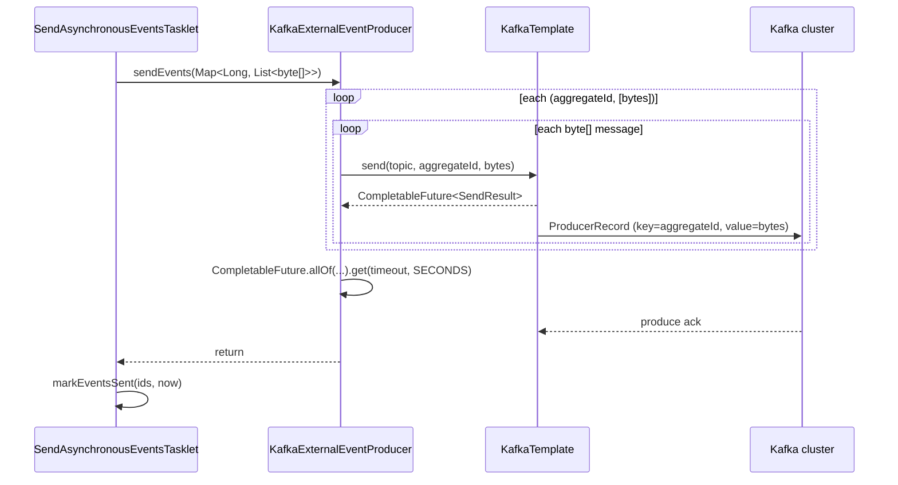

When `fineract.events.external.producer.kafka.enabled=true`, Apache Fineract activates `KafkaExternalEventProducer` and the surrounding Kafka beans. The producer reuses Spring Kafka's `KafkaTemplate<Long, byte[]>` — the **key** is the event's `aggregate_root_id` (so per-aggregate ordering survives partitioning), the **value** is the serialized `MessageV1` Avro envelope. A separate Spring configuration optionally creates the destination topic at startup with the configured partition and replica counts. This page walks through both the producer code and the wiring around it.

<Note>
The Kafka producer is the recommended transport when downstream consumers need partitioned ordering, replay, or horizontal scaling. The same `ExternalEventProducer` SPI is implemented by `JMSMultiExternalEventProducer` ([Event Producer (JMS)](/events/event-producer-jms)) and the no-op default — the send job (`SendAsynchronousEventsTasklet`) is agnostic about which one is active.
</Note>

## Source

```java
// fineract-provider/src/main/java/org/apache/fineract/infrastructure/event/external/producer/kafka/KafkaExternalEventProducer.java
@Component
@Slf4j
@ConditionalOnProperty(value = "fineract.events.external.producer.kafka.enabled", havingValue = "true")
@AllArgsConstructor
public class KafkaExternalEventProducer implements ExternalEventProducer {

    @Autowired
    private KafkaTemplate<Long, byte[]> externalEventsKafkaTemplate;

    @Autowired
    private FineractProperties fineractProperties;

    @Override
    public void sendEvents(Map<Long, List<byte[]>> partitions) throws AcknowledgementTimeoutException {
        FineractProperties.FineractExternalEventsProducerKafkaProperties kafkaProperties =
            fineractProperties.getEvents().getExternal().getProducer().getKafka();
        String topicName = kafkaProperties.getTopic().getName();
        List<CompletableFuture<SendResult<Long, byte[]>>> sendResults = new ArrayList<>();
        measure(() -> {
            for (Map.Entry<Long, List<byte[]>> entry : partitions.entrySet()) {
                for (byte[] message : entry.getValue()) {
                    sendResults.add(externalEventsKafkaTemplate.send(topicName, entry.getKey(), message));
                }
            }
            try {
                CompletableFuture<Void> allOf =
                    CompletableFuture.allOf(sendResults.toArray(new CompletableFuture[0]));
                allOf.get(kafkaProperties.getTimeoutInSeconds(), TimeUnit.SECONDS);
            } catch (Exception exception) {
                throw new RuntimeException("Could not send the messages", exception);
            }
        }, timeTaken -> {
            if (log.isDebugEnabled()) {
                int eventCount = partitions.values().stream().map(Collection::size).reduce(0, Integer::sum);
                int msgPerSec = (int) (((double) eventCount / timeTaken.toMillis()) * 1000);
                log.debug("Sent messages with {} msg/s", msgPerSec);
            }
        });
    }
}
```

Compared with the JMS producer, this is intentionally lighter — Spring Kafka already provides batching, async I/O, and connection pooling inside `KafkaTemplate`. The producer just enumerates the partition map and lets Kafka do the rest.

## Spring wiring

`fineract-provider/.../config/ExternalEventKafkaConfiguration.java`:

```java
@Configuration
@ConditionalOnProperty(value = "fineract.events.external.producer.kafka.enabled", havingValue = "true")
public class ExternalEventKafkaConfiguration {

    @Autowired private FineractProperties fineractProperties;

    @Bean
    public ProducerFactory<Long, byte[]> externalEventsProducerFactory() {
        FineractProperties.FineractExternalEventsProducerKafkaProperties kafkaProp =
            fineractProperties.getEvents().getExternal().getProducer().getKafka();
        Map<String, Object> props = new HashMap<>(kafkaProp.getProducer().getExtraPropertiesMap());
        props.put(BOOTSTRAP_SERVERS_CONFIG, kafkaProp.getBootstrapServers());
        props.put(KEY_SERIALIZER_CLASS_CONFIG, LongSerializer.class);
        props.put(VALUE_SERIALIZER_CLASS_CONFIG, ByteArraySerializer.class);
        return new DefaultKafkaProducerFactory<>(props);
    }

    @Bean
    public KafkaTemplate<Long, byte[]> externalEventsKafkaTemplate(
            ProducerFactory<Long, byte[]> externalEventsProducerFactory) {
        return new KafkaTemplate<>(externalEventsProducerFactory);
    }
}
```

| Bean                          | Type                                | Notes                                                              |
| ----------------------------- | ----------------------------------- | ------------------------------------------------------------------ |
| `externalEventsProducerFactory` | `DefaultKafkaProducerFactory<Long, byte[]>` | Long keys, byte[] values, extra props merged from configuration  |
| `externalEventsKafkaTemplate` | `KafkaTemplate<Long, byte[]>`       | Injected into `KafkaExternalEventProducer`                         |

### Topic auto-create

`fineract-provider/.../config/KafkaExternalEventTopicConfig.java`:

```java
@Configuration
@Conditional(ExternalEventsKafkaTopicAutoCreateCondition.class)
public class KafkaExternalEventTopicConfig {

    @Autowired private FineractProperties fineractProperties;

    @Bean
    public KafkaAdmin admin() {
        Map<String, Object> props = new HashMap<>(
            fineractProperties.getEvents().getExternal().getProducer().getKafka()
                .getAdmin().getExtraPropertiesMap());
        props.put(BOOTSTRAP_SERVERS_CONFIG,
            fineractProperties.getEvents().getExternal().getProducer().getKafka().getBootstrapServers());
        return new KafkaAdmin(props);
    }

    @Bean
    public NewTopic externalEventsTopic() {
        FineractProperties.KafkaTopicProperties topicProperties =
            fineractProperties.getEvents().getExternal().getProducer().getKafka().getTopic();
        return TopicBuilder.name(topicProperties.getName())
                           .partitions(topicProperties.getPartitions())
                           .replicas(topicProperties.getReplicas())
                           .build();
    }
}
```

Gated by an `AllNestedConditions`:

```java
public class ExternalEventsKafkaTopicAutoCreateCondition extends AllNestedConditions {
    public ExternalEventsKafkaTopicAutoCreateCondition() { super(ConfigurationPhase.PARSE_CONFIGURATION); }

    @ConditionalOnProperty(value = "fineract.events.external.producer.kafka.enabled", havingValue = "true")
    static class ExternalEventsKafkaCondition {}

    @ConditionalOnProperty(value = "fineract.events.external.producer.kafka.topic.auto-create", havingValue = "true")
    static class TopicAutoCreateCondition {}
}
```

Both flags must be `true` for `KafkaAdmin` + `NewTopic` to be created. In managed-Kafka deployments where the operator pre-creates topics, set `…kafka.topic.auto-create=false` and the auto-create config is skipped entirely.

## Properties

Defaults from `fineract-provider/src/main/resources/application.properties`:

| Property                                                                                | Default          | Effect                                                              |
| --------------------------------------------------------------------------------------- | ---------------- | ------------------------------------------------------------------- |
| `fineract.events.external.producer.kafka.enabled`                                       | `false`          | Master switch                                                       |
| `fineract.events.external.producer.kafka.timeout-in-seconds`                            | `10`             | `CompletableFuture.allOf(...).get(timeout, SECONDS)` for batch send |
| `fineract.events.external.producer.kafka.topic.auto-create`                             | `true`           | When true (and `enabled=true`) creates topic at startup             |
| `fineract.events.external.producer.kafka.topic.name`                                    | `external-events`| Target topic                                                        |
| `fineract.events.external.producer.kafka.topic.replicas`                                | `1`              | Used only when auto-creating                                        |
| `fineract.events.external.producer.kafka.topic.partitions`                              | `10`             | Used only when auto-creating                                        |
| `fineract.events.external.producer.kafka.bootstrap-servers`                             | `localhost:9092` | Comma-separated broker list                                         |
| `fineract.events.external.producer.kafka.producer.extra-properties`                     | `linger.ms=10|batch.size=16384` | Free-form producer config (separator `|`, key/value `=`) |
| `fineract.events.external.producer.kafka.producer.extra-properties-separator`           | `|`              | Used to parse the extras line                                       |
| `fineract.events.external.producer.kafka.producer.extra-properties-key-value-separator` | `=`              | Used to parse the extras line                                       |
| `fineract.events.external.producer.kafka.admin.extra-properties`                        | (empty)          | Same shape, applied to `KafkaAdmin`                                 |
| `fineract.events.external.producer.kafka.admin.extra-properties-separator`              | `|`              |                                                                     |
| `fineract.events.external.producer.kafka.admin.extra-properties-key-value-separator`    | `=`              |                                                                     |

`getExtraPropertiesMap()` returns a parsed `Map<String, Object>` of the producer-side extras, which is then merged with the hard-coded keys:

| Hard-coded                  | Set to                          |
| --------------------------- | ------------------------------- |
| `bootstrap.servers`         | `bootstrapServers`              |
| `key.serializer`            | `org.apache.kafka.common.serialization.LongSerializer` |
| `value.serializer`          | `org.apache.kafka.common.serialization.ByteArraySerializer` |

For TLS / SASL, add the corresponding `security.protocol`, `sasl.mechanism`, `ssl.truststore.location`, … keys via `extra-properties`. For example:

```
FINERACT_EXTERNAL_EVENTS_KAFKA_PRODUCER_EXTRA_PROPERTIES=\
  linger.ms=10|batch.size=16384|security.protocol=SASL_SSL|sasl.mechanism=PLAIN|\
  sasl.jaas.config=org.apache.kafka.common.security.plain.PlainLoginModule required username="u" password="p";
```

## Send semantics

### Key choice

```java
externalEventsKafkaTemplate.send(topicName, entry.getKey(), message);
```

`entry.getKey()` is the partition map key produced by `SendAsynchronousEventsTasklet.generatePartitions`:

```java
Map<Long, List<ExternalEventView>> initialPartitions = queuedEvents.stream().collect(groupingBy(externalEvent -> {
    Long aggregateRootId = externalEvent.getAggregateRootId();
    if (aggregateRootId == null) aggregateRootId = -1L;
    return aggregateRootId;
}));
```

| `aggregate_root_id`     | Kafka partition assignment                                                  |
| ----------------------- | --------------------------------------------------------------------------- |
| `123L` (Loan 123 etc.)  | `hash(123) % partitions` — same partition every time → preserved per-aggregate ordering |
| `null` → bucketed `-1L` | `hash(-1) % partitions` — all aggregate-less events land in one partition (may become a hot partition for high-volume types) |

### Async wait

The producer pushes every `byte[]` immediately, collects the futures, and `CompletableFuture.allOf(…).get(timeout, SECONDS)`:

```java
CompletableFuture<Void> allOf = CompletableFuture.allOf(sendResults.toArray(new CompletableFuture[0]));
allOf.get(kafkaProperties.getTimeoutInSeconds(), TimeUnit.SECONDS);
```

If any send hasn't ack'd before the timeout, `get` throws `TimeoutException`, which is wrapped as `RuntimeException("Could not send the messages", …)` and bubbled up to the send-job tasklet. The tasklet logs the error and does **not** call `markEventsSent` — the rows stay `TO_BE_SENT` for the next run.

| Outcome                                  | Effect                                                          |
| ---------------------------------------- | --------------------------------------------------------------- |
| All sends ack within timeout             | Tasklet proceeds to `markEventsSent(ids, now)`                  |
| At least one send fails or times out     | Wrapped `RuntimeException`; rows remain `TO_BE_SENT`; next run retries from the beginning of the batch |
| Producer connection drop and reconnect   | Spring Kafka's `KafkaTemplate` handles internally; visible only if the send still times out |

There is **no internal dedup**. The send job re-reads `WHERE status = 'TO_BE_SENT'`, so the same messages are sent again. Consumers must dedupe by `MessageV1.idempotencyKey`. See [Event Idempotency](/events/event-idempotency).

## Message body

Identical to the JMS path — `MessageFactory.createMessage(ExternalEventView event)` builds the `MessageV1` envelope and `ByteBufferConverter` turns it into `byte[]`:

| Avro field         | Value                                            |
| ------------------ | ------------------------------------------------ |
| `id`               | `m_external_event.id`                            |
| `source`           | Per-JVM `UUID.randomUUID()` (logged at startup)  |
| `type`             | `m_external_event.type`                          |
| `category`         | `m_external_event.category`                      |
| `createdAt`        | ISO-LOCAL-DATE-TIME in UTC                       |
| `businessDate`     | ISO-LOCAL-DATE                                   |
| `tenantId`         | Active tenant identifier                         |
| `idempotencyKey`   | UUID string                                      |
| `dataschema`       | Fully-qualified inner Avro class (e.g. `org.apache.fineract.avro.loan.v1.LoanAccountDataV1`) |
| `data`             | Inner Avro bytes                                 |

## Sequence diagram



## Operational guidance

### Topic configuration in production

The auto-create defaults (10 partitions, RF=1) are fine for development. For production with a managed broker:

1. Set `fineract.events.external.producer.kafka.topic.auto-create=false`.
2. Pre-provision the topic with operations-policy-compliant defaults — e.g. RF=3, `min.insync.replicas=2`, `cleanup.policy=delete`, `retention.ms` aligned with the [purge job](/events/purge-events-job) cadence.
3. Set partitions based on consumer parallelism — Kafka's per-partition ordering means downstream consumers can scale to at most `partitions` parallel processors per consumer group.

### Throughput vs latency

`extra-properties=linger.ms=10|batch.size=16384` defaults to small-batch, low-latency. Increase `linger.ms` (e.g. to 50) and `batch.size` (e.g. to 65536) for throughput-heavy COB fan-outs at the cost of a few extra ms per individual event.

### Securing the producer

- For SASL/PLAIN over TLS, append `security.protocol=SASL_SSL|sasl.mechanism=PLAIN|sasl.jaas.config=…` to `extra-properties`.
- For mTLS, point `ssl.keystore.location`, `ssl.keystore.password`, `ssl.truststore.location`, `ssl.truststore.password` at the mounted secret paths.
- Make sure the **admin** `extra-properties` mirrors the security config when `topic.auto-create=true`, otherwise the admin client won't connect.

### Observability

Each successful batch logs (at DEBUG):

```
Sent messages with <msg/s> msg/s
```

Use Spring Kafka's metrics (`spring.kafka.producer.metrics`) — wired automatically through Micrometer — to track `record-send-rate`, `request-latency-avg`, `record-error-rate`, and `buffer-available-bytes`.

## Comparison with the JMS producer

| Aspect                    | JMS                                                            | Kafka                                                                |
| ------------------------- | -------------------------------------------------------------- | -------------------------------------------------------------------- |
| Parallelism source        | Multiple `MessageProducer` sessions + executor pool             | Internal `KafkaTemplate` async I/O                                   |
| Ordering preservation     | Consistent hash on `aggregate_root_id` to a producer slot       | Kafka partition assignment by key (`aggregate_root_id`)              |
| Acknowledgement           | Synchronous per send (or fully async if `async-send-enabled`)   | Synchronous-on-batch via `CompletableFuture.allOf(...).get(timeout)` |
| Failure boundary          | Per session                                                     | Per batch                                                            |
| Topic vs queue            | Topic (fan-out) or queue (work distribution)                    | Topic only — consumer-group semantics handle fan-out vs work-share   |
| Auto-create support       | Broker-side topic / queue auto-create depends on ActiveMQ config| Built-in via `KafkaAdmin` + `NewTopic`                               |
| Default deployment        | Co-located ActiveMQ broker                                      | External managed Kafka cluster                                       |

## Related reading

- [Events Overview](/events/overview)
- [Event Producer (JMS)](/events/event-producer-jms)
- [External Event Domain](/events/external-event-domain)
- [Purge & Send Jobs](/events/purge-events-job)
- [Event Idempotency](/events/event-idempotency)
- [Avro Schemas](/events/avro-schemas)
- [Core: External Events](/core/event-external)
- [External Event Flow](/flows/external-event-publishing-flow)
- [Spring Batch Manager/Worker](/jobs/spring-batch-manager-worker)
