Every `BusinessEvent` that survives the per-type allow-list reaches `ExternalEventService.postEvent`, which immediately looks up a `BusinessEventSerializer` capable of turning the domain payload into a versioned Avro DTO. Apache Fineract ships one serializer per event family (loan, savings, share, client, document, …), and each one delegates the field mapping to a MapStruct interface — the `DataV1Mapper` pattern. The result is a `ByteBufferSerializable` Avro record that is then byte-buffered and stored in `m_external_event.data` next to the schema's fully-qualified class name. This page walks the full encoding pipeline, lists every serializer/mapper pair, explains the custom-data hook, and shows the support utilities (`AvroDateTimeMapper`, `ExternalIdMapper`, `ByteBufferConverter`).

<Note>
There is no schema registry. The receiving side learns which Avro schema to decode from `MessageV1.dataschema` — the fully-qualified Java class name of the inner record. Schemas live in `fineract-avro-schemas` and are generated at build time; see [Avro Schemas](/events/avro-schemas).
</Note>

## SPI

```java
// fineract-core/src/main/java/org/apache/fineract/infrastructure/event/external/service/serialization/serializer/BusinessEventSerializer.java
public interface BusinessEventSerializer {
    <T> boolean canSerialize(BusinessEvent<T> event);
    Class<? extends GenericContainer> getSupportedSchema();
    <T> ByteBufferSerializable toAvroDTO(BusinessEvent<T> rawEvent);
}
```

| Method                | Contract                                                                                          |
| --------------------- | ------------------------------------------------------------------------------------------------- |
| `canSerialize`        | Returns true for every event the serializer handles. Most implementations test `instanceof` against the family base class. |
| `getSupportedSchema`  | Returns the **Java class generated from the `.avsc`** (e.g. `LoanAccountDataV1.class`). The fully-qualified name is stored in `m_external_event.schema`. |
| `toAvroDTO`           | Walks the domain payload, fetches additional data from read-platform services, and returns an Avro record implementing `ByteBufferSerializable` (the marker interface generated by the Fineract Avro template). |

## Factory and dispatch

```java
// service/serialization/serializer/BusinessEventSerializerFactory.java
@Component
@RequiredArgsConstructor
public class BusinessEventSerializerFactory {
    private final List<BusinessEventSerializer> serializers;
    public <T> BusinessEventSerializer create(BusinessEvent<T> event) {
        for (BusinessEventSerializer serializer : serializers) {
            if (serializer.canSerialize(event)) return serializer;
        }
        throw new IllegalStateException("There's no serializer that's capable of serializing a "
                + event.getClass().getSimpleName());
    }
}
```

Spring injects every `BusinessEventSerializer` bean discovered on the classpath; the factory returns the first one whose `canSerialize` returns true. The order is **bean creation order**, which in practice is alphabetical-by-class within a `@ComponentScan` — so when registering a new serializer make sure its `canSerialize` is strict enough that overlap doesn't matter.

## Encoding pipeline

```mermaid
flowchart LR
    e[BusinessEvent T] --> f[BusinessEventSerializerFactory.create]
    f --> s[BusinessEventSerializer.toAvroDTO]
    s --> rps[Read Platform Service\nLoanReadPlatformService etc.]
    rps --> data[*Data DTO\nLoanAccountData etc.]
    data --> m[*DataMapper\nMapStruct interface]
    m --> avro[*DataV1\norg.apache.fineract.avro.*]
    avro --> custom[AbstractBusinessEventWithCustomData\nSerializer.collectCustomData]
    custom --> en[DataEnricherProcessor.enrich]
    en --> tb[avro.toByteBuffer]
    tb --> bbc[ByteBufferConverter.convert]
    bbc --> bytes[byte at]
    bytes --> row[(m_external_event.data)]
```



The single source of truth for that pipeline is `ExternalEventService.handleRegularBusinessEvent`:

```java
private <T> ExternalEvent handleRegularBusinessEvent(BusinessEvent<T> event) throws IOException {
    String eventType = event.getType();
    String eventCategory = event.getCategory();
    String idempotencyKey = idempotencyKeyGenerator.generate(event);
    BusinessEventSerializer serializer = serializerFactory.create(event);
    String schema = serializer.getSupportedSchema().getName();
    ByteBufferSerializable avroDto = dataEnricherProcessor.enrich(serializer.toAvroDTO(event));
    ByteBuffer buffer = avroDto.toByteBuffer();
    byte[] data = byteBufferConverter.convert(buffer);
    Long aggregateRootId = event.getAggregateRootId();
    return new ExternalEvent(eventType, eventCategory, schema, data, idempotencyKey, aggregateRootId);
}
```

## The simplest serializer

```java
// fineract-provider/.../serializer/client/ClientBusinessEventSerializer.java
@Component
@RequiredArgsConstructor
public class ClientBusinessEventSerializer implements BusinessEventSerializer {
    private final ClientReadPlatformService service;
    private final ClientDataMapper mapper;

    @Override
    public <T> boolean canSerialize(BusinessEvent<T> event) {
        return event instanceof ClientBusinessEvent;
    }

    @Override
    public <T> ByteBufferSerializable toAvroDTO(BusinessEvent<T> rawEvent) {
        ClientBusinessEvent event = (ClientBusinessEvent) rawEvent;
        ClientData data = service.retrieveOne(event.get().getId());
        return mapper.map(data);
    }

    @Override
    public Class<? extends GenericContainer> getSupportedSchema() { return ClientDataV1.class; }
}
```

Three pieces:

1. **Type check** against the family abstract base.
2. **Read-platform call** to materialise a full DTO (read again **from the database**, not from the event payload — this is what makes the second `entityManager.flush()` in `ExternalEventService.postEvent` important).
3. **MapStruct mapping** from DTO to Avro record.

## DataV1 mapper pattern

```java
// fineract-provider/.../mapper/loan/LoanAccountDataMapper.java
@Mapper(config = AvroMapperConfig.class,
        uses = { LoanTransactionDataMapper.class, LoanChargeDataMapper.class, LoanDelinquencyPausePeriodMapper.class })
public interface LoanAccountDataMapper {

    @Mapping(source = "loanProductLinkedToFloatingRate", target = "isLoanProductLinkedToFloatingRate")
    @Mapping(source = "floatingInterestRate",            target = "isFloatingInterestRate")
    @Mapping(source = "topup",                            target = "isTopup")
    @Mapping(source = "interestRecalculationEnabled",     target = "isInterestRecalculationEnabled")
    @Mapping(target = "externalOwnerId", ignore = true)
    @Mapping(target = "settlementDate", ignore = true)
    @Mapping(target = "purchasePriceRatio", ignore = true)
    @Mapping(target = "delinquent.installmentDelinquencyBuckets", ignore = true)
    @Mapping(target = "customData", ignore = true)
    @Mapping(target = "product.customData", ignore = true)
    @Mapping(target = "originators", ignore = true)
    LoanAccountDataV1 map(LoanAccountData source);
}
```

Every mapper:

- Uses `AvroMapperConfig` so it shares the same `ComponentModel.SPRING`, strict `unmappedTargetPolicy = ERROR`, and the same support mappers (`AvroDateTimeMapper`, `AvroMonthDayMapper`, `ExternalIdMapper`).
- Adds `uses = { … }` for any nested object mappers needed.
- Uses `@Mapping(source = "…", target = "is…")` to translate Java getter conventions (`isFlag` / `getFlag`) into Avro field names that follow camelCase with the `is` prefix on booleans.
- Uses `@Mapping(target = "…", ignore = true)` for **fields filled in post-mapping by the serializer itself** — custom data, delinquency buckets, originator info, etc.

The shared MapStruct config:

```java
// fineract-core/.../mapper/support/AvroMapperConfig.java
@MapperConfig(
    componentModel = MappingConstants.ComponentModel.SPRING,
    unmappedTargetPolicy = ReportingPolicy.ERROR,
    builder = @Builder(disableBuilder = true),
    uses = { AvroDateTimeMapper.class, AvroMonthDayMapper.class, ExternalIdMapper.class },
    injectionStrategy = InjectionStrategy.CONSTRUCTOR)
public class AvroMapperConfig {}
```

`unmappedTargetPolicy = ERROR` is the strictness lever — Fineract refuses to compile a mapper that leaves an Avro field unset unless that field is explicitly `ignore = true`. This forces every schema-evolution to be matched in the mapper.

## Support mappers

| Class                               | Type signature                                       | Used for                                        |
| ----------------------------------- | ---------------------------------------------------- | ----------------------------------------------- |
| `AvroDateTimeMapper`                | `OffsetDateTime → String`, `LocalDateTime → String`, `LocalDate → String` | ISO-formatted strings in Avro       |
| `AvroMonthDayMapper`                | `MonthDay → String`                                  | ISO month-day strings                           |
| `ExternalIdMapper`                  | `ExternalId → String`                                | Unwraps the `ExternalId` value object           |

Source for `AvroDateTimeMapper`:

```java
@Component
public class AvroDateTimeMapper {
    public String mapOffsetDateTime(OffsetDateTime source) {
        return source == null ? null : DateTimeFormatter.ISO_OFFSET_DATE_TIME.format(source);
    }
    public String mapLocalDateTime(LocalDateTime source) {
        return source == null ? null : DateTimeFormatter.ISO_LOCAL_DATE_TIME.format(source);
    }
    public String mapLocalDate(LocalDate source) {
        return source == null ? null : DateTimeFormatter.ISO_LOCAL_DATE.format(source);
    }
}
```

`ExternalIdMapper`:

```java
@Component
public class ExternalIdMapper {
    public String mapExternalId(ExternalId source) {
        return source == null ? null : source.getValue();
    }
}
```

## Serializer catalogue

### `fineract-provider` — the active set

| Family   | Serializer                                                            | Inner Avro schema                    | DataV1 mapper                                            |
| -------- | --------------------------------------------------------------------- | ------------------------------------ | -------------------------------------------------------- |
| Client   | `ClientBusinessEventSerializer`                                       | `ClientDataV1`                       | `ClientDataMapper`                                       |
| Document | `DocumentBusinessEventSerializer`                                     | `DocumentDataV1`                     | `DocumentDataMapper`                                     |
| Fixed deposit | `FixedDepositAccountBusinessEventSerializer`                     | `FixedDepositAccountDataV1`          | `FixedDepositAccountDataMapper`                          |
| Group    | `GroupsBusinessEventSerializer`                                       | `GroupGeneralDataV1`                 | (inline; see source)                                     |
| Loan (base) | `LoanBusinessEventSerializer`                                       | `LoanAccountDataV1`                  | `LoanAccountDataMapper` + `LoanInstallmentLevelDelinquencyEventProducer` |
| Loan transactions | `LoanTransactionBusinessEventSerializer`                       | `LoanTransactionDataV1`              | `LoanTransactionDataMapper`                              |
| Loan adjust transaction | `LoanAdjustTransactionBusinessEventSerializer`           | `LoanTransactionAdjustmentDataV1`    | `LoanTransactionDataMapper`                              |
| Loan repayment | `LoanRepaymentBusinessEventSerializer`                          | `LoanRepaymentDueDataV1`             | (custom; see source)                                     |
| Loan charge | `LoanChargeBusinessEventSerializer`                                | `LoanChargeDataV1`                   | `LoanChargeDataMapper`                                   |
| Loan charge deleted | `LoanChargeDeletedBusinessEventSerializer`                  | `LoanChargeDeletedV1`                | `LoanChargeDataMapper`                                   |
| Loan charge-off | `LoanChargeOffBusinessEventSerializer`                          | `LoanAccountDataV1`                  | `LoanAccountDataMapper`                                  |
| Loan delinquency range | `LoanDelinquencyRangeChangeBusinessEventSerializer`      | `LoanAccountDelinquencyRangeDataV1`  | `LoanDelinquencyRangeDataMapper`                         |
| Loan product | `LoanProductBusinessEventSerializer`                              | `LoanProductDataV1`                  | `LoanProductDataMapper`                                  |
| Loan accounts stayed locked | `LoanAccountsStayedLockedBusinessEventSerializer`     | `LoanAccountsStayedLockedDataV1`     | `LoanAccountsStayedLockedDataMapper`                     |
| Savings  | `SavingsAccountBusinessEventSerializer`                               | `SavingsAccountDataV1`               | `SavingsAccountDataMapper`                               |
| Savings transactions | `SavingsAccountTransactionBusinessEventSerializer`        | `SavingsAccountTransactionDataV1`    | `SavingsAccountTransactionDataMapper`                    |
| Savings accounts stayed locked | `SavingsAccountsStayedLockedBusinessEventSerializer`| `SavingsAccountsStayedLockedDataV1`  | `SavingsAccountsStayedLockedDataMapper`                  |
| Recurring deposit | `RecurringDepositAccountBusinessEventSerializer`               | `RecurringDepositAccountDataV1`      | `RecurringDepositAccountDataMapper`                      |
| Share account | `ShareAccountBusinessEventSerializer`                              | `ShareAccountDataV1`                 | `ShareAccountDataMapper`                                 |
| Share product dividend | `ShareProductDividentsCreateBusinessEventSerializer`      | `ShareProductDataV1`                 | `ShareProductDataMapper`                                 |

### `fineract-investor`

| Serializer                                | Schema                            | Page                                     |
| ----------------------------------------- | --------------------------------- | ---------------------------------------- |
| `LoanOwnershipTransferBusinessEventSerializer` | `LoanOwnershipTransferDataV1` | [Investor Events](/investor/investor-events) |

`fineract-investor` also ships custom-data serializers that piggyback onto `LoanBusinessEvent` — see the next section.

## Custom-data hook — `AbstractBusinessEventWithCustomDataSerializer`

Some serializers want to attach data they don't own. The mechanism is a per-serializer list of `ExternalEventCustomDataSerializer`:

```java
// fineract-core/.../serializer/AbstractBusinessEventWithCustomDataSerializer.java
public abstract class AbstractBusinessEventWithCustomDataSerializer<T extends BusinessEvent<?>>
        implements BusinessEventSerializer {

    protected Map<String, ByteBuffer> collectCustomData(final T event) {
        return getExternalEventCustomDataSerializers().stream().collect(HashMap::new, (map, ser) -> {
            ByteBuffer buffer = ser.serialize(event);
            if (buffer != null) map.put(ser.key(), buffer);
        }, HashMap::putAll);
    }

    protected abstract List<ExternalEventCustomDataSerializer<T>> getExternalEventCustomDataSerializers();
}

public interface ExternalEventCustomDataSerializer<T extends BusinessEvent<?>> {
    ByteBuffer serialize(T event);
    String key();
}
```

A serializer that extends this base — like `LoanBusinessEventSerializer` — calls `collectCustomData(event)` and sets the resulting `Map<String, ByteBuffer>` into the Avro DTO:

```java
// fineract-provider/.../serializer/loan/LoanBusinessEventSerializer.java (excerpt)
final LoanAccountDataV1 result = mapper.map(data);
result.getDelinquent().setInstallmentDelinquencyBuckets(installmentsDelinquencyData);
result.setCustomData(collectCustomData(event));
return result;
```

This is what `LoanInstallmentLevelDelinquencyEventProducer`, the investor module, and any consumer-side extension use to inject auxiliary payloads under named keys without changing the canonical schema.

## `DataEnricherProcessor` — the post-serializer extension point

Between the serializer and the byte buffer, `ExternalEventService.postEvent` calls:

```java
ByteBufferSerializable avroDto = dataEnricherProcessor.enrich(serializer.toAvroDTO(event));
```

`DataEnricherProcessor` (in `fineract-core/.../core/service/`) walks every registered `DataEnricher` bean and lets it mutate the Avro DTO before it's frozen. The classic use case is the **investor data enricher** — it adds investor / originator info into a regular `LoanAccountDataV1` without requiring the loan serializer to know investor exists.

## `ByteBufferConverter` — the final hop

```java
// fineract-core/.../service/support/ByteBufferConverter.java
@Component
public class ByteBufferConverter {
    public byte[] convert(ByteBuffer source) { … }
    public ByteBuffer convert(byte[] source) { … }
}
```

A trivial helper that turns Avro's `toByteBuffer()` output into a plain `byte[]` for storage and converts back for reads. The reverse path is used in test mode by `InternalExternalEventService.convertToReadableFormat`.

## Avro generation

Avro records are generated at build time by `fineract-avro-schemas` (see [Avro Schemas](/events/avro-schemas)):

| Build artifact                                                                          | Source                                            |
| --------------------------------------------------------------------------------------- | ------------------------------------------------- |
| `org.apache.fineract.avro.MessageV1`                                                    | `fineract-avro-schemas/src/main/avro/MessageV1.avsc` |
| `org.apache.fineract.avro.BulkMessageItemV1`                                            | `BulkMessageItemV1.avsc`                          |
| `org.apache.fineract.avro.BulkMessagePayloadV1`                                         | `BulkMessagePayloadV1.avsc`                       |
| `org.apache.fineract.avro.loan.v1.LoanAccountDataV1`                                    | `loan/v1/LoanAccountDataV1.avsc`                  |
| `org.apache.fineract.avro.savings.v1.SavingsAccountDataV1`                              | `savings/v1/SavingsAccountDataV1.avsc`            |
| `org.apache.fineract.avro.client.v1.ClientDataV1`                                       | `client/v1/ClientDataV1.avsc`                     |
| (one Java class per `.avsc`)                                                            |                                                   |

Every generated class implements `ByteBufferSerializable` (the marker added by `fineract-avro-schemas/src/main/resources/avro-generator-templates/`), which is what the SPI's return type requires.

## Bulk encoding — `BulkMessageItemFactory`

For a `BulkBusinessEvent`, the outbox writer uses `BulkMessageItemFactory.createBulkMessageItem(id, event)`:

```java
// fineract-core/.../message/BulkMessageItemFactory.java
@Component @RequiredArgsConstructor
public class BulkMessageItemFactory {
    private final BusinessEventSerializerFactory serializerFactory;
    private final ByteBufferConverter byteBufferConverter;
    private final DataEnricherProcessor dataEnricherProcessor;

    public BulkMessageItemV1 createBulkMessageItem(long id, BusinessEvent<?> event) throws IOException {
        BusinessEventSerializer eventSerializer = serializerFactory.create(event);
        ByteBufferSerializable avroDto = dataEnricherProcessor.enrich(eventSerializer.toAvroDTO(event));
        ByteBuffer buffer = avroDto.toByteBuffer();
        byte[] serializedContent = byteBufferConverter.convert(buffer);
        String type = event.getType();
        String category = "nocategory"; // TODO: switch this to the actual category when implemented
        String schema = eventSerializer.getSupportedSchema().getName();
        ByteBuffer data = byteBufferConverter.convert(serializedContent);
        return new BulkMessageItemV1(id, type, category, schema, data);
    }
}
```

A bulk item carries the same `type`, `dataschema`, and `data` triple as a regular row, but inside a `BulkMessagePayloadV1` whose top-level `MessageV1.dataschema = "org.apache.fineract.avro.BulkMessagePayloadV1"`.

## Adding a new serializer — quick recipe

1. Declare the Avro schema `.avsc` in `fineract-avro-schemas/src/main/avro/<module>/v1/<NewThing>DataV1.avsc`. Build to regenerate the Java class.
2. Add the data DTO read service / domain mapping if it doesn't exist (`<NewThing>ReadPlatformService`).
3. Implement a MapStruct mapper that targets `<NewThing>DataV1`:

   ```java
   @Mapper(config = AvroMapperConfig.class)
   public interface NewThingDataMapper {
       @Mapping(target = "customData", ignore = true)
       NewThingDataV1 map(NewThingData source);
   }
   ```

4. Implement the serializer:

   ```java
   @Component @RequiredArgsConstructor
   public class NewThingBusinessEventSerializer implements BusinessEventSerializer {
       private final NewThingReadPlatformService service;
       private final NewThingDataMapper mapper;
       @Override public <T> boolean canSerialize(BusinessEvent<T> e) { return e instanceof NewThingBusinessEvent; }
       @Override public <T> ByteBufferSerializable toAvroDTO(BusinessEvent<T> e) {
           var evt = (NewThingBusinessEvent) e;
           return mapper.map(service.retrieveOne(evt.get().getId()));
       }
       @Override public Class<? extends GenericContainer> getSupportedSchema() { return NewThingDataV1.class; }
   }
   ```

5. Add a Liquibase row to `m_external_event_configuration` for `NewThingBusinessEvent` (default `enabled = false`).
6. Document the schema on [Avro Schemas](/events/avro-schemas).

## Discovery commands

```bash
# All serializers
find /repo -name '*BusinessEventSerializer.java'

# All mappers
find /repo -name '*DataMapper.java' -path '*event/external/service/serialization/mapper*'

# Where DataEnricherProcessor sees enrichers
grep -rn '@Component.*class.*DataEnricher' /repo
```

## Related reading

- [Events Overview](/events/overview)
- [Business Events SPI](/events/business-events)
- [External Event Domain](/events/external-event-domain)
- [Event Idempotency](/events/event-idempotency)
- [Avro Schemas](/events/avro-schemas)
- [Investor Events](/investor/investor-events)
- [Clients Avro Schemas](/clients/avro-schemas)
- [External Event Flow](/flows/external-event-publishing-flow)
