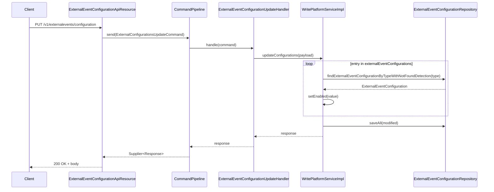

The per-type allow-list that decides which `BusinessEvent`s leave the in-process bus and land in `m_external_event` is exposed as a tiny JAX-RS resource: `ExternalEventConfigurationApiResource`. Two methods — `GET` and `PUT` on `/v1/externalevents/configuration` — read and update one row per event class in `m_external_event_configuration`. The `PUT` flows through Fineract's `CommandPipeline`, so an authenticated request becomes a `Command` envelope, gets routed to `ExternalEventConfigurationUpdateHandler`, and lands in `ExternalEventConfigurationWritePlatformServiceImpl.updateConfigurations`. This page is the full reference for that surface, including the data shapes, validation, error mapping, and the audit/retry decorations.

<Note>
The flag in `m_external_event_configuration.enabled` is read **on every post-notification** by `ExternalBusinessEventConfigurationServiceImpl.isExternalEventConfiguredForPosting`. Changes take effect instantly for new events — no restart, no cache invalidation required.
</Note>

## Resource

```java
// fineract-core/src/main/java/org/apache/fineract/infrastructure/event/external/api/ExternalEventConfigurationApiResource.java
@RequiredArgsConstructor
@Path("/v1/externalevents/configuration")
@Component
@Tag(name = "External event configuration",
     description = "External event configuration enables user to enable/disable event posting to downstream message channel")
public class ExternalEventConfigurationApiResource {

    private final ExternalEventConfigurationReadPlatformService readPlatformService;
    private final CommandPipeline commandPipeline;

    @GET
    @Consumes({ MediaType.APPLICATION_JSON })
    @Produces({ MediaType.APPLICATION_JSON })
    @Operation(summary = "List all external event configurations", description = "")
    public ExternalEventConfigurationResponse getExternalEventConfigurations() {
        return readPlatformService.findAllExternalEventConfigurations();
    }

    @PUT
    @Consumes({ MediaType.APPLICATION_JSON })
    @Produces({ MediaType.APPLICATION_JSON })
    @Operation(summary = "Enable/Disable external events posting", description = "")
    public ExternalEventConfigurationUpdateResponse updateExternalEventConfigurations(
            @Valid ExternalEventConfigurationUpdateRequest request) {
        final var command = new ExternalConfigurationsUpdateCommand();
        command.setPayload(request);
        final Supplier<ExternalEventConfigurationUpdateResponse> response = commandPipeline.send(command);
        return response.get();
    }
}
```

| Item                                | Value                                                                                       |
| ----------------------------------- | ------------------------------------------------------------------------------------------- |
| Base path                           | `/v1/externalevents/configuration`                                                          |
| Media type                          | `application/json`                                                                          |
| OpenAPI tag                         | `External event configuration`                                                              |
| Methods                             | `GET`, `PUT`                                                                                |
| `GET` returns                       | `ExternalEventConfigurationResponse` — full list                                            |
| `PUT` payload                       | `ExternalEventConfigurationUpdateRequest` — `Map<String, Boolean>`                          |
| `PUT` returns                       | `ExternalEventConfigurationUpdateResponse` — changes envelope                               |
| Auth                                | Same as every Fineract API: tenant + user + permission ACL                                  |

## GET — list configurations

### Read path

```java
@Service @RequiredArgsConstructor
public class ExternalEventConfigurationReadPlatformServiceImpl
        implements ExternalEventConfigurationReadPlatformService {
    private final ExternalEventConfigurationRepository repository;
    private final ExternalEventsConfigurationMapper mapper;

    @Override
    public ExternalEventConfigurationResponse findAllExternalEventConfigurations() {
        ExternalEventConfigurationResponse configurationData = new ExternalEventConfigurationResponse();
        List<ExternalEventConfiguration> eventConfigurations = repository.findAll();
        configurationData.setExternalEventConfiguration(mapper.map(eventConfigurations));
        return configurationData;
    }
}
```

A flat `findAll()` returns every row; the mapper converts each entity to `ExternalEventConfigurationItemResponse`.

### Response shape

```java
// data/ExternalEventConfigurationResponse.java
@Builder @Data @NoArgsConstructor @AllArgsConstructor
public class ExternalEventConfigurationResponse implements Serializable {
    // TODO: why wrap things in this useless class?!? Just more boilerplate! Keeping for compatibility...
    private List<ExternalEventConfigurationItemResponse> externalEventConfiguration;
}

// data/ExternalEventConfigurationItemResponse.java
@Builder @Data @NoArgsConstructor @AllArgsConstructor
public class ExternalEventConfigurationItemResponse implements Serializable {
    private String type;
    private boolean enabled;
}
```

(The `TODO` comment is part of the upstream code — the legacy single-key wrapper is preserved for API compatibility.)

Example response:

```json
{
  "externalEventConfiguration": [
    { "type": "LoanApprovedBusinessEvent",      "enabled": false },
    { "type": "LoanDisbursalBusinessEvent",     "enabled": false },
    { "type": "LoanRepaymentBusinessEvent",     "enabled": true  },
    { "type": "ClientCreateBusinessEvent",      "enabled": false },
    { "type": "SavingsActivateBusinessEvent",   "enabled": true  }
  ]
}
```

The list size matches the count of rows in `m_external_event_configuration` — typically 140+ in a fully-loaded deployment (every event class seeded by per-module Liquibase changelogs).

### Curl

```bash
curl -u 'mifos:password' \
     -H 'Fineract-Platform-TenantId: default' \
     -H 'Content-Type: application/json' \
     https://host/fineract-provider/api/v1/externalevents/configuration
```

## PUT — enable / disable a set of types

### Request

```java
// data/ExternalEventConfigurationUpdateRequest.java
@Builder @Data @NoArgsConstructor @AllArgsConstructor
public class ExternalEventConfigurationUpdateRequest implements Serializable {
    @NotNull(message = "{org.apache.fineract.externalevent.configurations.not-null}")
    private Map<String, Boolean> externalEventConfigurations;
}
```

A map keyed by `type` (matches `BusinessEvent.getType()`), valued by the new `enabled` flag. Validation:

- `externalEventConfigurations` field cannot be `null` — Bean Validation `@NotNull` produces a 400 with the i18n message key `org.apache.fineract.externalevent.configurations.not-null`.
- Every key is looked up against the table; an unknown key throws `ExternalEventConfigurationNotFoundException("Configuration not found for external event " + type)` mapped to HTTP 404.

Example body:

```json
{
  "externalEventConfigurations": {
    "LoanApprovedBusinessEvent": true,
    "LoanDisbursalBusinessEvent": true,
    "LoanRepaymentBusinessEvent": true
  }
}
```

### Command pipeline flow

The PUT is wrapped into `ExternalConfigurationsUpdateCommand`:

```java
// command/ExternalConfigurationsUpdateCommand.java
@Data @EqualsAndHashCode(callSuper = true)
public class ExternalConfigurationsUpdateCommand extends Command<ExternalEventConfigurationUpdateRequest> {}
```

`commandPipeline.send(command)` returns a `Supplier<ExternalEventConfigurationUpdateResponse>` whose `.get()` triggers the handler chain (idempotency, retry, audit, transaction):



### Handler

```java
// handler/ExternalEventConfigurationUpdateHandler.java
@Slf4j @Component @RequiredArgsConstructor
public class ExternalEventConfigurationUpdateHandler
        implements CommandHandler<ExternalEventConfigurationUpdateRequest,
                                  ExternalEventConfigurationUpdateResponse> {

    private final ExternalEventConfigurationWritePlatformService writePlatformService;

    @Retry(name = "commandExternalEventConfigurationUpdate", fallbackMethod = "fallback")
    @Transactional
    @Override
    public ExternalEventConfigurationUpdateResponse handle(
            Command<ExternalEventConfigurationUpdateRequest> command) {
        return writePlatformService.updateConfigurations(command.getPayload());
    }

    @Override
    public ExternalEventConfigurationUpdateResponse fallback(
            Command<ExternalEventConfigurationUpdateRequest> command, Throwable t) {
        return CommandHandler.super.fallback(command, t);
    }
}
```

| Decoration             | Effect                                                                                |
| ---------------------- | ------------------------------------------------------------------------------------- |
| `@Transactional`       | The whole update — possibly many rows — commits atomically                            |
| `@Retry(name = "commandExternalEventConfigurationUpdate")` | Resilience4j retry, configured in the platform's `resilience4j.retry` properties — protects against transient DB locks |
| `fallback(command, t)` | Delegates to `CommandHandler.super.fallback` — the default Fineract fallback (re-throw) |

### Write service

```java
// service/ExternalEventConfigurationWritePlatformServiceImpl.java
@Service @AllArgsConstructor
public class ExternalEventConfigurationWritePlatformServiceImpl
        implements ExternalEventConfigurationWritePlatformService {

    private final ExternalEventConfigurationRepository repository;

    @Transactional
    @Override
    public ExternalEventConfigurationUpdateResponse updateConfigurations(
            final ExternalEventConfigurationUpdateRequest request) {
        final var commandConfigurations = request.getExternalEventConfigurations();
        final var changes = new HashMap<String, Object>();
        final var changedConfigurations = new HashMap<String, Boolean>();
        final var modifiedConfigurations = new ArrayList<ExternalEventConfiguration>();

        for (var entry : commandConfigurations.entrySet()) {
            final var configuration = repository
                .findExternalEventConfigurationByTypeWithNotFoundDetection(entry.getKey());
            configuration.setEnabled(entry.getValue());
            changedConfigurations.put(entry.getKey(), entry.getValue());
            modifiedConfigurations.add(configuration);
        }

        if (!modifiedConfigurations.isEmpty()) repository.saveAll(modifiedConfigurations);
        if (!changedConfigurations.isEmpty()) changes.put("externalEventConfigurations", changedConfigurations);

        return ExternalEventConfigurationUpdateResponse.builder().changes(changes).build();
    }
}
```

A few important properties:

| Behaviour                          | Note                                                                                  |
| ---------------------------------- | ------------------------------------------------------------------------------------- |
| Per-key lookup                     | A single unknown type aborts the whole PUT with 404 — no partial commit possible      |
| All-or-nothing transaction         | `@Transactional` on both handler and service                                          |
| `changes` envelope                 | The response always echoes the new values under `changes.externalEventConfigurations` |
| Identity-only writes (no audit on the type) | The PK is `type`; rows are updated in place                                  |

### Response

```java
// data/ExternalEventConfigurationUpdateResponse.java (shape inferred from builder usage)
@Builder
public class ExternalEventConfigurationUpdateResponse {
    private Map<String, Object> changes;   // { "externalEventConfigurations": { type: enabled, … } }
}
```

Example response:

```json
{
  "changes": {
    "externalEventConfigurations": {
      "LoanApprovedBusinessEvent": true,
      "LoanDisbursalBusinessEvent": true,
      "LoanRepaymentBusinessEvent": true
    }
  }
}
```

### Curl

```bash
curl -u 'mifos:password' \
     -H 'Fineract-Platform-TenantId: default' \
     -H 'Content-Type: application/json' \
     -X PUT \
     -d '{ "externalEventConfigurations": {
            "LoanApprovedBusinessEvent": true,
            "LoanDisbursalBusinessEvent": true,
            "LoanRepaymentBusinessEvent": true
          } }' \
     https://host/fineract-provider/api/v1/externalevents/configuration
```

## Errors

| HTTP | Trigger                                                            | Body / message                                                |
| ---- | ------------------------------------------------------------------ | ------------------------------------------------------------- |
| 400  | Missing field `externalEventConfigurations`                        | i18n key `org.apache.fineract.externalevent.configurations.not-null` |
| 400  | Empty body / malformed JSON                                        | Standard JAX-RS bad-request                                   |
| 401  | Missing auth header                                                | Standard Fineract auth failure                                |
| 403  | User lacks permission                                              | Standard authorization failure                                |
| 404  | A key in the map doesn't exist in `m_external_event_configuration` | `Configuration not found for external event <type>`           |
| 500  | Retry exhausted, fallback re-throws                                | Standard error envelope; see logs for the underlying cause    |

The exception class:

```java
// exception/ExternalEventConfigurationNotFoundException.java
public class ExternalEventConfigurationNotFoundException extends RuntimeException {
    public ExternalEventConfigurationNotFoundException() { super("No external events configured"); }
    public ExternalEventConfigurationNotFoundException(final String externalEventType) {
        super("Configuration not found for external event " + externalEventType);
    }
}
```

## Permission

The endpoint is protected by Fineract's standard ACL system — clients need the equivalent permission registered for the resource path (see `c_permission` rows seeded by the platform Liquibase changelog). In a fresh deploy, the role assigned to operators typically holds the `READ_EXTERNALEVENTCONFIGURATION` / `UPDATE_EXTERNALEVENTCONFIGURATION` codes.

## Operational patterns

### Initial enable for a new deployment

A fresh tenant has every row in `m_external_event_configuration` flipped to `false`. To start emitting only the lifecycle events your downstream cares about:

```bash
curl -X PUT … -d '{
  "externalEventConfigurations": {
    "LoanCreatedBusinessEvent": true,
    "LoanApprovedBusinessEvent": true,
    "LoanDisbursalBusinessEvent": true,
    "LoanStatusChangedBusinessEvent": true,
    "LoanRepaymentBusinessEvent": true,
    "ClientCreateBusinessEvent": true,
    "ClientActivateBusinessEvent": true,
    "SavingsActivateBusinessEvent": true
  }
}'
```

### Throttling during incidents

When a downstream consumer is in trouble, **disable the noisy types** rather than turning off `fineract.events.external.enabled` (which kills the whole pipeline). Send a PUT with `false` and the post-notifier stops adding new rows for those types within milliseconds — existing rows in `m_external_event` already queued will still flow once the consumer recovers.

### Allow-list sync from configuration code

Some deployments script the allow-list (Terraform, GitOps) by `GET`-ing the current state, computing the desired flips, and `PUT`-ing them. Because the PUT is idempotent (re-sending the same payload re-applies the same `enabled` flag to the same row), this pattern is safe.

## Resources & permissions table

| Path                                  | Method | Service                                       | Permission code (typical)                  |
| ------------------------------------- | ------ | --------------------------------------------- | ------------------------------------------ |
| `/v1/externalevents/configuration`    | `GET`  | `ExternalEventConfigurationReadPlatformService` | `READ_EXTERNALEVENTCONFIGURATION`        |
| `/v1/externalevents/configuration`    | `PUT`  | `ExternalEventConfigurationWritePlatformService` via `CommandPipeline` | `UPDATE_EXTERNALEVENTCONFIGURATION` |

## Related reading

- [Events Overview](/events/overview)
- [External Event Domain](/events/external-event-domain) — the underlying tables
- [Business Events SPI](/events/business-events) — where the per-type check is enforced
- [Commands Framework](/core/commands-framework)
- [Core: External Events](/core/event-external)
- [Event Producer (JMS)](/events/event-producer-jms)
- [Event Producer (Kafka)](/events/event-producer-kafka)
- [Avro Schemas](/events/avro-schemas)
