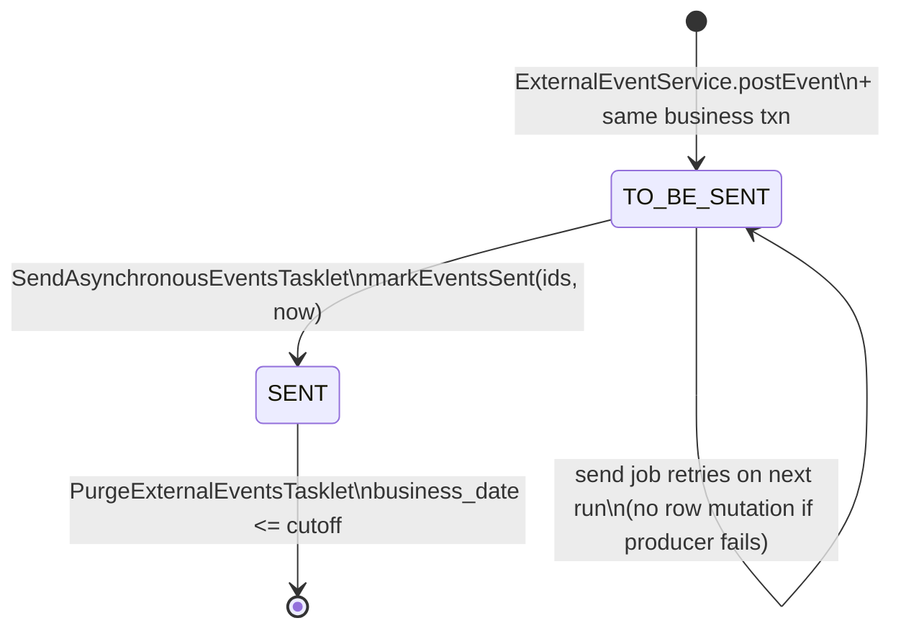

The external event outbox is two tables, four JPA artifacts, and a small repository surface — but it carries every domain fact Apache Fineract emits to downstream systems. This page is the full reference for the entity model: `m_external_event` (the outbox of pending and sent rows), `m_external_event_configuration` (the per-type allow-list), the `ExternalEvent` / `ExternalEventConfiguration` JPA classes, the `ExternalEventView` projection used by the send job, and every repository query that touches them.

<Note>
The outbox row is written **in the same transaction** as the originating business operation. That means a rolled-back operation never produces an external event — the consistency guarantee at the heart of the outbox pattern. See [BusinessEvent dispatcher](/events/business-events) for the call sequence that lands a row in `m_external_event`.
</Note>

## Tables

### `m_external_event` — the outbox

Defined in `fineract-provider/src/main/resources/db/changelog/tenant/parts/0043_add_external_event_table.xml`, then progressively widened by `0045`, `0046`, `0051`, `0085`, `0096`.

| Column            | SQL type        | Nullable | Set by                                                  | Notes                                                       |
| ----------------- | --------------- | -------- | ------------------------------------------------------- | ----------------------------------------------------------- |
| `id`              | `BIGINT`        | NO       | DB auto-increment                                       | Primary key, surrogate                                      |
| `type`            | `VARCHAR(100)`  | NO       | `BusinessEvent.getType()`                               | E.g. `LoanApprovedBusinessEvent`                            |
| `category`        | `VARCHAR(100)`  | NO       | `BusinessEvent.getCategory()`                           | `Loan`, `Savings`, `Client`, `Bulk`, …                      |
| `schema`          | `VARCHAR(…)`    | NO       | `BusinessEventSerializer.getSupportedSchema().getName()`| Fully-qualified Avro class, e.g. `org.apache.fineract.avro.loan.v1.LoanAccountDataV1` |
| `data`            | `BLOB`/`bytea`  | NO       | Serializer output                                       | Lazy-loaded — `@Basic(fetch = FetchType.LAZY)`              |
| `created_at`      | `timestamp`     | NO       | `DateUtils.getAuditOffsetDateTime()`                    | UTC, with-offset                                            |
| `status`          | `VARCHAR(100)`  | NO       | `ExternalEventStatus`                                   | `TO_BE_SENT` or `SENT`                                      |
| `sent_at`         | `timestamp`     | YES      | `markEventsSent`                                        | UTC; null while pending                                     |
| `idempotency_key` | `uuid` / string | NO       | `ExternalEventIdempotencyKeyGenerator.generate`         | Default impl is `UUID.randomUUID().toString()`              |
| `business_date`   | `date`          | NO       | `DateUtils.getBusinessLocalDate()`                      | Used by the purge cutoff                                    |
| `aggregate_root_id` | `BIGINT`      | YES      | `BusinessEvent.getAggregateRootId()`                    | Drives partition key for JMS hashing and Kafka partitioning |

Indexes:

| Index name                          | Column(s)         | Purpose                                            |
| ----------------------------------- | ----------------- | -------------------------------------------------- |
| Primary key                         | `id`              | Standard                                           |
| `m_external_event_status_index`     | `status`          | Polled by the send job: `WHERE status = 'TO_BE_SENT'` |
| `m_external_event_business_date_index` | `business_date` | Used by purge: `WHERE business_date <= ?`         |

### `m_external_event_configuration` — the per-type allow-list

| Column    | SQL type       | Notes                                                                                       |
| --------- | -------------- | ------------------------------------------------------------------------------------------- |
| `type`    | `VARCHAR(100)` | Primary key. Matches `BusinessEvent.getType()`                                              |
| `enabled` | `boolean`      | When `false`, the post-notifier short-circuits and no `m_external_event` row is written     |

Liquibase changelogs across `fineract-loan`, `fineract-investor`, etc., insert one row per event class — that's why `ExternalBusinessEventConfigurationServiceImpl.isExternalEventConfiguredForPosting` calls `findExternalEventConfigurationByTypeWithNotFoundDetection` and throws `ExternalEventConfigurationNotFoundException` if a row is missing.

## JPA entities

### `ExternalEvent`

`fineract-core/src/main/java/org/apache/fineract/infrastructure/event/external/repository/domain/ExternalEvent.java`

```java
@Entity
@Table(name = "m_external_event")
@Getter
@NoArgsConstructor
public class ExternalEvent extends AbstractPersistableCustom<Long> {

    @Column(name = "type", nullable = false)
    private String type;

    @Column(name = "category", nullable = false)
    private String category;

    @Column(name = "schema", nullable = false)
    private String schema;

    @Basic(fetch = FetchType.LAZY)
    @Column(name = "data", nullable = false)
    private byte[] data;

    @Column(name = "created_at", nullable = false)
    private OffsetDateTime createdAt;

    @Enumerated(EnumType.STRING)
    @Column(name = "status", nullable = false)
    @Setter
    private ExternalEventStatus status;

    @Column(name = "sent_at", nullable = true)
    @Setter
    private OffsetDateTime sentAt;

    @Column(name = "idempotency_key", nullable = false)
    private String idempotencyKey;

    @Column(name = "business_date", nullable = false)
    private LocalDate businessDate;

    @Column(name = "aggregate_root_id", nullable = true)
    private Long aggregateRootId;

    public ExternalEvent(String type, String category, String schema, byte[] data,
                         String idempotencyKey, Long aggregateRootId) {
        this.type = type;
        this.category = category;
        this.schema = schema;
        this.data = data;
        this.idempotencyKey = idempotencyKey;
        this.aggregateRootId = aggregateRootId;
        this.createdAt = DateUtils.getAuditOffsetDateTime();
        this.status = ExternalEventStatus.TO_BE_SENT;
        this.businessDate = DateUtils.getBusinessLocalDate();
    }
}
```

A few invariants are baked into the constructor:

| Concern               | Behaviour                                                                                 |
| --------------------- | ----------------------------------------------------------------------------------------- |
| Initial status        | Always `TO_BE_SENT` — the constructor cannot produce a `SENT` row                         |
| Timestamp source      | `DateUtils.getAuditOffsetDateTime()` (UTC, audit clock)                                   |
| Business date source  | `DateUtils.getBusinessLocalDate()` (the tenant's current business date)                   |
| `data` BLOB           | Lazy-fetched, so a polling read doesn't materialise bytes unless explicitly accessed      |
| `setStatus` / `setSentAt` | The only mutable fields — used by `markEventsSent`                                    |

### `ExternalEventStatus`

```java
public enum ExternalEventStatus {
    TO_BE_SENT,
    SENT
}
```

The full lifecycle of a row is `INSERT … TO_BE_SENT` → `UPDATE … SENT, sent_at = now` → `DELETE` once the purge job determines `business_date <= cutoff`.

### `ExternalEventConfiguration`

```java
@Entity
@Table(name = "m_external_event_configuration")
public class ExternalEventConfiguration {
    @Id @Column(name = "type", nullable = false)
    private String type;
    @Column(name = "enabled", nullable = false)
    private boolean enabled = false;
    public void setEnabled(boolean enabled) { this.enabled = enabled; }
}
```

`type` is the natural key (no surrogate ID). Default `enabled = false` matches the Liquibase pattern: a new event family ships with a configuration row that an operator must flip on.

### `ExternalEventView` — projection for the send job

```java
public interface ExternalEventView {
    Long getId();
    String getType();
    String getCategory();
    String getSchema();
    byte[] getData();
    OffsetDateTime getCreatedAt();
    ExternalEventStatus getStatus();
    OffsetDateTime getSentAt();
    String getIdempotencyKey();
    LocalDate getBusinessDate();
    Long getAggregateRootId();
}
```

Spring Data binds this to a **closed projection**: querying with `ExternalEventView` as the return type lets JPA detach the rows so the send job can hold them and operate without keeping the persistence context open.

## Repository surface

### `ExternalEventRepository`

```java
public interface ExternalEventRepository
        extends JpaRepository<ExternalEvent, Long>, JpaSpecificationExecutor<ExternalEvent> {

    // Read for the SEND_ASYNCHRONOUS_EVENTS job
    List<ExternalEventView> findByStatusOrderByBusinessDateAscIdAsc(
            ExternalEventStatus status, Pageable batchSize);

    // PURGE_EXTERNAL_EVENTS job
    @Modifying(flushAutomatically = true)
    @Query("delete from ExternalEvent e where e.status = :status and e.businessDate <= :dateForPurgeCriteria")
    void deleteOlderEventsWithSentStatus(@Param("status") ExternalEventStatus status,
                                         @Param("dateForPurgeCriteria") LocalDate dateForPurgeCriteria);

    // Mark-as-sent inside the send job
    @Modifying
    @Query("UPDATE ExternalEvent e SET e.status = "
         + "  org.apache.fineract.infrastructure.event.external.repository.domain.ExternalEventStatus.SENT, "
         + "e.sentAt = :sentAt WHERE e.id IN :ids")
    void markEventsSent(@Param("ids") List<Long> ids, @Param("sentAt") OffsetDateTime sentAt);
}
```

| Method                                          | Caller                                  | Index it relies on                              |
| ----------------------------------------------- | --------------------------------------- | ----------------------------------------------- |
| `findByStatusOrderByBusinessDateAscIdAsc`       | `SendAsynchronousEventsTasklet.getQueuedEventsBatch` | `m_external_event_status_index` for `WHERE`, then secondary sort on `business_date, id` |
| `deleteOlderEventsWithSentStatus`               | `PurgeExternalEventsTasklet.execute`    | `m_external_event_business_date_index`          |
| `markEventsSent`                                | `SendAsynchronousEventsTasklet.markEventsAsSent` | Primary key on `id`                             |

`JpaSpecificationExecutor` is what the test-mode `InternalExternalEventService` plugs into — it composes specifications on `idempotencyKey`, `type`, `category`, and `aggregateRootId` to let integration tests assert which rows the bus produced.

### `ExternalEventConfigurationRepository` + custom

```java
public interface ExternalEventConfigurationRepository
        extends JpaRepository<ExternalEventConfiguration, String>,
                CustomExternalEventConfigurationRepository {}

public interface CustomExternalEventConfigurationRepository {
    ExternalEventConfiguration findExternalEventConfigurationByTypeWithNotFoundDetection(
            String externalEventType);
}
```

The custom interface lets the impl decide what to throw on miss. `CustomExternalEventConfigurationRepositoryImpl` calls `findById(type)` and raises `ExternalEventConfigurationNotFoundException(type)` (HTTP 404 via the standard exception mapper) when absent.

## How a row is written — `ExternalEventService.postEvent`

`fineract-core/src/main/java/org/apache/fineract/infrastructure/event/external/service/ExternalEventService.java`

```java
@Service @RequiredArgsConstructor @Transactional @Slf4j
public class ExternalEventService {
    private final ExternalEventRepository repository;
    private final ExternalEventIdempotencyKeyGenerator idempotencyKeyGenerator;
    private final BusinessEventSerializerFactory serializerFactory;
    private final ByteBufferConverter byteBufferConverter;
    private final BulkMessageItemFactory bulkMessageItemFactory;
    private final DataEnricherProcessor dataEnricherProcessor;
    private EntityManager entityManager;

    public <T> void postEvent(BusinessEvent<T> event) {
        if (event == null) throw new IllegalArgumentException("event cannot be null");
        try {
            entityManager.flush();
            ExternalEvent externalEvent;
            if (event instanceof BulkBusinessEvent) {
                externalEvent = handleBulkBusinessEvent((BulkBusinessEvent) event);
            } else {
                externalEvent = handleRegularBusinessEvent(event);
            }
            repository.save(externalEvent);
        } catch (IOException e) {
            throw new RuntimeException("Error while serializing event " + event.getClass().getSimpleName(), e);
        }
    }
```

The interesting subtleties:

| Step                              | Why                                                                                            |
| --------------------------------- | ---------------------------------------------------------------------------------------------- |
| `entityManager.flush()`           | Forces any pending domain writes (e.g., the just-disbursed `Loan`) to the database **before** the serializer reads back fresh state. Without this, the serializer could read stale values from the persistence context. |
| Bulk branch                       | Wraps every child into a `BulkMessageItemV1` (see [Avro Schemas](/events/avro-schemas)) and stores the whole batch as a single `BulkMessagePayloadV1` row. |
| Regular branch                    | Picks a `BusinessEventSerializer` via `BusinessEventSerializerFactory.create(event)` and writes the **inner** schema name into `schema`. |
| `dataEnricherProcessor.enrich`    | The data-enricher hook (e.g., investor's custom-data injector) runs between the mapper and the byte-buffer emit. |

### Regular branch

```java
private <T> ExternalEvent handleRegularBusinessEvent(BusinessEvent<T> event) throws IOException {
    String eventType = event.getType();
    String eventCategory = event.getCategory();
    String idempotencyKey = idempotencyKeyGenerator.generate(event);
    BusinessEventSerializer serializer = serializerFactory.create(event);
    String schema = serializer.getSupportedSchema().getName();
    ByteBufferSerializable avroDto = dataEnricherProcessor.enrich(serializer.toAvroDTO(event));
    ByteBuffer buffer = avroDto.toByteBuffer();
    byte[] data = byteBufferConverter.convert(buffer);
    Long aggregateRootId = event.getAggregateRootId();
    return new ExternalEvent(eventType, eventCategory, schema, data, idempotencyKey, aggregateRootId);
}
```

### Bulk branch

```java
private ExternalEvent handleBulkBusinessEvent(BulkBusinessEvent bulkBusinessEvent) throws IOException {
    List<BulkMessageItemV1> messages = new ArrayList<>();
    List<BusinessEvent<?>> events = bulkBusinessEvent.get();
    for (int i = 0; i < events.size(); i++) {
        BusinessEvent<?> event = events.get(i);
        long id = (long) i + 1;
        BulkMessageItemV1 message = bulkMessageItemFactory.createBulkMessageItem(id, event);
        messages.add(message);
    }
    String idempotencyKey = idempotencyKeyGenerator.generate(bulkBusinessEvent);
    BulkMessagePayloadV1 avroDto = new BulkMessagePayloadV1(messages);
    byte[] data = byteBufferConverter.convert(avroDto.toByteBuffer());
    return new ExternalEvent(bulkBusinessEvent.getType(), bulkBusinessEvent.getCategory(),
        BulkMessagePayloadV1.class.getName(), data, idempotencyKey,
        bulkBusinessEvent.getAggregateRootId());
}
```

Note that the outer envelope's `schema` is fixed to `BulkMessagePayloadV1` — consumers always parse that first and then iterate per-item using each `BulkMessageItemV1.dataschema`.

## Row lifecycle diagram



If the producer throws inside the send job, the tasklet logs and exits without marking events sent — the rows stay `TO_BE_SENT` for the next run. The mark-as-sent step happens **after** `eventProducer.sendEvents(partitions)` returns successfully, so at-least-once is the only guarantee.

## Aggregate ID semantics

`getAggregateRootId()` is the only column besides `id` and `business_date` that's indexable by intent. The send job uses it to partition pending rows:

```java
// SendAsynchronousEventsTasklet.generatePartitions
Map<Long, List<ExternalEventView>> initialPartitions = queuedEvents.stream().collect(groupingBy(externalEvent -> {
    Long aggregateRootId = externalEvent.getAggregateRootId();
    if (aggregateRootId == null) {
        aggregateRootId = -1L;
    }
    return aggregateRootId;
}));
```

| `aggregate_root_id`   | Producer effect                                                                              |
| --------------------- | -------------------------------------------------------------------------------------------- |
| `Long > 0`            | All events for that aggregate land on the same JMS producer slot (consistent hash) or Kafka partition (`KafkaTemplate.send(topic, key, value)` with the key) — preserves per-aggregate order |
| `null`                | Bucketed under synthetic `-1L`, then partitioned together                                    |

For consumers this means: **per-aggregate ordering is preserved**, no cross-aggregate ordering is guaranteed, and at-least-once is the delivery contract.

## Querying the outbox by hand

The outbox is just a SQL table, so operations / debugging can be done directly:

```sql
-- Pending tail
SELECT id, type, category, schema, idempotency_key, business_date, aggregate_root_id
FROM m_external_event
WHERE status = 'TO_BE_SENT'
ORDER BY business_date, id
LIMIT 100;

-- Stuck because the producer is offline
SELECT type, count(*) AS pending
FROM m_external_event
WHERE status = 'TO_BE_SENT'
GROUP BY type ORDER BY pending DESC;

-- How big is the SENT backlog vs purge cutoff?
SELECT business_date, count(*) FROM m_external_event
WHERE status = 'SENT' GROUP BY business_date ORDER BY business_date;

-- Per-type breakdown of allow-list
SELECT enabled, count(*) FROM m_external_event_configuration GROUP BY enabled;
```

## Repository unit-test seam

`@Profile(FineractProfiles.TEST)` enables `InternalExternalEventService`, which reuses the public `ExternalEventRepository` via `JpaSpecificationExecutor`:

```java
private Specification<ExternalEvent> hasIdempotencyKey(String idempotencyKey) {
    return (root, query, cb) -> cb.equal(root.get("idempotencyKey"), idempotencyKey);
}
private Specification<ExternalEvent> hasType(String type) { … }
private Specification<ExternalEvent> hasCategory(String category) { … }
private Specification<ExternalEvent> hasAggregateRootId(Long aggregateRootId) { … }
```

Tests then assert on the decoded payload by reflectively invoking `Class.forName(schema).getMethod("fromByteBuffer", ByteBuffer.class)` on `data` — i.e. they don't need the broker to validate that the producer wrote the right Avro.

## Liquibase trail

| Changelog                                                                | Effect                                                       |
| ------------------------------------------------------------------------ | ------------------------------------------------------------ |
| `0043_add_external_event_table.xml`                                      | Creates both tables, the two indexes, and the configuration table |
| `0045_external_event_table_data_binary.xml`                              | Switches `data` to a binary (`BLOB` / `bytea`) column        |
| `0046_external_event_table_schema_info.xml`                              | Adds `schema` column                                         |
| `0051_external_event_table_category_info.xml`                            | Adds `category` column                                       |
| `0085_add_aggregate_root_id_external_events.xml`                         | Adds `aggregate_root_id`                                     |
| `0096_modify_created_and_sent_at_date_external_events.xml`               | Tightens timestamp columns                                   |
| Per-module `add_*_event_configuration` files (loan, investor, accounting, …) | Seed rows into `m_external_event_configuration`         |

## Related reading

- [Events Overview](/events/overview)
- [Business Events SPI](/events/business-events)
- [External Event Configuration API](/events/external-event-configuration-api)
- [Event Idempotency](/events/event-idempotency)
- [Serialization & Mappers](/events/event-serialization-mappers)
- [Avro Schemas](/events/avro-schemas)
- [Purge & Send Jobs](/events/purge-events-job)
- [Core: External Events](/core/event-external)
- [External Event Flow](/flows/external-event-flow)
