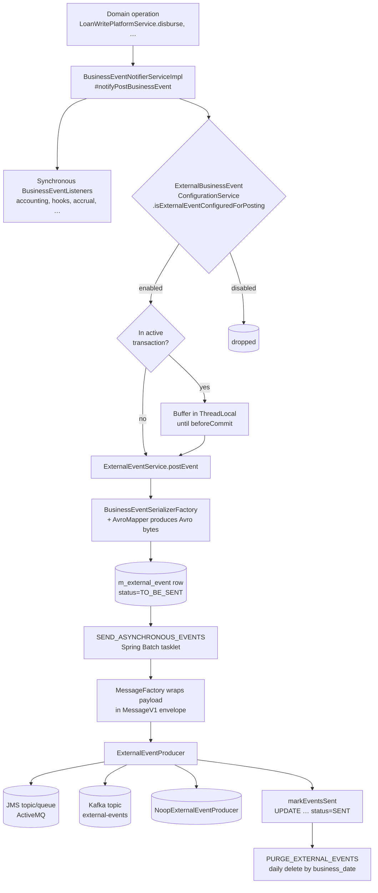
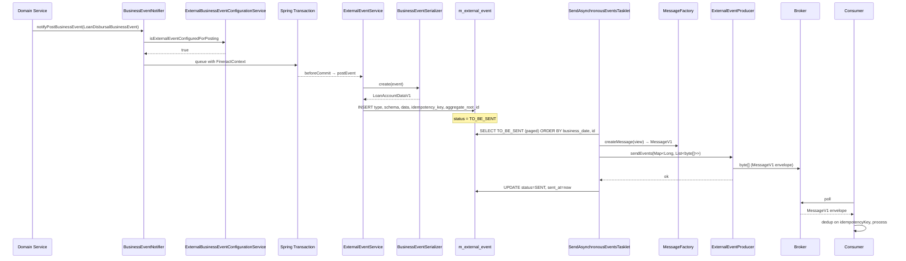

Apache Fineract emits **business facts** — a loan disbursed, a savings withdrawal posted, a charge waived — in two parallel channels. The **internal channel** is a synchronous Spring bean (`BusinessEventNotifierServiceImpl`) that delivers a `BusinessEvent<T>` to registered listeners on the caller thread. The **external channel** captures the same events into a relational outbox table (`m_external_event`), serializes the payload to Avro using a per-event mapper, and asynchronously hands the bytes to a pluggable `ExternalEventProducer` — currently `JMSMultiExternalEventProducer`, `KafkaExternalEventProducer`, or `NoopExternalEventProducer`. This page is the high-level map of how those two tiers interact, where the source lives, and which downstream pages drill into each component.

<Note>
Both tiers run on the same call. Internal listeners execute synchronously inside the originating transaction; the outbox row is written in the same transaction (or buffered until commit by `BusinessEventNotifierServiceImpl.beforeCommit`). External delivery to a broker is **always asynchronous** — the Spring Batch job `SEND_ASYNCHRONOUS_EVENTS` polls `m_external_event` rows whose `status = 'TO_BE_SENT'`, partitions them by `aggregate_root_id`, and pushes them to the producer.
</Note>

## Two-tier model

| Tier               | Synchrony     | Transport                    | Storage                | Entry point                              |
| ------------------ | ------------- | ---------------------------- | ---------------------- | ---------------------------------------- |
| Internal bus       | Synchronous   | Direct method dispatch       | None (in‑process only) | `BusinessEventNotifierService.notifyPostBusinessEvent` |
| External outbox    | Same‑tx write | Row in `m_external_event`    | RDBMS BLOB             | `ExternalEventService.postEvent`         |
| External delivery  | Asynchronous  | JMS topic/queue **or** Kafka topic **or** Noop | Avro `MessageV1` bytes | `SendAsynchronousEventsTasklet` → `ExternalEventProducer.sendEvents` |

Internal listeners run inside the caller's transaction. External delivery sits behind the **outbox pattern**: at-least-once with consumer-side de-duplication on `idempotencyKey`.

## End-to-end flow



## Component map

| Layer                    | Module                  | Type                                           | What it does                                                                                  |
| ------------------------ | ----------------------- | ---------------------------------------------- | --------------------------------------------------------------------------------------------- |
| Internal SPI             | `fineract-core`         | `BusinessEvent<T>` / `BusinessEventListener<T>` | Marker payload + registered handler                                                           |
| Internal dispatcher      | `fineract-core`         | `BusinessEventNotifierServiceImpl`             | Pre/post notification, transactional buffering, recording windows for `BulkBusinessEvent`     |
| External outbox entity   | `fineract-core`         | `ExternalEvent` (`@Entity`)                    | Row in `m_external_event` with Avro bytes, status, idempotency key                            |
| Outbox writer            | `fineract-core`         | `ExternalEventService.postEvent`               | Serializes + saves; called from the post-notifier or the `BulkBusinessEvent` flush            |
| Allow‑list               | `fineract-core`         | `ExternalEventConfiguration` table             | `enabled` flag per event type; managed via `/v1/externalevents/configuration`                 |
| Avro envelope            | `fineract-avro-schemas` | `MessageV1`, `BulkMessageItemV1`, `BulkMessagePayloadV1` | Cross-language wire format consumers parse                                                    |
| Serializers              | `fineract-provider`     | `BusinessEventSerializer` impls                | One per event family (loan, savings, share, client, …)                                        |
| Producers                | `fineract-provider`     | `JMSMultiExternalEventProducer`, `KafkaExternalEventProducer` | Pluggable brokers gated by `fineract.events.external.producer.{jms,kafka}.enabled`            |
| Send job                 | `fineract-core`         | `SendAsynchronousEventsTasklet`                | Batch poller + producer dispatch + mark‑as‑sent                                               |
| Purge job                | `fineract-core`         | `PurgeExternalEventsTasklet`                   | Deletes `status='SENT'` rows older than `purge-external-events-older-than-days`               |
| Idempotency              | `fineract-core`         | `DefaultExternalEventIdempotencyKeyGenerator`  | UUID per outbox row; surfaced to consumers in `MessageV1.idempotencyKey`                      |

## Source locations

```
fineract-core/src/main/java/org/apache/fineract/infrastructure/event/
├── business/
│   ├── BusinessEventListener.java
│   ├── domain/
│   │   ├── BusinessEvent.java
│   │   ├── AbstractBusinessEvent.java
│   │   ├── BulkBusinessEvent.java
│   │   ├── NoExternalEvent.java
│   │   └── datatable/   ← DatatableEntry*BusinessEvent.java
│   └── service/
│       ├── BusinessEventNotifierService.java
│       ├── BusinessEventNotifierServiceImpl.java
│       ├── ExternalBusinessEventConfigurationService.java
│       ├── ExternalBusinessEventConfigurationServiceImpl.java
│       └── TransactionHelper.java
└── external/
    ├── api/ExternalEventConfigurationApiResource.java
    ├── command/ExternalConfigurationsUpdateCommand.java
    ├── config/    ← EventTaskExecutorConfig, EnableExternalEventTopicCondition, …
    ├── data/      ← ExternalEventConfigurationResponse, *UpdateRequest, ExternalEventResponse
    ├── exception/ ← AcknowledgementTimeoutException, ExternalEventConfigurationNotFoundException
    ├── handler/ExternalEventConfigurationUpdateHandler.java
    ├── jobs/
    │   ├── PurgeExternalEventsConfig.java
    │   ├── PurgeExternalEventsTasklet.java
    │   ├── SendAsynchronousEventsConfig.java
    │   └── SendAsynchronousEventsTasklet.java
    ├── producer/
    │   ├── ExternalEventProducer.java
    │   ├── NoopExternalEventEnabled.java
    │   └── NoopExternalEventProducer.java
    ├── repository/
    │   ├── ExternalEventRepository.java
    │   ├── ExternalEventConfigurationRepository.java
    │   ├── CustomExternalEventConfigurationRepository.java
    │   └── domain/ExternalEvent.java, ExternalEventConfiguration.java, ExternalEventStatus.java, ExternalEventView.java
    └── service/
        ├── ExternalEventService.java
        ├── ExternalEventConfigurationReadPlatformService.java
        ├── ExternalEventConfigurationWritePlatformServiceImpl.java
        ├── InternalExternalEventService.java          (test profile only)
        ├── idempotency/DefaultExternalEventIdempotencyKeyGenerator.java
        ├── message/MessageFactory.java, BulkMessageItemFactory.java
        ├── serialization/
        │   ├── serializer/BusinessEventSerializer.java, BusinessEventSerializerFactory.java
        │   └── mapper/support/AvroMapperConfig.java, ExternalIdMapper.java, AvroDateTimeMapper.java
        └── validation/ExternalEventSourceService.java
```

Producer wiring lives in `fineract-provider`:

```
fineract-provider/src/main/java/org/apache/fineract/infrastructure/event/external/
├── config/
│   ├── ExternalEventJMSConfiguration.java
│   ├── ExternalEventKafkaConfiguration.java
│   ├── KafkaExternalEventTopicConfig.java
│   └── ExternalEventsKafkaTopicAutoCreateCondition.java
├── producer/
│   ├── jms/JMSMultiExternalEventProducer.java
│   └── kafka/KafkaExternalEventProducer.java
└── service/serialization/
    ├── serializer/    ← LoanBusinessEventSerializer, SavingsAccountBusinessEventSerializer, …
    └── mapper/        ← LoanAccountDataMapper, SavingsAccountDataMapper, ClientDataMapper, …
```

## Decision: which producer ships in your image?

The condition tree in `NoopExternalEventEnabled` (extends `PropertiesCondition`) means:

| `fineract.events.external.enabled` | `…producer.jms.enabled` | `…producer.kafka.enabled` | Active producer bean        |
| ---------------------------------- | ----------------------- | ------------------------- | --------------------------- |
| `false`                            | any                     | any                       | (no outbox writes happen)   |
| `true`                             | `false`                 | `false`                   | `NoopExternalEventProducer` |
| `true`                             | `true`                  | `false`                   | `JMSMultiExternalEventProducer` |
| `true`                             | `false`                 | `true`                    | `KafkaExternalEventProducer` |
| `true`                             | `true`                  | `true`                    | Both producers exist; the Noop bean is disabled. The send job uses the `ExternalEventProducer` bean Spring injects — make sure only one matches your deployment intent. |

The send job itself short-circuits via `SendAsynchronousEventsTasklet.isDownstreamChannelEnabled()` when neither JMS nor Kafka is on, so rows stay `TO_BE_SENT` and accumulate. Either delete them with the purge job (after enabling), or ship a `NoopExternalEventProducer` and let the job mark them sent.

## Encoding stack

```mermaid
flowchart LR
    evt[BusinessEvent T] --> ser[BusinessEventSerializer\n.toAvroDTO]
    ser --> avro[Avro DTO\nLoanAccountDataV1, ClientDataV1, …]
    avro --> enr[DataEnricherProcessor.enrich]
    enr --> buf[ByteBuffer]
    buf --> row[m_external_event.data]
    row --> mf[MessageFactory.createMessage]
    mf --> env[MessageV1\n{id, source, type, category,\n  createdAt, businessDate, tenantId,\n  idempotencyKey, dataschema, data}]
    env --> bytes[byte at]
    bytes --> producer[ExternalEventProducer.sendEvents]
```

The **inner payload** (`m_external_event.data`) is a versioned `*V1` Avro record specific to the event family. The **outer envelope** (`MessageV1`) is constant across all events — consumers always parse it first and then look at `MessageV1.dataschema` to choose the right inner reader. For `BulkBusinessEvent` the data is a `BulkMessagePayloadV1` containing a list of `BulkMessageItemV1`, each of which carries its own `dataschema`.

## Recording windows for bulk events

`BusinessEventNotifierServiceImpl` exposes `startExternalEventRecording()` / `stopExternalEventRecording()` / `resetEventRecording()`. While recording is active on the current thread:

- Each post-notification is **deferred** and appended to a thread-local list instead of being written to `m_external_event` immediately.
- At `stop`:
  - 0 events → nothing is written;
  - 1 event → that single event is posted directly (no envelope inflation);
  - 2+ events → all events are wrapped into a single `BulkBusinessEvent` (which must share an aggregate root) and the wrapper is posted once.

Loan COB orchestration uses this to coalesce per-loan-day fan-out into one bulk message. See `BulkBusinessEvent.verifySameAggregate` for the contract: all child events must report the same `getAggregateRootId()` (or `null`), otherwise the wrapper constructor throws.

## Outbox-only path vs transactional buffering

`BusinessEventNotifierServiceImpl.notifyPostBusinessEvent` chooses between three paths:

1. **Recording active** → append to `recordedEvents` thread-local; nothing else happens.
2. **Active transaction** (`TransactionHelper.hasTransaction()` returns `true`) → push the event with the current `FineractContext` onto the `transactionBusinessEvents` stack. On `beforeCommit`, the impl iterates and calls `externalEventService.postEvent` for each; on rollback it just pops the stack and emits nothing.
3. **No transaction** → call `externalEventService.postEvent` immediately.

The transactional path is the most common one in production code paths because nearly every `WritePlatformService` runs inside `@Transactional`. The implication is: **if the business transaction rolls back, the outbox row is never written**. That is the consistency guarantee that makes the outbox safe — no broker fan-out is possible for a reverted business operation.

## Configuration switchboard

The runtime is driven by Spring Boot properties; defaults come from `fineract-provider/src/main/resources/application.properties` (lines 124–152 at the time of writing):

| Property                                                                    | Default                          | Effect                                                                              |
| --------------------------------------------------------------------------- | -------------------------------- | ----------------------------------------------------------------------------------- |
| `fineract.events.external.enabled`                                          | `false`                          | Master kill-switch. If `false`, no outbox row is ever written.                      |
| `fineract.events.external.partition-size`                                   | `5000`                           | `markEventsSent` IN-clause partitioning (PostgreSQL 65,535-parameter limit).        |
| `fineract.events.external.thread-pool-core-pool-size`                       | `2`                              | `eventMarksAsSentExecutor` core threads.                                            |
| `fineract.events.external.thread-pool-max-pool-size`                        | `25`                             | Max threads in the same pool.                                                       |
| `fineract.events.external.thread-pool-queue-capacity`                       | `500`                            | Queue capacity for the same pool.                                                   |
| `fineract.events.external.producer.jms.enabled`                             | `false`                          | Toggles the JMS producer & all `@ConditionalOnProperty` JMS beans.                  |
| `fineract.events.external.producer.jms.event-queue-name`                    | (empty)                          | When set, an `ActiveMQQueue` is created; mutually exclusive with the topic name.    |
| `fineract.events.external.producer.jms.event-topic-name`                    | (empty)                          | When set, an `ActiveMQTopic` is created instead.                                    |
| `fineract.events.external.producer.jms.broker-url`                          | `tcp://127.0.0.1:61616`          | ActiveMQ broker URL.                                                                |
| `fineract.events.external.producer.jms.producer-count`                      | `1`                              | Parallel `MessageProducer` instances per send. Drives `consistentHash` partitioning.|
| `fineract.events.external.producer.kafka.enabled`                           | `false`                          | Toggles the Kafka producer beans.                                                   |
| `fineract.events.external.producer.kafka.topic.name`                        | `external-events`                | Target Kafka topic name.                                                            |
| `fineract.events.external.producer.kafka.topic.partitions`                  | `10`                             | Used when `topic.auto-create=true`.                                                 |
| `fineract.events.external.producer.kafka.topic.replicas`                    | `1`                              | Used when `topic.auto-create=true`.                                                 |
| `fineract.events.external.producer.kafka.bootstrap-servers`                 | `localhost:9092`                 | Comma-separated broker list.                                                        |
| `fineract.events.external.producer.kafka.timeout-in-seconds`                | `10`                             | `CompletableFuture.allOf(…).get(timeout, SECONDS)` for an entire batch send.        |

Two global configuration values (in `c_configuration`, exposed via the **Global Configuration** API) tune the send + purge jobs:

| Global key                                  | Read by                                          | Effect                                                                  |
| ------------------------------------------- | ------------------------------------------------ | ----------------------------------------------------------------------- |
| `external-event-batch-size`                 | `SendAsynchronousEventsTasklet.getBatchSize`     | `PageRequest.ofSize(N)` used to read `TO_BE_SENT` rows per job invocation. |
| `purge-external-events-older-than-days`     | `PurgeExternalEventsTasklet.execute`             | Subtracted from `DateUtils.getBusinessLocalDate()` for the cutoff date. |

## Per-event allow-list

A row exists in `m_external_event_configuration` for **every** declared event type — loaded via Liquibase. The default is `enabled = false`, so a fresh deployment writes nothing to the outbox until an operator enables specific types:

```http
PUT /v1/externalevents/configuration
Content-Type: application/json

{
  "externalEventConfigurations": {
    "LoanApprovedBusinessEvent": true,
    "LoanDisbursalBusinessEvent": true,
    "LoanRepaymentBusinessEvent": true
  }
}
```

`ExternalBusinessEventConfigurationServiceImpl.isExternalEventConfiguredForPosting` does the per-event check on every post-notification — so this is the cheap, runtime way to throttle traffic without changing code.

## What is **not** an external event

- Any `BusinessEvent<?>` that also implements the marker interface `NoExternalEvent`. The check is `boolean isExternalEvent = !(businessEvent instanceof NoExternalEvent);` inside `notifyPostBusinessEvent`. Use this for in-process-only signals (e.g., COB internal step transitions).
- Direct invocations of `BulkBusinessEvent` from application code — `throwExceptionIfBulkEvent` raises `IllegalArgumentException` because bulk envelopes can only be built by the recording window.
- Pre-notifier events (`notifyPreBusinessEvent`). Only post-notifications are eligible for the outbox.

## Runtime sequence — the canonical happy path



## Observability checklist

| Signal                                              | Where to look                                                       |
| --------------------------------------------------- | ------------------------------------------------------------------- |
| External-event posting on/off                       | Log line `External event posting is enabled` / `… is disabled` at startup (from `BusinessEventNotifierServiceImpl.afterPropertiesSet`) |
| Per-type allow-list flips                           | `m_external_event_configuration` row updates via [Config API](/events/external-event-configuration-api) |
| Outbox queue size                                   | `SELECT status, count(*) FROM m_external_event GROUP BY status`     |
| Send batch timing                                   | DEBUG `Loaded N events in M ms` and `Sent messages with R msg/s`    |
| Send failures                                       | ERROR `Error occurred while processing events:` from `SendAsynchronousEventsTasklet` |
| Mark-as-sent timing                                 | DEBUG `Took N ms to update K events`                                |
| Purge progress                                      | ERROR `Error occurred while purging external events:` (success is silent) |
| Producer `source` UUID                              | Log line `Message source set to <uuid>` at `MessageFactory.afterPropertiesSet` |

## A vocabulary cheat-sheet

| Term                          | Meaning in this stack                                                                       |
| ----------------------------- | ------------------------------------------------------------------------------------------- |
| Internal event                | A `BusinessEvent<T>` dispatched by `BusinessEventNotifierServiceImpl` to in-process listeners |
| External event                | A row written to `m_external_event` for later broker delivery                               |
| Outbox                        | The `m_external_event` table; the durable boundary between business operation and broker fan-out |
| Aggregate root ID             | The PK of the owning aggregate (e.g., `Loan.id`); drives ordering preservation              |
| Producer                      | An `ExternalEventProducer` implementation (JMS, Kafka, Noop)                                 |
| Recording window              | Thread-local interval (`startExternalEventRecording`/`stop…`) that coalesces multiple events into one `BulkBusinessEvent` |
| `MessageV1`                   | The outer Avro envelope for every external event                                            |
| `BulkMessagePayloadV1`        | The body schema when the inner content is multiple events                                   |
| `dataschema`                  | Fully-qualified Java class of the inner Avro record                                          |
| `idempotencyKey`              | Consumer-side dedup token (`UUID.randomUUID()` by default)                                  |
| Allow-list                    | `m_external_event_configuration.enabled`-driven per-type filter                             |
| Send job                      | `SEND_ASYNCHRONOUS_EVENTS` Spring Batch job                                                 |
| Purge job                     | `PURGE_EXTERNAL_EVENTS` Spring Batch job                                                    |

## Where to read next

| If you want to know…                                                  | Read                                                        |
| --------------------------------------------------------------------- | ----------------------------------------------------------- |
| The full `BusinessEvent` SPI and how `BusinessEventNotifier` runs     | [Business Events](/events/business-events)                  |
| The `m_external_event` schema and how `ExternalEventService` writes   | [External Event Domain](/events/external-event-domain)      |
| The REST contract for enabling/disabling per-type emission            | [External Event Configuration API](/events/external-event-configuration-api) |
| ActiveMQ wiring, queue vs topic, thread pool sizing                   | [Event Producer (JMS)](/events/event-producer-jms)          |
| Kafka producer wiring, topic auto-create, bootstrap servers           | [Event Producer (Kafka)](/events/event-producer-kafka)      |
| Per-event Avro mapping & `BusinessEventSerializer` discovery          | [Serialization & Mappers](/events/event-serialization-mappers) |
| `MessageV1.idempotencyKey` semantics & dedup expectations             | [Event Idempotency](/events/event-idempotency)              |
| Every `.avsc` shipped in `fineract-avro-schemas`                      | [Avro Schemas](/events/avro-schemas)                        |
| `SEND_ASYNCHRONOUS_EVENTS` and `PURGE_EXTERNAL_EVENTS` jobs           | [Purge & Send Jobs](/events/purge-events-job)               |
| Core SPI for the internal bus                                         | [Core: Business Events](/core/event-business)               |
| Core SPI for the outbox layer                                         | [Core: External Events](/core/event-external)               |
| Investor-module event emitters                                        | [Investor Events](/investor/investor-events)                |
| Avro schemas in the client family                                     | [Clients Avro Schemas](/clients/avro-schemas)               |
| End-to-end runtime sequence diagram                                   | [External Event Flow](/flows/external-event-publishing-flow)           |
| The Spring Batch job catalogue                                        | [Job Names](/jobs/job-names-enumeration)                    |
| Batch manager/worker topology                                         | [Spring Batch Manager/Worker](/jobs/spring-batch-manager-worker) |
