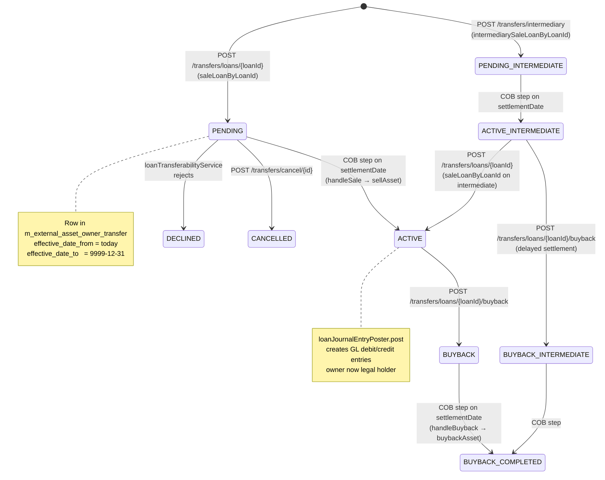
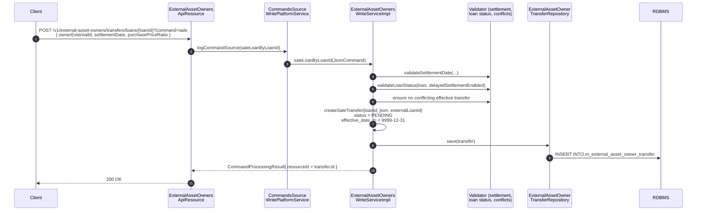
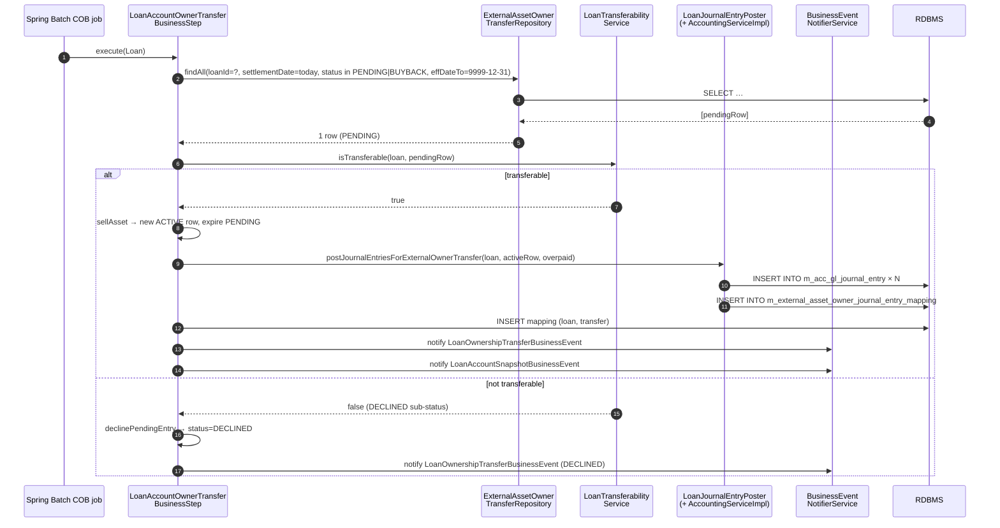

Apache Fineract's `fineract-investor` module lets a bank sell whole loans (or shares thereof) to an external owner — a securitization, an asset-management vehicle, or a regulator-defined "ring-fenced" entity. The end-to-end flow has three movements: (1) **sale request** creates a `PENDING` `ExternalAssetOwnerTransfer` row via a REST call; (2) **COB activation** runs the `LoanAccountOwnerTransferBusinessStep` on the settlement date, which validates transferability, posts journal entries, and flips the row to `ACTIVE`; (3) **buyback** is a mirror request that creates a `BUYBACK` row, then activates the same way during a later COB cycle. This page traces both the happy path and the same-day-sale-and-buyback short-circuit through the actual code.

Source map:

- `fineract-investor/src/main/java/org/apache/fineract/investor/api/ExternalAssetOwnersApiResource.java`
- `fineract-investor/src/main/java/org/apache/fineract/investor/service/ExternalAssetOwnersWriteServiceImpl.java`
- `fineract-investor/src/main/java/org/apache/fineract/investor/cob/loan/LoanAccountOwnerTransferBusinessStep.java`
- `fineract-investor/src/main/java/org/apache/fineract/investor/service/AccountingServiceImpl.java`
- `fineract-investor/src/main/java/org/apache/fineract/investor/data/ExternalTransferStatus.java`

## State machine



`ExternalTransferStatus` values (verbatim from the enum):

| Status                  | Meaning                                                                                                       |
|-------------------------|---------------------------------------------------------------------------------------------------------------|
| `PENDING`               | Sale requested, COB has not yet activated.                                                                    |
| `PENDING_INTERMEDIATE`  | Sale to a delayed-settlement intermediary; COB activates to `ACTIVE_INTERMEDIATE`.                            |
| `ACTIVE`                | Owner currently holds the loan; journal entries posted.                                                       |
| `ACTIVE_INTERMEDIATE`   | Intermediate hold; awaits final-sale or buyback.                                                              |
| `BUYBACK`               | Buyback requested while the loan was `ACTIVE`; COB will activate.                                             |
| `BUYBACK_INTERMEDIATE`  | Buyback from intermediate ownership.                                                                          |
| `BUYBACK_COMPLETED`     | Effective state after COB activates a buyback row.                                                            |
| `CANCELLED`             | Pending or buyback row cancelled before COB.                                                                  |
| `DECLINED`              | COB rejected the sale (transferability validation failed).                                                    |

## Phase 1 — Sale request

### REST endpoint

From `ExternalAssetOwnersApiResource`:

```java
@Path("/v1/external-asset-owners")
@Component
public class ExternalAssetOwnersApiResource {

    @POST
    @Path("/transfers/loans/{loanId}")
    @Consumes(MediaType.APPLICATION_JSON)
    @Produces(MediaType.APPLICATION_JSON)
    public CommandProcessingResult transferRequestWithLoanId(
            @PathParam("loanId") final Long loanId,
            @QueryParam("command") final String commandParam,
            final String apiRequestBodyAsJson) {
        return executeCommand(commandParam, loanId, null, null, apiRequestBodyAsJson);
    }
}
```

The `command` query parameter selects the operation. Three values:

| `command` value          | Service method                                                | Initial status      |
|--------------------------|---------------------------------------------------------------|---------------------|
| `sale`                   | `ExternalAssetOwnersWriteService.saleLoanByLoanId(cmd)`       | `PENDING`           |
| `buyback`                | `ExternalAssetOwnersWriteService.buybackLoanByLoanId(cmd)`    | `BUYBACK`           |
| `intermediarysale`       | `ExternalAssetOwnersWriteService.intermediarySaleLoanByLoanId(cmd)` | `PENDING_INTERMEDIATE` |

The request body carries the owner identification, transfer external ID, settlement date, purchase price ratio:

```json
{
  "transferExternalId":   "TXFR-2024-00042",
  "settlementDate":       "2024-09-15",
  "ownerExternalId":      "OWNER-INV-001",
  "purchasePriceRatio":   "1.05",
  "dateFormat": "yyyy-MM-dd",
  "locale": "en"
}
```

### Service: `createSaleTransfer`

`ExternalAssetOwnersWriteServiceImpl.saleLoanByLoanId` validates the call, calls `createSaleTransfer`, and saves:

```java
private ExternalAssetOwnerTransfer createSaleTransfer(Long loanId, JsonElement json, ExternalId externalLoanId) {
    ExternalAssetOwnerTransfer externalAssetOwnerTransfer = new ExternalAssetOwnerTransfer();
    LocalDate effectiveFrom = ThreadLocalContextUtil.getBusinessDate();

    ExternalAssetOwner owner = getOwner(json);
    externalAssetOwnerTransfer.setOwner(owner);
    externalAssetOwnerTransfer.setExternalId(getTransferExternalIdFromJson(json));
    externalAssetOwnerTransfer.setStatus(PENDING);
    externalAssetOwnerTransfer.setPurchasePriceRatio(getPurchasePriceRatioFromJson(json));
    externalAssetOwnerTransfer.setSettlementDate(getSettlementDateFromJson(json));
    externalAssetOwnerTransfer.setEffectiveDateFrom(effectiveFrom);
    externalAssetOwnerTransfer.setEffectiveDateTo(FUTURE_DATE_9999_12_31);
    externalAssetOwnerTransfer.setLoanId(loanId);
    externalAssetOwnerTransfer.setExternalLoanId(externalLoanId);
    externalAssetOwnerTransfer.setExternalGroupId(getTransferExternalGroupIdFromJson(json));

    findPreviousAssetOwner(loanId).ifPresent(externalAssetOwnerTransfer::setPreviousOwner);
    return externalAssetOwnerTransfer;
}
```

Validation that runs before the save:

| Check                                   | Where                                                                                                             | Error                                                                       |
|-----------------------------------------|--------------------------------------------------------------------------------------------------------------------|-----------------------------------------------------------------------------|
| Settlement date in the future            | `validateSettlementDate(externalAssetOwnerTransfer.getSettlementDate())` → `DateUtils.isBeforeBusinessDate`        | `ExternalAssetOwnerInitiateTransferException("Settlement date cannot be in the past")` |
| Loan status in allowed list             | `validateLoanStatus(loan, isDelayedSettlementEnabled)`                                                              | `Loan status %s is not valid for transfer`                                  |
| No conflicting effective transfer       | If a `PENDING`/`ACTIVE` row already exists for the same loan, additional sale requests are blocked                  | `Already in PENDING/ACTIVE state for this loan`                             |
| Settlement-day rules for intermediary   | When delayed-settlement is enabled, the rules around `ACTIVE_INTERMEDIATE` apply                                    | Multiple checks                                                              |

After save, the row sits in `m_external_asset_owner_transfer` with `status=PENDING` and `effective_date_to=9999-12-31` (the open-ended sentinel). The COB step finds it by querying `settlement_date = today` AND `effective_date_to >= 9999-12-31` AND `status in (PENDING_*, BUYBACK_*)`.

### Sale-request sequence



## Phase 2 — COB activation

The `LoanCOB` Spring Batch job runs nightly per [Loan COB](/cob/loan-cob-overview), and one of its registered business steps is `LoanAccountOwnerTransferBusinessStep`. The step is gated by `@Conditional(InvestorModuleIsEnabledCondition.class)` — it only runs when the investor module is active.

### The COB step

From `LoanAccountOwnerTransferBusinessStep.execute(Loan)`:

```java
@Override
public Loan execute(Loan loan) {
    Long loanId = loan.getId();
    log.debug("start processing loan ownership transfer business step for loan with Id [{}]", loanId);

    LocalDate settlementDate = DateUtils.getBusinessLocalDate();
    List<ExternalAssetOwnerTransfer> transferDataList = externalAssetOwnerTransferRepository.findAll(
            (root, query, criteriaBuilder) -> criteriaBuilder.and(
                    criteriaBuilder.equal(root.get("loanId"), loanId),
                    criteriaBuilder.equal(root.get("settlementDate"), settlementDate),
                    root.get("status").in(Stream.concat(PENDING_STATUSES.stream(), BUYBACK_STATUSES.stream()).toList()),
                    criteriaBuilder.greaterThanOrEqualTo(root.get("effectiveDateTo"), FUTURE_DATE_9999_12_31)),
            Sort.by(Sort.Direction.ASC, "id"));
    int size = transferDataList.size();

    if (size == 2) {
        ExternalTransferStatus firstTransferStatus  = transferDataList.get(0).getStatus();
        ExternalTransferStatus secondTransferStatus = transferDataList.get(1).getStatus();

        if (delayedSettlementAttributeService.isEnabled(loan.getLoanProduct().getId())) {
            throw new IllegalStateException(String.format(
                "Delayed Settlement enabled, but found 2 transfers of statuses: %s and %s",
                firstTransferStatus, secondTransferStatus));
        }
        if (!ExternalTransferStatus.PENDING.equals(firstTransferStatus)
            || !ExternalTransferStatus.BUYBACK.equals(secondTransferStatus)) {
            throw new IllegalStateException(...);
        }
        handleSameDaySaleAndBuyback(settlementDate, transferDataList, loan);
    } else if (size == 1) {
        ExternalAssetOwnerTransfer transfer = transferDataList.get(0);
        if (PENDING_STATUSES.contains(transfer.getStatus())) {
            handleSale(loan, settlementDate, transfer);
        } else if (BUYBACK_STATUSES.contains(transfer.getStatus())) {
            handleBuyback(loan, settlementDate, transfer);
        }
    }
    return loan;
}
```

Constants and dispatch:

```java
public static final List<ExternalTransferStatus> PENDING_STATUSES =
    List.of(ExternalTransferStatus.PENDING_INTERMEDIATE, ExternalTransferStatus.PENDING);
public static final List<ExternalTransferStatus> BUYBACK_STATUSES =
    List.of(ExternalTransferStatus.BUYBACK_INTERMEDIATE, ExternalTransferStatus.BUYBACK);
```

Three dispatch arms:

| Rows found on `settlementDate` for the loan      | Branch                              | Result                                                                                                       |
|--------------------------------------------------|--------------------------------------|--------------------------------------------------------------------------------------------------------------|
| 0                                                | early exit (no-op)                  | Nothing to do today.                                                                                          |
| 1 with `status ∈ PENDING_STATUSES`               | `handleSale(loan, date, transfer)`  | Sell or decline.                                                                                              |
| 1 with `status ∈ BUYBACK_STATUSES`               | `handleBuyback(...)`                | Buy back from active owner; if no active row found, cancel as `UNSOLD`.                                       |
| 2 = `[PENDING, BUYBACK]`                         | `handleSameDaySaleAndBuyback(...)`  | Special path: sale and buyback land on the same business day. Avoids double posting of journal entries.       |
| 2 = any other combo                              | `IllegalStateException`             | Data inconsistency.                                                                                            |

### `handleSale` — the sell-or-decline path

```java
private void handleSale(final Loan loan, final LocalDate settlementDate,
                        final ExternalAssetOwnerTransfer externalAssetOwnerTransfer) {
    ExternalAssetOwnerTransfer newExternalAssetOwnerTransfer =
            sellAssetOrDecline(loan, settlementDate, externalAssetOwnerTransfer);

    businessEventNotifierService.notifyPostBusinessEvent(
            new LoanOwnershipTransferBusinessEvent(newExternalAssetOwnerTransfer, loan));

    if (!ExternalTransferStatus.DECLINED.equals(newExternalAssetOwnerTransfer.getStatus())) {
        businessEventNotifierService.notifyPostBusinessEvent(new LoanAccountSnapshotBusinessEvent(loan));
    }
}

private ExternalAssetOwnerTransfer sellAssetOrDecline(final Loan loan, final LocalDate settlementDate,
                                                      final ExternalAssetOwnerTransfer externalAssetOwnerTransfer) {
    if (!loanTransferabilityService.isTransferable(loan, externalAssetOwnerTransfer)) {
        ExternalTransferSubStatus declinedSubStatus = loanTransferabilityService.getDeclinedSubStatus(loan);
        return declinePendingEntry(loan, settlementDate, externalAssetOwnerTransfer, declinedSubStatus);
    }
    ExternalAssetOwnerTransfer newExternalAssetOwnerTransfer = sellAsset(loan, settlementDate, externalAssetOwnerTransfer);
    createActiveMapping(loan.getId(), newExternalAssetOwnerTransfer);
    newExternalAssetOwnerTransfer
            .setExternalAssetOwnerTransferDetails(createAssetOwnerTransferDetails(loan, newExternalAssetOwnerTransfer));
    return newExternalAssetOwnerTransfer;
}
```

`LoanTransferabilityService.isTransferable(loan, transfer)` runs a battery of checks (loan not in default beyond a threshold, no charge-off, no pending repayments past due, etc.). When it rejects, the transfer is `DECLINED` with a sub-status (e.g. `WRITTEN_OFF`, `CHARGED_OFF`, `BALANCE_ZERO`).

When it succeeds, `sellAsset` creates the active row, expires the old PENDING (sets `effective_date_to = settlementDate`), and posts journal entries via `LoanJournalEntryPoster`.

### `handleBuyback`

```java
private void handleBuyback(final Loan loan, final LocalDate settlementDate,
                           final ExternalAssetOwnerTransfer buybackExternalAssetOwnerTransfer) {
    final ExternalTransferStatus expectedActiveStatus =
            determineExpectedActiveStatus(buybackExternalAssetOwnerTransfer);

    Optional<ExternalAssetOwnerTransfer> optActive = externalAssetOwnerTransferRepository
            .findOne((root, query, cb) -> cb.and(
                cb.equal(root.get("loanId"), loan.getId()),
                cb.equal(root.get("owner"),  buybackExternalAssetOwnerTransfer.getOwner()),
                cb.equal(root.get("status"), expectedActiveStatus),
                cb.equal(root.get("effectiveDateTo"), FUTURE_DATE_9999_12_31)));

    ExternalAssetOwnerTransfer newTransfer;
    if (optActive.isEmpty()) {
        newTransfer = createNewEntryAndExpireOldEntry(settlementDate, buybackExternalAssetOwnerTransfer,
                ExternalTransferStatus.CANCELLED, ExternalTransferSubStatus.UNSOLD, settlementDate, settlementDate);
    } else {
        newTransfer = buybackAsset(loan, settlementDate, buybackExternalAssetOwnerTransfer, optActive.get());
    }
    businessEventNotifierService.notifyPostBusinessEvent(
            new LoanOwnershipTransferBusinessEvent(newTransfer, loan));
    businessEventNotifierService.notifyPostBusinessEvent(new LoanAccountSnapshotBusinessEvent(loan));
}

private ExternalAssetOwnerTransfer buybackAsset(final Loan loan, final LocalDate settlementDate,
        ExternalAssetOwnerTransfer buyback, ExternalAssetOwnerTransfer active) {
    active.setEffectiveDateTo(settlementDate);
    buyback.setEffectiveDateTo(settlementDate);
    buyback.setExternalAssetOwnerTransferDetails(createAssetOwnerTransferDetails(loan, buyback));
    externalAssetOwnerTransferRepository.save(active);
    buyback = externalAssetOwnerTransferRepository.save(buyback);
    externalAssetOwnerTransferLoanMappingRepository.deleteByLoanIdAndOwnerTransfer(loan.getId(), active);
    loanJournalEntryPoster.postJournalEntriesForExternalOwnerTransfer(loan, buyback, null);
    return buyback;
}
```

What `buybackAsset` does on a single SQL transaction:

1. Closes the active row by setting `effective_date_to = settlementDate`.
2. Snapshots the loan state into `m_external_asset_owner_transfer_details` (referenced by the buyback row).
3. Saves both rows.
4. Deletes the `m_external_asset_owner_transfer_loan_mapping` (the "this loan is owned by X" pointer).
5. Posts journal entries via `LoanJournalEntryPoster`.

### Journal entries

`AccountingServiceImpl.createJournalEntriesForSaleAssetTransfer` and `…ForBuybackAssetTransfer` produce mirror entries for sale vs buyback:

```java
public void createJournalEntriesForSaleAssetTransfer(final Loan loan, final ExternalAssetOwnerTransfer transfer,
        BigDecimal totalOverpaidPortion) {
    List<JournalEntry> journalEntryList = createJournalEntries(loan, transfer, /*sale*/ true);
    // map every journal entry to the transfer and to the owner
}

public void createJournalEntriesForBuybackAssetTransfer(final Loan loan, final ExternalAssetOwnerTransfer transfer) {
    List<JournalEntry> journalEntryList = createJournalEntries(loan, transfer, /*sale*/ false);
}
```

For a **sale**, debit the owner's investor receivable account and credit the bank's loan portfolio account — at the **purchase price** computed from `transfer.purchasePriceRatio` times the loan's outstanding balance. For a **buyback** the entries flip.

Each posting produces `ExternalAssetOwnerTransferJournalEntryMapping` and `ExternalAssetOwnerJournalEntryMapping` rows so the GL can be audited back to the transfer and the owner respectively.

See [Journal Entry Integration](/investor/journal-entry-integration) for the full GL account selection logic.

### COB-activation sequence



## Phase 3 — Buyback request

Triggered by `POST /v1/external-asset-owners/transfers/loans/{loanId}?command=buyback`:

```java
public CommandProcessingResult buybackLoanByLoanId(JsonCommand command) {
    ExternalId loanExternalId = command.getLoanExternalId();
    Long loanId = command.getLoanId();
    // … validation similar to sale, but expecting an ACTIVE row to buy back from
    ExternalAssetOwnerTransfer existingActive = findActiveOrFail(loanId);
    // Construct new BUYBACK row
    ExternalAssetOwnerTransfer buyback = new ExternalAssetOwnerTransfer();
    buyback.setStatus(determineStatusAfterBuyback(existingActive));   // BUYBACK or BUYBACK_INTERMEDIATE
    buyback.setLoanId(loanId);
    buyback.setOwner(existingActive.getOwner());
    buyback.setSettlementDate(getSettlementDateFromJson(json));
    // … save
}

private ExternalTransferStatus determineStatusAfterBuyback(ExternalAssetOwnerTransfer effectiveTransfer) {
    return switch (effectiveTransfer.getStatus()) {
        case PENDING, ACTIVE -> ExternalTransferStatus.BUYBACK;
        case ACTIVE_INTERMEDIATE -> ExternalTransferStatus.BUYBACK_INTERMEDIATE;
        default -> throw new IllegalStateException(...);
    };
}
```

The buyback request inserts the BUYBACK row in advance — it sits at `status=BUYBACK` (or `BUYBACK_INTERMEDIATE`) until the COB run on `settlementDate` activates it via `handleBuyback`.

### Same-day sale and buyback

When `[PENDING, BUYBACK]` are both present for the same loan on the same `settlementDate` (and delayed-settlement is **off**), the COB step short-circuits via `handleSameDaySaleAndBuyback`. This path avoids:

- Two separate journal-entry postings (sale GL + buyback GL).
- A fleeting `ACTIVE` row that exists only for milliseconds.
- A loan-owner mapping that bounces in and out of the mapping table within a single batch.

Instead, the step collapses both rows into a single net effect: both become `CANCELLED` at `effective_date_to = settlementDate` with sub-status `SAME_DAY` and **no GL entries are posted**.

## Inspecting state

```sql
-- All transfers for a loan
SELECT id, status, effective_date_from, effective_date_to, settlement_date, owner_id
  FROM m_external_asset_owner_transfer
 WHERE loan_id = 12345
 ORDER BY id;

-- Current owner of a loan (if any)
SELECT t.id, t.status, t.owner_id
  FROM m_external_asset_owner_transfer t
 WHERE t.loan_id = 12345
   AND t.status = 'ACTIVE'
   AND t.effective_date_to = '9999-12-31';

-- Journal entries posted by a transfer
SELECT je.id, je.amount, je.type_enum, gl.name AS account
  FROM m_external_asset_owner_transfer_journal_entry_mapping m
  JOIN m_acc_gl_journal_entry je ON m.journal_entry_id = je.id
  JOIN acc_gl_account gl         ON je.account_id = gl.id
 WHERE m.owner_transfer_id = 99;
```

## Common pitfalls

| Symptom                                                                    | Cause                                                                                                                            | Fix                                                                                                                |
|----------------------------------------------------------------------------|----------------------------------------------------------------------------------------------------------------------------------|---------------------------------------------------------------------------------------------------------------------|
| Sale stays `PENDING` past `settlementDate`                                 | COB job did not run (Spring Batch failure, no scheduled trigger, `InvestorModuleIsEnabledCondition` resolved false)              | Verify `fineract.module.investor.enabled=true`, check `m_batch_job_execution`                                       |
| Transfer flips to `DECLINED` unexpectedly                                  | `LoanTransferabilityService` rule (charge-off, write-off, balance zero, missing collateral, etc.)                                | Inspect `decline_sub_status` column for the precise reason                                                          |
| `IllegalStateException: Expected PENDING and BUYBACK, found: ...`          | A second sale/buyback was inserted out of band                                                                                  | Manual data cleanup; cancel one of the rows; re-run COB                                                            |
| Journal entries posted but `m_external_asset_owner_transfer_loan_mapping` missing | `createActiveMapping` was not called (path: same-day collapse, or DECLINED)                                              | Don't query mapping table to determine ownership — query `m_external_asset_owner_transfer` with `status=ACTIVE`     |
| Buyback row sits in `BUYBACK` with no `ACTIVE` counterpart                 | The active row was previously cancelled / declined, leaving the buyback orphaned                                                | COB `handleBuyback` will cancel the buyback as `UNSOLD` on its settlement date                                      |

## Cross-references

- [Investor Overview](/investor/overview) — module landscape
- [Transfer Lifecycle](/investor/transfer-lifecycle) — deep dive on the status machine
- [Investor COB Step](/investor/investor-cob-step) — wiring of `LoanAccountOwnerTransferBusinessStep` into the COB pipeline
- [Journal Entry Integration](/investor/journal-entry-integration) — GL account selection
- [Investor Events](/investor/investor-events) — `LoanOwnershipTransferBusinessEvent` consumer pattern
- [Loan COB Flow](/flows/loan-cob-flow) — outer COB orchestration
