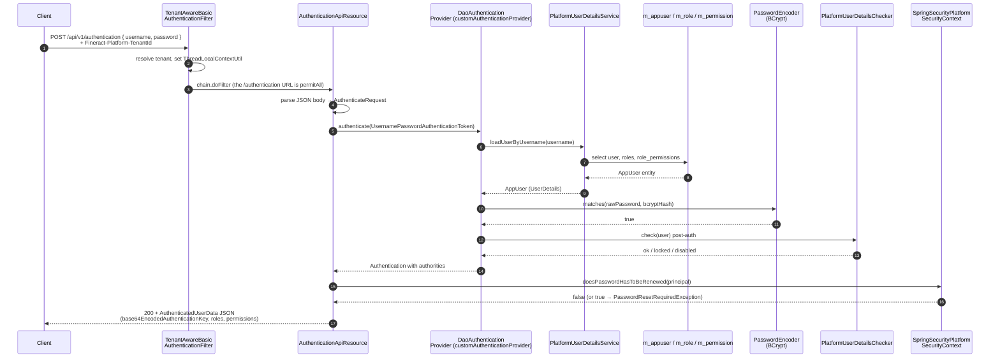
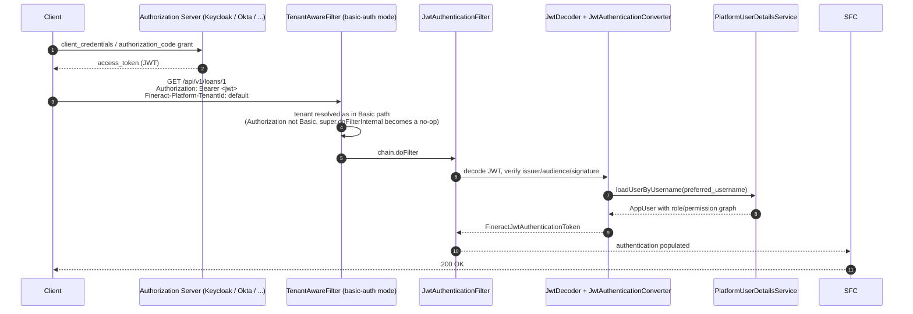
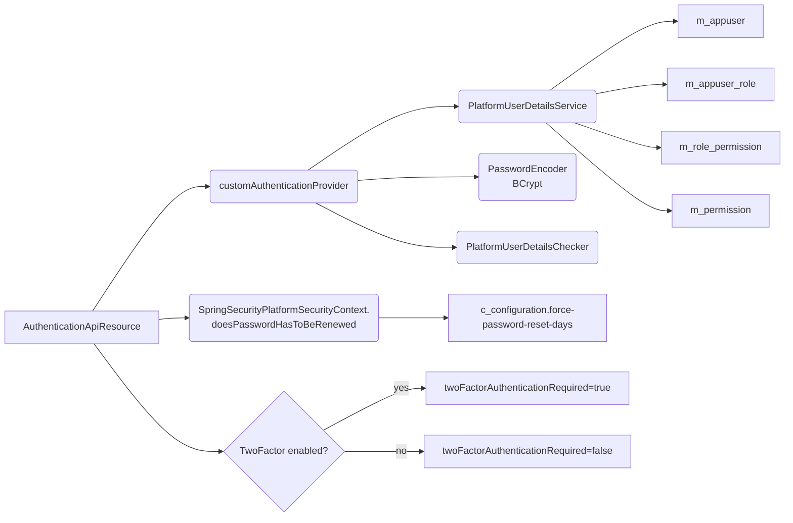

Apache Fineract supports two authentication mechanisms over the same `/api/**` surface: HTTP Basic (the default, with an optional convenience `/v1/authentication` endpoint that echoes the user's roles + permissions) and OAuth2 Bearer tokens (when `fineract.security.basicauth.enabled=false`). This page traces both flows end-to-end and points out the production gotchas around password expiry, lockout, tenant resolution, and the `customAuthenticationProvider` wiring.

Source map:

- `fineract-security/src/main/java/org/apache/fineract/infrastructure/security/api/AuthenticationApiResource.java`
- `fineract-core/src/main/java/org/apache/fineract/infrastructure/security/service/PlatformUserDetailsService.java`
- `fineract-provider/src/main/java/org/apache/fineract/infrastructure/core/config/SecurityConfig.java`
- `fineract-provider/src/main/java/org/apache/fineract/infrastructure/security/service/SpringSecurityPlatformSecurityContext.java`

## Basic-auth login sequence



## Pre-conditions

| Requirement | Notes |
| --- | --- |
| `fineract.security.basicauth.enabled=true` | Activates both `AuthenticationApiResource` and the basic-auth `SecurityFilterChain`. When `false`, the bean is omitted by `@ConditionalOnProperty`. |
| Tenant header / query | `TenantAwareBasicAuthenticationFilter` rejects without it (see [Request Lifecycle](/flows/request-lifecycle)). |
| `m_appuser.username` exists and `m_appuser.is_enabled=true` | `PlatformUserDetailsChecker` will throw `DisabledException` otherwise. |
| Optional `fineract.security.2fa.enabled=true` | Response carries `twoFactorAuthenticationRequired=true` for users without `BYPASS_TWOFACTOR`. |
| Password not flagged `force_change_password` past the policy window | Otherwise `SpringSecurityPlatformSecurityContext.doesPasswordHasToBeRenewed` returns `true` and the resource throws `PasswordResetRequiredException` (mapped to `403`). |

## Step 1 — `/v1/authentication` is permitAll

`SecurityConfig` whitelists the endpoint so that the very first call (before any Basic credentials exist) reaches the resource:

```java
// fineract-provider/.../config/SecurityConfig.java:134
auth.requestMatchers(API_MATCHER.matcher(HttpMethod.OPTIONS, "/api/**")).permitAll()
    .requestMatchers(API_MATCHER.matcher(HttpMethod.POST, "/api/*/echo")).permitAll()
    .requestMatchers(API_MATCHER.matcher(HttpMethod.POST, "/api/*/authentication")).permitAll()
```

The tenant filter still runs — it does **not** require an `Authorization` header (the `super.doFilterInternal` of `BasicAuthenticationFilter` simply skips when the header is absent), but it does require a tenant identifier. That is why a Postman call with no tenant header returns `400`, not `401`.

## Step 2 — JSON body parsing

```java
// fineract-security/.../api/AuthenticationApiResource.java:83
public String authenticate(@Parameter(hidden = true) final String apiRequestBodyAsJson) {
    AuthenticateRequest request = new Gson().fromJson(apiRequestBodyAsJson, AuthenticateRequest.class);
    if (request == null) {
        throw new IllegalArgumentException("Invalid JSON in BODY ... " + apiRequestBodyAsJson);
    }
    if (request.username == null || request.password == null) {
        throw new IllegalArgumentException("Username or Password is null ... ");
    }
    final Authentication authentication =
        new UsernamePasswordAuthenticationToken(request.username, request.password);
    final Authentication authenticationCheck = this.customAuthenticationProvider.authenticate(authentication);
    ...
}
```

Notes:

- Body parsing is intentionally manual via Gson — this dates back to `FINERACT-819`/`FINERACT-726` (move the credentials from URL parameters to the body for log-safety).
- `customAuthenticationProvider` is a `DaoAuthenticationProvider` bean wired in `SecurityConfig`:

```java
// fineract-provider/.../config/SecurityConfig.java:454
@Bean(name = "customAuthenticationProvider")
public DaoAuthenticationProvider customAuthenticationProvider() {
    DaoAuthenticationProvider authProvider = new DaoAuthenticationProvider();
    authProvider.setPasswordEncoder(passwordEncoder);
    authProvider.setUserDetailsService(userDetailsService);
    authProvider.setPostAuthenticationChecks(platformUserDetailsChecker);
    return authProvider;
}
```

## Step 3 — `PlatformUserDetailsService.loadUserByUsername`

`PlatformUserDetailsService` (in `fineract-core`) materialises the user, their roles, and the union of role permissions into an `AppUser` instance. Granted authorities are derived from `m_permission.code` rows.

Key invariants the loader enforces:

- Throws `UsernameNotFoundException` if no row in `m_appuser` matches the username (case-insensitive).
- Eager-fetches `m_role` and `m_role_permission` to avoid lazy-init issues on the response thread.
- Returns the `AppUser` *as* the `UserDetails` (not a wrapper) — this is why `authentication.getPrincipal()` casts cleanly to `AppUser` everywhere in the codebase.

## Step 4 — Password matching and post-auth checks

`DaoAuthenticationProvider.additionalAuthenticationChecks` runs `passwordEncoder.matches(...)`. Fineract uses BCrypt by default; see [Password Encoding](/security/password-encoding) for the encoder bean and historical SHA-1 migration.

After a successful credential match, `PlatformUserDetailsChecker.check(user)` runs:

- Verifies `m_appuser.is_enabled = true`.
- Rejects users whose account is locked (`is_locked`), expired (`account_non_expired`) or whose credentials have expired beyond the configured grace period.
- Records the successful login attempt counter; for tenants using throttling this also resets the failed-attempt counter.

## Step 5 — Password rotation guard

```java
// fineract-security/.../api/AuthenticationApiResource.java:117
boolean isTwoFactorRequired = this.twoFactorEnabled
    && !principal.hasSpecificPermissionTo(TwoFactorConstants.BYPASS_TWO_FACTOR_PERMISSION);
Long userId = principal.getId();
if (this.springSecurityPlatformSecurityContext.doesPasswordHasToBeRenewed(principal)) {
    authenticatedUserData = new AuthenticatedUserData().setUsername(request.username).setUserId(userId)
            .setBase64EncodedAuthenticationKey(new String(base64EncodedAuthenticationKey, StandardCharsets.UTF_8))
            .setAuthenticated(true).setShouldRenewPassword(true)
            .setTwoFactorAuthenticationRequired(isTwoFactorRequired);
    throw new PasswordResetRequiredException(authenticatedUserData);
}
```

`SpringSecurityPlatformSecurityContext.doesPasswordHasToBeRenewed` consults the configuration entry `force-password-reset-days` (rows in `c_configuration`). Throwing `PasswordResetRequiredException` carries the partial `AuthenticatedUserData` back to the client so the UI can render a "change password" screen without re-asking for credentials.

## Step 6 — Successful response

When everything checks out, the resource returns:

```json
{
  "username": "mifos",
  "userId": 1,
  "base64EncodedAuthenticationKey": "bWlmb3M6cGFzc3dvcmQ=",
  "authenticated": true,
  "officeId": 1,
  "officeName": "Head Office",
  "staffId": 1,
  "staffDisplayName": "Founder",
  "organisationalRole": { "id": 1, "code": "...", "value": "..." },
  "roles": [...],
  "permissions": ["ALL_FUNCTIONS", "READ_LOAN", "..."],
  "shouldRenewPassword": false,
  "twoFactorAuthenticationRequired": false
}
```

`base64EncodedAuthenticationKey` is intended for the UI to use as `Authorization: Basic <key>` on subsequent calls — the platform does **not** issue a session cookie. See [Authentication API](/security/authentication-api) for the request/response contract.

## OAuth2 alternative path



When `fineract.security.basicauth.enabled=false`, the bean producing `customAuthenticationProvider` and the `/v1/authentication` resource are skipped — both carry `@ConditionalOnProperty("fineract.security.basicauth.enabled")`. A separate `OAuth2SecurityConfig` (under `fineract-provider`) wires a resource-server filter chain instead.

Key points specific to OAuth2:

- Tenant resolution is unchanged — the same `TenantAwareBasicAuthenticationFilter` runs because the chain still extends `BasicAuthenticationFilter`; the `Authorization: Bearer` header simply doesn't match `Basic ` and the super-class skips its work.
- The JWT subject is mapped to the Fineract `m_appuser.username` by `PlatformUserDetailsService`. Permissions are still loaded from `m_role`/`m_permission` — the JWT's `scope` claim does **not** override them.
- `TwoFactorAuthenticationFilter` still runs after authentication and produces a `FineractJwtAuthenticationToken` enriched with `TWOFACTOR_AUTHENTICATED` if enabled:

```java
// fineract-security/.../filter/TwoFactorAuthenticationFilter.java:108
} else if (currentAuthentication instanceof FineractJwtAuthenticationToken) {
    FineractJwtAuthenticationToken fineractJwtAuthenticationToken = (FineractJwtAuthenticationToken) currentAuthentication;
    FineractJwtAuthenticationToken updatedAuthentication = new FineractJwtAuthenticationToken(
            fineractJwtAuthenticationToken.getToken(), updatedAuthorities, (UserDetails) currentAuthentication.getPrincipal());
    return updatedAuthentication;
}
```

See [OAuth2 Authorization Server](/security/oauth2-authorization-server) for the issuer configuration and JWT claim mapping.

## Side effects of a successful login

| Side effect | When | Where |
| --- | --- | --- |
| `m_appuser_previous_password` rows written when password is being rotated | Only on the `/users/{id}` PUT path, not `/authentication` | `AppUserWritePlatformServiceJpaRepositoryImpl` |
| Failed-attempt counter reset for `username` | Tenant-specific; controlled by `enable-throttling` configuration | `PlatformUserDetailsChecker` |
| `c_lastlogin` rows updated (audit) | When `fineract.user.login.tracking=true` | `AuditTrailListener` |
| `X-Notification-Refresh` header | Always | `TenantAwareBasicAuthenticationFilter.onSuccessfulAuthentication` |
| `SecurityContextHolder.context.authentication` set on the request thread | Always | Spring's `SecurityContextHolderFilter` |

The endpoint itself is **read-only** in terms of database mutation — it does not insert into `m_portfolio_command_source` because it bypasses the command framework.

## Error paths

| Symptom | Cause | HTTP |
| --- | --- | --- |
| `Invalid JSON in BODY` | Empty / malformed body | `400` with platform exception payload |
| `Username or Password is null` | Either field missing in JSON | `400` |
| `BadCredentialsException` | Password mismatch by `BCryptPasswordEncoder` | `401` via `BasicAuthenticationEntryPoint` |
| `UsernameNotFoundException` | No `m_appuser` row | `401` (deliberately indistinguishable from bad password) |
| `LockedException` / `DisabledException` | `is_locked` / `is_enabled = false` | `401` |
| `PasswordResetRequiredException` | `doesPasswordHasToBeRenewed` returns true | `403` with `shouldRenewPassword=true` payload |
| `InvalidTenantIdentifierException` | Missing / unknown tenant | `400` with `WWW-Authenticate: Basic realm="Fineract Platform API"` |
| `AuthenticationServiceException` | OAuth2 JWT verification failure | `401` from `BearerTokenAuthenticationEntryPoint` |

## Permission, role, and 2FA wiring



After a successful `/v1/authentication` call when 2FA is enabled and the user lacks `BYPASS_TWOFACTOR`, the UI must follow up with the [Two-Factor Login Flow](/flows/two-factor-login-flow).

## Calling `/v1/authentication` is optional

`/v1/authentication` is a *convenience endpoint*. Clients that just need to call a single resource can send `Authorization: Basic ...` directly on the target call — `TenantAwareBasicAuthenticationFilter` + `BasicAuthenticationFilter` will authenticate them per-request because the session is `STATELESS`:

```java
// fineract-provider/.../config/SecurityConfig.java:371
.sessionManagement(smc -> smc.sessionCreationPolicy(SessionCreationPolicy.STATELESS))
```

In high-throughput integrations this avoids the round-trip to `/authentication` entirely.

## Recommended client checklist

<Steps>
  <Step title="Send tenant header on every request">Set `Fineract-Platform-TenantId` once per request — there is no way to "log in once" without it.</Step>
  <Step title="Verify the response">If `shouldRenewPassword=true`, redirect to a password change UI before retrying writes — every subsequent call will throw `403`.</Step>
  <Step title="Cache the Basic key client-side">`base64EncodedAuthenticationKey` is the raw `username:password` base64'd; if you cache it, treat it as a password and rotate when the user rotates credentials.</Step>
  <Step title="Handle 2FA">If `twoFactorAuthenticationRequired=true`, immediately call `POST /v1/twofactor?deliveryMethod=...` then `POST /v1/twofactor/validate?token=...` per [Two-Factor Login Flow](/flows/two-factor-login-flow).</Step>
  <Step title="Use Idempotency-Key on writes">After authenticating, set `Idempotency-Key` on POST/PUT to avoid duplicate `m_portfolio_command_source` inserts. See [Idempotency](/command/idempotency).</Step>
</Steps>

## Where to look next

<CardGroup cols={2}>
  <Card title="Request Lifecycle" href="/flows/request-lifecycle">The shared filter chain that wraps both Basic and OAuth2.</Card>
  <Card title="Two-Factor Login Flow" href="/flows/two-factor-login-flow">OTP issue + TFA token issuance.</Card>
  <Card title="Authentication API" href="/security/authentication-api">Request/response contract of `/v1/authentication`.</Card>
  <Card title="OAuth2 Authorization Server" href="/security/oauth2-authorization-server">JWT issuer configuration and bean wiring.</Card>
  <Card title="Password Encoding" href="/security/password-encoding">BCrypt encoder, legacy SHA, and rotation hooks.</Card>
  <Card title="User Details API" href="/security/user-details-api">User CRUD and password rotation.</Card>
</CardGroup>
