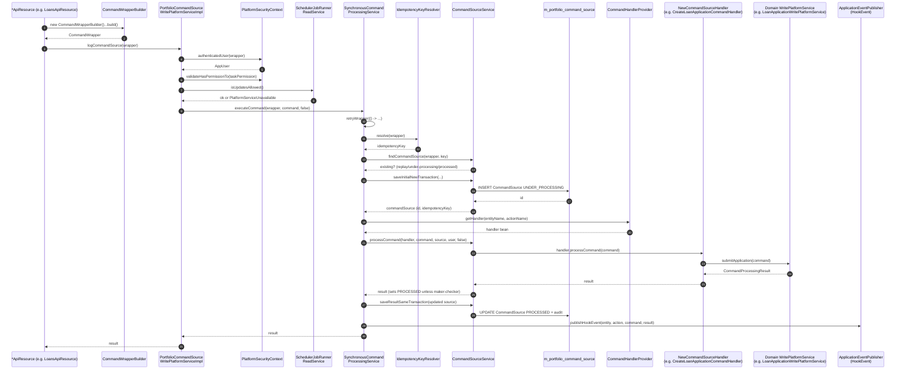

Every state-changing endpoint in Apache Fineract funnels through one pipeline: build a `CommandWrapper`, hand it to `PortfolioCommandSourceWritePlatformService.logCommandSource`, persist a `CommandSource` row, run the matching `NewCommandSourceHandler`, then either commit `PROCESSED` or `ERROR`. This page walks the source code top-to-bottom so you can debug retries, idempotency races, transaction boundaries, and the hook event publication for any write endpoint.

Source map:

- `fineract-core/src/main/java/org/apache/fineract/commands/service/CommandWrapperBuilder.java`
- `fineract-core/src/main/java/org/apache/fineract/commands/service/PortfolioCommandSourceWritePlatformServiceImpl.java`
- `fineract-core/src/main/java/org/apache/fineract/commands/service/SynchronousCommandProcessingService.java`
- `fineract-core/src/main/java/org/apache/fineract/commands/service/CommandSourceService.java`
- `fineract-core/src/main/java/org/apache/fineract/commands/service/IdempotencyKeyResolver.java`

## End-to-end sequence



## Pre-conditions

| Requirement | Notes |
| --- | --- |
| Caller authenticated (Basic / OAuth2) | `PortfolioCommandSourceWritePlatformServiceImpl#logCommandSource` calls `context.authenticatedUser(wrapper)` and throws if absent. |
| Caller holds `wrapper.getTaskPermissionName()` permission | Unless `wrapper.isChangeOfOwnUserDetails(userId)`, in which case the check is bypassed. |
| `SchedulerJobRunnerReadService.isUpdatesAllowed()` returns true | Returns false during a maintenance batch run; throws `PlatformServiceUnavailableException`. |
| Tenant + business dates resolved on this thread | See [Request Lifecycle](/flows/request-lifecycle). |
| For batch sub-requests: outer transaction open | `BatchRequestContextHolder.isEnclosingTransaction()` flips behaviour to "same transaction". |

## Step 1 — Resource builds a CommandWrapper

Every write resource creates a wrapper with a fluent builder. Example for "create loan application":

```java
final CommandWrapper commandRequest = new CommandWrapperBuilder() //
        .createLoanApplication() //
        .withJson(apiRequestBodyAsJson) //
        .build();
final CommandProcessingResult result = this.commandsSourceWritePlatformService.logCommandSource(commandRequest);
return this.toApiJsonSerializer.serialize(result);
```

`CommandWrapperBuilder` exposes one method per entity+action pair (`createClient`, `approveLoanApplication`, `repayLoan`, `disburseLoan`, `updateSavingsAccount`, `createDatatable`, …). Each method sets `actionName`, `entityName`, the URL pieces, and the right resource id, then returns `this`. The final `build()` instantiates a `CommandWrapper` with `idempotencyKey=null` (the resolver will fill it in later).

Common wrapper fields:

| Field | Use |
| --- | --- |
| `actionName` | First half of the handler key — e.g. `CREATE`, `APPROVE`, `DISBURSE`. |
| `entityName` | Second half — e.g. `LOAN`, `CLIENT`, `SAVINGSACCOUNT`. |
| `taskPermissionName` | Permission code checked at `logCommandSource` time. |
| `href` | Reverse URL for audit display. |
| `loanId`/`clientId`/`groupId`/… | Convenience columns persisted on `m_portfolio_command_source`. |
| `sanitizeJsonKeys` | Keys whose values are masked to `***` before persistence — see [Command Source](/command/command-source). |

See [Command Handler Registry](/command/command-handler-registry) for the handler-name convention.

## Step 2 — `PortfolioCommandSourceWritePlatformServiceImpl.logCommandSource`

```java
// fineract-core/.../service/PortfolioCommandSourceWritePlatformServiceImpl.java:51
@Override
public CommandProcessingResult logCommandSource(final CommandWrapper wrapper) {
    boolean isApprovedByChecker = false;
    if (wrapper.isChangeOfOwnUserDetails(this.context.authenticatedUser(wrapper).getId())) {
        isApprovedByChecker = true;
    } else {
        this.context.authenticatedUser(wrapper).validateHasPermissionTo(wrapper.getTaskPermissionName());
    }
    validateIsUpdateAllowed();
    final String json = wrapper.getJson();
    final JsonElement parsedCommand = this.fromApiJsonHelper.parse(json);
    JsonCommand command = JsonCommand.from(json, parsedCommand, this.fromApiJsonHelper, wrapper.getEntityName(),
            wrapper.getEntityId(), wrapper.getSubentityId(), wrapper.getGroupId(), wrapper.getClientId(),
            wrapper.getLoanId(), wrapper.getSavingsId(), wrapper.getTransactionId(), wrapper.getHref(),
            wrapper.getProductId(), wrapper.getCreditBureauId(), wrapper.getOrganisationCreditBureauId(),
            wrapper.getJobName(), wrapper.getLoanExternalId());
    return this.processAndLogCommandService.executeCommand(wrapper, command, isApprovedByChecker);
}
```

Things to know:

- `authenticatedUser(wrapper)` is overloaded — passing the wrapper lets it raise a contextual `NoAuthorizationException` (with the entity name in the message) rather than a generic 401.
- The permission check is fail-fast — `validateHasPermissionTo` throws `NoAuthorizationException` before any DB write.
- `validateIsUpdateAllowed()` delegates to `SchedulerJobRunnerReadService.isUpdatesAllowed()`, used during global batch runs to freeze writes.
- The wrapped JSON is parsed once via Gson, then turned into a `JsonCommand` so handlers receive both raw text and the parsed element.
- `processAndLogCommandService` is the `SynchronousCommandProcessingService` bean — the indirection through `CommandProcessingService` interface keeps the bean swappable.

## Step 3 — `SynchronousCommandProcessingService.executeCommand`

```java
// fineract-core/.../service/SynchronousCommandProcessingService.java:92
public CommandProcessingResult executeCommand(final CommandWrapper wrapper, final JsonCommand command,
        final boolean isApprovedByChecker) {
    return retryWrapper(() -> {
        setIdempotencyKeyStoreFlag(false);
        Long commandId = (Long) fineractRequestContextHolder.getAttribute(COMMAND_SOURCE_ID, null);
        boolean isRetry = commandId != null;
        boolean isEnclosingTransaction = BatchRequestContextHolder.isEnclosingTransaction();
        CommandSource commandSource = null;
        String idempotencyKey;
        if (isRetry) {
            commandSource = commandSourceService.getCommandSource(commandId);
            idempotencyKey = commandSource.getIdempotencyKey();
        } else if ((commandId = command.commandId()) != null) {
            commandSource = commandSourceService.getCommandSource(commandId);
            idempotencyKey = commandSource.getIdempotencyKey();
        } else {
            idempotencyKey = idempotencyKeyResolver.resolve(wrapper);
        }
        exceptionWhenTheRequestAlreadyProcessed(wrapper, idempotencyKey, isRetry);
        AppUser user = context.authenticatedUser(wrapper);
        if (commandSource == null) {
            if (isEnclosingTransaction) {
                commandSource = commandSourceService.getInitialCommandSource(wrapper, command, user, idempotencyKey);
            } else {
                commandSource = commandSourceService.saveInitialNewTransaction(wrapper, command, user, idempotencyKey);
                commandId = commandSource.getId();
            }
        }
        if (commandId != null) {
            storeCommandIdInContext(commandSource);
        }
        setIdempotencyKeyStoreFlag(true);
        return executeCommand(wrapper, command, isApprovedByChecker, commandSource, user, isEnclosingTransaction);
    });
}
```

Step-by-step:

1. **Retry wrapping** — outside a batch transaction the call is wrapped by Resilience4j (`getRetryConfigurationForExecuteCommand`). The retry only fires on whitelisted exceptions (lock-wait, deadlock). Inside a batch enclosing transaction retries are skipped because rollbacks must propagate.
2. **`IDEMPOTENCY_KEY_STORE_FLAG=false`** is set so that the persisted `result` column will not be overwritten until the handler succeeds.
3. **Retry detection** — when `IdempotencyStoreFilter` has already set `COMMAND_SOURCE_ID`, the call is a retry inside the same HTTP request; we re-fetch the existing `CommandSource`.
4. **`command.commandId()`** — set when the wrapper is the result of a maker-checker approval (the resource passes the audit id along).
5. **`IdempotencyKeyResolver.resolve(wrapper)`** — falls back to (a) the wrapper's preset key, (b) the request attribute populated by `IdempotencyStoreFilter`, (c) a freshly generated UUID:

   ```java
   public String resolve(CommandWrapper wrapper) {
       return Optional.ofNullable(wrapper.getIdempotencyKey())
               .orElseGet(() -> getAttribute().orElseGet(idempotencyKeyGenerator::create));
   }
   ```

6. **`exceptionWhenTheRequestAlreadyProcessed`** consults `m_portfolio_command_source` by `(actionName, entityName, idempotencyKey)`:

   - `UNDER_PROCESSING` → throws `IdempotentCommandProcessUnderProcessingException` (HTTP `409`).
   - `PROCESSED` → throws `IdempotentCommandProcessSucceedException` carrying the cached result for replay.
   - `ERROR` → throws `IdempotentCommandProcessFailedException` so the caller sees the prior failure.

7. **Initial CommandSource persistence** — either in a `REQUIRES_NEW` transaction (`saveInitialNewTransaction` — see below) or assembled in-memory if the caller is in a batch enclosing transaction (the row will be flushed by the outer commit).

## Step 4 — `CommandSourceService.saveInitialNewTransaction`

```java
// fineract-core/.../service/CommandSourceService.java:63
@Transactional(propagation = Propagation.REQUIRES_NEW, isolation = Isolation.REPEATABLE_READ)
public CommandSource saveInitialNewTransaction(CommandWrapper wrapper, JsonCommand jsonCommand, AppUser maker, String idempotencyKey) {
    return saveInitial(wrapper, jsonCommand, maker, idempotencyKey);
}

private CommandSource saveInitial(CommandWrapper wrapper, JsonCommand jsonCommand, AppUser maker, String idempotencyKey) {
    try {
        CommandSource initialCommandSource = getInitialCommandSource(wrapper, jsonCommand, maker, idempotencyKey);
        return commandSourceRepository.saveAndFlush(initialCommandSource);
    } catch (JpaSystemException jse) {
        final String message = (jse.getRootCause() != null) ? jse.getRootCause().getMessage() : null;
        if (message != null && message.toUpperCase().contains("UNIQUE_PORTFOLIO_COMMAND_SOURCE")) {
            throw new IdempotentCommandProcessUnderProcessingException(wrapper, idempotencyKey, jse);
        }
        throw jse;
    }
}
```

Notes:

- `REPEATABLE_READ` isolation is forced (MySQL default; explicit for Postgres) so the row read in the next step inherits the same snapshot.
- The DB has a unique constraint `UNIQUE_PORTFOLIO_COMMAND_SOURCE (action_name, entity_name, idempotency_key)`. A `JpaSystemException` mentioning that constraint is the race condition where two concurrent requests with the same key reach `INSERT` simultaneously — the loser maps it to `IdempotentCommandProcessUnderProcessingException`.
- `getInitialCommandSource` builds the row with `status=UNDER_PROCESSING(0)` and applies JSON sanitisation via `wrapper.getSanitizeJsonKeys()` so that PII / passwords never hit the audit table.

## Step 5 — Handler lookup

`SynchronousCommandProcessingService.findCommandHandler` covers special datatable, note, survey, and disbursement actions explicitly via Spring bean names, and falls back to the registry for everything else:

```java
// fineract-core/.../service/SynchronousCommandProcessingService.java:226
if (wrapper.isDatatableResource()) {
    if (wrapper.isCreateDatatable())
        handler = applicationContext.getBean("createDatatableCommandHandler", NewCommandSourceHandler.class);
    ...
} else if (wrapper.isNoteResource()) { ... }
  else if (wrapper.isSurveyResource()) { ... }
  else if (wrapper.isLoanDisburseDetailResource()) { ... }
  else if (wrapper.isInterestPauseResource()) { ... }
  else {
    handler = commandHandlerProvider.getHandler(wrapper.entityName(), wrapper.actionName());
}
```

`CommandHandlerProvider` looks up beans by the `@CommandType(entity=..., action=...)` annotation — see [Command Handler Registry](/command/command-handler-registry).

## Step 6 — `CommandSourceService.processCommand`

```java
// fineract-core/.../service/CommandSourceService.java:115
@Transactional
public CommandProcessingResult processCommand(NewCommandSourceHandler handler, JsonCommand command, CommandSource commandSource,
        AppUser user, boolean isApprovedByChecker) {
    final CommandProcessingResult result = handler.processCommand(command);
    String permission = commandSource.getPermissionCode();
    boolean isMakerChecker = configurationDomainService.isMakerCheckerEnabledForTask(permission);
    if (isMakerChecker || result.isRollbackTransaction()) {
        if (isApprovedByChecker || user.isCheckerSuperUser()) {
            commandSource.markAsChecked(user);
        } else {
            if (commandSource.isSanitized()) {
                throw new GeneralPlatformDomainRuleException("error.msg.invalid.sanitization",
                        "Maker-checker command can not be sanitized, please change the permission configuration", permission);
            }
            commandSource.markAsAwaitingApproval();
            throw new RollbackTransactionNotApprovedException(commandSource.getId(), commandSource.getResourceId());
        }
    }
    return result;
}
```

The handler runs the *real* domain mutation inside a nested transaction (`@Transactional` here joins the outer one). The branches:

- **Plain command**: handler returns, result is propagated up.
- **Maker-checker turned on for the task permission**: the row is flipped to `AWAITING_APPROVAL` (`status=2`) and `RollbackTransactionNotApprovedException` is thrown so the outer transaction rolls back the *business* changes. The `CommandSource` row survives because it's persisted in `REQUIRES_NEW`. See [Maker-Checker Flow](/flows/maker-checker-flow).
- **`result.isRollbackTransaction()` set** by the handler (e.g. "approval required for high-risk loan write-off"): same path as maker-checker.
- **`isApprovedByChecker=true`** (the approve path via `MakercheckersApiResource`) — the row is marked as checked by the current user and the business changes commit normally.

## Step 7 — Persist final result

Back in `SynchronousCommandProcessingService.executeCommand`:

```java
// fineract-core/.../service/SynchronousCommandProcessingService.java:147
CommandSource savedCommandSource = persistenceRetry.executeSupplier(() -> {
    CommandSource currentSource = finalCommandSource;
    attemptNumber.getAndIncrement();
    if (attemptNumber.get() > 1 && commandSource.getId() != null) {
        log.info("Retrying command result save - attempt {} for command ID {}", attemptNumber, finalCommandSource.getId());
        currentSource = commandSourceService.getCommandSource(finalCommandSource.getId());
    }
    currentSource.setResultStatusCode(SC_OK);
    currentSource.updateForAudit(result);
    currentSource.setResult(toApiResultJsonSerializer.serializeResult(result));
    currentSource.setStatus(PROCESSED);
    return commandSourceService.saveResultSameTransaction(currentSource);
});
```

If the supplier exhausts the persistence retry budget, the platform throws `CommandResultPersistenceException` — domain state has committed but the audit row failed to flip; this is exceedingly rare but worth monitoring.

## Step 8 — Hook event publication

```java
// fineract-core/.../service/SynchronousCommandProcessingService.java:175
publishHookEvent(wrapper.entityName(), wrapper.actionName(), command, result);
```

`publishHookEvent` builds a JSON envelope `{entityName, actionName, createdBy, createdByName, createdByFullName, request, response, timestamp}` and publishes a `HookEvent` via `ApplicationContext.publishEvent`. `org.apache.fineract.infrastructure.hooks.processor.HookProcessor` consumes the event asynchronously and posts to any registered web hooks. See [Hooks](/hooks/overview).

Errors during hook publication are caught and logged; they never affect the API response.

## Error path

```java
// fineract-core/.../service/SynchronousCommandProcessingService.java:121
} catch (Throwable t) { // NOSONAR
    RuntimeException mappable = ErrorHandler.getMappable(t);
    ErrorInfo errorInfo = commandSourceService.generateErrorInfo(mappable);
    Integer statusCode = errorInfo.getStatusCode();
    commandSource.setResultStatusCode(statusCode);
    commandSource.setResult(errorInfo.getMessage());
    if (statusCode != SC_OK) {
        commandSource.setStatus(ERROR);
    }
    if (!isEnclosingTransaction) {
        commandSourceService.saveResultNewTransaction(commandSource);
    }
    publishHookErrorEvent(wrapper, command, errorInfo);
    throw mappable;
}
```

- `ErrorHandler.getMappable` peels reflection / proxy wrappers to find a `PlatformApiDataValidationException`, `PlatformResourceNotFoundException`, etc.
- The `CommandSource` row is updated to `ERROR(3)` with the JSON-serialised `ErrorInfo` so the failure is auditable.
- A `HookEvent` of type `Exception` is published so connectors can react to failed commands.
- The original exception is re-thrown — Jersey's exception mapper translates it to the HTTP response.

## Same-transaction vs new-transaction matrix

| Caller mode | Initial save | Result save | Why |
| --- | --- | --- | --- |
| Standalone API call | `saveInitialNewTransaction` (REQUIRES_NEW) | `saveResultSameTransaction` (REQUIRED) | Survives domain rollback so failures are audited; final commit shares the outer txn so result + business state commit atomically. |
| Batch sub-request (`BatchRequestContextHolder.isEnclosingTransaction()`) | In-memory via `getInitialCommandSource` (no flush yet) | Joins enclosing txn | Whole batch must roll back atomically. |
| Maker submission with maker-checker enabled | `saveInitialNewTransaction` | Row flipped to `AWAITING_APPROVAL` in same txn; domain rollback discards business changes | Allows the audit row to persist even though the business transaction rolled back. |
| Checker approval (`approveEntry`) | Re-fetches existing row by `command.commandId()` | `saveResultSameTransaction` flips `PROCESSED` | Domain changes commit; the row carries `maker_id` and `checker_id`. |
| Retry inside same HTTP request (`COMMAND_SOURCE_ID` attribute set) | Re-fetches | `saveResultSameTransaction` | Avoids double-insert when Resilience4j retries. |

## Per-request attribute lifecycle

| Attribute (`FineractRequestContextHolder`) | Set by | Consumed by |
| --- | --- | --- |
| `IdempotencyKeyAttribute` | `IdempotencyStoreFilter` | `IdempotencyKeyResolver.resolve` |
| `idempotencyKeyStoreFlag` | `SynchronousCommandProcessingService` (false at start, true after persist) | `IdempotencyStoreFilter` (on response, decides whether to overwrite `result`) |
| `commandSourceId` | `SynchronousCommandProcessingService.storeCommandIdInContext` | Retry path and `IdempotencyStoreFilter` |

## What the resource sees

`CommandProcessingResult` exposes:

- `commandId` (the `m_portfolio_command_source.id`)
- `entityId` / `entityExternalId` / `loanId` / `clientId` / `groupId` / `officeId`
- `changes` map (the domain handler builds this so the UI knows what to repaint)
- `rollbackTransaction` flag (used by handlers to escalate to maker-checker)
- `resourceIdentifier` (legacy alias for `entityId`)

`toApiJsonSerializer.serializeResult(result)` is the same serializer that wrote the `m_portfolio_command_source.result` column, so the response body and the persisted result are byte-identical (modulo whitespace).

## Configuration knobs

| Property / Configuration row | Effect |
| --- | --- |
| `c_configuration.maker-checker` for a specific permission | Routes commands into the maker-checker flow. |
| `c_configuration.is-same-maker-checker-enabled` | Allows the maker to also be the checker (otherwise `MakercheckersApiResource.approveEntry` rejects). |
| `fineract.idempotency.enabled` | Toggles whether `IdempotencyStoreFilter` enforces unique keys; the resolver still issues UUIDs internally. |
| `fineract.batch.transaction.timeout-seconds` | Bounds the enclosing batch transaction so a slow handler can't hold a connection forever. |
| Resilience4j `retry.executeCommand.*` properties | Tune retry count / backoff for `executeCommand` outside batch mode. |

## Side effects of a successful command

1. One row inserted in `m_portfolio_command_source` (then updated to `PROCESSED` with `result`).
2. Domain rows mutated according to the handler.
3. Optional rows in `m_external_event` for each `notifyPostBusinessEvent` raised by the handler — see [External Event Publishing Flow](/flows/external-event-publishing-flow).
4. `HookEvent` published synchronously to the Spring `ApplicationContext` for any [Hooks](/hooks/overview) listeners.
5. `Idempotency-Key` (if provided) mapped to the resulting row; replays return the cached `result`.

## Where to look next

<CardGroup cols={2}>
  <Card title="Synchronous Command Processing" href="/command/synchronous-command-processing">Method-by-method reading of `SynchronousCommandProcessingService`.</Card>
  <Card title="Command Source" href="/command/command-source">Domain model + DB schema for `m_portfolio_command_source`.</Card>
  <Card title="Command Handler Registry" href="/command/command-handler-registry">How `@CommandType` beans are discovered.</Card>
  <Card title="Idempotency" href="/command/idempotency">Idempotency key generation, replay, and HTTP semantics.</Card>
  <Card title="Maker-Checker Flow" href="/flows/maker-checker-flow">Approve / reject second-step path.</Card>
  <Card title="External Event Publishing Flow" href="/flows/external-event-publishing-flow">From handler to JMS/Kafka.</Card>
</CardGroup>
