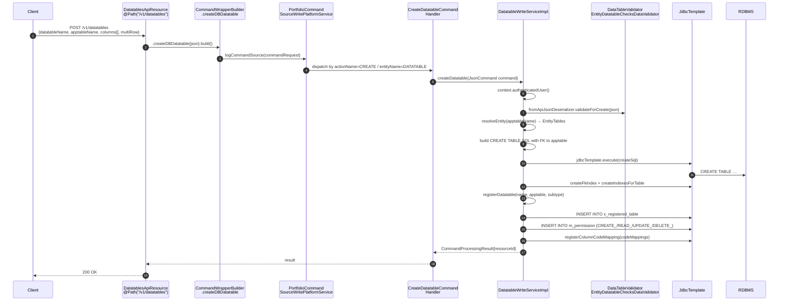
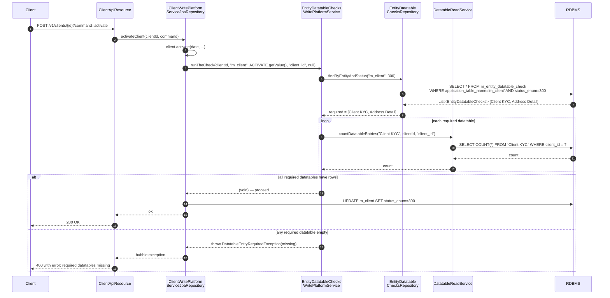

Apache Fineract's datatables let operators add arbitrary columns to core entities (clients, groups, loans, savings, products) without changing the source code. The end-to-end flow has two phases: (1) **creation** — `POST /v1/datatables` translates a JSON column spec into `CREATE TABLE` DDL, registers the new table in `x_registered_table`, and emits permissions; (2) **enforcement** — every time a registered "checked" entity changes state (client activation, group close, loan submit), `EntityDatatableChecksWritePlatformService.runTheCheck` confirms that the required datatable rows already exist and refuses the transition otherwise. This page traces both phases through the actual code.

Source map:

- `fineract-provider/src/main/java/org/apache/fineract/infrastructure/dataqueries/api/DatatablesApiResource.java`
- `fineract-provider/src/main/java/org/apache/fineract/infrastructure/dataqueries/service/DatatableWriteServiceImpl.java`
- `fineract-provider/src/main/java/org/apache/fineract/infrastructure/dataqueries/service/EntityDatatableChecksWritePlatformServiceImpl.java`
- `fineract-provider/src/main/java/org/apache/fineract/portfolio/client/service/ClientWritePlatformServiceJpaRepositoryImpl.java`
- `fineract-provider/src/main/java/org/apache/fineract/portfolio/group/service/GroupingTypesWritePlatformServiceJpaRepositoryImpl.java`

## Phase 1 — Create the datatable

### Sequence



### Resource layer

From `DatatablesApiResource.java`:

```java
@Path("/v1/datatables")
@Component
public class DatatablesApiResource {

    @POST
    @Consumes({ MediaType.APPLICATION_JSON })
    @Produces({ MediaType.APPLICATION_JSON })
    @Operation(summary = "Create Data Table",
               description = "Create a new data table and registers it with the Apache Fineract Core application table.")
    public String createDatatable(@Parameter(hidden = true) final String apiRequestBodyAsJson) {

        final CommandWrapper commandRequest = new CommandWrapperBuilder()
                .createDBDatatable(apiRequestBodyAsJson).build();

        final CommandProcessingResult result =
                this.commandsSourceWritePlatformService.logCommandSource(commandRequest);
        return this.toApiJsonSerializer.serialize(result);
    }
}
```

The request body looks like:

```json
{
  "datatableName": "Client KYC",
  "apptableName": "m_client",
  "multiRow": false,
  "columns": [
    { "name": "national_id", "type": "String", "length": 32, "mandatory": true, "unique": true },
    { "name": "country",     "type": "Dropdown", "code": "Country", "mandatory": false },
    { "name": "verified_on", "type": "Date" }
  ]
}
```

The resource builds a `CommandWrapper` and hands off to the [maker-checker pipeline](/flows/maker-checker-flow). For non-maker-checker actions the dispatcher routes directly to the handler registered for `entity=DATATABLE, action=CREATE`.

### Service implementation

From `DatatableWriteServiceImpl.createDatatable(JsonCommand)`:

```java
@Transactional
@Override
public CommandProcessingResult createDatatable(final JsonCommand command) {
    String datatableName = null;
    try {
        this.context.authenticatedUser();
        this.fromApiJsonDeserializer.validateForCreate(command.json());

        final JsonElement element = this.fromJsonHelper.parse(command.json());
        final JsonArray columns = this.fromJsonHelper.extractJsonArrayNamed(API_PARAM_COLUMNS, element);
        datatableName  = this.fromJsonHelper.extractStringNamed(API_PARAM_DATATABLE_NAME, element);
        String entitySubType = this.fromJsonHelper.extractStringNamed(API_PARAM_SUBTYPE, element);
        final String entityName = this.fromJsonHelper.extractStringNamed(API_PARAM_APPTABLE_NAME, element);
        Boolean multiRow = this.fromJsonHelper.extractBooleanNamed(API_PARAM_MULTIROW, element);
        if (multiRow == null) multiRow = false;

        datatableUtil.validateDatatableName(datatableName);
        EntityTables entityTable = datatableUtil.resolveEntity(entityName);

        final boolean isConstraintApproach =
                this.configurationDomainService.isConstraintApproachEnabledForDatatables();
        final String fkColumnName = datatableUtil.getFKField(entityTable);
        final String dataTableNameAlias = datatableName.toLowerCase().replaceAll("\\s", "_");
        final String fkName = dataTableNameAlias + "_" + fkColumnName;

        StringBuilder sqlBuilder = new StringBuilder();
        sqlBuilder.append("CREATE TABLE ").append(sqlGenerator.escape(datatableName)).append(" (");

        if (multiRow) {
            if (databaseTypeResolver.isMySQL()) {
                sqlBuilder.append(TABLE_FIELD_ID).append(" BIGINT NOT NULL AUTO_INCREMENT, ");
            } else if (databaseTypeResolver.isPostgreSQL()) {
                sqlBuilder.append(TABLE_FIELD_ID).append(
                    " bigint NOT NULL GENERATED BY DEFAULT AS IDENTITY ( … ), ");
            }
        }
        sqlBuilder.append(sqlGenerator.escape(fkColumnName)).append(" BIGINT NOT NULL, ");

        columns.add(addColumn(CREATEDAT_FIELD_NAME, DATETIME, false, null, false, false));
        columns.add(addColumn(UPDATEDAT_FIELD_NAME, DATETIME, false, null, false, false));

        final Map<String, Long> codeMappings = new HashMap<>();
        final StringBuilder constrainBuilder = new StringBuilder();
        for (final JsonElement column : columns) {
            parseDatatableColumnObjectForCreate(column.getAsJsonObject(), sqlBuilder, constrainBuilder,
                    dataTableNameAlias, codeMappings, isConstraintApproach);
        }
        sqlBuilder.delete(sqlBuilder.length() - 2, sqlBuilder.length());     // trim trailing ", "

        // PRIMARY KEY + foreign key to the apptable
        if (multiRow) {
            sqlBuilder.append(", PRIMARY KEY (").append(TABLE_FIELD_ID).append(")");
            sqlBuilder.append(", CONSTRAINT ").append(sqlGenerator.escape("fk_" + fkName))
                      .append(FOREIGN_KEY_CLAUSE).append(sqlGenerator.escape(fkColumnName)).append(") ")
                      .append(REFERENCES_CLAUSE)
                      .append(sqlGenerator.escape(entityTable.getApptableName()))
                      .append(" (").append(TABLE_FIELD_ID).append(")");
        } else {
            sqlBuilder.append(", PRIMARY KEY (").append(sqlGenerator.escape(fkColumnName)).append(")");
            sqlBuilder.append(", CONSTRAINT ").append(sqlGenerator.escape("fk_" + fkName))
                      .append(FOREIGN_KEY_CLAUSE).append(sqlGenerator.escape(fkColumnName)).append(") ")
                      .append(REFERENCES_CLAUSE).append(sqlGenerator.escape(entityTable.getApptableName()))
                      .append(" (").append(TABLE_FIELD_ID).append(")");
        }

        sqlBuilder.append(constrainBuilder).append(")");
        if (databaseTypeResolver.isMySQL()) {
            sqlBuilder.append(" ENGINE=InnoDB DEFAULT CHARSET=UTF8MB4 COLLATE=UTF8MB4_UNICODE_CI;");
        }
        log.debug("SQL:: {}", sqlBuilder);

        jdbcTemplate.execute(sqlBuilder.toString());

        if (multiRow) createFkIndex(datatableName, fkColumnName);
        createIndexesForTable(datatableName, columns);
        registerDatatable(datatableName, entityName, entitySubType);
        registerColumnCodeMapping(codeMappings);
    } catch (final PersistenceException | DataAccessException e) {
        // … translates DB exceptions into ApiParameterError
    }
    return new CommandProcessingResultBuilder().withResourceIdAsString(datatableName).build();
}
```

Key sub-steps:

| Step                         | Detail                                                                                                                                                                                |
|------------------------------|-------------------------------------------------------------------------------------------------------------------------------------------------------------------------------------|
| Validate                     | `validateForCreate(json)` checks shape; `datatableUtil.validateDatatableName(name)` enforces character rules; `resolveEntity(apptableName)` looks up the `EntityTables` enum (m_client, m_group, m_loan, m_office, m_saving_account, m_product_loan, m_savings_product). |
| FK column name               | For each EntityTables value the framework knows the FK column: `client_id` for m_client, `group_id` for m_group, `loan_id` for m_loan, `office_id` for m_office, etc.                |
| `multiRow`                   | If true, table gets its own auto-increment `id` PK and a non-unique FK to the apptable. If false (one-to-one), the FK column **is** the primary key, enforcing one row per parent.    |
| Implicit columns             | `created_at` and `updated_at` (both `DATETIME`) are appended to every column list. These are managed by the app, not by users.                                                       |
| Constraint approach          | When `isConstraintApproachEnabledForDatatables=true`, dropdown columns generate a foreign-key constraint to `m_code_value(code_id)`; otherwise the column is a simple INT.            |
| MySQL DDL suffix             | `ENGINE=InnoDB DEFAULT CHARSET=UTF8MB4 COLLATE=UTF8MB4_UNICODE_CI` only on MySQL/MariaDB.                                                                                            |

### Registering the table

After the `CREATE TABLE` succeeds, `registerDatatable` records the new table in `x_registered_table` and creates permissions:

```java
private void registerDataTable(final String entityName, final String dataTableName, final String entitySubType,
        final Integer category) {
    datatableUtil.resolveEntity(entityName);
    datatableUtil.validateDatatableName(dataTableName);
    validateDataTableExists(dataTableName);

    Map<String, Object> paramMap = new HashMap<>(3);
    final String registerDatatableSql =
        "insert into x_registered_table "
      + "(registered_table_name, application_table_name, entity_subtype, category) "
      + "values (:dataTableName, :applicationTableName, :entitySubType, :category)";
    paramMap.put("dataTableName",        dataTableName);
    paramMap.put("applicationTableName", entityName);
    paramMap.put("entitySubType",        entitySubType);
    paramMap.put("category",             category);

    this.namedParameterJdbcTemplate.update(registerDatatableSql, paramMap);
    this.registerPermissions(dataTableName, true);

    if (category.equals(DataTableApiConstant.CATEGORY_PPI)) {
        this.namedParameterJdbcTemplate.update(
            "insert into c_configuration (name, value, enabled) values (:dataTableName, '0', false)",
            paramMap);
    }
}
```

`registerPermissions` inserts six rows into `m_permission` per datatable:

| Code            | Action             |
|-----------------|--------------------|
| `CREATE_<TBL>`  | Add row            |
| `CREATE_<TBL>_CHECKER` | Maker-checker create |
| `READ_<TBL>`    | Read rows          |
| `UPDATE_<TBL>`  | Edit row           |
| `UPDATE_<TBL>_CHECKER` | Maker-checker update |
| `DELETE_<TBL>`  | Delete row         |
| `DELETE_<TBL>_CHECKER` | Maker-checker delete |

After commit, the new datatable is queryable via `GET /v1/datatables/{datatable}` and writeable via `POST /v1/datatables/{datatable}/{apptableId}`.

### What lives in `x_registered_table`

```
registered_table_name  | application_table_name | entity_subtype | category
-----------------------+------------------------+----------------+----------
Client KYC             | m_client               | (null)         | 100      ← DEFAULT
PPI_2010_BD            | m_client               | (null)         | 200      ← PPI
Loan Extra Info        | m_loan                 | (null)         | 100
Person Detail          | m_client               | PERSON         | 100      ← subtyped
```

`entity_subtype` lets one entity table host multiple "kinds" — `m_group` carries both centers and groups, `m_client` carries `PERSON` and `ENTITY` clients. Datatables can be scoped to a subtype so that, e.g., a "Center Officer" datatable is required for centers but not for groups even though both live in `m_group`.

## Phase 2 — Enforce on entity state transitions

The `m_entity_datatable_check` table records which datatables are **required** before an entity transitions to a given status. The check is run by `EntityDatatableChecksWritePlatformServiceImpl.runTheCheck` from inside the upstream write services at the relevant transition points.

### Enforcement sequence (client activation example)



### The check method

From `EntityDatatableChecksWritePlatformServiceImpl.runTheCheck`:

```java
@Transactional(readOnly = true)
@Override
public void runTheCheck(final Long entityId, final String entityName, final Integer status,
                        String foreignKeyColumn, final String entitySubtype) {
    List<EntityDatatableChecks> tableRequired;
    if (entitySubtype == null) {
        tableRequired = entityDatatableChecksRepository.findByEntityAndStatus(entityName, status);
    } else {
        tableRequired = entityDatatableChecksRepository
                .findByEntityAndStatusAndSubtype(entityName, status, entitySubtype.toUpperCase());
    }

    if (tableRequired != null) {
        List<String> reqDatatables = new ArrayList<>();
        for (EntityDatatableChecks t : tableRequired) {
            final String datatableName = t.getDatatableName();
            final Long countEntries =
                    datatableReadService.countDatatableEntries(datatableName, entityId, foreignKeyColumn);
            log.debug("There are {} entries in the table {}", countEntries, datatableName);
            if (countEntries.intValue() == 0) {
                reqDatatables.add(datatableName);
            }
        }
        if (!reqDatatables.isEmpty()) {
            throw new DatatableEntryRequiredException(reqDatatables.toString());
        }
    }
}
```

The companion `runTheCheckForProduct(entityId, entityName, status, foreignKeyColumn, productId)` lets you scope a check to a specific loan or savings product. The repository call cascades: if a product-specific check exists, that wins; otherwise the global product-less check applies.

### Call sites — where `runTheCheck` fires

| Caller                                                | Trigger                                  | Entity      | Status            |
|-------------------------------------------------------|------------------------------------------|-------------|-------------------|
| `ClientWritePlatformServiceJpaRepositoryImpl.createClient` | Client created                       | `m_client`  | `CREATE` (100)    |
| `ClientWritePlatformServiceJpaRepositoryImpl.activateClient` | Client moved to active                | `m_client`  | `ACTIVATE` (300)  |
| `ClientWritePlatformServiceJpaRepositoryImpl.closeClient` | Client closed                          | `m_client`  | `CLOSE` (600)     |
| `GroupingTypesWritePlatformServiceJpaRepositoryImpl.createGroup` | Group created                       | `m_group`   | `CREATE`          |
| `GroupingTypesWritePlatformServiceJpaRepositoryImpl.activateGroup` | Group activated                    | `m_group`   | `ACTIVATE`        |
| `GroupingTypesWritePlatformServiceJpaRepositoryImpl.closeGroup` | Group closed                         | `m_group`   | `CLOSE`           |
| `GroupingTypesWritePlatformServiceJpaRepositoryImpl.activateCenter` | Center activated                  | `m_group`   | `ACTIVATE`        |
| Loan / savings write services (analogous)             | Submit / approve / disburse              | `m_loan`, `m_saving_account` | corresponding action |

All of these pass the apptable name plus the FK column (`client_id`, `group_id`, `loan_id`, `savings_account_id`) and the integer status code from the corresponding `StatusEnum`.

### Configuring required datatables

The actual rules live in `m_entity_datatable_check` and are managed by the [Entity Datatable Checks API](/dataqueries/entity-datatable-checks):

```
POST /v1/entityDatatableChecks
{
  "entity":  "m_client",
  "status":  300,                   // ACTIVATE
  "datatableName": "Client KYC"
}
```

After insert, every client activation that does **not** have a corresponding `Client KYC` row keyed by `client_id` fails with `error.msg.entity.datatable.check.entry.required: Client KYC`.

## Putting it together — full timeline

```mermaid
flowchart TD
    A[Operator: POST /v1/datatables<br/>+ columns + apptableName=m_client] --> B[DDL: CREATE TABLE Client KYC]
    B --> C[INSERT INTO x_registered_table]
    C --> D[INSERT INTO m_permission × 7]
    D --> E[Datatable usable: POST /v1/datatables/Client%20KYC/{clientId}]

    E --> F[Operator: POST /v1/entityDatatableChecks<br/>{entity:m_client, status:300, datatableName:Client KYC}]
    F --> G[INSERT INTO m_entity_datatable_check]

    G --> H[Frontend agent fills KYC: POST /v1/datatables/Client%20KYC/123 {national_id, country, verified_on}]
    H --> I[INSERT INTO Client KYC]

    I --> J[Operator: POST /v1/clients/123?command=activate]
    J --> K{runTheCheck: m_client, 300, client_id, 123}
    K -- count >= 1 --> L[Client activated]
    K -- count == 0 --> M[400 DatatableEntryRequiredException]

    style B fill:#e8f5e9
    style D fill:#e8f5e9
    style L fill:#bbdefb
    style M fill:#ffcdd2
```

## Edge cases and gotchas

| Situation                                       | Behavior                                                                                                                                            |
|-------------------------------------------------|-----------------------------------------------------------------------------------------------------------------------------------------------------|
| Multi-row datatable with required check         | `countDatatableEntries` returns `> 0` as soon as any row exists. The check does not enforce that all required *columns* on a row are populated.       |
| `entitySubtype` mismatch                        | A check registered with subtype `PERSON` does not fire on `ENTITY` clients (different `entity_subtype` row in `m_client`).                            |
| Deregister a checked datatable                  | `deregisterDatatable` deletes the `x_registered_table` row, the permissions, and the `c_configuration` row. It does **not** delete `m_entity_datatable_check` rows or drop the underlying table — operators must delete them explicitly. |
| Product-specific checks                         | `runTheCheckForProduct` first looks up `findByEntityStatusAndProduct(entity, status, productId)`; only if that returns nothing does it fall back to `findByEntityStatusAndNoProduct`. Per-product overrides hide globals. |
| Race condition on simultaneous activation       | The check + state transition are inside the same `@Transactional` boundary on the client/group write service. A concurrent client activation that completes between SELECT and UPDATE will not bypass the check because both transactions repeat the SELECT under their own snapshot. |
| Dropping the underlying table directly in SQL   | The fineract server has cached `JdbcDataSource` metadata and will surface a `SqlSyntaxException` instead of the expected validation error. Use the `DELETE /v1/datatables/{name}` endpoint. |

## Cross-references

- [Datatables](/dataqueries/datatables) — full API reference and column-type matrix
- [Entity Datatable Checks](/dataqueries/entity-datatable-checks) — how to configure required-datatable rules
- [Maker / Checker Flow](/flows/maker-checker-flow) — how the command pipeline routes the datatable command
- [Command Execution Flow](/flows/command-execution-flow) — what `CommandWrapperBuilder.createDBDatatable` does upstream
- [Multi-Tenancy](/tenancy/overview) — datatables are per-tenant; each tenant has its own `x_registered_table`
