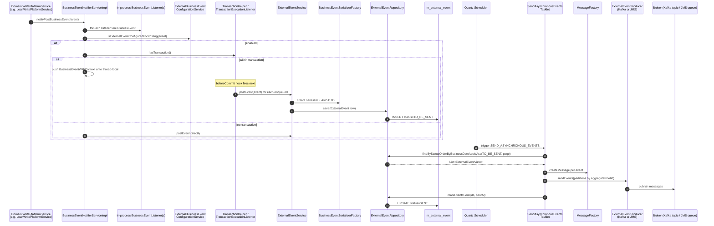

Every meaningful domain change in Apache Fineract — loan approved, transaction booked, savings interest posted, asset owner transfer activated — flows through one notification fabric so that subscribers can react asynchronously without coupling to JPA entities. This page walks the full path: from a domain service calling `notifyPostBusinessEvent`, through the in-process listener phase, into the `m_external_event` outbox table, then out to Kafka or ActiveMQ via the `SEND_ASYNCHRONOUS_EVENTS` job.

Source map:

- `fineract-core/src/main/java/org/apache/fineract/infrastructure/event/business/service/BusinessEventNotifierServiceImpl.java`
- `fineract-core/src/main/java/org/apache/fineract/infrastructure/event/external/service/ExternalEventService.java`
- `fineract-core/src/main/java/org/apache/fineract/infrastructure/event/external/jobs/SendAsynchronousEventsTasklet.java`
- `fineract-core/src/main/java/org/apache/fineract/infrastructure/event/external/producer/ExternalEventProducer.java`
- `fineract-provider/src/main/java/org/apache/fineract/infrastructure/event/external/producer/kafka/KafkaExternalEventProducer.java`
- `fineract-core/src/main/java/org/apache/fineract/infrastructure/event/external/repository/domain/ExternalEvent.java`

## End-to-end sequence



## Pre-conditions

| Requirement | Detail |
| --- | --- |
| `fineract.events.external.enabled=true` | Activates the writing side of the outbox; check `BusinessEventNotifierServiceImpl.isExternalEventPostingEnabled()`. |
| Event type configured for posting in `m_external_event_configuration` | Per-event-type opt-in via [External Event Configuration API](/events/external-event-configuration-api). |
| `fineract.events.external.producer.jms.enabled=true` **or** `fineract.events.external.producer.kafka.enabled=true` | Otherwise the sender tasklet exits early via `isDownstreamChannelEnabled()`. |
| `SEND_ASYNCHRONOUS_EVENTS` job enabled in `m_job` | The outbox stays full until this job ticks. |
| Tenant context populated | `ExternalEventService` writes the tenant DB, and the broker producer uses the tenant id as a routing key. |

## Step 1 — Domain code raises an event

Every write-side service raises a typed `BusinessEvent<T>`. Examples:

```java
// fineract-provider/.../loanaccount/domain/LoanAccountDomainServiceJpa.java:289
journalEntryPoster.postJournalEntriesForLoanTransaction(newRepaymentTransaction, isAccountTransfer, isLoanToLoanTransfer);
if (!repaymentTransactionType.isChargeRefund()) {
    businessEventNotifierService.notifyPostBusinessEvent(new LoanBalanceChangedBusinessEvent(loan));
    businessEventNotifierService.notifyPostBusinessEvent(transactionRepaymentEvent);
}
```

```java
// fineract-investor/.../cob/loan/LoanAccountOwnerTransferBusinessStep.java:120
businessEventNotifierService.notifyPostBusinessEvent(new LoanOwnershipTransferBusinessEvent(newExternalAssetOwnerTransfer, loan));
if (!ExternalTransferStatus.DECLINED.equals(newExternalAssetOwnerTransfer.getStatus())) {
    businessEventNotifierService.notifyPostBusinessEvent(new LoanAccountSnapshotBusinessEvent(loan));
}
```

`BusinessEvent<T>` exposes `getType()`, `getCategory()`, and `getAggregateRootId()` (the natural partition key — usually loan id, savings id, or client id). See [Business Events](/events/business-events) for the catalogue.

## Step 2 — `notifyPostBusinessEvent`

```java
// fineract-core/.../event/business/service/BusinessEventNotifierServiceImpl.java:93
@Override
@Transactional(propagation = Propagation.SUPPORTS)
public void notifyPostBusinessEvent(BusinessEvent<?> businessEvent) {
    throwExceptionIfBulkEvent(businessEvent);
    boolean isExternalEvent = !(businessEvent instanceof NoExternalEvent);
    List<BusinessEventListener> businessEventListeners = findSuitableListeners(postListeners, businessEvent.getClass());
    for (BusinessEventListener eventListener : businessEventListeners) {
        eventListener.onBusinessEvent(businessEvent);
    }
    if (isExternalEvent && isExternalEventPostingEnabled()) {
        if (externalBusinessEventConfigurationService.isExternalEventConfiguredForPosting(businessEvent)) {
            if (isExternalEventRecordingEnabled()) {
                recordedEvents.get().add(businessEvent);
            } else {
                if (transactionHelper.hasTransaction()) {
                    storeTransactionalBusinessEvent(businessEvent);
                } else {
                    externalEventService.postEvent(businessEvent);
                }
            }
        }
    }
}
```

Three things happen, in order:

1. **In-process listeners** — every `BusinessEventListener<T>` registered for this event class is invoked synchronously. Examples:
   - `LoanAccrualEventListener` flags loans for accrual recompute.
   - `LoanCreatedHookListener` triggers webhooks.
   - The [Notification](/notification/overview) subsystem posts UI notifications.

   These listeners are **inside** the calling transaction. If one of them throws, the whole domain change rolls back.

2. **External event opt-in check** — `ExternalBusinessEventConfigurationService.isExternalEventConfiguredForPosting(event)` reads `m_external_event_configuration` (cached). If the event type is not configured, the path stops here. This is the single gate that decides whether downstream subscribers get the event.

3. **Transactional outbox** — when called from inside a transaction (the normal case), the event is pushed onto a thread-local stack via `storeTransactionalBusinessEvent`. The actual outbox write happens at `beforeCommit` time so the outbox row and the domain state commit atomically.

## Step 3 — Transactional outbox via `beforeCommit`

`BusinessEventNotifierServiceImpl` implements `TransactionExecutionListener` and is registered with `TransactionHelper`:

```java
// fineract-core/.../event/business/service/BusinessEventNotifierServiceImpl.java:197
@Override
public void afterBegin(TransactionExecution transaction, Throwable beginFailure) {
    transactionBusinessEvents.get().push(new ArrayList<>());
}

@Override
public void beforeCommit(@NonNull final TransactionExecution transaction) {
    final List<BusinessEventWithContext> businessEventWithContexts = transactionBusinessEvents.get().peek();
    if (businessEventWithContexts.isEmpty()) {
        return;
    }
    final FineractContext originalContext = ThreadLocalContextUtil.getContext();
    businessEventWithContexts.forEach(businessEventWithContext -> {
        final FineractContext currentContext = businessEventWithContext.getFineractContext();
        boolean swappedContext = false;
        try {
            if (!originalContext.equals(currentContext)) {
                swappedContext = true;
                ThreadLocalContextUtil.init(currentContext);
            }
            externalEventService.postEvent(businessEventWithContext.getEvent());
        } finally {
            if (swappedContext) {
                ThreadLocalContextUtil.init(originalContext);
            }
        }
    });
}
```

Why so careful with the context? When an async worker (e.g. the [Loan COB Flow](/flows/loan-cob-flow) chunk thread) raises events, the `beforeCommit` hook may run on a different `FineractContext` snapshot than the one active when the event was raised. Swapping back guarantees the outbox row is written into the right tenant DB and the right business date.

`afterCommit` simply pops the stack via `cleanup()`. `afterRollback` discards the queued events — they were never persisted, no further action needed.

## Step 4 — `ExternalEventService.postEvent`

```java
// fineract-core/.../event/external/service/ExternalEventService.java:57
public <T> void postEvent(BusinessEvent<T> event) {
    if (event == null) {
        throw new IllegalArgumentException("event cannot be null");
    }
    try {
        entityManager.flush();
        ExternalEvent externalEvent;
        if (event instanceof BulkBusinessEvent) {
            externalEvent = handleBulkBusinessEvent((BulkBusinessEvent) event);
        } else {
            externalEvent = handleRegularBusinessEvent(event);
        }
        repository.save(externalEvent);
        log.debug("Saved message with idempotency key: [{}] of type [{}] and category [{}]", externalEvent.getIdempotencyKey(),
                externalEvent.getType(), externalEvent.getCategory());
    } catch (IOException e) {
        throw new RuntimeException("Error while serializing event " + event.getClass().getSimpleName(), e);
    }
}
```

`handleRegularBusinessEvent` produces the row:

```java
// fineract-core/.../event/external/service/ExternalEventService.java:97
private <T> ExternalEvent handleRegularBusinessEvent(BusinessEvent<T> event) throws IOException {
    String eventType = event.getType();
    String eventCategory = event.getCategory();
    String idempotencyKey = idempotencyKeyGenerator.generate(event);
    BusinessEventSerializer serializer = serializerFactory.create(event);
    String schema = serializer.getSupportedSchema().getName();
    ByteBufferSerializable avroDto = dataEnricherProcessor.enrich(serializer.toAvroDTO(event));
    ByteBuffer buffer = avroDto.toByteBuffer();
    byte[] data = byteBufferConverter.convert(buffer);
    Long aggregateRootId = event.getAggregateRootId();
    return new ExternalEvent(eventType, eventCategory, schema, data, idempotencyKey, aggregateRootId);
}
```

Important details:

- **`entityManager.flush()`** before serialisation — guarantees the domain state Hibernate is holding has been pushed to the DB so the serializer can read final ids and derived columns.
- **Avro serialisation** — `BusinessEventSerializerFactory.create(event)` picks the right `BusinessEventSerializer` for the event's class. Each one converts the entity graph into an Avro DTO. The schema name is the Avro schema fully-qualified name (e.g. `LoanTransactionDataV1`). See [Avro Schemas](/events/avro-schemas) and [Event Serialization Mappers](/events/event-serialization-mappers).
- **`dataEnricherProcessor.enrich`** layers tenant-configurable enrichments (e.g. injecting external client identifiers) before serialisation.
- **`idempotencyKey`** — `ExternalEventIdempotencyKeyGenerator.generate(event)` produces a deterministic key from the event type + aggregate id + a sequence so that consumers can dedup. See [Event Idempotency](/events/event-idempotency).
- **`aggregateRootId`** — used downstream to partition messages so the order of events for the same loan / savings account is preserved.

`BulkBusinessEvent` (`handleBulkBusinessEvent`) packs many events into one Avro `BulkMessagePayloadV1` with sequential ids — used by jobs that touch many entities in one transaction (e.g. interest posting).

### `m_external_event` row

| Column | Value |
| --- | --- |
| `type` | e.g. `LoanRepaymentBusinessEvent` |
| `category` | e.g. `Loan` |
| `schema` | e.g. `org.apache.fineract.avro.loan.v1.LoanTransactionDataV1` |
| `data` | raw Avro bytes |
| `idempotency_key` | sha256-based unique key |
| `aggregate_root_id` | e.g. loan id |
| `status` | `TO_BE_SENT` (default) |
| `created_at` / `business_date` | from `DateUtils.getAuditOffsetDateTime()` + `BUSINESS_DATE` |
| `sent_at` | NULL until the sender job runs |

See [External Event Domain](/events/external-event-domain) for the JPA entity and the `Status` enum.

## Step 5 — `SEND_ASYNCHRONOUS_EVENTS` job

```java
// fineract-core/.../event/external/jobs/SendAsynchronousEventsTasklet.java:64
@Override
public RepeatStatus execute(StepContribution contribution, ChunkContext chunkContext) {
    try {
        if (isDownstreamChannelEnabled()) {
            List<ExternalEventView> events = getQueuedEventsBatch();
            log.debug("Queued events size: {}", events.size());
            sendEvents(events);
        }
    } catch (Exception e) {
        log.error("Error occurred while processing events: ", e);
    }
    return RepeatStatus.FINISHED;
}

protected boolean isDownstreamChannelEnabled() {
    return fineractProperties.getEvents().getExternal().getProducer().getJms().isEnabled()
            || fineractProperties.getEvents().getExternal().getProducer().getKafka().isEnabled();
}
```

Steps inside `sendEvents`:

```java
// fineract-core/.../event/external/jobs/SendAsynchronousEventsTasklet.java:88
private void sendEvents(List<ExternalEventView> queuedEvents) {
    Map<Long, List<byte[]>> partitions = generatePartitions(queuedEvents);
    List<Long> eventIds = queuedEvents.stream().map(ExternalEventView::getId).toList();
    sendEventsToProducer(partitions);
    markEventsAsSent(eventIds);
}
```

`generatePartitions` groups events by `aggregateRootId` (events with no aggregate id collapse into the synthetic partition `-1`) and turns each `ExternalEventView` into a fully-wrapped `MessageV1` Avro envelope via `MessageFactory.createMessage(event)`:

```java
// fineract-core/.../event/external/jobs/SendAsynchronousEventsTasklet.java:142
private List<byte[]> createMessages(List<ExternalEventView> events) {
    try {
        List<byte[]> messages = new ArrayList<>();
        for (ExternalEventView event : events) {
            MessageV1 message = messageFactory.createMessage(event);
            ByteBuffer toByteBuffer = message.toByteBuffer();
            byte[] convert = byteBufferConverter.convert(toByteBuffer);
            messages.add(convert);
            log.trace("Created message to send with id: [{}], type: [{}], idempotency key: [{}]",
                    message.getId(), message.getType(), message.getIdempotencyKey());
        }
        return messages;
    } catch (IOException e) {
        throw new RuntimeException("Error while serializing the message", e);
    }
}
```

The `MessageV1` envelope carries metadata that consumers need (tenant, source, schema name, idempotency key, business date) on top of the raw event payload — see [Avro Schemas](/events/avro-schemas) for the schema.

## Step 6 — Producer dispatch

`ExternalEventProducer` is an interface:

```java
public interface ExternalEventProducer {
    void sendEvents(Map<Long, List<byte[]>> partitions);
}
```

Two production implementations:

- `KafkaExternalEventProducer` (`fineract-provider/.../producer/kafka/KafkaExternalEventProducer.java`) wraps `KafkaTemplate.send(topic, partitionKey, payload)`. The partition key is the `aggregateRootId` so all events for the same loan land on the same Kafka partition and order is preserved per-loan. See [Event Producer Kafka](/events/event-producer-kafka).
- `JmsExternalEventProducer` (`fineract-provider/.../producer/jms/JmsExternalEventProducer.java`) uses `JmsTemplate.send(queue, message)`. Ordering is queue-wide. See [Event Producer JMS](/events/event-producer-jms).
- `NoopExternalEventProducer` is selected when neither broker is enabled — it logs and discards, but the tasklet's `isDownstreamChannelEnabled()` short-circuits before we get here.

When both Kafka and JMS are enabled, the producer is a composite (`PrimaryAndFallback...`) — Kafka first, JMS as fallback. The exact wiring lives in `EventProducerConfig`.

## Step 7 — Mark events sent

```java
// fineract-core/.../event/external/jobs/SendAsynchronousEventsTasklet.java:96
private void markEventsAsSent(final List<Long> eventIds) {
    OffsetDateTime sentAt = DateUtils.getAuditOffsetDateTime();
    final int partitionSize = fineractProperties.getEvents().getExternal().getPartitionSize();
    List<List<Long>> partitions = Lists.partition(eventIds, partitionSize);
    List<Future<?>> tasks = new ArrayList<>();
    final FineractContext context = ThreadLocalContextUtil.getContext();
    partitions.forEach(partitionedEventIds -> {
        tasks.add(threadPoolTaskExecutor.submit(() -> {
            try {
                ThreadLocalContextUtil.init(context);
                transactionTemplate.execute((status) -> {
                    repository.markEventsSent(partitionedEventIds, sentAt);
                    return null;
                });
            } finally {
                ThreadLocalContextUtil.reset();
            }
        }));
    });
    for (Future<?> task : tasks) {
        try { task.get(); }
        catch (InterruptedException e) { log.error("Interrupted while marking events as sent", e); }
        catch (ExecutionException e) { log.error("Exception while marking events as sent", e); }
    }
}
```

Why partition the UPDATE? Postgres / MySQL limit prepared-statement parameters to ~65k. Partition size (default 1000) keeps `WHERE id IN (...)` IN-list small. The partitions run on the event-marks-as-sent task executor so the broker can keep filling its queue while the DB update finishes.

The `UPDATE m_external_event SET status='SENT', sent_at=:sentAt WHERE id IN (...)` is the only thing that prevents the next job tick from re-sending the same messages.

## Side effects

| When | What | Where |
| --- | --- | --- |
| Inside the domain transaction | Outbox stack appends `BusinessEventWithContext` | `BusinessEventNotifierServiceImpl.notifyPostBusinessEvent` |
| At `beforeCommit` | `INSERT INTO m_external_event (..., status='TO_BE_SENT')` | `ExternalEventService.postEvent` |
| Periodically | `SELECT ... WHERE status='TO_BE_SENT' ORDER BY business_date, id` | `SendAsynchronousEventsTasklet.getQueuedEventsBatch` |
| Per job tick | Messages sent to Kafka/JMS, `UPDATE m_external_event SET status='SENT'` | `SendAsynchronousEventsTasklet` |
| Periodically | Old rows purged | `PURGE_EXTERNAL_EVENTS` job — see [Purge Events Job](/events/purge-events-job) |

## Error paths

| Failure | Behaviour |
| --- | --- |
| Serialiser throws `IOException` | `ExternalEventService.postEvent` re-throws `RuntimeException`; the surrounding `beforeCommit` aborts the commit; domain transaction rolls back. |
| Producer throws (Kafka broker down) | Caught in `SendAsynchronousEventsTasklet.execute`; logged; `markEventsAsSent` NOT called → next tick retries. |
| `markEventsAsSent` succeeds but producer didn't actually deliver | Consumers must dedup by `idempotencyKey`. See [Event Idempotency](/events/event-idempotency). |
| `m_external_event_configuration` row missing for a new event type | The outbox row is never written; the event silently drops at the opt-in check. Operations must register new event types via [External Event Configuration API](/events/external-event-configuration-api). |
| Tenant context mismatch at `beforeCommit` | Restored by the `swappedContext` block; event lands in the right tenant DB. |
| Out-of-order delivery for the same aggregate | Kafka producer keys by `aggregateRootId`, so this is impossible per-partition. JMS path has no ordering guarantee beyond queue FIFO; consumers requiring strict order should switch to Kafka. |

## Recording mode (testing helper)

```java
// fineract-core/.../event/business/service/BusinessEventNotifierServiceImpl.java (paraphrased lines 152-180)
@Override
public void startExternalEventRecording() { ... }
@Override
public void stopExternalEventRecording() {
    if (recordedBusinessEvents.size() == 1) {
        externalEventService.postEvent(recordedBusinessEvents.get(0));
    } else if (recordedBusinessEvents.size() > 1) {
        externalEventService.postEvent(new BulkBusinessEvent(recordedBusinessEvents));
    }
}
```

When `isExternalEventRecordingEnabled()` returns true (typically scoped to a unit of work, e.g. a COB chunk), `notifyPostBusinessEvent` accumulates events and a single `BulkBusinessEvent` is emitted at the end. Useful for batch flows where dozens of small events would otherwise flood the outbox.

## Configuration knobs

| Property | Effect |
| --- | --- |
| `fineract.events.external.enabled` | Master switch — when off, no outbox writes. |
| `fineract.events.external.producer.kafka.enabled` | Toggles Kafka. |
| `fineract.events.external.producer.jms.enabled` | Toggles JMS. |
| `fineract.events.external.partition-size` | Max ids per `IN (...)` batch update in `markEventsAsSent`. |
| `c_configuration.external-events-batch-size` | Read batch size for `getQueuedEventsBatch`. |
| `m_external_event_configuration` rows | Per-event-type opt-in. |
| `fineract.tasks.external-events.send-async.thread-pool-size` etc. | Tuning for the marks-as-sent executor. |

## Where to look next

<CardGroup cols={2}>
  <Card title="Business Events" href="/events/business-events">Catalogue of event types and aggregate root mappings.</Card>
  <Card title="External Event Domain" href="/events/external-event-domain">`m_external_event` schema and lifecycle.</Card>
  <Card title="Event Producer Kafka" href="/events/event-producer-kafka">Kafka topic + partitioning details.</Card>
  <Card title="Event Producer JMS" href="/events/event-producer-jms">JMS queue + ActiveMQ setup.</Card>
  <Card title="Event Idempotency" href="/events/event-idempotency">How consumers dedup using the idempotency key.</Card>
  <Card title="Purge Events Job" href="/events/purge-events-job">Retention of `m_external_event`.</Card>
</CardGroup>
