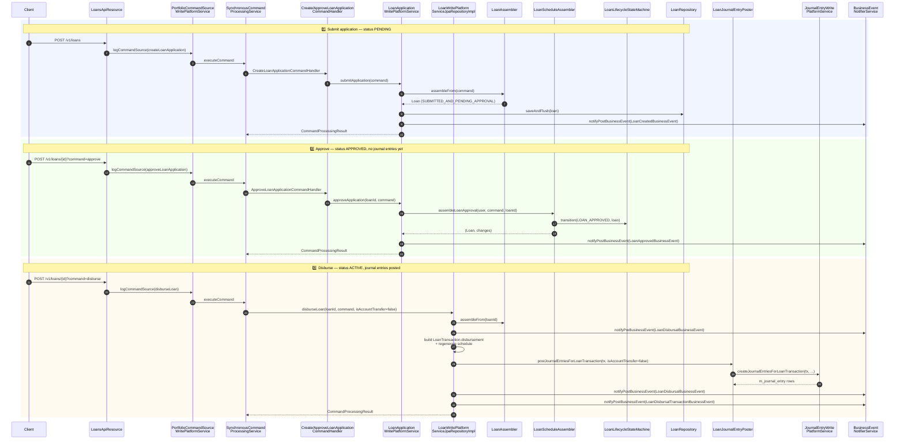
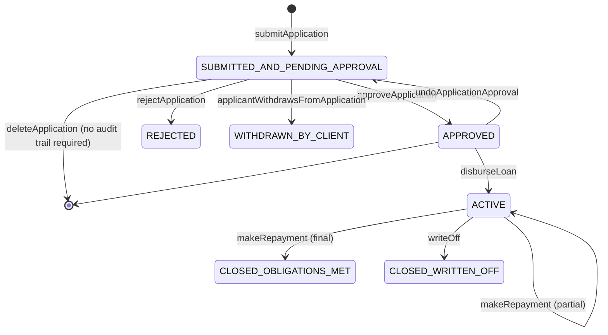
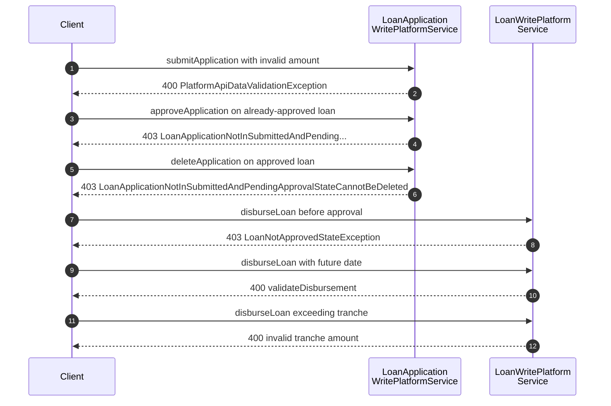

A loan in Apache Fineract moves through three primary state transitions before money leaves the books: `SUBMITTED_AND_PENDING_APPROVAL` → `APPROVED` → `ACTIVE`. This page traces the call chain end-to-end for each transition, the schedule mathematics that happens behind the scenes, the events fired, and the journal entries posted on disbursement. It complements [Loan Application Write Service](/loan/loan-application-write-service), [Loan Write Service](/loan/loan-write-service), and [Loan Disbursement API](/loan/loan-disbursement-api).

Source map:

- `fineract-provider/src/main/java/org/apache/fineract/portfolio/loanaccount/api/LoansApiResource.java`
- `fineract-provider/src/main/java/org/apache/fineract/portfolio/loanaccount/service/LoanApplicationWritePlatformServiceJpaRepositoryImpl.java`
- `fineract-provider/src/main/java/org/apache/fineract/portfolio/loanaccount/service/LoanWritePlatformServiceJpaRepositoryImpl.java`
- `fineract-provider/src/main/java/org/apache/fineract/accounting/journalentry/service/JournalEntryWritePlatformServiceJpaRepositoryImpl.java`

## End-to-end sequence



## Pre-conditions

| Step | Requirement |
| --- | --- |
| Submit | Caller has `CREATE_LOAN`. `m_client.status_enum=300` (active). Product exists, not retired. Required datatables defined for the product satisfied. |
| Approve | Caller has `APPROVE_LOAN`. Loan in `SUBMITTED_AND_PENDING_APPROVAL`. Approved amount ≤ `max_principal` of the product. Mandatory datatables for `APPROVE` status present. |
| Disburse | Caller has `DISBURSE_LOAN`. Loan in `APPROVED`. Branch not in maintenance. Sufficient client/group collateral if collateral validation is enabled. Cashier limits respected when paying cash (`cashierTransactionDataValidator`). |
| All | Tenant + business date threadlocals populated; SchedulerJobRunner allows updates; idempotency key not previously used for the same action. |

## Loan lifecycle



The transitions are gated by `LoanLifecycleStateMachine.transition(LoanEvent, loan)` invoked from the write services; see [Loan Domain Model](/loan/loan-domain-model) for the LoanEvent matrix.

## Step 1 — Submit application

```java
// fineract-provider/.../loanaccount/service/LoanApplicationWritePlatformServiceJpaRepositoryImpl.java:134
@Transactional
@Override
public CommandProcessingResult submitApplication(final JsonCommand command) {
    try {
        this.loanApplicationValidator.validateForCreate(command);
        final Loan loan = this.loanAssembler.assembleFrom(command);
        this.loanApplicationValidator.validateForCreate(loan);
        this.loanRepositoryWrapper.saveAndFlush(loan);
        this.loanAssembler.accountNumberGeneration(command, loan);
        if (loan.getLoanProduct().isInterestRecalculationEnabled()) {
            createAndPersistCalendarInstanceForInterestRecalculation(loan);
        }
        final String submittedOnNote = command.stringValueOfParameterNamed("submittedOnNote");
        createNote(submittedOnNote, loan);
        createCalendar(command, loan);
        final Long savingsAccountId = command.longValueOfParameterNamed("linkAccountId");
        createSavingsAccountAssociation(savingsAccountId, loan);
        if (command.parameterExists(LoanApiConstants.datatables)) {
            this.entityDatatableChecksWritePlatformService.saveDatatables(StatusEnum.CREATE.getValue(),
                    EntityTables.LOAN.getName(), loan.getId(), loan.productId(),
                    command.arrayOfParameterNamed(LoanApiConstants.datatables));
        }
        loanRepositoryWrapper.flush();
        this.entityDatatableChecksWritePlatformService.runTheCheckForProduct(loan.getId(), EntityTables.LOAN.getName(),
                StatusEnum.CREATE.getValue(), EntityTables.LOAN.getForeignKeyColumnNameOnDatatable(), loan.productId());
        if (command.parameterExists(LoanApiConstants.ORIGINATORS_PARAM)) { ... }
        businessEventNotifierService.notifyPostBusinessEvent(new LoanCreatedBusinessEvent(loan));
        return new CommandProcessingResultBuilder() //
                .withCommandId(command.commandId()) //
                .withEntityId(loan.getId()) //
                .withEntityExternalId(loan.getExternalId()) //
                .withOfficeId(loan.getOfficeId()) //
                .withClientId(loan.getClientId()) //
                .withGroupId(loan.getGroupId()) //
                .withLoanId(loan.getId()).withGlimId(loan.getGlimId()).build();
    } catch (...) { ... }
}
```

What this does in detail:

1. **Pre-assembly validation** (`validateForCreate(JsonCommand)`): JSON well-formedness, required fields, currency consistency, `loanType` compatibility (individual/group/jlg/glim).
2. **Assembly** (`LoanAssembler.assembleFrom`): builds the full `Loan` aggregate — `LoanProductRelatedDetail`, `LoanCharge`s, `LoanDisbursementDetails`, `LoanCollateralManagement`s, `LoanRepaymentScheduleInstallment`s — and seeds the schedule with `LoanScheduleAssembler.assembleLoanScheduleFrom`.
3. **Post-assembly validation**: cross-field rules that need the assembled entity (e.g. `approvedPrincipal ≤ maxPrincipalOnProduct`, collateral coverage).
4. **`saveAndFlush(loan)`** — assigns `id`. Required because the assembler subsequently generates an account number using the id.
5. **Calendar / interest recalculation** — for products with interest recalculation enabled, a `m_calendar` + `m_calendar_instance` row is added per the rest frequency.
6. **Datatables** — both maker-supplied (`datatables` array) and platform-mandated (`runTheCheckForProduct(..., StatusEnum.CREATE)`). See [Datatable Extension Flow](/flows/datatable-extension-flow).
7. **Originator linking** — for [Loan Origination](/loan-origination/overview) flows the originators array is materialised into `m_loan_originator`.
8. **Business event** — `LoanCreatedBusinessEvent`. If the [External Events](/events/business-events) configuration enables it, an `m_external_event` row is inserted in the same transaction. See [External Event Publishing Flow](/flows/external-event-publishing-flow).

Failure modes:

- `JpaSystemException` / `DataIntegrityViolationException` → `handleDataIntegrityIssues` translates DB constraint violations (duplicate account number, duplicate `m_loan_charge` PK) into `PlatformDataIntegrityException` with a friendly code.
- `PlatformApiDataValidationException` → 400 with `errors[]`.
- `GroupMemberNotFoundInGSIMException` for invalid GLIM/JLG composition.

State at end: `m_loan.loan_status_id = 100` (SUBMITTED_AND_PENDING_APPROVAL).

## Step 2 — Approve application

```java
// fineract-provider/.../service/LoanApplicationWritePlatformServiceJpaRepositoryImpl.java:563
@Transactional
@Override
public CommandProcessingResult approveApplication(final Long loanId, final JsonCommand command) {
    final AppUser currentUser = getAppUserIfPresent();
    loanApplicationValidator.validateApproval(command, loanId);
    Pair<Loan, Map<String, Object>> loanAndChanges = loanScheduleAssembler.assembleLoanApproval(currentUser, command, loanId);
    final Loan loan = loanAndChanges.getLeft();
    final Map<String, Object> changes = loanAndChanges.getRight();
    if (!changes.isEmpty()) {
        final String noteText = command.stringValueOfParameterNamed("note");
        createNote(noteText, loan).ifPresent(note -> changes.put("note", noteText));
        businessEventNotifierService.notifyPostBusinessEvent(new LoanApprovedBusinessEvent(loan));
    }
    return new CommandProcessingResultBuilder() //
            .withCommandId(command.commandId()) //
            .withEntityId(loan.getId()) //
            .withEntityExternalId(loan.getExternalId()) //
            .withOfficeId(loan.getOfficeId()) //
            .withClientId(loan.getClientId()) //
            .withGroupId(loan.getGroupId()) //
            .withLoanId(loanId) //
            .with(changes) //
            .build();
}
```

`LoanScheduleAssembler.assembleLoanApproval` is the heavy lifter:

- Validates the approval command (approved amount, approval date).
- Transitions state: `LoanLifecycleStateMachine.transition(LoanEvent.LOAN_APPROVED, loan)` flips `loan_status_id` to `200`.
- If the approved amount differs from the proposed amount, **regenerates the schedule** via `LoanScheduleService.regenerateRepaymentSchedule` using the `ScheduleGeneratorDTO` built from current holidays / working days.
- Adjusts `net_disbursal_amount` and persists.
- Runs the `APPROVE` datatable check (`runTheCheckForProduct(..., StatusEnum.APPROVE.getValue())`).

`undoApplicationApproval` is the inverse (`LoanEvent.LOAN_APPROVAL_UNDO`) — schedules are regenerated back to the proposed principal and accruals reprocessed.

No journal entries are written on approval; the platform models approval as a commitment, not a movement of cash.

## Step 3 — Disburse

```java
// fineract-provider/.../service/LoanWritePlatformServiceJpaRepositoryImpl.java:322
@Transactional
@Override
public CommandProcessingResult disburseLoan(final Long loanId, final JsonCommand command, Boolean isAccountTransfer,
        Boolean isWithoutAutoPayment) {
    loanTransactionValidator.validateDisbursement(command, isAccountTransfer, loanId);
    Loan loan = loanAssembler.assembleFrom(loanId);
    if (loan.loanProduct().isDisallowExpectedDisbursements()) {
        // synthesise a single disbursement detail for products that don't pre-define tranches
        ...
    }
    final LocalDate nextPossibleRepaymentDate = loan.getNextPossibleRepaymentDateForRescheduling();
    final LocalDate rescheduledRepaymentDate = command.localDateValueOfParameterNamed("adjustRepaymentDate");
    final LocalDate actualDisbursementDate = command.localDateValueOfParameterNamed("actualDisbursementDate");
    if (!loan.isMultiDisburmentLoan()) {
        loan.setActualDisbursementDate(actualDisbursementDate);
    }
    ScheduleGeneratorDTO scheduleGeneratorDTO = this.loanUtilService.buildScheduleGeneratorDTO(loan, null);
    businessEventNotifierService.notifyPreBusinessEvent(new LoanDisbursalBusinessEvent(loan));
    ...
    final PaymentDetail paymentDetail = this.paymentDetailWritePlatformService.createAndPersistPaymentDetail(command, changes);
    ...
    if (canDisburse(loan)) {
        ...
        LoanTransaction disbursementTransaction = LoanTransaction.disbursement(loan, amountToDisburse, paymentDetail,
                actualDisbursementDate, txnExternalId, loan.getTotalOverpaidAsMoney());
        disbursementTransaction.updateLoan(loan);
        loan.addLoanTransaction(disbursementTransaction);
        loanTransactionRepository.saveAndFlush(disbursementTransaction);
        journalEntryPoster.postJournalEntriesForLoanTransaction(disbursementTransaction, false, false);
        ...
        regenerateScheduleOnDisbursement(command, loan, recalculateSchedule, scheduleGeneratorDTO,
                nextPossibleRepaymentDate, rescheduledRepaymentDate);
        ...
        disburseLoan(command, isPaymentTypeApplicableForDisbursementCharge, paymentDetail, loan, currentUser, changes, scheduleGeneratorDTO);
        ...
    }
    ...
    businessEventNotifierService.notifyPostBusinessEvent(new LoanDisbursalBusinessEvent(loan));
    ...
}
```

Major sub-flows:

### 3a — Validation and pre-event

- `LoanTransactionValidator.validateDisbursement` rejects: future dates beyond business date, disbursement before approval date, multiple disbursements on a non-tranche product, unmet datatable mandates.
- `notifyPreBusinessEvent(new LoanDisbursalBusinessEvent(loan))` — used by some custom listeners for synchronous gating (e.g. compliance hold).

### 3b — Payment detail

`PaymentDetailWritePlatformService.createAndPersistPaymentDetail` inserts an `m_payment_detail` row (cheque number, routing code, bank id, etc.). For cash payments, `cashierTransactionDataValidator.validateOnLoanDisbursal` enforces the cashier's daily cash limit.

### 3c — Build LoanTransaction.disbursement

`LoanTransaction.disbursement(loan, amount, paymentDetail, actualDisbursementDate, externalId, overpaid)` creates a transaction with `type_enum=1` (DISBURSEMENT). For tranche products this represents a single tranche; for single-disbursement loans it's the entire amount.

### 3d — Schedule regeneration

`regenerateScheduleOnDisbursement`:

- For interest-recalculating products, generates a new schedule starting from `actualDisbursementDate`.
- Adjusts first repayment date based on holidays / non-working-day rules.
- For multi-disbursement loans, splits remaining tranches into a future-expected list.

If down payment is enabled (`enableDownPayment=true`), a `DOWN_PAYMENT` transaction is added immediately — either via account transfer to the linked savings account or as a direct on-loan adjustment.

### 3e — `disburseLoan(command, ...)` inner method

The private overload finalises the state:

- Calls `LoanLifecycleStateMachine.transition(LoanEvent.LOAN_DISBURSED, loan)` flipping `loan_status_id` to `300` (ACTIVE).
- Sets `actual_disbursement_date` on the loan and on the relevant `m_loan_disbursement_detail`.
- Persists charges marked "disbursement" (origination fees) into `m_loan_charge` and `m_loan_transaction_repayment_schedule_mapping`.

### 3f — Journal entries via `LoanJournalEntryPoster`

`LoanJournalEntryPoster.postJournalEntriesForLoanTransaction(tx, isAccountTransfer=false, isLoanToLoanTransfer=false)` calls into `JournalEntryWritePlatformServiceJpaRepositoryImpl`:

```java
// fineract-provider/.../journalentry/service/JournalEntryWritePlatformServiceJpaRepositoryImpl.java:813
public void createJournalEntriesForLoanTransaction(final LoanTransaction loanTransaction, final boolean isAccountTransfer,
        final boolean isLoanToLoanTransfer) {
    final Loan loan = loanTransaction.getLoan();
    if (!loan.isCashBasedAccountingEnabledOnLoanProduct()
            && !loan.isUpfrontAccrualAccountingEnabledOnLoanProduct()
            && !loan.isPeriodicAccrualAccountingEnabledOnLoanProduct()) {
        return;
    }
    final AccountingBridgeDataDTO accountingBridgeData = createAccountingBridgeDataForSingleTransaction(loanTransaction, isAccountTransfer);
    if (isLoanToLoanTransfer) {
        accountingBridgeData.getNewLoanTransactions().forEach(tx -> tx.setLoanToLoanTransfer(true));
    }
    this.createJournalEntriesForLoan(accountingBridgeData);
}
```

For a cash-basis product the `AccountingProcessorForLoan` (selected by `AccountingProcessorForLoanFactory` based on product flags) emits two journal-entry rows:

| Dr | Cr | Amount |
| --- | --- | --- |
| Loan Portfolio (asset) | Fund Source (asset) | Principal disbursed |

For accrual products an additional Interest Receivable / Income posting may be queued — see [Periodic Accrual Posting](/cob/business-step-categories#periodic-accrual-posting).

### 3g — Down payment & disbursement charges

Inside the `if (loan.isAutoRepaymentForDownPaymentEnabled() && !isWithoutAutoPayment)` branch:

- When the loan has a linked savings account and standing instruction at disbursement is enabled, the platform calls `accountTransfersWritePlatformService.transferFunds` with `LoanTransactionType.DOWN_PAYMENT`. That call generates the savings-side and loan-side transactions plus a `m_account_transfer_transaction` row.
- Otherwise `loanDownPaymentHandlerService.handleDownPayment` records the down payment directly on the loan.

A second loop iterates "due at disbursement" charges paid by account transfer (`m_loan_charge.charge_payment_mode_enum=1`) and posts those via `accountTransfersWritePlatformService.transferFunds` with `LoanTransactionType.REPAYMENT_AT_DISBURSEMENT`.

### 3h — Post events

```java
// fineract-provider/.../service/LoanWritePlatformServiceJpaRepositoryImpl.java:509
businessEventNotifierService.notifyPostBusinessEvent(new LoanDisbursalBusinessEvent(loan));
...
businessEventNotifierService.notifyPostBusinessEvent(new LoanDisbursalTransactionBusinessEvent(disbursalTransaction,
        new LoanTransactionFlagsData(termsAfter != termsBefore)));
```

These translate into `m_external_event` rows of type `LoanDisbursalBusinessEvent` and `LoanDisbursalTransactionBusinessEvent`. Downstream Kafka/JMS producers pick them up in the next [Send Asynchronous Events](/flows/external-event-publishing-flow) job tick.

## Side effects matrix

| Step | Rows written | Events emitted | Journal entries |
| --- | --- | --- | --- |
| Submit | `m_loan`, `m_loan_repayment_schedule`, `m_loan_charge`, `m_loan_collateral_management`, optional `m_calendar`/`m_calendar_instance`, `m_note`, `m_account_associations` (savings link), optional `m_<datatable>` rows | `LoanCreatedBusinessEvent` | — |
| Approve | `m_loan` update (status, approval date, approved principal), `m_loan_repayment_schedule` regen if amount changed, `m_note` | `LoanApprovedBusinessEvent` | — |
| Undo approve | `m_loan` revert, schedule regen, accruals reset | `LoanUndoApprovalBusinessEvent` | Reversal entries via accrual reprocessing if needed |
| Reject | `m_loan` (status=500), `m_note` | `LoanRejectedBusinessEvent` | — |
| Withdraw | `m_loan` (status=600), `m_note` | `LoanWithdrawnByApplicantBusinessEvent` | — |
| Disburse | `m_loan_transaction (DISBURSEMENT)`, `m_payment_detail`, `m_loan` (status=300, actual_disbursement_date), `m_loan_repayment_schedule` (regenerated), `m_loan_disbursement_detail`, optional `m_loan_transaction (DOWN_PAYMENT)` + savings account txns, `m_account_transfer_transaction`, `m_journal_entry`, optional `m_post_dated_check`, `m_external_event` | `LoanDisbursalBusinessEvent` (Pre + Post), `LoanDisbursalTransactionBusinessEvent`, `LoanBalanceChangedBusinessEvent` (when status flips) | Dr Loan Portfolio / Cr Fund Source for principal; further entries for fees, down payment, accrual seeding |

## Error paths



| Failure | Where | Result |
| --- | --- | --- |
| Required datatable missing for product | `entityDatatableChecksWritePlatformService.runTheCheckForProduct` | `DatatableEntryRequiredException` → `403` |
| GLIM child invalid | `groupMemberValidator` | `GroupMemberNotFoundInGSIMException` |
| Approval amount > product max | `LoanApplicationValidator.validateApproval` | `400` |
| Disbursement after closed/written-off | `LoanLifecycleStateMachine` | `400` |
| Top-up loan with insufficient outstanding | `loanApplicationValidator.validateTopupLoan` | `400` |
| Cash limit exceeded | `cashierTransactionDataValidator` | `400` |
| Concurrent disburse race | DB optimistic lock on `m_loan.version` | `OptimisticLockException` → retried by Resilience4j (see [Synchronous Command Processing](/command/synchronous-command-processing)) |

## What the resource returns

The terminal `CommandProcessingResultBuilder` is identical across the three transitions:

```json
{
  "officeId": 1,
  "clientId": 17,
  "loanId": 42,
  "resourceId": 42,
  "resourceExternalId": "external-...",
  "changes": { "status": { "id": 300, "code": "loanStatusType.active", "value": "Active" }, ... }
}
```

Clients usually rely on the `changes.status` block to drive the UI rather than re-fetching the loan.

## Operational checklist

<Steps>
  <Step title="Submit">Validate JSON, build aggregate, schedule, save, run datatable checks, fire `LoanCreatedBusinessEvent`.</Step>
  <Step title="Approve">Validate transition, run `LoanScheduleAssembler.assembleLoanApproval`, transition via `LoanLifecycleStateMachine`, fire `LoanApprovedBusinessEvent`.</Step>
  <Step title="Disburse">Pre-event, payment detail, build disbursement transaction, regenerate schedule, post journal entries via `LoanJournalEntryPoster`, run down payment + disbursement-charge transfers, fire `LoanDisbursalBusinessEvent` (pre + post) and `LoanDisbursalTransactionBusinessEvent`.</Step>
  <Step title="If anything fails">Whole transaction rolls back. The `m_portfolio_command_source` row is still written with status `ERROR` because it lives in a `REQUIRES_NEW` transaction — see [Command Execution Flow](/flows/command-execution-flow).</Step>
</Steps>

## Where to look next

<CardGroup cols={2}>
  <Card title="Loan Application Write Service" href="/loan/loan-application-write-service">All write methods on `LoanApplicationWritePlatformService`.</Card>
  <Card title="Loan Write Service" href="/loan/loan-write-service">All write methods on `LoanWritePlatformService`.</Card>
  <Card title="Loan Schedule Generator" href="/loan/loan-schedule-generator">How `LoanScheduleAssembler` builds installments.</Card>
  <Card title="Loan Disbursement API" href="/loan/loan-disbursement-api">REST surface for disbursement actions.</Card>
  <Card title="Loan Repayment & Accounting Flow" href="/flows/loan-repayment-and-accounting">Repayment companion to this page.</Card>
  <Card title="Datatable Extension Flow" href="/flows/datatable-extension-flow">How required datatables gate submission/approval.</Card>
</CardGroup>
