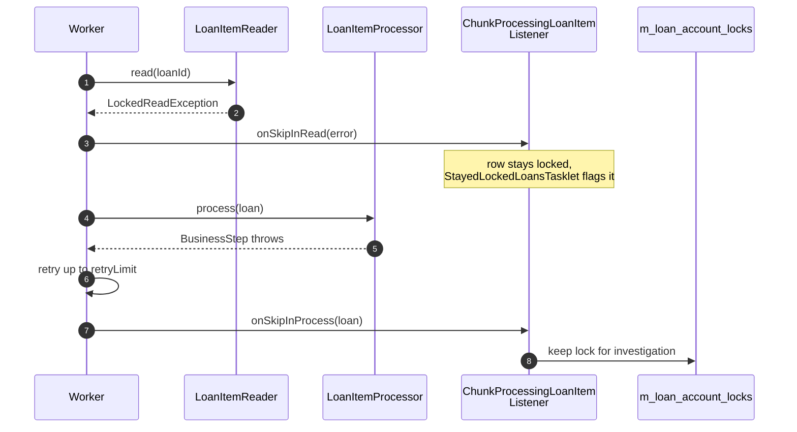

The Apache Fineract Loan Close-of-Business (COB) job is the nightly engine that ages every active loan, charges late fees, calculates accruals, evaluates delinquency, and posts settlement-day asset-owner transfers. It is built on Spring Batch with remote partitioning so it can scale across worker pods. This page traces the entire run: from `INCREASE_COB_DATE_BY_ONE_DAY` flipping `m_business_date.COB_DATE`, through `LoanCOBManagerConfiguration` partitioning loan ids, to each `LoanCOBBusinessStep` running per loan.

Source map:

- `fineract-provider/src/main/java/org/apache/fineract/infrastructure/jobs/service/increasedateby1day/increasecobdateby1day/IncreaseCobDateBy1DayTasklet.java`
- `fineract-provider/src/main/java/org/apache/fineract/cob/loan/LoanCOBManagerConfiguration.java`
- `fineract-provider/src/main/java/org/apache/fineract/cob/loan/LoanCOBPartitioner.java`
- `fineract-provider/src/main/java/org/apache/fineract/cob/loan/LoanCOBWorkerConfiguration.java`
- `fineract-provider/src/main/java/org/apache/fineract/cob/loan/LoanItemReader.java` / `LoanItemProcessor.java` / `LoanItemWriter.java`
- `fineract-provider/src/main/java/org/apache/fineract/cob/loan/ApplyLoanLockTasklet.java`, `StayedLockedLoansTasklet.java`
- `fineract-loan/src/main/java/org/apache/fineract/cob/loan/LoanCOBBusinessStep.java`

## End-to-end sequence

```mermaid
sequenceDiagram
    autonumber
    participant SCH as Quartz Scheduler<br/>(JobScheduler)
    participant CDT as IncreaseCobDateBy1Day<br/>Tasklet
    participant BDW as BusinessDateWrite<br/>PlatformService
    participant DB as m_business_date
    participant LJ as loanCOBJob (Spring Batch)
    participant RCP as ResolveLoanCOBCustom<br/>JobParametersTasklet
    participant LMC as LoanCOBManager<br/>Configuration
    participant LCP as LoanCOBPartitioner
    participant RIS as RetrieveLoanIdService
    participant RWS as RemoteWorkerStep<br/>(loanCOBWorkerStep)
    participant IT as InitialisationTasklet
    participant ALT as ApplyLoanLockTasklet
    participant LR as LoanItemReader
    participant LP as LoanItemProcessor
    participant CBS as COBBusinessStepService
    participant BS as LoanCOBBusinessStep<br/>(e.g. CheckLoanRepaymentDue)
    participant LW as LoanItemWriter
    participant RCT as ResetContextTasklet
    participant SLL as StayedLockedLoansTasklet
    participant BEN as BusinessEventNotifierService

    SCH->>CDT: trigger INCREASE_COB_DATE_BY_ONE_DAY
    CDT->>BDW: increaseDateByTypeByOneDay(COB_DATE)
    BDW->>DB: UPDATE m_business_date COB_DATE = COB_DATE + 1
    SCH->>LJ: trigger LOAN_COB
    LJ->>RCP: resolveCustomJobParametersStep
    RCP->>LJ: promote BUSINESS_DATE + IS_CATCH_UP into JobExecutionContext
    LJ->>LMC: loanCOBStep (manager partitioner)
    LMC->>LCP: partition(gridSize)
    LCP->>RIS: getAllNonClosedLoanIds(cobDate)
    RIS-->>LCP: list of loan ids
    LCP-->>LMC: partitions of loan ids
    LMC->>RWS: dispatch partition messages on outboundRequests
    par for each worker
        RWS->>IT: initialisationStep
        IT->>IT: set system AppUser, ThreadLocalContext
        RWS->>ALT: applyLockStep
        ALT->>DB: INSERT into m_loan_account_locks (owner=LOAN_COB_CHUNK_PROCESSING)
        RWS->>LR: read next loan id from chunk
        LR-->>RWS: Loan
        RWS->>LP: process(Loan)
        LP->>CBS: run business steps in order
        loop for each LoanCOBBusinessStep
            CBS->>BS: execute(loan)
            BS->>BEN: notifyPostBusinessEvent
            BS-->>CBS: Loan
        end
        LP-->>RWS: Loan (updated lastClosedBusinessDate)
        RWS->>LW: write(chunk)
        LW->>DB: UPDATE m_loan + release lock
        RWS->>RCT: resetContextStep
    end
    LJ->>SLL: stayedLockedStep
    SLL->>DB: query m_loan_account_locks still held
    SLL->>BEN: notifyPostBusinessEvent(LoanAccountsStayedLockedBusinessEvent)
```

## Pre-conditions

| Requirement | Detail |
| --- | --- |
| `business-date-enabled = true` configuration row | Otherwise both `IncreaseBusinessDateBy1DayTasklet` and `IncreaseCobDateBy1DayTasklet` return `ExitStatus.NOOP`. |
| `LOAN_COB` job enabled in `m_job` for the tenant | Triggered by `JobRegistererServiceImpl` based on cron expression. |
| At least one `LoanCOBBusinessStep` registered for the `LOAN_CLOSE_OF_BUSINESS` job in `m_batch_business_step` | `COBBusinessStepService.getCOBBusinessSteps(...)` returns the ordered set. See [COB Business Step Framework](/cob/business-step-framework). |
| Manager profile (`fineract.mode.batch-manager-enabled=true`) and at least one worker profile (`fineract.mode.batch-worker-enabled=true`) | Set via `BatchManagerCondition` / `BatchWorkerCondition`. Manager + worker can coexist in the same JVM. |
| `RemotePartitioning*` Spring Batch integration wired with a request/response channel (`outboundRequests` and `inboundRequests` DirectChannel/QueueChannel beans) | Configured in `MessagingConfiguration`. |
| No stale loan lock from a previous failed run for the same COB date | `StayedLockedLoansTasklet` will surface them as an event for ops to investigate. |

## Step 1 — Advance `COB_DATE`

```java
// fineract-provider/.../infrastructure/jobs/service/increasedateby1day/increasecobdateby1day/IncreaseCobDateBy1DayTasklet.java:39
@Override
public RepeatStatus execute(StepContribution contribution, ChunkContext chunkContext) throws Exception {
    if (configurationDomainService.isBusinessDateEnabled()) {
        businessDateWritePlatformService.increaseDateByTypeByOneDay(BusinessDateType.COB_DATE);
    } else {
        contribution.setExitStatus(ExitStatus.NOOP);
    }
    return RepeatStatus.FINISHED;
}
```

`BusinessDateWritePlatformServiceImpl.increaseDateByTypeByOneDay`:

- Reads the current `m_business_date` row for `COB_DATE`.
- Writes `date = date + 1 day`.
- Notifies `BusinessEventNotifierService.notifyPostBusinessEvent(new BusinessDateChangedBusinessEvent(...))`.

The complementary `IncreaseBusinessDateBy1DayTasklet` advances `BUSINESS_DATE` — many deployments schedule it just before `INCREASE_COB_DATE` so that `BUSINESS_DATE = COB_DATE + 1` once the COB job has finished. See [Business Date Service](/core/business-date) and [COB Batch Jobs](/cob/cob-batch-jobs).

## Step 2 — `LOAN_COB` job entrypoint

```java
// fineract-provider/.../cob/loan/LoanCOBManagerConfiguration.java:104
@Bean(name = "loanCOBJob")
public Job loanCOBJob(LoanCOBPartitioner partitioner) {
    return new JobBuilder(JobName.LOAN_COB.name(), jobRepository) //
            .listener(new COBExecutionListenerRunner(applicationContext, JobName.LOAN_COB.name())) //
            .start(resolveCustomJobParametersStep()) //
            .next(loanCOBStep(partitioner)) //
            .next(stayedLockedStep()) //
            .incrementer(new RunIdIncrementer()) //
            .build();
}
```

The job has three steps:

1. `resolveCustomJobParametersStep` — `ResolveLoanCOBCustomJobParametersTasklet` runs, reading custom job parameters off the trigger (catch-up flag, override business date) and promoting them to the `JobExecutionContext` via `ExecutionContextPromotionListener` keyed by `BUSINESS_DATE_PARAMETER_NAME` and `IS_CATCH_UP_PARAMETER_NAME`.
2. `loanCOBStep` — the remote-partitioned partitioner step.
3. `stayedLockedStep` — `StayedLockedLoansTasklet`. Runs even on partial failure to emit a notification of locks held overnight.

`COBExecutionListenerRunner` lets registered `COBExecutionListener` beans hook before/after the whole job; see [COB Listeners](/cob/cob-listeners).

## Step 3 — Partitioning

```java
// fineract-provider/.../cob/loan/LoanCOBManagerConfiguration.java:70
@Bean
@StepScope
public LoanCOBPartitioner partitioner(@Value("#{stepExecution}") StepExecution stepExecution) {
    return new LoanCOBPartitioner(propertyService, cobBusinessStepService, retrieveIdService, jobOperator, stepExecution,
            LoanCOBConstant.NUMBER_OF_DAYS_BEHIND);
}

@Bean("loanCOBStep")
public Step loanCOBStep(LoanCOBPartitioner partitioner) {
    return stepBuilderFactory.get(LoanCOBConstant.LOAN_COB_PARTITIONER_STEP)
            .partitioner(LoanCOBConstant.LOAN_COB_WORKER_STEP, partitioner).pollInterval(propertyService.getPollInterval(JOB_NAME))
            .outputChannel(outboundRequests).build();
}
```

```java
// fineract-provider/.../cob/loan/LoanCOBPartitioner.java:48
@NonNull
@Override
public Map<String, ExecutionContext> partition(int gridSize) {
    int partitionSize = propertyService.getPartitionSize(LoanCOBConstant.JOB_NAME);
    Set<BusinessStepNameAndOrder> cobBusinessSteps = cobBusinessStepService.getCOBBusinessSteps(LoanCOBBusinessStep.class,
            LoanCOBConstant.LOAN_COB_JOB_NAME);
    return getPartitions(partitionSize, cobBusinessSteps);
}
```

`CommonPartitioner.getPartitions(partitionSize, cobBusinessSteps)` (in `fineract-cob`):

- Calls `retrieveIdService.retrieveAllNonClosedLoansByCobBusinessDate(cobDate, NUMBER_OF_DAYS_BEHIND)` to fetch the list of loan ids.
- Splits the ids into chunks of `partitionSize` loans.
- Builds an `ExecutionContext` per partition with `partition` (name), `loanIds` (list), `businessStepNames` (ordered) keys.
- If `IS_CATCH_UP_PARAMETER_NAME` is true, the partitioner also queries loans whose `last_closed_business_date < cobDate - 1` so that ones missed by a prior failed run are processed today.

The `outboundRequests` `DirectChannel` is bound to a JMS/Kafka queue (depending on configuration) for worker pods to consume. In a single-JVM dev setup the channel is in-memory.

## Step 4 — Worker step graph

```java
// fineract-provider/.../cob/loan/LoanCOBWorkerConfiguration.java:88
@Bean(name = LoanCOBConstant.LOAN_COB_WORKER_STEP)
public Step loanCOBWorkerStep(Flow cobFlow) {
    return stepBuilderFactory.get("Loan COB worker - Step").inputChannel(inboundRequests).flow(cobFlow).build();
}

@Bean("cobFlow")
public Flow flow(Step initialisationStep, Step applyLockStep, Step loanBusinessStep, Step resetContextStep) {
    return new FlowBuilder<Flow>("cobFlow").start(initialisationStep).next(applyLockStep).next(loanBusinessStep).next(resetContextStep)
            .build();
}
```

Each worker handles one partition through four steps:

| Step | Bean | Purpose |
| --- | --- | --- |
| `initialisationStep` | `InitialisationTasklet` | Loads the system `AppUser` for the tenant and seeds `ThreadLocalContextUtil` with tenant + business date. |
| `applyLockStep` | `ApplyLoanLockTasklet` | Inserts a row per loan id into `m_loan_account_locks` with `owner=LOAN_COB_CHUNK_PROCESSING` and `cob_business_date`. |
| `loanBusinessStep` | Chunk-oriented step | Reader → Processor → Writer per chunk. |
| `resetContextStep` | `ResetContextTasklet` | Clears `ThreadLocalContextUtil`. |

### `loanBusinessStep`

```java
// fineract-provider/.../cob/loan/LoanCOBWorkerConfiguration.java:124
SimpleStepBuilder<Loan, Loan> stepBuilder = new StepBuilder("Loan Business - Step:" + partitionName, jobRepository)
        .<Loan, Loan>chunk(propertyService.getChunkSize(JobName.LOAN_COB.name()), transactionManager) //
        .reader(cobWorkerItemReader()) //
        .processor(cobWorkerItemProcessor()) //
        .writer(cobWorkerItemWriter()) //
        .faultTolerant() //
        .retry(Exception.class) //
        .retryLimit(propertyService.getRetryLimit(LoanCOBConstant.JOB_NAME)) //
        .skip(Exception.class) //
        .skipLimit(propertyService.getChunkSize(LoanCOBConstant.JOB_NAME) + 1) //
        .listener(loanItemListener()) //
        .transactionManager(transactionManager);

if (propertyService.getThreadPoolMaxPoolSize(LoanCOBConstant.JOB_NAME) > 1) {
    stepBuilder.taskExecutor(cobTaskExecutor);
}
```

Notes:

- Fault tolerance: every chunk retries on any `Exception` up to `retryLimit` (configured per job in `m_job` or `application.yaml`).
- Skip limit is `chunkSize + 1` — i.e. effectively unlimited within a chunk so one bad loan does not poison the partition. The skip is recorded by `ChunkProcessingLoanItemListener`.
- Multi-threading kicks in only when the pool size > 1; otherwise a `SyncTaskExecutor` runs the chunk inline.

### Reader

```java
// fineract-provider/.../cob/loan/LoanItemReader.java
public class LoanItemReader extends AbstractLoanItemReader<Loan> {
    @BeforeStep
    public void beforeStep(StepExecution stepExecution) {
        setRemainingData(new LinkedBlockingQueue<>(
                helper.getRemainingLoanIds(stepExecution.getExecutionContext(), LoanCOBConstant.LOAN_IDS_PARAMETER_NAME)));
    }
}
```

```java
// fineract-provider/.../cob/loan/AbstractLoanItemReader.java:40
@Override
public T read() throws Exception {
    final Long loanId = remainingData.poll();
    if (loanId != null) {
        try {
            return loanRepository.findById(loanId).orElseThrow(() -> new LoanNotFoundException(loanId));
        } catch (Exception e) {
            throw new LockedReadException(loanId, e);
        }
    }
    return null;
}
```

The `BeforeStepLockingItemReaderHelper` filters out any loan id that wasn't successfully locked by the `applyLockStep` (because another process held the lock). Skipped ids remain in the original partition's queue and are picked up next run.

### Processor

```java
// fineract-provider/.../cob/loan/LoanItemProcessor.java
public class LoanItemProcessor extends AbstractLoanItemProcessor {
    @BeforeStep
    public void beforeStep(StepExecution stepExecution) {
        setExecutionContext(stepExecution.getExecutionContext());
        setBusinessDate(stepExecution);
    }
}
```

```java
// fineract-provider/.../cob/loan/AbstractLoanItemProcessor.java:32
@Override
public Loan process(@NonNull Loan loan) throws Exception {
    if (needToRebuildModel(loan)) {
        progressiveLoanModelProcessingService.recalculateModelAndSave(loan.getId());
    }
    return super.process(loan);
}

@Override
public void setLastRun(Loan processedLoan) {
    processedLoan.setLastClosedBusinessDate(getBusinessDate());
}
```

`AbstractItemProcessor.process(loan)` calls into `COBBusinessStepService.run(LoanCOBBusinessStep.class, businessSteps, loan)` which iterates the ordered set of business steps configured for `LOAN_CLOSE_OF_BUSINESS` and executes each one against the loan. After all steps run, `setLastRun` updates `m_loan.last_closed_business_date` so the next COB run can skip already-processed loans.

### Writer

```java
// fineract-provider/.../cob/loan/LoanItemWriter.java
public class LoanItemWriter extends AbstractLoanItemWriter<Loan> {
    public LoanItemWriter(LockingService<LoanAccountLock> loanLockingService) {
        super(loanLockingService);
    }
}
```

The writer:

- Persists the modified `Loan` aggregate (cascading to `m_loan_repayment_schedule`, `m_loan_charge`, etc.).
- Releases the row in `m_loan_account_locks` so subsequent inline COB / write APIs can lock again.

## Step 5 — Business steps

Built-in `LoanCOBBusinessStep` implementations (alphabetical):

| Step | Purpose |
| --- | --- |
| `AccrualActivityPostingBusinessStep` | Roll-up accruals into a single posting entry per loan per day. |
| `AddPeriodicAccrualEntriesBusinessStep` | Compute incremental accrual interest + fees. |
| `ApplyChargeToOverdueLoansBusinessStep` | Apply automatic late/penalty charges. |
| `BuyDownFeeAmortizationBusinessStep` | Amortise buy-down fees. |
| `CapitalizedIncomeAmortizationBusinessStep` | Amortise capitalised income. |
| `CheckDueInstallmentsBusinessStep` | Walk schedule for due-today installments; flag delinquency. |
| `CheckLoanRepaymentDueBusinessStep` / `OverdueBusinessStep` | Notify on due / overdue installments. |
| `LoanInterestRecalculationCOBBusinessStep` | Recalc interest schedule when recalculation is enabled. |
| `LoanDelinquencyClassificationBusinessStep` | Refresh delinquency tag / bucket. |
| `LoanAccountOwnerTransferBusinessStep` | When a sale or buyback settles today, activate it ([Asset Externalization Flow](/flows/asset-externalization-flow)). |
| `LoanInterestPauseBusinessStep` | Honour active interest-pause windows. |

Each implements:

```java
public interface LoanCOBBusinessStep extends COBBusinessStep<Loan> {
    Loan execute(Loan loan);
    String getEnumStyledName();
    String getHumanReadableName();
}
```

The execution **order** is driven by `m_batch_business_step.step_order`, configurable per tenant. See [Business Step Categories](/cob/business-step-categories) for the catalogue.

## Step 6 — Stayed-locked detection

```java
// fineract-provider/.../cob/loan/LoanCOBManagerConfiguration.java:87
@Bean
public Step stayedLockedStep() {
    return new StepBuilder("Stayed locked loan accounts - Step", jobRepository).tasklet(stayedLockedTasklet(), transactionManager)
            .build();
}

@Bean
public StayedLockedLoansTasklet stayedLockedTasklet() {
    return new StayedLockedLoansTasklet(businessEventNotifierService, retrieveIdService);
}
```

`StayedLockedLoansTasklet` queries `m_loan_account_locks` for rows older than the current COB date and fires `LoanAccountsStayedLockedBusinessEvent` for each. Ops dashboards subscribe to this event to investigate stuck loans — usually a previous worker died mid-chunk leaving the lock row behind.

## Side effects per loan

| Mutation | Source step |
| --- | --- |
| `m_loan.last_closed_business_date` updated | `AbstractLoanItemProcessor.setLastRun` |
| `m_loan_repayment_schedule` updates (`due_date` adjustments, derived columns) | Interest recalculation step |
| `m_loan_charge` INSERT for overdue penalty | `ApplyChargeToOverdueLoansBusinessStep` |
| `m_loan_transaction` INSERT (ACCRUAL) | `AddPeriodicAccrualEntriesBusinessStep` |
| `m_journal_entry` INSERT (accrual postings) | `AccrualActivityPostingBusinessStep` |
| `m_loan_delinquency_tag_history` | `LoanDelinquencyClassificationBusinessStep` |
| `m_external_asset_owner_transfer` rows flipped to ACTIVE / CANCELLED | `LoanAccountOwnerTransferBusinessStep` |
| `m_external_event` rows | Every step that calls `businessEventNotifierService.notifyPostBusinessEvent` |
| `m_loan_account_locks` INSERT then DELETE | `ApplyLoanLockTasklet` + `LoanItemWriter` |

## Error paths



| Failure | Behaviour |
| --- | --- |
| `LoanNotFoundException` (deleted between partitioning and read) | Skipped; lock row deleted |
| Business step throws | Retry → Skip → recorded on `ChunkProcessingLoanItemListener` |
| Manager unable to dispatch (channel down) | Job exits with `ExitStatus.FAILED`; next scheduler run re-attempts |
| Partition messages never acknowledged | `StayedLockedLoansTasklet` raises events for stuck loans |
| GL closure conflict in accrual step | The specific loan fails; the rest of the partition continues |

## Tuning knobs

| Property | Default | Effect |
| --- | --- | --- |
| `fineract.job.LOAN_COB.partition-size` | tenant-tuned | Loans per partition. Smaller → more parallelism, more messages. |
| `fineract.job.LOAN_COB.chunk-size` | 100 | Size of the Spring Batch chunk passed to writer in one transaction. |
| `fineract.job.LOAN_COB.thread-pool-max-pool-size` | 1 | When >1, the chunk runs across `ThreadPoolTaskExecutor`. |
| `fineract.job.LOAN_COB.retry-limit` | 3 | Per-chunk retry budget. |
| `fineract.job.LOAN_COB.poll-interval` | manager poll for worker completions | Lowering reduces idle time but increases message traffic. |
| `m_business_date.business_date_type=COB_DATE` | — | Set by `IncreaseCobDateBy1DayTasklet`. |
| `LoanCOBConstant.NUMBER_OF_DAYS_BEHIND` | 0 | If non-zero, partitioner also picks up loans up to N days behind for catch-up. |

## Inline COB

When a user attempts a write on a loan whose `last_closed_business_date` is behind, `LoanCOBApiFilter` forces an inline COB run using `InlineLoanCOBBuildExecutionContextTasklet` + a stripped-down job. See [Inline COB](/cob/inline-cob).

## Operations checklist

<Steps>
  <Step title="Cron `INCREASE_COB_DATE_BY_ONE_DAY` first">Bumps `m_business_date.COB_DATE` and emits `BusinessDateChangedBusinessEvent`.</Step>
  <Step title="Then `LOAN_COB`">Job advances all eligible loans by one day. Catch-up flag picks up missed loans.</Step>
  <Step title="Check `m_loan_account_locks` after the run">Should be empty. Any survivors are flagged by `StayedLockedLoansTasklet`.</Step>
  <Step title="Verify `m_external_event` queue is draining">[Send Async Events](/flows/external-event-publishing-flow) consumes COB events.</Step>
  <Step title="If a loan is stuck, run inline COB through a write API call">`POST /v1/loans/{id}/transactions?command=repayment` triggers `LoanCOBApiFilter` to catch up.</Step>
</Steps>

## Where to look next

<CardGroup cols={2}>
  <Card title="COB Batch Jobs" href="/cob/cob-batch-jobs">Catalogue of all COB-related jobs.</Card>
  <Card title="Business Step Framework" href="/cob/business-step-framework">How `LoanCOBBusinessStep` beans are registered + ordered.</Card>
  <Card title="Loan COB Business Steps" href="/cob/loan-cob-business-steps">Per-step deep dive.</Card>
  <Card title="Inline COB" href="/cob/inline-cob">Filter-driven catch-up.</Card>
  <Card title="Account Locking" href="/cob/account-locking">`m_loan_account_locks` semantics.</Card>
  <Card title="Asset Externalization Flow" href="/flows/asset-externalization-flow">How `LoanAccountOwnerTransferBusinessStep` settles sales / buybacks.</Card>
</CardGroup>
