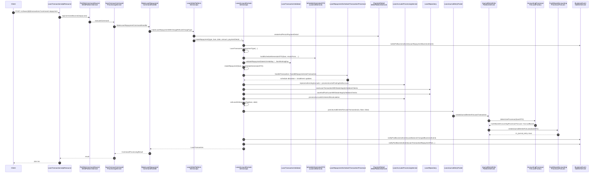

A loan repayment in Apache Fineract is the single most-frequent state-changing operation in production. This page walks every line of the path: from the REST resource through `LoanAccountDomainServiceJpa.makeRepayment`, into the schedule allocator, then into `JournalEntryWritePlatformServiceJpaRepositoryImpl` and `CashBasedAccountingProcessorForLoan` to land double-entry rows on the general ledger. Use it together with [Loan Transactions](/loan/loan-transactions), [Transaction Processors](/loan/transaction-processors), and the accounting subsystem under [Accounting](/accounting/overview).

Source map:

- `fineract-provider/src/main/java/org/apache/fineract/portfolio/loanaccount/api/LoanTransactionsApiResource.java`
- `fineract-provider/src/main/java/org/apache/fineract/portfolio/loanaccount/service/LoanWritePlatformServiceJpaRepositoryImpl.java`
- `fineract-provider/src/main/java/org/apache/fineract/portfolio/loanaccount/domain/LoanAccountDomainServiceJpa.java`
- `fineract-provider/src/main/java/org/apache/fineract/accounting/journalentry/service/JournalEntryWritePlatformServiceJpaRepositoryImpl.java`
- `fineract-provider/src/main/java/org/apache/fineract/accounting/journalentry/service/CashBasedAccountingProcessorForLoan.java`
- `fineract-provider/src/main/java/org/apache/fineract/accounting/journalentry/service/AccrualBasedAccountingProcessorForLoan.java`

## End-to-end sequence



## Pre-conditions

| Requirement | Detail |
| --- | --- |
| Loan in ACTIVE (300) or OVERPAID (700) for some repayment types | `loanDownPaymentTransactionValidator.validateRepaymentTypeAccountStatus` enforces. |
| Caller has `REPAYMENT_LOAN` permission | Checked at `logCommandSource`. |
| Client / group active | `checkClientOrGroupActive(loan)`. |
| Transaction date ≤ today (business date) and not before last activity | `validateActivityNotBeforeLastTransactionDate`. |
| If `allowTransactionsOnHoliday=false` and date on holiday → reject | `validateRepaymentDateIsOnHoliday`. |
| Cash limit respected for cash repayments | `cashierTransactionDataValidator` (when called from teller workflow). |
| Schedule pre-built (loan was disbursed) | Otherwise the transaction processor has nothing to allocate against. |

## Step 1 — Resource and handler

```java
// fineract-provider/.../loanaccount/api/LoanTransactionsApiResource.java (paraphrased)
@POST
@Path("{loanId}/transactions")
public String executeLoanTransaction(@PathParam("loanId") final Long loanId,
        @QueryParam("command") final String commandParam,
        final String apiRequestBodyAsJson) {
    final CommandWrapperBuilder builder = new CommandWrapperBuilder().withJson(apiRequestBodyAsJson);
    CommandProcessingResult result;
    if (is(commandParam, "repayment")) {
        result = commandsSourceWritePlatformService.logCommandSource(builder.loanRepaymentTransaction(loanId).build());
    } else if (is(commandParam, "merchantIssuedRefund")) {
        result = commandsSourceWritePlatformService.logCommandSource(builder.loanMerchantIssuedRefundTransaction(loanId).build());
    } ...
    return toApiJsonSerializer.serialize(result);
}
```

`MakeLoanRepaymentCommandHandler` (registered with `@CommandType(entity="LOAN", action="REPAYMENT")`) simply forwards to `LoanWritePlatformService.makeLoanRepaymentWithChargeRefundChargeType` — see [Loan REST Handlers](/loan/loan-rest-handlers) for the exhaustive list.

## Step 2 — `LoanWritePlatformService.makeLoanRepaymentWithChargeRefundChargeType`

```java
// fineract-provider/.../service/LoanWritePlatformServiceJpaRepositoryImpl.java:1086
@Transactional
@Override
public CommandProcessingResult makeLoanRepaymentWithChargeRefundChargeType(final LoanTransactionType repaymentTransactionType,
        final Long loanId, final JsonCommand command, final boolean isRecoveryRepayment, final String chargeRefundChargeType) {
    this.loanUtilService.validateRepaymentTransactionType(repaymentTransactionType);
    this.loanTransactionValidator.validateNewRepaymentTransaction(command.json());
    final LocalDate transactionDate = command.localDateValueOfParameterNamed("transactionDate");
    final BigDecimal transactionAmount = command.bigDecimalValueOfParameterNamed("transactionAmount");
    final ExternalId txnExternalId = externalIdFactory.createFromCommand(command, LoanApiConstants.externalIdParameterName);
    final Map<String, Object> changes = new LinkedHashMap<>();
    changes.put("transactionDate", command.stringValueOfParameterNamed("transactionDate"));
    changes.put("transactionAmount", command.stringValueOfParameterNamed("transactionAmount"));
    changes.put("locale", command.locale());
    changes.put("dateFormat", command.dateFormat());
    changes.put("paymentTypeId", command.longValueOfParameterNamed("paymentTypeId"));
    final String noteText = command.stringValueOfParameterNamed("note");
    if (StringUtils.isNotBlank(noteText)) { changes.put("note", noteText); }
    if (!txnExternalId.isEmpty()) { changes.put(LoanApiConstants.externalIdParameterName, txnExternalId); }
    Loan loan = this.loanAssembler.assembleFrom(loanId);
    final PaymentDetail paymentDetail = this.paymentDetailWritePlatformService.createAndPersistPaymentDetail(command, changes);
    LoanTransaction loanTransaction = this.loanAccountDomainService.makeRepayment(repaymentTransactionType, loan, transactionDate,
            transactionAmount, paymentDetail, noteText, txnExternalId, isRecoveryRepayment, chargeRefundChargeType,
            /*isAccountTransfer=*/false, /*holidayDetailDto=*/null, /*isHolidayValidationDone=*/false);
    loan = loanTransaction.getLoan();
    this.loanAccountDomainService.updateAndSaveLoanCollateralTransactionsForIndividualAccounts(loan, loanTransaction);
    return new CommandProcessingResultBuilder().withCommandId(command.commandId()) //
            .withLoanId(loan.getId()) //
            .withEntityId(loanTransaction.getId()) //
            .withEntityExternalId(loanTransaction.getExternalId()) //
            .withOfficeId(loan.getOfficeId()) //
            .withClientId(loan.getClientId()) //
            .withGroupId(loan.getGroupId()) //
            .with(changes) //
            .build();
}
```

A few details worth noting:

- `validateRepaymentTransactionType` rejects illegal `LoanTransactionType` values (e.g. WRITE_OFF is not a repayment).
- The JSON `externalId` is normalised via `ExternalIdFactory` (it can be auto-generated when `external_id_auto_generation_enabled` is on).
- `PaymentDetail` is persisted *before* the transaction; the FK on `m_loan_transaction.payment_detail_id` requires its id.
- Collateral updates run **after** the transaction so they see the new outstanding balance.

## Step 3 — `LoanAccountDomainServiceJpa.makeRepayment`

This is the domain-level workhorse. Key code:

```java
// fineract-provider/.../loanaccount/domain/LoanAccountDomainServiceJpa.java:216
@Transactional
@Override
public LoanTransaction makeRepayment(final LoanTransactionType repaymentTransactionType, Loan loan, final LocalDate transactionDate,
        final BigDecimal transactionAmount, final PaymentDetail paymentDetail, final String noteText, final ExternalId txnExternalId,
        final boolean isRecoveryRepayment, final String chargeRefundChargeType, boolean isAccountTransfer,
        HolidayDetailDTO holidayDetailDto, Boolean isHolidayValidationDone, final boolean isLoanToLoanTransfer) {
    checkClientOrGroupActive(loan);
    LoanBusinessEvent repaymentEvent = getLoanRepaymentTypeBusinessEvent(repaymentTransactionType, isRecoveryRepayment, loan);
    businessEventNotifierService.notifyPreBusinessEvent(repaymentEvent);
    final Money repaymentAmount = Money.of(loan.getCurrency(), transactionAmount);
    LoanTransaction newRepaymentTransaction;
    if (isRecoveryRepayment) {
        newRepaymentTransaction = LoanTransaction.recoveryRepayment(loan.getOffice(), repaymentAmount, paymentDetail, transactionDate, txnExternalId);
    } else {
        newRepaymentTransaction = LoanTransaction.repaymentType(repaymentTransactionType, loan.getOffice(), repaymentAmount,
                paymentDetail, transactionDate, txnExternalId, chargeRefundChargeType);
    }
    LocalDate recalculateFrom = null;
    if (loan.isInterestBearingAndInterestRecalculationEnabled()) {
        recalculateFrom = transactionDate;
    }
    final ScheduleGeneratorDTO scheduleGeneratorDTOForPrepay =
        this.loanUtilService.buildScheduleGeneratorDTO(loan, recalculateFrom, transactionDate, holidayDetailDto);
    LocalDate recalculateTill = loanAccountDomainServiceJpaHelper.calculateRecalculateTillDate(loan, transactionDate,
            scheduleGeneratorDTOForPrepay, repaymentAmount);
    final ScheduleGeneratorDTO scheduleGeneratorDTO =
        this.loanUtilService.buildScheduleGeneratorDTO(loan, recalculateFrom, recalculateTill, holidayDetailDto);
    if (!isHolidayValidationDone) {
        final HolidayDetailDTO holidayDetailDTO = scheduleGeneratorDTO.getHolidayDetailDTO();
        loanTransactionValidator.validateRepaymentDateIsOnHoliday(newRepaymentTransaction.getTransactionDate(),
                holidayDetailDTO.isAllowTransactionsOnHoliday(), holidayDetailDTO.getHolidays());
        loanTransactionValidator.validateRepaymentDateIsOnNonWorkingDay(newRepaymentTransaction.getTransactionDate(),
                holidayDetailDTO.getWorkingDays(), holidayDetailDTO.isAllowTransactionsOnNonWorkingDay());
    }
    final LoanEvent event = isRecoveryRepayment ? LoanEvent.LOAN_RECOVERY_PAYMENT : LoanEvent.LOAN_REPAYMENT_OR_WAIVER;
    loanTransactionValidator.validateActivityNotBeforeLastTransactionDate(loan, newRepaymentTransaction.getTransactionDate(), event);
    loanDownPaymentTransactionValidator.validateRepaymentTypeAccountStatus(loan, newRepaymentTransaction, event);
    loanTransactionValidator.validateActivityNotBeforeClientOrGroupTransferDate(loan, event, newRepaymentTransaction.getTransactionDate());
    makeRepayment(loan, newRepaymentTransaction, scheduleGeneratorDTO);
    if (loan.isInterestBearingAndInterestRecalculationEnabled()) {
        loanAccrualsProcessingService.reprocessExistingAccruals(loan, true);
        loanAccrualsProcessingService.processIncomePostingAndAccruals(loan, true);
    }
    loanAccountService.saveLoanTransactionWithDataIntegrityViolationChecks(newRepaymentTransaction);
    loan = loanAccountService.saveAndFlushLoanWithDataIntegrityViolationChecks(loan);
    if (StringUtils.isNotBlank(noteText)) {
        final Note note = Note.loanTransactionNote(loan, newRepaymentTransaction, noteText);
        this.noteRepository.save(note);
    }
    loanAccrualsProcessingService.processAccrualsOnInterestRecalculation(loan, loan.isInterestBearingAndInterestRecalculationEnabled(), true);
    setLoanDelinquencyTag(loan, transactionDate);
    journalEntryPoster.postJournalEntriesForLoanTransaction(newRepaymentTransaction, isAccountTransfer, isLoanToLoanTransfer);
    if (!repaymentTransactionType.isChargeRefund()) {
        final LoanTransactionBusinessEvent transactionRepaymentEvent = getTransactionRepaymentTypeBusinessEvent(
                repaymentTransactionType, isRecoveryRepayment, newRepaymentTransaction);
        businessEventNotifierService.notifyPostBusinessEvent(new LoanBalanceChangedBusinessEvent(loan));
        businessEventNotifierService.notifyPostBusinessEvent(transactionRepaymentEvent);
    }
    disableStandingInstructionsLinkedToClosedLoan(loan);
    return newRepaymentTransaction;
}
```

The sub-steps unpacked:

### 3a — Pre business event

`notifyPreBusinessEvent` lets custom listeners gate the repayment (e.g. a compliance hold). If a listener throws, the transaction rolls back before any DB write occurs.

### 3b — Build the `LoanTransaction`

`LoanTransaction.repaymentType` constructs the row with `type_enum` set to the matching int (REPAYMENT=2, REPAYMENT_AT_DISBURSEMENT=5, etc.) and `office_id` from the loan's office. Note that the transaction id is still null at this point.

### 3c — Schedule generator DTO

`LoanUtilService.buildScheduleGeneratorDTO` snapshots holidays, working days, interest recalc flags, and (optionally) the recalculation date range. When interest recalculation is enabled, the recalculation window is `[transactionDate, recalculateTill]` where the till date is computed by `calculateRecalculateTillDate` — typically the next non-prepayment installment due date.

### 3d — Holiday + activity validations

Two-phase: holiday-on-date and non-working-day-on-date. Both can be bypassed by the calling code (bulk repayment flow passes `isHolidayValidationDone=true` after running them once for the batch). `validateActivityNotBeforeLastTransactionDate` blocks backdated transactions that would create out-of-order schedule allocations.

### 3e — `makeRepayment(loan, tx, scheduleGeneratorDTO)` — schedule allocation

The two-arg `makeRepayment` (further down the same file) delegates to the loan's transaction processor:

- The processor is chosen via `LoanRepaymentScheduleTransactionProcessorFactory` based on `loan.getTransactionProcessingStrategyCode()` (Mifos / Heavensfamily / Creocore / RBI India / Advanced Payment / Progressive).
- For most strategies it iterates installments in due-date order, allocating the payment to (penalties → fees → interest → principal) or whatever the strategy prescribes.
- Each installment's `principal_completed_derived`, `interest_completed_derived`, etc. columns are incremented; the matching `m_loan_repayment_schedule_installment` rows are flagged paid when fully allocated.
- A `m_loan_transaction_repayment_schedule_mapping` row connects the new `LoanTransaction` to each installment it touched.

See [Transaction Processors](/loan/transaction-processors) for the strategy matrix.

### 3f — Accrual re-processing

For interest-bearing + recalculation-enabled products, the schedule may need re-projection because the prepayment changes the remaining interest curve. `LoanAccrualsProcessingService` re-runs:

- `reprocessExistingAccruals(loan, true)` reverses past accruals that no longer match the new schedule.
- `processIncomePostingAndAccruals(loan, true)` writes fresh accruals up to the transaction date.

See [Loan Accruals Processing](/cob/business-step-categories#periodic-accrual-posting) and [Accounting Closure & Accruals](/accounting/periodic-accruals).

### 3g — Persist the transaction and the loan

`saveLoanTransactionWithDataIntegrityViolationChecks` inserts the `m_loan_transaction` row (id is now set). `saveAndFlushLoanWithDataIntegrityViolationChecks` saves the parent loan with updated summary derived columns (`principal_outstanding_derived`, `interest_outstanding_derived`, etc.).

### 3h — Note

Optional `m_note` row (`note_type_enum=1` for loan-transaction notes).

### 3i — Delinquency tag

`setLoanDelinquencyTag(loan, transactionDate)` re-evaluates the delinquency bucket and writes a row in `m_loan_delinquency_tag_history` if the bucket changed. See [Delinquency](/loan/delinquency).

### 3j — Post journal entries

`journalEntryPoster.postJournalEntriesForLoanTransaction(newRepaymentTransaction, isAccountTransfer, isLoanToLoanTransfer)` is the bridge to the accounting subsystem.

### 3k — Post business events

Two events fire post-commit:
- `LoanBalanceChangedBusinessEvent` (always, for downstream balance subscribers).
- `LoanTransactionRepaymentPostBusinessEvent` (or one of its sibling types — see `getTransactionRepaymentTypeBusinessEvent`).

The `notifyPostBusinessEvent` calls write `m_external_event` rows that the [External Event Publishing Flow](/flows/external-event-publishing-flow) job picks up.

### 3l — Disable standing instructions on closed loans

When the loan's status flipped to `CLOSED_OBLIGATIONS_MET` because this repayment cleared the balance, any active standing instructions targeting it are deactivated.

## Step 4 — Journal entries

```java
// fineract-provider/.../journalentry/service/JournalEntryWritePlatformServiceJpaRepositoryImpl.java:813
@Transactional
@Override
public void createJournalEntriesForLoanTransaction(final LoanTransaction loanTransaction, final boolean isAccountTransfer,
        final boolean isLoanToLoanTransfer) {
    final Loan loan = loanTransaction.getLoan();
    if (!loan.isCashBasedAccountingEnabledOnLoanProduct()
            && !loan.isUpfrontAccrualAccountingEnabledOnLoanProduct()
            && !loan.isPeriodicAccrualAccountingEnabledOnLoanProduct()) {
        return;
    }
    final AccountingBridgeDataDTO accountingBridgeData = createAccountingBridgeDataForSingleTransaction(loanTransaction, isAccountTransfer);
    if (isLoanToLoanTransfer) {
        accountingBridgeData.getNewLoanTransactions().forEach(tx -> tx.setLoanToLoanTransfer(true));
    }
    this.createJournalEntriesForLoan(accountingBridgeData);
}
```

The `AccountingBridgeDataDTO` carries:

- The list of new transactions to post (here, just the repayment).
- Loan-level flags (charged-off, accounting types enabled, etc.).
- The currency code and product id.

`createJournalEntriesForLoan(bridge)` then dispatches:

```java
// fineract-provider/.../service/JournalEntryWritePlatformServiceJpaRepositoryImpl.java:530
@Transactional
@Override
public void createJournalEntriesForLoan(final AccountingBridgeDataDTO accountingBridgeData) {
    final boolean cashBasedAccountingEnabled = accountingBridgeData.isCashBasedAccountingEnabled();
    final boolean upfrontAccrualBasedAccountingEnabled = accountingBridgeData.isUpfrontAccrualBasedAccountingEnabled();
    final boolean periodicAccrualBasedAccountingEnabled = accountingBridgeData.isPeriodicAccrualBasedAccountingEnabled();
    if (cashBasedAccountingEnabled || upfrontAccrualBasedAccountingEnabled || periodicAccrualBasedAccountingEnabled) {
        final LoanDTO loanDTO = this.helper.populateLoanDtoFromDTO(accountingBridgeData);
        final AccountingProcessorForLoan accountingProcessorForLoan = this.accountingProcessorForLoanFactory.determineProcessor(loanDTO);
        accountingProcessorForLoan.createJournalEntriesForLoan(loanDTO);
    }
}
```

`AccountingProcessorForLoanFactory.determineProcessor`:

- Returns `CashBasedAccountingProcessorForLoan` when only cash-based is enabled.
- Returns `AccrualBasedAccountingProcessorForLoan` when periodic or upfront accrual is enabled.

## Step 5 — `CashBasedAccountingProcessorForLoan.createJournalEntriesForLoan`

```java
// fineract-provider/.../journalentry/service/CashBasedAccountingProcessorForLoan.java:48
@Override
public void createJournalEntriesForLoan(final LoanDTO loanDTO) {
    final Long officeId = loanDTO.getOfficeId();
    final GLClosure latestGLClosure = this.helper.getLatestClosureByBranch(officeId);
    final Long loanProductId = loanDTO.getLoanProductId();
    final String currencyCode = loanDTO.getCurrencyCode();
    final Office office = this.helper.getOfficeById(officeId);
    for (final LoanTransactionDTO loanTransactionDTO : loanDTO.getNewLoanTransactions()) {
        ...
        this.helper.checkForBranchClosures(latestGLClosure, transactionDate);
        if (loanTransactionDTO.isReversed()) {
            journalEntryWritePlatformService.createJournalEntryForReversedLoanTransaction(transactionDate, transactionId, officeId);
            continue;
        }
        if (transactionType.isDisbursement()) {
            createJournalEntriesForDisbursements(loanDTO, loanTransactionDTO, office);
        } else if ((transactionType.isRepaymentType() && !transactionType.isChargeAdjustment())
                || transactionType.isRepaymentAtDisbursement() || transactionType.isChargePayment()) {
            createJournalEntriesForRepayments(loanDTO, loanTransactionDTO, office);
        } else if (transactionType.isRecoveryRepayment()) { ... }
        else if (transactionType.isRefund()) { ... }
        else if (transactionType.isWriteOff()) { ... }
        else if (transactionType.isChargeback()) { ... }
        else if (transactionType.isChargeoff()) { ... }
        ...
    }
}
```

`createJournalEntriesForRepayments` (the relevant branch for our trace):

```java
// fineract-provider/.../journalentry/service/CashBasedAccountingProcessorForLoan.java:731
private void createJournalEntriesForLoanRepayments(LoanDTO loanDTO, LoanTransactionDTO loanTransactionDTO, Office office) {
    final BigDecimal principalAmount = loanTransactionDTO.getPrincipal();
    final BigDecimal interestAmount = loanTransactionDTO.getInterest();
    final BigDecimal feesAmount = loanTransactionDTO.getFees();
    final BigDecimal penaltiesAmount = loanTransactionDTO.getPenalties();
    final BigDecimal overPaymentAmount = loanTransactionDTO.getOverPayment();

    BigDecimal totalDebitAmount = new BigDecimal(0);
    if (principalAmount != null && principalAmount.compareTo(BigDecimal.ZERO) > 0) {
        totalDebitAmount = totalDebitAmount.add(principalAmount);
        this.helper.createCreditJournalEntryForLoan(office, currencyCode, CashAccountsForLoan.LOAN_PORTFOLIO, loanProductId,
                paymentTypeId, loanId, transactionId, transactionDate, principalAmount);
    }
    if (interestAmount != null && interestAmount.compareTo(BigDecimal.ZERO) > 0) {
        totalDebitAmount = totalDebitAmount.add(interestAmount);
        this.helper.createCreditJournalEntryForLoan(office, currencyCode, CashAccountsForLoan.INTEREST_ON_LOANS, loanProductId,
                paymentTypeId, loanId, transactionId, transactionDate, interestAmount);
    }
    if (feesAmount != null && feesAmount.compareTo(BigDecimal.ZERO) > 0) {
        totalDebitAmount = totalDebitAmount.add(feesAmount);
        this.helper.createCreditJournalEntryForLoanCharges(office, currencyCode, CashAccountsForLoan.INCOME_FROM_FEES.getValue(), ...);
    }
    if (penaltiesAmount != null && penaltiesAmount.compareTo(BigDecimal.ZERO) > 0) {
        totalDebitAmount = totalDebitAmount.add(penaltiesAmount);
        this.helper.createCreditJournalEntryForLoanCharges(office, currencyCode, CashAccountsForLoan.INCOME_FROM_PENALTIES.getValue(), ...);
    }
    if (overPaymentAmount != null && overPaymentAmount.compareTo(BigDecimal.ZERO) > 0) {
        totalDebitAmount = totalDebitAmount.add(overPaymentAmount);
        this.helper.createCreditJournalEntryForLoan(office, currencyCode, CashAccountsForLoan.OVERPAYMENT, ...);
    }
    if (loanTransactionDTO.isLoanToLoanTransfer()) {
        this.helper.createDebitJournalEntryForLoan(office, currencyCode, FinancialActivity.ASSET_TRANSFER.getValue(), ...);
    } else if (loanTransactionDTO.isAccountTransfer()) {
        this.helper.createDebitJournalEntryForLoan(office, currencyCode, FinancialActivity.LIABILITY_TRANSFER.getValue(), ...);
    } else {
        // Default: debit the payment type's fund-source GL
        this.helper.createDebitJournalEntryForLoan(office, currencyCode, CashAccountsForLoan.FUND_SOURCE, loanProductId, paymentTypeId,
                loanId, transactionId, transactionDate, totalDebitAmount);
    }
}
```

### Resulting double entry (cash-basis, ordinary repayment)

| Dr | Cr | Amount | Account mapping source |
| --- | --- | --- | --- |
| Fund Source (cash / bank) — by payment type | — | sum of all components | `CashAccountsForLoan.FUND_SOURCE` + `m_payment_type_to_gl_account_mapping` |
| — | Loan Portfolio | principal portion | `CashAccountsForLoan.LOAN_PORTFOLIO` |
| — | Interest Income | interest portion | `CashAccountsForLoan.INTEREST_ON_LOANS` |
| — | Fee Income | fees portion | `CashAccountsForLoan.INCOME_FROM_FEES` (per-charge mapping) |
| — | Penalty Income | penalties portion | `CashAccountsForLoan.INCOME_FROM_PENALTIES` (per-charge mapping) |
| — | Overpayment Liability | overpayment portion | `CashAccountsForLoan.OVERPAYMENT` |

If the loan is paid via account transfer from a linked savings account, the debit instead goes to `FinancialActivity.LIABILITY_TRANSFER`; the savings side debits the savings asset and credits the same `LIABILITY_TRANSFER` GL, producing a closed loop.

## Step 6 — Accrual processor variant

`AccrualBasedAccountingProcessorForLoan` (selected when periodic or upfront accrual is enabled) layers extra postings:

- On disbursement: also `Dr Interest Receivable / Cr Interest Income` if upfront accrual is enabled.
- On repayment: principal-portion same as cash; interest portion debits cash and credits `Interest Receivable` (not income) because income was already recognised at accrual time.
- On accrual posting (called by `LoanAccrualsProcessingService` during repayment for recalc'd loans): `Dr Interest Receivable / Cr Interest Income` for the new accrual delta.

See [Periodic Accrual Posting](/cob/business-step-categories#periodic-accrual-posting).

## Side effects

| Row type | Inserted/updated | Notes |
| --- | --- | --- |
| `m_loan_transaction` | INSERT (the new repayment) | id assigned at flush |
| `m_loan_transaction_repayment_schedule_mapping` | INSERT per installment touched | One row per installment with `principal_portion_derived`, `interest_portion_derived`, etc. |
| `m_loan_repayment_schedule` | UPDATE per installment | Fully-paid installments have `completed_derived=true` |
| `m_loan` | UPDATE summary columns + status if it closed | `loan_status_id=600` (CLOSED_OBLIGATIONS_MET) if balance went to zero |
| `m_payment_detail` | INSERT once, referenced by `m_loan_transaction.payment_detail_id` | Optional fields (check_number, routing_code, bank_number) |
| `m_loan_charge_paid_by` | INSERT per charge fully or partially paid by this txn | Allocates `m_loan_transaction` to individual `m_loan_charge` rows |
| `m_note` | INSERT if `note` text present | |
| `m_loan_delinquency_tag_history` | INSERT if bucket changed | |
| `m_loan_account_locks` | UPDATE / re-lock if repayment escalated COB requirements | See [Account Locking](/cob/account-locking) |
| `m_journal_entry` | INSERT one row per GL leg of the double entry | At least two rows per repayment when accounting is enabled |
| `m_external_event` | INSERT for `LoanBalanceChangedBusinessEvent` and the repayment-type event | Picked up by [Send Async Events](/flows/external-event-publishing-flow) |
| `m_portfolio_command_source` | INSERT (UNDER_PROCESSING) then UPDATE (PROCESSED) | See [Command Execution Flow](/flows/command-execution-flow) |

## Error paths

| Failure | Where | HTTP |
| --- | --- | --- |
| Date on holiday with `allowTransactionsOnHoliday=false` | `validateRepaymentDateIsOnHoliday` | `400` |
| Backdated before last activity | `validateActivityNotBeforeLastTransactionDate` | `400` |
| Loan not in repay-eligible status | `validateRepaymentTypeAccountStatus` | `403` |
| Repayment amount > total outstanding + over-pay tolerance | `LoanRepaymentScheduleTransactionProcessor` rejects | `400` |
| GL closure exists for the office at `transactionDate` | `helper.checkForBranchClosures` | `403` GL_CLOSURE error |
| Missing GL account mapping for a charge | `AccountingProcessorHelper.createCreditJournalEntryForLoanCharges` | `400` |
| Concurrent repayment race on the same loan | DB optimistic lock on `m_loan.version` | `OptimisticLockException` → Resilience4j retry |
| Negative principal due to processor bug | Domain invariant | `IllegalStateException`, transaction rollback |

## Reversal path

A repayment can be reversed via `POST /v1/loans/{id}/transactions/{txId}?command=undo`. The handler:

1. Marks `m_loan_transaction.is_reversed=true`, `manually_adjusted_or_reversed=true`.
2. Re-runs the transaction processor with the remaining set of transactions to rebuild `principal_completed_derived` etc.
3. Calls `journalEntryWritePlatformService.createJournalEntryForReversedLoanTransaction(date, txId, officeId)` — that inserts mirror journal entries with `reversed=true`.

See [Loan Transactions](/loan/loan-transactions) for the full adjustment / undo / chargeback matrix.

## Sequence variants

| Variant | What changes |
| --- | --- |
| `command=merchantIssuedRefund` | Same path but `LoanTransactionType.MERCHANT_ISSUED_REFUND`; accounting processor branches to refund logic. |
| `command=payoutRefund` | `LoanTransactionType.PAYOUT_REFUND`. |
| `command=goodwillCredit` | Cash branch also debits `GOODWILL_CREDIT` instead of `FUND_SOURCE`. |
| `command=chargeRefund` | `chargeRefundChargeType` populated; processor handles fee/penalty refund allocation. |
| Bulk via `makeLoanBulkRepayment` | Same loop but single holiday validation upfront. |
| Account transfer from savings | `isAccountTransfer=true`, fund-source replaced by `LIABILITY_TRANSFER`. |
| Loan-to-loan transfer | `isLoanToLoanTransfer=true`, `ASSET_TRANSFER` GL used. |

## Where to look next

<CardGroup cols={2}>
  <Card title="Loan Write Service" href="/loan/loan-write-service">All write methods including `makeLoanRepaymentWithChargeRefundChargeType`.</Card>
  <Card title="Transaction Processors" href="/loan/transaction-processors">Allocation strategies in `LoanRepaymentScheduleTransactionProcessor`.</Card>
  <Card title="Loan Transactions" href="/loan/loan-transactions">Domain model for `m_loan_transaction`.</Card>
  <Card title="Cash vs Accrual Accounting" href="/accounting/cash-accounting">Mappings for `CashAccountsForLoan` and `AccrualAccountsForLoan`.</Card>
  <Card title="Periodic Accrual Posting" href="/cob/business-step-categories#periodic-accrual-posting">When accrual journal entries fire vs at-transaction-time.</Card>
  <Card title="External Event Publishing Flow" href="/flows/external-event-publishing-flow">Repayment events from m_external_event to Kafka/JMS.</Card>
</CardGroup>
