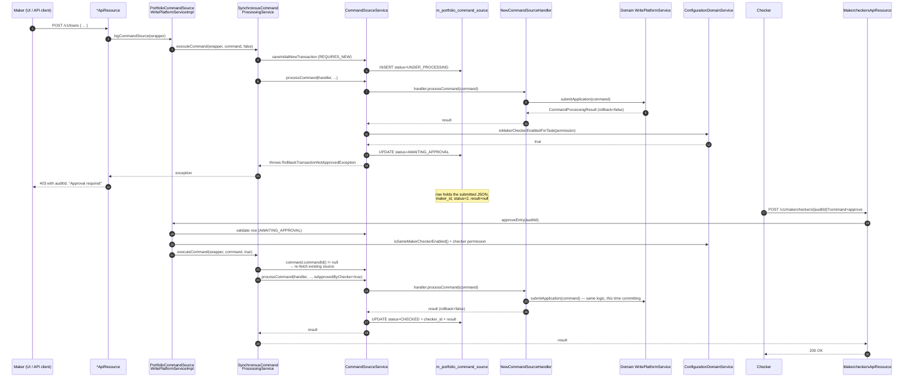
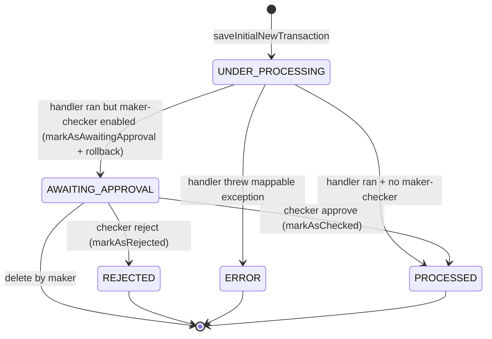

The Apache Fineract maker-checker feature (a.k.a. "four eyes") lets administrators require a second user to approve any command before it commits. The mechanism is built directly into `SynchronousCommandProcessingService` + `CommandSourceService` — there is no separate workflow engine, just two cooperating transactions and a state column on `m_portfolio_command_source`. This page reads both halves of the flow against the source.

Source map:

- `fineract-core/src/main/java/org/apache/fineract/commands/service/SynchronousCommandProcessingService.java`
- `fineract-core/src/main/java/org/apache/fineract/commands/service/CommandSourceService.java`
- `fineract-core/src/main/java/org/apache/fineract/commands/service/PortfolioCommandSourceWritePlatformServiceImpl.java`
- `fineract-provider/src/main/java/org/apache/fineract/commands/api/MakercheckersApiResource.java`
- `fineract-core/src/main/java/org/apache/fineract/commands/domain/CommandSource.java`

## End-to-end sequence



## Pre-conditions

| For the maker | For the checker |
| --- | --- |
| Holds `wrapper.getTaskPermissionName()` permission | Holds `CHECKER_<permission>` permission **or** `CHECKER_SUPER_USER` |
| Submitted JSON not in `wrapper.getSanitizeJsonKeys()` (sanitized rows can't be re-run) | Different user id from `maker_id` unless `is-same-maker-checker-enabled=true` |
| `c_configuration.maker-checker-<permission>=true` for the action | The row is still in `AWAITING_APPROVAL` (not yet rejected or deleted) |
| Tenant + business date filters pass | `SchedulerJobRunnerReadService.isUpdatesAllowed()` true at approval time |

Note: `wrapper.isChangeOfOwnUserDetails(userId)` bypasses both the permission check and the maker-checker requirement — users can always update their own credentials.

## Phase 1 — Maker submission

The maker phase is just a normal write command up until `CommandSourceService.processCommand`:

```java
// fineract-core/.../service/CommandSourceService.java:115
@Transactional
public CommandProcessingResult processCommand(NewCommandSourceHandler handler, JsonCommand command, CommandSource commandSource,
        AppUser user, boolean isApprovedByChecker) {
    final CommandProcessingResult result = handler.processCommand(command);
    String permission = commandSource.getPermissionCode();
    boolean isMakerChecker = configurationDomainService.isMakerCheckerEnabledForTask(permission);
    if (isMakerChecker || result.isRollbackTransaction()) {
        if (isApprovedByChecker || user.isCheckerSuperUser()) {
            commandSource.markAsChecked(user);
        } else {
            if (commandSource.isSanitized()) {
                throw new GeneralPlatformDomainRuleException("error.msg.invalid.sanitization",
                        "Maker-checker command can not be sanitized, please change the permission configuration", permission);
            }
            commandSource.markAsAwaitingApproval();
            throw new RollbackTransactionNotApprovedException(commandSource.getId(), commandSource.getResourceId());
        }
    }
    return result;
}
```

The choreography:

1. The handler runs **fully** — it modifies domain entities, raises `notifyPreBusinessEvent`/`notifyPostBusinessEvent`, generates a `CommandProcessingResult`. Because we're inside `@Transactional`, all those mutations are uncommitted.
2. `configurationDomainService.isMakerCheckerEnabledForTask(permission)` checks `c_configuration` — see [Maker-Checker](/command/maker-checker) for the schema and which permissions are configurable.
3. If maker-checker is enabled and the caller is *not* approving (the maker path), the row is flipped to `AWAITING_APPROVAL` and the exception is thrown.
4. The exception triggers the surrounding `@Transactional` to roll back. The domain changes vanish; the audit row survives because it was inserted in a separate `REQUIRES_NEW` transaction in [Command Execution Flow](/flows/command-execution-flow) step 4.

### Catch in `SynchronousCommandProcessingService`

The exception is re-thrown unchanged but the surrounding error handler flips the row to ERROR — wait, not in this case:

```java
// fineract-core/.../service/SynchronousCommandProcessingService.java:121
} catch (Throwable t) { // NOSONAR
    RuntimeException mappable = ErrorHandler.getMappable(t);
    ErrorInfo errorInfo = commandSourceService.generateErrorInfo(mappable);
    Integer statusCode = errorInfo.getStatusCode();
    commandSource.setResultStatusCode(statusCode);
    commandSource.setResult(errorInfo.getMessage());
    if (statusCode != SC_OK) {
        commandSource.setStatus(ERROR);
    }
    ...
}
```

`RollbackTransactionNotApprovedException.getStatusCode()` returns `200` (an intentional design — see the exception class), so `commandSource.setStatus(ERROR)` is skipped and the `AWAITING_APPROVAL` status set by `markAsAwaitingApproval()` is preserved. The maker receives a 403 with the audit id and a message but the row is intact.

### What the audit row looks like

After the maker submission the `m_portfolio_command_source` row has:

| Column | Value |
| --- | --- |
| `id` | new primary key — returned in the error payload as `auditId` |
| `action_name` / `entity_name` | from the wrapper (e.g. `CREATE`, `LOAN`) |
| `idempotency_key` | the maker's idempotency key (resolved by `IdempotencyKeyResolver`) |
| `command_as_json` | the maker's request JSON, sanitised per `wrapper.getSanitizeJsonKeys()` |
| `maker_id` | the maker user id |
| `checker_id` | NULL |
| `status` | `2` (AWAITING_APPROVAL) |
| `result` / `result_status_code` | NULL |
| `resource_id` / `loan_id` / `client_id` / `group_id` / `savings_account_id` | populated from the `CommandWrapper` for indexing |

See [Command Source](/command/command-source) for the full schema.

## Phase 2 — Listing maker-checker entries

```java
// fineract-provider/.../commands/api/MakercheckersApiResource.java:66
@GET
public List<AuditData> retrieveCommands(@Context final UriInfo uriInfo, @BeanParam MakerCheckerRequest makerCheckerRequest) {
    final SQLBuilder extraCriteria = getExtraCriteria(makerCheckerRequest);
    final ApiRequestJsonSerializationSettings settings = apiRequestParameterHelper.process(uriInfo.getQueryParameters());
    return readPlatformService.retrieveAllEntriesToBeChecked(extraCriteria, settings.isIncludeJson());
}
```

`AuditReadPlatformService.retrieveAllEntriesToBeChecked` joins `m_portfolio_command_source` with `m_appuser` and `m_office` to project rows where:

- `status = 2` (AWAITING_APPROVAL).
- The caller is allowed to check the action (`CHECKER_<permission>` granted via `m_role_permission`).
- The caller's office hierarchy includes the row's `office_id`.

`/v1/makercheckers/searchtemplate` returns the dropdown options the UI uses to build the inbox filters — only action / entity names the caller can check.

## Phase 3 — Checker approval

```java
// fineract-provider/.../commands/api/MakercheckersApiResource.java:96
public CommandProcessingResult approveMakerCheckerEntry(@PathParam("auditId") final Long auditId,
        @QueryParam("command") final String commandParam) {
    CommandProcessingResult result;
    if (is(commandParam, COMMAND_APPROVE)) {
        result = writePlatformService.approveEntry(auditId);
    } else if (is(commandParam, COMMAND_REJECT)) {
        final Long id = writePlatformService.rejectEntry(auditId);
        result = CommandProcessingResult.commandOnlyResult(id);
    } else {
        throw new UnrecognizedQueryParamException("command", commandParam);
    }
    return result;
}
```

`approveEntry` re-hydrates a wrapper from the stored row:

```java
// fineract-core/.../service/PortfolioCommandSourceWritePlatformServiceImpl.java:74
@Override
public CommandProcessingResult approveEntry(final Long makerCheckerId) {
    final CommandSource commandSourceInput = validateMakerCheckerTransaction(makerCheckerId);
    validateIsUpdateAllowed();
    final CommandWrapper wrapper = CommandWrapper.fromExistingCommand(makerCheckerId, commandSourceInput.getActionName(),
            commandSourceInput.getEntityName(), commandSourceInput.getResourceId(), commandSourceInput.getSubResourceId(),
            commandSourceInput.getResourceGetUrl(), commandSourceInput.getProductId(), commandSourceInput.getOfficeId(),
            commandSourceInput.getGroupId(), commandSourceInput.getClientId(), commandSourceInput.getLoanId(),
            commandSourceInput.getSavingsId(), commandSourceInput.getTransactionId(), commandSourceInput.getCreditBureauId(),
            commandSourceInput.getOrganisationCreditBureauId(), commandSourceInput.getIdempotencyKey(),
            commandSourceInput.getLoanExternalId());
    final JsonElement parsedCommand = this.fromApiJsonHelper.parse(commandSourceInput.getCommandAsJson());
    final JsonCommand command = JsonCommand.fromExistingCommand(makerCheckerId, commandSourceInput.getCommandAsJson(), parsedCommand,
            this.fromApiJsonHelper, commandSourceInput.getEntityName(), commandSourceInput.getResourceId(),
            commandSourceInput.getSubResourceId(), commandSourceInput.getGroupId(), commandSourceInput.getClientId(),
            commandSourceInput.getLoanId(), commandSourceInput.getSavingsId(), commandSourceInput.getTransactionId(),
            commandSourceInput.getResourceGetUrl(), commandSourceInput.getProductId(), commandSourceInput.getCreditBureauId(),
            commandSourceInput.getOrganisationCreditBureauId(), commandSourceInput.getJobName(),
            commandSourceInput.getLoanExternalId());
    return this.processAndLogCommandService.executeCommand(wrapper, command, true);
}
```

`validateMakerCheckerTransaction` enforces the three approval invariants:

```java
// fineract-core/.../service/PortfolioCommandSourceWritePlatformServiceImpl.java:107
private CommandSource validateMakerCheckerTransaction(final Long makerCheckerId) {
    final CommandSource commandSource = this.commandSourceRepository.findById(makerCheckerId)
            .orElseThrow(() -> new CommandNotFoundException(makerCheckerId));
    if (!commandSource.isAwaitingApproval()) {
        throw new CommandNotAwaitingApprovalException(makerCheckerId);
    }
    AppUser appUser = this.context.authenticatedUser();
    String permissionCode = commandSource.getPermissionCode();
    appUser.validateHasCheckerPermissionTo(permissionCode);
    if (!configurationService.isSameMakerCheckerEnabled() && !appUser.isCheckerSuperUser()) {
        AppUser maker = commandSource.getMaker();
        if (maker == null) {
            throw new UnsupportedCommandException(permissionCode, "Maker user is missing.");
        }
        if (Objects.equals(appUser.getId(), maker.getId())) {
            throw new UnsupportedCommandException(permissionCode, "Can not be checked by the same user.");
        }
    }
    return commandSource;
}
```

| Check | Failure response |
| --- | --- |
| Row exists | `CommandNotFoundException` → `404` |
| `status = AWAITING_APPROVAL` | `CommandNotAwaitingApprovalException` → `403` |
| Caller holds `CHECKER_<permission>` | `NoAuthorizationException` → `403` |
| Caller is not the maker (or `is-same-maker-checker-enabled=true` or `CHECKER_SUPER_USER`) | `UnsupportedCommandException` |
| `SchedulerJobRunnerReadService.isUpdatesAllowed()` | `PlatformServiceUnavailableException` |

## Phase 4 — Re-running the handler on approval

`executeCommand(wrapper, command, true)` enters the same code as the maker path with two key differences:

1. `command.commandId()` is non-null because `CommandWrapper.fromExistingCommand` sets it. The processor branch:

   ```java
   // fineract-core/.../service/SynchronousCommandProcessingService.java:99
   } else if ((commandId = command.commandId()) != null) {
       commandSource = commandSourceService.getCommandSource(commandId);
       idempotencyKey = commandSource.getIdempotencyKey();
   }
   ```

   skips the duplicate idempotency check that would have fired on a fresh request, and reuses the existing row.

2. `isApprovedByChecker=true` short-circuits the maker-checker branch in `CommandSourceService.processCommand` — the row gets `markAsChecked(user)` and the handler's domain changes commit.

The handler re-executes from scratch — there is no replay of the original mutations. This is deliberate: the original transaction rolled back, so the database is in the pre-submission state, and the handler must redo the work against the *current* state. Any race conditions (another command landed between submission and approval) surface as fresh validation errors here.

### `CommandSource.markAsChecked` and `markAsAwaitingApproval`

```java
// fineract-core/.../commands/domain/CommandSource.java (paraphrased)
public void markAsAwaitingApproval() { this.status = AWAITING_APPROVAL.getValue(); }
public void markAsChecked(AppUser checker) {
    this.checker = checker;
    this.checkedOnDate = DateUtils.getAuditOffsetDateTime();
    this.status = PROCESSED.getValue();
}
```

`markAsChecked` writes `checker_id`, `checked_on_date`, and flips `status` to `PROCESSED(1)` (not a separate `CHECKED` state). The persistence retry in `SynchronousCommandProcessingService` then writes the JSON `result` so the row contains both the maker and checker audit trail.

## Reject path

```java
// fineract-core/.../service/PortfolioCommandSourceWritePlatformServiceImpl.java:139
@Override
public Long rejectEntry(final Long makerCheckerId) {
    final CommandSource commandSourceInput = validateMakerCheckerTransaction(makerCheckerId);
    validateIsUpdateAllowed();
    final AppUser maker = this.context.authenticatedUser();
    commandSourceInput.markAsRejected(maker);
    this.commandSourceRepository.save(commandSourceInput);
    if (cleanupServices != null) {
        for (CleanupService cleanupService : cleanupServices) {
            cleanupService.cleanup(commandSourceInput);
        }
    }
    return makerCheckerId;
}
```

The row is flipped to `REJECTED(4)`. Registered `CleanupService` beans then have a chance to remove any side-effects the handler may have inserted *outside* the main transaction (for example, datatable rejection cleanup deletes orphan rows in registered datatables — see [Datatable Extension Flow](/flows/datatable-extension-flow)).

## Delete path

`MakercheckersApiResource.deleteMakerCheckerEntry` calls `deleteEntry`:

```java
// fineract-core/.../service/PortfolioCommandSourceWritePlatformServiceImpl.java:98
@Transactional
@Override
public Long deleteEntry(final Long makerCheckerId) {
    validateMakerCheckerTransaction(makerCheckerId);
    validateIsUpdateAllowed();
    this.commandSourceRepository.deleteById(makerCheckerId);
    return makerCheckerId;
}
```

The row is physically removed. Use cases:

- Maker decides the submission is wrong and wants to retract it before a checker sees it. (Caller still needs checker permission to call DELETE today; this is enforced indirectly via `validateMakerCheckerTransaction`.)
- Admin cleanup of stale entries.

## State machine



Numeric values match `CommandProcessingResultType`: `UNDER_PROCESSING=0`, `PROCESSED=1`, `AWAITING_APPROVAL=2`, `ERROR=3`, `REJECTED=4`.

## Side effects

### When the maker submits

- INSERT into `m_portfolio_command_source` (REQUIRES_NEW so it survives rollback).
- Domain changes inside the surrounding transaction are **rolled back**.
- `notifyPreBusinessEvent` / `notifyPostBusinessEvent` calls inside the handler **also** roll back — see [Business Events](/events/business-events). External events are only persisted when the business transaction commits, so no `m_external_event` row is created until the checker approves.
- No `HookEvent` is published — `publishHookEvent` only runs on the success path.

### When the checker approves

- UPDATE on the same `m_portfolio_command_source` row: `checker_id`, `checked_on_date`, `result`, `result_status_code=200`, `status=PROCESSED`.
- Domain changes commit normally.
- Business events fire, external events queue, hooks publish.

### When the checker rejects

- UPDATE: `status=REJECTED`, `checker_id`, `checked_on_date`.
- Domain changes were already discarded at submission time; nothing else changes unless a `CleanupService` runs.

### When the maker deletes

- DELETE of the audit row. No domain impact.

## Sanitisation interaction

```java
// fineract-core/.../service/CommandSourceService.java:122
if (isMakerChecker || result.isRollbackTransaction()) {
    if (isApprovedByChecker || user.isCheckerSuperUser()) {
        commandSource.markAsChecked(user);
    } else {
        if (commandSource.isSanitized()) {
            throw new GeneralPlatformDomainRuleException("error.msg.invalid.sanitization",
                    "Maker-checker command can not be sanitized, please change the permission configuration", permission);
        }
        commandSource.markAsAwaitingApproval();
        throw new RollbackTransactionNotApprovedException(commandSource.getId(), commandSource.getResourceId());
    }
}
```

If the wrapper's `sanitizeJsonKeys` masked any portion of the JSON before persistence, the checker won't be able to re-run the handler — the masked values would be `***`. The platform refuses to enter `AWAITING_APPROVAL` for sanitised commands; the admin must remove maker-checker for that permission or remove the sanitisation key.

## Error paths

| Symptom | Root cause | HTTP |
| --- | --- | --- |
| `403 Approval required` on POST | Maker-checker active, normal outcome | `403` with audit id |
| `400` on first POST with `errors[]: invalid.sanitization` | Wrapper has `sanitizeJsonKeys` *and* maker-checker is on | `400` |
| `409` on retry with same idempotency key | First call already wrote row `UNDER_PROCESSING` | `409` (see [Idempotency](/command/idempotency)) |
| `404` from `POST /v1/makercheckers/{auditId}` | Wrong id | `404` |
| `403 command.not.awaiting.approval` | Already approved / rejected / processed | `403` |
| `403 Can not be checked by the same user` | Maker == checker without `is-same-maker-checker-enabled=true` | `403` |
| Approve fails with new validation error | State changed between submission and approval | Whatever the handler throws (`400`, `404`, …) |

## Operational tips

<Tip>
Because the handler re-runs on approval, any new business validation introduced between submission and approval applies to the approval. Stale `AWAITING_APPROVAL` rows can suddenly fail when product configuration changes — surface this in admin tooling.
</Tip>

<Warning>
`AWAITING_APPROVAL` rows hold sensitive request JSON (loan amounts, account numbers). Treat the table as PII; rotate access; index by maker / office for audit reports.
</Warning>

## Where to look next

<CardGroup cols={2}>
  <Card title="Command Execution Flow" href="/flows/command-execution-flow">The shared executeCommand pipeline.</Card>
  <Card title="Maker-Checker" href="/command/maker-checker">Configuration table, permission codes, and the read services.</Card>
  <Card title="Command Source" href="/command/command-source">Schema + state machine for `m_portfolio_command_source`.</Card>
  <Card title="Idempotency" href="/command/idempotency">Why the maker key is preserved across approvals.</Card>
  <Card title="Audit Trail" href="/command/audit-trail">How to surface maker-checker entries in audit reports.</Card>
  <Card title="External Event Publishing Flow" href="/flows/external-event-publishing-flow">When events fire relative to approval.</Card>
</CardGroup>
