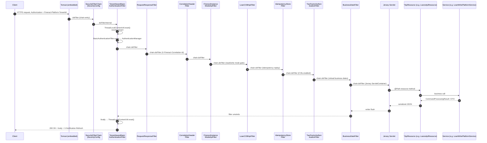
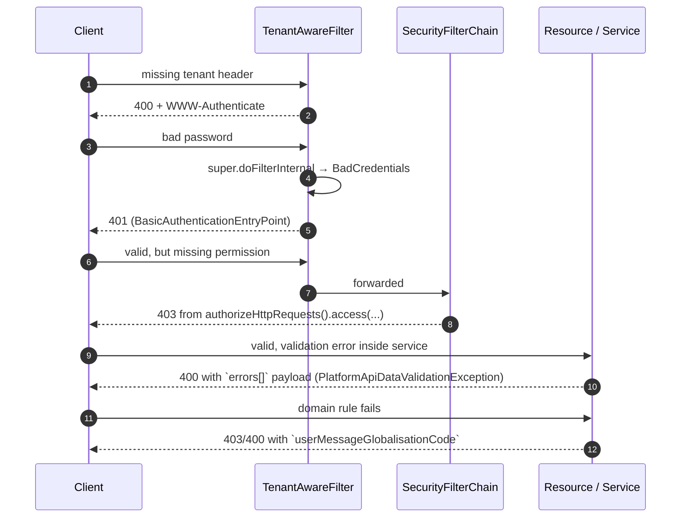

Every Apache Fineract API call — whether a `GET /v1/loans/123` from the web UI, a `POST /v1/loans/123/transactions?command=repayment` from a payments connector, or an internal `PUT /v1/instance-mode` toggle — travels the same fixed pipeline before it reaches a handler. This page tracks one request end-to-end so you know exactly where each header, exception, and thread-local lives.

Source map: every class referenced here is in `fineract-core`, `fineract-security`, or `fineract-provider`. Spring registers the security chain from `fineract-provider/src/main/java/org/apache/fineract/infrastructure/core/config/SecurityConfig.java`.

## End-to-end sequence



## Pre-conditions

<Info>
Every request below starts with the embedded Tomcat already up, `fineract-default` tenant rows present in `fineract_tenants.tenants`, and the `m_appuser`/`m_role` graph for the calling user in the tenant DB. See [Server Application](/runtime/server-application) for the boot sequence and [Datasource & Connection Pooling](/runtime/datasource-and-connection-pooling) for how `ThreadLocalContextUtil.getTenant()` is used to pick a HikariCP pool.
</Info>

| Requirement | Source |
| --- | --- |
| `Fineract-Platform-TenantId` header (or `?tenantIdentifier=` query) | `TenantAwareBasicAuthenticationFilter` lines 99–112 |
| `Authorization: Basic <base64>` (or anonymous endpoints) | `BasicAuthenticationFilter.super.doFilterInternal` |
| Property `fineract.security.basicauth.enabled=true` | `SecurityConfig` class-level `@ConditionalOnProperty` |
| For 2FA-only endpoints: `Fineract-Platform-TFA-Token` header | `TwoFactorAuthenticationFilter` (only registered when `fineract.security.2fa.enabled`) |
| For mutating endpoints with COB lock: loan not locked or `Fineract-Platform-COB-Date` header valid | `LoanCOBApiFilter` |

## Step 1 — Tomcat → SecurityFilterChain entry

Spring Boot registers a single `SecurityFilterChain` bean. The matcher narrows the chain to API traffic only:

```java
// fineract-provider/src/main/java/org/apache/fineract/infrastructure/core/config/SecurityConfig.java:123
@Bean
public SecurityFilterChain filterChain(HttpSecurity http) throws Exception {
    http.securityMatcher(API_MATCHER.matcher("/api/**"))
        .authorizeHttpRequests(auth -> { ... })
        .httpBasic(hb -> hb.authenticationEntryPoint(basicAuthenticationEntryPoint()))
        .csrf(AbstractHttpConfigurer::disable)
        .sessionManagement(smc -> smc.sessionCreationPolicy(SessionCreationPolicy.STATELESS))
        .addFilterBefore(tenantAwareBasicAuthenticationFilter(), SecurityContextHolderFilter.class)
        .addFilterAfter(requestResponseFilter(), ExceptionTranslationFilter.class)
        .addFilterAfter(correlationHeaderFilter(), RequestResponseFilter.class)
        .addFilterAfter(fineractInstanceModeApiFilter(), CorrelationHeaderFilter.class);
    // ... optional cob, idempotency, 2fa filters
    return http.build();
}
```

Anything that does not match `/api/**` (e.g. `/actuator/health`, `/error`) bypasses this chain entirely — useful when you wonder why management endpoints don't need the tenant header. See [Spring Boot Configuration](/runtime/spring-boot-configuration) for the actuator chain.

## Step 2 — TenantAwareBasicAuthenticationFilter

This is the first Fineract-owned filter. It both resolves the tenant and delegates to Spring's `BasicAuthenticationFilter` superclass so the user is authenticated against `customAuthenticationProvider`.

```java
// fineract-security/.../filter/TenantAwareBasicAuthenticationFilter.java:97
ThreadLocalContextUtil.reset();
if ("OPTIONS".equalsIgnoreCase(request.getMethod())) {
    filterChain.doFilter(request, response); // CORS preflight bypass
} else {
    String tenantIdentifier = request.getHeader(TENANT_ID_REQUEST_HEADER);
    if (StringUtils.isBlank(tenantIdentifier)) {
        tenantIdentifier = request.getParameter("tenantIdentifier");
    }
    if (tenantIdentifier == null && EXCEPTION_IF_HEADER_MISSING) {
        throw new InvalidTenantIdentifierException(...);
    }
    final FineractPlatformTenant tenant =
        basicAuthTenantDetailsService.loadTenantById(tenantIdentifier, isReportRequest);
    ThreadLocalContextUtil.setTenant(tenant);
    HashMap<BusinessDateType, LocalDate> businessDates =
        businessDateReadPlatformService.getBusinessDates();
    ThreadLocalContextUtil.setBusinessDates(businessDates);
    ...
    super.doFilterInternal(request, response, filterChain);
}
```

Things to know:

- `ThreadLocalContextUtil` holds tenant, business dates, authentication token, and `FineractContext`. It is **wiped both before and after** every request (the `finally` block on line 153 also calls `reset()`), so async executors must call `ThreadLocalContextUtil.init(context)` to inherit it.
- On the very first authenticated request (`FIRST_REQUEST_PROCESSED` flag) the filter also switches cache mode based on `c_configuration.enable_ehcache`.
- The `Authorization` header value is stripped of the `Basic ` prefix and stored as `ThreadLocalContextUtil.setAuthToken(...)` — the [Notification](/notification/overview) subsystem reads it for hook callbacks.
- After `super.doFilterInternal` resolves the user, `onSuccessfulAuthentication` injects an `X-Notification-Refresh: true|false` response header depending on `UserNotificationService.hasUnreadUserNotifications(userId)`.

Failure modes:

| Exception inside filter | HTTP result |
| --- | --- |
| `InvalidTenantIdentifierException` | `400 Bad Request` + `WWW-Authenticate: Basic realm="Fineract Platform API"` |
| `BadCredentialsException` (raised by `BasicAuthenticationFilter`) | `401 Unauthorized` via `BasicAuthenticationEntryPoint` |
| Underlying `loadTenantById` JDBC failure | Propagates and bubbles to Spring's exception translation filter |

See [Basic & Tenant Filters](/security/basic-and-tenant-filters) for the filter's deeper relationship with the tenant connection pool.

## Step 3 — RequestResponseFilter, CorrelationHeaderFilter, FineractInstanceModeApiFilter

These run in order regardless of profile:

| Filter | Responsibility |
| --- | --- |
| `RequestResponseFilter` | Captures request/response so the global error handler can replay JSON for hook events. |
| `CorrelationHeaderFilter` | Stamps `X-Fineract-Correlation-Id` (UUID if absent) into the `MDC` so all log lines for this thread carry it. See [Logging and Correlation](/runtime/logging-and-correlation). |
| `FineractInstanceModeApiFilter` | If `fineract.mode.read-enabled=false` blocks all reads with `503`, if `fineract.mode.write-enabled=false` blocks writes with `503`. See [Runtime Modes](/overview/runtime-modes). |

## Step 4 — Optional LoanCOBApiFilter, ProgressiveLoanModelCheckerFilter, IdempotencyStoreFilter

When the loan-COB feature is wired (`loanCOBFilterHelper != null`), `SecurityConfig` adds these:

```java
// fineract-provider/.../config/SecurityConfig.java:379
http.addFilterAfter(loanCOBApiFilter(), FineractInstanceModeApiFilter.class)
    .addFilterAfter(idempotencyStoreFilter(), LoanCOBApiFilter.class);
http.addFilterBefore(progressiveLoanModelCheckerFilter, LoanCOBApiFilter.class);
```

| Filter | Behaviour |
| --- | --- |
| `LoanCOBApiFilter` | Rejects writes to loans whose `m_loan_account_locks` row is older than COB threshold; forces an [Inline COB](/cob/inline-cob) run if needed. |
| `ProgressiveLoanModelCheckerFilter` | Ensures a progressive loan model entry exists for write endpoints. See [Progressive Loan Architecture](/progressive-loan/architecture). |
| `IdempotencyStoreFilter` | Reads the `Idempotency-Key` header, stashes it into `IDEMPOTENCY_KEY_ATTRIBUTE`, replays the stored response body when `CommandSource.status == PROCESSED`. See [Idempotency](/command/idempotency). |

## Step 5 — TwoFactorAuthenticationFilter (optional)

Registered only when `fineract.security.2fa.enabled=true`. The filter elevates an already-authenticated user to the synthetic `TWOFACTOR_AUTHENTICATED` authority required by URL matchers in `SecurityConfig`:

```java
// fineract-security/.../filter/TwoFactorAuthenticationFilter.java:70
if (!user.hasSpecificPermissionTo(TwoFactorConstants.BYPASS_TWO_FACTOR_PERMISSION)) {
    String token = request.getHeader("Fineract-Platform-TFA-Token");
    if (token != null) {
        TFAccessToken accessToken = twoFactorService.fetchAccessTokenForUser(user, token);
        if (accessToken == null || !accessToken.isValid()) {
            response.sendError(HttpServletResponse.SC_UNAUTHORIZED, "Invalid two-factor access token provided");
            return;
        }
    } else {
        chain.doFilter(req, res); // continue without TWOFACTOR_AUTHENTICATED
        return;
    }
}
List<GrantedAuthority> updatedAuthorities = new ArrayList<>(authentication.getAuthorities());
updatedAuthorities.add(new SimpleGrantedAuthority("TWOFACTOR_AUTHENTICATED"));
context.setAuthentication(createUpdatedAuthentication(authentication, updatedAuthorities));
```

When a user holds `BYPASS_TWOFACTOR` permission the authority is granted unconditionally. See [Two Factor Login Flow](/flows/two-factor-login-flow) for the OTP issue path and [Two Factor Auth](/security/two-factor-auth) for the data model.

## Step 6 — BusinessDateFilter

```java
// fineract-security/.../filter/BusinessDateFilter.java:38
if (ThreadLocalContextUtil.getTenant() != null) {
    HashMap<BusinessDateType, LocalDate> businessDates =
        businessDateReadPlatformService.getBusinessDates();
    ThreadLocalContextUtil.setBusinessDates(businessDates);
}
filterChain.doFilter(request, response);
```

Yes — the tenant filter already loaded business dates on entry. `BusinessDateFilter` runs a **second** read so that long-running auth flows (re-auth after key rotation, 2fa OTP issue) see the *current* dates rather than the snapshot taken at filter entry. Most reads call this trivially because the row is in HikariCP query cache.

Available dates:
- `BusinessDateType.BUSINESS_DATE` — current COB date, the date most domain code reads via `DateUtils.getBusinessLocalDate()`.
- `BusinessDateType.COB_DATE` — last successfully completed COB date.

See [Business Date Service](/core/business-date) for the underlying read service and `m_business_date` schema.

## Step 7 — Jersey ServletContainer

The Jersey servlet is mapped to `/api/*` by `FineractServletInitializer`. It performs:

1. URI parsing → match against `@Path` resources declared in `JerseyConfig`.
2. Header-driven content negotiation — `Accept: application/json` is mandatory for almost all endpoints; some require `multipart/form-data` for image upload.
3. Parameter injection via `@PathParam`, `@QueryParam`, `@Context UriInfo`, `@BeanParam`, etc.
4. Reading the entity body for `@POST`/`@PUT` and exposing it as a `String apiRequestBodyAsJson` (Fineract endpoints typically forgo Jackson binding).

See [Jersey JAX-RS](/runtime/jersey-jaxrs) for resource registration and exception mappers.

## Step 8 — *ApiResource method

Resource classes follow a consistent shape — for example `LoansApiResource.createLoanApplication`:

```java
@POST
@Consumes(MediaType.APPLICATION_JSON)
@Produces(MediaType.APPLICATION_JSON)
public String createLoanApplication(final String apiRequestBodyAsJson) {
    final CommandWrapper commandRequest = new CommandWrapperBuilder() //
            .createLoanApplication() //
            .withJson(apiRequestBodyAsJson) //
            .build();
    final CommandProcessingResult result = this.commandsSourceWritePlatformService.logCommandSource(commandRequest);
    return this.toApiJsonSerializer.serialize(result);
}
```

For mutating endpoints the resource:

1. Calls `context.authenticatedUser()` (optionally) to short-circuit when the principal cannot perform the action.
2. Builds a `CommandWrapper` via `CommandWrapperBuilder`.
3. Hands the wrapper to `PortfolioCommandSourceWritePlatformService.logCommandSource` — see [Command Execution Flow](/flows/command-execution-flow).

Read endpoints typically:

1. Call a `*ReadPlatformService` that issues parameterised SQL via `JdbcTemplate` (see [SQL Injection Prevention](/security/sql-injection-prevention)).
2. Use `ApiRequestParameterHelper` to project requested `fields=` and apply pagination via `PaginationParameters`.

## Step 9 — Response serialization and unwinding

Resource methods either return a JSON string (`toApiJsonSerializer.serialize(...)`) or a typed DTO that Jersey serializes via `Jackson`/`Gson` providers configured in [Jersey JAX-RS](/runtime/jersey-jaxrs).

The filter chain unwinds in reverse:

- `BusinessDateFilter` → no-op on exit.
- `TwoFactorAuthenticationFilter` → no-op on exit.
- `IdempotencyStoreFilter` → if a command source was persisted and `IDEMPOTENCY_KEY_STORE_FLAG=true`, copies the response body into `m_portfolio_command_source.result`.
- `LoanCOBApiFilter` → no-op on exit.
- `CorrelationHeaderFilter`/`RequestResponseFilter` → restores logging context.
- `TenantAwareBasicAuthenticationFilter.finally` → calls `ThreadLocalContextUtil.reset()` and emits a request log line.

```java
// fineract-security/.../filter/TenantAwareBasicAuthenticationFilter.java:152
} finally {
    ThreadLocalContextUtil.reset();
    task.stop();
    final PlatformRequestLog msg = PlatformRequestLog.from(task, request);
    log.debug("{}", toApiJsonSerializer.serialize(msg));
}
```

## Side effects per request

| When | What | Where |
| --- | --- | --- |
| Always | Two `ThreadLocalContextUtil.reset()` calls bracket every request | `TenantAwareBasicAuthenticationFilter` |
| Always (`/api/**`) | `correlationId` placed in `MDC` and echoed in `X-Fineract-Correlation-Id` | `CorrelationHeaderFilter` |
| Always | Tenant business dates fetched once or twice from `m_business_date` (cached via HikariCP) | `TenantAwareBasicAuthenticationFilter`, `BusinessDateFilter` |
| First request after startup | `CacheWritePlatformService.switchToCache(SINGLE_NODE \| NO_CACHE)` | `TenantAwareBasicAuthenticationFilter:130` |
| Write with `Idempotency-Key` | Stores attribute, writes `m_portfolio_command_source.result` on success | `IdempotencyStoreFilter` + `SynchronousCommandProcessingService` |
| Authenticated success | `X-Notification-Refresh: true\|false` response header | `onSuccessfulAuthentication` |
| 2FA-enabled tenant + valid token | Adds `TWOFACTOR_AUTHENTICATED` authority to `SecurityContext` | `TwoFactorAuthenticationFilter` |

## Error paths



The platform's global exception translation lives in `org.apache.fineract.infrastructure.core.exception.ErrorHandler` and Jersey `ExceptionMapper`s registered in `JerseyConfig`. See [Error Handling](/validation/error-handling) for the mapping table.

## How the chain is assembled (single Bean)

```java
// fineract-provider/.../config/SecurityConfig.java:80
@Configuration
@EnableWebSecurity
@ConditionalOnProperty("fineract.security.basicauth.enabled")
public class SecurityConfig {
    @Bean
    public SecurityFilterChain filterChain(HttpSecurity http) throws Exception { ... }

    @Bean(name = "customAuthenticationProvider")
    public DaoAuthenticationProvider customAuthenticationProvider() {
        DaoAuthenticationProvider authProvider = new DaoAuthenticationProvider();
        authProvider.setPasswordEncoder(passwordEncoder);
        authProvider.setUserDetailsService(userDetailsService);
        authProvider.setPostAuthenticationChecks(platformUserDetailsChecker);
        return authProvider;
    }
}
```

When `fineract.security.basicauth.enabled=false` (OAuth2 mode), a different `SecurityFilterChain` from `OAuth2SecurityConfig` is selected. The remainder of the filter graph (tenant, business date, COB, idempotency) is preserved; only the authentication mechanism changes. See [OAuth2 Authorization Server](/security/oauth2-authorization-server) and [Authentication Flow](/flows/authentication-flow).

## Configuration knobs

| Property | Effect | Default |
| --- | --- | --- |
| `fineract.security.basicauth.enabled` | Selects this `SecurityConfig` vs OAuth2 config | `true` |
| `fineract.security.2fa.enabled` | Registers `TwoFactorAuthenticationFilter` and authorization rule | `false` |
| `fineract.security.cors.enabled` | Adds Spring CORS handling on top of preflight bypass | `false` |
| `fineract.security.hsts.enabled` | Adds HSTS header for all requests | `false` |
| `fineract.ip-tracking.enabled` | Registers `CallerIpTrackingFilter` after `RequestResponseFilter` | `false` |
| `fineract.mode.read-enabled` / `fineract.mode.write-enabled` | Switches `FineractInstanceModeApiFilter` to 503 mode | `true` |
| `server.ssl.enabled` | Forces `requiresChannel(...).requiresSecure()` for `/api/**` | `false` |

## Per-thread state created here

| Holder | Set by | Cleared by |
| --- | --- | --- |
| `ThreadLocalContextUtil.tenant` | `TenantAwareBasicAuthenticationFilter` | `finally` block in same filter |
| `ThreadLocalContextUtil.businessDates` | `TenantAwareBasicAuthenticationFilter`, `BusinessDateFilter` | `ThreadLocalContextUtil.reset()` |
| `ThreadLocalContextUtil.authToken` | `TenantAwareBasicAuthenticationFilter` (Basic header) | same `reset` |
| `MDC.correlationId` | `CorrelationHeaderFilter` | `CorrelationHeaderFilter` exit |
| `SecurityContextHolder.context.authentication` | Spring's `BasicAuthenticationFilter` | `SecurityContextHolderFilter` exit (default strategy is `MODE_THREADLOCAL`) |
| `FineractRequestContextHolder` attributes (`IDEMPOTENCY_KEY_ATTRIBUTE`, `COMMAND_SOURCE_ID`, `IDEMPOTENCY_KEY_STORE_FLAG`) | `IdempotencyStoreFilter`, `SynchronousCommandProcessingService` | Cleared per request by Spring's request-scope wrapper |

## Where to look next

<CardGroup cols={2}>
  <Card title="Basic & Tenant Filters" href="/security/basic-and-tenant-filters">Deep dive into the filter that resolves tenant + Basic credentials.</Card>
  <Card title="Authentication Flow" href="/flows/authentication-flow">Walk the `/v1/authentication` POST path and OAuth2 variant.</Card>
  <Card title="Command Execution Flow" href="/flows/command-execution-flow">How `logCommandSource` reaches `SynchronousCommandProcessingService`.</Card>
  <Card title="Two-Factor Login Flow" href="/flows/two-factor-login-flow">OTP request, validation, and the `Fineract-Platform-TFA-Token` header.</Card>
  <Card title="Inline COB" href="/cob/inline-cob">What `LoanCOBApiFilter` does when a loan is behind.</Card>
  <Card title="Idempotency" href="/command/idempotency">How `IdempotencyStoreFilter` interacts with `m_portfolio_command_source`.</Card>
</CardGroup>
