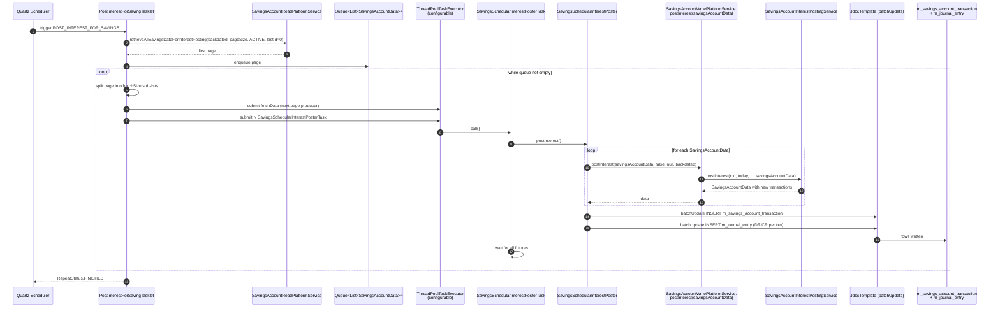

The Apache Fineract `POST_INTEREST_FOR_SAVINGS` job is the engine that turns accrued daily interest on every active savings account into a posted transaction and a pair of `m_journal_entry` rows. It is deliberately multi-threaded — fetch loops feed worker threads from a bounded queue so the job scales to millions of accounts without exhausting heap. This page traces the full flow, from the tasklet entry point through `SavingsAccountWritePlatformService.postInterest` to the JDBC batch insert of GL entries.

Source map:

- `fineract-provider/src/main/java/org/apache/fineract/portfolio/savings/jobs/postinterestforsavings/PostInterestForSavingTasklet.java`
- `fineract-savings/src/main/java/org/apache/fineract/portfolio/savings/service/SavingsSchedularInterestPosterTask.java`
- `fineract-savings/src/main/java/org/apache/fineract/portfolio/savings/service/SavingsSchedularInterestPoster.java`
- `fineract-provider/src/main/java/org/apache/fineract/portfolio/savings/service/SavingsAccountWritePlatformServiceJpaRepositoryImpl.java`
- `fineract-savings/src/main/java/org/apache/fineract/portfolio/savings/domain/SavingsAccount.java` (`postInterest`)

## End-to-end sequence



## Pre-conditions

| Requirement | Detail |
| --- | --- |
| `POST_INTEREST_FOR_SAVINGS` job enabled in `m_job` for the tenant | Cron-triggered, typically nightly. |
| Caller is the system `AppUser` | Required so `PlatformSecurityContext.authenticatedUser().getId()` resolves for the audit columns on journal entries. |
| `c_configuration.savings-interest-posting-current-period-end` | Decides whether to post on period end vs business date. |
| `c_configuration.financial-year-beginning-month` | Drives the posting period anchor. |
| `c_configuration.pivot-config-enabled` (`backdatedTxnsAllowedTill`) | Toggles which transaction set the poster touches. |
| `thread-pool-size` and `batch-size` job parameters present | Configured via `m_job_parameters` or job DSL; required by the tasklet. |
| GL mappings on the product | `m_product_savings.gl_account_id_savings_control`, `gl_account_id_interest_on_savings`, etc. populated. |

## Step 1 — Tasklet entry

```java
// fineract-provider/.../portfolio/savings/jobs/postinterestforsavings/PostInterestForSavingTasklet.java:55
@Override
public RepeatStatus execute(StepContribution contribution, ChunkContext chunkContext) throws Exception {
    final Queue<List<SavingsAccountData>> queue = new ArrayDeque<>();
    final int threadPoolSize = Integer.parseInt((String) chunkContext.getStepContext().getJobParameters().get("thread-pool-size"));
    taskExecutor.setCorePoolSize(threadPoolSize);
    taskExecutor.setMaxPoolSize(threadPoolSize);
    final int batchSize = Integer.parseInt((String) chunkContext.getStepContext().getJobParameters().get("batch-size"));
    final int pageSize = batchSize * threadPoolSize;
    Long maxSavingsIdInList = 0L;
    final boolean backdatedTxnsAllowedTill = this.configurationDomainService.retrievePivotDateConfig();
    long start = System.currentTimeMillis();

    List<SavingsAccountData> savingsAccounts = savingAccountReadPlatformService
            .retrieveAllSavingsDataForInterestPosting(backdatedTxnsAllowedTill, pageSize, ACTIVE.getValue(), maxSavingsIdInList);

    if (savingsAccounts != null && savingsAccounts.size() > 0) {
        savingsAccounts = Collections.synchronizedList(savingsAccounts);
        queue.add(savingsAccounts);
        do {
            List<SavingsAccountData> queueElement = queue.element();
            maxSavingsIdInList = queueElement.get(queueElement.size() - 1).getId();
            postInterest(queue.remove(), threadPoolSize, backdatedTxnsAllowedTill, pageSize, maxSavingsIdInList, queue);
        } while (!CollectionUtils.isEmpty(queue));
    }
    return RepeatStatus.FINISHED;
}
```

Key choices:

- **Thread pool size and batch size are job parameters** not Spring properties — this lets the job be re-tuned without a redeploy.
- The page is `batchSize * threadPoolSize`. Each worker thread handles `batchSize` accounts; the page is split evenly.
- The `Queue` holds at most `QUEUE_SIZE` (1) page ahead. A separate `fetchData` callable inside the worker pool tops it up while the other workers post — overlapping I/O and computation.
- `maxSavingsIdInList` is the last `id` from the previous page, used as a cursor for the next `retrieveAllSavingsDataForInterestPosting` call (keyset pagination, not offset/limit).

## Step 2 — Distributing work across threads

```java
// fineract-provider/.../jobs/postinterestforsavings/PostInterestForSavingTasklet.java:91
private void postInterest(List<SavingsAccountData> savingsAccounts, int threadPoolSize, final boolean backdatedTxnsAllowedTill,
        final int pageSize, Long maxSavingsIdInList, Queue<List<SavingsAccountData>> queue) {
    List<Callable<Void>> posters = new ArrayList<>();
    int fromIndex = 0;
    int size = savingsAccounts.size();
    int batchSize = (int) Math.ceil((double) size / threadPoolSize);
    if (batchSize == 0) { return; }
    int toIndex = (batchSize > size - 1) ? size : batchSize;
    while (toIndex < size && savingsAccounts.get(toIndex - 1).getId().equals(savingsAccounts.get(toIndex).getId())) {
        toIndex++;
    }
    boolean lastBatch = false;
    int loopCount = size / batchSize + 1;
    FineractContext context = ThreadLocalContextUtil.getContext();

    Callable<Void> fetchData = () -> {
        try {
            ThreadLocalContextUtil.init(context);
            Long maxId = maxSavingsIdInList;
            if (!queue.isEmpty()) {
                maxId = Math.max(maxSavingsIdInList, queue.element().get(queue.element().size() - 1).getId());
            }
            while (queue.size() <= QUEUE_SIZE) {
                List<SavingsAccountData> savingsAccountDataList = Collections.synchronizedList(this.savingAccountReadPlatformService
                        .retrieveAllSavingsDataForInterestPosting(backdatedTxnsAllowedTill, pageSize, ACTIVE.getValue(), maxId));
                if (savingsAccountDataList.isEmpty()) { break; }
                maxId = savingsAccountDataList.get(savingsAccountDataList.size() - 1).getId();
                queue.add(savingsAccountDataList);
            }
            return null;
        } finally {
            ThreadLocalContextUtil.reset();
        }
    };
    posters.add(fetchData);

    for (long i = 0; i < loopCount; i++) {
        List<SavingsAccountData> subList = safeSubList(savingsAccounts, fromIndex, toIndex);
        SavingsSchedularInterestPosterTask savingsSchedularInterestPosterTask = applicationContext
                .getBean(SavingsSchedularInterestPosterTask.class);
        savingsSchedularInterestPosterTask.setSavingAccounts(subList);
        savingsSchedularInterestPosterTask.setBackdatedTxnsAllowedTill(backdatedTxnsAllowedTill);
        savingsSchedularInterestPosterTask.setContext(ThreadLocalContextUtil.getContext());
        posters.add(savingsSchedularInterestPosterTask);
        ...
    }
    List<Future<Void>> responses = new ArrayList<>();
    posters.forEach(poster -> responses.add(taskExecutor.submit(poster)));
    checkCompletion(responses);
}
```

Why the `id` peek inside the split loop? Some accounts share an id across rows when there are unposted transactions — the loop ensures all rows for the same id end up in the same sub-list so the per-account `postInterest` doesn't see partial transaction history.

Each poster task is fetched fresh from the Spring context (`@Scope("prototype")` on `SavingsSchedularInterestPosterTask`) so it has its own state.

## Step 3 — `SavingsSchedularInterestPosterTask.call`

```java
// fineract-savings/.../portfolio/savings/service/SavingsSchedularInterestPosterTask.java:42
@Override
public Void call() throws JobExecutionException {
    try {
        ThreadLocalContextUtil.init(context);
        interestPoster.postInterest();
        return null;
    } finally {
        ThreadLocalContextUtil.reset();
    }
}
```

Each worker thread re-initialises `ThreadLocalContextUtil` with the parent thread's `FineractContext` (tenant + business dates + auth token + correlation id) so JDBC operations target the right tenant DB.

## Step 4 — `SavingsSchedularInterestPoster.postInterest`

```java
// fineract-savings/.../portfolio/savings/service/SavingsSchedularInterestPoster.java:66
@Transactional(isolation = Isolation.READ_UNCOMMITTED, rollbackFor = Exception.class)
public void postInterest() throws JobExecutionException {
    if (!savingAccounts.isEmpty()) {
        List<Throwable> errors = new ArrayList<>();
        LocalDate yesterday = DateUtils.getBusinessLocalDate().minusDays(1);
        for (SavingsAccountData savingsAccountData : savingAccounts) {
            boolean postInterestAsOn = false;
            LocalDate transactionDate = null;
            try {
                if (isInterestAlreadyPostedForPeriod(savingsAccountData, yesterday)) {
                    log.debug("Interest already posted for savings account {} up to date {}, skipping",
                            savingsAccountData.getId(), savingsAccountData.getSummary().getInterestPostedTillDate());
                    continue;
                }
                SavingsAccountData savingsAccountDataRet = savingsAccountWritePlatformService.postInterest(savingsAccountData,
                        postInterestAsOn, transactionDate, backdatedTxnsAllowedTill);
                savingsAccountDataList.add(savingsAccountDataRet);
            } catch (Exception e) {
                errors.add(e);
            }
        }
        if (errors.isEmpty()) {
            try {
                batchUpdate(savingsAccountDataList);
            } catch (DataAccessException exception) {
                log.error("Batch update failed due to DataAccessException", exception);
                errors.add(exception);
            } catch (Exception exception) {
                log.error("Batch update failed", exception);
                errors.add(exception);
            }
        }
        if (!errors.isEmpty()) {
            throw new JobExecutionException(errors);
        }
    }
}
```

Important details:

- `READ_UNCOMMITTED` isolation — the poster computes new interest from JPA-attached account state but persists transactions and journal entries via a `JdbcTemplate.batchUpdate`. Lowest isolation is acceptable because each savings account is exclusively owned by exactly one worker thread for the duration of the call (partitioned by id range).
- The `isInterestAlreadyPostedForPeriod` short-circuit avoids double-posting when the job is run twice in a window (catch-up after failure).
- Errors are collected, not thrown immediately — the batch finishes processing all accounts in the page, then raises a `JobExecutionException` if any failed. The DB transaction rolls back the whole worker batch.

## Step 5 — `SavingsAccountWritePlatformService.postInterest(SavingsAccountData, ...)`

```java
// fineract-provider/.../savings/service/SavingsAccountWritePlatformServiceJpaRepositoryImpl.java:631
@Transactional
@Override
@Retry(name = "postInterest", fallbackMethod = "fallbackPostInterest")
public SavingsAccountData postInterest(SavingsAccountData savingsAccountData, final boolean postInterestAs,
        final LocalDate transactionDate, final boolean backdatedTxnsAllowedTill) {
    final boolean isSavingsInterestPostingAtCurrentPeriodEnd = this.configurationDomainService
            .isSavingsInterestPostingAtCurrentPeriodEnd();
    final Integer financialYearBeginningMonth = this.configurationDomainService.retrieveFinancialYearBeginningMonth();

    if (MathUtil.isGreaterThanZero(savingsAccountData.getNominalAnnualInterestRate())
            || (savingsAccountData.isAllowOverdraft() && MathUtil.isGreaterThanZero(savingsAccountData.getNominalAnnualInterestRateOverdraft()))) {
        final Set<Long> existingTransactionIds = new HashSet<>();
        final Set<Long> existingReversedTransactionIds = new HashSet<>();
        updateExistingTransactionsDetails(savingsAccountData, existingTransactionIds, existingReversedTransactionIds);

        final LocalDate today = DateUtils.getBusinessLocalDate();
        final MathContext mc = new MathContext(10, MoneyHelper.getRoundingMode());
        boolean isInterestTransfer = false;
        LocalDate postInterestOnDate = null;
        if (postInterestAs) { postInterestOnDate = transactionDate; }

        savingsAccountData = this.savingsAccountInterestPostingService.postInterest(mc, today, isInterestTransfer,
                isSavingsInterestPostingAtCurrentPeriodEnd, financialYearBeginningMonth, postInterestOnDate, backdatedTxnsAllowedTill,
                savingsAccountData);

        if (!backdatedTxnsAllowedTill) {
            List<SavingsAccountTransactionData> transactions = savingsAccountData.getSavingsAccountTransactionData();
            for (SavingsAccountTransactionData accountTransaction : transactions) {
                if (accountTransaction.getId() == null) {
                    savingsAccountData.setNewSavingsAccountTransactionData(accountTransaction);
                    selectAccountId(accountTransaction, savingsAccountData);
                }
            }
        }
        savingsAccountData.setExistingTransactionIds(existingTransactionIds);
        savingsAccountData.setExistingReversedTransactionIds(existingReversedTransactionIds);
    }
    return savingsAccountData;
}
```

What happens here:

1. **Rate gate** — accounts with zero nominal annual interest rate are skipped (the overdraft rate is checked independently if overdraft is allowed).
2. **Existing transaction ids** — captured so `postJournalEntries` later only emits entries for new/changed transactions.
3. **`SavingsAccountInterestPostingService.postInterest`** — the actual math: it walks the posting period boundaries, computes interest for each sub-period, and appends `INTEREST_POSTING` / `OVERDRAFT_INTEREST` transactions in-memory on the data object.
4. **`selectAccountId`** — for each *new* transaction the GL debit/credit account ids are resolved from the savings product mappings:

   ```java
   if (transactionType.isOverDraftInterestPosting()) {
       if (MathUtil.isGreaterThanZero(accountTransaction.getRunningBalance())) {
           accountTransaction.setAccountDebit(savingsAccountData.getGlAccountIdForSavingsControl());
           accountTransaction.setAccountCredit(savingsAccountData.getGlAccountIdForInterestReceivable());
       } else {
           accountTransaction.setAccountDebit(savingsAccountData.getGlAccountIdForOverdraftPorfolio());
           accountTransaction.setAccountCredit(savingsAccountData.getGlAccountIdForInterestReceivable());
       }
   } else {
       accountTransaction.setAccountDebit(savingsAccountData.getGlAccountIdForInterestPayable());
       accountTransaction.setAccountCredit(savingsAccountData.getGlAccountIdForSavingsControl());
   }
   ```

5. **Resilience4j retry** — `@Retry(name="postInterest", fallbackMethod="fallbackPostInterest")` makes the call resilient to transient DB errors. `fallbackPostInterest` records the failure for the batch error list without rethrowing.

## Step 6 — Batch insert of transactions + journal entries

`SavingsSchedularInterestPoster.batchUpdate` issues two parameterised SQL batches via `JdbcTemplate.batchUpdate`:

1. `INSERT INTO m_savings_account_transaction (...) VALUES (...)` for every accumulated unposted interest transaction.
2. `INSERT INTO m_journal_entry (...) VALUES (...)` with debit + credit pairs per transaction (Dr Interest Payable expense / Cr Savings Control liability) — the exact accounts chosen earlier in `selectAccountId`.

Using `batchUpdate` avoids the per-row Hibernate flush cost; on production loads this is the difference between minutes and hours.

Then a third batch:
3. `UPDATE m_savings_account_summary SET interest_posted_till_date=..., total_interest_posted_derived=...` per account so the next run knows where to start.

## Side effects per account

| Mutation | Notes |
| --- | --- |
| `m_savings_account_transaction` INSERT (`transaction_type_enum=4` INTEREST_POSTING or `15` OVERDRAFT_INTEREST) | One per posting period boundary touched. |
| `m_savings_account` UPDATE (`account_balance_derived`, `total_interest_posted_derived`, `interest_posted_till_date`) | Via `saveAndFlush` (single-account flow) or batch (multi-thread flow). |
| `m_journal_entry` INSERT | Two rows per transaction (Dr / Cr). |
| `m_savings_account_summary` UPDATE | If pivot-config / backdated transactions allowed. |
| `m_external_event` rows for `SavingsPostInterestBusinessEvent` | Emitted via `BusinessEventNotifierService` when interest is posted. |

The job does **not** invoke the command processing pipeline — no `m_portfolio_command_source` row is written. The job runs as a batch tasklet, and `SavingsAccountWritePlatformService.postInterest` is a public method invoked from outside the command framework.

## Configuration knobs

| Property / config | Effect |
| --- | --- |
| `m_job_parameters.thread-pool-size` (job param) | Worker concurrency. |
| `m_job_parameters.batch-size` (job param) | Accounts per worker per page. |
| `c_configuration.savings-interest-posting-current-period-end` | Toggle posting on period boundaries vs running totals. |
| `c_configuration.financial-year-beginning-month` | Anchor for annual posting periods. |
| `c_configuration.pivot-config-enabled` | When true, the `backdatedTxnsAllowedTill` branch is used — interest computed back to the pivot date. |
| `SavingsAccountWritePlatformServiceJpaRepositoryImpl.postInterest` Resilience4j retry config | Default: 3 retries on transient DB errors; fallback method appends error to batch. |

## Error paths

| Failure | Behaviour |
| --- | --- |
| Read service returns empty page | Tasklet returns `RepeatStatus.FINISHED`. |
| One account throws during `postInterest` | Error captured, others continue. Batch fails at the end (rolls back the worker's transaction). |
| DataAccessException in `batchUpdate` | Logged, captured into error list. |
| Thread interrupted | `checkCompletion` logs and proceeds. |
| Pivot-config row missing for the product | `postInterest` short-circuits because nominal annual rate is 0 — or NPE if mis-configured; surface as DB constraint error. |
| GL closure exists on the posting date | The journal entry insert violates the closure constraint; that worker's batch rolls back. |

## Synchronous variant: `POST /v1/savingsaccounts/{id}?command=postInterestAsOn`

`SavingsAccountWritePlatformServiceJpaRepositoryImpl.postInterest(JsonCommand command)` (line 531) is the single-account command path:

```java
public CommandProcessingResult postInterest(final JsonCommand command) {
    ...
    final SavingsAccount account = this.savingAccountAssembler.assembleFrom(savingsId, backdatedTxnsAllowedTill);
    postInterest(account, postInterestAs, transactionDate, backdatedTxnsAllowedTill);
    ...
}
```

It calls the **`SavingsAccount` aggregate** variant (line 581) which performs the same logical work but persists via JPA rather than JDBC batch. This is the path the [Command Execution Flow](/flows/command-execution-flow) takes — `m_portfolio_command_source` is updated and the request returns a normal `CommandProcessingResult`. Use this for one-off corrections.

## Operator runbook

<Steps>
  <Step title="Verify the job ran">Check `m_batch_job_execution.exit_status` for `POST_INTEREST_FOR_SAVINGS` overnight.</Step>
  <Step title="Check page progress">Look at `m_savings_account_summary.interest_posted_till_date` — every active savings account should match yesterday's COB.</Step>
  <Step title="Validate ledger">Sum debits to `INTEREST_PAYABLE` vs credits to `SAVINGS_CONTROL` for the posting date in `m_journal_entry`. They must equal.</Step>
  <Step title="If a partition failed">Run the synchronous `POST /v1/savingsaccounts/{id}?command=postInterestAsOn` for affected accounts. Each call goes through the command framework and is auditable.</Step>
  <Step title="Subscribe to events">Configure [External Event Configuration](/events/external-event-configuration-api) for `SavingsPostInterestBusinessEvent` to consume per-account postings downstream.</Step>
</Steps>

## Where to look next

<CardGroup cols={2}>
  <Card title="Savings Domain Model" href="/savings/savings-account-domain">SavingsAccount aggregate and transaction types.</Card>
  <Card title="Savings COB Business Steps" href="/cob/savings-cob-business-steps">Daily savings COB steps that prepare for interest posting.</Card>
  <Card title="Accrual & Posting Accounts" href="/accounting/cash-accounting">GL account mappings used in `selectAccountId`.</Card>
  <Card title="Loan COB Flow" href="/flows/loan-cob-flow">Sibling flow on the loan side.</Card>
  <Card title="External Event Publishing Flow" href="/flows/external-event-publishing-flow">Where SavingsPostInterestBusinessEvent ends up.</Card>
  <Card title="Synchronous Command Processing" href="/command/synchronous-command-processing">Path of the on-demand `postInterestAsOn` command.</Card>
</CardGroup>
