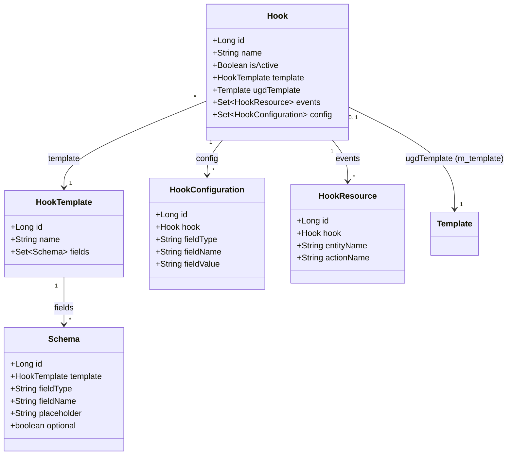
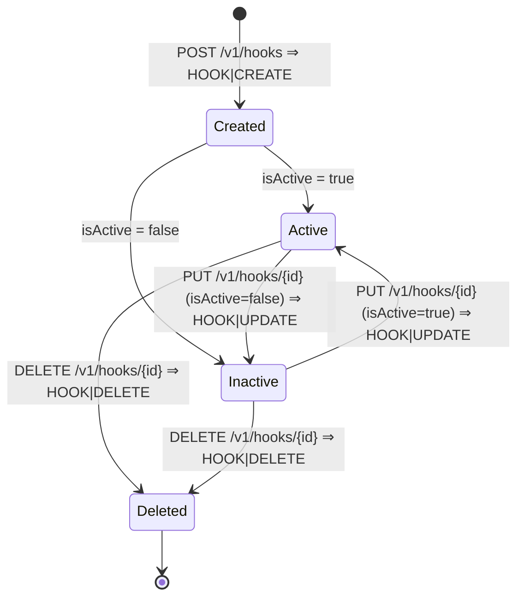

This page is the entity-level reference for the Apache Fineract hooks subsystem. Five JPA classes model everything the runtime needs in order to dispatch a hook: `HookTemplate` (a named transport family — `Web`, `SMS Bridge`, `Elastic Search`, `Message Gateway`), `Schema` (the fields a template expects), `Hook` (an active subscription), `HookConfiguration` (the key/value pairs the operator supplied for that subscription) and `HookResource` (the `(entityName, actionName)` pairs the subscription listens to). All five live in `org.apache.fineract.infrastructure.hooks.domain` inside `fineract-provider`; only the `HookEvent` / `HookEventSource` value types live in `fineract-core` (see [core/hooks](/core/hooks)).

For how these entities are loaded at dispatch time see [hooks/overview](/hooks/overview); for how processors read them see [hooks/hook-processors](/hooks/hook-processors).

## Entity map



| Java class            | Table                       | Identity (`AbstractPersistableCustom<Long>` / `AbstractAuditableCustom`) |
| --------------------- | --------------------------- | ----------------------------------------------------------------------- |
| `Hook`                | `m_hook`                    | Auditable (createdBy/updatedBy/at, version) via `AbstractAuditableCustom` |
| `HookConfiguration`   | `m_hook_configuration`      | Persistable                                                             |
| `HookResource`        | `m_hook_registered_events`  | Persistable                                                             |
| `HookTemplate`        | `m_hook_templates`          | Persistable                                                             |
| `Schema`              | `m_hook_schema`             | Persistable                                                             |

## `Hook` — the subscription

`Hook` is the aggregate root for a single subscription. It is the only one of these entities that audits user identity and timestamps because the other four are owned via cascading `OneToMany`:

```java
// fineract-provider/.../infrastructure/hooks/domain/Hook.java
@Entity
@Table(name = "m_hook")
@Getter @Setter @NoArgsConstructor @Accessors(chain = true)
public final class Hook extends AbstractAuditableCustom {

    @Column(name = "name", nullable = false, length = 100)
    private String name;

    @Column(name = "is_active", nullable = false)
    private Boolean isActive;

    @OneToMany(cascade = CascadeType.ALL, mappedBy = "hook",
               orphanRemoval = true, fetch = FetchType.EAGER)
    private Set<HookResource> events = new HashSet<>();

    @OneToMany(cascade = CascadeType.ALL, mappedBy = "hook",
               orphanRemoval = true, fetch = FetchType.EAGER)
    private Set<HookConfiguration> config = new HashSet<>();

    @ManyToOne(optional = true)
    @JoinColumn(name = "template_id", referencedColumnName = "id", nullable = false)
    private HookTemplate template;

    @ManyToOne(optional = true)
    @JoinColumn(name = "ugd_template_id", referencedColumnName = "id", nullable = true)
    private Template ugdTemplate;
    ...
}
```

| Column          | Type        | Null | Notes                                                                  |
| --------------- | ----------- | ---- | ---------------------------------------------------------------------- |
| `id`            | BIGINT (PK) | no   | Surrogate.                                                             |
| `name`          | VARCHAR(100)| no   | Operator-visible display name. Falls back to `template.name` if blank. |
| `is_active`     | BOOLEAN     | no   | Only active hooks are returned by `findAllHooksListeningToEvent`.      |
| `template_id`   | BIGINT (FK) | no   | Points at `m_hook_templates` — drives processor selection.             |
| `ugd_template_id`| BIGINT(FK) | yes  | Optional pointer at `m_template`; used for Mustache rendering in SMS.  |
| audit columns   | -           | -    | `created_by`, `created_on_utc`, `last_modified_by`, `last_modified_on_utc`, `version` via `AbstractAuditableCustom`. |

### Construction

Construction goes through `Hook.fromJson(...)`, which the write service builds after running `HookCommandFromApiJsonDeserializer.validateForCreate`:

```java
// Hook.java
public static Hook fromJson(final JsonCommand command, final HookTemplate template,
        final Set<HookConfiguration> config, final Set<HookResource> events,
        final Template ugdTemplate) {
    final String displayName = command.stringValueOfParameterNamed(displayNameParamName);
    Boolean isActive = command.booleanObjectValueOfParameterNamed(isActiveParamName);
    if (isActive == null) { isActive = false; }
    return new Hook(template, displayName, isActive, config, events, ugdTemplate);
}
```

If `displayName` is blank, `name` is set to `template.getName()` (e.g. `"Web"`). The private constructor calls `associateConfigWithThisHook(config)` and `associateEventsWithThisHook(events)` to wire the bidirectional back-references — JPA orphan removal then handles deletes when these collections are replaced.

### Update semantics

`Hook.update(JsonCommand)` returns a `LinkedHashMap<String, Object>` of changes that the maker-checker audit will store under `changesOnly`. It diffs five parameters:

| Parameter (`HookApiConstants`) | Action                                                |
| ------------------------------ | ------------------------------------------------------ |
| `displayNameParamName`         | Compares against `this.name`, replaces if different    |
| `isActiveParamName`            | Compares against `this.isActive`                       |
| `templateIdParamName`          | Compares against `getUgdTemplateId()` — note: this is the **UGD** template id, not the hook template id |
| `eventsParamName`              | Returned for the write service to rebuild `HookResource` rows |
| `configParamName`              | Returned for the write service to rebuild `HookConfiguration` rows |

The collection replacements are done by separate helpers:

```java
public boolean updateEvents(final Set<HookResource> newHookEvents) {
    if (newHookEvents == null) return false;
    this.events.clear();
    this.events.addAll(associateEventsWithThisHook(newHookEvents));
    return true;
}
public boolean updateConfig(final Set<HookConfiguration> newHookConfig) {
    if (newHookConfig == null) return false;
    this.config.clear();
    this.config.addAll(associateConfigWithThisHook(newHookConfig));
    return true;
}
```

Both use `clear() + addAll()` so JPA's `orphanRemoval = true` setting (on the `@OneToMany`) deletes the rows that fell off — without it stale `HookResource` / `HookConfiguration` rows would accumulate. The write service then evicts the per-tenant `hooks` cache.

### Fetch strategy

Both `events` and `config` use `FetchType.EAGER`. Combined with the JPQL of `findAllHooksListeningToEvent`, that means one query fetches the `Hook` plus an `inner join` on `events`, and Hibernate then issues additional queries for `config`. Because `retrieveHooksByEvent` is `@Cacheable("hooks", ...)`, the cost is paid once per tenant until the cache is evicted by a `HOOK|CREATE/UPDATE/DELETE` command.

### The optional UGD template link

`ugd_template_id` points at a row in `m_template` (the User-Generated-Documents table — see [hooks/template-engine](/hooks/template-engine)). It is used by:

- **TwilioHookProcessor** (`processUgdTemplate`) to render an SMS body from the event payload + the configured Mustache template.
- **MessageGatewayHookProcessor** as a fallback when no `findByTemplateMapper("SMS_template_Key", entity + "_" + action)` row exists.

It is **not** consulted by `WebHookProcessor` or `ElasticSearchHookProcessor`, both of which forward the raw event payload.

## `HookTemplate` — the transport family

`HookTemplate` rows are catalogue entries, not instances. The four canonical rows are seeded by Liquibase changeset `18` in `0002_initial_data.xml`:

| id | name             | Processor selected                |
| -- | ---------------- | --------------------------------- |
| 1  | `Web`            | `WebHookProcessor`                |
| 2  | `SMS Bridge`     | `TwilioHookProcessor`             |
| 3  | `Elastic Search` | `ElasticSearchHookProcessor`      |
| 4  | `Message Gateway`| `MessageGatewayHookProcessor`     |

```java
// fineract-provider/.../infrastructure/hooks/domain/HookTemplate.java
@Entity
@Table(name = "m_hook_templates")
public final class HookTemplate extends AbstractPersistableCustom<Long> {

    @Column(name = "name", nullable = false, length = 100)
    private String name;

    @OneToMany(cascade = CascadeType.ALL, mappedBy = "template",
               orphanRemoval = true, fetch = FetchType.EAGER)
    private Set<Schema> fields = new HashSet<>();
    ...
}
```

The `HookProcessorProvider` matches by exact string (`equals` / `equalsIgnoreCase` on `SMS Bridge` only). The names are also used by the JSON deserializer to look up the expected schema:

```java
// HookWritePlatformServiceJpaRepositoryImpl
final HookTemplate template = hookTemplateRepository
    .findByName(command.stringValueOfParameterNamed(nameParamName));
if (template == null) {
    throw new HookTemplateNotFoundException(name);
}
```

## `Schema` — declared fields for a template

`m_hook_schema` describes the configuration fields the UI should render when an operator creates a hook of a given template. Each row is a tuple of `(field_type, field_name, placeholder, optional)`:

```java
// fineract-provider/.../infrastructure/hooks/domain/Schema.java
@Entity
@Table(name = "m_hook_schema")
public class Schema extends AbstractPersistableCustom<Long> {
    @ManyToOne(optional = false)
    @JoinColumn(name = "hook_template_id", referencedColumnName = "id", nullable = false)
    private HookTemplate template;

    @Column(name = "field_type", nullable = false, length = 20)  private String fieldType;
    @Column(name = "field_name", nullable = false, length = 100) private String fieldName;
    @Column(name = "placeholder", length = 100)                   private String placeholder;
    @Column(name = "optional", nullable = false)                  private boolean optional;
}
```

The seed data (changeset `19` of `0002_initial_data.xml`) gives each of the four templates its expected fields. The most important ones are:

| Template          | Field name (`m_hook_schema.field_name`) | Optional | Notes                                  |
| ----------------- | ---------------------------------------- | -------- | -------------------------------------- |
| `Web`             | `Payload URL`                            | no       | Target URL for `POST`.                 |
| `Web`             | `Content Type`                           | no       | `json` or `form`.                      |
| `SMS Bridge`      | `Payload URL`                            | no       | Twilio bridge base URL.                |
| `SMS Bridge`      | `SMS Provider`                           | no       | e.g. `twilio`.                         |
| `SMS Bridge`      | `Phone Number`                           | no       | Sender phone number.                   |
| `SMS Bridge`      | `SMS Provider Token`                     | no       | Twilio auth token.                     |
| `SMS Bridge`      | `SMS Provider Account Id`                | no       | Twilio account SID.                    |
| `Elastic Search`  | `Payload URL`                            | no       | Placeholder `http://<host>/<index>/<type>`. |
| `Elastic Search`  | `Content Type`                           | no       | `json`.                                |
| `Elastic Search`  | `Index Name`                             | yes      | Currently informational only.          |
| `Message Gateway` | `SMS Provider Id`                        | no       | Provider id used by fineract-messagegateway. |

These exact `field_name` strings appear as constants on `HookApiConstants` (`payloadURLName`, `contentTypeName`, `smsProviderName`, `smsProviderAccountIdName`, `smsProviderTokenIdName`, `phoneNumberName`, `apiKeyName`, `SMSProviderIdParamName`). Every processor that needs a value looks it up by name through the `HookConfiguration` set on the `Hook`.

## `HookConfiguration` — runtime key/value pairs

For each `Schema` row of the chosen template, the operator supplies a value when creating the hook. Those values land in `m_hook_configuration`:

```java
// fineract-provider/.../infrastructure/hooks/domain/HookConfiguration.java
@Entity @Table(name = "m_hook_configuration")
@Getter @Setter @NoArgsConstructor @Accessors(chain = true)
public class HookConfiguration extends AbstractPersistableCustom<Long> {

    @ManyToOne(optional = false)
    @JoinColumn(name = "hook_id", ...) private Hook hook;

    @Column(name = "field_type",  nullable = false, length = 20)  private String fieldType;
    @Column(name = "field_name",  nullable = false, length = 100) private String fieldName;
    @Column(name = "field_value", nullable = false, length = 100) private String fieldValue;

    public static HookConfiguration createNewWithoutHook(String fieldType, String fieldName, String fieldValue) {
        return new HookConfiguration()
                .setFieldType(fieldType).setFieldName(fieldName).setFieldValue(fieldValue);
    }

    public static HookConfiguration createNew(Hook hook, String fieldType, String fieldName, String fieldValue) {
        return new HookConfiguration().setHook(hook)
                .setFieldType(fieldType).setFieldName(fieldName).setFieldValue(fieldValue);
    }
}
```

`createNewWithoutHook` is used during the create command — the rows are built first, then `Hook.fromJson` wires the back-reference inside `associateConfigWithThisHook`. `createNew(hook, ...)` is used for the Twilio bootstrap flow where an `Api Key` row is appended to an existing hook (see [twilio-hook](/hooks/twilio-hook)).

Reading these rows in a processor is hand-rolled:

```java
// WebHookProcessor
for (final HookConfiguration conf : hook.getConfig()) {
    final String fieldName = conf.getFieldName();
    if (fieldName.equals(payloadURLName))  url         = conf.getFieldValue();
    if (fieldName.equals(contentTypeName)) contentType = conf.getFieldValue();
}
```

There is also a JPA helper used by Twilio:

```java
// HookConfigurationRepository
String findOneByHookIdAndFieldName(Long hookId, String fieldName);
```

### Validation rules

`HookWritePlatformServiceJpaRepositoryImpl.validateConfigAgainstSchema(...)` enforces:

1. Every non-`optional` `Schema` field must be present in the supplied `config` JSON.
2. For the `Web` template, the URL must answer a Retrofit `GET` ping during create — implemented as `service.sendEmptyRequest().execute()` on `WebHookService` and surfaced as `error.msg.url.unreachable` if it does not.

The fixed `length = 100` on `field_value` is a hard ceiling — long API tokens or long URLs will overflow it. This is a known limitation tracked in the codebase.

## `HookResource` — the event subscriptions

```java
// fineract-provider/.../infrastructure/hooks/domain/HookResource.java
@Entity @Table(name = "m_hook_registered_events")
public class HookResource extends AbstractPersistableCustom<Long> {

    @ManyToOne(optional = false)
    @JoinColumn(name = "hook_id", ...) private Hook hook;

    @Column(name = "entity_name", nullable = false, length = 45) private String entityName;
    @Column(name = "action_name", nullable = false, length = 45) private String actionName;

    public static HookResource createNewWithoutHook(String entityName, String actionName) {
        return new HookResource().setEntityName(entityName).setActionName(actionName);
    }
}
```

The 45-character column width is generous enough for every existing Fineract permission code (`CLIENT|CREATE`, `LOAN|DISBURSE`, `SAVINGSACCOUNT|APPROVE`, etc.). Matching is **exact-string** in the JPQL — there is no wildcard. A hook subscribed to `LOAN|APPROVE` will not fire for `LOAN|REJECT`.

The `(entityName, actionName)` pair is the exact same key that:

- the [command framework](/command/overview) uses to look up `NewCommandSourceHandler` beans, and
- `SynchronousCommandProcessingService` writes into the `HookEventSource` it publishes.

This is what makes a hook subscription effectively a subscription to "any command of this kind that succeeds".

## Repositories

| Repository                          | Method                                                                                    | Purpose                                |
| ----------------------------------- | ----------------------------------------------------------------------------------------- | -------------------------------------- |
| `HookRepository`                    | `findAllHooksListeningToEvent(entityName, actionName)`                                    | Dispatch lookup (active hooks only).   |
| `HookRepository`                    | `findOneByTemplateId(templateId)`                                                         | Reverse lookup used by template ops.   |
| `HookTemplateRepository`            | `findByName(String name)`                                                                  | Resolve template by name on create.    |
| `HookConfigurationRepository`       | `findOneByHookIdAndFieldName(Long hookId, String fieldName)`                              | Used by `TwilioHookProcessor` for `Api Key`. |

The `JpaSpecificationExecutor<Hook>` interface is mixed in for ad-hoc queries but is not currently used by the bundled processors.

## Cache integration

`HookReadPlatformServiceImpl.retrieveHooksByEvent` is annotated:

```java
@Cacheable(value = "hooks",
    key = "T(org.apache.fineract.infrastructure.core.service.ThreadLocalContextUtil)"
        + ".getTenant().getTenantIdentifier().concat('HK')")
public List<Hook> retrieveHooksByEvent(String entityName, String actionName) { ... }
```

> ⚠️ Note: the cache key only includes the **tenant identifier**, not the `(entityName, actionName)` pair. The annotation as written caches one `List<Hook>` per tenant for the **first** event seen. In practice this is benign because every write path (`createHook`, `updateHook`, `deleteHook`) carries an `@CacheEvict(value = "hooks", allEntries = true)`, but it is something to keep in mind when chasing hook-not-firing bugs.

## Lifecycle summary



Every transition is itself a maker-checker command processed by a handler in `infrastructure.hooks.handler` (`CreateHookCommandHandler`, `UpdateHookCommandHandler`, `DeleteHookCommandHandler`), each declared with `@CommandType(entity = "HOOK", action = "...")`.

## Cross-references

- [Hooks overview](/hooks/overview) — how these entities are loaded and used at runtime.
- [Hook processors](/hooks/hook-processors) — the `HookProcessor` interface that reads `HookConfiguration`.
- [Template engine](/hooks/template-engine) — the `Template` (UGD) entity referenced via `Hook.ugdTemplate`.
- [Core hooks contracts](/core/hooks) — `HookEvent` and `HookEventSource`.
- [Commands framework](/command/overview) — where `(entityName, actionName)` originates.
- [Hooks & messaging APIs](/api/hooks-and-messaging-apis) — the REST surface.
