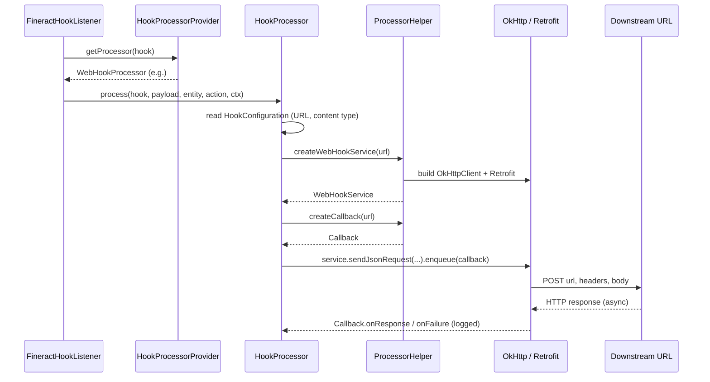

The `HookProcessor` interface is the **transport SPI** of the Apache Fineract hooks subsystem. Every time the [synchronous command processor](/command/overview) emits a `HookEvent`, `FineractHookListener` walks the matching `Hook` rows and asks `HookProcessorProvider` for the right `HookProcessor` bean to invoke. The provider switches on the `Hook`'s `HookTemplate.name` — one of four hard-coded values — and delegates to the corresponding `@Service` bean in `org.apache.fineract.infrastructure.hooks.processor`.

This page covers the interface contract, the selection table and the shared `ProcessorHelper` that every implementation uses to build an OkHttp / Retrofit client. For each transport's specifics see [web-hook](/hooks/web-hook), [elasticsearch-hook](/hooks/elasticsearch-hook), [twilio-hook](/hooks/twilio-hook) and [message-gateway-hook](/hooks/message-gateway-hook).

## The interface

```java
// fineract-provider/.../infrastructure/hooks/processor/HookProcessor.java
package org.apache.fineract.infrastructure.hooks.processor;

import org.apache.fineract.infrastructure.core.domain.FineractContext;
import org.apache.fineract.infrastructure.hooks.domain.Hook;

public interface HookProcessor {

    void process(Hook hook, String payload, String entityName, String actionName,
                 FineractContext context) throws Exception;
}
```

It is intentionally small. Each parameter has a single, narrow purpose:

| Parameter    | Source                                                                     | Used by processors for                                       |
| ------------ | --------------------------------------------------------------------------- | ------------------------------------------------------------- |
| `hook`       | The DB row matched by `findAllHooksListeningToEvent`                        | Reading `HookConfiguration` (URLs, tokens) and `ugdTemplate`. |
| `payload`    | `HookEvent.getPayload()` — Gson-serialised request+response map.            | Either forwarding verbatim or feeding the Mustache engine.    |
| `entityName` | `HookEventSource.getEntityName()` (e.g. `CLIENT`, `LOAN`)                   | Building `X-Fineract-Entity` headers and template lookup keys.|
| `actionName` | `HookEventSource.getActionName()` (e.g. `CREATE`, `APPROVE`)                | Same, plus `X-Fineract-Action`.                              |
| `context`    | `event.getContext()` — captured at publish time on the publisher thread.    | Tenant identifier, base URL, auth token.                     |

Processors **may throw any `Exception`** — `FineractHookListener` wraps every invocation in `try { ... } catch (Throwable e) { log.error(...) }`, so a thrown exception is logged with the hook id, processor class name, tenant, user and full payload but never propagates back to the command flow. There is no retry.

## Selection by template name

```java
// fineract-provider/.../infrastructure/hooks/processor/HookProcessorProvider.java
@Service
@RequiredArgsConstructor
public class HookProcessorProvider {

    private final ApplicationContext applicationContext;

    public HookProcessor getProcessor(final Hook hook) {
        HookProcessor processor;
        final String templateName = hook.getTemplate().getName();
        if (templateName.equalsIgnoreCase(smsTemplateName)) {
            processor = ctx.getBean("twilioHookProcessor", TwilioHookProcessor.class);
        } else if (templateName.equals(webTemplateName)) {
            processor = ctx.getBean("webHookProcessor", WebHookProcessor.class);
        } else if (templateName.equals(elasticSearchTemplateName)) {
            processor = ctx.getBean("elasticSearchHookProcessor", ElasticSearchHookProcessor.class);
        } else if (templateName.equals(httpSMSTemplateName)) {
            processor = ctx.getBean("messageGatewayHookProcessor", MessageGatewayHookProcessor.class);
        } else {
            processor = null;
        }
        return processor;
    }
}
```

Two subtleties:

1. The first branch uses `equalsIgnoreCase`. The other three use exact `equals`. In practice the values are seeded by Liquibase, so an operator cannot create new `HookTemplate` rows through the API (`HookTemplateRepository` has no create endpoint), but custom Liquibase changesets or hand-edited rows that differ in case will not match.
2. An unknown template name returns `null`. The caller (`FineractHookListener`) does not null-check before calling `processor.process(...)`, so a misconfigured row produces a `NullPointerException` that the listener's `catch (Throwable)` swallows and logs.

### The selection table

| `m_hook_templates.name` | Constant on `HookApiConstants` | `@Service` bean name              | Implementation class                | Transport                          |
| ----------------------- | ------------------------------ | --------------------------------- | ------------------------------------ | ---------------------------------- |
| `Web`                   | `webTemplateName`              | `webHookProcessor`                | `WebHookProcessor`                   | OkHttp/Retrofit `POST` to any URL  |
| `Elastic Search`        | `elasticSearchTemplateName`    | `elasticSearchHookProcessor`      | `ElasticSearchHookProcessor`         | OkHttp `POST` to ES index URL      |
| `SMS Bridge`            | `smsTemplateName`              | `twilioHookProcessor`             | `TwilioHookProcessor`                | Twilio-compatible SMS bridge       |
| `Message Gateway`       | `httpSMSTemplateName`          | `messageGatewayHookProcessor`     | `MessageGatewayHookProcessor`        | fineract-messagegateway service    |

Each processor is a vanilla Spring `@Service`. The bean names match the lowercase class name (Spring's default), which is what the `getBean(String, Class)` call relies on.

## Shared client: `ProcessorHelper`

Three of the four processors (`Web`, `Elastic Search`, `Twilio`) share a single Retrofit client builder via `ProcessorHelper`. `MessageGatewayHookProcessor` is the exception — it dispatches through the in-process `SmsMessageScheduledJobService`.

```java
// fineract-provider/.../infrastructure/hooks/processor/ProcessorHelper.java
@Service
public final class ProcessorHelper {

    private final boolean insecureHttpClient =
            Boolean.getBoolean("fineract.insecureHttpClient");
    private final SSLContext insecureSSLContext;

    public ProcessorHelper() throws KeyManagementException, NoSuchAlgorithmException {
        insecureSSLContext = insecureHttpClient ? createInsecureSSLContext() : null;
    }

    public WebHookService createWebHookService(final String url) {
        final OkHttpClient client = createClient();
        return new Retrofit.Builder()
                .baseUrl(url)
                .client(client)
                .addConverterFactory(GsonConverterFactory.create())
                .build()
                .create(WebHookService.class);
    }

    public Callback createCallback(final String url) { ... }   // logs status / failure
    public Callback createCallback(final String url, String payload) { ... }
}
```

### Insecure mode

If the JVM is started with `-Dfineract.insecureHttpClient=true`, `ProcessorHelper` installs an X509 trust manager that accepts any certificate **and** a hostname verifier that returns `true` for any host. This is meant for development against self-signed targets only — the source comment makes this explicit:

> *"While this can be useful during development e.g. when using self-signed certificates, it should never be enabled in production (due to 'man in the middle')."*

In production deployments, leave this flag unset and let OkHttp use the JVM's default trust store.

### The callbacks

Both `createCallback(url)` and `createCallback(url, payload)` return Retrofit `Callback` instances that simply log:

```java
@Override public void onResponse(Call call, Response response) {
    LOG.debug("URL: {} - Status: {}", url, response.code());
}
@Override public void onFailure(Call call, Throwable t) {
    LOG.error("URL: {} - Retrofit failure occurred", url, t);
}
```

A non-2xx HTTP status is **not** logged as an error — only transport failures (`onFailure`) are. The processor itself does not inspect the response body. The two-argument variant exists only so that the future addition of payload-aware retry / dead-letter logic has a place to land; it is currently equivalent to the one-arg version.

## The Retrofit interface

All three Retrofit-based processors share `WebHookService`:

```java
// fineract-provider/.../infrastructure/hooks/processor/WebHookService.java
public interface WebHookService {

    String ENTITY_HEADER   = "X-Fineract-Entity";
    String ACTION_HEADER   = "X-Fineract-Action";
    String TENANT_HEADER   = "Fineract-Platform-TenantId";
    String ENDPOINT_HEADER = "X-Fineract-Endpoint";
    String API_KEY_HEADER  = "X-Fineract-API-Key";

    @GET(".") Call<Void> sendEmptyRequest();                                  // create-time ping

    @POST(".") Call<Void> sendJsonRequest(
            @Header(ENTITY_HEADER) String entityHeader,
            @Header(ACTION_HEADER) String actionHeader,
            @Header(TENANT_HEADER) String tenantHeader,
            @Header(ENDPOINT_HEADER) String endpointHeader,
            @Body JsonObject result);

    @FormUrlEncoded
    @POST(".") Call<Void> sendFormRequest(
            @Header(ENTITY_HEADER) String entityHeader,
            @Header(ACTION_HEADER) String actionHeader,
            @Header(TENANT_HEADER) String tenantHeader,
            @Header(ENDPOINT_HEADER) String endpointHeader,
            @FieldMap Map<String, String> params);

    @POST(".") Call<Void> sendSmsBridgeRequest(
            @Header(ENTITY_HEADER) String entityHeader,
            @Header(ACTION_HEADER) String actionHeader,
            @Header(TENANT_HEADER) String tenantHeader,
            @Header(API_KEY_HEADER) String apiKeyHeader,
            @Body JsonObject result);

    @POST("/configuration")
    Call<String> sendSmsBridgeConfigRequest(@Body SmsProviderData config);
}
```

The base URL is set per-call to whatever `Payload URL` the operator configured — Retrofit's `baseUrl(url)` plus the `@POST(".")` annotation means the full URL is exactly what the operator configured. That includes any query string.

| Method                       | Used by                                  | Notes                                              |
| ---------------------------- | ---------------------------------------- | -------------------------------------------------- |
| `sendEmptyRequest()`         | `HookWritePlatformServiceJpaRepositoryImpl` at create-time | Ping that surfaces `error.msg.url.unreachable` |
| `sendJsonRequest(...)`       | `WebHookProcessor`, `ElasticSearchHookProcessor` (json mode) | Body = parsed `JsonObject` of the payload      |
| `sendFormRequest(...)`       | `WebHookProcessor`, `ElasticSearchHookProcessor` (form mode) | `@FormUrlEncoded`, payload flattened to `Map`  |
| `sendSmsBridgeRequest(...)`  | `TwilioHookProcessor`                    | Uses `X-Fineract-API-Key` instead of endpoint     |
| `sendSmsBridgeConfigRequest(...)` | `TwilioHookProcessor` on first dispatch | One-shot `POST /configuration` to register the tenant |

### Headers in detail

| Header                     | Value source                                                        |
| -------------------------- | ------------------------------------------------------------------- |
| `X-Fineract-Entity`        | `entityName` from the event (e.g. `CLIENT`)                         |
| `X-Fineract-Action`        | `actionName` from the event (e.g. `CREATE`)                         |
| `Fineract-Platform-TenantId` | `context.getTenantContext().getTenantIdentifier()`                |
| `X-Fineract-Endpoint`      | `System.getProperty("baseUrl")` — the Fineract instance's own URL   |
| `X-Fineract-API-Key`       | The cached `Api Key` returned by the SMS bridge on first config call|

`X-Fineract-Endpoint` lets the downstream re-call Fineract for the entity it was notified about (e.g. an ES indexer fetching the full resource), so receivers usually do not need to be told where Fineract lives.

## Lifecycle of a single dispatch



Note that **every dispatch builds a fresh OkHttp client and Retrofit instance.** There is no connection pooling across hook invocations. For a high-volume installation this is one of the obvious tuning points (and one that `MessageGatewayHookProcessor` avoids by going in-process).

## Comparison of the four implementations

| Aspect                       | WebHookProcessor              | ElasticSearchHookProcessor    | TwilioHookProcessor                     | MessageGatewayHookProcessor                  |
| ---------------------------- | ----------------------------- | ----------------------------- | --------------------------------------- | -------------------------------------------- |
| Config fields read           | `Payload URL`, `Content Type` | `Payload URL`, `Content Type` | All SMS provider fields + `Api Key`     | `SMS Provider Id`                            |
| Body                         | Raw payload                   | Raw payload                   | Rendered SMS via UGD template (optional)| Rendered SMS via UGD template                |
| Transport                    | OkHttp/Retrofit               | OkHttp/Retrofit               | OkHttp/Retrofit                         | `SmsMessageScheduledJobService` (in-process) |
| Async                        | `Call.enqueue(callback)`      | `Call.enqueue(callback)`      | `Call.enqueue(callback)`                | Scheduled job dispatch                       |
| Side effects on first call   | None                          | None                          | Persists returned `Api Key` to config   | None                                         |
| Throws                       | No                            | No                            | `IOException`                           | `IOException`, `GeneralPlatformDomainRuleException` |
| Needs UGD template           | No                            | No                            | Optional (`hook.ugdTemplate`)           | Required (mapper or `hook.ugdTemplate`)      |

## Adding a new processor

Adding a transport is mostly mechanical:

1. **Seed a `HookTemplate`.** Add a Liquibase changeset inserting `(id, name)` into `m_hook_templates`.
2. **Seed `Schema` rows.** Add the configuration fields the UI should render (e.g. `API Key`, `Region`).
3. **Add a constant.** Define the template name string on `HookApiConstants`.
4. **Implement the `@Service` bean.** Implement `HookProcessor.process(...)`. Read fields from `hook.getConfig()` by string match. For HTTP transports, use `ProcessorHelper.createWebHookService(url)` so you inherit the insecure-mode flag and the JSON converter factory.
5. **Wire selection.** Add a branch to `HookProcessorProvider.getProcessor(...)` that compares the new constant against `templateName` and returns the bean.
6. **(Optional) Validate on create.** Extend `HookWritePlatformServiceJpaRepositoryImpl.validateConfigAgainstSchema` if you want connectivity checks (the `Web` template uses the `sendEmptyRequest` ping for this).

Because `HookProcessorProvider` is the only selection point and the `HookProcessor` interface is stable, downstream code never needs to change. A new processor is opt-in by virtue of having to create a `Hook` of the new template type.

## Failure modes and observability

| Symptom                                       | Likely cause                                                                   | Where to look                                                |
| --------------------------------------------- | ------------------------------------------------------------------------------ | ------------------------------------------------------------ |
| Hook silently never fires                     | `Hook.isActive = false` or `HookResource` does not match the event             | `m_hook` row, `m_hook_registered_events`                     |
| `NullPointerException` in listener loop       | Unknown `HookTemplate.name`, provider returned `null`                           | Logs: `Hook {} failed in HookProcessor null`                 |
| `error.msg.url.unreachable` on create         | The create-time `GET .` ping failed                                            | `HookWritePlatformServiceJpaRepositoryImpl.validateConfig`   |
| Repeated `Retrofit failure occurred` in logs  | Target is down or DNS broken                                                   | `ProcessorHelper.createCallback#onFailure`                   |
| Hooks fire for the wrong tenant               | Cache key bug (cache is per-tenant only, not per-event) — usually irrelevant   | `HookReadPlatformServiceImpl.retrieveHooksByEvent`           |
| Hook fires but downstream rejects auth        | Twilio bridge bootstrap stored a stale `Api Key`                                | `m_hook_configuration` row with `field_name = 'Api Key'`     |

## Cross-references

- [Web hook](/hooks/web-hook) — `WebHookProcessor` details and body modes.
- [Elasticsearch hook](/hooks/elasticsearch-hook) — `ElasticSearchHookProcessor`.
- [Twilio hook](/hooks/twilio-hook) — `TwilioHookProcessor` and `SmsProviderData`.
- [Message Gateway hook](/hooks/message-gateway-hook) — `MessageGatewayHookProcessor`.
- [Template engine](/hooks/template-engine) — Mustache rendering that the SMS processors use.
- [Hooks overview](/hooks/overview) — system-level diagram.
- [Hook domain](/hooks/hook-domain) — entities the processor reads from.
- [Commands framework](/command/overview) — where `(entityName, actionName)` comes from.
- [Business events](/events/business-events) — in-process alternative for transactional side effects.
