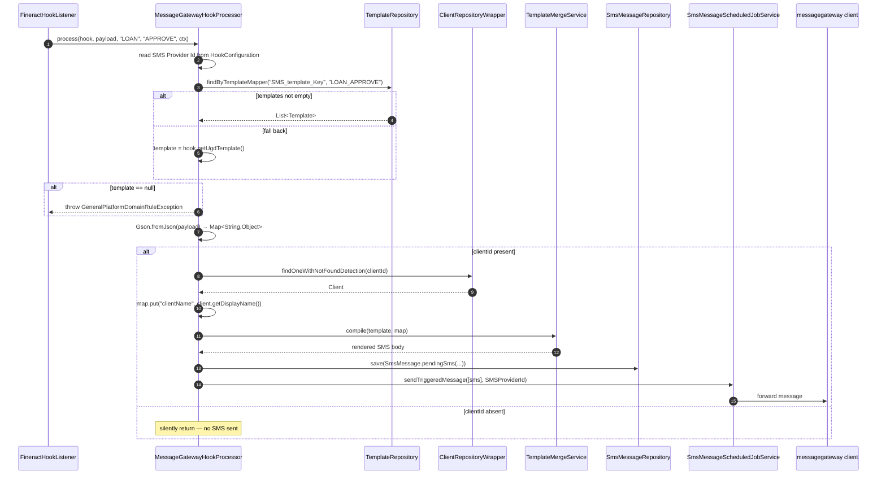

`MessageGatewayHookProcessor` is the Apache Fineract hooks transport for the `Message Gateway` template (`m_hook_templates.id = 4`). Unlike the other three processors, it does **not** open an outbound HTTP connection itself. Instead it looks up a Mustache template, renders an SMS body from the event payload, persists a `PENDING` row in `m_sms_messages`, and hands a `Collection<SmsMessage>` to `SmsMessageScheduledJobService.sendTriggeredMessage(...)` together with the configured `SMS Provider Id`. From there, the in-process messagegateway client (configured at deployment time to talk to the [`fineract-messagegateway`](https://github.com/openMF/fineract-messagegateway) service) does the actual carrier-side work.

This page documents the processor; see [hooks/twilio-hook](/hooks/twilio-hook) for the alternative SMS path, [hooks/template-engine](/hooks/template-engine) for Mustache rendering, and [hooks/hook-processors](/hooks/hook-processors) for the dispatch contract.

## Where it lives

| File                                                                  | Role                                                     |
| --------------------------------------------------------------------- | -------------------------------------------------------- |
| `infrastructure/hooks/processor/MessageGatewayHookProcessor.java`     | `@Service("messageGatewayHookProcessor")`.               |
| `infrastructure/hooks/api/HookApiConstants.java`                      | `httpSMSTemplateName = "Message Gateway"`, `SMSProviderIdParamName = "SMS Provider Id"`. |
| `infrastructure/sms/domain/SmsMessage.java`                           | The `m_sms_messages` JPA entity (`pendingSms(...)` factory). |
| `infrastructure/sms/scheduler/SmsMessageScheduledJobService.java`     | The in-process dispatcher (`sendTriggeredMessage`).      |
| `template/domain/TemplateRepository.java`                             | `findByTemplateMapper("SMS_template_Key", entity_action)`. |
| `template/service/TemplateMergeService.java`                          | Mustache compilation (see [template-engine](/hooks/template-engine)). |
| `m_hook_templates` row id `4` (`name = 'Message Gateway'`)            | Seeded by Liquibase changeset 18.                       |
| `m_hook_schema` row id `11`                                           | Schema seed: `SMS Provider Id` (required).               |

## Source

```java
// fineract-provider/.../infrastructure/hooks/processor/MessageGatewayHookProcessor.java
@Service
@Slf4j
@RequiredArgsConstructor
public class MessageGatewayHookProcessor implements HookProcessor {

    private final ClientRepositoryWrapper clientRepository;
    private final TemplateRepository templateRepository;
    private final TemplateMergeService templateMergeService;

    private final SmsMessageRepository smsMessageRepository;
    private final SmsMessageScheduledJobService smsMessageScheduledJobService;

    @Override
    public void process(final Hook hook, final String payload, final String entityName,
                        final String actionName, final FineractContext context) throws IOException {

        final Set<HookConfiguration> config = hook.getConfig();

        Integer SMSProviderId = null;
        for (final HookConfiguration conf : config) {
            if (conf.getFieldName().equals(SMSProviderIdParamName)) {
                SMSProviderId = Integer.parseInt(conf.getFieldValue());
            }
        }

        String templateName = entityName + "_" + actionName;

        // 1 : find template via mapper using entity and action
        Template template;
        List<Template> templates =
                templateRepository.findByTemplateMapper("SMS_template_Key", templateName);
        if (templates.isEmpty()) {
            // load default template if set
            template = hook.getUgdTemplate();
        } else {
            template = templates.get(0);
        }
        if (template == null) {
            log.error("Error : {} with name {}", "Template not found", templateName);
            throw new GeneralPlatformDomainRuleException(
                    "error.msg.templates.not.found", "Template not found", templateName);
        }

        // 2.2 : cook up scope map
        Type type = new TypeToken<Map<String, String>>(){}.getType();
        Map<String, Object> reqMap = new Gson().fromJson(payload, type);
        if (reqMap.get("clientId") != null) {
            Long clientId = (Long) reqMap.get("clientId");
            Client client = clientRepository.findOneWithNotFoundDetection(clientId);
            reqMap.put("clientName", client.getDisplayName());

            // 3 : compile template using Mustache
            String smsText = templateMergeService.compile(template, reqMap);

            // 4 : send message
            SmsMessage smsMessage = SmsMessage.pendingSms(
                    null, null, client, null, smsText, client.mobileNo(), null, false);
            smsMessageRepository.save(smsMessage);
            smsMessageScheduledJobService.sendTriggeredMessage(
                    Collections.singleton(smsMessage), SMSProviderId);
        }
    }
}
```

## Configuration

| `m_hook_schema.field_name` | Constant                       | Required | Notes                                                       |
| -------------------------- | ------------------------------ | -------- | ------------------------------------------------------------ |
| `SMS Provider Id`          | `SMSProviderIdParamName`       | yes      | `Integer.parseInt(conf.getFieldValue())` — the provider id understood by `SmsMessageScheduledJobService`. |

The processor only reads one configuration field. Everything else — Twilio credentials, sender numbers, gateway URLs — lives inside the `fineract-messagegateway` service and is referenced by id here.

`hook.getUgdTemplate()` (i.e. the optional `ugd_template_id` link on `m_hook`) acts as the **default template** used when no mapper-bound template is found.

## Template resolution

The processor uses a two-step lookup so that operators can map a specific `entity_action` to a dedicated template **without** changing the hook row:

```java
String templateName = entityName + "_" + actionName;          // e.g. "LOAN_APPROVE"
List<Template> templates = templateRepository
        .findByTemplateMapper("SMS_template_Key", templateName);
template = templates.isEmpty() ? hook.getUgdTemplate() : templates.get(0);
```

The mechanism relies on the [Template mappers](/hooks/template-engine) feature: each `Template` row in `m_template` has an associated set of `(mapperkey, mappervalue)` pairs (`m_template_m_templatemappers` join). For SMS templates, the operator seeds rows with `mapperkey = "SMS_template_Key"` and `mappervalue = "LOAN_APPROVE"` (etc.) and the processor picks them up.

| Step | Outcome                                  | Behaviour                                                       |
| ---- | ----------------------------------------- | --------------------------------------------------------------- |
| 1    | Found a `Template` via mapper             | Use it.                                                         |
| 2    | No mapper match, `hook.ugdTemplate` set   | Use the hook's default template.                                |
| 3    | No mapper match, no default               | Throw `GeneralPlatformDomainRuleException("error.msg.templates.not.found", ...)` — caught by listener. |

Because the listener swallows the exception, a misconfigured hook produces an `ERROR`-level log line but does not affect the original command. The relevant log keys are `Template not found` and the constructed `templateName`.

## Required payload shape

The processor is **client-centric**:

```java
if (reqMap.get("clientId") != null) {
    Long clientId = (Long) reqMap.get("clientId");
    Client client = clientRepository.findOneWithNotFoundDetection(clientId);
    reqMap.put("clientName", client.getDisplayName());
    ...
}
```

If the deserialised `Map<String, Object>` lacks `clientId`, the processor silently returns. `SynchronousCommandProcessingService.publishHookEvent` lifts `clientId` from the `CommandProcessingResult` whenever it is set, so any client- or loan-scoped command will satisfy this; pure office-level or system commands will not.

The processor enriches the scope with one extra key:

| Key in scope    | Source                                                | Available in template as |
| --------------- | ------------------------------------------------------ | ------------------------ |
| `clientName`    | `client.getDisplayName()`                              | `{{clientName}}`         |
| `clientId`      | from payload                                           | `{{clientId}}`           |
| all other keys  | original payload (`entityName`, `actionName`, `request`, `response`, ...) | `{{response.resourceId}}` etc. |

Note that `BASE_URI` is **not** injected here, unlike in [twilio-hook](/hooks/twilio-hook). UGD templates intended for the Message Gateway path should avoid mapper URLs that rely on `BASE_URI`.

## Dispatch — `pendingSms` + `sendTriggeredMessage`

The processor never speaks HTTP. Instead:

```java
SmsMessage smsMessage = SmsMessage.pendingSms(
        null,                  // externalId
        null,                  // Group
        client,                // Client
        null,                  // Staff
        smsText,               // rendered body
        client.mobileNo(),     // recipient
        null,                  // SmsCampaign
        false);                // notification
smsMessageRepository.save(smsMessage);
smsMessageScheduledJobService.sendTriggeredMessage(
        Collections.singleton(smsMessage), SMSProviderId);
```

`SmsMessage.pendingSms(...)` is a factory on the SMS module that returns a row in status `SmsMessageStatusType.PENDING`. After `save(...)`, the row lives in `m_sms_messages` and is visible through the `/v1/sms` API. `sendTriggeredMessage(Collection<SmsMessage>, long providerId)` hands the batch (here just one) to the messagegateway client component, which serialises and forwards them; on success the row's status moves to `WAITING_FOR_DELIVERY_REPORT` and eventually `DELIVERED` (via callback). On failure, it transitions to `FAILED` and the row stays in the table.

### Why persist before dispatching?

Two reasons:

1. **Durability.** Even if the messagegateway integration is down or `sendTriggeredMessage` throws, the SMS body has been written to disk inside the same hook-thread `try/catch`. An operator can replay from `m_sms_messages` instead of from the original `HookEvent` (which is in-memory only).
2. **Status reporting.** The `/v1/sms` REST surface and the SMS campaign reports operate on `m_sms_messages`, not on hook history. Persisting the row makes the SMS visible there.

This is the main behavioural difference from [TwilioHookProcessor](/hooks/twilio-hook), which never writes anything to disk and so has no replay surface.

## Dispatch flow



## Why use this instead of the SMS Bridge

| Concern                | `Message Gateway`                                | `SMS Bridge` (Twilio)                                  |
| ---------------------- | ------------------------------------------------ | ------------------------------------------------------- |
| Transport              | In-process; messagegateway client owns network  | HTTP `POST` per event via Retrofit                      |
| Persistence            | Writes `m_sms_messages` row before dispatch     | None — fire and forget                                  |
| Visibility             | `/v1/sms` lists messages and their statuses     | Only relay-side logs                                    |
| Status / delivery report | Yes (status transitions on callback)           | No                                                      |
| Provider configuration | Lives in messagegateway service, referenced by `SMS Provider Id` | Lives in `m_hook_configuration` on every hook |
| Template lookup        | Mapper-based with UGD fallback                  | Hook-attached UGD template only                         |
| Required dependency    | messagegateway service or compatible bean       | A Twilio-compatible HTTP relay                          |
| Best for               | Production deployments needing audit + reporting | Simple integrations / dev environments                  |

If you already operate the messagegateway service, the Message Gateway hook is almost always the better choice.

## Failure modes

| Symptom                                            | Likely cause                                                                            | Where to look                                                |
| -------------------------------------------------- | --------------------------------------------------------------------------------------- | ------------------------------------------------------------ |
| `error.msg.templates.not.found` ERROR              | No `m_template_m_templatemappers` row for `SMS_template_Key = <entity>_<action>` and `hook.ugd_template_id` is null. | Listener logs; `m_template_m_templatemappers` table.   |
| SMS row appears in `m_sms_messages` but never sends | `sendTriggeredMessage` queued it but the messagegateway integration is misconfigured or down. | SMS status column; messagegateway service logs.        |
| Hook fires but no SMS row created                  | Payload has no `clientId`.                                                              | `m_sms_messages`; event payload.                             |
| `NumberFormatException` on `Integer.parseInt`      | `SMS Provider Id` field value is not an integer.                                        | `m_hook_configuration`.                                      |
| Template renders literal `{{var}}` placeholders    | Scope map doesn't include the variable; check the payload + `clientName` enrichment.    | [Template engine](/hooks/template-engine).                   |
| `ClientNotFoundException`                          | The client referenced by `clientId` was deleted before the event was processed.         | Listener logs.                                                |

## Authoring SMS templates for this processor

A typical SMS template for a `LOAN|APPROVE` hook might look like this:

```mustache
Dear {{clientName}}, your loan #{{response.resourceId}} for {{request.principal}}
{{request.currencyCode}} has been approved on {{static.now}}. Reply STOP to opt out.
```

Authoring rules specific to this processor:

| Rule                                       | Why                                                                                              |
| ------------------------------------------ | ------------------------------------------------------------------------------------------------- |
| Use `{{clientName}}` for the client name.  | The processor injects this key explicitly. Going through `{{request.clientId}}` would only print the id. |
| Don't rely on `{{BASE_URI}}`.              | The processor does **not** set it (unlike the Twilio processor). Use absolute URLs in mappers.   |
| Add a mapper row `mapperkey = "SMS_template_Key", mappervalue = "<ENTITY>_<ACTION>"`. | This is what `findByTemplateMapper` matches at dispatch time. |
| Keep the body short.                       | The persisted `SmsMessage.message` column has provider-side length caps; long bodies get split.  |
| Don't emit HTML.                           | Unlike the Twilio processor, this processor does **not** strip `<p>` / `</p>` from the rendered body. |

Operators commonly seed several templates that share the same body but route differently via their mappers — e.g. one template each for `LOAN_APPROVE`, `LOAN_DISBURSE` and `LOAN_REPAYMENT`. Because `findByTemplateMapper` is a JPQL `left join`, a single `Template` can also have multiple mapper rows and serve several routes.

## Caching, eviction and reload

The processor itself is stateless. Two caches are worth keeping in mind:

- The **`hooks` cache** (`HookReadPlatformServiceImpl.retrieveHooksByEvent`, `@Cacheable("hooks", ...)`) is per-tenant. `HOOK|CREATE/UPDATE/DELETE` evicts it. After enabling or disabling a Message Gateway hook, the next event will be dispatched correctly.
- **Templates are not cached.** Every dispatch calls `findByTemplateMapper(...)` and reads the row fresh from the database. Updating a template's `text` therefore takes effect immediately on the next event — no restart required. This is the inverse of the hooks cache.

## Cross-references

- [Hooks overview](/hooks/overview) — system map and payload schema.
- [Hook processors](/hooks/hook-processors) — the `HookProcessor` SPI.
- [Twilio hook](/hooks/twilio-hook) — the HTTP-based SMS alternative.
- [Template engine](/hooks/template-engine) — `TemplateMergeService.compile`, mappers, scope expansion.
- [Hook domain](/hooks/hook-domain) — `m_hook_schema` row for the `SMS Provider Id` field.
- [Hooks & messaging APIs](/api/hooks) — REST CRUD shapes.
- [Commands framework](/command/overview) — origin of the event payload and the `clientId`.
- [Core hooks contracts](/core/hooks) — `HookEvent`, `HookEventSource`.
