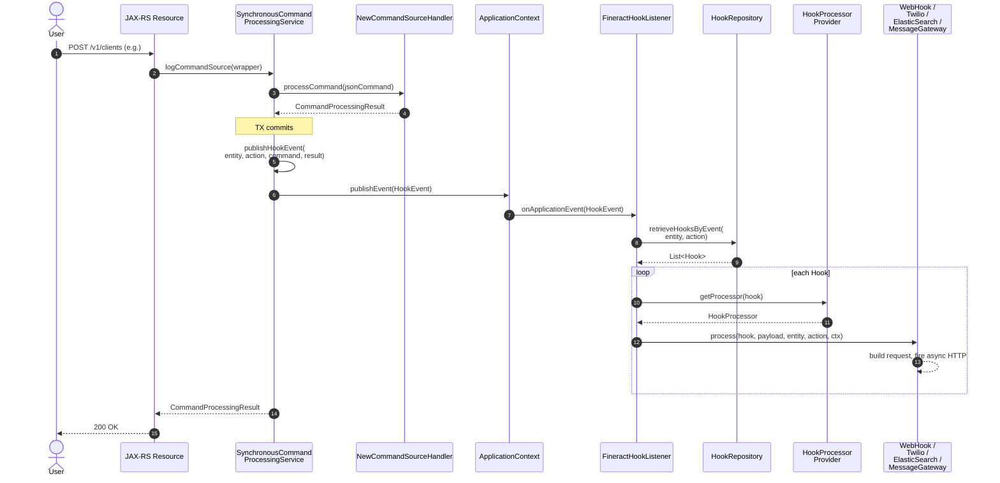
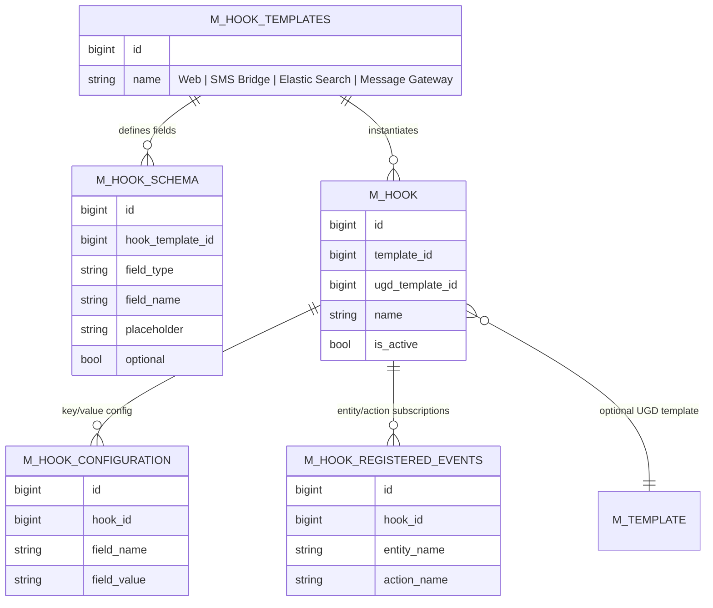

The **hooks subsystem** is how Apache Fineract turns successful command executions into outbound notifications. Every time the [synchronous command processing service](/command/overview) finishes a write command, it serialises the request + response, wraps it in a Spring `HookEvent`, and publishes it to the application context. The `FineractHookListener` in `fineract-provider` picks up that event, looks up the database for any `Hook` rows registered against the matching `(entityName, actionName)` pair, and routes each one to a `HookProcessor` chosen by the hook's template name. That processor speaks the wire protocol of the downstream system — a generic webhook (`Web`), an Elasticsearch index (`Elastic Search`), the Twilio SMS bridge (`SMS Bridge`), or the [fineract-messagegateway](https://github.com/openMF/community-app/wiki/Messaging-Gateway) service (`Message Gateway`).

This page is the system map. For per-entity reference see [hook-domain](/hooks/hook-domain), for the processor selection contract see [hook-processors](/hooks/hook-processors), and for each transport see [web-hook](/hooks/web-hook), [elasticsearch-hook](/hooks/elasticsearch-hook), [twilio-hook](/hooks/twilio-hook), and [message-gateway-hook](/hooks/message-gateway-hook). The Mustache rendering used by the SMS-flavoured processors is documented in [template-engine](/hooks/template-engine).

<Note>
Hooks are **fire-and-forget** and happen **after** the JPA transaction commits. A failing webhook never rolls back the command that produced it — failures are logged and the command result is still returned to the API caller. If you need synchronous, in-process side effects, use the [business event bus](/events/business-events) instead.
</Note>

## Where the code lives

| Path                                                                            | Module            | Purpose                                                  |
| ------------------------------------------------------------------------------- | ----------------- | -------------------------------------------------------- |
| `infrastructure/hooks/event/HookEvent.java`                                     | fineract-core     | Spring `ApplicationEvent` carrying serialised payload    |
| `infrastructure/hooks/event/HookEventSource.java`                               | fineract-core     | `(entityName, actionName)` key that drives matching      |
| `commands/service/SynchronousCommandProcessingService.java#publishHookEvent`    | fineract-core     | Publishes the event after each successful command        |
| `infrastructure/hooks/listener/FineractHookListener.java`                       | fineract-provider | Resolves and invokes processors for each registered hook |
| `infrastructure/hooks/processor/HookProcessorProvider.java`                     | fineract-provider | Selects the processor bean from `hook.template.name`     |
| `infrastructure/hooks/processor/*HookProcessor.java`                            | fineract-provider | Per-template transport implementations                   |
| `infrastructure/hooks/domain/Hook.java`                                         | fineract-provider | JPA entity — the hook subscription                       |
| `infrastructure/hooks/api/HookApiResource.java`                                 | fineract-provider | REST CRUD at `/v1/hooks`                                 |
| `infrastructure/hooks/service/HookReadPlatformServiceImpl.java`                 | fineract-provider | Cached lookup `findAllHooksListeningToEvent`             |
| `infrastructure/hooks/serialization/HookCommandFromApiJsonDeserializer.java`    | fineract-provider | JSON validation on create/update                         |
| `infrastructure/hooks/handler/CreateHookCommandHandler.java`                    | fineract-provider | Maker-checker command handler (`HOOK|CREATE` etc.)       |

The four canonical template names are constants on `HookApiConstants`:

```java
// fineract-provider/.../infrastructure/hooks/api/HookApiConstants.java
public static final String webTemplateName           = "Web";
public static final String elasticSearchTemplateName = "Elastic Search";
public static final String httpSMSTemplateName       = "Message Gateway";
public static final String smsTemplateName           = "SMS Bridge";
```

These values are also seeded as rows in `m_hook_templates` (ids `1..4`) by the initial Liquibase changelog `0002_initial_data.xml`.

## End-to-end flow



The crucial property is that step 6 (`publishHookEvent`) happens **after** the handler returns and the JPA transaction commits. The listener uses Spring's default synchronous dispatch on the publishing thread, but every processor does its real I/O through Retrofit's `Call.enqueue(...)` so the user thread is not blocked by a slow downstream.

## The HookEvent contract

`HookEvent` extends Fineract's base `FineractEvent` (a `Serializable` `ApplicationEvent`). The source is always a `HookEventSource`:

```java
// fineract-core/.../infrastructure/hooks/event/HookEvent.java
@Getter
public class HookEvent extends FineractEvent {
    private final String payload;
    private final AppUser appUser;

    public HookEvent(final HookEventSource source, final String payload,
                     final AppUser appUser, FineractContext fineractContext) {
        super(source, fineractContext);
        this.payload = payload;
        this.appUser = appUser;
    }
}
```

```java
// fineract-core/.../infrastructure/hooks/event/HookEventSource.java
@RequiredArgsConstructor
@Getter
public class HookEventSource implements Serializable {
    private final String entityName;
    private final String actionName;
}
```

`payload` is a Gson-serialised JSON object assembled by `SynchronousCommandProcessingService.publishHookEvent(...)`. It always contains these top-level keys:

| Key                | Source                                                |
| ------------------ | ----------------------------------------------------- |
| `entityName`       | from the `CommandWrapper`                             |
| `actionName`       | from the `CommandWrapper`                             |
| `createdBy`        | `context.authenticatedUser().getId()`                 |
| `createdByName`    | `context.authenticatedUser().getUsername()`           |
| `createdByFullName`| `context.authenticatedUser().getDisplayName()`        |
| `request`          | parsed `command.json()` as `Map<String, Object>`      |
| `response`         | the `CommandProcessingResult` (or error map)          |
| `officeId`         | lifted to the top level for routing convenience       |
| `clientId`         | lifted to the top level for routing convenience       |
| `timestamp`        | `Instant.now().toString()`                            |
| `status`           | `"Exception"` only on error events                    |

On exception paths (when the command handler throws) the same publisher emits the event with `response` populated from an `ErrorInfo` and `status = "Exception"` — see `publishHookEvent` in `SynchronousCommandProcessingService`.

## How a hook is matched

`FineractHookListener.onApplicationEvent` is the single dispatch point:

```java
// fineract-provider/.../infrastructure/hooks/listener/FineractHookListener.java
public void onApplicationEvent(final HookEvent event) {
    try {
        ThreadLocalContextUtil.init(event.getContext());

        final HookEventSource hookEventSource = (HookEventSource) event.getSource();
        final List<Hook> hooks = hookReadPlatformService
                .retrieveHooksByEvent(hookEventSource.getEntityName(),
                                      hookEventSource.getActionName());

        for (final Hook hook : hooks) {
            final HookProcessor processor = hookProcessorProvider.getProcessor(hook);
            try {
                processor.process(hook, payload, entityName, actionName, fineractContext);
            } catch (Throwable e) {
                log.error("Hook {} failed in HookProcessor {} ... payload {}",
                          hook.getId(), processor.getClass().getSimpleName(),
                          ..., payload, e);
            }
        }
    } finally {
        ThreadLocalContextUtil.reset();
    }
}
```

Three things are worth noting:

1. The listener **re-initialises the `ThreadLocalContextUtil`** from the event's captured `FineractContext` before invoking any processor and resets it in `finally`. This is what lets a processor running on the publisher thread still see the correct tenant id, business date and auth token.
2. Every processor call is wrapped in `try { ... } catch (Throwable e) { log }`. A failing processor cannot stop later hooks for the same event and cannot propagate back into the command flow.
3. Lookup goes through `HookReadPlatformService.retrieveHooksByEvent`, which is cached:
   ```java
   @Cacheable(value = "hooks",
       key = "T(...ThreadLocalContextUtil).getTenant().getTenantIdentifier().concat('HK')")
   public List<Hook> retrieveHooksByEvent(String entityName, String actionName)
   ```
   The cache is keyed per tenant; create/update/delete hook commands evict it via `@CacheEvict` on `HookWritePlatformServiceJpaRepositoryImpl`. The underlying JPQL only returns **active** hooks:
   ```java
   @Query("select hook from Hook hook inner join hook.events event "
        + "where event.entityName = :entityName "
        + "and event.actionName = :actionName "
        + "and hook.isActive = true")
   List<Hook> findAllHooksListeningToEvent(...);
   ```

## Processor selection

`HookProcessorProvider.getProcessor` is a hard-coded switch on `hook.template.name`. Adding a new transport means adding a constant, a Liquibase seed for `m_hook_templates`, a `@Service` bean implementing `HookProcessor`, and a branch here:

```java
// fineract-provider/.../infrastructure/hooks/processor/HookProcessorProvider.java
public HookProcessor getProcessor(final Hook hook) {
    final String templateName = hook.getTemplate().getName();
    if (templateName.equalsIgnoreCase(smsTemplateName)) {
        return ctx.getBean("twilioHookProcessor", TwilioHookProcessor.class);
    } else if (templateName.equals(webTemplateName)) {
        return ctx.getBean("webHookProcessor", WebHookProcessor.class);
    } else if (templateName.equals(elasticSearchTemplateName)) {
        return ctx.getBean("elasticSearchHookProcessor", ElasticSearchHookProcessor.class);
    } else if (templateName.equals(httpSMSTemplateName)) {
        return ctx.getBean("messageGatewayHookProcessor", MessageGatewayHookProcessor.class);
    }
    return null;
}
```

A `null` return value at this point will NPE inside the listener loop and be caught by its `catch (Throwable e)` — the event is logged and the remaining hooks are still attempted. This makes deleting or renaming a template a runtime hazard; the safe path is to disable the hook first (`isActive = false`).

## Data model snapshot



The four seed rows in `m_hook_templates` (ids 1-4) and their schemas in `m_hook_schema` are inserted in changeset 18/19 of `0002_initial_data.xml`. The schema rows are exposed through `HookApiResource#template` so the web UI can render a dynamic config form.

## REST surface

The REST resource at `/v1/hooks` is a thin wrapper around the command framework — all writes go through `PortfolioCommandSourceWritePlatformService` so they participate in maker-checker and audit logging. See [api/hooks-and-messaging-apis](/api/hooks-and-messaging-apis) for the full request/response shapes.

| Method | Path                  | Operation                  | Handler                       |
| ------ | --------------------- | -------------------------- | ----------------------------- |
| GET    | `/v1/hooks`           | list all hooks             | `HookApiResource#retrieveHooks` |
| GET    | `/v1/hooks/{id}`      | one hook (`?template=true`) | `HookApiResource#retrieveHook`  |
| GET    | `/v1/hooks/template`  | template data for UI form  | `HookApiResource#template`      |
| POST   | `/v1/hooks`           | create — emits `HOOK|CREATE` | `CreateHookCommandHandler`    |
| PUT    | `/v1/hooks/{id}`      | update — emits `HOOK|UPDATE` | `UpdateHookCommandHandler`    |
| DELETE | `/v1/hooks/{id}`      | delete — emits `HOOK|DELETE` | `DeleteHookCommandHandler`    |

All endpoints require the `HOOK_READ` or `HOOK_*` permission on `HOOK_RESOURCE_NAME = "HOOK"`.

## Delivery semantics

| Property                  | Behaviour                                                                |
| ------------------------- | ------------------------------------------------------------------------ |
| Ordering                  | Hooks for one event run sequentially in the order returned by JPA       |
| Retries                   | None — a failed Retrofit `Call` logs `onFailure` and is dropped         |
| Persistence of event      | No dead-letter queue or `m_hook_event_log` — events live only in memory |
| Transactionality          | Post-commit; processor exceptions never roll back the command           |
| Concurrency               | Single-threaded per `HookEvent`; OkHttp async pool handles HTTP I/O     |
| Tenant isolation          | Listener restores `ThreadLocalContextUtil` from `event.getContext()`   |
| Auth propagation          | Twilio processor forwards `context.getAuthTokenContext()` as a header  |

If you need at-least-once delivery, durable retries, or a dead-letter topic, prefer the [external event](/events/external-events) bus (Kafka/JMS), not hooks.

## Cross-references

- [Hook domain entities](/hooks/hook-domain) — `Hook`, `HookConfiguration`, `HookResource`, `HookTemplate`, `Schema`.
- [Hook processor contract](/hooks/hook-processors) — the `HookProcessor` interface and the selection table.
- [WebHookProcessor](/hooks/web-hook) — generic `POST` over OkHttp/Retrofit.
- [ElasticSearchHookProcessor](/hooks/elasticsearch-hook) — index-aware variant of the web processor.
- [TwilioHookProcessor](/hooks/twilio-hook) — SMS bridge with API-key bootstrap.
- [MessageGatewayHookProcessor](/hooks/message-gateway-hook) — fineract-messagegateway integration.
- [Template engine](/hooks/template-engine) — Mustache rendering of UGD templates that hooks attach via `ugd_template_id`.
- Core: [Hooks core contracts](/core/hooks), [Commands framework](/command/overview), [Business events](/events/business-events).
- API: [Hooks & messaging APIs](/api/hooks-and-messaging-apis).
