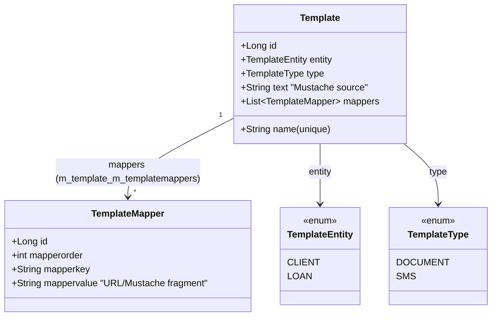
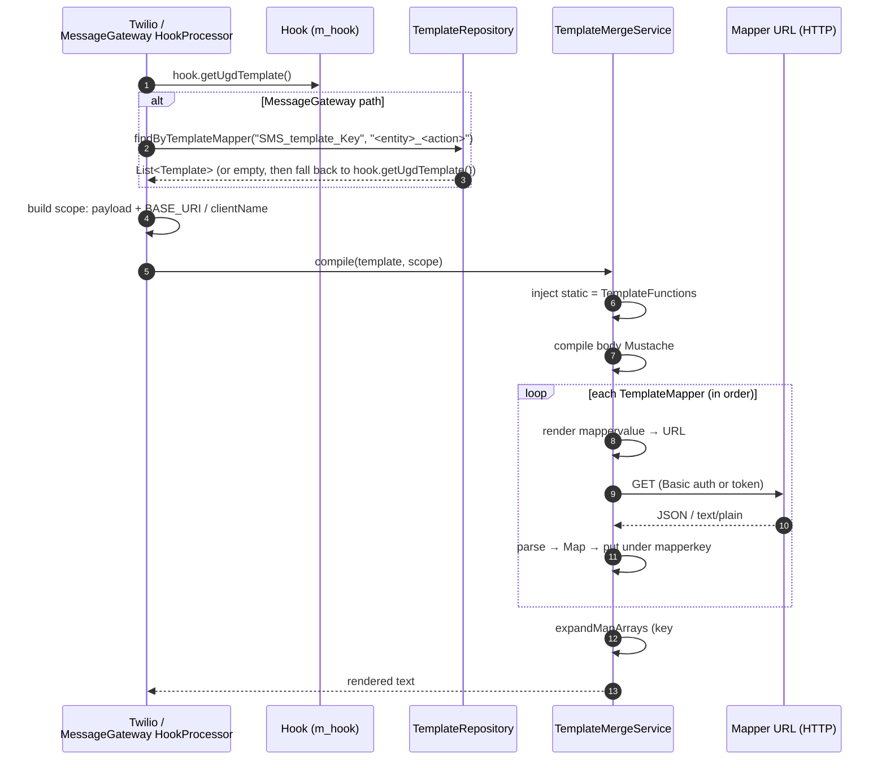

The **template engine** in Apache Fineract powers what the codebase calls *User Generated Documents* (UGD): operator-authored Mustache templates that are stored in `m_template`, optionally pull additional data from secondary HTTP endpoints via *mappers*, and are compiled at runtime by `TemplateMergeService` into a string. Hooks attach to these templates via `Hook.ugd_template_id` — both [TwilioHookProcessor](/hooks/twilio-hook) and [MessageGatewayHookProcessor](/hooks/message-gateway-hook) call `TemplateMergeService.compile(template, scope)` to produce SMS bodies. The same engine also serves the `/v1/templates` REST surface, which user-facing apps invoke directly to render arbitrary documents.

This page is a reference for the engine itself; for how each hook processor invokes it see the per-processor pages.

## Where it lives

| File                                                              | Module            | Role                                                            |
| ----------------------------------------------------------------- | ----------------- | --------------------------------------------------------------- |
| `template/domain/Template.java`                                   | fineract-provider | JPA entity `m_template` with mappers join to `m_templatemappers`. |
| `template/domain/TemplateEntity.java`                             | fineract-provider | `CLIENT(0)`, `LOAN(1)` binding for UI routing.                  |
| `template/domain/TemplateType.java`                               | fineract-provider | `DOCUMENT(0)`, `SMS(2)` (E-mail is reserved at id `1`).         |
| `template/domain/TemplateMapper.java`                             | fineract-provider | One `(order, key, value)` triple on `m_templatemappers`.        |
| `template/domain/TemplateRepository.java`                         | fineract-provider | JPA repo: `findByEntityAndType`, `findByTemplateMapper`.        |
| `template/domain/TemplateFunctions.java`                          | fineract-provider | Static helpers exposed to templates as `static`.                |
| `template/service/TemplateMergeService.java`                      | fineract-provider | The Mustache compile pipeline.                                  |
| `template/service/JpaTemplateDomainService.java`                  | fineract-provider | CRUD service behind the REST resource.                          |
| `template/api/TemplatesApiResource.java`                          | fineract-provider | JAX-RS at `/v1/templates`.                                      |
| `template/starter/TemplateConfiguration.java`                     | fineract-provider | Spring `@Configuration` exposing both services as `@Bean`.      |
| `infrastructure/core/config/FineractProperties$FineractTemplateProperties` | fineract-core | `regexWhitelistEnabled`, `regexWhitelist` for mapper URLs.   |

## Entity model



| Java class       | Table                          | Notes                                                                                |
| ---------------- | ------------------------------ | ------------------------------------------------------------------------------------ |
| `Template`       | `m_template`                   | Unique constraint on `name`. `text` is `longtext NOT NULL`.                          |
| `TemplateMapper` | `m_templatemappers`            | Joined through `m_template_m_templatemappers` (a unidirectional `OneToMany` from `Template`). |
| `TemplateEntity` | enum, stored as ordinal        | `CLIENT(0)` / `LOAN(1)` only; **enum order matters** because of `TemplateEntity.values()[entityId]` in the API. |
| `TemplateType`   | enum, stored as ordinal        | `DOCUMENT(0)`, `SMS(2)` — id `1` is reserved for E-mail (not yet implemented).      |

### `Template`

```java
// fineract-provider/.../template/domain/Template.java
@Entity
@Table(name = "m_template",
       uniqueConstraints = { @UniqueConstraint(columnNames = { "name" }, name = "unq_name") })
public class Template extends AbstractPersistableCustom<Long> {

    @Column(name = "name", nullable = false, unique = true)
    private String name;

    @Enumerated
    @JsonSerialize(using = TemplateEntitySerializer.class)
    private TemplateEntity entity;

    @Enumerated
    @JsonSerialize(using = TemplateTypeSerializer.class)
    private TemplateType type;

    @Column(name = "text", columnDefinition = "longtext", nullable = false)
    private String text;

    @OrderBy(value = "mapperorder")
    @OneToMany(targetEntity = TemplateMapper.class, cascade = CascadeType.ALL,
               fetch = FetchType.EAGER)
    @JoinTable(name = "m_template_m_templatemappers",
            joinColumns = { @JoinColumn(name = "m_template_id", referencedColumnName = "id") },
            inverseJoinColumns = { @JoinColumn(name = "mappers_id", referencedColumnName = "id", unique = true) })
    private List<TemplateMapper> mappers;
}
```

Two things are worth flagging:

1. The mappers are loaded **eagerly** and ordered by `mapperorder`. That order matters for cross-mapper dependencies (mapper #2 can reference a key produced by mapper #1).
2. `TemplateEntitySerializer` and `TemplateTypeSerializer` are Gson/Jackson serializers that render the enums as their string names, not ordinals — important for the REST API's user-facing payload.

`Template.fromJson(JsonCommand)` reads:

| API parameter | Use                                                                     |
| ------------- | ----------------------------------------------------------------------- |
| `name`        | The unique template name.                                               |
| `text`        | Mustache source.                                                        |
| `entity`      | `int`, indexed into `TemplateEntity.values()`.                          |
| `type`        | `int`, switched: `0 → DOCUMENT`, `2 → SMS` (no `default` clause — anything else yields `type = null`). |
| `mappers`     | JSON array of `{mappersorder, mapperskey, mappersvalue}` — note the slightly different key names from the entity fields (`mappersorder` vs `mapperorder`). |

### `TemplateMapper`

```java
// fineract-provider/.../template/domain/TemplateMapper.java
@Entity @Table(name = "m_templatemappers")
public class TemplateMapper extends AbstractPersistableCustom<Long> {
    @Column(name = "mapperorder") private int mapperorder;
    @Column(name = "mapperkey")   private String mapperkey;
    @Column(name = "mappervalue") private String mappervalue;
}
```

Two distinct uses overlap in this entity:

- **As a data source for `TemplateMergeService`**: `mappervalue` is itself a Mustache fragment that, once rendered against the current scope, produces a URL the engine fetches and JSON-parses.
- **As a lookup key for processors**: `MessageGatewayHookProcessor` calls `templateRepository.findByTemplateMapper("SMS_template_Key", entity + "_" + action)` — the mapper key/value pair is used purely as routing metadata, never fetched.

The `findByTemplateMapper` JPQL is a `left join` on `mappers`:

```java
// TemplateRepository
@Query("select t from Template as t left join t.mappers as m "
     + "where m.mapperkey = :mapperkey and m.mappervalue = :mappervalue")
List<Template> findByTemplateMapper(@Param("mapperkey") String mapperkey,
                                    @Param("mappervalue") String mappervalue);
```

## `TemplateMergeService.compile` — the rendering pipeline

```java
// fineract-provider/.../template/service/TemplateMergeService.java
public String compile(final Template template, final Map<String, Object> scopes) {
    scopes.put("static", new TemplateFunctions());

    final MustacheFactory mf = new DefaultMustacheFactory();
    final Mustache mustache = mf.compile(new StringReader(template.getText()),
                                         template.getName());

    getCompiledMapFromMappers(template.getMappersAsMap(), scopes);
    expandMapArrays(scopes);

    final StringWriter stringWriter = new StringWriter();
    mustache.execute(stringWriter, scopes);
    return stringWriter.toString();
}
```

In order:

1. **Inject `static`.** The scope gets a `TemplateFunctions` instance under the key `static`, so templates can write `{{static.now}}` (which formats the current `LocalDateTime` as `yyyy/MM/dd HH:mm`).
2. **Compile the body.** A fresh `DefaultMustacheFactory` compiles `template.getText()` into a `Mustache` AST.
3. **Resolve mappers.** `getCompiledMapFromMappers(template.getMappersAsMap(), scopes)` walks the ordered `(mapperkey, mappervalue)` pairs and for each:
   - Renders `mappervalue` itself as a Mustache against the current scope.
   - If the rendered string does not start with `http`, it is prefixed with `scopes.get("BASE_URI")` (callers — including hook processors — are responsible for putting `BASE_URI` into the scope).
   - HTTP-fetches that URL (see [Mapper URL fetching](#mapper-url-fetching) below).
   - Parses the response with Jackson; `text/plain` bodies are wrapped as `{ "src": "<body>" }`. JSON bodies become `Map<String, Object>`.
   - The result is added to the scope under `mapperkey`. So after `mapperkey = "client"`, the template can write `{{client.displayName}}`.
4. **Expand arrays.** `expandMapArrays(scopes)` walks the entire scope and, for every `Iterable` value, adds positional `key#0`, `key#1`, … entries so that templates can address array elements without `{{#section}}` loops. This is the engine's idiomatic way to support indexed access in Mustache.
5. **Render.** `mustache.execute(writer, scopes)` produces the final string.

## Mapper URL fetching

`TemplateMergeService.getConnection(String url)` is where the engine reaches outside the JVM. It enforces an optional URL allow-list and an authentication strategy:

```java
private HttpURLConnection getConnection(final String url) {
    if (fineractProperties.getTemplate() != null
            && fineractProperties.getTemplate().isRegexWhitelistEnabled()) {
        boolean whitelisted = false;
        for (String urlPattern : fineractProperties.getTemplate().getRegexWhitelist()) {
            if (Pattern.compile(urlPattern).matcher(url).matches()) {
                whitelisted = true; break;
            }
        }
        if (!whitelisted) {
            throw new TemplateForbiddenException(url);
        }
    }

    String authToken = ThreadLocalContextUtil.getAuthToken();
    if (authToken == null) {
        final String name = SecurityContextHolder.getContext().getAuthentication().getName();
        final String password = SecurityContextHolder.getContext().getAuthentication()
                .getCredentials().toString();
        Authenticator.setDefault(new Authenticator() { ... });
    }

    HttpURLConnection connection = (HttpURLConnection) new URL(url).openConnection();
    if (authToken != null) {
        connection.setRequestProperty("Authorization", "Basic " + authToken);
    }
    TrustModifier.relaxHostChecking(connection);
    connection.setDoInput(true);
    return connection;
}
```

| Behaviour                | Source                                                                                  |
| ------------------------ | --------------------------------------------------------------------------------------- |
| URL allow-list           | `fineract.template.regexWhitelistEnabled` + `fineract.template.regexWhitelist`.         |
| Forbidden URL            | Throws `TemplateForbiddenException`. (Surfaces as a 4xx through the global error mapper.) |
| Auth: token              | If `ThreadLocalContextUtil.getAuthToken()` is non-null (i.e. the request came with a token), set `Authorization: Basic <token>`. |
| Auth: fallback           | Otherwise pull the username/password from `SecurityContextHolder` and install a JVM-wide `Authenticator`. |
| TLS hostname check       | `TrustModifier.relaxHostChecking(connection)` — disabled.                               |
| Response parse           | `text/plain` → `{ "src": "<body>" }`; anything else → `ObjectMapper.readValue(...)`.    |

⚠️ The auth fallback installs a **JVM-wide default `Authenticator`** — this is a global side effect that survives the compile call. In a multi-tenant deployment with mixed auth contexts, prefer token-based auth (which uses a per-connection header) to avoid leaks.

⚠️ `TrustModifier.relaxHostChecking` disables hostname verification for mapper URLs. Use the allow-list to compensate.

## What is in the scope?

The scope (`Map<String, Object>`) is the second argument to `compile(...)`. Each caller assembles it differently:

| Caller                                                        | Scope contents                                                                                                          |
| ------------------------------------------------------------- | ----------------------------------------------------------------------------------------------------------------------- |
| `TwilioHookProcessor.processUgdTemplate`                      | Whole event payload (as `HashMap`) + `BASE_URI = System.getProperty("baseUrl")`. Requires `clientId`.                   |
| `MessageGatewayHookProcessor.process`                         | Whole event payload + `clientName = client.getDisplayName()`. **No `BASE_URI` is injected.**                            |
| `TemplatesApiResource.mergeTemplate` (POST `/v1/templates/{id}`) | All query parameters as scope keys (single-value as `String`, multi-value as `List`) + the request body parsed as JSON + `BASE_URI = uriInfo.getBaseUri()`. |

After `compile(...)` runs, the engine also adds keys for every mapper (under each `mapperkey`) and the `static` helper.

## Auto-added scope keys

| Key       | Type                | Provided by                                          |
| --------- | ------------------- | ---------------------------------------------------- |
| `static`  | `TemplateFunctions` | `compile()` itself.                                  |
| `<mapperkey>` | `Map<String, Object>` | Each mapper after resolution.                    |
| `<key>#0`, `<key>#1`, ... | `Object` per index | `expandMapArrays` for any iterable value. |

`TemplateFunctions` currently exposes just `now()`:

```java
// TemplateFunctions.java
public static String now() {
    return new DateTimeFormatterBuilder()
            .appendPattern("yyyy/MM/dd HH:mm").toFormatter()
            .format(DateUtils.getLocalDateTimeOfSystem());
}
```

So `{{static.now}}` in a template body resolves to the current server time.

## REST surface — `TemplatesApiResource`

The engine is also exposed via JAX-RS at `/v1/templates`. The endpoints are all routed through the command framework for writes and `JpaTemplateDomainService` for reads:

| Method | Path                              | Purpose                                                              | Backed by                               |
| ------ | --------------------------------- | -------------------------------------------------------------------- | --------------------------------------- |
| GET    | `/v1/templates`                   | List, optionally `?typeId=2&entityId=0`                              | `JpaTemplateDomainService.getAll` / `.getAllByEntityAndType` |
| GET    | `/v1/templates/template`          | "Template-of-templates" form data (entities + types)                 | `TemplateData.template()`               |
| POST   | `/v1/templates`                   | Create — emits `TEMPLATE|CREATE`                                     | `CreateTemplateCommandHandler`         |
| GET    | `/v1/templates/{id}`              | One template                                                         | `findOneById`                           |
| GET    | `/v1/templates/{id}/template`     | Combined `Template + entity/type metadata`                           | `TemplateData.template(t)`              |
| PUT    | `/v1/templates/{id}`              | Update — emits `TEMPLATE|UPDATE`                                     | `UpdateTemplateCommandHandler`         |
| DELETE | `/v1/templates/{id}`              | Delete — emits `TEMPLATE|DELETE`                                     | `DeleteTemplateCommandHandler`         |
| POST   | `/v1/templates/{id}`              | **Render** — returns `text/html` with the compiled body              | `TemplateMergeService.compile`         |

All endpoints require the `TEMPLATE_*` permission on `RESOURCE_NAME_FOR_PERMISSION = "TEMPLATE"`.

The `POST /v1/templates/{id}` render endpoint is the operator-facing equivalent of what `TwilioHookProcessor` does internally. The body is treated as the scope; query parameters are merged in; `BASE_URI` is set to `uriInfo.getBaseUri()`.

## Lifecycle and configuration

`TemplateConfiguration` exposes both services as `@Bean`s, guarded with `@ConditionalOnMissingBean` so downstream extensions can replace them:

```java
// fineract-provider/.../template/starter/TemplateConfiguration.java
@Configuration
public class TemplateConfiguration {

    @Bean
    @ConditionalOnMissingBean(TemplateDomainService.class)
    public TemplateDomainService templateDomainService(TemplateRepository r) {
        return new JpaTemplateDomainService(r);
    }

    @Bean
    @ConditionalOnMissingBean(TemplateMergeService.class)
    public TemplateMergeService templateMergeService(FineractProperties props) {
        return new TemplateMergeService(props);
    }
}
```

The two configuration properties that affect the engine at runtime:

| Property                                       | Default | Effect                                                                |
| ---------------------------------------------- | ------- | --------------------------------------------------------------------- |
| `fineract.template.regex-whitelist-enabled`    | `false` | Off by default — all mapper URLs are allowed.                         |
| `fineract.template.regex-whitelist`            | `[]`    | List of regex patterns; when the flag is on, a URL must match one.    |

## How hooks reach the engine



## Practical authoring tips

- **Always set `BASE_URI`** in the scope when authoring templates that use relative mapper URLs. `MessageGatewayHookProcessor` does not — its templates must use absolute URLs.
- **Mapper URLs are pre-rendered.** You can write `mappervalue = "/v1/clients/{{clientId}}"` and rely on the engine to interpolate from the payload before fetching.
- **`text/plain` responses are wrapped as `{src: "..."}`.** This is the engine's way of letting you `{{logo.src}}` images embedded into PDFs.
- **`static.now`** is the only built-in helper. Add to `TemplateFunctions` to expose more.
- **Don't share a `Template` across multiple SMS hooks unless the variables match.** Mustache silently emits the empty string for missing keys, but mappers will still try to fetch their URLs and may log errors.
- **Avoid the JVM-wide `Authenticator` path** by ensuring requests carry a Fineract auth token (the SMS hook processors do).
- **Mind the regex allow-list.** When `regexWhitelistEnabled` is on and your hook starts firing in production, mapper URLs that worked in dev (no allow-list) will start throwing `TemplateForbiddenException`.

## EntityType binding

`TemplateEntity` is the only place where the engine still hard-codes a `(CLIENT, LOAN)` taxonomy. It is used in two places:

1. The list endpoint `/v1/templates?typeId=<int>&entityId=<int>` calls `templateService.getAllByEntityAndType(TemplateEntity.values()[entityId], TemplateType.values()[typeId])` — so any change to the enum order is a **breaking** API change.
2. The web UI uses the `entity` column to decide which templates to surface on which screen (client tab vs loan tab).

Neither hook processor inspects `Template.entity` or `Template.type` — they both call `compile(...)` directly with whatever `Template` they have resolved. So as far as hooks are concerned, the entity/type fields are advisory only.

## Failure modes

| Symptom                                                | Likely cause                                                                       |
| ------------------------------------------------------ | ----------------------------------------------------------------------------------- |
| `TemplateForbiddenException` for a mapper URL          | `regexWhitelistEnabled = true` and the URL doesn't match any pattern.              |
| `TemplateNotFoundException` (404)                      | `findOneById` couldn't find the row.                                                |
| Mapper output is `null` / empty                         | The fetch failed; check `getCompiledMapFromMappers() failed` log.                  |
| `{{var}}` appears literally in the rendered text       | The scope didn't contain `var`. Mustache emits empty for missing keys.              |
| `<p>...</p>` wraps every SMS body                       | The UGD editor wrote HTML; both SMS processors strip top-level paragraph tags.     |
| Auth leakage between requests                          | The JVM-wide `Authenticator.setDefault(...)` fallback is in use; switch to tokens. |
| Non-deterministic mapper order                         | `mapperorder` is wrong; `@OrderBy` on `Template.mappers` only sorts what you save. |

## Cross-references

- [Hooks overview](/hooks/overview) — where templates plug into the dispatch flow.
- [Hook processors](/hooks/hook-processors) — `HookProcessor` SPI used by the SMS templates.
- [Twilio hook](/hooks/twilio-hook) — calls `compile(hook.getUgdTemplate(), payload + BASE_URI)`.
- [Message Gateway hook](/hooks/message-gateway-hook) — mapper-based template lookup.
- [Hook domain](/hooks/hook-domain) — `Hook.ugdTemplate` link.
- [Core hooks contracts](/core/hooks) — the upstream `HookEvent`.
- [Commands framework](/command/overview) — where event payloads originate.
- [Hooks & messaging APIs](/api/hooks-and-messaging-apis) — `/v1/templates` REST shape.
