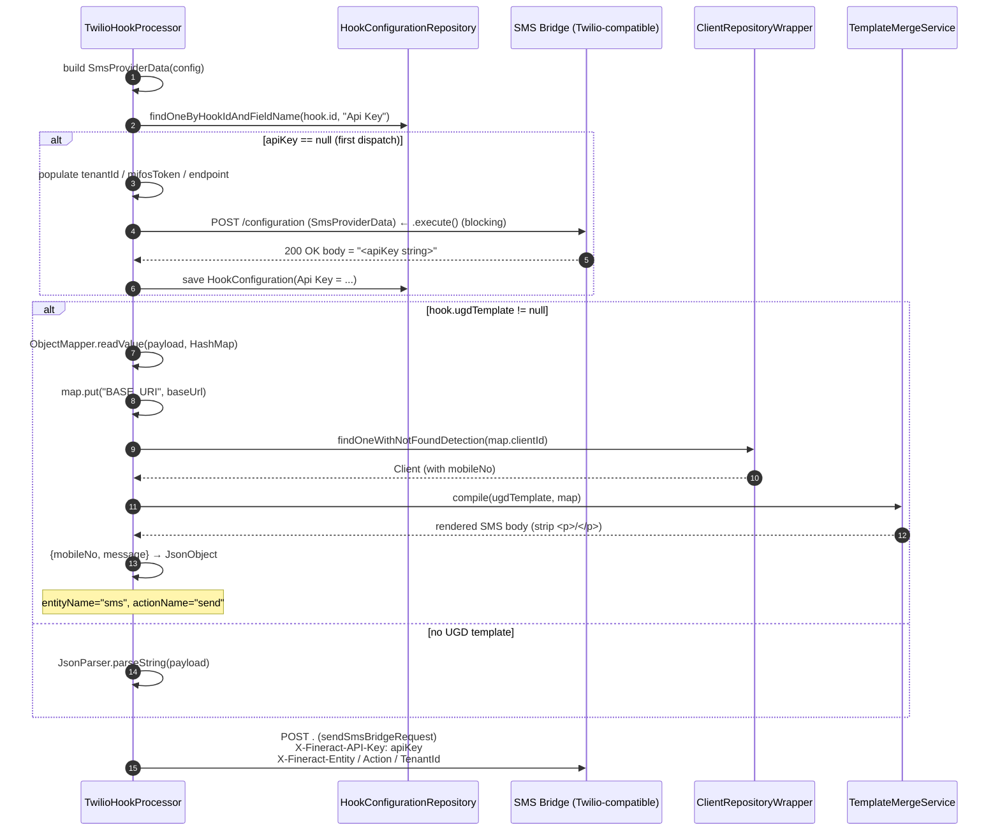

`TwilioHookProcessor` is the Apache Fineract hooks transport for the **SMS Bridge** template (`m_hook_templates.id = 2`, `name = 'SMS Bridge'`). It talks to a Twilio-compatible relay service — historically the `mifos-sms` / Twilio bridge — that owns the actual carrier credentials. The processor's job is to (1) bootstrap a relay-issued API key on the first dispatch by `POST`-ing the configured SMS provider credentials at `/configuration`, (2) optionally render an SMS body from a UGD Mustache template tied to the hook, and (3) `POST` the JSON to the relay's main endpoint with `X-Fineract-API-Key`.

For the broader picture see [hooks/overview](/hooks/overview) and [hooks/hook-processors](/hooks/hook-processors); the Mustache rendering used by `processUgdTemplate` is documented in [hooks/template-engine](/hooks/template-engine).

## Where it lives

| File                                                                  | Role                                                |
| --------------------------------------------------------------------- | --------------------------------------------------- |
| `infrastructure/hooks/processor/TwilioHookProcessor.java`             | `@Service("twilioHookProcessor")`.                  |
| `infrastructure/hooks/processor/data/SmsProviderData.java`            | Value object collecting all SMS config fields.      |
| `infrastructure/hooks/processor/WebHookService.java`                  | Retrofit interface (`sendSmsBridgeRequest`, `sendSmsBridgeConfigRequest`). |
| `infrastructure/hooks/processor/ProcessorHelper.java`                 | OkHttp + Retrofit construction.                    |
| `infrastructure/hooks/domain/HookConfigurationRepository.java`        | `findOneByHookIdAndFieldName(...)` used for `Api Key`. |
| `m_hook_templates` row id `2` (`name = 'SMS Bridge'`)                 | Seeded by Liquibase changeset 18.                  |
| `m_hook_schema` rows id `3..7`                                        | Fields: `Payload URL`, `SMS Provider`, `Phone Number`, `SMS Provider Token`, `SMS Provider Account Id`. |

The selection branch in `HookProcessorProvider`:

```java
if (templateName.equalsIgnoreCase(smsTemplateName)) {
    processor = ctx.getBean("twilioHookProcessor", TwilioHookProcessor.class);
}
```

Note the `equalsIgnoreCase` — only the SMS Bridge branch is case-insensitive.

## Source

```java
// fineract-provider/.../infrastructure/hooks/processor/TwilioHookProcessor.java
@Service
@RequiredArgsConstructor
public class TwilioHookProcessor implements HookProcessor {

    private final HookConfigurationRepository hookConfigurationRepository;
    private final TemplateMergeService templateMergeService;
    private final ClientRepositoryWrapper clientRepositoryWrapper;
    private final ProcessorHelper processorHelper;

    @Override
    public void process(final Hook hook, final String payload, final String entityName,
                        final String actionName, final FineractContext context) throws IOException {

        final SmsProviderData smsProviderData = new SmsProviderData(hook.getConfig());
        sendRequest(smsProviderData, payload, entityName, actionName, hook, context);
    }

    private void sendRequest(final SmsProviderData smsProviderData, final String payload,
                             String entityName, String actionName,
                             final Hook hook, final FineractContext context) throws IOException {

        final WebHookService service = processorHelper.createWebHookService(smsProviderData.getUrl());
        final Callback callback = processorHelper.createCallback(smsProviderData.getUrl());

        String apiKey = hookConfigurationRepository.findOneByHookIdAndFieldName(hook.getId(), apiKeyName);
        if (apiKey == null) {
            smsProviderData.setUrl(null);
            smsProviderData.setEndpoint(System.getProperty("baseUrl"));
            smsProviderData.setTenantId(context.getTenantContext().getTenantIdentifier());
            smsProviderData.setMifosToken(context.getAuthTokenContext());
            apiKey = service.sendSmsBridgeConfigRequest(smsProviderData).execute().body();
            final HookConfiguration apiKeyEntry =
                    HookConfiguration.createNew(hook, "string", apiKeyName, apiKey);
            hookConfigurationRepository.save(apiKeyEntry);
        }

        if (apiKey != null && !apiKey.equals("")) {
            JsonObject json;
            if (hook.getUgdTemplate() != null) {
                entityName = "sms";
                actionName = "send";
                json = processUgdTemplate(payload, hook);
                if (json == null) { return; }
            } else {
                json = JsonParser.parseString(payload).getAsJsonObject();
            }
            service.sendSmsBridgeRequest(entityName, actionName,
                    context.getTenantContext().getTenantIdentifier(), apiKey, json)
                    .enqueue(callback);
        }
    }

    private JsonObject processUgdTemplate(final String payload, final Hook hook) throws IOException {
        JsonObject json = null;
        final HashMap<String, Object> map =
                new ObjectMapper().readValue(payload, HashMap.class);
        map.put("BASE_URI", System.getProperty("baseUrl"));
        if (map.containsKey("clientId")) {
            final Long clientId = Long.valueOf(Integer.toString((int) map.get("clientId")));
            final Client client = clientRepositoryWrapper.findOneWithNotFoundDetection(clientId);
            final String mobileNo = client.mobileNo();
            if (mobileNo != null && !mobileNo.isEmpty()) {
                final String compiledMessage = templateMergeService.compile(hook.getUgdTemplate(), map)
                        .replace("<p>", "").replace("</p>", "");
                final Map<String, String> jsonMap = new HashMap<>();
                jsonMap.put("mobileNo", mobileNo);
                jsonMap.put("message", compiledMessage);
                json = JsonParser.parseString(new Gson().toJson(jsonMap)).getAsJsonObject();
            }
        }
        return json;
    }
}
```

## Configuration fields

The processor reads every SMS-related `HookConfiguration` row by building an `SmsProviderData`:

```java
// fineract-provider/.../infrastructure/hooks/processor/data/SmsProviderData.java
public SmsProviderData(final Set<HookConfiguration> config) {
    for (final HookConfiguration conf : config) {
        final String fieldName = conf.getFieldName();
        if (fieldName.equals(payloadURLName))             url                  = conf.getFieldValue();
        if (fieldName.equals(smsProviderName))            smsProvider          = conf.getFieldValue();
        if (fieldName.equals(smsProviderAccountIdName))   smsProviderAccountId = conf.getFieldValue();
        if (fieldName.equals(smsProviderTokenIdName))     smsProviderToken     = conf.getFieldValue();
        if (fieldName.equals(phoneNumberName))            phoneNo              = conf.getFieldValue();
    }
}
```

| Field on `Hook` (`field_name`) | Constant (`HookApiConstants`) | Maps to (`SmsProviderData`)| Notes                                       |
| ------------------------------ | ------------------------------- | ------------------------- | -------------------------------------------- |
| `Payload URL`                  | `payloadURLName`                | `url`                     | Base URL of the SMS bridge.                  |
| `SMS Provider`                 | `smsProviderName`               | `smsProvider`             | e.g. `twilio`.                               |
| `SMS Provider Account Id`      | `smsProviderAccountIdName`      | `smsProviderAccountId`    | Twilio Account SID.                          |
| `SMS Provider Token`           | `smsProviderTokenIdName`        | `smsProviderToken`        | Twilio Auth Token.                           |
| `Phone Number`                 | `phoneNumberName`               | `phoneNo`                 | Twilio sender number (`+1234…`).             |
| `Api Key` *(self-populated)*   | `apiKeyName`                    | (not on `SmsProviderData`)| Inserted after the first dispatch.           |

Three extra fields on `SmsProviderData` are populated **only when the bootstrap is needed**:

| Field            | Set from                                | Purpose                                            |
| ---------------- | ---------------------------------------- | --------------------------------------------------- |
| `tenantId`       | `context.getTenantContext().getTenantIdentifier()` | So the bridge can route inbound by tenant. |
| `mifosToken`     | `context.getAuthTokenContext()`          | Lets the bridge call back into Fineract.            |
| `endpoint`       | `System.getProperty("baseUrl")`          | Where the bridge can reach Fineract.                |
| `url`            | Explicitly set to `null`                 | Removed from the `/configuration` body to avoid echoing it back. |

## The two-phase send

Twilio dispatch is the only processor with side effects across calls: it caches a relay-issued API key in the hook's own configuration table.



### Step 1 — Bootstrap (`POST /configuration`)

The Retrofit method:

```java
// WebHookService.java
@POST("/configuration")
Call<String> sendSmsBridgeConfigRequest(@Body SmsProviderData config);
```

The body is the JSON of `SmsProviderData` after `url` has been nulled. Gson skips `null` fields by default, so the bridge receives only the credentials and the call-back coordinates. The response **body is the raw API key string**, returned as a `String`. The processor calls `.execute()` (synchronous) here, not `.enqueue(...)`, because the next step needs the key.

If the bridge is unreachable, `.execute()` throws `IOException`, which propagates out of `process(...)` and is caught by `FineractHookListener`'s `try { ... } catch (Throwable e) { log }`. No `Api Key` row is persisted and the next dispatch will retry the bootstrap.

The newly-issued key is stored as a `HookConfiguration` row using the `createNew(hook, "string", apiKeyName, apiKey)` factory. Because the parent `Hook`'s `@OneToMany` collection is `EAGER`, subsequent reads will see the new row only after the persistence context flushes — but the cached `apiKey` local variable inside the same `process(...)` invocation is used immediately, so this is not a problem.

### Step 2 — Render (`processUgdTemplate`)

If the hook has a `ugdTemplate` (i.e. `Hook.ugd_template_id` is non-null), the payload is rendered through Mustache. The flow:

1. Deserialise the event payload to `HashMap<String, Object>` via Jackson `ObjectMapper`. (This is intentionally different from the Gson use elsewhere in the processor — `ObjectMapper` reads numbers as `Integer`/`Double`, which lets the `clientId` cast in the next line succeed.)
2. Inject `BASE_URI = System.getProperty("baseUrl")` into the scope so the template can call back through the [TemplateMergeService](/hooks/template-engine) mappers.
3. Bail out unless the payload contains a top-level `clientId`. The processor is explicitly client-centric: it needs a phone number to send to.
4. Resolve the `Client` via `ClientRepositoryWrapper.findOneWithNotFoundDetection(clientId)` and read `client.mobileNo()`.
5. If `mobileNo` is null/empty, return `null` from `processUgdTemplate` — the outer `sendRequest` then returns without dispatching, so a client without a phone number simply does not get an SMS.
6. Compile the template via `templateMergeService.compile(hook.getUgdTemplate(), map)`.
7. Post-process the rendered string: `replace("<p>", "").replace("</p>", "")`. This strips the paragraph wrappers that the Fineract UGD editor inserts, because Twilio SMS bodies are plain text.
8. Build a flat JSON `{ "mobileNo": "...", "message": "..." }` and return it as a `JsonObject`.

When the hook has no `ugdTemplate`, the whole event payload (the same JSON described in [hooks/overview](/hooks/overview)) is sent verbatim, and the relay is expected to know what to do with it.

### Step 3 — Dispatch (`POST .`)

The Retrofit call:

```java
// WebHookService.java
@POST(".") Call<Void> sendSmsBridgeRequest(
        @Header(ENTITY_HEADER)  String entityHeader,
        @Header(ACTION_HEADER)  String actionHeader,
        @Header(TENANT_HEADER)  String tenantHeader,
        @Header(API_KEY_HEADER) String apiKeyHeader,
        @Body JsonObject result);
```

Headers sent:

| Header                       | Value                                                |
| ---------------------------- | ---------------------------------------------------- |
| `X-Fineract-Entity`          | `"sms"` (UGD path) or original `entityName`.         |
| `X-Fineract-Action`          | `"send"` (UGD path) or original `actionName`.        |
| `Fineract-Platform-TenantId` | `context.getTenantContext().getTenantIdentifier()`.  |
| `X-Fineract-API-Key`         | The cached API key from `m_hook_configuration`.      |

There is **no** `X-Fineract-Endpoint` header on the SMS bridge dispatch — that detail is only forwarded to the bridge during `/configuration` bootstrap (via `SmsProviderData.endpoint`).

The call is async via `.enqueue(callback)`. The callback only logs; non-2xx responses are silent.

## Re-bootstrap and rotation

The processor has no concept of API key rotation. To force a new key:

1. Delete the `m_hook_configuration` row where `field_name = 'Api Key'` for this hook.
2. Next dispatch will see `apiKey == null` and re-bootstrap.

There is no API or admin endpoint that does this automatically — the only safe path is direct SQL or another `PUT /v1/hooks/{id}` that excludes the `Api Key` from `config`. Because the cached row sits in `EAGER`-fetched collections, also remember that the `hooks` cache (`@Cacheable("hooks")`) is per tenant: an `HOOK|UPDATE` evicts it.

## Why the processor is named `Twilio`

The relay protocol on the wire is generic, but the processor was originally written against the [`mifos-sms`](https://github.com/openMF/mifos-sms) gateway, which speaks a Twilio-compatible API. The `SMS Provider`, `SMS Provider Account Id`, and `SMS Provider Token` field names mirror Twilio's Account SID / Auth Token vocabulary. The relay can adapt to other providers under the hood — the processor never speaks directly to Twilio.

## Comparison with the other SMS processor

| Aspect                       | `TwilioHookProcessor`                       | `MessageGatewayHookProcessor`               |
| ---------------------------- | -------------------------------------------- | ------------------------------------------- |
| Template                     | `SMS Bridge`                                 | `Message Gateway`                           |
| Transport                    | HTTP `POST` via Retrofit/OkHttp              | In-process scheduled job dispatch           |
| Body shape                   | `{mobileNo, message}` (or full payload)      | Persisted `SmsMessage` then async dispatch  |
| Mustache template lookup     | `hook.getUgdTemplate()`                       | First `TemplateRepository.findByTemplateMapper("SMS_template_Key", entity + "_" + action)`, else `hook.getUgdTemplate()` |
| Side effects on first call   | Persists `Api Key` row                       | None                                        |
| Hard requirement             | Payload contains `clientId` + client has `mobileNo` | Payload contains `clientId`           |
| When to choose               | You have a Twilio-compatible relay outside Fineract | You have the messagegateway service deployed alongside Fineract |

See [hooks/message-gateway-hook](/hooks/message-gateway-hook) for the alternative.

## Failure modes

| Symptom                                                           | Likely cause                                                                                |
| ----------------------------------------------------------------- | ------------------------------------------------------------------------------------------- |
| `IOException` in listener log on first dispatch                   | Bridge `/configuration` endpoint unreachable.                                                |
| Hook fires but nothing is sent, no error                          | Hook has a UGD template but the resolved client has no `mobileNo`.                          |
| Stale credentials                                                 | Provider creds rotated but `Api Key` row was not deleted; relay rejects requests.            |
| `clientId` lookup fails (`ClientNotFoundException`)               | The payload's `clientId` no longer exists (deleted between command and dispatch).            |
| Renderer outputs literal `{{ ... }}`                              | UGD template references variables not present in the payload `Map`.                          |
| `ClassCastException: Cannot cast Double to Integer` on `clientId` | The payload was reconstructed from JSON where the id has lost precision; check `Integer` cast in `processUgdTemplate`. |
| Lost messages on relay outage                                     | No retry — hooks are fire-and-forget. Make the relay durable on its side.                    |

## Cross-references

- [Hooks overview](/hooks/overview) — system map and payload schema.
- [Hook processors](/hooks/hook-processors) — the SPI and shared OkHttp helper.
- [Message Gateway hook](/hooks/message-gateway-hook) — the in-process alternative SMS path.
- [Template engine](/hooks/template-engine) — `TemplateMergeService.compile(...)` details.
- [Hook domain](/hooks/hook-domain) — `m_hook_schema` rows for the `SMS Bridge` template.
- [Hooks & messaging APIs](/api/hooks-and-messaging-apis) — REST CRUD shapes.
- [Commands framework](/command/overview) — origin of `entityName` / `actionName` / payload.
