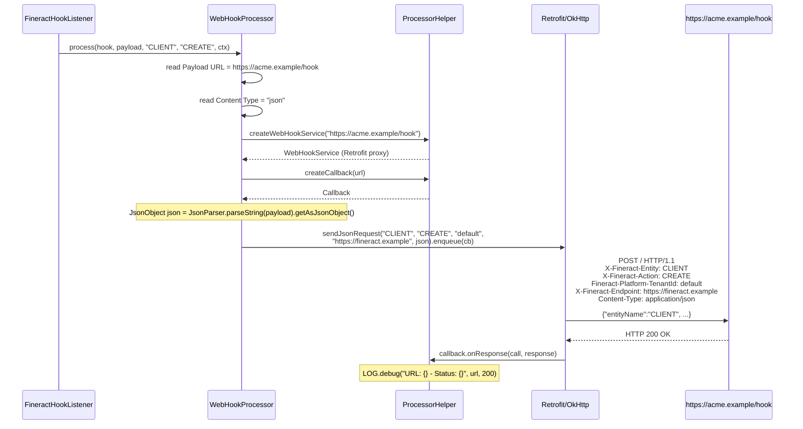

`WebHookProcessor` is the default and most flexible transport in the Apache Fineract hooks subsystem. A hook configured against the `Web` template forwards the full event payload as an HTTP `POST` to whatever `Payload URL` the operator entered, with a fixed set of `X-Fineract-*` headers that identify the originating tenant, entity and action. It can ship the body either as `application/json` (the `JsonObject` from the payload) or as `application/x-www-form-urlencoded` (the payload flattened to a `Map<String, String>`). It is the right starting point for any integration that owns its own receiver — webhook consumers, custom ETL pipelines, audit shippers, queue ingesters.

For the bigger picture see [hooks/overview](/hooks/overview); for the shared OkHttp/Retrofit machinery see [hooks/hook-processors](/hooks/hook-processors).

## Where it lives

| File                                                                                          | Role                                            |
| --------------------------------------------------------------------------------------------- | ----------------------------------------------- |
| `infrastructure/hooks/processor/WebHookProcessor.java`                                        | `@Service("webHookProcessor")` implementation. |
| `infrastructure/hooks/processor/WebHookService.java`                                          | Retrofit interface used for all `POST` calls.  |
| `infrastructure/hooks/processor/ProcessorHelper.java`                                         | Builds the OkHttpClient + Retrofit.            |
| `infrastructure/hooks/service/HookWritePlatformServiceJpaRepositoryImpl.validateConfigAgainstSchema` | Reachability ping at create-time.        |
| `m_hook_templates` row id `1` (`name = 'Web'`)                                                | The template seed (Liquibase changeset 18).    |
| `m_hook_schema` rows id `1` and `2`                                                           | Field schema (`Payload URL`, `Content Type`).  |

## Source

```java
// fineract-provider/.../infrastructure/hooks/processor/WebHookProcessor.java
@Service
@RequiredArgsConstructor
public class WebHookProcessor implements HookProcessor {

    private final ProcessorHelper processorHelper;

    @Override
    public void process(final Hook hook, final String payload, final String entityName,
                        final String actionName, final FineractContext context) {

        final Set<HookConfiguration> config = hook.getConfig();

        String url = "";
        String contentType = "";

        for (final HookConfiguration conf : config) {
            final String fieldName = conf.getFieldName();
            if (fieldName.equals(payloadURLName)) {
                url = conf.getFieldValue();
            }
            if (fieldName.equals(contentTypeName)) {
                contentType = conf.getFieldValue();
            }
        }

        sendRequest(url, contentType, payload, entityName, actionName, context);
    }

    @SuppressWarnings("unchecked")
    private void sendRequest(final String url, final String contentType, final String payload,
                             final String entityName, final String actionName,
                             final FineractContext context) {

        final String fineractEndpointUrl = System.getProperty("baseUrl");
        final WebHookService service = processorHelper.createWebHookService(url);

        @SuppressWarnings("rawtypes")
        final Callback callback = processorHelper.createCallback(url);

        if (contentType.equalsIgnoreCase("json") || contentType.contains("json")) {
            final JsonObject json = JsonParser.parseString(payload).getAsJsonObject();
            service.sendJsonRequest(entityName, actionName,
                    context.getTenantContext().getTenantIdentifier(),
                    fineractEndpointUrl, json)
                    .enqueue(callback);
        } else {
            Map<String, String> map = new HashMap<>();
            map = new Gson().fromJson(payload, map.getClass());
            service.sendFormRequest(entityName, actionName,
                    context.getTenantContext().getTenantIdentifier(),
                    fineractEndpointUrl, map)
                    .enqueue(callback);
        }
    }
}
```

That is the entire implementation. Everything else is configuration data and the shared OkHttp helper.

## Configuration fields read

The processor consults exactly two `HookConfiguration` rows by string match. Both are required by the schema (`m_hook_schema.optional = false`):

| `field_name`     | Constant (`HookApiConstants`) | Example value                | Notes                                                                |
| ---------------- | ------------------------------ | ---------------------------- | -------------------------------------------------------------------- |
| `Payload URL`    | `payloadURLName`               | `https://acme.example/hook`  | Full URL, including scheme; Retrofit's `baseUrl(url)` + `@POST(".")` posts exactly here. |
| `Content Type`   | `contentTypeName`              | `json` or `form`             | Case-insensitive `json` (or any value containing `"json"`) routes to JSON; anything else routes to form-urlencoded. |

Other configuration rows on the hook are silently ignored, which is what lets the SMS processors share the same `m_hook_configuration` table without `WebHookProcessor` getting confused.

### Content type matching

The string match is deliberately loose:

```java
if (contentType.equalsIgnoreCase("json") || contentType.contains("json")) {
    // JSON branch
} else {
    // Form-urlencoded branch
}
```

That means values like `application/json` or `json; charset=utf-8` also pick the JSON branch. An empty string falls into the form branch.

## What is sent

Both branches use the Retrofit interface `WebHookService` whose methods all sit at base path `.`, so the full URL hit is the one the operator configured.

### JSON branch

```java
final JsonObject json = JsonParser.parseString(payload).getAsJsonObject();
service.sendJsonRequest(entityName, actionName,
        context.getTenantContext().getTenantIdentifier(),
        fineractEndpointUrl, json).enqueue(callback);
```

```java
// WebHookService.java
@POST(".") Call<Void> sendJsonRequest(
        @Header(ENTITY_HEADER)   String entityHeader,
        @Header(ACTION_HEADER)   String actionHeader,
        @Header(TENANT_HEADER)   String tenantHeader,
        @Header(ENDPOINT_HEADER) String endpointHeader,
        @Body JsonObject result);
```

The body is the parsed top-level JSON object of the event payload. Because `payload` is itself the `toApiJsonSerializer.serialize(reqmap)` result from `SynchronousCommandProcessingService.publishHookEvent` (see [hooks/overview](/hooks/overview)), the receiver gets a body shaped like:

```json
{
  "entityName": "CLIENT",
  "actionName": "CREATE",
  "createdBy": 1,
  "createdByName": "mifos",
  "createdByFullName": "App Administrator",
  "request":  { ... original JSON command ... },
  "response": { ... CommandProcessingResult ... },
  "officeId": 1,
  "clientId": 42,
  "timestamp": "2024-04-01T09:13:51.234Z"
}
```

The Retrofit converter is `GsonConverterFactory` (set in `ProcessorHelper.createWebHookService`), so the body is serialised through Gson with the default field naming.

### Form branch

```java
Map<String, String> map = new HashMap<>();
map = new Gson().fromJson(payload, map.getClass());
service.sendFormRequest(entityName, actionName, tenantId, fineractEndpointUrl, map)
        .enqueue(callback);
```

```java
@FormUrlEncoded
@POST(".") Call<Void> sendFormRequest(
        @Header(ENTITY_HEADER)   String entityHeader,
        @Header(ACTION_HEADER)   String actionHeader,
        @Header(TENANT_HEADER)   String tenantHeader,
        @Header(ENDPOINT_HEADER) String endpointHeader,
        @FieldMap Map<String, String> params);
```

The form branch deserialises the payload into a flat `Map<String, String>`. **Nested objects are flattened to a `LinkedHashMap.toString()` string**, which is rarely what receivers expect. For anything more structured than a couple of scalar fields, prefer the JSON branch.

## Headers

Every `WebHookProcessor` `POST` carries four headers — see [hooks/hook-processors](/hooks/hook-processors) for the constants. Concretely:

| Header                       | Value                                                        |
| ---------------------------- | ------------------------------------------------------------ |
| `Content-Type`               | `application/json; charset=UTF-8` (JSON) or `application/x-www-form-urlencoded` (form) — set by OkHttp from the Retrofit annotations. |
| `X-Fineract-Entity`          | `entityName` from the `HookEventSource` (e.g. `CLIENT`).     |
| `X-Fineract-Action`          | `actionName` from the `HookEventSource` (e.g. `CREATE`).     |
| `Fineract-Platform-TenantId` | `context.getTenantContext().getTenantIdentifier()`.          |
| `X-Fineract-Endpoint`        | `System.getProperty("baseUrl")`.                              |

`X-Fineract-Endpoint` is the operator-configured base URL of **this** Fineract instance, surfaced through the `baseUrl` system property in `application.properties` / startup args. Many consumers use this header as a callback hint — e.g. an indexer can `GET ${endpoint}/v1/clients/${clientId}` to fetch the latest representation.

There is **no** `Authorization` header. Receivers must therefore either be unauthenticated or rely on transport-level controls (mTLS, IP allow-list, signed JWT in the URL, etc.). Adding HMAC signing is a common customisation; the source is small enough that subclassing or replacing the bean is straightforward.

## Transport: OkHttp + Retrofit

`ProcessorHelper.createWebHookService(url)` builds a per-call Retrofit client:

```java
public WebHookService createWebHookService(final String url) {
    final OkHttpClient client = createClient();
    return new Retrofit.Builder()
            .baseUrl(url)
            .client(client)
            .addConverterFactory(GsonConverterFactory.create())
            .build()
            .create(WebHookService.class);
}
```

| Property              | Setting                                                                                        |
| --------------------- | ---------------------------------------------------------------------------------------------- |
| HTTP client           | New `OkHttpClient` per dispatch — no shared connection pool.                                   |
| TLS                   | JVM default trust store, unless `-Dfineract.insecureHttpClient=true` is set.                   |
| Connect / read timeout| OkHttp defaults (10 s connect, 10 s read).                                                     |
| Converter             | `GsonConverterFactory` for request bodies.                                                     |
| Async                 | `Call.enqueue(Callback)` — dispatched on the OkHttp dispatcher thread.                         |
| Retries               | None — `onFailure` only logs.                                                                  |
| Response handling     | Body is discarded (`Call<Void>`); status code is logged at `DEBUG`.                            |

Because the call is `enqueue(...)`-style, the publisher thread (the same one that ran the command) is freed as soon as Retrofit hands the request to OkHttp. A slow downstream will not block the API caller, but it will queue up requests inside the OkHttp dispatcher.

## Validation at create time

When a hook of template `Web` is created or updated, `HookWritePlatformServiceJpaRepositoryImpl.validateConfigAgainstSchema(...)` does a connectivity check before the row is persisted:

```java
// HookWritePlatformServiceJpaRepositoryImpl (excerpt)
if (webTemplateName.equals(template.getName())) {
    final WebHookService service = processorHelper.createWebHookService(url);
    final Response<Void> response = service.sendEmptyRequest().execute();
    if (!response.isSuccessful()) {
        throw new PlatformDataIntegrityException(
                "error.msg.url.unreachable",
                "The Payload URL " + url + " is unreachable", url);
    }
}
```

```java
// WebHookService.java
@GET(".") Call<Void> sendEmptyRequest();
```

The check is a `GET` (not a `POST`) — i.e. the URL must answer with a 2xx to a probe. Any non-2xx, connection refused, DNS failure or TLS error surfaces as the platform error `error.msg.url.unreachable` and rejects the create command. This is the only built-in retry: the operator gets a synchronous failure they can act on.

It also explains why some webhook receivers need to expose a no-op `GET` alongside their `POST` handler — without one, hook creation will fail even though dispatch would succeed.

## Worked example

The dispatch sequence for a `CLIENT|CREATE` event reaching a `Web` hook:



## Operational guidance

| Concern                 | Recommendation                                                                                              |
| ----------------------- | ----------------------------------------------------------------------------------------------------------- |
| Authentication          | Terminate TLS at a reverse proxy that validates an HMAC, or use mTLS. There is no built-in signing.        |
| Reliability             | Hooks are fire-and-forget. If you need durability, have the receiver write to a queue immediately on receipt. |
| Throughput              | The per-dispatch OkHttp client construction is the headline cost. For high QPS, replace `ProcessorHelper` with a shared `OkHttpClient` and `Retrofit` per tenant. |
| Body shape              | Use `Content Type = "json"` whenever possible — the form branch is lossy for nested objects.                |
| Error visibility        | Failures only land in `ProcessorHelper`'s `Callback.onFailure` at `ERROR` level. Non-2xx responses are not logged as errors. Add an OkHttp `Interceptor` if you need richer telemetry. |
| Field length            | `m_hook_configuration.field_value` is `VARCHAR(100)`. URLs longer than 100 characters will not fit.        |
| Cache                   | After changing the URL on an active hook, the per-tenant cache is evicted by the `HOOK|UPDATE` command.    |

## Cross-references

- [Hooks overview](/hooks/overview) — end-to-end dispatch flow.
- [Hook processors](/hooks/hook-processors) — `HookProcessor` interface and the shared OkHttp/Retrofit helper.
- [Hook domain](/hooks/hook-domain) — `Hook`, `HookConfiguration`, `Schema`.
- [Elasticsearch hook](/hooks/elasticsearch-hook) — same machinery, ES-specific configuration.
- [Twilio hook](/hooks/twilio-hook) — uses `sendSmsBridgeRequest` instead of `sendJsonRequest`.
- [Core hooks contracts](/core/hooks) — `HookEvent`, `HookEventSource`.
- [Commands framework](/command/overview) — origin of the payload.
- [Hooks & messaging APIs](/api/hooks) — REST CRUD shapes.
