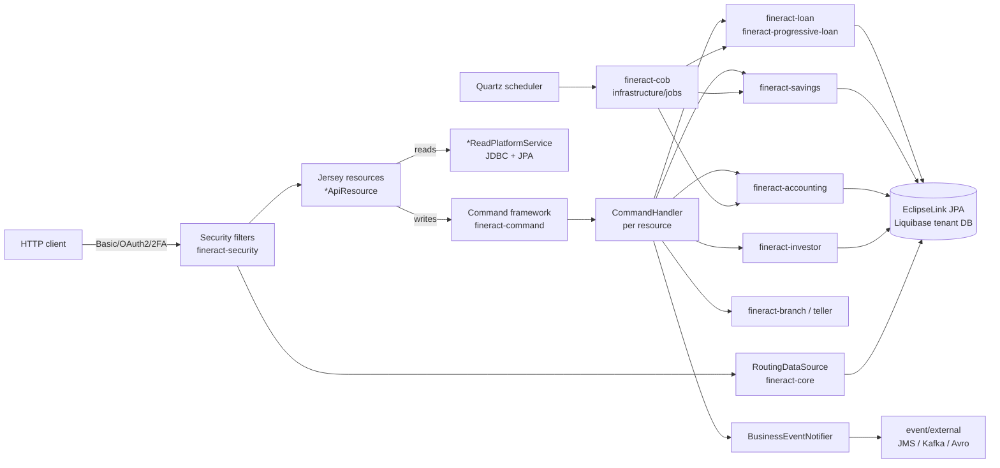

Apache Fineract is a multi-tenant, modular Spring Boot core banking platform for microfinance, lending, savings, and accounting. This wiki is an internal engineering reference: it maps the Gradle multi-module layout, the REST API surface, the CQRS-style command framework, the Spring Batch close-of-business (COB) engine, and every supporting subsystem to concrete files in the source tree so engineers and coding agents can navigate and modify the codebase without grepping.

## Architecture overview

The Spring Boot entrypoint (`ServerApplication`) bootstraps `FineractWebApplicationConfiguration` and `FineractLiquibaseOnlyApplicationConfiguration` from `fineract-provider`, which wires every other Gradle module on the classpath. Jersey publishes the REST surface under `/fineract-provider/api/v1`; requests pass through `TenantAwareBasicAuthenticationFilter` / `TwoFactorAuthenticationFilter`, get routed to `*ApiResource` classes, and write paths funnel through `PortfolioCommandSourceWritePlatformService` → `SynchronousCommandProcessingService` → per-resource `CommandHandler`s. The COB engine in `fineract-cob` orchestrates daily batch processing of loans, savings, and external asset transfers; external events flow out through JMS or Kafka producers; tenants live in a master `fineract_tenants` DB that routes each request to its tenant-specific schema.

## Repository map

| Directory | Contents | Wiki entry point |
| --- | --- | --- |
| `fineract-provider/` | Spring Boot application, Jersey wiring, security/Hikari/JPA config, batch command strategies, all aggregated `*ApiResource`s | [fineract-provider Overview](/provider/overview) |
| `fineract-core/` | Shared domain (`portfolio`, `organisation`, `accounting`, `useradministration`), infrastructure (JPA, JSON, tenant routing), command/batch/event base classes | [fineract-core Overview](/core/overview) |
| `fineract-security/` | `SecurityConfig`, Basic / OAuth2 / 2FA filters, `AuthenticationApiResource`, `TwoFactorApiResource` | [Security Overview](/security/overview) |
| `fineract-command/` | CQRS command source, idempotency, maker-checker plumbing | [Command Overview](/command/overview) |
| `fineract-validation/` | Jakarta Bean Validation constraints and helpers | [Validation Overview](/validation/overview) |
| `fineract-cob/` | Close-of-business batch engine, `COBBusinessStep`, listeners, locking | [COB Overview](/cob/overview) |
| `fineract-accounting/` | GL accounts, journal entries, accrual, closure, provisioning, accounting rules, trial balance | [Accounting Overview](/accounting/overview) |
| `fineract-loan/` | Loan domain, charges, schedule, transaction processors, delinquency, interest pauses, reschedule, guarantor | [Loan Overview](/loan/overview) |
| `fineract-progressive-loan/` | Progressive (compound) loan schedule, recalculation, buy-down fee, capitalized income | [Progressive Loan Overview](/progressive-loan/overview) |
| `fineract-progressive-loan-embeddable-schedule-generator/` | Standalone progressive schedule generator usable outside Fineract | [Embeddable Generator](/progressive-loan/embeddable-schedule-generator) |
| `fineract-loan-origination/` | Loan originator entity, enrichers, originator APIs | [Loan Origination Overview](/loan-origination/overview) |
| `fineract-working-capital-loan/` | Working capital product, calc engine, COB step | [Working Capital Overview](/working-capital-loan/overview) |
| `fineract-savings/` | Savings accounts, charges, fixed and recurring deposits, GSIM | [Savings Overview](/savings/overview) |
| `fineract-investor/` | External asset owner transfers, loan product attributes | [Investor Overview](/investor/overview) |
| `fineract-branch/` | Teller, cashier, teller journal | [Branch Overview](/branch/overview) |
| `fineract-document/` | Document management, images, S3 / filesystem content store | [Document Overview](/document/overview) |
| `fineract-charge/` | Portfolio charges domain and APIs | [Charge Overview](/charge/overview) |
| `fineract-tax/` | Tax components and tax groups | [Tax Overview](/tax/overview) |
| `fineract-rates/` | Floating interest rates | [Rates Overview](/rates/overview) |
| `fineract-report/` | Report provider abstraction and report-mailing-job | [Report Overview](/report/overview) |
| `fineract-mix/` | MIX Market reporting taxonomy and mapping | [Mix Overview](/mix/overview) |
| `fineract-war/` | WAR packaging of the provider for external servlet containers | [Build & Deployment](/build/gradle-multi-module) |
| `fineract-client/`, `fineract-client-feign/` | Generated REST SDKs | [Clients Overview](/clients/overview) |
| `fineract-avro-schemas/` | Avro `.avsc` schemas for external events | [Avro Schemas](/clients/avro-schemas) |
| `fineract-db/` | Legacy SQL bootstrap and demo tenant backups | [Database Overview](/database/overview) |
| `fineract-doc/` | Asciidoc/Antora upstream documentation source | [Build Overview](/build/gradle-multi-module) |
| `integration-tests/`, `oauth2-tests/`, `twofactor-tests/` | JVM integration test suites | [Testing Overview](/testing/overview) |
| `fineract-e2e-tests-core/`, `fineract-e2e-tests-runner/` | Cucumber E2E test framework and 80+ feature files | [E2E Cucumber Runner](/testing/e2e-cucumber-runner) |
| `custom/` | Dynamic Gradle inclusion of customer modules (acme example) | [Custom Modules Overview](/custom/overview) |
| `docker*.yml`, `kubernetes/`, `docker/` | Multi-profile docker-compose, Kubernetes manifests, embedded Tomcat config | [Docker Compose Profiles](/build/docker-compose-profiles) |

## Subsystem map

<CardGroup cols={2}>
  <Card title="Bootstrap & Runtime" icon="rocket" href="/runtime/server-application">
    Spring Boot entrypoint, Jersey wiring, datasource pooling, transaction management, metrics, logging
  </Card>
  <Card title="fineract-core" icon="cube" href="/core/overview">
    Shared domain, infrastructure, JSON command framework, tenant routing, event base, Liquibase glue
  </Card>
  <Card title="Security" icon="shield-halved" href="/security/overview">
    Basic auth, OAuth2 authorization server, tenant-aware filters, 2FA, SQL injection prevention
  </Card>
  <Card title="Command framework (CQRS)" icon="diagram-project" href="/command/overview">
    `CommandWrapperBuilder`, idempotency, maker-checker, audit trail, async command persistence
  </Card>
  <Card title="Validation" icon="circle-check" href="/validation/overview">
    Jakarta Bean Validation constraints and `DataValidatorBuilder` helpers
  </Card>
  <Card title="Close of Business" icon="calendar-day" href="/cob/overview">
    Spring Batch COB engine, `COBBusinessStep`, listeners, account locking, inline COB
  </Card>
  <Card title="Accounting" icon="book" href="/accounting/overview">
    GL accounts, journal entries, accrual, closure, provisioning, accounting rules, trial balance
  </Card>
  <Card title="Loan" icon="hand-holding-dollar" href="/loan/overview">
    Loan domain, schedule generators, transaction processors, charges, delinquency, reschedule
  </Card>
  <Card title="Progressive Loan" icon="chart-line" href="/progressive-loan/overview">
    Progressive amortization, recalculation, buy-down fee, capitalized income
  </Card>
  <Card title="Loan Origination" icon="seedling" href="/loan-origination/overview">
    Loan originator domain, enrichers, originator APIs
  </Card>
  <Card title="Working Capital Loan" icon="briefcase" href="/working-capital-loan/overview">
    Working capital product, calc engine, COB integration
  </Card>
  <Card title="Savings" icon="piggy-bank" href="/savings/overview">
    Savings, charges, fixed deposit, recurring deposit, GSIM, interest posting
  </Card>
  <Card title="Investor (Asset Externalization)" icon="handshake" href="/investor/overview">
    External asset owner transfers, loan product attributes, journal integration
  </Card>
  <Card title="Branch & Teller" icon="building-columns" href="/branch/overview">
    Teller, cashier, teller journal
  </Card>
  <Card title="Document Management" icon="file" href="/document/overview">
    Document/image API, S3 and filesystem content stores, detectors and policies
  </Card>
  <Card title="Charge / Tax / Rates" icon="percent" href="/charge/overview">
    Portfolio charges, tax components and groups, floating rates
  </Card>
  <Card title="Report / Mix" icon="chart-pie" href="/report/overview">
    Report providers, report-mailing-job, MIX Market reporting taxonomy
  </Card>
  <Card title="Provider Application" icon="server" href="/provider/overview">
    Spring Boot assembly, Jersey config, Hikari/JDBC, security config, EclipseLink JPA
  </Card>
  <Card title="Portfolio Subsystems" icon="folder-tree" href="/portfolio/clients">
    Clients, groups, calendars, meetings, notes, funds, transfers, collateral, share accounts
  </Card>
  <Card title="Organisation" icon="building" href="/organisation/offices">
    Offices, staff, holidays, working days, currencies, provisioning
  </Card>
  <Card title="User Administration" icon="users" href="/users/overview">
    Users, roles, permissions, password policy, self-service users
  </Card>
  <Card title="Notification" icon="bell" href="/notification/overview">
    Spring and ActiveMQ event publisher/listener, notification API, cache
  </Card>
  <Card title="Batch API" icon="layer-group" href="/batch-api/overview">
    Multi-action HTTP batch endpoint, command strategies, dependency resolution
  </Card>
  <Card title="Background Jobs" icon="clock" href="/jobs/overview">
    Quartz scheduler, inline jobs, Spring Batch manager/worker, stuck job recovery
  </Card>
  <Card title="External Events" icon="paper-plane" href="/events/overview">
    Business and external events, JMS and Kafka producers, Avro serializers, idempotency
  </Card>
  <Card title="Hooks & Templates" icon="webhook" href="/hooks/overview">
    Web hooks, Twilio, Elasticsearch, message gateway, template engine
  </Card>
  <Card title="Campaigns" icon="envelope" href="/campaigns/overview">
    Email and SMS campaigns, gateway scheduler, configuration
  </Card>
  <Card title="Data Queries" icon="table" href="/dataqueries/overview">
    Datatables, entity datatable checks, reports, run-reports, exports
  </Card>
  <Card title="Surveys & SPM" icon="square-poll-vertical" href="/surveys/overview">
    Surveys, likelihood, poverty line, SPM scorecards
  </Card>
  <Card title="Credit Bureau & Adhoc" icon="id-card" href="/creditbureau/overview">
    Credit bureau configuration and integration, adhoc queries
  </Card>
  <Card title="Interoperation (PISP)" icon="arrows-left-right" href="/interop/overview">
    PISP-style interop API and domain
  </Card>
  <Card title="Multi-Tenancy" icon="layer-group" href="/tenancy/overview">
    Tenant master DB + per-tenant routing, Hikari per tenant, business-date and COB-date context
  </Card>
  <Card title="Database & Liquibase" icon="database" href="/database/overview">
    Per-module Liquibase changelogs, tenant vs tenant-store, SQL bootstrap
  </Card>
  <Card title="Configuration & Environment" icon="gear" href="/config/overview">
    `application.properties`, `FineractProperties`, global configuration API, feature flags
  </Card>
  <Card title="Build, Test & Deploy" icon="hammer" href="/build/gradle-multi-module">
    Gradle multi-module, static EclipseLink weaving, docker-compose profiles, Jib, Kubernetes
  </Card>
  <Card title="Testing" icon="vial" href="/testing/overview">
    Integration tests, OAuth2/2FA tests, Cucumber E2E framework, 80+ feature files
  </Card>
  <Card title="Custom Modules" icon="puzzle-piece" href="/custom/overview">
    Dynamic Gradle inclusion under `custom/<company>/<category>/<module>` (acme example)
  </Card>
  <Card title="Clients & SDKs" icon="plug" href="/clients/overview">
    Retrofit and Feign Java SDKs, Avro event schemas
  </Card>
  <Card title="Key Flows" icon="diagram-next" href="/flows/request-lifecycle">
    Request lifecycle, command execution, maker-checker, loan disbursement, COB, event publishing
  </Card>
  <Card title="Data Models" icon="table-list" href="/models/clients-and-groups">
    Entity catalogs grouped by subsystem with field-level inventories
  </Card>
  <Card title="API Reference" icon="code" href="/api/overview">
    Every Jersey `*ApiResource` enumerated by HTTP method, path, and handler file
  </Card>
</CardGroup>

## Where to start

<Note>
New to the codebase? Read [Architecture](/overview/architecture) first, then [Repository Layout](/overview/repository-layout), then [Request Lifecycle](/flows/request-lifecycle). The single most important entrypoints are:

- `fineract-provider/src/main/java/org/apache/fineract/ServerApplication.java` — the Spring Boot `main()`
- `fineract-provider/src/main/java/org/apache/fineract/infrastructure/core/boot/FineractWebApplicationConfiguration.java` — module wiring
- `fineract-provider/src/main/resources/application.properties` — runtime configuration root
- `fineract-core/src/main/java/org/apache/fineract/infrastructure/jobs/service/JobName.java` — catalog of scheduled jobs
- `fineract-core/src/main/java/org/apache/fineract/commands/service/CommandWrapperBuilder.java` — every write goes through here
</Note>
