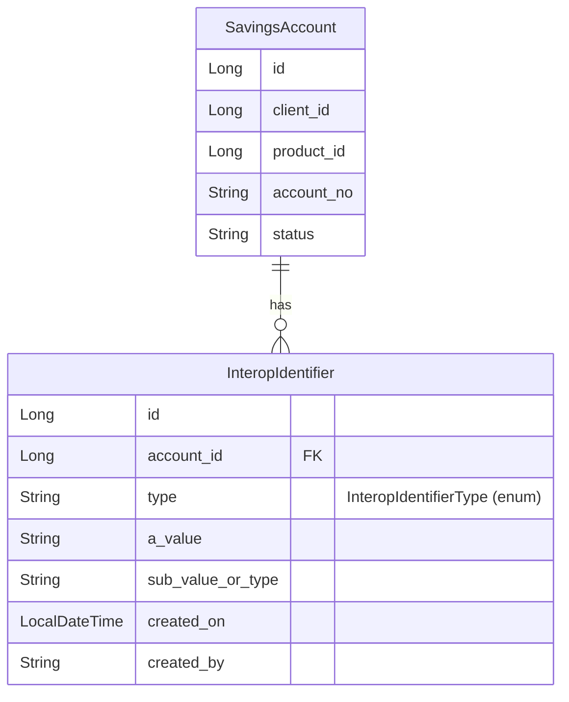
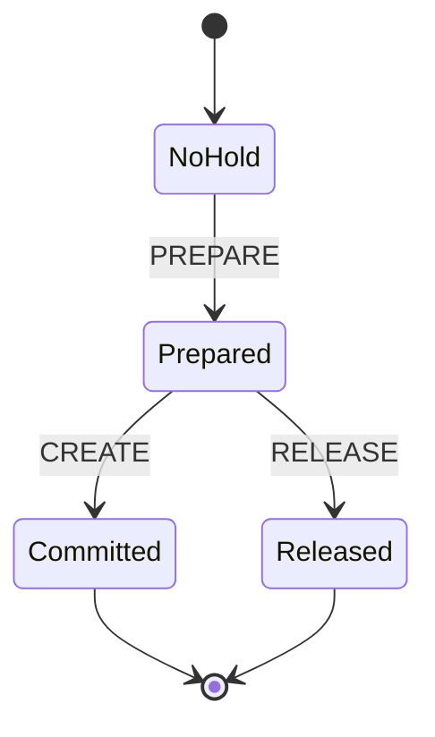
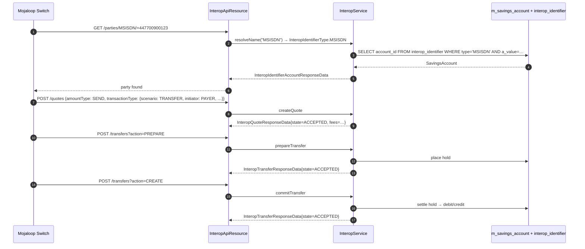

**Apache Fineract** exposes a Mojaloop‑style Financial Service Provider (FSP) surface so that an external switch can look up parties, calculate quotes, and execute transfers against the savings accounts the platform hosts. This page is the reference for the domain layer that underpins that surface: the persistent `InteropIdentifier` entity, the `InteropIdentifierType` taxonomy, and the small constellation of enums that classify transactions, transfer phases, and party roles.

Module / package layout:

| Module | Package | Symbols |
| --- | --- | --- |
| `fineract-core` | `org.apache.fineract.interoperation.domain` | `InteropIdentifierType` |
| `fineract-savings` | `org.apache.fineract.interoperation.domain` | `InteropIdentifier`, `InteropActionState`, `InteropAmountType`, `InteropInitiatorType`, `InteropTransactionRole`, `InteropTransactionScenario`, `InteropTransferActionType` |
| `fineract-provider` | `org.apache.fineract.interoperation.domain` | `InteropIdentifierRepository` |
| `fineract-provider` | `org.apache.fineract.interoperation.api` / `service` | The REST and command layers — see [`/interop/interop-api`](/interop/interop-api) |

The split between `fineract-core` (the enum) and `fineract-savings` (the entity) exists because `InteropIdentifier` has a `@ManyToOne` to `SavingsAccount`, which is itself a `fineract-savings` JPA entity, while `InteropIdentifierType` is needed in DTOs that travel across modules without a JPA dependency.

If you want the request/response side, jump to [`/interop/interop-serialization`](/interop/interop-serialization); for the bigger picture see [`/interop/overview`](/interop/overview).

## `InteropIdentifier` — the persistent entity

```java
@Entity
@Setter
@Getter
@NoArgsConstructor
@Table(name = "interop_identifier", uniqueConstraints = {
        @UniqueConstraint(name = "uk_hathor_identifier_account", columnNames = { "account_id", "type" }),
        @UniqueConstraint(name = "uk_hathor_identifier_value", columnNames = { "type", "a_value", "sub_value_or_type" }) })
public class InteropIdentifier extends AbstractPersistableCustom<Long> {

    @ManyToOne(optional = false)
    @JoinColumn(name = "account_id", nullable = false)
    private SavingsAccount account;

    @Column(name = "type", nullable = false, length = 32)
    @Enumerated(EnumType.STRING)
    private InteropIdentifierType type;

    @Column(name = "a_value", nullable = false, length = 128)
    private String value;

    @Column(name = "sub_value_or_type", length = 128)
    private String subType;

    @Column(name = "created_by", nullable = false, length = 32)
    private String createdBy;

    @Column(name = "created_on", nullable = false)
    private LocalDateTime createdOn;

    @Column(name = "modified_by", length = 32)
    private String modifiedBy;

    @Column(name = "modified_on")
    private LocalDateTime modifiedOn;
}
```

| Column | Purpose |
| --- | --- |
| `account_id` | FK to `m_savings_account`. **One savings account can have multiple identifiers**, but at most one per `(account_id, type)` combination |
| `type` | `InteropIdentifierType` stored as a string for upgradability |
| `a_value` | The actual identifier value (the MSISDN, the IBAN, the email, …). Prefixed with `a_` to avoid colliding with SQL reserved words on some DBs |
| `sub_value_or_type` | Optional sub‑identifier (e.g. `PERSONALID` requires a country code; `ALIAS` may carry a subscope) |
| `created_by`, `created_on` | Audit columns. Note these are explicit `String` / `LocalDateTime` rather than the platform's standard auditable base class — the entity predates that base class |
| `modified_by`, `modified_on` | Mutated by `InteropServiceImpl` when an identifier is overwritten |

The two unique constraints encode two business rules:

| Constraint | Rule | Operational consequence |
| --- | --- | --- |
| `uk_hathor_identifier_account` on `(account_id, type)` | An account can have at most one MSISDN, one IBAN, one EMAIL, etc. | Registering a second MSISDN for the same account replaces the prior row (handled in `InteropServiceImpl`) |
| `uk_hathor_identifier_value` on `(type, a_value, sub_value_or_type)` | A given identifier value (e.g. `+44 7700 900123` as MSISDN) belongs to one account only | The DB will reject attempts to point the same MSISDN at two accounts; the service translates the violation into a 4xx |

The legacy `hathor` prefix in the constraint names is a relic of an earlier Mojaloop reference implementation; the column and table names themselves are stable.



### Equality and hashing

```java
@Override
public boolean equals(Object o) {
    if (this == o) return true;
    if (o == null || !(o instanceof InteropIdentifier)) return false;
    InteropIdentifier that = (InteropIdentifier) o;
    if (!account.equals(that.account)) return false;
    if (type != that.type) return false;
    if (!value.equals(that.value)) return false;
    return Objects.equals(subType, that.subType);
}

@Override
public int hashCode() {
    int result = type.hashCode();
    result = 31 * result + value.hashCode();
    result = 31 * result + (subType != null ? subType.hashCode() : 0);
    return result;
}
```

Equality is *business*: two `InteropIdentifier`s are equal iff they share `(account, type, value, subType)`. Crucially, the hash *excludes* `account` to stay stable across detach/attach but `equals` includes it — a subtle asymmetry to be aware of when stashing rows in `HashSet`s.

### Construction

Two convenience constructors:

```java
public InteropIdentifier(@NotNull SavingsAccount account, @NotNull InteropIdentifierType type, @NotNull String value, String subType,
        @NotNull String createdBy) {
    this.account = account;
    this.type = type;
    this.value = value;
    this.subType = subType;
    this.createdBy = createdBy;
    this.createdOn = DateUtils.getAuditLocalDateTime();
}

public InteropIdentifier(@NotNull SavingsAccount account, @NotNull InteropIdentifierType type, @NotNull String createdBy) {
    this(account, type, null, null, createdBy);
}
```

The two‑arg form is for placeholder rows whose value will be filled later. In practice the four‑arg form is used by `InteropServiceImpl.registerAccountIdentifier`.

## `InteropIdentifierType`

The taxonomy of identifier kinds:

```java
public enum InteropIdentifierType {

    MSISDN("interopIdentifierType.msisdn"),
    EMAIL("interopIdentifierType.email"),
    PERSONAL_ID("interopIdentifierType.personalId", "PERSONALID", "PERSONALID"),
    BUSINESS("interopIdentifierType.business"),
    DEVICE("interopIdentifierType.device"),
    ACCOUNT_ID("interopIdentifierType.accountId", "ACCOUNTID", "ACCOUNTID"),
    IBAN("interopIdentifierType.iban"),
    ALIAS("interopIdentifierType.alias"),
    BBAN("interopIdentifierType.bban"),
    ;

    private final String code;
    private final String description;
    private final String alias;
}
```

| Enum constant | Alias for resolution | Typical content |
| --- | --- | --- |
| `MSISDN` | `MSISDN` | E.164 mobile phone number |
| `EMAIL` | `EMAIL` | RFC 5322 email address |
| `PERSONAL_ID` | `PERSONALID` | National ID with `sub_value_or_type` carrying the country/scheme code |
| `BUSINESS` | `BUSINESS` | Business registration number |
| `DEVICE` | `DEVICE` | Device fingerprint / IMEI |
| `ACCOUNT_ID` | `ACCOUNTID` | Direct account number (Fineract's own `account_no`) |
| `IBAN` | `IBAN` | ISO 13616 IBAN |
| `ALIAS` | `ALIAS` | Arbitrary handle, e.g. `@username` |
| `BBAN` | `BBAN` | Basic Bank Account Number (national format) |

Note the `alias` column: the Mojaloop wire protocol uses single‑token identifiers like `PERSONALID` (no underscore) and `ACCOUNTID` (no underscore). Fineract's enum names use underscores, so two lookup maps are maintained:

```java
private static final Map<String, InteropIdentifierType> BY_ALIAS = Arrays.stream(VALUES)
        .collect(Collectors.toMap(InteropIdentifierType::getAlias, v -> v));
private static final Map<String, InteropIdentifierType> BY_NAME = Arrays.stream(VALUES)
        .collect(Collectors.toMap(InteropIdentifierType::name, v -> v));

public static InteropIdentifierType resolveName(String name) {
    if (name == null) return null;
    InteropIdentifierType idType = BY_ALIAS.get(name);
    return idType == null ? BY_NAME.get(name) : idType;
}
```

So both `PERSONALID` (wire form) and `PERSONAL_ID` (Java form) resolve to the same constant. Callers in the API resource use `InteropIdentifierType.resolveName(...)` instead of `valueOf(...)` so they tolerate either form.

### `StringEnumOptionData` for catalogues

```java
public StringEnumOptionData toStringEnumOptionData() {
    return new StringEnumOptionData(name(), getCode(), getDescription());
}
```

This is the shape exposed by the `/interoperation/parties` catalogue endpoint — UI clients enumerate this list to display a "pick an identifier type" dropdown.

## Transfer phases — `InteropTransferActionType`

```java
public enum InteropTransferActionType {
    PREPARE,
    CREATE,
    RELEASE;
}
```

The three‑legged Mojaloop transfer dance:

| Phase | Effect on savings | Triggering API |
| --- | --- | --- |
| `PREPARE` | Earmark `amount + fees` on the payer/payee account (a hold) | `POST /v1/interoperation/transfers?action=PREPARE` |
| `CREATE` | Commit the transfer — release the hold into a real debit/credit | `POST /v1/interoperation/transfers?action=CREATE` |
| `RELEASE` | Roll the hold back (the transfer was rejected by the switch) | `POST /v1/interoperation/transfers?action=RELEASE` |

The enum is referenced from `InteropApiResource` as the `action` query parameter and is matched against the wire constants in `InteropUtil`:

```java
public static final String ACTION_TRANSFER_PREPARE = "PREPARE";
public static final String ACTION_TRANSFER_COMMIT  = "CREATE";   // note: not COMMIT on the wire
public static final String ACTION_TRANSFER_RELEASE = "RELEASE";
```



## Transaction roles, scenarios, initiator type

These four enums classify *what* a transaction is for, *who* started it, and *which side* the local FSP is on. They are all referenced by `InteropTransactionTypeData` (see [`/interop/interop-serialization`](/interop/interop-serialization)).

### `InteropTransactionRole`

```java
public enum InteropTransactionRole {
    PAYER,
    PAYEE;
}
```

| Value | Meaning for this FSP |
| --- | --- |
| `PAYER` | Money leaves a savings account hosted on this Fineract instance |
| `PAYEE` | Money arrives at a savings account hosted on this Fineract instance |

The role is per‑transaction, not per‑account. The same account is `PAYER` when its owner sends money and `PAYEE` when receiving.

### `InteropTransactionScenario`

```java
public enum InteropTransactionScenario {
    DEPOSIT,
    WITHDRAWAL,
    TRANSFER,
    PAYMENT,
    REFUND;
}
```

| Scenario | Typical example |
| --- | --- |
| `DEPOSIT` | Agent‑assisted cash in |
| `WITHDRAWAL` | Agent‑assisted cash out |
| `TRANSFER` | Peer‑to‑peer remittance |
| `PAYMENT` | Merchant payment |
| `REFUND` | Reversal of an earlier `PAYMENT` |

Subscenarios — e.g. "salary payment" — are encoded as free strings on `InteropTransactionTypeData.subScenario`. The enum is intentionally small and stable.

### `InteropInitiatorType`

```java
public enum InteropInitiatorType {
    CONSUMER,
    AGENT,
    BUSINESS,
    DEVICE;
}
```

| Initiator | Origin |
| --- | --- |
| `CONSUMER` | End user, typically via mobile app |
| `AGENT` | Cash agent (post office, kiosk) |
| `BUSINESS` | Merchant point of sale |
| `DEVICE` | Unattended ATM / IVR |

Combined with `transactionRole`, this gives the FSP enough context to apply different KYC, fee, and limit policies.

### `InteropAmountType`

```java
public enum InteropAmountType {
    SEND,
    RECEIVE;
}
```

| Amount type | Meaning |
| --- | --- |
| `SEND` | The amount field is what the payer wants to *send* — fees come on top |
| `RECEIVE` | The amount field is what the payee should *receive* — fees come out of the payer's wallet but the payee gets the full requested amount |

Quote calculations branch on `amountType`; see [`/interop/interop-serialization`](/interop/interop-serialization) for the request shape.

## `InteropActionState`

```java
public enum InteropActionState {
    ACCEPTED,
    REJECTED;
}
```

Used in transfer / quote responses to indicate whether the FSP can fulfill the request. Distinct from the transfer phase (`InteropTransferActionType`) — a transfer might be `PREPARE`‑phase `ACCEPTED` but later `CREATE`‑phase `REJECTED` if the hold expires.

## How they fit together

A complete inter‑operation flow uses all of these enums:



Identifier types resolve parties (1). Transaction scenarios + initiator + role inform quote pricing (2). Transfer action types drive the two‑phase commit (3, 4). Action states report each step's outcome.

## Repository

```java
public interface InteropIdentifierRepository extends JpaRepository<InteropIdentifier, Long> {

    InteropIdentifier findByTypeAndValueAndSubType(InteropIdentifierType type, String value, String subType);

    InteropIdentifier findByAccountAndType(SavingsAccount account, InteropIdentifierType type);

    List<InteropIdentifier> findAllByAccount(SavingsAccount account);
}
```

Three lookups cover the resource paths:

| Caller | Method | Use |
| --- | --- | --- |
| `GET /accounts/{accountId}/identifiers` | `findAllByAccount` | List identifiers for one account |
| `GET /parties/{type}/{value}[/{subType}]` | `findByTypeAndValueAndSubType` | Resolve a party to an account |
| `POST /accounts/{accountId}/identifiers/{type}` | `findByAccountAndType` | Detect overwrite of existing identifier for the account |

The repository is in `fineract-provider` so it can pull both the entity (from `fineract-savings`) and the typed lookup arguments (from `fineract-core`).

## Why `subType` matters

`PERSONAL_ID` and a few other identifier types are inherently ambiguous without a scheme qualifier. The wire format used by Mojaloop is `<type>/<value>/<subType>`, so a UK national insurance number is `PERSONAL_ID/AB123456C/UK_NIN`. Fineract preserves the three‑part key with `sub_value_or_type` and includes it in the unique constraint, so:

- `PERSONAL_ID / AB123456C / UK_NIN` is a *different* identifier from
- `PERSONAL_ID / AB123456C / IE_PPS`.

Both can coexist without colliding even though their `value` is identical. The `findByTypeAndValueAndSubType` lookup is therefore typed `(InteropIdentifierType, String, String)`. Passing `null` as `subType` matches rows where the column is `NULL`.

## Audit trail without `Auditable`

`InteropIdentifier` does not extend `AbstractAuditableCustom`. Instead it has its own `created_by`/`created_on`/`modified_by`/`modified_on` columns, populated explicitly by the service when an identifier is created or rewritten. This was a deliberate choice when the table was first added — the platform's auditable base class did not yet exist, and migrating the table now would require a Liquibase column rename. Operators rely on the `created_by` / `modified_by` columns for forensics; both store the `AppUser.username` string, not the user id.

## What the domain does *not* include

- **No `InteropParty` entity.** "Party" is a Mojaloop concept that maps to `(InteropIdentifier, SavingsAccount.client, ClientNonPerson)`. Fineract resolves it on the fly in `InteropService.getAccountByIdentifier(...)` and returns it as a DTO (`InteropIdentifierAccountResponseData`).
- **No `InteropTransactionType` JPA entity.** Transactions are recorded as savings transactions on the bound `SavingsAccount`; the `InteropTransactionTypeData` DTO is only carried at request time and is not persisted as a separate row.
- **No `InteropTransfer` entity.** Two‑phase transfers reuse the savings account hold mechanism (`m_savings_account_transaction` rows with `is_reversed`, `release_id_of_hold_amount_transaction`). The Mojaloop `transferCode` is stored on the savings transaction itself rather than in a dedicated table.

This is intentional — Fineract aims to map Mojaloop concepts onto its native savings ledger, not to maintain a parallel data model.

## See also

- [`/interop/overview`](/interop/overview) — module map and protocol orientation.
- [`/interop/interop-api`](/interop/interop-api) — the REST resource that consumes these enums.
- [`/interop/interop-serialization`](/interop/interop-serialization) — DTOs and validators that wrap requests.
- `/savings/savings-account-domain` — the parent `SavingsAccount` that every `InteropIdentifier` ties back to.
