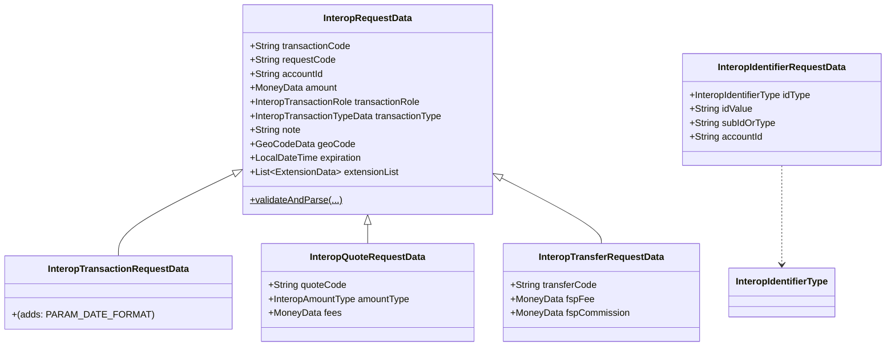
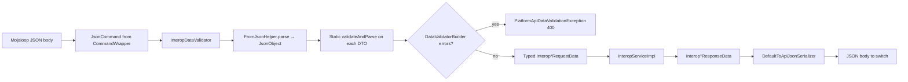

`InteropDataValidator`, together with the family of `Interop*RequestData` / `Interop*ResponseData` classes, is the **Apache Fineract** layer that turns inbound Mojaloop‑style JSON into typed Java objects (and back). Every interop write endpoint funnels through one of `InteropDataValidator.validateAndParse...` methods, which validate, parse, and *only then* hand the request to a command handler. The matching `*ResponseData` classes are serialized back via the platform's default GSON serializer.

The pipeline is opinionated: it shares one `DataValidatorBuilder` per request, accumulates errors into a single list, and throws `PlatformApiDataValidationException` (HTTP 400) if any are present. Code lives in `org.apache.fineract.interoperation` under `fineract-provider`. For the domain types it produces and consumes see [`/interop/interop-domain`](/interop/interop-domain); for the REST shape see [`/interop/interop-api`](/interop/interop-api).

## Packages at a glance

| Sub‑package | Contents |
| --- | --- |
| `interoperation.serialization` | `InteropDataValidator` — the single entry point used by handlers and the API resource |
| `interoperation.data` | All request and response DTOs (each `Interop*Data` class) |
| `interoperation.util` | `InteropUtil` — parameter name constants, action constants, default locale |

## `InteropDataValidator` — the orchestrator

```java
@Component
public class InteropDataValidator {

    private final FromJsonHelper jsonHelper;

    @Autowired
    public InteropDataValidator(final FromJsonHelper fromJsonHelper) {
        this.jsonHelper = fromJsonHelper;
    }

    public InteropTransferRequestData validateAndParseTransferRequest(JsonCommand command) {
        final DataValidatorBuilder dataValidator = new DataValidatorBuilder(new ArrayList<>()).resource("interoperation.transfer");
        JsonObject element = extractJsonObject(command);
        InteropTransferRequestData result = InteropTransferRequestData.validateAndParse(dataValidator, element, jsonHelper);
        throwExceptionIfValidationWarningsExist(dataValidator);
        return result;
    }

    public InteropIdentifierRequestData validateAndParseCreateIdentifier(@NotNull InteropIdentifierType idType, @NotNull String idValue,
            String subIdOrType, JsonCommand command) {
        final DataValidatorBuilder dataValidator = new DataValidatorBuilder(new ArrayList<>()).resource("interoperation.identifier");
        JsonObject element = extractJsonObject(command);
        InteropIdentifierRequestData result = InteropIdentifierRequestData.validateAndParse(dataValidator, idType, idValue, subIdOrType,
                element, jsonHelper);
        throwExceptionIfValidationWarningsExist(dataValidator);
        return result;
    }

    public InteropTransactionRequestData validateAndParseCreateRequest(JsonCommand command) { /* ... */ }
    public InteropQuoteRequestData       validateAndParseCreateQuote(JsonCommand command)   { /* ... */ }
    public InteropTransferRequestData    validateAndParsePrepareTransfer(JsonCommand command) {
        return validateAndParseCreateTransfer(command);
    }
    public InteropTransferRequestData    validateAndParseCreateTransfer(JsonCommand command) { /* ... */ }

    private JsonObject extractJsonObject(JsonCommand command) {
        String json = command.json();
        if (StringUtils.isBlank(json)) {
            throw new InvalidJsonException();
        }
        final JsonElement element = jsonHelper.parse(json);
        return element.getAsJsonObject();
    }

    private void throwExceptionIfValidationWarningsExist(DataValidatorBuilder dataValidator) {
        if (dataValidator.hasError()) {
            throw new PlatformApiDataValidationException("validation.msg.validation.errors.exist",
                    "Validation errors exist.", dataValidator.getDataValidationErrors());
        }
    }
}
```

Each method follows the same template:

1. Construct a fresh `DataValidatorBuilder` keyed by a `resource` tag (`interoperation.transfer`, `interoperation.quote`, …). The resource tag prefixes every parameter error.
2. Extract the request `JsonObject` (or throw `InvalidJsonException`).
3. Delegate to the matching DTO's static `validateAndParse(...)` factory.
4. After all parameters have been examined, throw `PlatformApiDataValidationException` if any error accumulated.

Notice that **`validateAndParse` always runs to completion** — it does *not* short‑circuit on the first error. This is so the client receives the full list of bad fields in one round trip.

`validateAndParsePrepareTransfer` and `validateAndParseCreateTransfer` share an implementation. The Mojaloop wire format does not distinguish prepare vs. commit payloads — the action lives in a URL query parameter parsed by `InteropApiResource`.

## How the API resource calls it

The resource itself is thin:

```java
@POST
@Path("/transfers")
public String performTransfer(@QueryParam("action") @DefaultValue(...) String action,
                              @Context UriInfo uriInfo, String apiRequestBodyAsJson) {
    CommandWrapper wrapper = InteropWrapperBuilder.forAction(action).withJson(apiRequestBodyAsJson).build();
    CommandProcessingResult result = commandsSourceWritePlatformService.logCommandSource(wrapper);
    return jsonSerializer.serialize(result);
}
```

The validation happens inside the command handler:

```java
@Service
@CommandType(entity = ENTITY_NAME_TRANSFER, action = ACTION_TRANSFER_PREPARE)
public class PrepareInteropTransferHandler implements NewCommandSourceHandler {

    @Override
    public CommandProcessingResult processCommand(JsonCommand command) {
        return interopService.prepareTransfer(command);
    }
}

// inside InteropServiceImpl.prepareTransfer:
InteropTransferRequestData request = dataValidator.validateAndParsePrepareTransfer(command);
```

So the flow per write endpoint is **API → CommandWrapper → handler → InteropService → InteropDataValidator → typed DTO → domain work**.

## Inheritance: `InteropRequestData` at the root

Five of the request DTOs share a common parent, `InteropRequestData`, which knows how to parse the fields every interop write request has:

| Field | Source | Notes |
| --- | --- | --- |
| `transactionCode` | `transactionCode` | Mandatory; uniquely identifies the underlying transaction |
| `requestCode` | `requestCode` | Optional on transfers, required on transaction requests |
| `accountId` | `accountId` | Mandatory; the local savings account being affected |
| `amount` | `amount` (a nested `MoneyData`) | Mandatory; positive |
| `transactionRole` | `transactionRole` | Defaults to `PAYER` if absent |
| `transactionType` | `transactionType` (a nested `InteropTransactionTypeData`) | Carries scenario, initiator, sub‑scenario |
| `note` | `note` | Free text |
| `geoCode` | `geoCode` | Optional GPS pair |
| `expiration` | `expiration` (ISO‑8601 datetime) | Optional; defaults to `null` |
| `extensionList` | `extensionList` | Array of `(key, value)` for Mojaloop extensions |

The static parser:

```java
public static InteropRequestData validateAndParse(DataValidatorBuilder dataValidator, JsonObject element, FromJsonHelper jsonHelper) {
    if (element == null) return null;

    String transactionCode = jsonHelper.extractStringNamed(PARAM_TRANSACTION_CODE, element);
    DataValidatorBuilder dataValidatorCopy = dataValidator.reset().parameter(PARAM_TRANSACTION_CODE).value(transactionCode).notBlank();

    String requestCode = jsonHelper.extractStringNamed(PARAM_REQUEST_CODE, element);

    String accountId = jsonHelper.extractStringNamed(PARAM_ACCOUNT_ID, element);
    dataValidatorCopy = dataValidatorCopy.reset().parameter(PARAM_ACCOUNT_ID).value(accountId).notBlank();

    JsonObject moneyElement = jsonHelper.extractJsonObjectNamed(PARAM_AMOUNT, element);
    dataValidatorCopy = dataValidatorCopy.reset().parameter(PARAM_AMOUNT).value(moneyElement).notNull();
    dataValidator.merge(dataValidatorCopy);
    MoneyData amount = MoneyData.validateAndParse(dataValidator, moneyElement, jsonHelper);

    JsonObject transactionTypeElement = jsonHelper.extractJsonObjectNamed(PARAM_TRANSACTION_TYPE, element);
    InteropTransactionTypeData transactionType = InteropTransactionTypeData.validateAndParse(dataValidator, transactionTypeElement, jsonHelper);

    String transactionRoleString = jsonHelper.extractStringNamed(PARAM_TRANSACTION_ROLE, element);
    InteropTransactionRole transactionRole = transactionRoleString == null ? InteropTransactionRole.PAYER
            : InteropTransactionRole.valueOf(transactionRoleString);

    String note = jsonHelper.extractStringNamed(PARAM_NOTE, element);

    JsonObject geoCodeElement = jsonHelper.extractJsonObjectNamed(PARAM_GEO_CODE, element);
    GeoCodeData geoCode = GeoCodeData.validateAndParse(dataValidator, geoCodeElement, jsonHelper);

    String locale = jsonHelper.extractStringNamed(PARAM_LOCALE, element);
    LocalDateTime expiration = locale == null
            ? jsonHelper.extractLocalDateTimeNamed(PARAM_EXPIRATION, element, ISO8601_DATE_TIME_FORMAT, DEFAULT_LOCALE)
            : jsonHelper.extractLocalDateTimeNamed(PARAM_EXPIRATION, element);

    JsonArray extensionArray = jsonHelper.extractJsonArrayNamed(PARAM_EXTENSION_LIST, element);
    ArrayList<ExtensionData> extensionList = null;
    if (extensionArray != null) {
        extensionList = new ArrayList<>(extensionArray.size());
        for (JsonElement jsonElement : extensionArray) {
            if (jsonElement.isJsonObject()) {
                extensionList.add(ExtensionData.validateAndParse(dataValidator, jsonElement.getAsJsonObject(), jsonHelper));
            }
        }
    }

    return dataValidator.hasError() ? null
            : new InteropRequestData(transactionCode, requestCode, accountId, amount, transactionRole, transactionType, note, geoCode,
                    expiration, extensionList);
}
```

Two patterns worth noting:

- **`dataValidatorCopy = dataValidator.reset().parameter(...).value(...).notBlank()` ... `dataValidator.merge(dataValidatorCopy)`** — `DataValidatorBuilder` is a *fluent* builder that mutates an internal "current parameter" pointer. To check N independent fields you reset the pointer for each one and then merge into the parent. This is what lets the parser accumulate errors for every field rather than stopping at the first.
- **Locale awareness** — when `locale` is absent the parser uses `DEFAULT_LOCALE` (`Locale.US`) and the platform's `ISO8601_DATE_TIME_FORMAT`. When `locale` is present, the platform's own `extractLocalDateTimeNamed` reads the format from the JSON itself (must include `dateFormat`).

## Subclass DTOs



### `InteropQuoteRequestData`

Adds three quote‑specific fields:

```java
public class InteropQuoteRequestData extends InteropRequestData {

    static final String[] PARAMS = { PARAM_TRANSACTION_CODE, PARAM_REQUEST_CODE, PARAM_ACCOUNT_ID, PARAM_AMOUNT, PARAM_TRANSACTION_TYPE,
            PARAM_TRANSACTION_ROLE, PARAM_NOTE, PARAM_GEO_CODE, PARAM_EXPIRATION, PARAM_EXTENSION_LIST, PARAM_QUOTE_CODE, PARAM_AMOUNT_TYPE,
            PARAM_FEES, PARAM_LOCALE, PARAM_DATE_FORMAT };

    @NotNull private final String quoteCode;
    @NotNull private final InteropAmountType amountType;
    private final MoneyData fees; // disclosed payer fees on the payee side
}
```

`amountType` is `SEND` vs `RECEIVE` (see [`/interop/interop-domain`](/interop/interop-domain)). The optional `fees` represents disclosed‑in‑advance payer fees passed across to the payee FSP — used in interchange settlements.

### `InteropTransferRequestData`

Adds the `transferCode` (the Mojaloop‑assigned transfer identifier) and FSP charges:

```java
public class InteropTransferRequestData extends InteropRequestData {

    static final String[] PARAMS = { PARAM_TRANSACTION_CODE, PARAM_ACCOUNT_ID, PARAM_AMOUNT, PARAM_TRANSACTION_ROLE, PARAM_TRANSACTION_TYPE,
            PARAM_NOTE, PARAM_EXPIRATION, PARAM_EXTENSION_LIST, PARAM_TRANSFER_CODE, PARAM_FSP_FEE, PARAM_FSP_COMMISSION, PARAM_LOCALE,
            PARAM_DATE_FORMAT };

    @NotNull private final String transferCode;
    private MoneyData fspFee;
    private MoneyData fspCommission;
}
```

Note `transferCode` is `@NotNull` — both prepare and commit (and release) phases carry the same transfer code, which is what lets the FSP correlate hold and settlement.

### `InteropIdentifierRequestData`

The identifier write request is unusual — most fields come from the URL path, not the body:

```java
public class InteropIdentifierRequestData {

    static final String[] PARAMS = { PARAM_ACCOUNT_ID };

    @NotEmpty private final InteropIdentifierType idType;   // from path
    @NotEmpty private final String idValue;                  // from path
    private final String subIdOrType;                        // from path
    @NotEmpty private final String accountId;                // from body

    public static InteropIdentifierRequestData validateAndParse(DataValidatorBuilder dataValidator,
            InteropIdentifierType idType, String idValue, String subIdOrType, JsonObject element, FromJsonHelper jsonHelper) {
        if (element == null) return null;

        jsonHelper.checkForUnsupportedParameters(element, Arrays.asList(PARAMS));

        String accountId = jsonHelper.extractStringNamed(PARAM_ACCOUNT_ID, element);
        DataValidatorBuilder dataValidatorCopy = dataValidator.reset().parameter(PARAM_ACCOUNT_ID).value(accountId).notBlank();

        dataValidator.merge(dataValidatorCopy);
        return dataValidator.hasError() ? null : new InteropIdentifierRequestData(idType, idValue, subIdOrType, accountId);
    }
}
```

`checkForUnsupportedParameters(...)` is the platform pattern for **strict** validation: any JSON key not in `PARAMS` causes a 400 immediately. This is a defence against typos that would otherwise be silently ignored.

## `InteropTransactionTypeData` — the inner classifier

A `transactionType` object is required on most write requests:

```json
{
  "transactionType": {
    "scenario": "TRANSFER",
    "subScenario": "PAYMENT",
    "initiator": "PAYER",
    "initiatorType": "CONSUMER",
    "balanceOfPayments": "100"
  }
}
```

The DTO:

```java
public class InteropTransactionTypeData {

    public static final List<String> PARAMS = List.copyOf(Arrays.asList(PARAM_SCENARIO, PARAM_SUB_SCENARIO, PARAM_INITIATOR,
            PARAM_INITIATOR_TYPE, PARAM_REFUND_INFO, PARAM_BALANCE_OF_PAYMENTS));

    @NotNull private final InteropTransactionScenario scenario;
    private final String subScenario;
    @NotNull private final InteropTransactionRole initiator;
    @NotNull private final InteropInitiatorType initiatorType;
    @Valid  private InteropRefundData refundInfo;
    private String balanceOfPayments;
}
```

Three things to note:

- The four enums (`scenario`, `initiator`, `initiatorType`, plus the outer `role`) together drive fee tables and KYC checks downstream.
- `refundInfo` is only populated when `scenario == REFUND`.
- `balanceOfPayments` is an IMF BoP code — three digits — used in cross‑border interchange reporting.

## `MoneyData`

The base monetary type:

```java
public class MoneyData {

    public static final List<String> PARAMS = List.copyOf(Arrays.asList(PARAM_AMOUNT, PARAM_CURRENCY, PARAM_LOCALE));

    @NotNull private final BigDecimal amount;
    @NotNull private final String currency;

    public static MoneyData validateAndParse(DataValidatorBuilder dataValidator, JsonObject element, FromJsonHelper jsonHelper) {
        if (element == null) return null;

        jsonHelper.checkForUnsupportedParameters(element, PARAMS);

        String locale = jsonHelper.extractStringNamed(PARAM_LOCALE, element);
        BigDecimal amount = locale == null
                ? jsonHelper.extractBigDecimalNamed(PARAM_AMOUNT, element, DEFAULT_LOCALE)
                : jsonHelper.extractBigDecimalWithLocaleNamed(PARAM_AMOUNT, element);
        DataValidatorBuilder dataValidatorCopy = dataValidator.reset().parameter(PARAM_AMOUNT)
                .value(amount).notBlank().zeroOrPositiveAmount();
        // ... currency
    }

    public void normalizeAmount(MonetaryCurrency currency) {
        if (!currency.getCode().equals(this.currency)) {
            throw new UnsupportedOperationException("Internal error: Invalid currency " + currency.getCode());
        }
        MathUtil.normalizeAmount(amount, currency);
    }
}
```

`normalizeAmount(currency)` is called by the request DTOs **after** the associated `SavingsAccount` is resolved — it scales the `BigDecimal` to the account's currency precision (e.g. 2 decimal places for `USD`). The runtime check guards against wire payloads whose `currency` does not match the account's currency.

## Response DTOs

The response side is straightforward — POJOs serialized by Fineract's default GSON setup (`DefaultToApiJsonSerializer<T>`). Naming convention is `Interop<Action>ResponseData`:

| DTO | Purpose | Key fields |
| --- | --- | --- |
| `InteropAccountData` (in `fineract-savings`) | `GET /accounts/{accountId}` | `accountId`, `savingProductId`, `currency`, `accountBalance`, `availableBalance`, `status`, `subStatus`, `accountType`, `depositType`, `identifiers` |
| `InteropIdentifiersResponseData` | `GET /accounts/{accountId}/identifiers` | List of `InteropIdentifierData` |
| `InteropIdentifierAccountResponseData` | `GET /parties/{type}/{value}` | The resolved account id |
| `InteropTransactionsData` | `GET /accounts/{accountId}/transactions` | Paginated savings transactions, filtered by debit/credit/time |
| `InteropTransactionRequestResponseData` | After creating a transaction request | `transactionCode`, `requestCode`, `state`, `expiration` |
| `InteropQuoteResponseData` | After creating a quote | `quoteCode`, `state`, `transferAmount`, `payeeReceiveAmount`, `fees`, `expiration` |
| `InteropTransferResponseData` | After each transfer action | `transferCode`, `state` (`ACCEPTED`/`REJECTED`), `completedTimestamp` |
| `InteropKycResponseData` | `GET /accounts/{accountId}/kyc` | `subjectName`, `idDocuments`, etc. |

These classes extend `CommandProcessingResult` in some cases (like `InteropAccountData`) so they piggy‑back on the platform's command result envelope.

### `InteropAccountData` (the read‑side wide DTO)

```java
public class InteropAccountData extends CommandProcessingResult {

    @NotNull private final String accountId;
    @NotNull private final String savingProductId;
    @NotNull private final String productName;
    @NotNull private final String shortProductName;
    @NotNull private final String currency;
    @NotNull private final BigDecimal accountBalance;
    @NotNull private final BigDecimal availableBalance;
    @NotNull private final SavingsAccountStatusType status;
    private final SavingsAccountSubStatusEnum subStatus;
    private final AccountType accountType;       // Individual / JLG / Group
    private final DepositAccountType depositType; // Savings / FD / RD
    @NotNull private final LocalDate activatedOn;
    private final LocalDate statusUpdateOn;
    private final LocalDate withdrawnOn;
    private final LocalDate balanceOn;
    @NotNull private List<InteropIdentifierData> identifiers;
}
```

This DTO lives in `fineract-savings` (not `fineract-provider`) precisely because it composes types from the savings module (`SavingsAccountStatusType`, `DepositAccountType`, `SavingsProduct`). The static `build(SavingsAccount account)` factory is the canonical constructor and is invoked by `InteropServiceImpl.getAccountDetails(...)`.

## GSON wiring

Fineract uses a globally configured GSON instance accessed via `FromJsonHelper`. Two relevant behaviours:

- **No bespoke deserializers.** Interop DTOs are never deserialized by GSON in one shot — every request goes through `validateAndParse`, which manually pulls each field via `jsonHelper.extractStringNamed(...)` etc. This makes the validation explicit and error messages precise.
- **GSON serializes responses directly** — `DefaultToApiJsonSerializer<T>.serialize(result)` walks fields with the default GSON adapters, optionally filtering by `ApiRequestParameterHelper.process(uriInfo.getQueryParameters())` for the standard `pretty`, `tenantIdentifier`, `fields` parameters.



## Parameter name constants

All field names are constants in `InteropUtil` to avoid stringly‑typed drift:

```java
public static final String PARAM_TRANSACTION_CODE = "transactionCode";
public static final String PARAM_REQUEST_CODE     = "requestCode";
public static final String PARAM_QUOTE_CODE       = "quoteCode";
public static final String PARAM_TRANSFER_CODE    = "transferCode";
public static final String PARAM_ACCOUNT_ID       = "accountId";
public static final String PARAM_AMOUNT_TYPE      = "amountType";
public static final String PARAM_AMOUNT           = "amount";
public static final String PARAM_FEES             = "fees";
public static final String PARAM_FSP_FEE          = "fspFee";
public static final String PARAM_FSP_COMMISSION   = "fspCommission";
public static final String PARAM_TRANSACTION_TYPE = "transactionType";
public static final String PARAM_TRANSACTION_ROLE = "transactionRole";
// ... and so on for scenario, initiator, geoCode, expiration, etc.
```

The action codes — used by `InteropApiResource` to dispatch on the `?action=` query — are also in `InteropUtil`:

```java
public static final String ACTION_TRANSFER_PREPARE = "PREPARE";
public static final String ACTION_TRANSFER_COMMIT  = "CREATE";
public static final String ACTION_TRANSFER_RELEASE = "RELEASE";
```

Note the wire spelling: `CREATE` is the commit action, *not* `COMMIT`. This matches the Mojaloop spec.

## Error envelope

Every validation failure ends up as a `PlatformApiDataValidationException`, which the global `ExceptionMapper` (in `fineract-provider`) renders as:

```json
{
  "developerMessage": "Validation errors exist.",
  "userMessageGlobalisationCode": "validation.msg.validation.errors.exist",
  "defaultUserMessage": "Validation errors exist.",
  "userMessage": "Validation errors exist.",
  "errors": [
    {
      "developerMessage": "transactionCode must not be blank.",
      "defaultUserMessage": "transactionCode must not be blank.",
      "userMessageGlobalisationCode": "validation.msg.interoperation.transfer.transactionCode.cannot.be.blank",
      "parameterName": "transactionCode"
    },
    ...
  ]
}
```

The `userMessageGlobalisationCode` prefix is the `resource` tag from the validator (`interoperation.transfer`), which is why each `validateAndParse...` method picks a distinct resource name — it ensures errors are namespaced for UI translation.

## Locale handling for amounts and dates

`MoneyData.validateAndParse` and `InteropRequestData.validateAndParse` both branch on whether the JSON carries a `locale` field:

- **No `locale`** — the parser uses `DEFAULT_LOCALE = Locale.US` and `ISO8601_DATE_TIME_FORMAT = "yyyy-MM-dd'T'HH:mm:ss.SSS[-HH:MM]"`. This is the default Mojaloop wire convention.
- **`locale` present** — both `dateFormat` and `locale` must be present; the parser uses them. This path supports tenants that want to send localised numbers and dates over the inter‑op channel.

Practically, every Mojaloop‑integrated production deployment omits `locale` entirely and relies on the ISO defaults.

## Adding a new DTO

The convention to extend the interop surface:

1. Add a new `Interop<Thing>RequestData` class in `interoperation.data` with a `static validateAndParse(DataValidatorBuilder, JsonObject, FromJsonHelper)` method.
2. Declare a `static final String[] PARAMS = { ... }` listing all accepted keys and call `jsonHelper.checkForUnsupportedParameters(...)` first.
3. Add a `validateAndParse<Thing>` method on `InteropDataValidator` that constructs a `DataValidatorBuilder` with the right `resource` tag, calls the DTO factory, and triggers `throwExceptionIfValidationWarningsExist`.
4. Wire a handler under `org.apache.fineract.interoperation.handler` with `@CommandType(entity = ..., action = ...)` and inject `InteropService` to delegate.
5. Add the matching response DTO and a `DefaultToApiJsonSerializer<T>` call in the API resource.

The pattern is intentionally repetitive: it favours readability over abstraction. New DTOs that follow the template are easy to review.

## See also

- [`/interop/overview`](/interop/overview) — module orientation.
- [`/interop/interop-api`](/interop/interop-api) — endpoint‑by‑endpoint reference for the resource that calls these validators.
- [`/interop/interop-domain`](/interop/interop-domain) — the enums and JPA entity that the DTOs reference.
- `/core/serialization-and-json` (if present) — the platform `FromJsonHelper`, `DataValidatorBuilder`, and exception model used here.
- `/savings/savings-account-domain` — `SavingsAccount` and the related types embedded in `InteropAccountData`.
