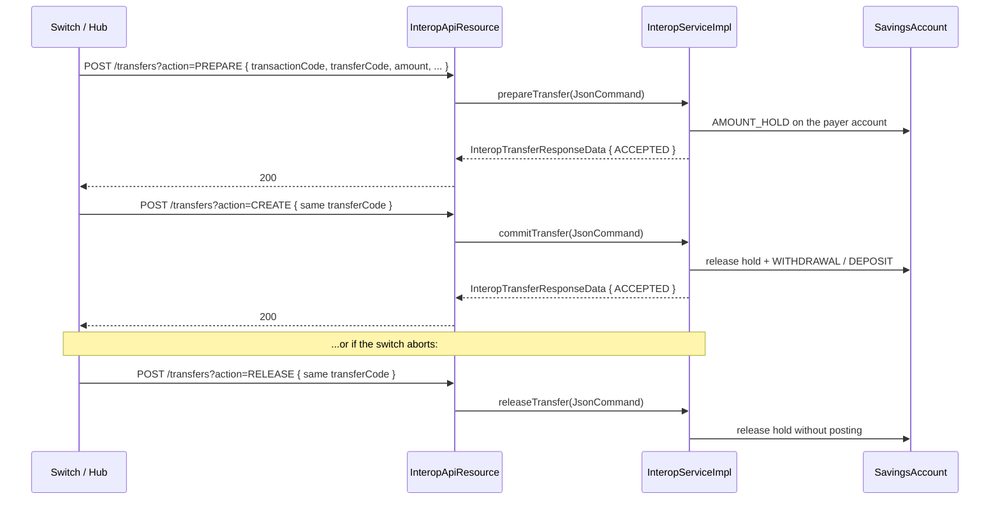
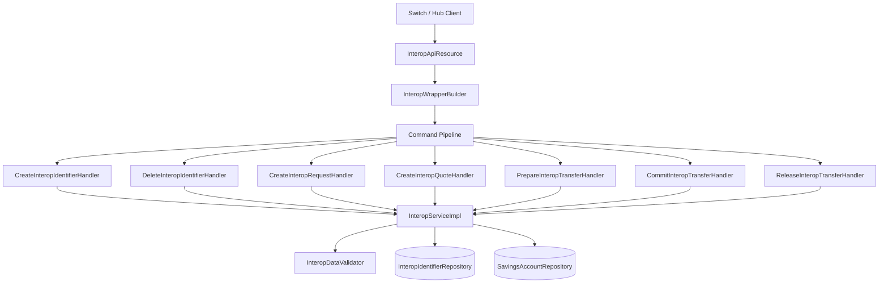

Fineract's interoperation module implements a Mojaloop-style FSP (Financial
Service Provider) interface so that the platform can register secondary
identifiers (MSISDN, IBAN, email…) for its savings accounts, respond to
party lookups, calculate quotes for transfers, and prepare/commit/release
two-phase transfers across mobile-money or open-banking networks. The
REST surface is implemented in
`org.apache.fineract.interoperation.api.InteropApiResource`
(`fineract-provider`), the canonical `InteropIdentifierType` enum lives in
`fineract-core`, and the savings-bound entities (`InteropIdentifier`,
`InteropTransferActionType` etc.) live in `fineract-savings`.

## Packages and modules

| Package | Module | Purpose |
| --- | --- | --- |
| `org.apache.fineract.interoperation.domain` | `fineract-core` | `InteropIdentifierType` (the secondary identifier kind enum) |
| `org.apache.fineract.interoperation.domain` | `fineract-savings` | `InteropIdentifier` JPA entity (`interop_identifier`), state enums (`InteropActionState`, `InteropAmountType`, `InteropInitiatorType`, `InteropTransactionRole`, `InteropTransactionScenario`, `InteropTransferActionType`) |
| `org.apache.fineract.interoperation.api` | `fineract-provider` | `InteropApiResource` (`/v1/interoperation`) + `InteropWrapperBuilder` |
| `org.apache.fineract.interoperation.domain` | `fineract-provider` | `InteropIdentifierRepository` (Spring Data) |
| `org.apache.fineract.interoperation.data` | `fineract-provider` | Request/response DTOs for identifiers, parties, quotes, transfers, KYC, accounts |
| `org.apache.fineract.interoperation.service` | `fineract-provider` | `InteropService` interface, `InteropServiceImpl` (savings-side execution) |
| `org.apache.fineract.interoperation.serialization` | `fineract-provider` | `InteropDataValidator` — `validateAndParse...` for each request type |
| `org.apache.fineract.interoperation.handler` | `fineract-provider` | `CreateInteropIdentifierHandler`, `DeleteInteropIdentifierHandler`, `CreateInteropRequestHandler`, `CreateInteropQuoteHandler`, `PrepareInteropTransferHandler`, `CommitInteropTransferHandler`, `ReleaseInteropTransferHandler` |
| `org.apache.fineract.interoperation.util` | `fineract-provider` | `InteropUtil` — JSON parameter name constants, entity names, default routing code |
| `org.apache.fineract.interoperation.exception` | `fineract-provider` | `InteropAccountNotFoundException`, `InteropAccountTransactionNotAllowedException`, `InteropKycDataNotFoundException`, `InteropTransferAlreadyCommittedException`, `InteropTransferAlreadyOnHoldException`, `InteropTransferMissingException` |
| `org.apache.fineract.interoperation.starter` | `fineract-provider` | `InteroperationConfiguration` Spring configuration |

The split between `fineract-core` and `fineract-savings` exists because
the `InteropIdentifierType` enum is needed at the request/response level
(no JPA), while the actual `InteropIdentifier` entity has a `@ManyToOne` to
`SavingsAccount` which lives in `fineract-savings`.

## Roles, scenarios, and identifier types

Source enums:

```java
// fineract-savings
public enum InteropTransactionRole   { PAYER, PAYEE; }
public enum InteropTransactionScenario { DEPOSIT, WITHDRAWAL, TRANSFER, PAYMENT, REFUND; }
public enum InteropTransferActionType { PREPARE, CREATE, RELEASE; }
public enum InteropAmountType         { SEND, RECEIVE; }
public enum InteropActionState        { ACCEPTED, REJECTED; }
public enum InteropInitiatorType      { CONSUMER, AGENT, BUSINESS, DEVICE; }

// fineract-core
public enum InteropIdentifierType {
    MSISDN, EMAIL, PERSONAL_ID, BUSINESS, DEVICE, ACCOUNT_ID, IBAN, ALIAS, BBAN;
}
```

`InteropTransactionRole.isWithdraw()` and `.getTransactionType()` map the
role into the matching `SavingsAccountTransactionType` (`WITHDRAWAL` for
`PAYER`, `DEPOSIT` for `PAYEE`) — this is the bridge that keeps Mojaloop
semantics aligned with savings-account postings.

## REST endpoint map

| Method | Path | Purpose |
| --- | --- | --- |
| `GET` | `/v1/interoperation/health` | Trivial health probe returning `"OK"` |
| `GET` | `/v1/interoperation/accounts/{accountId}` | Account details |
| `GET` | `/v1/interoperation/accounts/{accountId}/transactions` | Account transactions (filter by debit/credit, booking time range) |
| `GET` | `/v1/interoperation/accounts/{accountId}/identifiers` | All registered identifiers for the account |
| `GET` | `/v1/interoperation/accounts/{accountId}/kyc` | KYC data for the account holder |
| `GET` | `/v1/interoperation/parties/{idType}/{idValue}` | Account by secondary identifier |
| `GET` | `/v1/interoperation/parties/{idType}/{idValue}/{subIdOrType}` | Account by sub-identifier |
| `POST` | `/v1/interoperation/parties/{idType}/{idValue}` | Register identifier (command: `CREATE INTERID`) |
| `POST` | `/v1/interoperation/parties/{idType}/{idValue}/{subIdOrType}` | Register sub-identifier |
| `DELETE` | `/v1/interoperation/parties/{idType}/{idValue}` | Deregister identifier (`DELETE INTERID`) |
| `DELETE` | `/v1/interoperation/parties/{idType}/{idValue}/{subIdOrType}` | Deregister sub-identifier |
| `GET` | `/v1/interoperation/transactions/{transactionCode}/requests/{requestCode}` | Query transaction request |
| `POST` | `/v1/interoperation/requests` | Create transaction request (`CREATE INTERREQUEST`) |
| `GET` | `/v1/interoperation/transactions/{transactionCode}/quotes/{quoteCode}` | Query quote |
| `POST` | `/v1/interoperation/quotes` | Create quote (`CREATE INTERQUOTE`) |
| `GET` | `/v1/interoperation/transactions/{transactionCode}/transfers/{transferCode}` | Query transfer |
| `POST` | `/v1/interoperation/transfers?action=PREPARE\|CREATE\|RELEASE` | Two-phase transfer (`PREPARE`/`CREATE`/`RELEASE` INTERTRANSFER) |
| `POST` | `/v1/interoperation/transactions/{accountId}/disburse` | Disburse loan from the account |
| `POST` | `/v1/interoperation/transactions/{accountId}/loanrepayment` | Loan repayment from the account |

## Two-phase transfer lifecycle

Mojaloop transfers in Fineract follow the standard PREPARE/CREATE/RELEASE
sequence. The `action` query parameter on `POST /v1/interoperation/transfers`
distinguishes them:



| Phase | Service method | Savings effect |
| --- | --- | --- |
| `PREPARE` | `prepareTransfer` | `SavingsAccountTransactionType.AMOUNT_HOLD` for the quoted amount |
| `CREATE` | `commitTransfer` | Release the hold and post `WITHDRAWAL` (payer) or `DEPOSIT` (payee) |
| `RELEASE` | `releaseTransfer` | Release the hold without posting |

Each phase is dispatched by its handler:

- `PrepareInteropTransferHandler` (`@CommandType(entity = "INTERTRANSFER", action = "PREPARE")`)
- `CommitInteropTransferHandler` (`@CommandType(entity = "INTERTRANSFER", action = "CREATE")`)
- `ReleaseInteropTransferHandler` (`@CommandType(entity = "INTERTRANSFER", action = "RELEASE")`)

## InteropUtil constants

Source: `interoperation/util/InteropUtil.java`. The single source of truth
for JSON parameter names and entity strings used by `InteropWrapperBuilder`
and `InteropDataValidator`.

| Constant | Value |
| --- | --- |
| `ROOT_PATH` | `"interoperation"` |
| `DEFAULT_ROUTING_CODE` | `"INTEROPERATION"` |
| `ENTITY_NAME_IDENTIFIER` | `"INTERID"` |
| `ENTITY_NAME_REQUEST` | `"INTERREQUEST"` |
| `ENTITY_NAME_QUOTE` | `"INTERQUOTE"` |
| `ENTITY_NAME_TRANSFER` | `"INTERTRANSFER"` |
| `ACTION_TRANSFER_PREPARE` | `"PREPARE"` |
| `ACTION_TRANSFER_COMMIT` | `"CREATE"` |
| `ACTION_TRANSFER_RELEASE` | `"RELEASE"` |

These names align with the `@CommandType` annotations on the handler
classes.

## Component map



Reads (`GET`) skip the command pipeline and call `InteropService` directly
through the `InteropApiResource`.

## Where it integrates

- **Savings**: `InteropServiceImpl` posts `SavingsAccountTransactionType.AMOUNT_HOLD`,
  `WITHDRAWAL`, and `DEPOSIT` transactions through `SavingsAccountDomainService`.
- **Loans**: `disburseLoan` and `loanRepayment` build commands via
  `builder.disburseLoanApplication(loanId)` /
  `builder.loanRepaymentTransaction(loanId)` and route through the standard
  loan command pipeline.
- **Currencies**: requests carry `MoneyData(amount, currency)`; the service
  resolves an `ApplicationCurrency` via `ApplicationCurrencyRepository`.
- **Audit / commands**: every write phase is wrapped in a `CommandWrapper`
  by `InteropWrapperBuilder` and audited like any other command — see
  [Commands framework](/command/overview).

## Permissions

The resource calls `context.authenticatedUser().validateHasReadPermission(...)`
for read paths (`INTERREQUEST`, `INTERQUOTE`). Writes are subject to the
permission resolution baked into the command pipeline. Operators should
provision a dedicated AppUser per switch participant — see
[user administration domain](/core/useradministration-domain).

## What this module does NOT do

- It does **not** implement Mojaloop ALS (Account Lookup Service) ↔ Switch
  HTTP proxying. The REST surface is the FSP-side endpoint. A separate
  connector or "payment hub" component sits in front to perform message
  signing, ILP packet parsing, etc.
- It does **not** maintain its own ledger; postings land on
  `SavingsAccount` / `Loan` tables.
- The `InteropIdentifier` table is unique on `(account_id, type)` and
  `(type, value, sub_value_or_type)`, but Fineract does not enforce
  cross-tenant uniqueness — switches typically partition by routing prefix.

## Where to go next

- [Interop API](/interop/interop-api) — endpoint-by-endpoint reference
- [Interop domain](/interop/interop-domain) — entity model and enums
- [Interop serialization](/interop/interop-serialization) — request shapes
  and `InteropDataValidator`
- [Commands framework](/command/overview)
- [Portfolio shared domain](/core/portfolio-shared-domain) — savings &
  loan entities used downstream
- [User administration domain](/core/useradministration-domain) — auth
  context for the resource
