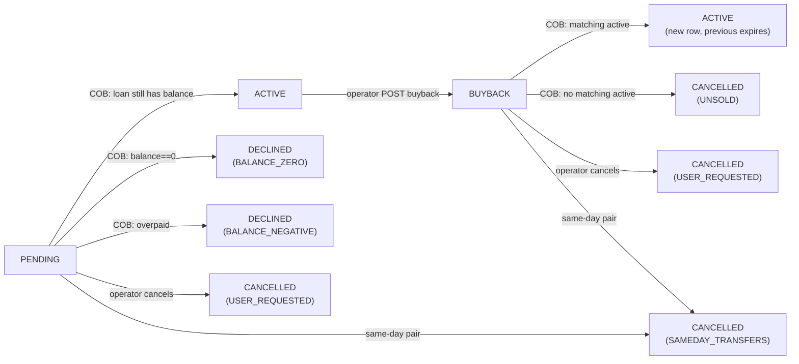
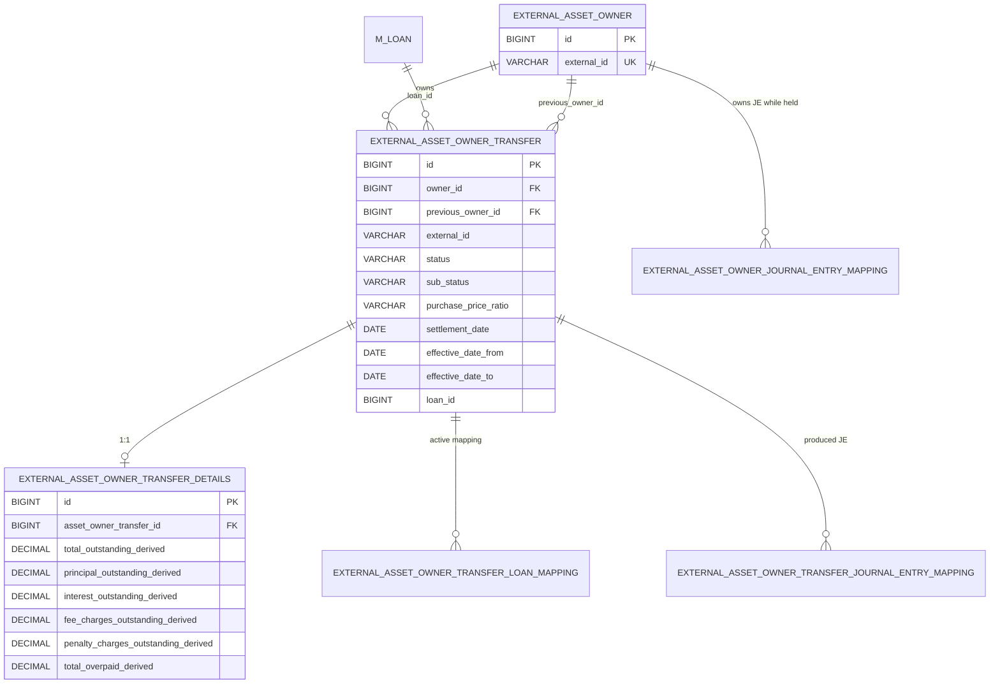

The `fineract-investor` module ships only a handful of JPA entities, but they collectively form the bookkeeping spine of Apache Fineract's asset-externalization feature. This page documents each of those entities, the `ExternalTransferStatus` / `ExternalTransferSubStatus` enums that drive the state machine, and the `ExternalAssetOwnerTransferDetails` settlement-amount snapshot frozen at execution.

All entities extend `AbstractAuditableWithUTCDateTimeCustom<Long>` from `fineract-core`, so they all get a `Long` primary key plus the `created_on_utc`, `created_by`, `last_modified_on_utc`, `last_modified_by` columns at the root.

<Info>
The entities live in `fineract-investor/src/main/java/org/apache/fineract/investor/domain/`. The status enums live one package over in `fineract-investor/src/main/java/org/apache/fineract/investor/data/`. The Liquibase changelogs that create the `m_external_asset_owner*` tables live in `fineract-investor/src/main/resources/db/changelog/tenant/`.
</Info>

## `ExternalAssetOwner`

`org.apache.fineract.investor.domain.ExternalAssetOwner` is the most minimal entity in the whole module — an owner is just an id and a unique external id. There is no name, no contact info, no settlement-account number. Anything else the host bank wants to know about its investors lives in another system and is keyed by that external id.

```java
// fineract-investor/.../domain/ExternalAssetOwner.java
@Getter @Setter @Entity @NoArgsConstructor
@Table(name = "m_external_asset_owner")
public class ExternalAssetOwner extends AbstractAuditableWithUTCDateTimeCustom<Long> {

    @Column(name = "external_id", nullable = false, length = 100, unique = true)
    private ExternalId externalId;
}
```

The `external_id` column is the natural key. The integration treats it as opaque text up to 100 characters. Owners are created via `POST /v1/external-asset-owners` (handled by `CreateExternalAssetOwnerHandler`), or on demand when the first sale to a previously-unseen owner external id arrives — `ExternalAssetOwnersWriteServiceImpl.getOwner(...)` calls `findByExternalId` and falls back to `findOrCreateOwnerId` if the row is missing. The find-or-create is wrapped in a retry that catches `JpaSystemException` / `DataIntegrityViolationException` with SQLState starting with `23` (integrity-constraint violation) so two concurrent sales to a new owner don't race.

### Repository

```java
// domain/ExternalAssetOwnerRepository.java
public interface ExternalAssetOwnerRepository extends JpaRepository<ExternalAssetOwner, Long>,
        JpaSpecificationExecutor<ExternalAssetOwner> {

    Optional<ExternalAssetOwner> findByExternalId(ExternalId externalId);
}
```

There is no soft-delete and no separate "active" flag — once an owner row exists, it stays in `m_external_asset_owner` forever. Whether a given loan is *currently* owned by it is recorded by the most recent transfer row (see below).

## `ExternalAssetOwnerTransfer`

`org.apache.fineract.investor.domain.ExternalAssetOwnerTransfer` is the central entity. **A transfer is not a snapshot of "who currently owns the loan" — it is the immutable record of a state transition.** Every time the ownership story changes (a sale is requested, a sale executes, a buyback is requested, a buyback executes, a sale is declined or cancelled), a new transfer row is written. The "current" row is the one with `effective_date_to = 9999-12-31`.

```java
// fineract-investor/.../domain/ExternalAssetOwnerTransfer.java
@Getter @Setter @Entity @NoArgsConstructor
@Table(name = "m_external_asset_owner_transfer")
public class ExternalAssetOwnerTransfer extends AbstractAuditableWithUTCDateTimeCustom<Long> {

    @ManyToOne
    @JoinColumn(name = "owner_id", nullable = false)
    private ExternalAssetOwner owner;

    @OneToOne(mappedBy = "externalAssetOwnerTransfer", cascade = CascadeType.ALL)
    private ExternalAssetOwnerTransferDetails externalAssetOwnerTransferDetails;

    @Column(name = "external_id", length = 100, nullable = false)
    private ExternalId externalId;

    @Column(name = "status", length = 50, nullable = false)
    @Enumerated(EnumType.STRING)
    private ExternalTransferStatus status;

    @Column(name = "sub_status", length = 50)
    @Enumerated(EnumType.STRING)
    private ExternalTransferSubStatus subStatus;

    @Column(name = "purchase_price_ratio", length = 50, nullable = false)
    private String purchasePriceRatio;

    @Column(name = "settlement_date", nullable = false)
    private LocalDate settlementDate;

    @Column(name = "effective_date_from", nullable = false)
    private LocalDate effectiveDateFrom;

    @Column(name = "effective_date_to", nullable = false)
    private LocalDate effectiveDateTo;

    @Column(name = "loan_id", nullable = false)
    private Long loanId;

    @Column(name = "external_loan_id", length = 100)
    private ExternalId externalLoanId;

    @Column(name = "external_group_id", length = 100)
    private ExternalId externalGroupId;

    @ManyToOne
    @JoinColumn(name = "previous_owner_id")
    private ExternalAssetOwner previousOwner;
}
```

### Column-by-column

| Column | Type | Source / meaning |
|---|---|---|
| `owner_id` | FK → `m_external_asset_owner.id` | The investor at the *end* of this transfer. For a sale, the new owner; for a buyback, still the investor (because the row records who is *losing* the asset). |
| `external_id` | `VARCHAR(100)` | Caller-supplied `transferExternalId`; auto-generated if omitted. Unique across all transfer rows. |
| `status` | `VARCHAR(50)` | One of `ExternalTransferStatus`. The state machine driver. |
| `sub_status` | `VARCHAR(50)` nullable | Reason for `DECLINED` / `CANCELLED` outcomes, or `null` for live states. |
| `purchase_price_ratio` | `VARCHAR(50)` | Free-form numeric string carried from the request body. Not validated as a number — downstream systems decide whether `"1.05"`, `"105%"`, etc. is valid. |
| `settlement_date` | `DATE` | The business date on which the COB step should activate (or reject) this transfer. Required and must not be in the past at creation time (`ExternalAssetOwnersWriteServiceImpl.validateSettlementDate`). |
| `effective_date_from` | `DATE` | The first business day this row is the source of truth. Set to `today` on creation; reset to `settlement_date + 1` when the COB step activates a pending sale. |
| `effective_date_to` | `DATE` | The last business day this row is the source of truth. Set to `9999-12-31` at creation and overwritten by the COB step (or by the buyback flow) when this row is superseded. |
| `loan_id` | `BIGINT` | The Fineract loan account this transfer applies to. |
| `external_loan_id` | `VARCHAR(100)` | Cached copy of `m_loan.external_id` for read convenience. |
| `external_group_id` | `VARCHAR(100)` nullable | Optional caller-supplied group id to bundle multiple loans into one investor purchase batch (the `transferExternalGroupId` request field). |
| `previous_owner_id` | FK nullable | The owner this loan was held by *before* this transfer. `null` if the loan was on the originator's books. |

### Effective-date convention

Fineract uses the classic open-ended date interval `[effective_date_from, effective_date_to]` to mark which row is "the current truth" without nullable end dates. The sentinel `LocalDate.of(9999, 12, 31)` is hard-coded in two places:

```java
// LoanAccountOwnerTransferBusinessStep.java
public static final LocalDate FUTURE_DATE_9999_12_31 = LocalDate.of(9999, 12, 31);

// ExternalAssetOwnersWriteServiceImpl.java
private static final LocalDate FUTURE_DATE_9999_12_31 = LocalDate.of(9999, 12, 31);
```

The repository's `findActiveByLoanId(loanId)` query uses `effectiveDateTo = 9999-12-31` as the filter for "is currently active". When the COB step needs to retire a row, it calls `expireTransfer(settlementDate, transfer)` which simply sets `effectiveDateTo = settlementDate`.

### Repository

`ExternalAssetOwnerTransferRepository` extends both `JpaRepository<ExternalAssetOwnerTransfer, Long>` and `JpaSpecificationExecutor<ExternalAssetOwnerTransfer>`, which is why the COB step builds dynamic JPA Criteria queries inline:

```java
// LoanAccountOwnerTransferBusinessStep.java
List<ExternalAssetOwnerTransfer> transferDataList = externalAssetOwnerTransferRepository.findAll(
    (root, query, criteriaBuilder) -> criteriaBuilder.and(
        criteriaBuilder.equal(root.get("loanId"), loanId),
        criteriaBuilder.equal(root.get("settlementDate"), settlementDate),
        root.get("status").in(Stream.concat(PENDING_STATUSES.stream(),
                                             BUYBACK_STATUSES.stream()).toList()),
        criteriaBuilder.greaterThanOrEqualTo(root.get("effectiveDateTo"),
                                              FUTURE_DATE_9999_12_31)),
    Sort.by(Sort.Direction.ASC, "id"));
```

Named repository methods exist for the common shapes:

| Method | Purpose |
|---|---|
| `findActiveByLoanId(Long loanId)` | Single row with `status` in `{ACTIVE, ACTIVE_INTERMEDIATE}` and `effective_date_to = 9999-12-31`. |
| `findEffectiveTransfersOrderByIdDesc(Long loanId, LocalDate businessDate)` | All in-flight rows (pending sale + buyback). Used by write-time validations. |
| `deleteByLoanIdAndOwnerTransfer(...)` (on `ExternalAssetOwnerTransferLoanMappingRepository`) | Removes the active mapping when ownership leaves Fineract's books. |

## `ExternalAssetOwnerTransferDetails`

This entity exists because the originator and the investor need to **freeze the settlement amounts at the moment the transfer becomes effective**. The loan account keeps accruing interest after that moment, so `m_loan_summary` is no longer the right answer for "what did the investor actually buy?". `ExternalAssetOwnerTransferDetails` is the one-to-one child snapshot:

```java
// fineract-investor/.../domain/ExternalAssetOwnerTransferDetails.java
@Getter @Entity @NoArgsConstructor
@Table(name = "m_external_asset_owner_transfer_details")
public class ExternalAssetOwnerTransferDetails extends AbstractAuditableWithUTCDateTimeCustom<Long> {

    @Setter
    @OneToOne(cascade = CascadeType.ALL)
    @JoinColumn(name = "asset_owner_transfer_id", referencedColumnName = "id")
    private ExternalAssetOwnerTransfer externalAssetOwnerTransfer;

    @Column(name = "total_outstanding_derived", scale = 6, precision = 19, nullable = false)
    private BigDecimal totalOutstanding;

    @Column(name = "principal_outstanding_derived", ...)        private BigDecimal totalPrincipalOutstanding;
    @Column(name = "interest_outstanding_derived", ...)         private BigDecimal totalInterestOutstanding;
    @Column(name = "fee_charges_outstanding_derived", ...)      private BigDecimal totalFeeChargesOutstanding;
    @Column(name = "penalty_charges_outstanding_derived", ...)  private BigDecimal totalPenaltyChargesOutstanding;
    @Column(name = "total_overpaid_derived", ...)               private BigDecimal totalOverpaid;
    // ... setters keep totalOutstanding consistent
}
```

Every component column has `scale = 6, precision = 19, nullable = false` — six decimal places, balanced ledger amounts only. The setters all coerce `null` to `BigDecimal.ZERO` and recompute `totalOutstanding` after each component write:

```java
private void updateTotalOutstanding() {
    this.totalOutstanding = MathUtil.add(
        getTotalPrincipalOutstanding(),
        getTotalInterestOutstanding(),
        getTotalFeeChargesOutstanding(),
        getTotalPenaltyChargesOutstanding());
}
```

The COB step populates the snapshot in `createAssetOwnerTransferDetails(loan, transfer)`. Note that interest is **not** taken straight from `loan.getSummary().getTotalInterestOutstanding()` — instead the step calls `ExternalAssetOwnerTransferOutstandingInterestCalculation.calculateOutstandingInterest(loan)`, which is a strategy interface so downstream forks can plug in their own valuation (e.g. accrue to settlement date instead of using last-posted accrual).

```java
private ExternalAssetOwnerTransferDetails createAssetOwnerTransferDetails(Loan loan,
        ExternalAssetOwnerTransfer externalAssetOwnerTransfer) {
    ExternalAssetOwnerTransferDetails details = new ExternalAssetOwnerTransferDetails();
    details.setExternalAssetOwnerTransfer(externalAssetOwnerTransfer);
    details.setTotalPrincipalOutstanding(loan.getSummary().getTotalPrincipalOutstanding());
    // We have different strategies to calculate oustanding interest
    final BigDecimal interestAmount =
        externalAssetOwnerTransferOutstandingInterestCalculation.calculateOutstandingInterest(loan);
    details.setTotalInterestOutstanding(interestAmount);
    details.setTotalFeeChargesOutstanding(loan.getSummary().getTotalFeeChargesOutstanding());
    details.setTotalPenaltyChargesOutstanding(loan.getSummary().getTotalPenaltyChargesOutstanding());
    details.setTotalOverpaid(loan.getTotalOverpaid());
    return details;
}
```

These same five amounts feed `AccountingServiceImpl.createJournalEntries(...)` — the debit/credit pair posted against the loan's GL accounts uses *exactly* the numbers stored on `ExternalAssetOwnerTransferDetails`. That guarantees the journal entries match the snapshot.

## `ExternalAssetOwnerTransferLoanMapping`

This is a tiny side table:

```java
// domain/ExternalAssetOwnerTransferLoanMapping.java
@Getter @Setter @Entity @NoArgsConstructor
@Table(name = "m_external_asset_owner_transfer_loan_mapping")
public class ExternalAssetOwnerTransferLoanMapping
        extends AbstractAuditableWithUTCDateTimeCustom<Long> {

    @Column(name = "loan_id", nullable = false)
    private Long loanId;

    @ManyToOne
    @JoinColumn(name = "owner_transfer_id", nullable = false)
    private ExternalAssetOwnerTransfer ownerTransfer;
}
```

It is the **fast lookup for "is this loan currently held by an external owner, and if so which one?"**. Exactly one row exists at a time per externally-owned loan; it is written when the COB step activates a sale (`createActiveMapping`) and deleted when a buyback executes (`deleteByLoanIdAndOwnerTransfer`). The journal-entry listener consults it on every new journal entry — see [Journal-entry integration](/investor/journal-entry-integration).

## `ExternalAssetOwnerJournalEntryMapping`

```java
@Getter @Setter @Entity @NoArgsConstructor
@Table(name = "m_external_asset_owner_journal_entry_mapping")
public class ExternalAssetOwnerJournalEntryMapping
        extends AbstractAuditableWithUTCDateTimeCustom<Long> {

    @OneToOne
    @JoinColumn(name = "journal_entry_id", nullable = false)
    private JournalEntry journalEntry;

    @ManyToOne
    @JoinColumn(name = "owner_id", nullable = false)
    private ExternalAssetOwner owner;
}
```

Every journal entry that ever applied to an externally-owned loan gets one row linking it to the owner. This is what makes `GET /v1/external-asset-owners/owners/external-id/{ownerExternalId}/journal-entries` cheap.

## `ExternalAssetOwnerTransferJournalEntryMapping`

The sibling mapping: links the debit and credit journal entries that *created* the transfer to the transfer itself. Written by `AccountingServiceImpl.createMappingToTransfer(...)`. Used by `GET /v1/external-asset-owners/transfers/{transferId}/journal-entries`.

## `ExternalTransferStatus` — the state enum

```java
// data/ExternalTransferStatus.java
public enum ExternalTransferStatus {
    ACTIVE,
    ACTIVE_INTERMEDIATE,
    DECLINED,
    PENDING,
    PENDING_INTERMEDIATE,
    BUYBACK,
    BUYBACK_INTERMEDIATE,
    CANCELLED
}
```

### Status-by-status meaning

| Status | When it is set | Lives in `m_external_asset_owner_transfer` as |
|---|---|---|
| `PENDING` | Operator POSTs a sale; written by `createSaleTransfer(...)`. | The pending sale row with `effective_date_from = today`, `effective_date_to = 9999-12-31`. |
| `PENDING_INTERMEDIATE` | Operator POSTs an intermediary sale; requires the loan product to have `SETTLEMENT_MODEL=DELAYED_SETTLEMENT`. | Same shape as `PENDING` but the next transition activates to `ACTIVE_INTERMEDIATE`, not `ACTIVE`. |
| `ACTIVE` | The COB step on `settlement_date` activates a `PENDING` row. | The current owner row. `effective_date_from = settlement_date + 1`, `effective_date_to = 9999-12-31`. |
| `ACTIVE_INTERMEDIATE` | The COB step activates a `PENDING_INTERMEDIATE` row. | The intermediary holding state. A second sale (this time a normal sale) will create a new `PENDING` row that supersedes this on its own settlement date. |
| `BUYBACK` | Operator POSTs a buyback against an `ACTIVE` row. | The pending-buyback row awaiting settlement. |
| `BUYBACK_INTERMEDIATE` | Operator POSTs a buyback against an `ACTIVE_INTERMEDIATE` row. | Pending buyback in the delayed-settlement flow. |
| `DECLINED` | The COB step finds a `PENDING` row but the `LoanTransferabilityService` says the loan can't actually be transferred (e.g. balance reached zero before settlement). | A terminal row with `effective_date_to = settlement_date`. Sub-status carries the reason. |
| `CANCELLED` | Either (a) the operator cancels a `PENDING`/`BUYBACK` row before settlement, (b) the loan reaches a closed/overpaid state and a pending buyback executes immediately, or (c) the same-day sale-and-buyback collision in COB. | Terminal row. Sub-status carries the reason. |

### Status precedence inside the COB step

```java
public static final List<ExternalTransferStatus> PENDING_STATUSES =
    List.of(ExternalTransferStatus.PENDING_INTERMEDIATE, ExternalTransferStatus.PENDING);

public static final List<ExternalTransferStatus> BUYBACK_STATUSES =
    List.of(ExternalTransferStatus.BUYBACK_INTERMEDIATE, ExternalTransferStatus.BUYBACK);
```

The COB step looks for all rows with today's settlement date and one of those four statuses. If it finds exactly two and they are a `PENDING` plus a `BUYBACK`, it routes through `handleSameDaySaleAndBuyback` and cancels both. Anything else with `size == 2` is illegal and throws `IllegalStateException`.

### Active-status determination

```java
private ExternalTransferStatus determineActiveStatus(ExternalAssetOwnerTransfer t) {
    if (ExternalTransferStatus.PENDING_INTERMEDIATE == t.getStatus()) {
        return ExternalTransferStatus.ACTIVE_INTERMEDIATE;
    }
    return ExternalTransferStatus.ACTIVE;
}
```

A `PENDING` row activates to `ACTIVE`. A `PENDING_INTERMEDIATE` row activates to `ACTIVE_INTERMEDIATE`. Symmetrically, `determineExpectedActiveStatus(buyback)` returns `ACTIVE_INTERMEDIATE` for a `BUYBACK_INTERMEDIATE` and `ACTIVE` for everything else.

## `ExternalTransferSubStatus` — the reason enum

```java
// data/ExternalTransferSubStatus.java
public enum ExternalTransferSubStatus {
    BALANCE_ZERO,
    BALANCE_NEGATIVE,
    SAMEDAY_TRANSFERS,
    USER_REQUESTED,
    UNSOLD
}
```

| Sub-status | Set when |
|---|---|
| `BALANCE_ZERO` | A `PENDING` sale reaches its settlement date but the loan has already been fully repaid (`totalOutstanding <= 0` and `totalOverpaid == 0`). Returned by `LoanTransferabilityServiceImpl.getDeclinedSubStatus(...)`. The COB step writes a new `DECLINED` row. |
| `BALANCE_NEGATIVE` | Same as above but `totalOverpaid > 0` — the loan is in overpaid territory at settlement. |
| `SAMEDAY_TRANSFERS` | The COB step finds both a `PENDING` sale and a `BUYBACK` with the same settlement date for the same loan. Both rows are cancelled. |
| `USER_REQUESTED` | The operator called `POST /v1/external-asset-owners/transfers/{id}?command=cancel` before settlement. Set by `ExternalAssetOwnersWriteServiceImpl.createCancelTransfer(...)`. |
| `UNSOLD` | The COB step finds a `BUYBACK` row but no matching `ACTIVE` parent (e.g. the original sale was declined). The buyback is cancelled with `UNSOLD`. |

### Sub-status routing diagram



## Settlement amounts on the wire

`ExternalAssetOwnerTransferDetails`'s six `BigDecimal` columns are projected straight into the read-side `ExternalTransferDataDetails` DTO and into the Avro event payload:

```java
// data/ExternalTransferDataDetails.java
public class ExternalTransferDataDetails {
    private Long detailsId;
    private BigDecimal totalOutstanding;
    private BigDecimal totalPrincipalOutstanding;
    private BigDecimal totalInterestOutstanding;
    private BigDecimal totalFeeChargesOutstanding;
    private BigDecimal totalPenaltyChargesOutstanding;
    private BigDecimal totalOverpaid;
}
```

And from `InvestorBusinessEventSerializer`:

```java
builder.setTotalOutstandingBalanceAmount(transferData.getDetails().getTotalOutstanding())
       .setOutstandingPrincipalPortion(transferData.getDetails().getTotalPrincipalOutstanding())
       .setOutstandingInterestPortion(transferData.getDetails().getTotalInterestOutstanding())
       .setOutstandingFeePortion(transferData.getDetails().getTotalFeeChargesOutstanding())
       .setOutstandingPenaltyPortion(transferData.getDetails().getTotalPenaltyChargesOutstanding())
       .setUnpaidChargeData(getUnpaidChargeData(event))
       .setOverPaymentPortion(transferData.getDetails().getTotalOverpaid());
```

So a downstream investor portfolio system sees the same numbers in three places: the database snapshot, the GET API response, and the Kafka event payload.

## Entity-relationship diagram



## Capability flags via `ExternalAssetOwnerLoanProductAttributes`

The single capability flag persisted today is the settlement model. It lives in a separate entity because it is per–loan-product, not per–transfer:

```java
// domain/ExternalAssetOwnerLoanProductAttributes.java
@Getter @Setter @Entity @NoArgsConstructor
@Table(name = "m_external_asset_owner_loan_product_configurable_attributes")
public class ExternalAssetOwnerLoanProductAttributes
        extends AbstractAuditableWithUTCDateTimeCustom<Long> {

    @Column(name = "loan_product_id", nullable = false) private Long loanProductId;
    @Column(name = "attribute_key", nullable = false)   private String attributeKey;
    @Column(name = "attribute_value", nullable = false) private String attributeValue;
}
```

The valid `(key, value)` pairs are discovered reflectively at startup — `ExternalAssetOwnerLoanProductAttributesWriteServiceImpl` scans the `org.apache.fineract.investor` classpath for `ExternalAssetOwnerLoanProductAttribute` implementations and accepts any enum constant. Today the only enum is `SettlementModelExternalAssetOwnerLoanProductAttribute`:

```java
public enum SettlementModelExternalAssetOwnerLoanProductAttribute
        implements ExternalAssetOwnerLoanProductAttribute {

    DEFAULT_SETTLEMENT("DEFAULT_SETTLEMENT"),
    DELAYED_SETTLEMENT("DELAYED_SETTLEMENT");

    // attributeKey = "SETTLEMENT_MODEL" for all values
}
```

So a loan product with `SETTLEMENT_MODEL = DELAYED_SETTLEMENT` unlocks the intermediary sale flow (`POST /transfers/loans/{loanId}?command=intermediarySale` and the `PENDING_INTERMEDIATE` / `ACTIVE_INTERMEDIATE` states). A loan product with no attribute or with `DEFAULT_SETTLEMENT` follows the simple two-state sale/buyback model. See [Loan product attributes API](/investor/loan-product-attributes-api) for the REST surface, and [Transfer lifecycle](/investor/transfer-lifecycle) for how the delayed-settlement code paths differ.

## Cross-links

- Lifecycle and state transitions: [/investor/transfer-lifecycle](/investor/transfer-lifecycle)
- COB execution: [/investor/investor-cob-step](/investor/investor-cob-step), [/cob/investor-cob-steps](/cob/investor-cob-steps)
- Journal entry mapping: [/investor/journal-entry-integration](/investor/journal-entry-integration), [/accounting/overview](/accounting/overview)
- Loan account domain: [/loan/overview](/loan/overview)
- Event payload: [/investor/investor-events](/investor/investor-events), [/events/overview](/events/overview)
