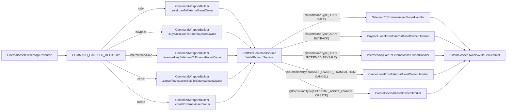

The `ExternalAssetOwnersApiResource` is the JAX-RS surface that exposes Apache Fineract's asset-externalization feature to operators and downstream systems. It lives in `fineract-investor/src/main/java/org/apache/fineract/investor/api/ExternalAssetOwnersApiResource.java`, is bound to the JAX-RS path `/v1/external-asset-owners`, and is registered as a Spring `@Component` conditional on the investor module being enabled (`@Conditional(InvestorModuleIsEnabledCondition.class)`).

This page documents every endpoint on the resource — HTTP method, path, query parameters, request/response shape, the command handler the wrapper is dispatched to, and the validations or behaviour the handler triggers. Companion pages: [Loan product attributes API](/investor/loan-product-attributes-api) for the per-product configuration endpoints, and [Investor REST API reference](/api/investor-apis) for the consumer-facing API surface.

## Class declaration

```java
// fineract-investor/.../api/ExternalAssetOwnersApiResource.java
@Path("/v1/external-asset-owners")
@Component
@Tag(name = "External Asset Owners", description = "External Asset Owners")
@RequiredArgsConstructor
@Conditional(InvestorModuleIsEnabledCondition.class)
public class ExternalAssetOwnersApiResource {

    private final PlatformUserRightsContext platformUserRightsContext;
    private final ExternalAssetOwnersReadService externalAssetOwnersReadService;
    private final DefaultToApiJsonSerializer<String> postApiJsonSerializerService;
    private final PortfolioCommandSourceWritePlatformService commandsSourceWritePlatformService;
    private final LoanReadPlatformServiceCommon loanReadPlatformService;
    private final ExternalAssetOwnersSearchApiDelegate delegate;

    private static final String COMMAND_PARAM = "command";
    // ...
}
```

Two things stand out:

1. **Every write endpoint routes through a static `CommandHandlerRegistry`.** The resource has no business logic of its own; it parses the `command` query parameter, looks up the matching `CommandWrapperBuilder` lambda, and persists the wrapper through `PortfolioCommandSourceWritePlatformService.logCommandSource(...)`. That keeps the resource paper-thin and gives every state-changing call uniform command-source auditing.
2. **Every endpoint starts with `platformUserRightsContext.isAuthenticated()`.** This is the only authorization check in the resource — fine-grained permission enforcement is delegated to the `CommandSource` pipeline (where `CommandSource.permissionCode` is matched against the caller's permissions before the command is dispatched).

## Command handler registry

```java
private static final CommandHandlerRegistry<String, Long, String, CommandWrapper>
    COMMAND_HANDLER_REGISTRY = new CommandHandlerRegistry<>(
    Map.of(
        CANCEL_COMMAND_VALUE,
            (id, json) -> new CommandWrapperBuilder()
                .cancelTransactionByIdToExternalAssetOwner(id).build(),
        INTERMEDIARY_SALE_COMMAND_VALUE,
            (id, json) -> new CommandWrapperBuilder().withJson(json)
                .intermediarySaleLoanToExternalAssetOwner(id).build(),
        SALE_COMMAND_VALUE,
            (id, json) -> new CommandWrapperBuilder().withJson(json)
                .saleLoanToExternalAssetOwner(id).build(),
        BUY_BACK_COMMAND_VALUE,
            (id, json) -> new CommandWrapperBuilder().withJson(json)
                .buybackLoanToExternalAssetOwner(id).build(),
        CREATE_COMMAND_VALUE,
            (id, json) -> new CommandWrapperBuilder().withJson(json)
                .createExternalAssetOwner().build()));
```

The static command constants come from `org.apache.fineract.infrastructure.core.service.CommandParameterUtil`:

| Constant | Literal value | Drives |
|---|---|---|
| `SALE_COMMAND_VALUE` | `"sale"` | `SaleLoanToExternalAssetOwnerHandler` |
| `BUY_BACK_COMMAND_VALUE` | `"buyback"` | `BuybackLoanFromExternalAssetOwnerHandler` |
| `INTERMEDIARY_SALE_COMMAND_VALUE` | `"intermediarySale"` | `IntermediarySaleToExternalAssetOwnerHandler` |
| `CANCEL_COMMAND_VALUE` | `"cancel"` | `CancelLoanFromExternalAssetOwnerHandler` |
| `CREATE_COMMAND_VALUE` | `"create"` | `CreateExternalAssetOwnerHandler` |

Any other value of `command` triggers `UnrecognizedQueryParamException`.

## Endpoint inventory

The table below lists every endpoint on the resource. Each row is expanded in its own section below.

| Method | Path | Query params | Handler / read service |
|---|---|---|---|
| `POST` | `/v1/external-asset-owners/transfers/loans/{loanId}` | `command=sale\|buyback\|intermediarySale` | `Sale…Handler` / `Buyback…Handler` / `IntermediarySale…Handler` |
| `POST` | `/v1/external-asset-owners/transfers/loans/external-id/{loanExternalId}` | `command=sale\|buyback\|intermediarySale` | Same; loan id resolved by external id first |
| `POST` | `/v1/external-asset-owners/transfers/{id}` | `command=cancel` | `CancelLoanFromExternalAssetOwnerHandler` |
| `POST` | `/v1/external-asset-owners/transfers/external-id/{externalId}` | `command=cancel` | Same; transfer id resolved by external id first |
| `GET` | `/v1/external-asset-owners/transfers` | `transferExternalId`, `loanId`, `loanExternalId`, `offset`, `limit` | `ExternalAssetOwnersReadService.retrieveTransferData(...)` |
| `GET` | `/v1/external-asset-owners/transfers/active-transfer` | `transferExternalId`, `loanId`, `loanExternalId` | `ExternalAssetOwnersReadService.retrieveActiveTransferData(...)` |
| `GET` | `/v1/external-asset-owners/transfers/{transferId}/journal-entries` | `offset`, `limit` | `…retrieveJournalEntriesOfTransfer(...)` |
| `GET` | `/v1/external-asset-owners/owners/external-id/{ownerExternalId}/journal-entries` | `offset`, `limit` | `…retrieveJournalEntriesOfOwner(...)` |
| `POST` | `/v1/external-asset-owners/search` | (body is `PagedRequest<ExternalAssetOwnerSearchRequest>`) | `ExternalAssetOwnersSearchApiDelegate.searchInvestorData(...)` |
| `POST` | `/v1/external-asset-owners` | — | `CreateExternalAssetOwnerHandler` |
| `GET` | `/v1/external-asset-owners` | — | `ExternalAssetOwnersReadService.retrieveAllExternalOwners()` |

## `POST /transfers/loans/{loanId}` — sale / buyback / intermediary sale

```java
@POST
@Path("/transfers/loans/{loanId}")
@Consumes(MediaType.APPLICATION_JSON)
@Produces(MediaType.APPLICATION_JSON)
public CommandProcessingResult transferRequestWithLoanId(
        @PathParam("loanId") final Long loanId,
        @Parameter ExternalAssetOwnerRequest assetOwnerReq,
        @QueryParam(COMMAND_PARAM) final String commandParam) {
    platformUserRightsContext.isAuthenticated();
    final String serializedAssetRequest = postApiJsonSerializerService.serialize(assetOwnerReq);
    final CommandWrapper commandRequest = COMMAND_HANDLER_REGISTRY.execute(commandParam, loanId,
        serializedAssetRequest, new UnrecognizedQueryParamException(COMMAND_PARAM, commandParam));
    return this.commandsSourceWritePlatformService.logCommandSource(commandRequest);
}
```

### Request body — `ExternalAssetOwnerRequest`

```java
// data/request/ExternalAssetOwnerRequest.java
@Data @NoArgsConstructor
public class ExternalAssetOwnerRequest implements Serializable {
    private String settlementDate;
    private String ownerExternalId;
    private String transferExternalId;
    private String transferExternalGroupId;
    private String purchasePriceRatio;
    private String dateFormat;
    private String locale;
}
```

| Field | Required by | Notes |
|---|---|---|
| `settlementDate` | sale, buyback, intermediary | Must not be in the past. Parsed using `dateFormat`/`locale`. |
| `ownerExternalId` | sale, intermediary | Resolves (or creates) the `ExternalAssetOwner`. Max 100 chars. |
| `transferExternalId` | optional | Auto-generated if omitted. Must be unique across all transfers. Max 100 chars. |
| `transferExternalGroupId` | optional | Free-form batch correlation id. Max 100 chars. |
| `purchasePriceRatio` | sale, intermediary | Required and not validated as a number. Max 50 chars. |
| `dateFormat`, `locale` | optional | Pattern for parsing `settlementDate`. |

### Behaviour by command

| `command=` | Routes to | Body fields actually consumed |
|---|---|---|
| `sale` | `ExternalAssetOwnersWriteServiceImpl.saleLoanByLoanId` | All fields above. |
| `intermediarySale` | `ExternalAssetOwnersWriteServiceImpl.intermediarySaleLoanByLoanId` | Same. Requires the loan product to have `SETTLEMENT_MODEL=DELAYED_SETTLEMENT`. |
| `buyback` | `ExternalAssetOwnersWriteServiceImpl.buybackLoanByLoanId` | Only `settlementDate`, `transferExternalId`, `dateFormat`, `locale` are accepted — passing `ownerExternalId` or `purchasePriceRatio` triggers `unsupported parameter` rejection by `checkForUnsupportedParameters`. |

### Successful response

```json
{
  "officeId": null,
  "clientId": null,
  "loanId": 123,
  "savingsId": null,
  "resourceId": 4567,
  "resourceExternalId": "TRF-2025-04-15-loan-123",
  "subResourceId": 123,
  "subResourceExternalId": "loan-external-id"
}
```

`resourceId` is the new transfer's primary key (`ExternalAssetOwnerTransfer.id`). `subResourceId` is the loan id. `subResourceExternalId` is the loan's external id (cached on the transfer row).

### Error responses

| Status | Cause |
|---|---|
| `400` | Validation error (`PlatformApiDataValidationException`) — missing/blank required field, length overrun, settlement date in the past. |
| `403` | The transfer cannot be initiated (e.g. loan in wrong status, conflicting in-flight transfer). Mapped by `ExternalAssetOwnerInitiateTransferExceptionMapper`. |
| `404` | `LoanNotFoundException` if `loanId` doesn't exist. |

## `POST /transfers/loans/external-id/{loanExternalId}`

Identical to the above, but the loan is looked up by its external id first:

```java
final Long loanId = loanReadPlatformService.getLoanIdByLoanExternalId(externalLoanId);
```

before the command wrapper is built. Same body, same `command` values, same response shape, same error semantics.

## `POST /transfers/{id}` — cancel

```java
@POST
@Path("/transfers/{id}")
public CommandProcessingResult transferRequestWithId(
        @PathParam("id") final Long id,
        @QueryParam(COMMAND_PARAM) final String commandParam) {
    platformUserRightsContext.isAuthenticated();
    final CommandWrapper commandRequest = COMMAND_HANDLER_REGISTRY.execute(commandParam, id, null,
        new UnrecognizedQueryParamException(COMMAND_PARAM, commandParam));
    return this.commandsSourceWritePlatformService.logCommandSource(commandRequest);
}
```

The body is ignored (the `(id, json) -> ...cancelTransactionByIdToExternalAssetOwner(id).build()` lambda discards the JSON). Only `command=cancel` is meaningful here. The handler is `CancelLoanFromExternalAssetOwnerHandler`, which calls `ExternalAssetOwnersWriteServiceImpl.cancelTransactionById(command)`. Validations:

- Transfer with `id` exists.
- It is the *latest* effective transfer for its loan (`effective.getFirst().getId() == selected.getId()`).
- Its status is `PENDING` or `BUYBACK`.

On success a new `CANCELLED` row with sub-status `USER_REQUESTED` is inserted and the original is expired (`effective_date_to = today`). See [Transfer lifecycle](/investor/transfer-lifecycle).

## `POST /transfers/external-id/{externalId}` — cancel by external id

Resolves the transfer id from the supplied transfer external id first:

```java
final Long id = externalAssetOwnersReadService.retrieveLastTransferIdByExternalId(
    new ExternalId(externalId));
```

then dispatches the same wrapper. `retrieveLastTransferIdByExternalId` returns the *latest* transfer row sharing that external id — useful when a cancel/declination/activation chain has reused the same external id across multiple rows.

## `GET /transfers` — paged transfer search

```java
@GET
@Path("/transfers")
public Page<ExternalTransferData> getTransfers(
    @QueryParam("transferExternalId") final String transferExternalId,
    @QueryParam("loanId") final Long loanId,
    @QueryParam("loanExternalId") final String loanExternalId,
    @QueryParam("offset") final Integer offset,
    @QueryParam("limit") final Integer limit) {
    platformUserRightsContext.isAuthenticated();
    return externalAssetOwnersReadService.retrieveTransferData(
        loanId, loanExternalId, transferExternalId, offset, limit);
}
```

At least one of `transferExternalId`, `loanId`, `loanExternalId` should be provided — the implementation returns the matching transfers in descending id order. The return type is a Spring `Page<ExternalTransferData>` so the JSON envelope is `{ "content": [...], "totalElements": N, "pageable": ..., ... }`.

`ExternalTransferData` carries the full snapshot:

```java
public class ExternalTransferData {
    private Long transferId;
    private ExternalTransferOwnerData owner;
    private ExternalTransferOwnerData previousOwner;
    private ExternalTransferLoanData loan;
    private ExternalTransferDataDetails details;
    private String transferExternalId;
    private String transferExternalGroupId;
    private String purchasePriceRatio;
    private LocalDate settlementDate;
    private ExternalTransferStatus status;
    private ExternalTransferSubStatus subStatus;
    private LocalDate effectiveFrom;
    private LocalDate effectiveTo;
}
```

## `GET /transfers/active-transfer`

Returns a single `ExternalTransferData` for the active row (one of `ACTIVE`, `ACTIVE_INTERMEDIATE`) for the given loan / loan external id / transfer external id. Returns `null` body when no active row exists. The implementation is `externalAssetOwnersReadService.retrieveActiveTransferData(loanId, loanExternalId, transferExternalId)` which calls `findActiveByLoanId(...)` filtered by the optional matchers.

## `GET /transfers/{transferId}/journal-entries`

```java
public ExternalOwnerTransferJournalEntryData getJournalEntriesOfTransfer(
        @PathParam("transferId") final Long transferId,
        @QueryParam("offset") final Integer offset,
        @QueryParam("limit") final Integer limit) { ... }
```

Returns every `JournalEntry` linked to the transfer via `m_external_asset_owner_transfer_journal_entry_mapping`. This is the canonical way to ask "show me the debit and credit entries that the COB step posted when this transfer activated/executed". See [Journal-entry integration](/investor/journal-entry-integration) for the schema of those entries.

## `GET /owners/external-id/{ownerExternalId}/journal-entries`

Same idea but keyed by owner external id, using `m_external_asset_owner_journal_entry_mapping`. This includes both the transfer-creation entries and every subsequent loan-transaction entry that happened while the loan was held by the owner (the `LoanJournalEntryCreatedBusinessEvent` listener in `ExternalAssetOwnerJournalEntryServiceImpl` writes a mapping row each time).

## `POST /search`

```java
@POST
@Path("/search")
@Consumes(MediaType.APPLICATION_JSON)
@Produces(MediaType.APPLICATION_JSON)
public Page<ExternalTransferData> searchInvestorData(
        @Parameter PagedRequest<ExternalAssetOwnerSearchRequest> request) {
    platformUserRightsContext.isAuthenticated();
    return delegate.searchInvestorData(request);
}
```

Routes to `ExternalAssetOwnersSearchApiDelegate.searchInvestorData(...)`, which lives in `api/search/`. The body is a generic paged-request envelope (offset, limit, sorting) wrapping an `ExternalAssetOwnerSearchRequest` (`service/search/domain/ExternalAssetOwnerSearchRequest.java`) carrying free-form text, settlement-date range, and effective-date range filters. Implemented under `service/search/`.

## `POST /` — create owner

```java
@POST
@RequestBody(required = true, content = @Content(schema = @Schema(
    implementation = ExternalAssetOwnersApiResourceSwagger.PostExternalAssetOwnerRequest.class)))
public CommandProcessingResult createExternalAssetOwner(
        @Parameter(hidden = true) final String apiRequestBodyAsJson) {
    platformUserRightsContext.isAuthenticated();
    final CommandWrapper commandRequest = COMMAND_HANDLER_REGISTRY.execute(
        CREATE_COMMAND_VALUE, null, apiRequestBodyAsJson,
        new UnrecognizedQueryParamException(COMMAND_PARAM, CREATE_COMMAND_VALUE));
    return this.commandsSourceWritePlatformService.logCommandSource(commandRequest);
}
```

The request body is just `{ "ownerExternalId": "INVESTOR-..." }`. Dispatches to `CreateExternalAssetOwnerHandler`, which calls `ExternalAssetOwnersWriteServiceImpl.createExternalAssetOwner(command)`:

```java
public CommandProcessingResult createExternalAssetOwner(JsonCommand command) {
    externalAssetOwnerValidator.validateForCreate(command);
    String ownerExternalId = command.stringValueOfParameterNamed(
        ExternalTransferRequestParameters.OWNER_EXTERNAL_ID);
    Optional<ExternalAssetOwner> optExternalId = externalAssetOwnerRepository
        .findByExternalId(ExternalIdFactory.produce(ownerExternalId));
    if (optExternalId.isPresent()) {
        throw new ExternalAssetOwnerDuplicateException(ownerExternalId);
    }
    final ExternalAssetOwner externalAssetOwner = createAndGetAssetOwner(ownerExternalId);
    return new CommandProcessingResultBuilder()
        .withEntityId(externalAssetOwner.getId()).build();
}
```

`ExternalAssetOwnerDuplicateException` maps to HTTP 409. Note that an explicit create call is rarely needed — sale and intermediary-sale calls auto-create the owner via `getOwner(json)` if the external id is unseen.

## `GET /` — list owners

```java
@GET
public List<ExternalTransferOwnerData> retrieveExternalAssetOwners() {
    platformUserRightsContext.isAuthenticated();
    return externalAssetOwnersReadService.retrieveAllExternalOwners();
}
```

Returns every owner row (id, external id, audit columns). Not paged.

## Resource ↔ handler / write-service map



## End-to-end sale example

```bash
# 1. Create the owner once (optional — sale auto-creates if absent)
curl -X POST 'http://localhost:8080/fineract-provider/api/v1/external-asset-owners' \
     -H 'Content-Type: application/json' \
     -H 'Fineract-Platform-TenantId: default' \
     -d '{ "ownerExternalId": "INV-ACME-001" }'

# 2. Initiate a sale that settles tomorrow
curl -X POST 'http://localhost:8080/fineract-provider/api/v1/external-asset-owners/transfers/loans/123?command=sale' \
     -H 'Content-Type: application/json' \
     -H 'Fineract-Platform-TenantId: default' \
     -d '{
           "settlementDate": "2025-04-15",
           "ownerExternalId": "INV-ACME-001",
           "transferExternalId": "TRF-2025-04-15-loan-123",
           "purchasePriceRatio": "1.02",
           "dateFormat": "yyyy-MM-dd",
           "locale": "en"
         }'

# 3. Inspect what was written
curl 'http://localhost:8080/fineract-provider/api/v1/external-asset-owners/transfers?loanId=123' \
     -H 'Fineract-Platform-TenantId: default'

# 4. Tomorrow at COB time, the LoanAccountOwnerTransferBusinessStep activates the row.
#    Afterwards, the active transfer can be queried:
curl 'http://localhost:8080/fineract-provider/api/v1/external-asset-owners/transfers/active-transfer?loanId=123' \
     -H 'Fineract-Platform-TenantId: default'

# 5. Initiate a buyback for the next quarter
curl -X POST 'http://localhost:8080/fineract-provider/api/v1/external-asset-owners/transfers/loans/123?command=buyback' \
     -H 'Content-Type: application/json' \
     -H 'Fineract-Platform-TenantId: default' \
     -d '{ "settlementDate": "2025-07-15", "dateFormat": "yyyy-MM-dd", "locale": "en" }'
```

## Cross-links

- Domain model and status enums: [/investor/external-asset-owner-domain](/investor/external-asset-owner-domain)
- Lifecycle and state transitions: [/investor/transfer-lifecycle](/investor/transfer-lifecycle)
- Loan product attributes API: [/investor/loan-product-attributes-api](/investor/loan-product-attributes-api)
- Investor REST API consumer reference: [/api/investor-apis](/api/investor-apis)
- Loan-account domain context: [/loan/overview](/loan/overview)
- Accounting effects: [/investor/journal-entry-integration](/investor/journal-entry-integration), [/accounting/overview](/accounting/overview)
