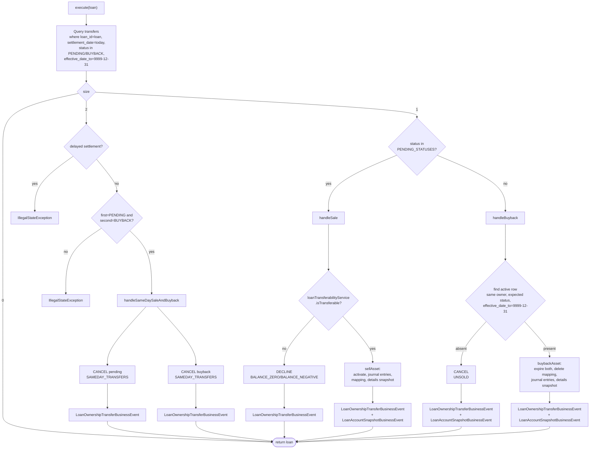

The single Close of Business step that the `fineract-investor` module adds is `LoanAccountOwnerTransferBusinessStep`. It implements `LoanCOBBusinessStep` from `fineract-loan`, registers under the enum-styled name `EXTERNAL_ASSET_OWNER_TRANSFER`, and is the executable engine for the lifecycle described in [Transfer lifecycle](/investor/transfer-lifecycle). This page walks through `execute(Loan)`, the branches, the helpers, and the side effects (mapping rows, journal entries, events).

For how this step is wired into the broader Close of Business pipeline and how it appears in `LoanCOBBusinessStepRepository`, see [COB investor steps](/cob/investor-cob-steps). For the general COB execution model see [COB overview](/cob/overview).

## Class declaration and dependencies

```java
// fineract-investor/.../cob/loan/LoanAccountOwnerTransferBusinessStep.java
@Component
@RequiredArgsConstructor
@Slf4j
@Conditional(InvestorModuleIsEnabledCondition.class)
public class LoanAccountOwnerTransferBusinessStep implements LoanCOBBusinessStep {

    public static final LocalDate FUTURE_DATE_9999_12_31 = LocalDate.of(9999, 12, 31);
    public static final List<ExternalTransferStatus> PENDING_STATUSES = List.of(
        ExternalTransferStatus.PENDING_INTERMEDIATE,
        ExternalTransferStatus.PENDING);
    public static final List<ExternalTransferStatus> BUYBACK_STATUSES = List.of(
        ExternalTransferStatus.BUYBACK_INTERMEDIATE,
        ExternalTransferStatus.BUYBACK);

    private final ExternalAssetOwnerTransferRepository externalAssetOwnerTransferRepository;
    private final ExternalAssetOwnerTransferLoanMappingRepository
        externalAssetOwnerTransferLoanMappingRepository;
    private final LoanJournalEntryPoster loanJournalEntryPoster;
    private final BusinessEventNotifierService businessEventNotifierService;
    private final LoanTransferabilityService loanTransferabilityService;
    private final DelayedSettlementAttributeService delayedSettlementAttributeService;
    private final ExternalAssetOwnerTransferOutstandingInterestCalculation
        externalAssetOwnerTransferOutstandingInterestCalculation;

    @Override public String getEnumStyledName() {
        return "EXTERNAL_ASSET_OWNER_TRANSFER";
    }
    @Override public String getHumanReadableName() {
        return "Execute external asset owner transfer";
    }
}
```

Dependencies in plain English:

- `ExternalAssetOwnerTransferRepository` — to query pending/buyback rows and to save new (activated/declined/cancelled) rows.
- `ExternalAssetOwnerTransferLoanMappingRepository` — to insert/delete the per-loan "currently-owned" mapping.
- `LoanJournalEntryPoster` — the bridge into `fineract-provider`'s accounting code; the step calls `postJournalEntriesForExternalOwnerTransfer(loan, transfer, previousOwner)` which delegates to `AccountingServiceImpl.createJournalEntriesForSaleAssetTransfer(...)` (or the buyback variant).
- `BusinessEventNotifierService` — to fire `LoanOwnershipTransferBusinessEvent` and `LoanAccountSnapshotBusinessEvent`.
- `LoanTransferabilityService` — to ask "is the loan in a state where the transfer can actually execute?" (outstanding balance > 0).
- `DelayedSettlementAttributeService` — the cached "is this product configured for delayed settlement?" check.
- `ExternalAssetOwnerTransferOutstandingInterestCalculation` — pluggable interest valuation for the settlement snapshot.

## `execute(Loan)` body

```java
@Override
public Loan execute(Loan loan) {
    Long loanId = loan.getId();
    log.debug("start processing loan ownership transfer business step for loan with Id [{}]", loanId);

    LocalDate settlementDate = DateUtils.getBusinessLocalDate();
    List<ExternalAssetOwnerTransfer> transferDataList = externalAssetOwnerTransferRepository.findAll(
        (root, query, criteriaBuilder) -> criteriaBuilder.and(
            criteriaBuilder.equal(root.get("loanId"), loanId),
            criteriaBuilder.equal(root.get("settlementDate"), settlementDate),
            root.get("status").in(Stream.concat(PENDING_STATUSES.stream(),
                                                  BUYBACK_STATUSES.stream()).toList()),
            criteriaBuilder.greaterThanOrEqualTo(root.get("effectiveDateTo"),
                                                  FUTURE_DATE_9999_12_31)),
        Sort.by(Sort.Direction.ASC, "id"));
    int size = transferDataList.size();

    if (size == 2) {
        // ...same-day pair handling...
    } else if (size == 1) {
        ExternalAssetOwnerTransfer transfer = transferDataList.get(0);
        if (PENDING_STATUSES.contains(transfer.getStatus())) {
            handleSale(loan, settlementDate, transfer);
        } else if (BUYBACK_STATUSES.contains(transfer.getStatus())) {
            handleBuyback(loan, settlementDate, transfer);
        }
    }

    log.debug("end processing loan ownership transfer business step for loan Id [{}]", loan.getId());
    return loan;
}
```

The Criteria predicate is the key:

| Predicate | Meaning |
|---|---|
| `loanId == this loan` | scoped to the loan COB is processing. |
| `settlementDate == today` | only transfers that should execute on this business date. |
| `status IN (PENDING, PENDING_INTERMEDIATE, BUYBACK, BUYBACK_INTERMEDIATE)` | only pre-execution states. |
| `effectiveDateTo >= 9999-12-31` | only currently effective rows (i.e. not already expired). |

The sort by `id ASC` is what guarantees that in the `size == 2` case the first element is the older row (the `PENDING`) and the second is the newer row (the `BUYBACK`) — important for the same-day pair check below.

## Branch 1 — single pending sale (`size == 1`, status ∈ PENDING_STATUSES)

`handleSale` either sells the asset or declines:

```java
private void handleSale(Loan loan, LocalDate settlementDate, ExternalAssetOwnerTransfer t) {
    ExternalAssetOwnerTransfer newTransfer = sellAssetOrDecline(loan, settlementDate, t);
    businessEventNotifierService.notifyPostBusinessEvent(
        new LoanOwnershipTransferBusinessEvent(newTransfer, loan));
    if (!ExternalTransferStatus.DECLINED.equals(newTransfer.getStatus())) {
        businessEventNotifierService.notifyPostBusinessEvent(
            new LoanAccountSnapshotBusinessEvent(loan));
    }
}

private ExternalAssetOwnerTransfer sellAssetOrDecline(Loan loan, LocalDate settlementDate,
        ExternalAssetOwnerTransfer t) {
    if (!loanTransferabilityService.isTransferable(loan, t)) {
        ExternalTransferSubStatus declinedSubStatus =
            loanTransferabilityService.getDeclinedSubStatus(loan);
        return declinePendingEntry(loan, settlementDate, t, declinedSubStatus);
    }
    ExternalAssetOwnerTransfer newTransfer = sellAsset(loan, settlementDate, t);
    createActiveMapping(loan.getId(), newTransfer);
    newTransfer.setExternalAssetOwnerTransferDetails(
        createAssetOwnerTransferDetails(loan, newTransfer));
    return newTransfer;
}
```

### Decline path

`declinePendingEntry` writes a new `DECLINED` row whose `effective_date_from = settlement_date`, `effective_date_to = settlement_date`, and the supplied `subStatus` (`BALANCE_ZERO` or `BALANCE_NEGATIVE`), expires the original `PENDING` row by setting its `effective_date_to = settlement_date`. No loan mapping is touched. No journal entries are posted. Only the `LoanOwnershipTransferBusinessEvent` is fired (no `LoanAccountSnapshotBusinessEvent` — the loan didn't change).

### Sell path

```java
private ExternalAssetOwnerTransfer sellAsset(Loan loan, LocalDate settlementDate,
        ExternalAssetOwnerTransfer t) {
    ExternalAssetOwner previousOwner =
        determinePreviousOwnerAndCleanupIfNeeded(loan, settlementDate, t);
    ExternalTransferStatus activeStatus = determineActiveStatus(t);
    ExternalAssetOwnerTransfer newTransfer =
        activatePendingEntry(settlementDate, t, activeStatus, previousOwner);
    loanJournalEntryPoster.postJournalEntriesForExternalOwnerTransfer(loan, newTransfer, previousOwner);
    return newTransfer;
}
```

Three substeps:

1. **Determine the previous owner.** If no delayed-settlement *or* the new transfer is the originator→intermediate leg, the previous owner comes from the current loan mapping (if any). Otherwise the previous owner is the intermediate's owner — the `ACTIVE_INTERMEDIATE` row's owner — and that intermediate row is expired and its mapping deleted.

2. **Decide the new status.** `PENDING_INTERMEDIATE → ACTIVE_INTERMEDIATE`, otherwise → `ACTIVE`.

3. **Activate the entry.** Write a new row with `effective_date_from = settlement_date + 1`, `effective_date_to = 9999-12-31`, status = decided active status. Expire the original `PENDING` row by setting its `effective_date_to = settlement_date`.

After `sellAsset` returns, `sellAssetOrDecline` also writes the `ExternalAssetOwnerTransferLoanMapping` row (the "this loan is currently held by …" pointer) and creates the settlement-amount snapshot.

### `determinePreviousOwnerAndCleanupIfNeeded` in detail

```java
private ExternalAssetOwner determinePreviousOwnerAndCleanupIfNeeded(Loan loan,
        LocalDate settlementDate, ExternalAssetOwnerTransfer t) {
    if (!delayedSettlementAttributeService.isEnabled(loan.getLoanProduct().getId())
            || ExternalTransferStatus.PENDING_INTERMEDIATE == t.getStatus()) {
        // Simple settlement, or the delayed-settlement *first* hop.
        return expireCurrentOwnerIfPresent(loan, settlementDate);
    }
    // Delayed settlement, second hop: intermediate → final investor.
    ExternalAssetOwnerTransfer activeIntermediateTransfer = getActiveIntermediateOrThrow(loan);
    expireTransfer(settlementDate, activeIntermediateTransfer);
    externalAssetOwnerTransferLoanMappingRepository
        .deleteByLoanIdAndOwnerTransfer(loan.getId(), activeIntermediateTransfer);
    return activeIntermediateTransfer.getOwner();
}

@Nullable
private ExternalAssetOwner expireCurrentOwnerIfPresent(Loan loan, LocalDate settlementDate) {
    Optional<ExternalAssetOwnerTransfer> activeTransfer =
        externalAssetOwnerTransferRepository.findActiveByLoanId(loan.getId());
    if (activeTransfer.isPresent()) {
        ExternalAssetOwnerTransfer currentActiveTransfer = activeTransfer.get();
        expireTransfer(settlementDate, currentActiveTransfer);
        externalAssetOwnerTransferLoanMappingRepository
            .deleteByLoanIdAndOwnerTransfer(loan.getId(), currentActiveTransfer);
        return currentActiveTransfer.getOwner();
    }
    // Internal-to-external transfer: no previous external owner
    return null;
}
```

So the *first* sale of a never-sold loan returns `previousOwner = null` (the originator). Owner-to-owner transfers — sale to investor B while the loan is currently held by investor A — return investor A as `previousOwner` and expire investor A's active row before writing investor B's active row.

## Branch 2 — single buyback (`size == 1`, status ∈ BUYBACK_STATUSES)

```java
private void handleBuyback(Loan loan, LocalDate settlementDate,
        ExternalAssetOwnerTransfer buybackTransfer) {
    final ExternalTransferStatus expectedActiveStatus =
        determineExpectedActiveStatus(buybackTransfer);

    Optional<ExternalAssetOwnerTransfer> optActiveExternalAssetOwnerTransfer =
        externalAssetOwnerTransferRepository.findOne((root, query, criteriaBuilder) ->
            criteriaBuilder.and(
                criteriaBuilder.equal(root.get("loanId"), loan.getId()),
                criteriaBuilder.equal(root.get("owner"), buybackTransfer.getOwner()),
                criteriaBuilder.equal(root.get("status"), expectedActiveStatus),
                criteriaBuilder.equal(root.get("effectiveDateTo"), FUTURE_DATE_9999_12_31)));

    ExternalAssetOwnerTransfer newTransfer;
    if (!optActiveExternalAssetOwnerTransfer.isPresent()) {
        newTransfer = createNewEntryAndExpireOldEntry(settlementDate, buybackTransfer,
            ExternalTransferStatus.CANCELLED, ExternalTransferSubStatus.UNSOLD,
            settlementDate, settlementDate);
    } else {
        newTransfer = buybackAsset(loan, settlementDate, buybackTransfer,
            optActiveExternalAssetOwnerTransfer.get());
    }
    businessEventNotifierService.notifyPostBusinessEvent(
        new LoanOwnershipTransferBusinessEvent(newTransfer, loan));
    businessEventNotifierService.notifyPostBusinessEvent(
        new LoanAccountSnapshotBusinessEvent(loan));
}
```

`determineExpectedActiveStatus` returns `ACTIVE_INTERMEDIATE` if the buyback is `BUYBACK_INTERMEDIATE`, otherwise `ACTIVE`. The query then asks "is there a currently-effective active row, owned by the same investor, in that expected status?" If yes → execute the buyback (`buybackAsset`); if no → cancel the buyback row with sub-status `UNSOLD`.

### `buybackAsset`

```java
private ExternalAssetOwnerTransfer buybackAsset(Loan loan, LocalDate settlementDate,
        ExternalAssetOwnerTransfer buybackTransfer,
        ExternalAssetOwnerTransfer activeTransfer) {
    activeTransfer.setEffectiveDateTo(settlementDate);
    buybackTransfer.setEffectiveDateTo(settlementDate);
    buybackTransfer.setExternalAssetOwnerTransferDetails(
        createAssetOwnerTransferDetails(loan, buybackTransfer));
    externalAssetOwnerTransferRepository.save(activeTransfer);
    buybackTransfer = externalAssetOwnerTransferRepository.save(buybackTransfer);
    externalAssetOwnerTransferLoanMappingRepository
        .deleteByLoanIdAndOwnerTransfer(loan.getId(), activeTransfer);
    loanJournalEntryPoster.postJournalEntriesForExternalOwnerTransfer(loan, buybackTransfer, null);
    return buybackTransfer;
}
```

Both the active parent and the buyback row are expired with `effective_date_to = settlement_date`. The buyback row gets its own settlement-amount snapshot. The loan-mapping row is deleted (so subsequent journal entries stop tagging this loan as externally owned). The buyback journal entries are posted, with `previousOwner = null` — `AccountingServiceImpl.createJournalEntriesForBuybackAssetTransfer(...)` takes the previous owner directly from `transfer.getOwner()`.

## Branch 3 — same-day pair (`size == 2`)

```java
if (size == 2) {
    ExternalTransferStatus firstTransferStatus = transferDataList.get(0).getStatus();
    ExternalTransferStatus secondTransferStatus = transferDataList.get(1).getStatus();

    if (delayedSettlementAttributeService.isEnabled(loan.getLoanProduct().getId())) {
        throw new IllegalStateException(String.format(
            "Delayed Settlement enabled, but found 2 transfers of statuses: %s and %s",
            firstTransferStatus, secondTransferStatus));
    }

    if (!ExternalTransferStatus.PENDING.equals(firstTransferStatus)
            || !ExternalTransferStatus.BUYBACK.equals(secondTransferStatus)) {
        throw new IllegalStateException(String.format(
            "Illegal transfer found. Expected %s and %s, found: %s and %s",
            ExternalTransferStatus.PENDING, ExternalTransferStatus.BUYBACK,
            firstTransferStatus, secondTransferStatus));
    }
    handleSameDaySaleAndBuyback(settlementDate, transferDataList, loan);
}

private void handleSameDaySaleAndBuyback(LocalDate settlementDate,
        List<ExternalAssetOwnerTransfer> transferDataList, Loan loan) {
    ExternalAssetOwnerTransfer cancelledPendingTransfer =
        cancelTransfer(settlementDate, transferDataList.get(0));
    ExternalAssetOwnerTransfer cancelledBuybackTransfer =
        cancelTransfer(settlementDate, transferDataList.get(1));
    businessEventNotifierService.notifyPostBusinessEvent(
        new LoanOwnershipTransferBusinessEvent(cancelledPendingTransfer, loan));
    businessEventNotifierService.notifyPostBusinessEvent(
        new LoanOwnershipTransferBusinessEvent(cancelledBuybackTransfer, loan));
}

private ExternalAssetOwnerTransfer cancelTransfer(LocalDate settlementDate,
        ExternalAssetOwnerTransfer t) {
    return createNewEntryAndExpireOldEntry(settlementDate, t,
        ExternalTransferStatus.CANCELLED, ExternalTransferSubStatus.SAMEDAY_TRANSFERS,
        settlementDate, settlementDate);
}
```

Both rows are replaced by `CANCELLED` rows with sub-status `SAMEDAY_TRANSFERS`. Two events fire (one per cancellation). No journal entries are posted. The `IllegalStateException` paths are defensive: if the COB step ever sees two rows that are anything other than (`PENDING`, `BUYBACK`) in that exact order, or if delayed settlement is enabled at all, the data is inconsistent and the step refuses to proceed.

## The unified row-replacement helper

The replace-and-expire idiom is centralised:

```java
private ExternalAssetOwnerTransfer createNewEntryAndExpireOldEntry(LocalDate settlementDate,
        ExternalAssetOwnerTransfer t, ExternalTransferStatus status,
        ExternalTransferSubStatus subStatus, LocalDate effectiveDateFrom,
        LocalDate effectiveDateTo, ExternalAssetOwner previousOwner) {
    ExternalAssetOwnerTransfer newT = new ExternalAssetOwnerTransfer();
    newT.setOwner(t.getOwner());
    newT.setExternalId(t.getExternalId());
    newT.setStatus(status);
    newT.setSubStatus(subStatus);
    newT.setSettlementDate(settlementDate);
    newT.setLoanId(t.getLoanId());
    newT.setExternalLoanId(t.getExternalLoanId());
    newT.setExternalGroupId(t.getExternalGroupId());
    newT.setPurchasePriceRatio(t.getPurchasePriceRatio());
    newT.setEffectiveDateFrom(effectiveDateFrom);
    newT.setEffectiveDateTo(effectiveDateTo);
    newT.setPreviousOwner(previousOwner != null ? previousOwner : t.getPreviousOwner());

    expireTransfer(settlementDate, t);     // sets old row's effective_date_to = settlementDate
    return externalAssetOwnerTransferRepository.save(newT);
}
```

The new row carries forward almost every field from the old (owner, external id, loan id, purchase price ratio) — only `status`, `subStatus`, the effective interval, and optionally the previous owner change.

## Detailed branch flow chart



## Settlement-amount snapshot

The COB step calls this helper to populate `ExternalAssetOwnerTransferDetails`:

```java
private ExternalAssetOwnerTransferDetails createAssetOwnerTransferDetails(Loan loan,
        ExternalAssetOwnerTransfer t) {
    ExternalAssetOwnerTransferDetails details = new ExternalAssetOwnerTransferDetails();
    details.setExternalAssetOwnerTransfer(t);
    details.setTotalPrincipalOutstanding(loan.getSummary().getTotalPrincipalOutstanding());
    // We have different strategies to calculate oustanding interest
    final BigDecimal interestAmount =
        externalAssetOwnerTransferOutstandingInterestCalculation.calculateOutstandingInterest(loan);
    details.setTotalInterestOutstanding(interestAmount);
    details.setTotalFeeChargesOutstanding(loan.getSummary().getTotalFeeChargesOutstanding());
    details.setTotalPenaltyChargesOutstanding(loan.getSummary().getTotalPenaltyChargesOutstanding());
    details.setTotalOverpaid(loan.getTotalOverpaid());
    return details;
}
```

Note that `ExternalAssetOwnerTransferOutstandingInterestCalculation` is an interface — the default implementation just returns `loan.getSummary().getTotalInterestOutstanding()`, but downstream forks can plug in alternative valuations (e.g. accrue to settlement date). The same number flows into the journal-entry posting via `AccountingServiceImpl.createJournalEntries(...)` so the snapshot and the postings are guaranteed to agree.

## Event firing rules

| Branch | Events fired |
|---|---|
| Sell (sale activates) | `LoanOwnershipTransferBusinessEvent` + `LoanAccountSnapshotBusinessEvent`. |
| Decline (pending sale declined) | `LoanOwnershipTransferBusinessEvent` only. |
| Buyback executes | `LoanOwnershipTransferBusinessEvent` + `LoanAccountSnapshotBusinessEvent`. |
| Buyback cancelled (UNSOLD) | `LoanOwnershipTransferBusinessEvent` + `LoanAccountSnapshotBusinessEvent`. |
| Same-day pair cancelled | Two `LoanOwnershipTransferBusinessEvent`s (no `LoanAccountSnapshotBusinessEvent`). |

`LoanAccountSnapshotBusinessEvent` is the standard "loan state changed, please re-emit the full loan-account picture" event consumed by the external-event publisher. Its emission here ensures downstream consumers see the new owner in the loan-account snapshot. See [Investor events](/investor/investor-events) and [Events overview](/events/overview).

## Where this step sits in COB

COB steps for the `LOAN_COB` job are discovered by `LoanCOBBusinessStepRepository` from every `LoanCOBBusinessStep` bean. The order is configured per-tenant in `m_batch_business_step` and `m_batch_business_step_config`. Typical default placement is **after** schedule/accrual recalculation and **before** the loan-status snapshot recording, so that:

1. Interest has already accrued for the settlement date — the snapshot amount is right.
2. The ownership change is reflected when the loan snapshot is captured.

For the COB engine itself, the loan lock and the `LoanCOBBusinessStep` contract, see [COB overview](/cob/overview). For a comparative tour of all investor-side COB hooks, see [Investor COB steps](/cob/investor-cob-steps).

## Test coverage

The behavioural matrix is exercised by `fineract-investor/src/test/java/org/apache/fineract/investor/cob/loan/LoanAccountOwnerTransferBusinessStepTest.java`. The test class spins up the step with all mocked dependencies and asserts:

- A `PENDING` row with `settlement_date == today` and positive outstanding becomes `ACTIVE` (effective_date_from = settlement + 1, effective_date_to = 9999-12-31). A mapping row is written. A `LoanOwnershipTransferBusinessEvent` is fired.
- A `PENDING` row with zero outstanding becomes `DECLINED` with sub-status `BALANCE_ZERO`. No mapping is written.
- A `PENDING` + `BUYBACK` pair on the same day both become `CANCELLED` with sub-status `SAMEDAY_TRANSFERS`. Two events fire.
- A `BUYBACK` row with no matching `ACTIVE` parent becomes `CANCELLED` with sub-status `UNSOLD`.
- A `BUYBACK` row with a matching `ACTIVE` parent triggers `buybackAsset(...)`. Both rows get `effective_date_to = settlement_date`. The mapping is deleted.

## Cross-links

- COB engine and step lifecycle: [/cob/overview](/cob/overview), [/cob/investor-cob-steps](/cob/investor-cob-steps)
- Lifecycle transitions described from the data perspective: [/investor/transfer-lifecycle](/investor/transfer-lifecycle)
- Domain model and settlement-amount snapshot: [/investor/external-asset-owner-domain](/investor/external-asset-owner-domain)
- Accounting effects of the journal entries this step posts: [/investor/journal-entry-integration](/investor/journal-entry-integration), [/accounting/overview](/accounting/overview)
- Events emitted by this step: [/investor/investor-events](/investor/investor-events), [/events/overview](/events/overview)
- Loan-account domain: [/loan/overview](/loan/overview)
