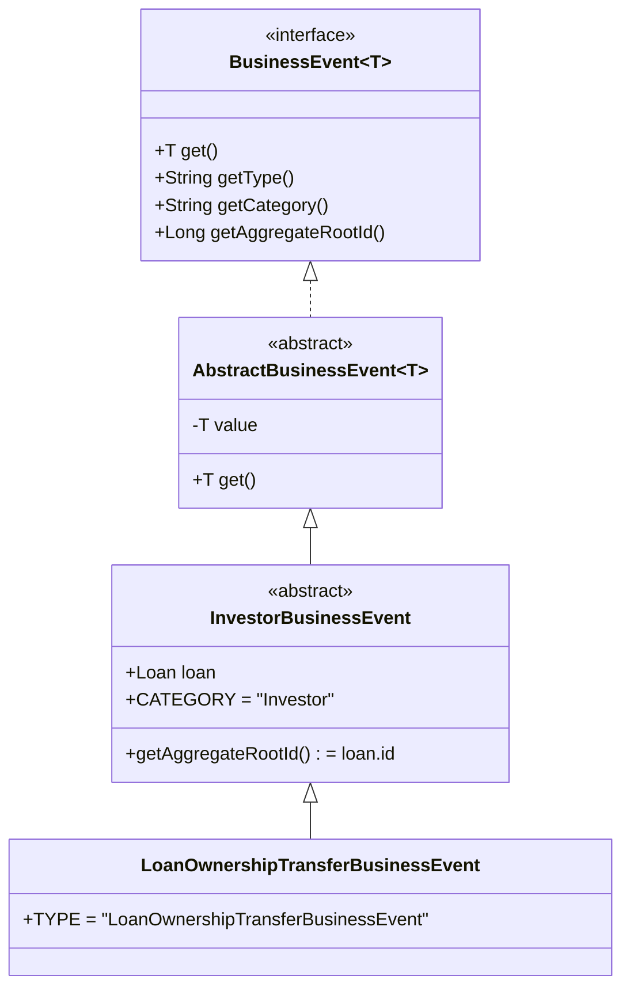
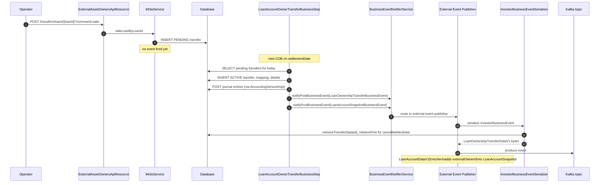

The `fineract-investor` module emits exactly one business-event type — `LoanOwnershipTransferBusinessEvent` — and registers one Avro serialiser that turns those events into `LoanOwnershipTransferDataV1` records on the external-event publishing pipeline. The events are fired by the `LoanAccountOwnerTransferBusinessStep` whenever a transfer transitions to a terminal or persistent state, and by `LoanAccountOwnerTransferServiceImpl` when the loan itself reaches a closed/overpaid state with an in-flight transfer. This page documents the event class hierarchy, the firing rules, the Avro payload, the type/status mapping, and the data-enricher classes that fold investor information into the standard loan-account event payloads.

For the broader event publishing architecture, retry semantics, and Avro schema mechanics see [Events overview](/events/overview).

## Class hierarchy



### `InvestorBusinessEvent`

```java
// fineract-investor/.../domain/InvestorBusinessEvent.java
@Getter
public abstract class InvestorBusinessEvent
        extends AbstractBusinessEvent<ExternalAssetOwnerTransfer> {

    private final Loan loan;
    private static final String CATEGORY = "Investor";

    public InvestorBusinessEvent(ExternalAssetOwnerTransfer value, Loan loan) {
        super(value);
        this.loan = loan;
    }

    @Override public String getCategory()        { return CATEGORY; }
    @Override public Long getAggregateRootId()   { return loan.getId(); }
}
```

Three architecturally important facts:

1. The **`value`** of the event is the `ExternalAssetOwnerTransfer` row that triggered the transition. Downstream consumers can read its `id`, `externalId`, `status`, etc. directly off the event.
2. The **aggregate root id is the loan id**, not the transfer id. This is what plugs the event into the loan-account aggregate stream — consumers who subscribe to "all events for loan 123" see investor transitions in order alongside repayments, accruals, status changes, etc.
3. The **category is `"Investor"`** — the external-event publisher tags every event with a category for routing.

### `LoanOwnershipTransferBusinessEvent`

```java
// fineract-investor/.../domain/LoanOwnershipTransferBusinessEvent.java
public class LoanOwnershipTransferBusinessEvent extends InvestorBusinessEvent {

    private static final String TYPE = "LoanOwnershipTransferBusinessEvent";

    public LoanOwnershipTransferBusinessEvent(ExternalAssetOwnerTransfer value, Loan loan) {
        super(value, loan);
    }

    @Override public String getType() { return TYPE; }
}
```

This is the only concrete event class today. Every state transition discussed in [Transfer lifecycle](/investor/transfer-lifecycle) emits this exact type — the *content* of the embedded `ExternalAssetOwnerTransfer` distinguishes a sale from a buyback from a decline.

## Where the event is fired

| Trigger | Fired from | Event subject (`event.get()`) |
|---|---|---|
| Sale activates (`PENDING → ACTIVE`, `PENDING_INTERMEDIATE → ACTIVE_INTERMEDIATE`) | `LoanAccountOwnerTransferBusinessStep.handleSale` | The new `ACTIVE` (or `ACTIVE_INTERMEDIATE`) row. |
| Sale declined (`PENDING → DECLINED`) | `LoanAccountOwnerTransferBusinessStep.handleSale` | The new `DECLINED` row. |
| Buyback executes (`BUYBACK → ACTIVE/expired pair`) | `LoanAccountOwnerTransferBusinessStep.handleBuyback` | The buyback row (now with `effective_date_to = settlement_date`). |
| Buyback cancelled (UNSOLD) | `LoanAccountOwnerTransferBusinessStep.handleBuyback` | The new `CANCELLED` row. |
| Same-day SALE+BUYBACK pair cancelled | `LoanAccountOwnerTransferBusinessStep.handleSameDaySaleAndBuyback` | Two events — the cancelled pending and the cancelled buyback. |
| Loan closes/overpaid with pending transfer | `LoanAccountOwnerTransferServiceImpl.handleLoanClosedOrOverpaid` | Same set of cases as above. |

A simplified firing snippet:

```java
businessEventNotifierService.notifyPostBusinessEvent(
    new LoanOwnershipTransferBusinessEvent(newExternalAssetOwnerTransfer, loan));
if (!ExternalTransferStatus.DECLINED.equals(newExternalAssetOwnerTransfer.getStatus())) {
    businessEventNotifierService.notifyPostBusinessEvent(
        new LoanAccountSnapshotBusinessEvent(loan));
}
```

The `LoanAccountSnapshotBusinessEvent` is a standard loan-side event that re-broadcasts the entire loan account picture; it is *not* an investor event, but it is fired in the same place because the loan account now has a new effective owner that downstream consumers should see in the snapshot. See "Enrichers" below for how the investor module folds owner information into that snapshot.

## Avro payload — `LoanOwnershipTransferDataV1`

The investor module ships an Avro schema (in `fineract-avro-schemas/src/main/avro/loan/v1/LoanOwnershipTransferDataV1.avsc`) and a Spring `Component` serialiser that maps an `InvestorBusinessEvent` into a builder for that schema:

```java
// service/serialization/serializer/investor/InvestorBusinessEventSerializer.java
@Component
@RequiredArgsConstructor
public class InvestorBusinessEventSerializer
        extends AbstractBusinessEventWithCustomDataSerializer<InvestorBusinessEvent> {

    private static final Set<ExternalTransferStatus> EXECUTED_TRANSFER_STATUSES = Set.of(
        ACTIVE, ACTIVE_INTERMEDIATE, BUYBACK, BUYBACK_INTERMEDIATE);

    private final ExternalAssetOwnersReadService externalAssetOwnersReadService;
    private final List<ExternalEventCustomDataSerializer<InvestorBusinessEvent>>
        externalEventCustomDataSerializers;

    @Override
    public <T> boolean canSerialize(BusinessEvent<T> event) {
        return event instanceof InvestorBusinessEvent;
    }

    @Override
    public Class<? extends GenericContainer> getSupportedSchema() {
        return LoanOwnershipTransferDataV1.class;
    }

    @Override
    public <T> ByteBufferSerializable toAvroDTO(BusinessEvent<T> rawEvent) {
        InvestorBusinessEvent event = (InvestorBusinessEvent) rawEvent;
        ExternalTransferData transferData =
            externalAssetOwnersReadService.retrieveTransferData(event.get().getId());
        String transferType = getType(transferData.getStatus());
        if (ExternalTransferStatus.DECLINED.equals(transferData.getStatus())
                || CANCELLED.equals(transferData.getStatus())) {
            ExternalTransferData originalTransferData = externalAssetOwnersReadService
                .retrieveFirstTransferByExternalId(event.get().getExternalId());
            transferType = getType(originalTransferData.getStatus());
        }

        LoanOwnershipTransferDataV1.Builder builder = LoanOwnershipTransferDataV1.newBuilder()
            .setLoanId(transferData.getLoan().getLoanId())
            .setLoanExternalId(transferData.getLoan().getExternalId())
            .setTransferExternalId(transferData.getTransferExternalId())
            .setAssetOwnerExternalId(transferData.getOwner().getExternalId())
            .setPreviousOwnerExternalId(
                transferData.getPreviousOwner() != null
                    ? transferData.getPreviousOwner().getExternalId() : null)
            .setTransferExternalGroupId(transferData.getTransferExternalGroupId())
            .setPurchasePriceRatio(transferData.getPurchasePriceRatio())
            .setCurrency(getCurrencyFromEvent(event))
            .setSettlementDate(transferData.getSettlementDate().format(DEFAULT_DATE_FORMATTER))
            .setSubmittedDate(transferData.getSettlementDate().format(DEFAULT_DATE_FORMATTER))
            .setType(transferType)
            .setTransferStatus(getStatus(transferData.getStatus()))
            .setTransferStatusReason(getTransferStatusReason(transferData.getSubStatus()))
            .setCustomData(collectCustomData(event));

        if (transferData.getDetails() != null) {
            builder.setTotalOutstandingBalanceAmount(transferData.getDetails().getTotalOutstanding())
                   .setOutstandingPrincipalPortion(transferData.getDetails().getTotalPrincipalOutstanding())
                   .setOutstandingInterestPortion(transferData.getDetails().getTotalInterestOutstanding())
                   .setOutstandingFeePortion(transferData.getDetails().getTotalFeeChargesOutstanding())
                   .setOutstandingPenaltyPortion(transferData.getDetails().getTotalPenaltyChargesOutstanding())
                   .setUnpaidChargeData(getUnpaidChargeData(event))
                   .setOverPaymentPortion(transferData.getDetails().getTotalOverpaid());
        }

        return builder.build();
    }
}
```

### Field-by-field payload

| Avro field | Source |
|---|---|
| `loanId` | `transferData.getLoan().getLoanId()` |
| `loanExternalId` | `transferData.getLoan().getExternalId()` |
| `transferExternalId` | `transferData.getTransferExternalId()` |
| `assetOwnerExternalId` | `transferData.getOwner().getExternalId()` — the row's `owner` |
| `previousOwnerExternalId` | `transferData.getPreviousOwner().getExternalId()` or `null` |
| `transferExternalGroupId` | `transferData.getTransferExternalGroupId()` |
| `purchasePriceRatio` | `transferData.getPurchasePriceRatio()` |
| `currency` | Built from `event.getLoan().getCurrency()` — code, decimal places, in-multiples-of. |
| `settlementDate`, `submittedDate` | Both populated from `transferData.getSettlementDate()` — the platform does not separately track a "submitted" date, the settlement date is reused. |
| `type` | See [Type mapping](#type-mapping) below. |
| `transferStatus` | One of `EXECUTED`, `DECLINED`, `CANCELLED`, `UNKNOWN`. See [Status mapping](#status-mapping) below. |
| `transferStatusReason` | `subStatus.name()` or `null`. Values: `BALANCE_ZERO`, `BALANCE_NEGATIVE`, `SAMEDAY_TRANSFERS`, `USER_REQUESTED`, `UNSOLD`. |
| `totalOutstandingBalanceAmount`, `outstandingPrincipalPortion`, `outstandingInterestPortion`, `outstandingFeePortion`, `outstandingPenaltyPortion`, `overPaymentPortion` | Read from `ExternalAssetOwnerTransferDetails` (set to `null` if the transfer never produced a details row — e.g. declined). |
| `unpaidChargeData` | Aggregated from `event.getLoan().getLoanCharges()` — see [Unpaid charges](#unpaid-charges). |
| `customData` | Output of `collectCustomData(event)` — extension point for downstream serialisers. |

### Type mapping

```java
@NonNull
private static String getType(ExternalTransferStatus transferStatus) {
    if (transferStatus == BUYBACK || transferStatus == BUYBACK_INTERMEDIATE) {
        return "BUYBACK";
    }
    if (transferStatus == ACTIVE_INTERMEDIATE || transferStatus == PENDING_INTERMEDIATE) {
        return "INTERMEDIARYSALE";
    }
    return "SALE";
}
```

So the Avro `type` is a coarse three-valued classification:

| `type` | Triggering transfer statuses |
|---|---|
| `SALE` | `PENDING`, `ACTIVE` |
| `BUYBACK` | `BUYBACK`, `BUYBACK_INTERMEDIATE` |
| `INTERMEDIARYSALE` | `PENDING_INTERMEDIATE`, `ACTIVE_INTERMEDIATE` |

Special case: for `DECLINED` or `CANCELLED` transfers, the serialiser fetches the *original* row sharing the same external id (`retrieveFirstTransferByExternalId(...)`) and computes `type` from that. The result is that a cancelled buyback shows `type = "BUYBACK"`, a declined intermediary sale shows `type = "INTERMEDIARYSALE"`, etc. — the type identifies what was *attempted*, the status identifies the outcome.

### Status mapping

```java
private String getStatus(ExternalTransferStatus status) {
    if (EXECUTED_TRANSFER_STATUSES.contains(status)) {
        return "EXECUTED";
    } else if (DECLINED.equals(status) || CANCELLED.equals(status)) {
        return status.name();
    } else {
        return "UNKNOWN";
    }
}
```

`EXECUTED_TRANSFER_STATUSES = {ACTIVE, ACTIVE_INTERMEDIATE, BUYBACK, BUYBACK_INTERMEDIATE}`.

| `transferStatus` | Underlying enum value |
|---|---|
| `EXECUTED` | `ACTIVE`, `ACTIVE_INTERMEDIATE`, `BUYBACK`, `BUYBACK_INTERMEDIATE` |
| `DECLINED` | `DECLINED` |
| `CANCELLED` | `CANCELLED` |
| `UNKNOWN` | `PENDING`, `PENDING_INTERMEDIATE` (these shouldn't fire the event in practice, but the mapping is defensive) |

`transferStatusReason` is just `subStatus.name()` — the reason carried over from the COB step's decision. `null` for `EXECUTED` outcomes.

### Unpaid charges

```java
private List<UnpaidChargeDataV1> getUnpaidChargeData(InvestorBusinessEvent event) {
    Map<Long, UnpaidChargeDataV1> map = new HashMap<>();
    event.getLoan().getLoanCharges().forEach(loanCharge -> addToMap(map, loanCharge));
    return map.values().stream().toList();
}

private void addToMap(Map<Long, UnpaidChargeDataV1> map, LoanCharge loanCharge) {
    if (loanCharge.amountOutstanding().compareTo(BigDecimal.ZERO) > 0) {
        UnpaidChargeDataV1 toAdd = new UnpaidChargeDataV1(
            loanCharge.getCharge().getId(), loanCharge.name(), loanCharge.amountOutstanding());
        UnpaidChargeDataV1 unpaidChargeDataV1 = map.get(loanCharge.getCharge().getId());
        if (unpaidChargeDataV1 == null) {
            map.put(toAdd.getChargeId(), toAdd);
        } else {
            unpaidChargeDataV1.setOutstandingAmount(
                unpaidChargeDataV1.getOutstandingAmount().add(toAdd.getOutstandingAmount()));
        }
    }
}
```

The serialiser summarises unpaid charges by charge id (multiple `LoanCharge` instalments for the same charge are summed into one `UnpaidChargeDataV1`). Only charges with strictly positive outstanding are included.

## Custom data extension

`InvestorBusinessEventSerializer` accepts an injected `List<ExternalEventCustomDataSerializer<InvestorBusinessEvent>>` and routes through the parent class's `collectCustomData(event)` to fold their contributions into the payload's `customData` field. This is the extension hook for downstream forks: drop a `@Component` implementing `ExternalEventCustomDataSerializer<InvestorBusinessEvent>` into the classpath and its output is merged into every emitted payload.

## Enrichers — folding investor data into other event payloads

In addition to emitting its own event, the investor module enriches **other modules' event payloads** with the active investor's external id, settlement date, and purchase-price ratio. These enrichers live under `fineract-investor/src/main/java/org/apache/fineract/investor/enricher/`:

| Enricher | Avro target | What it stamps |
|---|---|---|
| `LoanAccountDataV1Enricher` | `LoanAccountDataV1` | `externalOwnerId`, `settlementDate`, `purchasePriceRatio`; charges inside the payload also get `externalOwnerId`. |
| `LoanChargeDataV1Enricher` | `LoanChargeDataV1` | Same `externalOwnerId` on every charge. |
| `LoanTransactionDataV1Enricher` | `LoanTransactionDataV1` | `externalOwnerId` on transaction payloads. |
| `LoanTransactionAdjustmentDataV1Enricher` | adjustment payloads | Same idea. |

Each enricher is a thin `DataEnricher<...>` that calls `externalAssetOwnerTransferRepository.findActiveByLoanId(...)` and, if the loan is externally owned, populates the owner fields. Sketch:

```java
// enricher/LoanAccountDataV1Enricher.java
@Component @RequiredArgsConstructor
public class LoanAccountDataV1Enricher implements DataEnricher<LoanAccountDataV1> {

    private final ExternalAssetOwnerTransferRepository externalAssetOwnerTransferRepository;
    private final ExternalIdMapper externalIdMapper;
    private final AvroDateTimeMapper avroDateTimeMapper;

    @Override public boolean isDataTypeSupported(Class<LoanAccountDataV1> dataType) {
        return dataType.isAssignableFrom(LoanAccountDataV1.class);
    }

    @Override
    public void enrich(LoanAccountDataV1 data) {
        externalAssetOwnerTransferRepository.findActiveByLoanId(data.getId()).ifPresent(transfer -> {
            ExternalId transferOwnerExternalId = transfer.getOwner().getExternalId();
            data.setExternalOwnerId(externalIdMapper.mapExternalId(transferOwnerExternalId));
            data.setSettlementDate(avroDateTimeMapper.mapLocalDate(transfer.getSettlementDate()));
            data.setPurchasePriceRatio(transfer.getPurchasePriceRatio());
            if (data.getCharges() != null) {
                data.getCharges().forEach(charge ->
                    charge.setExternalOwnerId(externalIdMapper.mapExternalId(transferOwnerExternalId)));
            }
        });
    }
}
```

So a downstream consumer subscribing only to `LoanAccountDataV1` (the generic loan snapshot) automatically sees the owner external id without having to subscribe to the investor topic separately.

## End-to-end event timeline for a sale



## Avro `LoanOwnershipTransferDataV1` schema summary

The Avro record (defined in `fineract-avro-schemas/src/main/avro/loan/v1/LoanOwnershipTransferDataV1.avsc`) carries:

| Avro field | Type | Notes |
|---|---|---|
| `loanId` | `long` | Always present. |
| `loanExternalId` | nullable `string` | |
| `transferExternalId` | `string` | |
| `transferExternalGroupId` | nullable `string` | |
| `assetOwnerExternalId` | `string` | The current owner (post-transition). |
| `previousOwnerExternalId` | nullable `string` | |
| `purchasePriceRatio` | `string` | Carried as written. |
| `currency` | `CurrencyDataV1` | Code, decimals, multiples. |
| `settlementDate` | `string` (ISO date) | |
| `submittedDate` | `string` (ISO date) | Same as `settlementDate`. |
| `type` | `string` | `SALE`, `BUYBACK`, `INTERMEDIARYSALE`. |
| `transferStatus` | `string` | `EXECUTED`, `DECLINED`, `CANCELLED`, `UNKNOWN`. |
| `transferStatusReason` | nullable `string` | Sub-status name or `null`. |
| `totalOutstandingBalanceAmount` | nullable `decimal` | From the details snapshot. |
| `outstandingPrincipalPortion` | nullable `decimal` | |
| `outstandingInterestPortion` | nullable `decimal` | |
| `outstandingFeePortion` | nullable `decimal` | |
| `outstandingPenaltyPortion` | nullable `decimal` | |
| `overPaymentPortion` | nullable `decimal` | |
| `unpaidChargeData` | nullable `array<UnpaidChargeDataV1>` | Charge id, name, outstanding amount per charge. |
| `customData` | nullable map | Extension hook. |

## Consumer recipes

### Build an investor ledger

Subscribe to the `Investor` event category (or filter on `event.type == "LoanOwnershipTransferBusinessEvent"`). For each event:

```text
if (transferStatus == "EXECUTED" && type == "SALE")  → debit investor's portfolio with outstanding amounts
if (transferStatus == "EXECUTED" && type == "BUYBACK") → credit investor's portfolio
if (transferStatus == "EXECUTED" && type == "INTERMEDIARYSALE") → move from originator to intermediary book
if (transferStatus == "DECLINED")  → unwind any provisional booking
if (transferStatus == "CANCELLED") → idem
```

### Track ownership in real time

Use the `LoanAccountDataV1` events enriched by `LoanAccountDataV1Enricher` — the `externalOwnerId` field reflects whoever is the current effective owner at the moment the snapshot is taken.

### Match journal entries to events

The journal entries posted by the COB step share the loan id and the `"I" + transferId` transaction id. The `LoanOwnershipTransferBusinessEvent` carries `transferExternalId`, and the value embedded in the event carries the numeric transfer id (`event.get().getId()`). The two are easy to cross-reference.

## Cross-links

- Event publishing architecture: [/events/overview](/events/overview)
- The state transitions that fire events: [/investor/transfer-lifecycle](/investor/transfer-lifecycle)
- The COB step that does the firing: [/investor/investor-cob-step](/investor/investor-cob-step), [/cob/investor-cob-steps](/cob/investor-cob-steps)
- Domain model for transfers and the settlement-amount snapshot: [/investor/external-asset-owner-domain](/investor/external-asset-owner-domain)
- Journal entries posted alongside the events: [/investor/journal-entry-integration](/investor/journal-entry-integration), [/accounting/overview](/accounting/overview)
- Loan-account event payload that the enrichers augment: [/loan/overview](/loan/overview)
