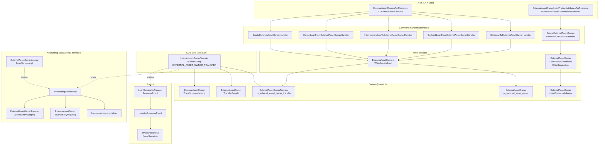

The `fineract-investor` Gradle module adds **asset externalization** to Apache Fineract. It lets an originator (the host bank running Fineract) sell an individual loan — or a batch of loans — to a third-party investor and later buy it back, while the loan account itself remains on Fineract's books for servicing. Every business-day transition (sale becomes effective, buyback closes, same-day sale-and-buyback cancels) is driven by the nightly Close of Business pipeline and produces a balanced set of journal entries plus a Kafka business event that downstream systems can replay.

This page is the index for the wiki sub-section. It explains the conceptual model, inventories every Java file under `fineract-investor/src/main/java/org/apache/fineract/investor/`, and points to the dedicated reference pages for the domain entities, lifecycle, REST APIs, COB step, accounting integration, and event payloads.

<Info>
The whole module is **conditional**. `fineract-investor/src/main/java/org/apache/fineract/investor/config/InvestorModuleIsEnabledCondition.java` reads `fineract.module.investor.enabled` from the Spring properties. If that flag is `false`, none of the API resources, the COB step, the journal-entry listener, or the command handlers are registered. The two JAX-RS resources, the `LoanAccountOwnerTransferBusinessStep`, and `ExternalAssetOwnerJournalEntryServiceImpl` each declare `@Conditional(InvestorModuleIsEnabledCondition.class)` so a Fineract instance compiled against the module can still run with investor functionality dormant.
</Info>

## What asset externalization means

The word "asset" here means a single loan account. The investor (an `ExternalAssetOwner`) buys the *right to the future cash flows* of that loan at a negotiated `purchasePriceRatio` (a string like `"1.05"` meaning the investor pays 105 % of book), while Fineract continues to receive client payments, calculate accruals, manage charges, and report delinquency. From Fineract's bookkeeping perspective the transition is a **two-leg journal entry**: the loan's outstanding balances (principal, interest, fees, penalties, overpaid amount) leave the originator's books on one side of an `ASSET_TRANSFER` clearing account, then re-enter on the other side mapped to the new owner. The same machinery runs in reverse for a **buyback**.

Three operational shapes are supported:

1. **Sale** — one transfer entry in `PENDING`, the COB step on the requested `settlementDate` flips it to `ACTIVE`.
2. **Buyback** — one transfer entry in `BUYBACK`, the COB step on the settlement date flips it to `ACTIVE` again but with `effectiveDateTo = settlementDate` so the previous active row expires.
3. **Intermediary sale** (delayed settlement) — an `ACTIVE_INTERMEDIATE` ownership step where an intermediary briefly holds the asset before the final investor takes it. Only available when the loan product has the `SETTLEMENT_MODEL=DELAYED_SETTLEMENT` attribute configured.

If a sale and a buyback for the same loan and same settlement date are both pending, the COB step **cancels both** with the `SAMEDAY_TRANSFERS` sub-status — see `handleSameDaySaleAndBuyback(...)` in `LoanAccountOwnerTransferBusinessStep`.

## Module mermaid



## File inventory

Below is every Java file under `fineract-investor/src/main/java/org/apache/fineract/investor/`, grouped by sub-package, with a one-line role.

### `accounting/journalentry/service/`

| File | Role |
|---|---|
| `InvestorAccountingHelper.java` | Wraps `JournalEntryRepository` to create the debit/credit pairs against the investor `ASSET_TRANSFER` financial-activity GL account and resolves loan-product mappings. Prefixes every saved transaction id with the literal `I` (`INVESTOR_TRANSFER_IDENTIFIER`). |

### `api/`

| File | Role |
|---|---|
| `ExternalAssetOwnersApiResource.java` | JAX-RS `@Path("/v1/external-asset-owners")` — sale/buyback/cancel/intermediary commands and the GETs that return transfer and journal-entry data. |
| `ExternalAssetOwnersApiResourceSwagger.java` | Swagger request/response schema classes referenced by the resource above. |
| `ExternalAssetOwnerLoanProductAttributesApiResource.java` | JAX-RS `@Path("/v1/external-asset-owners/loan-product")` — POST/GET/PUT loan-product attributes (currently the `SETTLEMENT_MODEL` capability flag). |
| `ExternalAssetOwnerLoanProductAttributesApiResourceSwagger.java` | Swagger schemas for the loan-product attributes endpoints. |
| `ExternalAssetOwnerLoanProductAttributesApiConstants.java` | Constant strings used by attribute serialization (resource name, parameter names). |
| `search/ExternalAssetOwnersSearchApi.java` | Generated/abstract spec used by the search delegate. |
| `search/ExternalAssetOwnersSearchApiDelegate.java` | Implements paged search over transfers with text and date-range filters; delegates to `ExternalAssetOwnerSearchService`. |

### `cob/loan/`

| File | Role |
|---|---|
| `LoanAccountOwnerTransferBusinessStep.java` | The `LoanCOBBusinessStep` registered as `EXTERNAL_ASSET_OWNER_TRANSFER` — picks up pending transfers whose `settlementDate` equals the current business date and activates, declines, or cancels them. |

### `config/`

| File | Role |
|---|---|
| `InvestorModuleIsEnabledCondition.java` | Spring `Condition` reading `FineractProperties.module.investor.enabled`. |
| `LoanAccountOwnerTransferConfiguration.java` | Java config providing the default `LoanTransferabilityService` bean. Marked `@ConditionalOnMissingBean` so downstream forks can override. |

### `data/`

| File | Role |
|---|---|
| `ExternalTransferStatus.java` | Enum: `ACTIVE`, `ACTIVE_INTERMEDIATE`, `DECLINED`, `PENDING`, `PENDING_INTERMEDIATE`, `BUYBACK`, `BUYBACK_INTERMEDIATE`, `CANCELLED`. |
| `ExternalTransferSubStatus.java` | Enum: `BALANCE_ZERO`, `BALANCE_NEGATIVE`, `SAMEDAY_TRANSFERS`, `USER_REQUESTED`, `UNSOLD`. |
| `ExternalTransferRequestParameters.java` | Constant JSON keys for sale/buyback bodies. |
| `ExternalAssetOwnerLoanProductAttributeRequestParameters.java` | Constant JSON keys for the loan-product attribute endpoints (`attributeKey`, `attributeValue`). |
| `ExternalTransferData.java` | Read-side DTO returned by GET transfers. |
| `ExternalTransferDataDetails.java` | Outstanding-balance breakdown attached to `ExternalTransferData`. |
| `ExternalTransferLoanData.java` | Loan summary block in `ExternalTransferData`. |
| `ExternalTransferOwnerData.java` | Owner block in `ExternalTransferData`. |
| `ExternalTransferLoanProductAttributesData.java` | Read-side DTO for loan-product attributes. |
| `ExternalOwnerJournalEntryData.java`, `ExternalOwnerTransferJournalEntryData.java` | Paged journal-entry views for owner / transfer. |
| `ExternalTransferResponseData.java`, `ExternalTransferChangedData.java` | Response payloads for the write endpoints. |
| `request/ExternalAssetOwnerRequest.java` | POJO consumed by Swagger for the `transfers/loans/{loanId}` body. |
| `attribute/ExternalAssetOwnerLoanProductAttribute.java` | Marker interface for the capability-flag enums. |
| `attribute/SettlementModelExternalAssetOwnerLoanProductAttribute.java` | The only implementation today: `SETTLEMENT_MODEL = DEFAULT_SETTLEMENT \| DELAYED_SETTLEMENT`. |

### `domain/`

| File | Role |
|---|---|
| `ExternalAssetOwner.java` | JPA entity for `m_external_asset_owner`. Just an id + a unique `external_id`. |
| `ExternalAssetOwnerRepository.java` | Spring Data JPA repository for the owner entity. |
| `ExternalAssetOwnerTransfer.java` | JPA entity for `m_external_asset_owner_transfer` — the per-loan transition row. |
| `ExternalAssetOwnerTransferDetails.java` | One-to-one outstanding-balance snapshot frozen at settlement. |
| `ExternalAssetOwnerTransferRepository.java` | JPA + JpaSpecificationExecutor for transfer lookups (effective transfers, active by loan id, by external id). |
| `ExternalAssetOwnerTransferLoanMapping.java` + `Repository` | Materialised view of the *currently active* (loan, owner-transfer) pair — used as a fast lookup by the journal-entry listener. |
| `ExternalAssetOwnerJournalEntryMapping.java` + `Repository` | Links a `JournalEntry` to the `ExternalAssetOwner` who currently holds the cash flow. |
| `ExternalAssetOwnerTransferJournalEntryMapping.java` + `Repository` | Links a `JournalEntry` back to the `ExternalAssetOwnerTransfer` that created it. |
| `ExternalAssetOwnerLoanProductAttribute.java` (read-side) + `Repository` | Persistent projection used by the read service. |
| `ExternalAssetOwnerLoanProductAttributes.java` + `Repository` | Mutable write-side entity: `(loan_product_id, attribute_key, attribute_value)`. |
| `AttributeKey.java` | Interface for documenting an attribute key/value pair. |
| `InvestorBusinessEvent.java` | Abstract base class for investor business events; sets category = `"Investor"` and aggregate root = loan id. |
| `LoanOwnershipTransferBusinessEvent.java` | Concrete event type emitted by the COB step on every state transition. |
| `ExternalIdConverter.java` | JPA attribute converter `ExternalId ⇄ String`. |
| `search/SearchingExternalAssetOwnerRepository*.java` | Custom paged search implementation used by `/search`. |
| `search/SearchedExternalAssetOwner.java` | DTO returned by the search SQL. |

### `enricher/`

| File | Role |
|---|---|
| `LoanAccountDataV1Enricher.java` | Hooks into the Avro loan-account event payload and stamps the active investor's external id, settlement date, and purchase-price ratio. |
| `LoanChargeDataV1Enricher.java` | Same idea for the charge sub-payload. |
| `LoanTransactionDataV1Enricher.java`, `LoanTransactionAdjustmentDataV1Enricher.java` | Same for repayments and adjustments. |

### `exception/`

| File | Role |
|---|---|
| `ExternalAssetOwnerDuplicateException.java` | Thrown when creating an owner whose external id already exists. |
| `ExternalAssetOwnerInitiateTransferException.java` | The main "this transfer cannot be done" exception — has a Jersey exception mapper at `exception/exceptionmapper/`. |
| `ExternalAssetOwnerNotFoundException.java`, `ExternalAssetOwnerTransferNotFoundException.java` | 404-style domain exceptions. |
| `ExternalAssetOwnerLoanProductAttribute*Exception.java` | Distinct errors for not-found / already-exists / invalid-settlement / generic attribute problems. |

### `handler/`

The module ships its command handlers in `service/`, not `handler/`. The `service/*Handler.java` files implement `NewCommandSourceHandler` and are wired into the command-source pipeline via the `@CommandType` annotation — see [Portfolio command source](/command/portfolio-command-source).

### `internal/`

| File | Role |
|---|---|
| `InternalAPIForTesting.java` | Test-only JAX-RS endpoint used by integration tests to flip transfer state outside the normal lifecycle. |

### `serialization/`

| File | Role |
|---|---|
| `ExternalAssetOwnerValidator.java` | JSON validator for the `ASSET_OWNER:CREATE` command — checks required fields and external-id length. |

### `service/`

Write and read services, command handlers, helpers — the bulk of the module:

| File | Role |
|---|---|
| `SaleLoanToExternalAssetOwnerHandler.java` | `@CommandType(entity="LOAN", action="SALE")` — calls `WriteService.saleLoanByLoanId(command)`. |
| `BuybackLoanFromExternalAssetOwnerHandler.java` | `@CommandType(entity="LOAN", action="BUYBACK")` — calls `WriteService.buybackLoanByLoanId(command)`. |
| `IntermediarySaleToExternalAssetOwnerHandler.java` | `@CommandType(entity="LOAN", action="INTERMEDIARYSALE")` — calls `WriteService.intermediarySaleLoanByLoanId(command)`. |
| `CancelLoanFromExternalAssetOwnerHandler.java` | `@CommandType(entity="ASSET_OWNER_TRANSACTION", action="CANCEL")` — calls `WriteService.cancelTransactionById(command)`. |
| `CancelTransactionFromExternalAssetOwnerHandler.java` | Older alias kept for backwards compatibility. |
| `CreateExternalAssetOwnerHandler.java` | `@CommandType(entity="EXTERNAL_ASSET_OWNER", action="CREATE")` — creates an `ExternalAssetOwner` row. |
| `CreateExternalAssetOwnerLoanProductAttributeHandler.java`, `UpdateExternalAssetOwnerLoanProductAttributeHandler.java` | Loan-product attribute write handlers. |
| `ExternalAssetOwnersWriteService.java` + `Impl` | The 650-line core write service — validates and stores `Sale`, `IntermediarySale`, `Buyback`, `Cancel`, `Create` requests. |
| `ExternalAssetOwnersReadService.java` + `Impl` | The read counterpart — paged transfer lookups, active-transfer retrieval, journal-entry retrieval, owner listing. |
| `ExternalAssetOwnerHelper.java` | Owner upsert helper used to avoid duplicate-owner races (`REQUIRES_NEW` find-or-create). |
| `ExternalAssetOwnerLoanProductAttributesReadService.java` + `Impl` | Paged attribute lookup, optionally filtered by `attributeKey`. Cached. |
| `ExternalAssetOwnerLoanProductAttributesWriteService.java` + `Impl` | Validate-and-store attribute create/update. Uses reflection to discover all `ExternalAssetOwnerLoanProductAttribute` enums and accept their (key, value) pairs. |
| `ExternalAssetOwnerLoanProductAttributesMapper.java` | Entity ↔ DTO mapping. |
| `DelayedSettlementAttributeService.java` + `Impl` | Convenience wrapper that asks the attributes read service "does this loan product have `SETTLEMENT_MODEL=DELAYED_SETTLEMENT`?". |
| `LoanTransferabilityService.java` + `Impl` | Whether a loan can actually be sold right now — checks outstanding > 0, returns the decline sub-status (`BALANCE_ZERO` or `BALANCE_NEGATIVE`). |
| `LoanAccountOwnerTransferService.java` + `Impl` | Called by the loan close/overpaid hook — decides whether to decline a pending transfer, cancel it, or execute a pending buyback when the loan itself reaches a terminal state. |
| `ExternalAssetOwnerLoanStatusChangePlatformService.java` + `Impl` | Bridge that the loan module calls when a loan transitions to `CLOSED`/`OVERPAID`. |
| `ExternalAssetOwnerJournalEntryService.java` + `Impl` | Spring component that subscribes to `LoanJournalEntryCreatedBusinessEvent`; for every new journal entry it asks "is this loan owned by an external asset owner?" and if so writes an `ExternalAssetOwnerJournalEntryMapping` row. |
| `AccountingService.java` + `Impl` | Posts the matched debit/credit journal-entry pair for a sale or a buyback against the asset-transfer financial-activity account. |
| `ExternalAssetOwnerTransferOutstandingInterestCalculation.java` | Strategy hook for "how to value outstanding interest at settlement". Default uses the loan summary. |
| `ExternalAssetOwnersTransferMapper.java` | Maps entity to `ExternalTransferData`. |
| `search/ExternalAssetOwnerSearchService.java` | Implements the paged search backing `/search`. |
| `search/domain/ExternalAssetOwnerSearchRequest.java`, `search/mapper/ExternalAssetOwnerSearchDataMapper.java` | Request and mapper for the search endpoint. |
| `serialization/serializer/investor/InvestorBusinessEventSerializer.java` | Avro serialiser that turns a `LoanOwnershipTransferBusinessEvent` into a `LoanOwnershipTransferDataV1` record for the external-event publishing pipeline. |

### `statuses/`

There is no `statuses/` sub-package in the source tree at the time of writing — the status and sub-status enums live in `data/`. The directive is preserved here because `data/ExternalTransferStatus.java` and `data/ExternalTransferSubStatus.java` *are* the status types described in `external-asset-owner-domain.mdx` and `transfer-lifecycle.mdx`.

## How the pieces fit together at runtime

1. An operator (or downstream system) POSTs to `/v1/external-asset-owners/transfers/loans/{loanId}?command=sale` with `settlementDate`, `ownerExternalId`, `transferExternalId`, `purchasePriceRatio` in the body.
2. `ExternalAssetOwnersApiResource` looks up the command in its in-resource `COMMAND_HANDLER_REGISTRY`, builds a `CommandWrapper` via `CommandWrapperBuilder.saleLoanToExternalAssetOwner(loanId)`, and logs it through `PortfolioCommandSourceWritePlatformService`.
3. The command pipeline routes the command to `SaleLoanToExternalAssetOwnerHandler` (matched on `@CommandType(entity="LOAN", action="SALE")`).
4. The handler calls `ExternalAssetOwnersWriteServiceImpl.saleLoanByLoanId(command)`, which validates the body, asserts the loan is in an allowed status, asserts there is no in-flight transfer, and persists a row in `m_external_asset_owner_transfer` with status `PENDING` and `effectiveDateFrom = today`, `effectiveDateTo = 9999-12-31`.
5. The HTTP response carries the new transfer's id and external id.
6. Each night, COB runs the `LoanAccountOwnerTransferBusinessStep` for every loan that has an open lock. When the business date catches up to the transfer's `settlementDate`, the step flips it from `PENDING` to `ACTIVE`, calls `LoanJournalEntryPoster.postJournalEntriesForExternalOwnerTransfer(loan, transfer, previousOwner)`, writes the `ExternalAssetOwnerTransferLoanMapping`, and fires a `LoanOwnershipTransferBusinessEvent`.
7. From then on, every new journal entry produced for that loan triggers `ExternalAssetOwnerJournalEntryServiceImpl`'s `LoanJournalEntryCreatedBusinessEvent` listener, which writes an `ExternalAssetOwnerJournalEntryMapping` row so the originator can later answer "list all journal entries belonging to investor X".

## Per-page index

The remaining pages in this sub-section dive into each layer:

| Page | Focus |
|---|---|
| [External asset owner domain](/investor/external-asset-owner-domain) | JPA entities `ExternalAssetOwner`, `ExternalAssetOwnerTransfer`, `ExternalAssetOwnerTransferDetails`, the status / sub-status enums, settlement amounts. |
| [Transfer lifecycle](/investor/transfer-lifecycle) | Sale → buyback state machine, effective vs settlement date, same-day handling. |
| [Investor API](/investor/investor-api) | `ExternalAssetOwnersApiResource` — every method / path / handler. |
| [Loan product attributes API](/investor/loan-product-attributes-api) | `ExternalAssetOwnerLoanProductAttributesApiResource` — the `SETTLEMENT_MODEL` capability flag. |
| [Investor COB step](/investor/investor-cob-step) | `LoanAccountOwnerTransferBusinessStep` — the executable lifecycle. Cross-links to [COB investor steps](/cob/investor-cob-steps). |
| [Journal-entry integration](/investor/journal-entry-integration) | `AccountingServiceImpl` + `ExternalAssetOwnerJournalEntryServiceImpl` — the debit/credit choreography and the per-journal-entry owner mapping. |
| [Investor events](/investor/investor-events) | `InvestorBusinessEvent` hierarchy and the Avro `LoanOwnershipTransferDataV1` payload. |

## Module dependencies

The module's Gradle declaration (`fineract-investor/build.gradle`) wires it into the rest of the platform:

- **`fineract-core`** — `ExternalId`, `AbstractAuditableWithUTCDateTimeCustom`, the JSON serialization helpers, the `BusinessEvent` infrastructure, `PortfolioCommandSourceWritePlatformService`, `JsonCommand`, and the `CommandWrapperBuilder` extensions used to build the wrapper.
- **`fineract-loan`** — `Loan`, `LoanCharge`, `LoanSummary`, `LoanCOBBusinessStep`, and the read service that returns `LoanDataForExternalTransfer` (the lightweight projection used during sale validation).
- **`fineract-accounting`** — `JournalEntry`, `GLAccount`, `ProductToGLAccountMapping`, `FinancialActivityAccount`, `GLClosure`. The investor module never opens the GL account map directly; it goes through `InvestorAccountingHelper` which delegates to the same repositories that `fineract-accounting` uses.
- **`fineract-avro-schemas`** — the Avro `LoanOwnershipTransferDataV1`, `UnpaidChargeDataV1`, `CurrencyDataV1`, `LoanAccountDataV1` (for the enricher), and friends.
- **`fineract-provider`** — at runtime, supplies `LoanJournalEntryPoster`. The COB step calls `loanJournalEntryPoster.postJournalEntriesForExternalOwnerTransfer(loan, transfer, previousOwner)` and the poster wires the call to `AccountingServiceImpl` inside this module.

Reverse dependencies are limited to two small touch-points:

1. `fineract-provider` queries the `ExternalAssetOwnerTransferRepository` via `LoanAccountDataV1Enricher`, `LoanChargeDataV1Enricher`, etc., when serialising loan-account events — the enrichers live inside `fineract-investor/enricher/` and are auto-discovered as `DataEnricher` beans.
2. The loan-status-change callback (`ExternalAssetOwnerLoanStatusChangePlatformService`) is invoked by the loan write service when a loan transitions to `CLOSED` or `OVERPAID`, so any in-flight investor transfers can be declined / executed in the same business day.

## Feature flag and conditional wiring

Every Spring component in the module is gated by one of two annotations:

```java
@Conditional(InvestorModuleIsEnabledCondition.class)    // for JAX-RS resources, COB step, listeners
@ConditionalOnMissingBean(LoanTransferabilityService.class)   // for the default transferability impl
```

The first is bound to the property `fineract.module.investor.enabled` via `InvestorModuleIsEnabledCondition`:

```java
public class InvestorModuleIsEnabledCondition extends PropertiesCondition {
    @Override
    protected boolean matches(FineractProperties properties) {
        return properties.getModule().getInvestor().isEnabled();
    }
}
```

When the flag is `false`:

- `ExternalAssetOwnersApiResource` and `ExternalAssetOwnerLoanProductAttributesApiResource` are **not** registered with Jersey — every `/v1/external-asset-owners*` request returns HTTP 404.
- `LoanAccountOwnerTransferBusinessStep` is **not** registered with `LoanCOBBusinessStepRepository` — the `EXTERNAL_ASSET_OWNER_TRANSFER` step is invisible to the COB engine and even if a tenant has it in `m_batch_business_step_config`, it will be missing at scheduling time.
- `ExternalAssetOwnerJournalEntryServiceImpl` is **not** instantiated — no `LoanJournalEntryCreatedBusinessEvent` listener is added, so subsequent loan journal entries are not tagged.
- The enricher classes still load (they are not conditional) but they short-circuit immediately when `findActiveByLoanId` returns empty, which it always will if no transfers are persisted.

This makes the module safe to ship in a binary that doesn't intend to use it.

## Pages-to-source quick reference

| Source file | Documented in |
|---|---|
| `domain/ExternalAssetOwner.java`, `.../ExternalAssetOwnerTransfer.java`, `.../ExternalAssetOwnerTransferDetails.java` | [/investor/external-asset-owner-domain](/investor/external-asset-owner-domain) |
| `data/ExternalTransferStatus.java`, `data/ExternalTransferSubStatus.java` | [/investor/external-asset-owner-domain](/investor/external-asset-owner-domain), [/investor/transfer-lifecycle](/investor/transfer-lifecycle) |
| `service/ExternalAssetOwnersWriteServiceImpl.java`, `service/LoanAccountOwnerTransferServiceImpl.java`, `service/LoanTransferabilityServiceImpl.java` | [/investor/transfer-lifecycle](/investor/transfer-lifecycle) |
| `api/ExternalAssetOwnersApiResource.java`, `service/*Handler.java` | [/investor/investor-api](/investor/investor-api) |
| `api/ExternalAssetOwnerLoanProductAttributesApiResource.java`, `service/*LoanProductAttributes*.java`, `data/attribute/*.java`, `service/DelayedSettlementAttributeServiceImpl.java` | [/investor/loan-product-attributes-api](/investor/loan-product-attributes-api) |
| `cob/loan/LoanAccountOwnerTransferBusinessStep.java` | [/investor/investor-cob-step](/investor/investor-cob-step), [/cob/investor-cob-steps](/cob/investor-cob-steps) |
| `accounting/journalentry/service/InvestorAccountingHelper.java`, `service/AccountingServiceImpl.java`, `service/ExternalAssetOwnerJournalEntryServiceImpl.java` | [/investor/journal-entry-integration](/investor/journal-entry-integration) |
| `domain/InvestorBusinessEvent.java`, `domain/LoanOwnershipTransferBusinessEvent.java`, `service/serialization/serializer/investor/InvestorBusinessEventSerializer.java`, `enricher/*.java` | [/investor/investor-events](/investor/investor-events) |

## Cross-links

- Loan domain reference: [/loan/overview](/loan/overview)
- Accounting reference: [/accounting/overview](/accounting/overview)
- COB engine: [/cob/overview](/cob/overview) and the dedicated [/cob/investor-cob-steps](/cob/investor-cob-steps)
- External-event publishing: [/events/overview](/events/overview)
- Investor REST API reference: [/api/investor-apis](/api/investor-apis)
