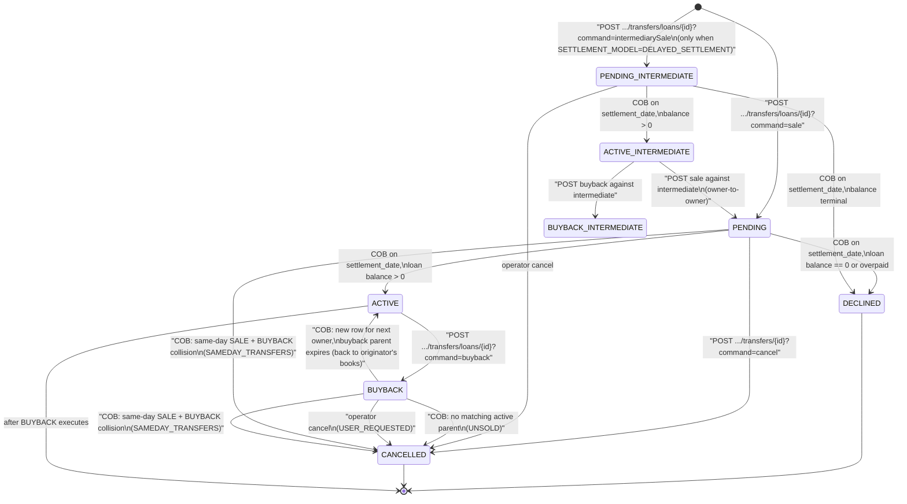

This page documents the full lifecycle of an `ExternalAssetOwnerTransfer` row in Apache Fineract — from the `POST /transfers/loans/{loanId}?command=sale` that creates it, through the Close of Business activation that flips it to `ACTIVE`, to the buyback that retires it. It draws together the write-side validations in `ExternalAssetOwnersWriteServiceImpl`, the COB-step transitions in `LoanAccountOwnerTransferBusinessStep`, and the post-execution `LoanAccountOwnerTransferServiceImpl` hooks that fire when the loan itself closes.

The status enum is documented in the [domain model page](/investor/external-asset-owner-domain). The COB step's `execute(Loan)` body is dissected in [Investor COB step](/investor/investor-cob-step). This page focuses on the **transitions**: who creates a row, who changes it, on what date, with what side effects.

## The core invariants

Before walking through the flow it helps to fix the invariants the code relies on:

1. **A transfer row is immutable except for `effective_date_to`.** Activating, declining, or cancelling never updates the original row's status — it writes a *new* row and expires the old one.
2. **At most one row per loan has `effective_date_to = 9999-12-31` for live statuses** (`ACTIVE`, `ACTIVE_INTERMEDIATE`, `PENDING`, `PENDING_INTERMEDIATE`, `BUYBACK`, `BUYBACK_INTERMEDIATE`). The exception is the brief window where a `BUYBACK` row exists alongside its `ACTIVE` parent — both have open end dates until the COB step on the settlement date closes them simultaneously.
3. **`settlement_date >= business_date` at creation time.** `validateSettlementDate(...)` rejects past settlement dates.
4. **The COB step runs at most once per loan per day.** It picks up rows whose `settlement_date` matches today; the `LOAN_COB` lock ensures no other writer is touching the loan.

## High-level state machine



## Sale flow — the simple case

### Step 1 — sale request

The operator calls

```http
POST /v1/external-asset-owners/transfers/loans/{loanId}?command=sale
Content-Type: application/json
{
  "settlementDate": "2025-04-15",
  "ownerExternalId": "INVESTOR-ACME-001",
  "transferExternalId": "TRF-2025-04-15-loan-123",
  "purchasePriceRatio": "1.02",
  "dateFormat": "yyyy-MM-dd",
  "locale": "en"
}
```

`ExternalAssetOwnersApiResource.transferRequestWithLoanId(...)` looks up `sale` in its internal `COMMAND_HANDLER_REGISTRY`, builds the `CommandWrapper` and persists a command-source row. The command pipeline routes the wrapper to `SaleLoanToExternalAssetOwnerHandler` which is bound by `@CommandType(entity="LOAN", action="SALE")`.

### Step 2 — `ExternalAssetOwnersWriteServiceImpl.saleLoanByLoanId`

```java
@Override @Transactional
public CommandProcessingResult saleLoanByLoanId(JsonCommand command) {
    final JsonElement json = fromApiJsonHelper.parse(command.json());
    final LoanDataForExternalTransfer loanDataForExternalTransfer =
        fetchAndValidateLoanDataForExternalTransfer(command.getLoanId());
    final boolean isDelayedSettlementEnabled = delayedSettlementAttributeService
        .isEnabled(loanDataForExternalTransfer.getLoanProductId());
    validateSaleRequestBody(command.json());
    ExternalId externalId = getTransferExternalIdFromJson(json);
    validateExternalId(externalId);
    Long loanId = command.getLoanId();
    validateLoanStatus(loanDataForExternalTransfer, isDelayedSettlementEnabled);
    ExternalAssetOwnerTransfer externalAssetOwnerTransfer =
        createSaleTransfer(loanId, json, loanDataForExternalTransfer.getExternalId());
    validateSale(externalAssetOwnerTransfer, isDelayedSettlementEnabled);
    externalAssetOwnerTransferRepository.saveAndFlush(externalAssetOwnerTransfer);
    return buildResponseData(externalAssetOwnerTransfer);
}
```

The validations in order:

| Validation | Throws |
|---|---|
| Loan exists | `LoanNotFoundException` |
| Body shape: only `settlementDate`, `ownerExternalId`, `transferExternalId`, `transferExternalGroupId`, `purchasePriceRatio`, `dateFormat`, `locale`. `ownerExternalId` and `purchasePriceRatio` required; lengths capped at 100 / 50. | `PlatformApiDataValidationException` |
| `transferExternalId` not already used | `ExternalAssetOwnerInitiateTransferException("Already existing an asset transfer with the provided transfer external id: ...")` |
| Loan status is in `configurationDomainService.getAllowedLoanStatusesForExternalAssetTransfer()` (or `…OfDelayedSettlement…` when delayed settlement is on). | `ExternalAssetOwnerInitiateTransferException("Loan status %s is not valid for transfer.")` |
| `settlement_date >= business_date` | `ExternalAssetOwnerInitiateTransferException("Settlement date cannot be in the past")` |
| No conflicting effective transfer. Without delayed settlement: zero or one effective transfer, and if one it must be `ACTIVE` (so the owner-to-owner case is allowed). With delayed settlement: must have exactly one effective transfer in `ACTIVE_INTERMEDIATE` state. | `ExternalAssetOwnerInitiateTransferException` |

### Step 3 — `createSaleTransfer`

```java
private ExternalAssetOwnerTransfer createSaleTransfer(Long loanId, JsonElement json,
        ExternalId externalLoanId) {
    ExternalAssetOwnerTransfer externalAssetOwnerTransfer = new ExternalAssetOwnerTransfer();
    LocalDate effectiveFrom = ThreadLocalContextUtil.getBusinessDate();

    ExternalAssetOwner owner = getOwner(json);          // findByExternalId or find-or-create
    externalAssetOwnerTransfer.setOwner(owner);
    externalAssetOwnerTransfer.setExternalId(getTransferExternalIdFromJson(json));
    externalAssetOwnerTransfer.setStatus(PENDING);
    externalAssetOwnerTransfer.setPurchasePriceRatio(getPurchasePriceRatioFromJson(json));
    externalAssetOwnerTransfer.setSettlementDate(getSettlementDateFromJson(json));
    externalAssetOwnerTransfer.setEffectiveDateFrom(effectiveFrom);
    externalAssetOwnerTransfer.setEffectiveDateTo(FUTURE_DATE_9999_12_31);
    externalAssetOwnerTransfer.setLoanId(loanId);
    externalAssetOwnerTransfer.setExternalLoanId(externalLoanId);
    externalAssetOwnerTransfer.setExternalGroupId(getTransferExternalGroupIdFromJson(json));

    findPreviousAssetOwner(loanId).ifPresent(externalAssetOwnerTransfer::setPreviousOwner);

    return externalAssetOwnerTransfer;
}
```

Note that `previous_owner_id` is filled in **at creation**. The flow looks at the currently active transfer (if any) and copies its owner into `previous_owner_id`, so the owner-to-owner case is recorded on day-zero. There is no `ExternalAssetOwnerTransferDetails` row yet — that snapshot is created only when the COB step activates the row.

### Step 4 — COB step activates on `settlement_date`

The next time COB runs on a business date equal to `settlement_date`, `LoanAccountOwnerTransferBusinessStep.execute(loan)` finds the row, decides whether the loan is still transferable, and either:

- **Sells** — `sellAsset(loan, settlementDate, transfer)` activates the row, writes the `ExternalAssetOwnerTransferLoanMapping`, creates the `ExternalAssetOwnerTransferDetails` snapshot, and posts the journal entries via `LoanJournalEntryPoster.postJournalEntriesForExternalOwnerTransfer(...)`.
- **Declines** — `declinePendingEntry(...)` writes a new `DECLINED` row with `effective_date_to = settlement_date` and the appropriate sub-status.

In both cases the original `PENDING` row is expired (`effective_date_to = settlement_date`) — there is *no* `UPDATE` of `status`; the original `PENDING` row stays in the database for audit, and a fresh row with the terminal status is inserted.

```java
private ExternalAssetOwnerTransfer activatePendingEntry(LocalDate settlementDate,
        ExternalAssetOwnerTransfer pendingTransfer, ExternalTransferStatus activeStatus,
        ExternalAssetOwner previousOwner) {
    LocalDate effectiveFrom = settlementDate.plusDays(1);
    return createNewEntryAndExpireOldEntry(settlementDate, pendingTransfer, activeStatus, null,
        effectiveFrom, FUTURE_DATE_9999_12_31, previousOwner);
}
```

The new `ACTIVE` row's `effective_date_from` is `settlement_date + 1`. This matters: on the settlement date itself, the *expired* `PENDING` row covers ownership until end-of-day, and the new `ACTIVE` row takes over from the next business day. Read-side queries that ask "who owns this loan today?" should call `findActiveByLoanId(loanId)` (the COB step has finished by the time the next request comes in).

### Step 5 — `LoanOwnershipTransferBusinessEvent`

Right after the sale, the COB step fires

```java
businessEventNotifierService.notifyPostBusinessEvent(
    new LoanOwnershipTransferBusinessEvent(newExternalAssetOwnerTransfer, loan));
if (!ExternalTransferStatus.DECLINED.equals(newExternalAssetOwnerTransfer.getStatus())) {
    businessEventNotifierService.notifyPostBusinessEvent(
        new LoanAccountSnapshotBusinessEvent(loan));
}
```

The follow-on `LoanAccountSnapshotBusinessEvent` is the standard loan-state snapshot consumed by the external-event publisher to broadcast the post-transfer loan picture (now enriched by `LoanAccountDataV1Enricher` with the new owner external id).

## Buyback flow

### Step 1 — buyback request

```http
POST /v1/external-asset-owners/transfers/loans/{loanId}?command=buyback
{
  "settlementDate": "2025-09-01",
  "transferExternalId": "BUYBACK-2025-09-01-loan-123",
  "dateFormat": "yyyy-MM-dd",
  "locale": "en"
}
```

`BuybackLoanFromExternalAssetOwnerHandler` calls `ExternalAssetOwnersWriteServiceImpl.buybackLoanByLoanId(command)`. The validations:

| Validation | Why |
|---|---|
| Loan exists. | `LoanNotFoundException`. |
| Body shape: only `settlementDate`, `transferExternalId`, `dateFormat`, `locale`. `settlementDate` required. | `PlatformApiDataValidationException`. |
| `transferExternalId` not reused. | `ExternalAssetOwnerInitiateTransferException`. |
| `settlement_date >= business_date`. | Same. |
| Loan has an effective transfer and it is `ACTIVE` (or `ACTIVE_INTERMEDIATE` for delayed settlement). | `ExternalAssetOwnerInitiateTransferException("This loan cannot be bought back, …")`. |
| No buyback already in progress for the loan. | Same. |
| `buyback.settlement_date >= active.settlement_date`. | Same. |

### Step 2 — `createBuybackTransfer`

```java
private ExternalAssetOwnerTransfer createBuybackTransfer(
        ExternalAssetOwnerTransfer effectiveTransfer, LocalDate settlementDate,
        ExternalId externalId) {
    LocalDate effectiveDateFrom = DateUtils.getBusinessLocalDate();

    ExternalAssetOwnerTransfer t = new ExternalAssetOwnerTransfer();
    t.setExternalId(externalId);
    t.setOwner(effectiveTransfer.getOwner());                  // owner = current investor
    t.setStatus(determineStatusAfterBuyback(effectiveTransfer));
    t.setLoanId(effectiveTransfer.getLoanId());
    t.setExternalLoanId(effectiveTransfer.getExternalLoanId());
    t.setSettlementDate(settlementDate);
    t.setEffectiveDateFrom(effectiveDateFrom);
    t.setEffectiveDateTo(FUTURE_DATE_9999_12_31);
    t.setPurchasePriceRatio(effectiveTransfer.getPurchasePriceRatio());
    t.setPreviousOwner(effectiveTransfer.getOwner());          // same investor
    return t;
}

private ExternalTransferStatus determineStatusAfterBuyback(ExternalAssetOwnerTransfer effective) {
    return switch (effective.getStatus()) {
        case PENDING, ACTIVE -> ExternalTransferStatus.BUYBACK;
        case ACTIVE_INTERMEDIATE -> ExternalTransferStatus.BUYBACK_INTERMEDIATE;
        default -> throw new ExternalAssetOwnerInitiateTransferException(
            "This loan cannot be bought back, effective transfer is not in right state: " + effective.getStatus());
    };
}
```

Two effective rows now coexist (the `ACTIVE` parent and the `BUYBACK` child) until the COB step on `settlement_date` collapses them.

### Step 3 — COB step executes the buyback

```java
private ExternalAssetOwnerTransfer buybackAsset(Loan loan, LocalDate settlementDate,
        ExternalAssetOwnerTransfer buybackTransfer,
        ExternalAssetOwnerTransfer activeTransfer) {
    activeTransfer.setEffectiveDateTo(settlementDate);
    buybackTransfer.setEffectiveDateTo(settlementDate);
    buybackTransfer.setExternalAssetOwnerTransferDetails(
        createAssetOwnerTransferDetails(loan, buybackTransfer));
    externalAssetOwnerTransferRepository.save(activeTransfer);
    buybackTransfer = externalAssetOwnerTransferRepository.save(buybackTransfer);
    externalAssetOwnerTransferLoanMappingRepository
        .deleteByLoanIdAndOwnerTransfer(loan.getId(), activeTransfer);
    loanJournalEntryPoster.postJournalEntriesForExternalOwnerTransfer(loan, buybackTransfer, null);
    return buybackTransfer;
}
```

Both the `ACTIVE` parent and the `BUYBACK` row get `effective_date_to = settlement_date`. The active loan-mapping row is *deleted* (not soft-deleted) so future journal-entry events stop tagging this loan as externally owned. The buyback row gets its own `ExternalAssetOwnerTransferDetails` snapshot — same six amounts — and the buyback journal entries are posted (with the reversed debit/credit direction; see [Journal-entry integration](/investor/journal-entry-integration)).

After the buyback the loan is on the originator's books again. A subsequent sale produces a new `PENDING → ACTIVE` cycle.

### Sub-case — no matching active parent (`UNSOLD`)

If `findOne(...status=ACTIVE..., effectiveDateTo=9999-12-31...)` returns empty, the COB step routes through:

```java
newExternalAssetOwnerTransfer = createNewEntryAndExpireOldEntry(settlementDate,
    buybackExternalAssetOwnerTransfer,
    ExternalTransferStatus.CANCELLED, ExternalTransferSubStatus.UNSOLD,
    settlementDate, settlementDate);
```

The buyback row is replaced by a `CANCELLED` row with sub-status `UNSOLD`.

## Same-day sale + buyback collision

If both a `PENDING` and a `BUYBACK` row exist for the same loan with the same `settlement_date`, the COB step runs `handleSameDaySaleAndBuyback`:

```java
if (size == 2) {
    ExternalTransferStatus firstTransferStatus = transferDataList.get(0).getStatus();
    ExternalTransferStatus secondTransferStatus = transferDataList.get(1).getStatus();

    if (delayedSettlementAttributeService.isEnabled(loan.getLoanProduct().getId())) {
        throw new IllegalStateException(/* delayed settlement + 2 transfers = invalid */);
    }
    if (!ExternalTransferStatus.PENDING.equals(firstTransferStatus)
            || !ExternalTransferStatus.BUYBACK.equals(secondTransferStatus)) {
        throw new IllegalStateException(/* unexpected pair */);
    }
    handleSameDaySaleAndBuyback(settlementDate, transferDataList, loan);
}
```

Both rows are replaced by `CANCELLED` rows with sub-status `SAMEDAY_TRANSFERS`. Two `LoanOwnershipTransferBusinessEvent`s are fired (one per cancellation). No journal entries are posted, no loan-mapping row is touched.

## Cancellation by operator

```http
POST /v1/external-asset-owners/transfers/{id}?command=cancel
```

handled by `CancelLoanFromExternalAssetOwnerHandler`, calls `ExternalAssetOwnersWriteServiceImpl.cancelTransactionById(command)`. The validations:

| Check | Reason |
|---|---|
| Transfer with `id` exists. | `ExternalAssetOwnerInitiateTransferException("transfer with id X does not exist")`. |
| At least one effective transfer for the loan. | "no effective transfer for this loan". |
| The selected transfer is the *latest* effective transfer (`effective.getFirst().getId() == selectedTransfer.getId()`). | "selected transfer is not the latest". |
| Selected status ∈ `{PENDING, BUYBACK}`. | "the selected transfer status is not pending or buyback". |

If accepted, `createCancelTransfer(...)` writes a new row with `status = CANCELLED, subStatus = USER_REQUESTED`, copies the same dates from the original, and the original is updated with `effective_date_to = today`.

## Decline by the COB step (`BALANCE_ZERO` / `BALANCE_NEGATIVE`)

When the COB step hits a `PENDING` row but `LoanTransferabilityServiceImpl.isTransferable(loan, transfer)` returns `false`, the decline path runs:

```java
public boolean isTransferable(Loan loan, ExternalAssetOwnerTransfer t) {
    if (shouldValidateTransferable(loan, t)) {
        return MathUtil.nullToDefault(loan.getSummary().getTotalOutstanding(),
                                       BigDecimal.ZERO).compareTo(BigDecimal.ZERO) > 0;
    }
    return true;
}

public ExternalTransferSubStatus getDeclinedSubStatus(Loan loan) {
    if (MathUtil.nullToDefault(loan.getTotalOverpaid(),
                                BigDecimal.ZERO).compareTo(BigDecimal.ZERO) > 0) {
        return ExternalTransferSubStatus.BALANCE_NEGATIVE;
    }
    return ExternalTransferSubStatus.BALANCE_ZERO;
}
```

The decline path writes a new `DECLINED` row with that sub-status, leaves the loan on the originator's books, fires the `LoanOwnershipTransferBusinessEvent`, but does **not** fire the `LoanAccountSnapshotBusinessEvent` (nothing changed on the loan).

The "should validate" rule is the interesting case for delayed settlement:

```java
private boolean shouldValidateTransferable(Loan loan, ExternalAssetOwnerTransfer t) {
    if (!delayedSettlementAttributeService.isEnabled(loan.getLoanProduct().getId())) {
        return true;            // simple settlement → always validate
    }
    return ExternalTransferStatus.PENDING_INTERMEDIATE == t.getStatus();
    // delayed settlement: validate only the originator → intermediate hop;
    // the intermediate → investor hop is allowed even if balance is zero
}
```

Once the asset is held by the intermediate owner, the second leg (intermediate → investor) is no longer subject to the balance check, because the intermediate's portfolio decisions are out of Fineract's hands.

## Hook from loan closure / overpayment — `LoanAccountOwnerTransferServiceImpl`

The loan module calls `ExternalAssetOwnerLoanStatusChangePlatformService.handleLoanClosedOrOverpaid(loan)` when a repayment transitions a loan to `CLOSED` or `OVERPAID`. That call delegates to `LoanAccountOwnerTransferServiceImpl.handleLoanClosedOrOverpaid(loan)`:

```java
public void handleLoanClosedOrOverpaid(Loan loan) {
    Long loanId = loan.getId();
    List<ExternalAssetOwnerTransfer> transferDataList =
        findAllPendingOrBuybackOrIntermediateTransfers(loanId);

    if (transferDataList.size() > 1) {
        if (isSameDayTransfers(transferDataList)) {
            transferDataList.forEach(t -> cancelTransfer(loan, t, SAMEDAY_TRANSFERS));
        } else {
            declineTransfer(loan, transferDataList.get(0));
            transferDataList.stream().skip(1)
                .forEach(t -> cancelTransfer(loan, t, UNSOLD));
        }
    } else if (transferDataList.size() == 1) {
        ExternalAssetOwnerTransfer t = transferDataList.get(0);
        if (PENDING.equals(t.getStatus()) || PENDING_INTERMEDIATE.equals(t.getStatus())) {
            declineTransfer(loan, t);
        } else if (BUYBACK.equals(t.getStatus()) || BUYBACK_INTERMEDIATE.equals(t.getStatus())) {
            executePendingBuybackTransfer(loan, t);
        }
    }
}
```

This is the rare path that fires *outside* COB. It handles the case where a customer pays off a sold loan in full: any pending sale must be declined (the loan is no longer transferable), and any pending buyback should execute immediately so that the books reconcile on the same business day.

## Date semantics summary

| Date | Set by | Meaning |
|---|---|---|
| `settlement_date` | Caller (request body) | The future business day on which the COB step should execute the transition. Same value for the `PENDING` row and the resulting `ACTIVE`/`DECLINED`/`CANCELLED` row. |
| `effective_date_from` | Sale: `today` at creation; activation: `settlement_date + 1`. Buyback: `today` at creation. Cancel: copied from original. | First business day this row is the source of truth. |
| `effective_date_to` | Initially `9999-12-31`; set to `settlement_date` when the row is expired by the COB step (or to `today` when the operator cancels). | Last business day this row is the source of truth. |

## Transfer-event-type summary

The `LoanOwnershipTransferBusinessEvent` is fired in five places:

| Trigger | Event subject |
|---|---|
| `handleSale → ACTIVE` (COB activates a sale) | The new `ACTIVE` row. Avro `type = SALE` (or `INTERMEDIARYSALE` for `ACTIVE_INTERMEDIATE`). |
| `handleSale → DECLINED` (COB declines a sale) | The new `DECLINED` row. Avro `type` derived from the *original* PENDING row's intent. |
| `handleBuyback → ACTIVE` (COB completes a buyback) | The buyback row. Avro `type = BUYBACK`. |
| `handleBuyback → CANCELLED (UNSOLD)` | The cancelled row. Avro `type = BUYBACK`. |
| `handleSameDaySaleAndBuyback` | Both cancelled rows. |
| `LoanAccountOwnerTransferServiceImpl.handleLoanClosedOrOverpaid` | Same set of statuses, with the same Avro `type` mapping. |

The Avro `transferStatus` distinguishes the three meta-states: `EXECUTED` (all four `ACTIVE*`/`BUYBACK*` statuses), `DECLINED`, `CANCELLED`. The Avro `transferStatusReason` is the `subStatus.name()` or `null`. See [Investor events](/investor/investor-events) for the full Avro payload.

## Cross-links

- Domain entities and status enums: [/investor/external-asset-owner-domain](/investor/external-asset-owner-domain)
- COB step implementation walkthrough: [/investor/investor-cob-step](/investor/investor-cob-step), [/cob/investor-cob-steps](/cob/investor-cob-steps)
- API request bodies: [/investor/investor-api](/investor/investor-api)
- Delayed settlement capability: [/investor/loan-product-attributes-api](/investor/loan-product-attributes-api)
- Journal entries posted during transitions: [/investor/journal-entry-integration](/investor/journal-entry-integration), [/accounting/overview](/accounting/overview)
- Events emitted on transitions: [/investor/investor-events](/investor/investor-events), [/events/overview](/events/overview)
- Loan state changes that trigger the closed/overpaid hook: [/loan/overview](/loan/overview)
