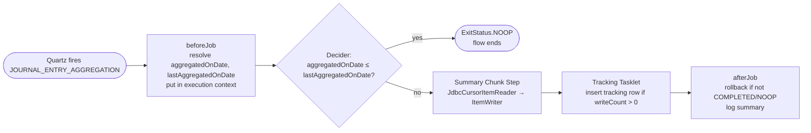

# Journal Entry Aggregation Job

`JOURNAL_ENTRY_AGGREGATION` is the **Apache Fineract** Spring Batch job that rolls thousands of low‑level `acc_gl_journal_entry` rows into a compact per‑day, per‑(GL account, product, office, currency, owner) summary. It is the only job in the platform that combines a `JobExecutionDecider`, a chunked `JdbcCursorItemReader`, a custom `ItemWriter`, a `Tasklet` and a `JobExecutionListener` in one flow — which makes it a useful template for any future reporting‑style batch.

The implementation lives under `org.apache.fineract.infrastructure.jobs.service.aggregationjob` in `fineract-provider`. The companion accounting page [`/accounting/journal-entry-aggregation`](/accounting/journal-entry-aggregation) covers the data model; this page focuses on the *Spring Batch wiring*.

## Class map

| Class | Role |
| --- | --- |
| `JournalEntryAggregationJobConfiguration` | `@Configuration`, conditional on `fineract.job.journal-entry-aggregation.enabled=true`; declares the `Job`, the two `Step`s, and wires the decider |
| `JournalEntryAggregationJobConstant` | `JOB_SUMMARY_STEP_NAME`, `JOB_TRACKING_STEP_NAME`, decider exit codes `CONTINUE_JOB_EXECUTION` / `NO_OP_EXECUTION`, execution‑context keys |
| `JournalEntryAggregationJobExecutionDecider` | Reads `aggregatedOnDate` and `lastAggregatedOnDate` from the job execution context; short‑circuits with `NOOP` when the day is already aggregated |
| `JournalEntryAggregationJobReader` (`@StepScope`) | `JdbcCursorItemReader<JournalEntryAggregationSummaryData>` against the tenant data source; SQL joins `acc_gl_journal_entry` with `m_loan`, `m_savings_account`, `m_provisioning_history`, `m_share_account` |
| `JournalEntryAggregationJobWriter` | `ItemWriter` + `StepExecutionListener`; stamps `jobExecutionId` onto each summary and calls `JournalEntryAggregationWriterService.insertJournalEntrySummaryBatch` |
| `JournalEntryAggregationTrackingTasklet` | Second step — inserts a row in the tracking table iff at least one summary was written |
| `JournalEntryAggregationJobListener` | `JobExecutionListener` — sets up the `aggregatedOnDate*` context keys before the run, rolls back partial inserts on failure, emits structured summary log on completion |
| `JournalEntryAggregationWriterService(Impl)` | The actual JDBC writes against the tenant `journal_entry_aggregation_summary` / `journal_entry_aggregation_tracking` tables |
| `JournalEntryAggregationSummaryData` / `JournalEntryAggregationTrackingData` | The two DTO shapes |

## Why two steps and a decider?

The shape is `decider → summary chunk step → tracking tasklet`, with the decider able to skip the whole pipeline:



The decider exists so that running the cron at 00:00:00 a second time on the same day (or in a tenant whose business date hasn't advanced) doesn't double‑aggregate. The tracking tasklet exists so that subsequent runs know what `lastAggregatedOnDate` to start from.

## The configuration class

```java
@Configuration
@ConditionalOnProperty(value = "fineract.job.journal-entry-aggregation.enabled", havingValue = "true")
public class JournalEntryAggregationJobConfiguration {

    @Bean
    public Step journalEntryAggregationSummaryStep() {
        return new StepBuilder(JOB_SUMMARY_STEP_NAME, jobRepository)
                .<JournalEntryAggregationSummaryData, JournalEntryAggregationSummaryData>chunk(
                        fineractProperties.getJob().getJournalEntryAggregation().getChunkSize(), transactionManager)
                .reader(journalEntryAggregationJobReader())
                .writer(aggregationItemWriter)
                .allowStartIfComplete(true)
                .build();
    }

    @Bean
    public JournalEntryAggregationJobReader journalEntryAggregationJobReader() {
        return new JournalEntryAggregationJobReader(tenantDataSourceFactory);
    }

    @Bean
    protected Step journalEntryAggregationTrackingStep() {
        return new StepBuilder(JOB_TRACKING_STEP_NAME, jobRepository)
                .tasklet(journalEntryAggregationTrackingTasklet, transactionManager)
                .build();
    }

    @Bean(name = "journalEntryAggregation")
    public Job journalEntryAggregation() {
        return new JobBuilder(JobName.JOURNAL_ENTRY_AGGREGATION.name(), jobRepository)
                .listener(journalEntryAggregationJobListener)
                .start(journalEntryAggregationJobExecutionDecider).on(JournalEntryAggregationJobConstant.NO_OP_EXECUTION).end()
                .from(journalEntryAggregationJobExecutionDecider).on(JournalEntryAggregationJobConstant.CONTINUE_JOB_EXECUTION)
                    .to(journalEntryAggregationSummaryStep()).next(journalEntryAggregationTrackingStep()).end()
                .incrementer(new RunIdIncrementer())
                .build();
    }
}
```

Notes:

- `@ConditionalOnProperty` means a disabled job is **not** in the `JobRegistry`, and `JobRegisterServiceImpl` will throw `JobIsNotFoundOrNotEnabledException` if the cron fires anyway.
- `allowStartIfComplete(true)` on the summary step is what makes a same‑day re‑run safe — Spring Batch will not refuse to rerun the step after `COMPLETED`.
- The job bean is registered both under its `JobName` (`JOURNAL_ENTRY_AGGREGATION`) and under the literal name `journalEntryAggregation` for direct injection.
- The flow uses the `JobBuilder.start(decider).on(...)` DSL — `NO_OP_EXECUTION` ends the job immediately; `CONTINUE_JOB_EXECUTION` chains both steps.

## Context keys

All inter‑step state lives in the `JobExecution`'s `ExecutionContext`:

| Key | Type | Set by | Read by |
| --- | --- | --- | --- |
| `aggregatedOnDate` | `LocalDate` | `JournalEntryAggregationJobListener.beforeJob` | Decider |
| `lastAggregatedOnDate` | `LocalDate?` | `JournalEntryAggregationJobListener.beforeJob` | Decider |
| `aggregatedOnDateFrom` | `LocalDate` | `JournalEntryAggregationJobListener.beforeJob` | Reader, tracking tasklet |
| `aggregatedOnDateTo` | `LocalDate` | `JournalEntryAggregationJobListener.beforeJob` | Reader, tracking tasklet |

The constants are defined once:

```java
public final class JournalEntryAggregationJobConstant {
    public static final String CONTINUE_JOB_EXECUTION = "CONTINUE_JOB_EXECUTION";
    public static final String NO_OP_EXECUTION = "NO_OP_EXECUTION";
    public static final String JOURNAL_ENTRY_AGGREGATION_JOB_NAME = "JOURNAL_ENTRY_AGGREGATION";
    public static final String JOB_SUMMARY_STEP_NAME = "JournalEntryAggregation Summary Insert - Step";
    public static final String JOB_TRACKING_STEP_NAME = "JournalEntryAggregation Tracking Insert - Step";
    public static final String AGGREGATED_ON_DATE = "aggregatedOnDate";
    public static final String AGGREGATED_ON_DATE_FROM = "aggregatedOnDateFrom";
    public static final String AGGREGATED_ON_DATE_TO = "aggregatedOnDateTo";
    public static final String LAST_AGGREGATED_ON_DATE = "lastAggregatedOnDate";
}
```

## The listener: dates in, rollback / log out

`beforeJob` resolves the date window and stages it on the execution context:

```java
@Override
public void beforeJob(final JobExecution jobExecution) {
    log.info("Journal Entry Aggregation Job Started  jobName={}, jobExecutionId={}",
            JOURNAL_ENTRY_AGGREGATION_JOB_NAME, jobExecution.getId());
    LocalDate providedAggregatedOnDate = (LocalDate) jobExecution.getExecutionContext()
            .get(JournalEntryAggregationJobConstant.AGGREGATED_ON_DATE);
    final LocalDate aggregatedOnDate = providedAggregatedOnDate != null
            ? providedAggregatedOnDate.minusDays(fineractProperties.getJob().getJournalEntryAggregation().getExcludeRecentNDays())
            : ThreadLocalContextUtil.getBusinessDateByType(BusinessDateType.BUSINESS_DATE)
                    .minusDays(fineractProperties.getJob().getJournalEntryAggregation().getExcludeRecentNDays());
    final LocalDate lastAggregatedOnDate = journalEntryAggregationTrackingRepository.findLatestAggregatedOnDate();

    initializeDates(jobExecution, aggregatedOnDate, lastAggregatedOnDate);
}

private void initializeDates(final JobExecution jobExecution, final LocalDate aggregatedOnDate, final LocalDate lastAggregatedOnDate) {
    jobExecution.getExecutionContext().put(JournalEntryAggregationJobConstant.AGGREGATED_ON_DATE, aggregatedOnDate);
    jobExecution.getExecutionContext().put(JournalEntryAggregationJobConstant.AGGREGATED_ON_DATE_TO, aggregatedOnDate);
    if (lastAggregatedOnDate == null) {
        jobExecution.getExecutionContext().put(JournalEntryAggregationJobConstant.LAST_AGGREGATED_ON_DATE, null);
        jobExecution.getExecutionContext().put(JournalEntryAggregationJobConstant.AGGREGATED_ON_DATE_FROM, LocalDate.of(1970, 1, 1));
    } else {
        jobExecution.getExecutionContext().put(JournalEntryAggregationJobConstant.LAST_AGGREGATED_ON_DATE, lastAggregatedOnDate);
        jobExecution.getExecutionContext().put(JournalEntryAggregationJobConstant.AGGREGATED_ON_DATE_FROM, lastAggregatedOnDate);
    }
}
```

Two important defaults:

- `aggregatedOnDate` defaults to `businessDate − fineract.job.journal-entry-aggregation.exclude-recent-N-days` (default 1). So at business date `2025‑01‑02`, the job aggregates up to and including `2025‑01‑01` — never the current open day.
- On the very first run (`lastAggregatedOnDate == null`), the window starts at `1970‑01‑01` so every historical entry is bucketed in a single first pass. Subsequent runs use the previous run's `aggregatedOnDateTo` as the new `aggregatedOnDateFrom`.

`afterJob` does two things:

```java
@Override
public void afterJob(final JobExecution jobExecution) {
    if (!successJobStatus.contains(jobExecution.getExitStatus().getExitCode())) {
        journalEntryAggregationWriterService.rollbackJournalEntrySummary(jobExecution.getId());
        journalEntryAggregationWriterService.rollbackJournalEntryTracking(jobExecution.getId());
    }
    logJobExecutionSummary(jobExecution);
}
```

- A failed run rolls back any rows tagged with that `jobExecutionId` from both summary and tracking tables. Because every inserted row carries the `jobExecutionId` column (see the writer below), this rollback is a `DELETE WHERE job_execution_id=:id` and is therefore safe to repeat.
- A structured log line (`Execution Summary for jobName=…, totalRecordProcessCount=…, jobExecutionDurationInMinutes=…, tenantId=…`) is emitted unconditionally — handy for log‑based dashboards.

`successJobStatus` is `[COMPLETED, NOOP]`, which is exactly the set the decider's two outcomes produce.

## The decider

```java
@Override
public FlowExecutionStatus decide(final JobExecution jobExecution, final StepExecution stepExecution) {
    final LocalDate aggregatedOnDate = (LocalDate) jobExecution.getExecutionContext()
            .get(JournalEntryAggregationJobConstant.AGGREGATED_ON_DATE);
    final LocalDate lastAggregatedOnDate = (LocalDate) jobExecution.getExecutionContext()
            .get(JournalEntryAggregationJobConstant.LAST_AGGREGATED_ON_DATE);

    if (aggregationAlreadyExist(lastAggregatedOnDate, aggregatedOnDate)) {
        log.info("Journal entry aggregation for given aggregatedOnDate already exist hence skipping ...");
        jobExecution.setExitStatus(ExitStatus.NOOP);
        return new FlowExecutionStatus(JournalEntryAggregationJobConstant.NO_OP_EXECUTION);
    }
    return new FlowExecutionStatus(JournalEntryAggregationJobConstant.CONTINUE_JOB_EXECUTION);
}

private boolean aggregationAlreadyExist(final LocalDate lastAggregatedOnDate, final LocalDate aggregatedOnDate) {
    if (Objects.isNull(lastAggregatedOnDate)) {
        return false;
    }
    return aggregatedOnDate.isBefore(lastAggregatedOnDate) || aggregatedOnDate.isEqual(lastAggregatedOnDate);
}
```

Decision matrix:

| `lastAggregatedOnDate` | `aggregatedOnDate` vs last | Outcome |
| --- | --- | --- |
| `null` | n/a (first run) | `CONTINUE_JOB_EXECUTION` |
| `2025-01-01` | `2025-01-02` (later) | `CONTINUE_JOB_EXECUTION` |
| `2025-01-01` | `2025-01-01` (same) | `NO_OP_EXECUTION` |
| `2025-01-01` | `2024-12-31` (earlier) | `NO_OP_EXECUTION` |

## The reader: a tenant‑scoped JDBC cursor

`JournalEntryAggregationJobReader` is `@StepScope` because the reader needs a tenant data source resolved at step time, not at `JobRegistry` boot time:

```java
@Component
@StepScope
public class JournalEntryAggregationJobReader extends JdbcCursorItemReader<JournalEntryAggregationSummaryData> {

    private LocalDate aggregatedOnDateFrom;
    private LocalDate aggregatedOnDateTo;

    public JournalEntryAggregationJobReader(TenantDataSourceFactory tenantDataSourceFactory) {
        FineractPlatformTenant tenant = ThreadLocalContextUtil.getTenant();
        setDataSource(tenantDataSourceFactory.create(tenant));
        setSql(buildAggregationQuery());
        setRowMapper(this::mapRow);
    }

    @BeforeStep
    public void beforeStep(StepExecution stepExecution) {
        ExecutionContext ctx = stepExecution.getJobExecution().getExecutionContext();
        this.aggregatedOnDateFrom = (LocalDate) ctx.get(JournalEntryAggregationJobConstant.AGGREGATED_ON_DATE_FROM);
        this.aggregatedOnDateTo = (LocalDate) ctx.get(JournalEntryAggregationJobConstant.AGGREGATED_ON_DATE_TO);

        setPreparedStatementSetter(ps -> {
            ps.setObject(1, aggregatedOnDateFrom);
            ps.setObject(2, aggregatedOnDateTo);
        });
    }
}
```

The two parameters injected into the cursor are read from the same execution context the listener populated. The row mapper builds the DTO:

```java
private JournalEntryAggregationSummaryData mapRow(ResultSet rs, int rowNum) throws SQLException {
    return JournalEntryAggregationSummaryData.builder()
            .glAccountId(rs.getLong("glAccountId"))
            .productId(rs.getLong("productId"))
            .office(rs.getLong("officeId"))
            .entityTypeEnum(rs.getLong("entityTypeEnum"))
            .currencyCode(rs.getString("currencyCode"))
            .submittedOnDate(ThreadLocalContextUtil.getBusinessDate())
            .aggregatedOnDate(JdbcSupport.getLocalDate(rs, "aggregatedOnDate"))
            .externalOwnerId(JdbcSupport.getLong(rs, "externalOwner"))
            .debitAmount(rs.getBigDecimal("debitAmount"))
            .creditAmount(rs.getBigDecimal("creditAmount"))
            .manualEntry(false)
            .build();
}
```

### The aggregation SQL (excerpt)

```sql
SELECT
    COALESCE(loan_product.id, savings_product.id, prov_product.id, share_product.id) AS productId,
    acc_gl_account.id AS glAccountId,
    acc_gl_journal_entry.entity_type_enum AS entityTypeEnum,
    acc_gl_journal_entry.office_id AS officeId,
    aw.owner_id AS externalOwner,
    SUM(CASE WHEN acc_gl_journal_entry.type_enum = 2 THEN amount ELSE 0 END) AS debitAmount,
    SUM(CASE WHEN acc_gl_journal_entry.type_enum = 1 THEN amount ELSE 0 END) AS creditAmount,
    acc_gl_journal_entry.submitted_on_date AS aggregatedOnDate,
    acc_gl_journal_entry.currency_code AS currencyCode
FROM acc_gl_account
JOIN acc_gl_journal_entry ON acc_gl_account.id = acc_gl_journal_entry.account_id

-- entity_type_enum = 1 → LOAN
LEFT JOIN m_loan loan
    ON loan.id = acc_gl_journal_entry.entity_id AND acc_gl_journal_entry.entity_type_enum = 1
LEFT JOIN m_product_loan loan_product
    ON loan_product.id = loan.product_id AND acc_gl_journal_entry.entity_type_enum = 1

-- entity_type_enum = 2 → SAVING
LEFT JOIN m_savings_account savings
    ON savings.id = acc_gl_journal_entry.entity_id AND acc_gl_journal_entry.entity_type_enum = 2
LEFT JOIN m_savings_product savings_product
    ON savings_product.id = savings.product_id AND acc_gl_journal_entry.entity_type_enum = 2

-- entity_type_enum = 3 → PROVISIONING
LEFT JOIN m_provisioning_history prov ...
LEFT JOIN m_loanproduct_provisioning_entry prov_entry ...
LEFT JOIN m_product_loan prov_product ...

-- entity_type_enum = 4 → SHARED
LEFT JOIN m_share_account share ...
LEFT JOIN m_share_product share_product ...
```

Each row in `acc_gl_journal_entry` carries an `entity_type_enum` discriminator (1=LOAN, 2=SAVING, 3=PROVISIONING, 4=SHARED). The query left‑joins each product table conditionally on that discriminator and `COALESCE`s the `productId` so the summary always has one column populated.

Aggregation is by:

- `glAccountId` — which GL account moved
- `productId` — the originating loan/savings/share/provisioning product
- `officeId` — which office booked the entry
- `entityTypeEnum` — the row category
- `currencyCode` — the currency
- `externalOwner` — external ownership transfer (sub‑ledger)
- `aggregatedOnDate` — the journal entry's `submitted_on_date`

Debits and credits are summed separately so the summary row records both legs of the daily activity.

## The writer

```java
@Override
public void write(Chunk<? extends JournalEntryAggregationSummaryData> journalEntrySummaries) {
    final Long jobExecutionId = stepExecution.getJobExecution().getId();
    List<JournalEntryAggregationSummaryData> summariesList = journalEntrySummaries.getItems().stream().map(item -> {
        item.setJobExecutionId(jobExecutionId);
        return (JournalEntryAggregationSummaryData) item;
    }).toList();
    journalEntryAggregationWriterService.insertJournalEntrySummaryBatch(summariesList);
}
```

The writer is also a `StepExecutionListener` so it can capture the current `StepExecution` and read `jobExecutionId` from it. Every inserted summary row carries that `jobExecutionId`, which is what makes the rollback in `afterJob` precise.

`fineract.job.journal-entry-aggregation.chunk-size` (default `2000`) controls the chunk size, so each transaction commits 2000 summary rows.

## The tracking tasklet

```java
@Override
public RepeatStatus execute(StepContribution contribution, ChunkContext chunkContext) throws Exception {
    Optional<StepExecution> jobSummaryStepExecution = contribution.getStepExecution().getJobExecution()
            .getStepExecutions().stream()
            .filter(stepExecution -> stepExecution.getStepName().equals(JournalEntryAggregationJobConstant.JOB_SUMMARY_STEP_NAME))
            .findFirst();
    long writeCount = jobSummaryStepExecution.map(StepExecution::getWriteCount).orElse(0L);

    log.info("Starting journal entry aggregation tasklet to insert into tracking table writeCount={}", writeCount);
    if (writeCount > 0) {
        final JobExecution jobExecutionContext = chunkContext.getStepContext().getStepExecution().getJobExecution();
        final LocalDate aggregatedOnDateFrom = (LocalDate) jobExecutionContext.getExecutionContext()
                .get(JournalEntryAggregationJobConstant.AGGREGATED_ON_DATE_FROM);
        final LocalDate aggregatedOnDateTo = (LocalDate) jobExecutionContext.getExecutionContext()
                .get(JournalEntryAggregationJobConstant.AGGREGATED_ON_DATE_TO);
        JournalEntryAggregationTrackingData journalEntrySummaryTrackingDTO = JournalEntryAggregationTrackingData.builder()
                .submittedOnDate(ThreadLocalContextUtil.getBusinessDate())
                .aggregatedOnDateFrom(aggregatedOnDateFrom)
                .aggregatedOnDateTo(aggregatedOnDateTo)
                .jobExecutionId(contribution.getStepExecution().getJobExecution().getId())
                .build();
        journalEntryAggregationWriterService.insertJournalEntryTracking(journalEntrySummaryTrackingDTO);
    }
    return RepeatStatus.FINISHED;
}
```

Two design choices:

- **Skip on zero writes.** If the summary step had nothing to write (no journal entries in the range), no tracking row is inserted, which means the decider on the next run will still see the original `lastAggregatedOnDate` and the job will retry the same date range.
- **One tracking row per run.** The tracking row carries `aggregatedOnDateFrom`, `aggregatedOnDateTo`, and `jobExecutionId`. The tracking repository's `findLatestAggregatedOnDate()` is what the listener uses to advance the window on the next cron tick.

## Configuration

```properties
fineract.job.journal-entry-aggregation.enabled=${FINERACT_JOB_JOURNAL_ENTRY_AGGREGATION_ENABLED:true}
fineract.job.journal-entry-aggregation.exclude-recent-N-days=${FINERACT_JOB_JOURNAL_ENTRY_AGGREGATION_EXCLUDE_RECENT_N_DAYS:1}
fineract.job.journal-entry-aggregation.chunk-size=${FINERACT_JOB_JOURNAL_ENTRY_AGGREGATION_CHUNK_SIZE:2000}
```

| Property | Meaning | Trade‑off |
| --- | --- | --- |
| `enabled` | If `false`, the `Job` bean is not registered; cron fires throw `JobIsNotFoundOrNotEnabledException` | Use to disable in tenants where aggregation is not desired |
| `exclude-recent-N-days` | Window backs off this many days from the business date | Higher = more time for late journal entries to settle before aggregation; lower = fresher summary |
| `chunk-size` | Spring Batch chunk size for the summary writer | Bigger = fewer commits, more transactional risk; smaller = slower throughput |

## Idempotency model

Because:

- Every summary row is tagged with `jobExecutionId`,
- A failed `afterJob` deletes every row with that id, and
- The tracking row that advances the window is only inserted when `writeCount > 0`,

the job is **safely retryable**: a crashed run leaves no half‑aggregated data, and the next cron tick will re‑run the same date window. The decider's `NOOP` short‑circuit ensures a manual re‑run of a *successful* day is also a no‑op.

## Observability

The listener emits one structured log line per run:

```
Execution Summary for jobName=JOURNAL_ENTRY_AGGREGATION, aggregatedDateFrom=2024-12-31, aggregatedDateTo=2025-01-01,
totalRecordProcessCount=18432, startTime=2025-01-02T00:01:03Z, endTime=2025-01-02T00:01:47Z,
startTime_ms=..., endTime_ms=..., jobExecutionId=174, jobExecutionDurationInMinutes=0, tenantId=acme
```

Together with the `BATCH_JOB_EXECUTION` row (status + exit code) this is enough to alarm on:

- A `FAILED` exit
- A `COMPLETED` exit with `totalRecordProcessCount=0` for more than N runs (possible reader/SQL regression)
- A `jobExecutionDurationInMinutes` outlier

## Operational scenarios

| Scenario | What happens |
| --- | --- |
| First ever run | `lastAggregatedOnDate=null` → window `1970-01-01 .. (businessDate - excludeRecentNDays)`; one tracking row inserted |
| Daily steady state | Window advances by 1 day per run; one tracking row per run |
| Business date stays put for a day | Decider returns `NOOP`; `BATCH_JOB_EXECUTION.exit_code = NOOP` |
| Operator backfills journal entries on a past date | `lastAggregatedOnDate` is unchanged, so subsequent runs do not pick up the past day; manual remediation needed (truncate tracking row, run again) |
| Listener `beforeJob` reads custom `aggregatedOnDate` from job parameters | Backfill / replay use case — operator passes an explicit date via the inline job API; the `exclude-recent-N-days` offset is still applied |
| Failure mid‑chunk | `afterJob` rolls back summary + tracking rows by `jobExecutionId`; window is unchanged; next run retries |
| `enabled=false` | Bean not registered; if a `job` row still exists in DB, `JobRegisterServiceImpl` logs `JobIsNotFoundOrNotEnabledException` on cron fire |

## See also

- [`/accounting/journal-entry-aggregation`](/accounting/journal-entry-aggregation) — schema and read‑side semantics.
- [`/jobs/overview`](/jobs/overview).
- [`/jobs/job-names-enumeration`](/jobs/job-names-enumeration) — row for `JOURNAL_ENTRY_AGGREGATION`.
- [`/jobs/job-registry-and-stuck-jobs`](/jobs/job-registry-and-stuck-jobs) — how a stuck aggregation run is recovered (tasklet path).
- [`/jobs/scheduler-job-api`](/jobs/scheduler-job-api) — runtime trigger with custom `aggregatedOnDate` parameter.
- [`/core/spring-batch-infra`](/core/spring-batch-infra) — `FineractProperties.Job.JournalEntryAggregation` shape.
