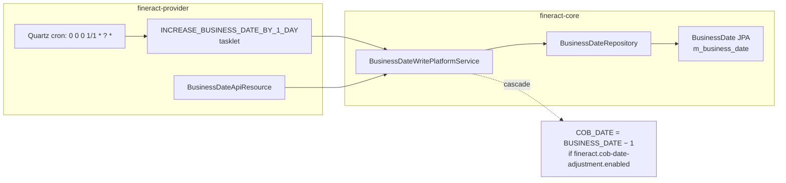

# Increase Business Date By 1 Day

`INCREASE_BUSINESS_DATE_BY_1_DAY` is the **Apache Fineract** cron job that drives the platform's logical clock forward. Many other jobs and downstream business processes read `ThreadLocalContextUtil.getBusinessDate()` to decide what work to do today; this job is what makes "today" advance. The implementation is a deliberately minimal Spring Batch tasklet that delegates to `BusinessDateWritePlatformService`.

Code locations:

- Job config and tasklet: `org.apache.fineract.infrastructure.jobs.service.increasedateby1day.increasebusinessdateby1day` in `fineract-provider`.
- Domain and service: `org.apache.fineract.infrastructure.businessdate` in `fineract-core`.

Companion docs: [`/core/business-date`](/core/business-date) covers the entity and API; [`/jobs/cob-date-job`](/jobs/cob-date-job) covers the sibling COB‑date job; [`/jobs/job-names-enumeration`](/jobs/job-names-enumeration) lists every cron in the platform.

## What "business date" means in Fineract

Fineract distinguishes two logical dates from the wall clock:

| `BusinessDateType` | Id | Description | Used by |
| --- | --- | --- | --- |
| `BUSINESS_DATE` | `1` | "Business Date" — the current open trading day | Most operational APIs, repayment schedules, fee calculations |
| `COB_DATE` | `2` | "Close of Business Date" — the most recently closed day | Loan COB, accrual postings, journal aggregation, reporting |

They are persisted in `m_business_date` (`BusinessDate` JPA entity). Operators set them via `BusinessDateApiResource` (`POST /v1/businessdate`); the two daily cron jobs (`INCREASE_BUSINESS_DATE_BY_1_DAY` and `INCREASE_COB_DATE_BY_1_DAY`) advance them automatically by one day on each tick.



## The job config

```java
@Configuration
public class IncreaseBusinessDateBy1DayConfig {

    @Bean
    public IncreaseBusinessDateBy1DayTasklet increaseBusinessDateBy1DayTasklet(
            BusinessDateWritePlatformService businessDateWritePlatformService,
            ConfigurationDomainService configurationDomainService) {
        return new IncreaseBusinessDateBy1DayTasklet(businessDateWritePlatformService, configurationDomainService);
    }

    @Bean
    public Job increaseBusinessDateBy1DayJob(PlatformTransactionManager transactionManager, JobRepository jobRepository,
            IncreaseBusinessDateBy1DayTasklet tasklet) {
        return new JobBuilder(JobName.INCREASE_BUSINESS_DATE_BY_1_DAY.name(), jobRepository).start(
                new StepBuilder(JobName.INCREASE_BUSINESS_DATE_BY_1_DAY.name(), jobRepository)
                        .tasklet(tasklet, transactionManager).build())
                .incrementer(new RunIdIncrementer()).build();
    }
}
```

Nothing surprising — single step, single tasklet, `RunIdIncrementer` so each cron tick is a new Spring Batch `JobInstance`.

## The tasklet

```java
@Slf4j
@RequiredArgsConstructor
public class IncreaseBusinessDateBy1DayTasklet implements Tasklet {

    private final BusinessDateWritePlatformService businessDateWritePlatformService;
    private final ConfigurationDomainService configurationDomainService;

    @Override
    public RepeatStatus execute(StepContribution contribution, ChunkContext chunkContext) throws Exception {
        if (configurationDomainService.isBusinessDateEnabled()) {
            businessDateWritePlatformService.increaseDateByTypeByOneDay(BusinessDateType.BUSINESS_DATE);
        } else {
            contribution.setExitStatus(ExitStatus.NOOP);
        }
        return RepeatStatus.FINISHED;
    }
}
```

Three observations:

- The gate is **`ConfigurationDomainService.isBusinessDateEnabled()`** — a runtime flag stored in `c_configuration` (a row keyed `business_date_enabled`). It is *not* a Spring property — it can be toggled on a live system by `POST /configurations/{id}`.
- When the flag is off, the step exits with `ExitStatus.NOOP` rather than `COMPLETED`. This is observable: a same‑day re‑run from the inline job API will also no‑op, and dashboards that alert on `NOOP > N consecutive runs` can detect a forgotten enable.
- The tasklet itself is non‑transactional in any meaningful sense — `BusinessDateWritePlatformService` opens its own JPA write inside its `@Service` impl. The Spring Batch transaction manager is here only to satisfy the framework.

## `BusinessDateWritePlatformService.increaseDateByTypeByOneDay`

The interface:

```java
public interface BusinessDateWritePlatformService {

    BusinessDateDTO updateBusinessDate(BusinessDateDTO businessDateDTO);

    void increaseDateByTypeByOneDay(BusinessDateType businessDateType) throws JobExecutionException;
}
```

The relevant method:

```java
@Override
public void increaseDateByTypeByOneDay(BusinessDateType businessDateType) throws JobExecutionException {
    Optional<BusinessDate> businessDateEntity = repository.findByType(businessDateType);
    List<Throwable> exceptions = new ArrayList<>();

    LocalDate businessDate = businessDateEntity.map(BusinessDate::getDate).orElse(DateUtils.getLocalDateOfTenant());
    businessDate = businessDate.plusDays(1);
    try {
        BusinessDateDTO response = BusinessDateDTO.builder()
                .type(businessDateType)
                .description(businessDateType.getDescription())
                .date(businessDate)
                .build();
        adjustDate(response);
    } catch (final PlatformApiDataValidationException e) {
        final List<ApiParameterError> errors = e.getErrors();
        for (final ApiParameterError error : errors) {
            log.error("Increasing {} by 1 day failed due to: {}",
                    businessDateType.getDescription(), error.getDeveloperMessage());
        }
        exceptions.add(e);
    } catch (final AbstractPlatformDomainRuleException e) {
        log.error("Increasing {} by 1 day failed due to: {}",
                businessDateType.getDescription(), e.getDefaultUserMessage());
        exceptions.add(e);
    } catch (Exception e) {
        log.error("Increasing {} by 1 day failed due to: {}",
                businessDateType.getDescription(), e.getMessage());
        exceptions.add(e);
    }
    if (!exceptions.isEmpty()) {
        throw new JobExecutionException(exceptions);
    }
}
```

Sequence:

1. Load the current `BusinessDate` for the requested type; if missing, fall back to "today by tenant timezone" via `DateUtils.getLocalDateOfTenant()`.
2. Add one day.
3. Call `adjustDate(dto)`, which is the shared validation + persistence path used by the API.
4. Wrap any exception in `JobExecutionException` so Spring Batch can mark the step `FAILED` (which in turn lets `StuckJobListener` retry on next JVM start, capped by `fineract.job.stuck-retry-threshold`).

### `adjustDate` and the COB cascade

```java
private void adjustDate(BusinessDateDTO businessDateDto) {
    boolean isCOBDateAdjustmentEnabled = configurationDomainService.isCOBDateAdjustmentEnabled();
    boolean isBusinessDateEnabled = configurationDomainService.isBusinessDateEnabled();

    if (!isBusinessDateEnabled) {
        log.error("Business date functionality is not enabled!");
        throw new BusinessDateActionException("business.date.is.not.enabled", "Business date functionality is not enabled");
    }
    updateOrCreateBusinessDate(businessDateDto);
    if (isCOBDateAdjustmentEnabled && BusinessDateType.BUSINESS_DATE.equals(businessDateDto.getType())) {
        BusinessDateDTO res = BusinessDateDTO.builder()
                .type(BusinessDateType.COB_DATE)
                .description(BusinessDateType.COB_DATE.getDescription())
                .date(businessDateDto.getDate().minusDays(1))
                .build();
        updateOrCreateBusinessDate(res);
        businessDateDto.addAllChanges(res.getChanges());
    }
}
```

Two important behaviours:

| Configuration | Behaviour |
| --- | --- |
| `business_date_enabled = true`, `cob_date_adjustment_enabled = true` | Business date increases by 1 day; COB date is recomputed as `business_date − 1` in the same call |
| `business_date_enabled = true`, `cob_date_adjustment_enabled = false` | Only business date moves; COB date stays put — `INCREASE_COB_DATE_BY_1_DAY` is responsible for moving it |
| `business_date_enabled = false` | `adjustDate` raises `BusinessDateActionException`; the tasklet's `isBusinessDateEnabled()` short‑circuit avoids reaching this path |

When `cob_date_adjustment_enabled` is on, `INCREASE_COB_DATE_BY_1_DAY` is redundant — the cascade does the work. Many production deployments either keep both jobs scheduled with the cascade on (no harm, the second job becomes a NOOP because the COB date is already past), or disable the COB job entirely. See [`/jobs/cob-date-job`](/jobs/cob-date-job) for the sibling.

### `updateOrCreateBusinessDate`

```java
private void updateOrCreateBusinessDate(BusinessDateDTO businessDateDto) {
    BusinessDateType businessDateType = businessDateDto.getType();
    Optional<BusinessDate> businessDate = repository.findByType(businessDateType);

    if (businessDate.isEmpty()) {
        BusinessDate newBusinessDate = BusinessDate.instance(businessDateType, businessDateDto.getDate());
        repository.save(newBusinessDate);
        businessDateDto.addChange(businessDateType, newBusinessDate.getDate());
    } else {
        updateBusinessDate(businessDate.get(), businessDateDto);
    }
}

private void updateBusinessDate(BusinessDate businessDate, BusinessDateDTO businessDateDto) {
    if (DateUtils.isEqual(businessDate.getDate(), businessDateDto.getDate())) {
        return;
    }
    businessDate.setDate(businessDateDto.getDate());
    repository.save(businessDate);
    businessDateDto.addChange(businessDate.getType(), businessDateDto.getDate());
}
```

If the row is missing it is created (first‑run scenario); otherwise it is updated *only* if the date changes. The early `return` when dates are equal is what makes a same‑day re‑run a true no‑op at the persistence layer.

## Configuration

Three configuration knobs apply:

| Knob | Where | Default | Effect |
| --- | --- | --- | --- |
| `fineract.business-date.enabled` (Spring property — proxied through `ConfigurationDomainService` in some legacy paths) | global | `false` | Master switch for the feature |
| `c_configuration.business_date_enabled` | per tenant DB row | `false` | Runtime toggle read by `ConfigurationDomainService.isBusinessDateEnabled()` |
| `c_configuration.cob_date_adjustment_enabled` | per tenant DB row | `false` | Whether business‑date advance cascades to COB date |

The tasklet reads the runtime row, not the Spring property — meaning a tenant can be enabled/disabled without a redeploy.

## Seed values

The Liquibase seed (`0015_add_business_date.xml`):

```xml
<column name="name" value="Increase Business Date by 1 day"/>
<column name="display_name" value="Increase Business Date by 1 day"/>
<column name="cron_expression" value="0 0 0 1/1 * ? *"/>
<column name="task_priority" valueNumeric="99"/>
<column name="job_key" value="Increase Business Date by 1 dayJobDetail1 _ DEFAULT"/>
```

Notable:

- Cron fires at **midnight** (start of day).
- `task_priority = 99` — high priority but lower than the system absolute max. Quartz respects this when multiple triggers fire in the same window.
- The `job_key` reflects the legacy "JobDetail&lt;tenantId&gt; _ DEFAULT" naming convention used by `JobRegisterServiceImpl.createJobDetail`.

## Ordering relative to other jobs

The other cron jobs that depend on the business date being advanced *first* are scheduled later in the day:

| Time | Job | Why later |
| --- | --- | --- |
| 00:00:00 | `INCREASE_BUSINESS_DATE_BY_1_DAY` | First — must move date before anything else |
| 00:00:00 | `INCREASE_COB_DATE_BY_1_DAY` | Same minute but task_priority 98; can also be cascaded by the business job |
| 00:00:00 | `LOAN_COB` | Reads `ThreadLocalContextUtil.getBusinessDateByType(COB_DATE)` |
| 00:01:00 | `UPDATE_LOAN_ARREARS_AGEING`, `ADD_ACCRUAL_ENTRIES`, … | Need the post‑advance date |
| 00:01:00 | `EXECUTE_DIRTY_JOBS` | Drains mismatched node ownership for *yesterday's* missed jobs |

Quartz does not guarantee strict ordering between triggers firing in the same second — operators relying on tight ordering should use `task_priority` or distinct cron seconds. In practice, the daily `+1` advance happens before midnight + a few hundred milliseconds, well before any 00:01 cron starts.

## Failure modes

| Failure | Cause | Recovery |
| --- | --- | --- |
| `BusinessDateActionException: business.date.is.not.enabled` | `c_configuration.business_date_enabled = false` between the tasklet's gate check and `adjustDate` (race) | Re‑enable the configuration and let `EXECUTE_DIRTY_JOBS` or manual `POST /jobs/{jobId}` re‑run |
| Tasklet exits `NOOP` for many runs | `business_date_enabled = false` | Verify the tenant configuration; the job is not broken |
| Tasklet `FAILED`, business date stuck | DB outage, unique key violation, or `PlatformApiDataValidationException` from a date validator | Spring Batch `BATCH_JOB_EXECUTION.status='STARTED'` → recovered by `StuckJobListener` on next JVM boot |
| Business date jumps by 2+ days | Cron was missed during a downtime, then `INCREASE_BUSINESS_DATE_BY_1_DAY` ran twice via `EXECUTE_DIRTY_JOBS` or manual re‑run | Expected — operator confirmation via run history |
| COB date drifts from business date | `cob_date_adjustment_enabled = false` and `INCREASE_COB_DATE_BY_1_DAY` is disabled or stuck | Re‑enable adjustment or fix the COB job |

## Why is this a tasklet, not the API?

The same `BusinessDateWritePlatformService.adjustDate` underpins both `POST /v1/businessdate` and the cron tasklet. The tasklet exists so that:

- Operators in tenants where business date is enabled don't have to remember to call the API every day at midnight.
- The advance is auditable via Spring Batch's `BATCH_JOB_EXECUTION` history.
- Multi‑tenant deployments can opt some tenants in (cron enabled) and others out (cron disabled but API still available for ad‑hoc moves).

Disabling the cron does not disable the API — it just means the date stops auto‑advancing. Conversely, enabling the API on a tenant whose cron is disabled is harmless.

## Programmatic invocation

The same flow is exercised in tests by directly calling:

```java
businessDateWritePlatformService.increaseDateByTypeByOneDay(BusinessDateType.BUSINESS_DATE);
```

Inline runs through `POST /v1/jobs/{jobId}/inline` go through `InlineExecutorService`, which uses the same Spring Batch `Job` bean and therefore the same gate logic.

## Idempotency

- Calling `increaseDateByTypeByOneDay` twice within the same day adds two days. There is **no** "advance to *next* day" semantics — the method is a literal `+1`.
- The `updateBusinessDate` early return on `DateUtils.isEqual(...)` only saves a DB round‑trip when the operator explicitly sets the same date via the API. The cron always advances.
- If you need "advance only if the current date is yesterday", do that check externally and call `updateBusinessDate(...)` with an explicit value — the API supports it.

## See also

- [`/core/business-date`](/core/business-date) — `BusinessDate` entity, `BusinessDateType` enum, `BusinessDateApiResource`.
- [`/jobs/cob-date-job`](/jobs/cob-date-job) — the sibling cron and how the cascade affects it.
- [`/jobs/job-names-enumeration`](/jobs/job-names-enumeration) — row for `INCREASE_BUSINESS_DATE_BY_1_DAY`.
- [`/jobs/job-registry-and-stuck-jobs`](/jobs/job-registry-and-stuck-jobs) — recovery for the tasklet path.
- [`/cob/overview`](/cob/overview) — what reads `BusinessDateType.COB_DATE` for daily close‑of‑business.
- [`/jobs/scheduler-job-api`](/jobs/scheduler-job-api) — manual trigger via `POST /jobs/{jobId}`.
