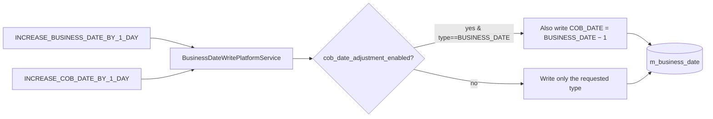
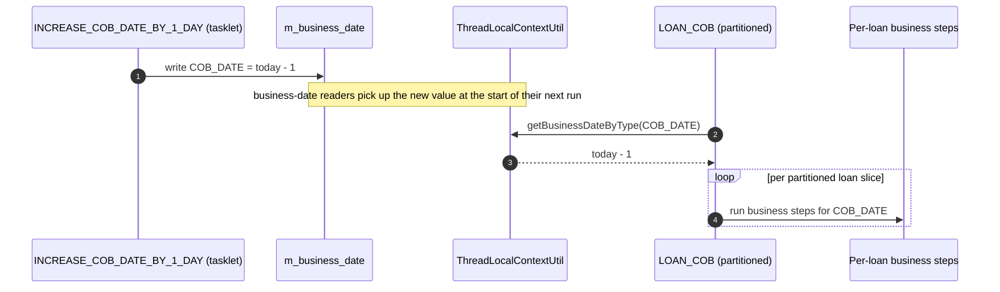

# Increase COB Date By 1 Day

`INCREASE_COB_DATE_BY_1_DAY` is the **Apache Fineract** cron tasklet that advances the second logical clock the platform maintains — the **Close of Business** date. It is structurally identical to `INCREASE_BUSINESS_DATE_BY_1_DAY` (see [`/jobs/business-date-job`](/jobs/business-date-job)) but operates on `BusinessDateType.COB_DATE` instead of `BUSINESS_DATE`. This page is the focused reference for the COB‑date tasklet and clarifies the often‑confused boundary between it and the `LOAN_COB` partitioned job.

Code locations:

- Job config + tasklet: `org.apache.fineract.infrastructure.jobs.service.increasedateby1day.increasecobdateby1day` in `fineract-provider`.
- Date service: `BusinessDateWritePlatformService` in `fineract-core` (`org.apache.fineract.infrastructure.businessdate.service`).

## Same shape, different date type

```java
@Configuration
@RequiredArgsConstructor
public class IncreaseCobDateBy1DayConfig {

    private final JobRepository jobRepository;
    private final PlatformTransactionManager transactionManager;
    private final BusinessDateWritePlatformService businessDateWritePlatformService;
    private final ConfigurationDomainService configurationDomainService;

    @Bean
    protected Step increaseCobDateBy1DayStep() {
        return new StepBuilder(JobName.INCREASE_COB_DATE_BY_1_DAY.name(), jobRepository)
                .tasklet(increaseCobDateBy1DayTasklet(), transactionManager).build();
    }

    @Bean
    public Job increaseCobDateBy1DayJob() {
        return new JobBuilder(JobName.INCREASE_COB_DATE_BY_1_DAY.name(), jobRepository)
                .start(increaseCobDateBy1DayStep())
                .incrementer(new RunIdIncrementer())
                .build();
    }

    @Bean
    public IncreaseCobDateBy1DayTasklet increaseCobDateBy1DayTasklet() {
        return new IncreaseCobDateBy1DayTasklet(businessDateWritePlatformService, configurationDomainService);
    }
}
```

```java
@Slf4j
@RequiredArgsConstructor
public class IncreaseCobDateBy1DayTasklet implements Tasklet {

    private final BusinessDateWritePlatformService businessDateWritePlatformService;
    private final ConfigurationDomainService configurationDomainService;

    @Override
    public RepeatStatus execute(StepContribution contribution, ChunkContext chunkContext) throws Exception {
        if (configurationDomainService.isBusinessDateEnabled()) {
            businessDateWritePlatformService.increaseDateByTypeByOneDay(BusinessDateType.COB_DATE);
        } else {
            contribution.setExitStatus(ExitStatus.NOOP);
        }
        return RepeatStatus.FINISHED;
    }
}
```

The only line that differs from the business‑date tasklet is `BusinessDateType.COB_DATE` instead of `BUSINESS_DATE`. Same gate, same `NOOP` on disabled config, same `BusinessDateWritePlatformService` underneath.

Importantly, the gate is **`isBusinessDateEnabled()`** — there is no separate "COB date enabled" flag. The business‑date feature owns both clocks; you cannot run the COB date without the business date.

## The two clocks, side by side

| Clock | Owner | Default value if missing | Cron that advances it |
| --- | --- | --- | --- |
| `BUSINESS_DATE` | `INCREASE_BUSINESS_DATE_BY_1_DAY` | `DateUtils.getLocalDateOfTenant()` | `0 0 0 1/1 * ? *` |
| `COB_DATE` | `INCREASE_COB_DATE_BY_1_DAY` | `DateUtils.getLocalDateOfTenant()` | `0 0 0 1/1 * ? *` |

By convention `COB_DATE = BUSINESS_DATE − 1` — yesterday is the most recently closed day. Two configuration paths enforce this:

1. **Adjustment cascade** (preferred). `c_configuration.cob_date_adjustment_enabled = true` causes `BusinessDateWritePlatformService.adjustDate` to set `COB_DATE = BUSINESS_DATE − 1` *whenever* the business date is updated:

   ```java
   if (isCOBDateAdjustmentEnabled && BusinessDateType.BUSINESS_DATE.equals(businessDateDto.getType())) {
       BusinessDateDTO res = BusinessDateDTO.builder()
               .type(BusinessDateType.COB_DATE)
               .description(BusinessDateType.COB_DATE.getDescription())
               .date(businessDateDto.getDate().minusDays(1))
               .build();
       updateOrCreateBusinessDate(res);
       businessDateDto.addAllChanges(res.getChanges());
   }
   ```

2. **Separate cron**. With `cob_date_adjustment_enabled = false`, you keep `INCREASE_COB_DATE_BY_1_DAY` enabled and let it advance the COB date independently. The two crons can drift if one fails and the other succeeds; an operator must manually realign via `POST /v1/businessdate`.



## Is this the same as `LOAN_COB`?

**No.** This is the most common source of confusion:

| Job | What it does | What it does not |
| --- | --- | --- |
| `INCREASE_COB_DATE_BY_1_DAY` | Writes a single row in `m_business_date` setting `COB_DATE` to today − 1 | Does **not** touch any loan, run any business step, or post any accounting entry |
| `LOAN_COB` | Reads `COB_DATE`, partitions all active loans, and runs the registered business‑step chain (`ApplyChargeToOverdueLoanInstallment`, `LoanArrearsAgeing`, `AccrualActivityPosting`, …) per loan | Does **not** advance any date — it consumes the date set by `INCREASE_COB_DATE_BY_1_DAY` (or by the cascade from the business‑date job) |

The relationship is:



Both jobs are seeded with cron `0 0 0 1/1 * ? *` (i.e. midnight every day). The expected execution order on a single‑node setup:

1. `INCREASE_BUSINESS_DATE_BY_1_DAY` runs (advances `BUSINESS_DATE`, possibly cascades `COB_DATE`).
2. `INCREASE_COB_DATE_BY_1_DAY` runs (no‑op or advance, depending on the cascade).
3. `LOAN_COB` runs (using the now‑current `COB_DATE`).

In practice, the three triggers all fire at 00:00:00 and Quartz dispatches them in arbitrary order subject to thread‑pool availability. The reason the system still works is that `BusinessDateWritePlatformService.updateBusinessDate(...)` is idempotent — if `LOAN_COB`'s partitioner runs first and `INCREASE_COB_DATE_BY_1_DAY` hasn't yet fired, it operates against yesterday's COB date (which is still valid for "close yesterday's books"); when the date job catches up moments later, the next day's `LOAN_COB` will see the new value.

Operators who want strict ordering should:

- Lower `INCREASE_COB_DATE_BY_1_DAY`'s seconds field (e.g. `0 0 0`) and raise `LOAN_COB`'s (e.g. `0 1 0` — 00:01:00), or
- Disable `INCREASE_COB_DATE_BY_1_DAY` and rely entirely on the cascade.

## Seed values

The Liquibase seed (`0015_add_business_date.xml`):

```xml
<column name="name" value="Increase COB Date by 1 day"/>
<column name="display_name" value="Increase COB Date by 1 day"/>
<column name="cron_expression" value="0 0 0 1/1 * ? *"/>
<column name="task_priority" valueNumeric="98"/>
<column name="job_key" value="Increase COB Date by 1 dayJobDetail1 _ DEFAULT"/>
```

The only differences from the business‑date row are the label and `task_priority` (98 vs. 99). The lower priority is a hint to Quartz that the business‑date advance should fire first when both triggers compete.

## `NOOP` semantics

`Tasklet.execute` sets `ExitStatus.NOOP` when business date is disabled. This makes the Spring Batch row look like:

```
BATCH_JOB_EXECUTION.exit_code = NOOP
BATCH_STEP_EXECUTION.exit_code = NOOP
```

That is distinct from `COMPLETED` and is observable. Operators alarming on "COB date hasn't advanced for N days" should monitor both:

- The `m_business_date` row directly (the date column), and
- The `BATCH_JOB_EXECUTION` exit code (a stream of `NOOP`s is the smoking gun for a forgotten configuration toggle).

## When the cascade is enabled

If `cob_date_adjustment_enabled = true` and the business‑date cron has already run for today, `INCREASE_COB_DATE_BY_1_DAY` will:

1. Load the current `COB_DATE` (now equal to `BUSINESS_DATE − 1`, which equals today − 1 if business date is today).
2. Add one day.
3. Call `adjustDate(dto)` with `type=COB_DATE, date=today`.

That sets `COB_DATE = today`, **violating** the convention that COB date trails the business date by one. The next time someone updates the business date, the cascade will reset COB date back to `BUSINESS_DATE − 1`, but until then any `LOAN_COB` run will close today's books prematurely.

For this reason the recommended setups are:

- **Cascade off, both crons on**: each clock has a dedicated cron. Safe.
- **Cascade on, COB cron off**: a single source of truth — the business‑date cron — drives both. Simplest.
- **Cascade on, COB cron on**: the COB cron will fight the cascade and may briefly over‑advance the COB date. Avoid.

The seed Liquibase data ships *with* the COB cron enabled and the cascade configuration row defaulting to `false`. Most production deployments end up either turning the cascade on and disabling the COB cron, or leaving everything at defaults.

## Sibling code

The two tasklets share more than 95% of their source. The duplication exists because Spring Batch jobs need to be uniquely identifiable by `JobName.name()`, so a single tasklet bean can't register two jobs. A future refactor could parameterise the tasklet by `BusinessDateType` and use two job definitions, but the current shape is explicit and easy to read.

## Recovery and idempotency

- **Stuck.** A `BATCH_JOB_EXECUTION` row left in `STARTED` (e.g. JVM killed mid‑run) is picked up by `StuckJobListener` on next boot and restarted via `JobOperator.restart(id)`. The tasklet is safe to restart — the DB write is idempotent if the date has already been advanced (the early return in `updateBusinessDate`).
- **Dirty.** A mismatched node row is drained by `EXECUTE_DIRTY_JOBS` (see [`/jobs/dirty-jobs`](/jobs/dirty-jobs)). The drain calls `executeJobWithParameters`, which is the same path as a manual API trigger.
- **Manual.** `POST /v1/jobs/{jobId}` triggers a one‑off run; `POST /v1/jobs/{jobId}/inline` runs it synchronously in the request thread. Use the latter when you need confirmation that the date moved before continuing.
- **API alternative.** `POST /v1/businessdate` can set either date to any value, bypassing the +1 advance. Useful for backfills and end‑of‑period adjustments.

## Why a separate cron at all?

In principle, with the cascade enabled, the system would work fine with only `INCREASE_BUSINESS_DATE_BY_1_DAY`. The separate `INCREASE_COB_DATE_BY_1_DAY` is retained for two reasons:

1. **Independence of dates.** Some deployments intentionally keep `BUSINESS_DATE` and `COB_DATE` at different "speeds" — for example, advancing business date manually during weekends but auto‑advancing COB date daily. The split cron makes this trivial.
2. **Backwards compatibility.** Earlier versions of Fineract used only the COB date and added the business date later. The separate cron predates the cascade.

## Failure modes

| Failure | Cause | Symptom | Recovery |
| --- | --- | --- | --- |
| `business_date_enabled = false` | Configuration not turned on | Repeated `NOOP` exit codes | Enable in `c_configuration`; manual `POST /jobs/{jobId}/inline` |
| Cascade on, both crons enabled | Misconfigured cluster | COB date occasionally over‑advances | Disable one of: the COB cron, or the cascade |
| Cron pinned to dead node | `node_id` mismatch | Drift, then drained by `EXECUTE_DIRTY_JOBS` | Confirm dirty drain ran; otherwise manual trigger |
| `JobExecutionException` wrapped from `BusinessDateActionException` | A subordinate write failed mid‑transaction | `BATCH_STEP_EXECUTION.status='FAILED'` | Recovered on next `StuckJobListener` boot |

## Programmatic invocation

```java
businessDateWritePlatformService.increaseDateByTypeByOneDay(BusinessDateType.COB_DATE);
```

This is the same method called by both the cron tasklet and the inline job API path. Tests that need to step the COB date forward without firing the entire Quartz scheduler call it directly.

## Inspecting current state

A quick operational query:

```sql
SELECT id, type, business_date_value
FROM m_business_date
ORDER BY type;
```

`type=1` is `BUSINESS_DATE`, `type=2` is `COB_DATE`. The invariant `BUSINESS_DATE = COB_DATE + 1` should hold under normal cascading; deviations indicate either a manual override via the API or a configuration mismatch.

## Choosing between cron and cascade — operational guidance

The choice between "two crons, no cascade" vs "one cron, cascade" should be made per‑deployment, not per‑tenant. Mixing the two within the same JVM leads to confusing race conditions when one tenant has cascade on and another has it off.

| Choice | When it's right |
| --- | --- |
| Cascade on, COB cron disabled | Single‑node deployment where business and COB dates always move together. Simplest mental model. |
| Cascade off, both crons enabled | Multi‑step rollout where you want to verify the business date moves first before COB shifts. Slightly more configuration but easier to reason about logs (separate Spring Batch executions). |
| Cascade on, both crons enabled | **Avoid.** The COB cron will frequently win the race with the cascade and over‑advance the COB date by one. |

A reasonable migration from default Liquibase seeding:

1. Confirm `c_configuration.business_date_enabled = true` for every tenant.
2. Confirm `c_configuration.cob_date_adjustment_enabled = true`.
3. `PUT /v1/jobs/<INCREASE_COB_DATE_BY_1_DAY id>` with `active=false`.
4. Verify on the next midnight that `m_business_date` shows `BUSINESS_DATE = today` and `COB_DATE = today - 1`.

If `step 4` shows `COB_DATE = today − 2`, the cascade did not run — re‑check `cob_date_adjustment_enabled`.

## Why the tasklet is gated on `isBusinessDateEnabled` (not a dedicated COB flag)

There is **only one master toggle** for the business‑date subsystem. Both clocks are owned by the same code path in `BusinessDateWritePlatformService`. A separate "enable COB date" flag would create the option of a partially‑configured tenant where the COB clock is running but the business clock isn't, which is incoherent (the cascade would silently fail and the COB cron would run on a `LocalDate.now()` fallback whose value depends on the JVM timezone — exactly the situation the business‑date feature was added to prevent).

If you really want the COB date to advance but the business date to stay put, you can:

- Enable business date (`business_date_enabled = true`),
- Disable the *cascade* (`cob_date_adjustment_enabled = false`),
- Disable the business‑date cron (`PUT /v1/jobs/<INCREASE_BUSINESS_DATE_BY_1_DAY>` with `active=false`),
- Leave the COB cron enabled.

The result: business date stays at whatever value an operator last set via the API; COB date advances daily. Useful for staged backfills.

## Inline execution

Both the business‑date and COB‑date tasklets are reachable via the inline job API. The most common operational use is "run the COB date forward now, then run LOAN_COB inline against the new date":

```
POST /v1/jobs/<INCREASE_COB_DATE_BY_1_DAY id>/inline
POST /v1/jobs/<LOAN_COB id>/inline
```

`POST /v1/jobs/.../inline` blocks until the job's `JobExecution` ends, returning the final `BatchStatus` and `ExitStatus`. See [`/jobs/inline-job-api`](/jobs/inline-job-api).

## Observability

Each tick produces a `BATCH_JOB_EXECUTION` row plus a `ScheduledJobRunHistory` row. Dashboards typically watch:

- `BATCH_JOB_EXECUTION.exit_code = 'NOOP'` — many in a row means the configuration is off.
- `BATCH_JOB_EXECUTION.status = 'FAILED'` — usually a downstream constraint (the `BusinessDateActionException`).
- `m_business_date.business_date_value` directly — the simplest "did the clock move?" signal.

A correlated alert: COB date older than business date by more than 1 day, persistently — indicates the cron has been silently stuck (cascade off, COB cron failing). Combine with `BATCH_JOB_EXECUTION.exit_code` to confirm.

## See also

- [`/jobs/business-date-job`](/jobs/business-date-job) — the sibling tasklet and the cascade behaviour.
- [`/core/business-date`](/core/business-date) — the entity, API resource, and `ConfigurationDomainService` knobs.
- [`/cob/overview`](/cob/overview) — what `LOAN_COB` actually does once `COB_DATE` is set.
- [`/jobs/overview`](/jobs/overview).
- [`/jobs/job-names-enumeration`](/jobs/job-names-enumeration) — row for `INCREASE_COB_DATE_BY_1_DAY`.
- [`/jobs/spring-batch-manager-worker`](/jobs/spring-batch-manager-worker) — how `LOAN_COB` consumes the COB date in a partitioned fashion.
- [`/jobs/job-registry-and-stuck-jobs`](/jobs/job-registry-and-stuck-jobs) — stuck‑job recovery for this tasklet.
- [`/jobs/dirty-jobs`](/jobs/dirty-jobs) — drain for mismatched node ownership.
