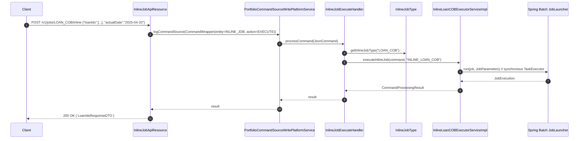
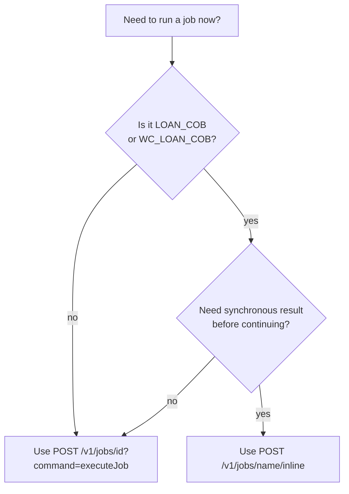

# Inline Job API (`/v1/jobs/{jobName}/inline`)

The inline job endpoint is the **only way** in **Apache Fineract** to drive a Spring Batch job synchronously inside the HTTP request thread. It bypasses Quartz, bypasses the asynchronous `JobLauncher`, and runs the named job to completion before the response is returned. Today it is limited to the Loan Close-of-Business family — `LOAN_COB` and `WC_LOAN_COB` — because those are the only jobs that have an `InlineExecutorService` bean registered.

Source: `org.apache.fineract.infrastructure.jobs.api.InlineJobApiResource` (`fineract-provider`).

If you are looking for the full COB design, see [`/cob/overview`](/cob/overview) and the specifically inline pages under that section. This page documents only the REST surface and how it routes to the inline executor.

## Resource

```java
@Path("/v1/jobs")
@Component
@Tag(name = "Inline Job", description = "")
@RequiredArgsConstructor
public class InlineJobApiResource {

    private final PortfolioCommandSourceWritePlatformService commandWritePlatformService;
    private final DefaultToApiJsonSerializer<LoanIdsResponseDTO> serializer;

    @POST
    @Path("{jobName}/inline")
    @Consumes({ MediaType.APPLICATION_JSON })
    @Produces({ MediaType.APPLICATION_JSON })
    @Operation(summary = "Starts an inline Job", description = "Starts an inline Job")
    public String executeInlineJob(@PathParam("jobName") final String jobName, final String jsonRequestBody) {
        final CommandWrapper commandRequest = new CommandWrapperBuilder()
                .executeInlineJob(jobName).withJson(jsonRequestBody).build();
        CommandProcessingResult result = commandWritePlatformService.logCommandSource(commandRequest);
        return serializer.serialize(result);
    }
}
```

Note the surface is intentionally minimal: a single `POST`. There is no list, get, or history endpoint. The implementation lives entirely behind the maker-checker command pipeline.

## Endpoint

| Method | Path | Description |
| --- | --- | --- |
| `POST` | `/v1/jobs/{jobName}/inline` | Run the inline executor mapped to `jobName` synchronously in the request thread. |

| Path param | Allowed values | Backing executor |
| --- | --- | --- |
| `{jobName}` | `LOAN_COB` | `InlineLoanCOBExecutorServiceImpl` |
| `{jobName}` | `WC_LOAN_COB` | `InlineWorkingCapitalLoanCOBExecutorServiceImpl` |

Any other value resolves to `IllegalArgumentException("Inline Job is not found by job name: …")` from `InlineJobType.getInlineJobType`.

## Wiring

The route routes through the standard command pipeline:



### Command handler

```java
@RequiredArgsConstructor
@Service
@CommandType(entity = "INLINE_JOB", action = "EXECUTE")
public class InlineJobExecuteHandler implements NewCommandSourceHandler {

    private final ApplicationContext applicationContext;

    @Override
    public CommandProcessingResult processCommand(JsonCommand command) {
        InlineJobType inlineJobType = InlineJobType.getInlineJobType(command.getJobName());
        try {
            InlineExecutorService inlineJobExecutorService =
                    applicationContext.getBean(inlineJobType.getExecutorServiceClass());
            return inlineJobExecutorService.executeInlineJob(command, inlineJobType.getInlineJobName());
        } catch (NoSuchBeanDefinitionException e) {
            throw new JobIsNotFoundOrNotEnabledException(e, inlineJobType.getInlineJobName());
        }
    }
}
```

Key detail: the executor is looked up **by class** (`applicationContext.getBean(class)`). If the corresponding configuration (e.g. `InlineLoanCOBConfig`) is gated on `@Conditional(LoanCOBEnabledCondition.class)` or `fineract.job.loan-cob-enabled=false`, the bean simply does not exist and you get a `JobIsNotFoundOrNotEnabledException`.

### `InlineJobType` mapping

```java
@RequiredArgsConstructor
public enum InlineJobType {

    LOAN_COB("LOAN_COB", "INLINE_LOAN_COB", InlineLoanCOBExecutorServiceImpl.class),
    WC_LOAN_COB("WC_LOAN_COB", "INLINE_WORKING_CAPITAL_LOAN_COB", InlineWorkingCapitalLoanCOBExecutorServiceImpl.class);

    private final String jobName;
    @Getter private final String inlineJobName;
    @Getter private final Class<? extends InlineExecutorService> executorServiceClass;

    public static InlineJobType getInlineJobType(String jobName) {
        Optional<InlineJobType> optionalInlineJobType = Arrays.stream(InlineJobType.values())
                .filter(t -> jobName.equals(t.jobName)).findAny();
        return optionalInlineJobType.orElseThrow(
                () -> new IllegalArgumentException("Inline Job is not found by job name: " + jobName));
    }
}
```

So the public REST `{jobName}` is `LOAN_COB` / `WC_LOAN_COB`, but internally the Spring Batch job that actually runs is named `INLINE_LOAN_COB` / `INLINE_WORKING_CAPITAL_LOAN_COB` (see `LoanCOBConstant.INLINE_LOAN_COB_JOB_NAME`). The inline jobs are sibling `@Bean Job` definitions distinct from the regular partitioned LOAN_COB.

### `InlineExecutorService` contract

```java
public interface InlineExecutorService<T> {
    CommandProcessingResult executeInlineJob(JsonCommand command, String jobName);
    void execute(List<T> elements, String jobName);
    default void execute(T element, String jobName) { execute(Collections.singletonList(element), jobName); }
}
```

The class signature is generic — the loan COB implementation specialises `T = Long` (loan ids). Other services in the codebase (such as those triggered by `Catch-Up` endpoints) also call `execute(...)` directly without going through HTTP.

## Request body

The accepted body for both `LOAN_COB` and `WC_LOAN_COB` is the same shape:

```json
{
  "loanIds": [101, 102, 103],
  "actualDate": "2025-04-20"
}
```

| Field | Type | Required | Meaning |
| --- | --- | --- | --- |
| `loanIds` | `List<Long>` | Yes | Loan ids the inline COB should process. |
| `actualDate` | `LocalDate` (`yyyy-MM-dd`) | Yes | Effective COB date (becomes the `BUSINESS_DATE` for the run). |

Defaults and validation are applied by `InlineLoanCOBExecutionDataParser` in the COB module.

### Body size limit

The accepted size of `loanIds` is bounded by:

```properties
fineract.api.body-item-size-limit.inline-loan-cob=${FINERACT_API_REQUEST_BODY_SIZE_LIMIT_INLINE_COB:1000}
```

Exceeding the limit returns `400 Bad Request` with a `Request body item size validation error`. The Swagger annotation declares the failure mode explicitly:

```java
@ApiResponse(responseCode = "400", description = "Request body item size validation error")
```

## Response

The handler returns a serialised `LoanIdsResponseDTO`, which echoes the processed loan ids back to the caller:

```json
{
  "loanIds": [101, 102, 103]
}
```

Because the call is synchronous, **the response is returned only after the Spring Batch job completes**. Failures bubble up as standard 4xx / 5xx with the usual platform error envelope.

## Differences from `POST /v1/jobs/{id}?command=executeJob`

| Aspect | `/v1/jobs/{id}?command=executeJob` | `/v1/jobs/{name}/inline` |
| --- | --- | --- |
| Trigger path | Quartz `triggerJob` → `JobStarter` → `JobLauncher` (async) | Direct call to `InlineExecutorService` → `JobLauncher.run` (still through a `TaskExecutor`, but the caller blocks on `JobExecution` before returning) |
| Response code | `202 Accepted` (queued) | `200 OK` with body, after completion |
| Run history | A `ScheduledJobRunHistory` row is added by `SchedulerJobListener` | The inline job does **not** flow through the Quartz listener and therefore **does not** produce a `ScheduledJobRunHistory` row. The Spring Batch `BATCH_JOB_EXECUTION` row is still created. |
| Trigger type column | `application` | n/a (no run history row) |
| Job name lookup | Numeric `jobId` or `short_name` | Public job name (`LOAN_COB`, `WC_LOAN_COB`) |
| Subject to `SchedulerDetail.isSuspended` | Yes — vetoed by `SchedulerVetoer` | No — the inline path does not touch the Quartz vetoer |
| Subject to node-id check | Yes | The inline executor enforces `BatchManagerCondition` indirectly, but it does not enforce `job.node_id` |
| Acceptable while batch-manager disabled | No (returns 405) | Possible, depending on COB-specific conditions |
| Custom parameters | Body parsed by `JobParameterDataParser`; only `LOAN_COB` provider acts on them | Body parsed by `InlineLoanCOBExecutionDataParser` and persisted as `CustomJobParameter`; the inline Spring Batch step picks them up by `CUSTOM_JOB_PARAMETER_ID_KEY` |

`SpringBatchJobConstants.CUSTOM_JOB_PARAMETER_ID_KEY = "CUSTOM_JOB_PARAMETER_ID"` is the conventional key used to look up the persisted custom parameter blob from a Spring Batch step.

## Permissions

Permission checks happen inside the COB executor (`InlineLoanCOBExecutorServiceImpl`) — typically a check for `CREATE_LOAN_COB` or similar. The wrapper endpoint itself does not perform an `validateHasReadPermission` of its own; it relies on the command pipeline. Maker-checker may also gate the entity `INLINE_JOB`, action `EXECUTE`.

## Example

```bash
curl -u admin:password -X POST \
  -H 'Content-Type: application/json' \
  -H 'Fineract-Platform-TenantId: default' \
  -d '{"loanIds":[101,102,103],"actualDate":"2025-04-20"}' \
  'http://localhost:8080/fineract-provider/api/v1/jobs/LOAN_COB/inline'
```

Successful response:

```json
{
  "loanIds": [101, 102, 103]
}
```

Failure when `LOAN_COB` is disabled (`fineract.job.loan-cob-enabled=false`):

```json
{
  "developerMessage": "Job is not found or it is disabled: INLINE_LOAN_COB",
  "httpStatusCode": "404",
  "errors": [ ... ]
}
```

## When to use which path



A typical reason to use the inline path is to advance a small set of loans through COB in the middle of the business day so that downstream API calls (e.g. a disbursement) see post-COB state.

## Related pages

- [`/jobs/scheduler-job-api`](/jobs/scheduler-job-api) — asynchronous, Quartz-driven manual fire.
- [`/cob/overview`](/cob/overview) — the COB business-step pipeline that the inline job ultimately drives.
- [`/jobs/spring-batch-manager-worker`](/jobs/spring-batch-manager-worker) — the partitioned LOAN_COB job (cron path, not inline path).
- [`/jobs/overview`](/jobs/overview) — comparison of all five trigger paths.
- [`/api/jobs-and-cob-apis`](/api/jobs-and-cob-apis) — REST catalogue.
