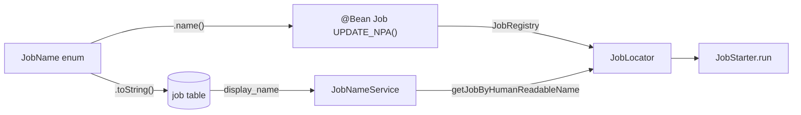

# `JobName` Enumeration Reference

This page is the authoritative cross‑reference for the `JobName` enum in **Apache Fineract** (`fineract-core`, `org.apache.fineract.infrastructure.jobs.service`). Every enum value maps to:

- a **human‑readable label** that becomes `job.display_name` in the tenant DB,
- an **initial cron expression** seeded by Liquibase (`0002_initial_data.xml` and a handful of newer change‑sets),
- a Spring Batch **`@Configuration` class** that registers the `Job` bean under the enum name,
- a **`Tasklet`** (for single‑step jobs) or a partitioner/worker pair (for chunked jobs), and
- the **module** the implementation lives in.

`JobName.toString()` returns the label, not the enum name. That label is what `SchedularWritePlatformService` and the `SchedulerJobApiResource` accept as input. The enum name (`UPDATE_NPA`, `LOAN_COB`, …) is what `jobLocator.getJob(...)` uses to resolve the Spring Batch `Job` bean — see [`/jobs/scheduler-and-quartz`](/jobs/scheduler-and-quartz) for that bridge.

## The enum, verbatim

```java
public enum JobName {

    UPDATE_LOAN_ARREARS_AGEING("Update Loan Arrears Ageing"),
    APPLY_ANNUAL_FEE_FOR_SAVINGS("Apply Annual Fee For Savings"),
    APPLY_HOLIDAYS_TO_LOANS("Apply Holidays To Loans"),
    POST_INTEREST_FOR_SAVINGS("Post Interest For Savings"),
    TRANSFER_FEE_CHARGE_FOR_LOANS("Transfer Fee For Loans From Savings"),
    ACCOUNTING_RUNNING_BALANCE_UPDATE("Update Accounting Running Balances"),
    PAY_DUE_SAVINGS_CHARGES("Pay Due Savings Charges"),
    APPLY_CHARGE_TO_OVERDUE_LOAN_INSTALLMENT("Apply penalty to overdue loans"),
    EXECUTE_STANDING_INSTRUCTIONS("Execute Standing Instruction"),
    ADD_ACCRUAL_ENTRIES("Add Accrual Transactions"),
    UPDATE_NPA("Update Non Performing Assets"),
    UPDATE_DEPOSITS_ACCOUNT_MATURITY_DETAILS("Update Deposit Accounts Maturity details"),
    TRANSFER_INTEREST_TO_SAVINGS("Transfer Interest To Savings"),
    ADD_PERIODIC_ACCRUAL_ENTRIES("Add Periodic Accrual Transactions"),
    RECALCULATE_INTEREST_FOR_LOAN("Recalculate Interest For Loans"),
    GENERATE_RD_SCEHDULE("Generate Mandatory Savings Schedule"),
    GENERATE_LOANLOSS_PROVISIONING("Generate Loan Loss Provisioning"),
    POST_DIVIDENTS_FOR_SHARES("Post Dividends For Shares"),
    UPDATE_SAVINGS_DORMANT_ACCOUNTS("Update Savings Dormant Accounts"),
    ADD_PERIODIC_ACCRUAL_ENTRIES_FOR_LOANS_WITH_INCOME_POSTED_AS_TRANSACTIONS(
            "Add Accrual Transactions For Loans With Income Posted As Transactions"),
    EXECUTE_REPORT_MAILING_JOBS("Execute Report Mailing Jobs"),
    UPDATE_SMS_OUTBOUND_WITH_CAMPAIGN_MESSAGE("Update SMS Outbound with Campaign Message"),
    SEND_MESSAGES_TO_SMS_GATEWAY("Send Messages to SMS Gateway"),
    GET_DELIVERY_REPORTS_FROM_SMS_GATEWAY("Get Delivery Reports from SMS Gateway"),
    GENERATE_ADHOC_CLIENT_SCHEDULE("Generate AdhocClient Schedule"),
    UPDATE_EMAIL_OUTBOUND_WITH_CAMPAIGN_MESSAGE("Update Email Outbound with campaign message"),
    EXECUTE_EMAIL("Execute Email"),
    UPDATE_TRIAL_BALANCE_DETAILS("Update Trial Balance Details"),
    EXECUTE_DIRTY_JOBS("Execute All Dirty Jobs"),
    INCREASE_BUSINESS_DATE_BY_1_DAY("Increase Business Date by 1 day"),
    INCREASE_COB_DATE_BY_1_DAY("Increase COB Date by 1 day"),
    LOAN_COB("Loan COB"),
    LOAN_DELINQUENCY_CLASSIFICATION("Loan Delinquency Classification"),
    SEND_ASYNCHRONOUS_EVENTS("Send Asynchronous Events"),
    PURGE_EXTERNAL_EVENTS("Purge External Events"),
    PURGE_PROCESSED_COMMANDS("Purge Processed Commands"),
    ACCRUAL_ACTIVITY_POSTING("Accrual Activity Posting"),
    ADD_PERIODIC_ACCRUAL_ENTRIES_FOR_SAVINGS_WITH_INCOME_POSTED_AS_TRANSACTIONS("Add Accrual Transactions For Savings"),
    JOURNAL_ENTRY_AGGREGATION("Journal Entry Aggregation"),
    WORKING_CAPITAL_LOAN_COB_JOB("Working Capital Loan COB"),
    ;

    private final String name;
    JobName(final String name) { this.name = name; }
    @Override public String toString() { return this.name; }
}
```

## The exhaustive table

Cron expressions below are the **initial seed values** inserted into the `job` table by Liquibase. Operators routinely change them via `PUT /jobs/{jobId}`; the table reflects the out‑of‑the‑box defaults. Empty cells indicate the row is not seeded by Liquibase (it must be inserted manually, or — for partitioned jobs — is registered as a Spring Batch bean only and started via the inline API).

| Enum (`name()`) | Display label (`toString()`) | Default cron | Config class | Tasklet / Worker step | Module |
| --- | --- | --- | --- | --- | --- |
| `UPDATE_LOAN_ARREARS_AGEING` | Update Loan Arrears Ageing | `0 1 0 1/1 * ? *` | `UpdateLoanArrearsAgeingConfig` | `UpdateLoanArrearsAgeingTasklet` | `fineract-loan` |
| `APPLY_ANNUAL_FEE_FOR_SAVINGS` | Apply Annual Fee For Savings | `0 20 22 1/1 * ? *` | `ApplyAnnualFeeForSavingsConfig` | `ApplyAnnualFeeForSavingsTasklet` | `fineract-provider` (savings) |
| `APPLY_HOLIDAYS_TO_LOANS` | Apply Holidays To Loans | `0 0 12 * * ?` | `ApplyHolidaysToLoansConfig` | `ApplyHolidaysToLoansTasklet` | `fineract-provider` (loanaccount) |
| `POST_INTEREST_FOR_SAVINGS` | Post Interest For Savings | `0 0 0 1/1 * ? *` | `PostInterestForSavingConfig` | `PostInterestForSavingTasklet` | `fineract-provider` (savings) |
| `TRANSFER_FEE_CHARGE_FOR_LOANS` | Transfer Fee For Loans From Savings | `0 1 0 1/1 * ? *` | `TransferFeeChargeForLoansConfig` | `TransferFeeChargeForLoansTasklet` | `fineract-provider` (loanaccount) |
| `ACCOUNTING_RUNNING_BALANCE_UPDATE` | Update Accounting Running Balances | `0 0 12 * * ?` | `AccountRunningBalanceUpdateConfig` | `AccountRunningBalanceUpdateTasklet` | `fineract-provider` (accounting) |
| `PAY_DUE_SAVINGS_CHARGES` | Pay Due Savings Charges | `0 1 0 1/1 * ? *` | `PayDueSavingsChargesConfig` | `PayDueSavingsChargesTasklet` | `fineract-provider` (savings) |
| `APPLY_CHARGE_TO_OVERDUE_LOAN_INSTALLMENT` | Apply penalty to overdue loans | `0 0 0 1/1 * ? *` | `ApplyChargeToOverdueLoanInstallmentConfig` | `ApplyChargeToOverdueLoanInstallmentTasklet` | `fineract-provider` (loanaccount) |
| `EXECUTE_STANDING_INSTRUCTIONS` | Execute Standing Instruction | `0 0 0 1/1 * ? *` | `ExecuteStandingInstructionsConfig` | `ExecuteStandingInstructionsTasklet` | `fineract-provider` (account) |
| `ADD_ACCRUAL_ENTRIES` | Add Accrual Transactions | `0 1 0 1/1 * ? *` | `AddAccrualEntriesConfig` | `AddAccrualEntriesTasklet` | `fineract-provider` (loanaccount) |
| `UPDATE_NPA` | Update Non Performing Assets | `0 0 0 1/1 * ? *` | `UpdateNpaConfig` | `UpdateNpaTasklet` | `fineract-provider` (jobs/updatenpa) |
| `UPDATE_DEPOSITS_ACCOUNT_MATURITY_DETAILS` | Update Deposit Accounts Maturity details | `0 0 0 1/1 * ? *` | `UpdateDepositsAccountMaturityDetailsConfig` | `UpdateDepositsAccountMaturityDetailsTasklet` | `fineract-provider` (savings) |
| `TRANSFER_INTEREST_TO_SAVINGS` | Transfer Interest To Savings | `0 2 0 1/1 * ? *` | `TransferInterestToSavingsConfig` | `TransferInterestToSavingsTasklet` | `fineract-provider` (savings) |
| `ADD_PERIODIC_ACCRUAL_ENTRIES` | Add Periodic Accrual Transactions | `0 2 0 1/1 * ? *` | `AddPeriodicAccrualEntriesConfig` | `AddPeriodicAccrualEntriesTasklet` | `fineract-loan` |
| `RECALCULATE_INTEREST_FOR_LOAN` | Recalculate Interest For Loans | `0 1 0 1/1 * ? *` | `RecalculateInterestForLoanConfig` | `RecalculateInterestForLoanTasklet` | `fineract-provider` (loanaccount) |
| `GENERATE_RD_SCEHDULE` | Generate Mandatory Savings Schedule | `0 5 0 1/1 * ? *` | `GenerateRdScheduleConfig` | `GenerateRdScheduleTasklet` | `fineract-provider` (savings) |
| `GENERATE_LOANLOSS_PROVISIONING` | Generate Loan Loss Provisioning | `0 0 0 1/1 * ? *` | `GenerateLoanlossProvisioningConfig` | `GenerateLoanlossProvisioningTasklet` | `fineract-provider` (loanaccount) |
| `POST_DIVIDENTS_FOR_SHARES` | Post Dividends For Shares | `0 0 0 1/1 * ? *` | `PostDividentsForSharesConfig` | `PostDividentsForSharesTasklet` | `fineract-provider` (shareaccounts) |
| `UPDATE_SAVINGS_DORMANT_ACCOUNTS` | Update Savings Dormant Accounts | `0 0 0 1/1 * ? *` | `UpdateSavingsDormantAccountsConfig` | `UpdateSavingsDormantAccountsTasklet` | `fineract-provider` (savings) |
| `ADD_PERIODIC_ACCRUAL_ENTRIES_FOR_LOANS_WITH_INCOME_POSTED_AS_TRANSACTIONS` | Add Accrual Transactions For Loans With Income Posted As Transactions | `0 1 0 1/1 * ? *` | `AddPeriodicAccrualEntriesForLoansConfig` | `AddPeriodicAccrualEntriesForLoansTasklet` | `fineract-provider` (loanaccount) |
| `EXECUTE_REPORT_MAILING_JOBS` | Execute Report Mailing Jobs | `0 0/15 * * * ?` | `ExecuteReportMailingJobsConfig` | `ExecuteReportMailingJobsTasklet` | `fineract-provider` (campaigns) |
| `UPDATE_SMS_OUTBOUND_WITH_CAMPAIGN_MESSAGE` | Update SMS Outbound with Campaign Message | `0 0 5 1/1 * ? *` | `UpdateSmsOutboundWithCampaignMessageConfig` | `UpdateSmsOutboundWithCampaignMessageTasklet` | `fineract-provider` (campaigns) |
| `SEND_MESSAGES_TO_SMS_GATEWAY` | Send Messages to SMS Gateway | `0 0 5 1/1 * ? *` | `SendMessageToSmsGatewayConfig` | `SendMessageToSmsGatewayTasklet` | `fineract-provider` (campaigns) |
| `GET_DELIVERY_REPORTS_FROM_SMS_GATEWAY` | Get Delivery Reports from SMS Gateway | `0 0 5 1/1 * ? *` | `GetDeliveryReportsFromSmsGatewayConfig` | `GetDeliveryReportsFromSmsGatewayTasklet` | `fineract-provider` (campaigns) |
| `GENERATE_ADHOC_CLIENT_SCHEDULE` | Generate AdhocClient Schedule | `0 0 12 1/1 * ? *` | `GenerateAdhocClientScheduleConfig` | `GenerateAdhocClientScheduleTasklet` | `fineract-provider` (savings) |
| `UPDATE_EMAIL_OUTBOUND_WITH_CAMPAIGN_MESSAGE` | Update Email Outbound with campaign message | `0 0/15 * * * ?` | `UpdateEmailOutboundWithCampaignMessageConfig` | `UpdateEmailOutboundWithCampaignMessageTasklet` | `fineract-provider` (campaigns) |
| `EXECUTE_EMAIL` | Execute Email | `0 0/10 * * * ?` | `ExecuteEmailConfig` | `ExecuteEmailTasklet` | `fineract-provider` (campaigns) |
| `UPDATE_TRIAL_BALANCE_DETAILS` | Update Trial Balance Details | `0 1 0 1/1 * ? *` | `UpdateTrialBalanceDetailsConfig` | `UpdateTrialBalanceDetailsTasklet` | `fineract-accounting` |
| `EXECUTE_DIRTY_JOBS` | Execute All Dirty Jobs | `0 1 0 1/1 * ? *` | `ExecuteAllDirtyJobsConfig` | `ExecuteAllDirtyJobsTasklet` | `fineract-provider` (jobs/executealldirtyjobs) |
| `INCREASE_BUSINESS_DATE_BY_1_DAY` | Increase Business Date by 1 day | `0 0 0 1/1 * ? *` | `IncreaseBusinessDateBy1DayConfig` | `IncreaseBusinessDateBy1DayTasklet` | `fineract-provider` (jobs/increasedateby1day) |
| `INCREASE_COB_DATE_BY_1_DAY` | Increase COB Date by 1 day | `0 0 0 1/1 * ? *` | `IncreaseCobDateBy1DayConfig` | `IncreaseCobDateBy1DayTasklet` | `fineract-provider` (jobs/increasedateby1day) |
| `LOAN_COB` | Loan COB | `0 0 0 * * ?` | `LoanCOBManagerConfiguration` + `LoanCOBWorkerConfiguration` | `LoanItemProcessor` (chunk) | `fineract-provider` (cob/loan) |
| `LOAN_DELINQUENCY_CLASSIFICATION` | Loan Delinquency Classification | seeded by 0064 changeset | `SetLoanDelinquencyTagsConfig` | `SetLoanDelinquencyTagsTasklet` | `fineract-loan` |
| `SEND_ASYNCHRONOUS_EVENTS` | Send Asynchronous Events | seeded by external‑events changeset | `SendAsynchronousEventsConfig` | `SendAsynchronousEventsTasklet` | `fineract-core` (event/external/jobs) |
| `PURGE_EXTERNAL_EVENTS` | Purge External Events | seeded by external‑events changeset | `PurgeExternalEventsConfig` | `PurgeExternalEventsTasklet` | `fineract-core` (event/external/jobs) |
| `PURGE_PROCESSED_COMMANDS` | Purge Processed Commands | seeded by commands changeset | `PurgeProcessedCommandsConfig` | `PurgeProcessedCommandsTasklet` | `fineract-core` (commands/jobs) |
| `ACCRUAL_ACTIVITY_POSTING` | Accrual Activity Posting | seeded by accrual changeset | `AccrualActivityPostingConfig` | `AccrualActivityPostingTasklet` | `fineract-provider` (loanaccount) |
| `ADD_PERIODIC_ACCRUAL_ENTRIES_FOR_SAVINGS_WITH_INCOME_POSTED_AS_TRANSACTIONS` | Add Accrual Transactions For Savings | seeded by accrual changeset | `AddAccrualTransactionForSavingsConfig` | `AddAccrualTransactionForSavingsTasklet` | `fineract-provider` (savings) |
| `JOURNAL_ENTRY_AGGREGATION` | Journal Entry Aggregation | seeded by 0200 changeset | `JournalEntryAggregationJobConfiguration` | `JournalEntryAggregationJobReader` + `JournalEntryAggregationJobWriter` + `JournalEntryAggregationTrackingTasklet` | `fineract-provider` (jobs/aggregationjob) |
| `WORKING_CAPITAL_LOAN_COB_JOB` | Working Capital Loan COB | not Liquibase‑seeded | `WorkingCapitalLoanCOBManagerConfiguration` + `WorkingCapitalLoanCOBWorkerConfiguration` | partitioned worker step | `fineract-working-capital-loan` |

> **Typo preserved on purpose.** `GENERATE_RD_SCEHDULE` (note the transposed `E`) and `POST_DIVIDENTS_FOR_SHARES` (note `DIVIDENT` instead of `DIVIDEND`) are the canonical names in source and DB. Renaming them would break every existing `ScheduledJobDetail.job_key` and is therefore avoided.

## Cron quick reference

The seeded cron expressions cluster into a handful of patterns. Quartz syntax: `sec min hour dayOfMonth month dayOfWeek [year]`.

| Cron | Meaning | Used by |
| --- | --- | --- |
| `0 0 0 1/1 * ? *` | Every day at 00:00:00 | `APPLY_CHARGE_TO_OVERDUE_LOAN_INSTALLMENT`, `EXECUTE_STANDING_INSTRUCTIONS`, `UPDATE_NPA`, `UPDATE_DEPOSITS_ACCOUNT_MATURITY_DETAILS`, `GENERATE_LOANLOSS_PROVISIONING`, `POST_DIVIDENTS_FOR_SHARES`, `POST_INTEREST_FOR_SAVINGS`, `UPDATE_SAVINGS_DORMANT_ACCOUNTS`, `INCREASE_BUSINESS_DATE_BY_1_DAY`, `INCREASE_COB_DATE_BY_1_DAY` |
| `0 1 0 1/1 * ? *` | Every day at 00:01:00 | `UPDATE_LOAN_ARREARS_AGEING`, `TRANSFER_FEE_CHARGE_FOR_LOANS`, `ACCOUNTING_RUNNING_BALANCE_UPDATE` (alt schedule), `ADD_ACCRUAL_ENTRIES`, `RECALCULATE_INTEREST_FOR_LOAN`, `ADD_PERIODIC_ACCRUAL_ENTRIES_FOR_LOANS_WITH_INCOME_POSTED_AS_TRANSACTIONS`, `UPDATE_TRIAL_BALANCE_DETAILS`, `EXECUTE_DIRTY_JOBS` |
| `0 2 0 1/1 * ? *` | Every day at 00:02:00 | `TRANSFER_INTEREST_TO_SAVINGS`, `ADD_PERIODIC_ACCRUAL_ENTRIES` |
| `0 5 0 1/1 * ? *` | Every day at 00:05:00 | `GENERATE_RD_SCEHDULE` |
| `0 20 22 1/1 * ? *` | Every day at 22:20:00 | `APPLY_HOLIDAYS_TO_LOANS` |
| `0 0 12 * * ?` | Every day at noon | `POST_INTEREST_FOR_SAVINGS` (alt), `ACCOUNTING_RUNNING_BALANCE_UPDATE` |
| `0 0 12 1/1 * ? *` | Every day at noon | `GENERATE_ADHOC_CLIENT_SCHEDULE` |
| `0 0 5 1/1 * ? *` | Every day at 05:00:00 | `UPDATE_SMS_OUTBOUND_WITH_CAMPAIGN_MESSAGE`, `SEND_MESSAGES_TO_SMS_GATEWAY`, `GET_DELIVERY_REPORTS_FROM_SMS_GATEWAY` |
| `0 0/10 * * * ?` | Every 10 minutes | `EXECUTE_EMAIL` |
| `0 0/15 * * * ?` | Every 15 minutes | `EXECUTE_REPORT_MAILING_JOBS`, `UPDATE_EMAIL_OUTBOUND_WITH_CAMPAIGN_MESSAGE` |
| `0 0 0 * * ?` | Every day at 00:00:00 (non‑increment form) | `LOAN_COB` |

The two `00:00:00` variants (`0 0 0 1/1 * ? *` vs `0 0 0 * * ?`) are semantically equivalent — Quartz tolerates both.

## How the catalogue is registered

Three layers cooperate to make these enum values runnable:

1. **Spring Batch beans** — every `*Config` class declares `@Bean public Job <name>()` whose name is the enum, e.g. `JobName.UPDATE_NPA.name()`. `JobRegistry` indexes every such bean.
2. **Liquibase seed** — `0002_initial_data.xml` (and a handful of newer change‑sets per feature) inserts one row in `job` per enum value, with the seeded cron and `display_name = JobName.toString()`.
3. **`JobNameService`** — a small bridge that converts back and forth between human‑readable names and enum‑style names. `JobRegisterServiceImpl.createJobDetail(...)` calls `jobNameService.getJobByHumanReadableName(detail.getJobName())` and then `jobLocator.getJob(jobName.getEnumStyleName())`.



## Module map

Where in the source tree to find each implementation:

| Module | Sub‑package | Jobs |
| --- | --- | --- |
| `fineract-core` | `infrastructure.jobs.service` | `JobName` enum |
| `fineract-core` | `infrastructure.event.external.jobs` | `SEND_ASYNCHRONOUS_EVENTS`, `PURGE_EXTERNAL_EVENTS` |
| `fineract-core` | `commands.jobs` | `PURGE_PROCESSED_COMMANDS` |
| `fineract-loan` | `portfolio.loanaccount.jobs.updateloanarrearsageing` | `UPDATE_LOAN_ARREARS_AGEING` |
| `fineract-loan` | `portfolio.loanaccount.jobs.addperiodicaccrualentries` | `ADD_PERIODIC_ACCRUAL_ENTRIES` |
| `fineract-loan` | `portfolio.loanaccount.jobs.setloandelinquencytags` | `LOAN_DELINQUENCY_CLASSIFICATION` |
| `fineract-accounting` | `accounting.glaccount.jobs.updatetrialbalancedetails` | `UPDATE_TRIAL_BALANCE_DETAILS` |
| `fineract-provider` | `infrastructure.jobs.service.updatenpa` | `UPDATE_NPA` |
| `fineract-provider` | `infrastructure.jobs.service.increasedateby1day.*` | `INCREASE_BUSINESS_DATE_BY_1_DAY`, `INCREASE_COB_DATE_BY_1_DAY` |
| `fineract-provider` | `infrastructure.jobs.service.aggregationjob` | `JOURNAL_ENTRY_AGGREGATION` |
| `fineract-provider` | `infrastructure.jobs.service.executealldirtyjobs` | `EXECUTE_DIRTY_JOBS` |
| `fineract-provider` | `cob.loan` | `LOAN_COB` |
| `fineract-working-capital-loan` | `cob.workingcapitalloan` | `WORKING_CAPITAL_LOAN_COB_JOB` |
| `fineract-provider` | `portfolio.savings.jobs.*` | All savings jobs |
| `fineract-provider` | `portfolio.loanaccount.jobs.*` | Loan jobs other than those in `fineract-loan` |
| `fineract-provider` | `portfolio.shareaccounts.jobs.*` | `POST_DIVIDENTS_FOR_SHARES` |
| `fineract-provider` | `portfolio.account.jobs.executestandinginstructions` | `EXECUTE_STANDING_INSTRUCTIONS` |
| `fineract-provider` | `infrastructure.campaigns.jobs.*` | SMS / Email / report mailing jobs |
| `fineract-provider` | `accounting.jobs.accountrunningbalanceupdate` | `ACCOUNTING_RUNNING_BALANCE_UPDATE` |

## Conditional jobs

A subset of jobs is only registered when a feature flag is on:

| Job | Property | Default |
| --- | --- | --- |
| `JOURNAL_ENTRY_AGGREGATION` | `fineract.job.journal-entry-aggregation.enabled` | `true` |
| `LOAN_COB` (manager side) | `fineract.mode.batch-manager-enabled` and `fineract.job.loan-cob-enabled` | `true` / `true` |
| `LOAN_COB` (worker side) | `fineract.mode.batch-worker-enabled` | `false` |
| `INCREASE_BUSINESS_DATE_BY_1_DAY` / `INCREASE_COB_DATE_BY_1_DAY` tasklet effect | `fineract.business-date.enabled` (runtime via `ConfigurationDomainService`) | configurable |
| `SEND_ASYNCHRONOUS_EVENTS`, `PURGE_EXTERNAL_EVENTS` | `fineract.events.external.enabled` | `false` |

A disabled `JOURNAL_ENTRY_AGGREGATION` bean is not registered, which is why `jobLocator.getJob("JOURNAL_ENTRY_AGGREGATION")` throws `NoSuchJobException` and `JobRegisterServiceImpl` falls back to `JobIsNotFoundOrNotEnabledException`. See [`/jobs/job-registry-and-stuck-jobs`](/jobs/job-registry-and-stuck-jobs).

## Naming caveats

Three conventions trip up newcomers:

1. **Display label vs enum name.** The DB stores the display label (`Update Non Performing Assets`); the Spring Batch `Job` bean is named after the enum (`UPDATE_NPA`). `JobNameService` is the only place that translates.
2. **Misspellings are load‑bearing.** `GENERATE_RD_SCEHDULE` and `POST_DIVIDENTS_FOR_SHARES` cannot be renamed without breaking every existing `ScheduledJobDetail.job_key`. Treat them as opaque identifiers.
3. **`WORKING_CAPITAL_LOAN_COB_JOB`** has the `_JOB` suffix in its enum name but `Working Capital Loan COB` as its label. The duplicated suffix is intentional — it disambiguates from `LOAN_COB` in log lines.

## Job grouping

`ScheduledJobDetail.scheduler_group` is a small integer (default `0`). When non‑zero, `JobRegisterServiceImpl` allocates the job to a **secondary scheduler** with its own thread pool (`GROUP_THREAD_COUNT` instead of `DEFAULT_THREAD_COUNT`). This is how operators isolate high‑volume jobs (e.g. SMS gateway pollers) from the per‑tenant default scheduler. The grouping is purely operational — it has no effect on the JobName enum itself.

## Adding a new job

The minimum set of edits to introduce a new `JobName`:

1. Add the enum constant in `fineract-core/.../infrastructure/jobs/service/JobName.java` with a human label.
2. Create a `@Configuration` class that declares `@Bean public Job <enumName>()` using `new JobBuilder(JobName.MY_NEW_JOB.name(), jobRepository)`.
3. Implement the `Tasklet` (or `ItemReader`/`ItemWriter` for a chunked step).
4. Add a Liquibase change‑set inserting a row in `job` with `name=display`, `display_name=display`, `cron_expression=...`, `task_priority`, and `job_key`.
5. (Optional) Add a properties block under `fineract.job.<my-new-job>.*` and a `@ConditionalOnProperty` on the config class.
6. (Optional) Register a `JobParameterProvider` if the job needs context‑sensitive arguments beyond `run.id`.

The boot loop in `JobSchedulerServiceImpl` will then pick it up on the next restart and Quartz will schedule it.

## Display label cheat sheet

A common operational task is "what's the Java enum for this UI label?". The reverse lookup:

| Display label (in UI / DB) | Enum |
| --- | --- |
| Update Loan Arrears Ageing | `UPDATE_LOAN_ARREARS_AGEING` |
| Apply Annual Fee For Savings | `APPLY_ANNUAL_FEE_FOR_SAVINGS` |
| Apply Holidays To Loans | `APPLY_HOLIDAYS_TO_LOANS` |
| Post Interest For Savings | `POST_INTEREST_FOR_SAVINGS` |
| Transfer Fee For Loans From Savings | `TRANSFER_FEE_CHARGE_FOR_LOANS` |
| Update Accounting Running Balances | `ACCOUNTING_RUNNING_BALANCE_UPDATE` |
| Pay Due Savings Charges | `PAY_DUE_SAVINGS_CHARGES` |
| Apply penalty to overdue loans | `APPLY_CHARGE_TO_OVERDUE_LOAN_INSTALLMENT` |
| Execute Standing Instruction | `EXECUTE_STANDING_INSTRUCTIONS` |
| Add Accrual Transactions | `ADD_ACCRUAL_ENTRIES` |
| Update Non Performing Assets | `UPDATE_NPA` |
| Update Deposit Accounts Maturity details | `UPDATE_DEPOSITS_ACCOUNT_MATURITY_DETAILS` |
| Transfer Interest To Savings | `TRANSFER_INTEREST_TO_SAVINGS` |
| Add Periodic Accrual Transactions | `ADD_PERIODIC_ACCRUAL_ENTRIES` |
| Recalculate Interest For Loans | `RECALCULATE_INTEREST_FOR_LOAN` |
| Generate Mandatory Savings Schedule | `GENERATE_RD_SCEHDULE` |
| Generate Loan Loss Provisioning | `GENERATE_LOANLOSS_PROVISIONING` |
| Post Dividends For Shares | `POST_DIVIDENTS_FOR_SHARES` |
| Update Savings Dormant Accounts | `UPDATE_SAVINGS_DORMANT_ACCOUNTS` |
| Add Accrual Transactions For Loans With Income Posted As Transactions | `ADD_PERIODIC_ACCRUAL_ENTRIES_FOR_LOANS_WITH_INCOME_POSTED_AS_TRANSACTIONS` |
| Execute Report Mailing Jobs | `EXECUTE_REPORT_MAILING_JOBS` |
| Update SMS Outbound with Campaign Message | `UPDATE_SMS_OUTBOUND_WITH_CAMPAIGN_MESSAGE` |
| Send Messages to SMS Gateway | `SEND_MESSAGES_TO_SMS_GATEWAY` |
| Get Delivery Reports from SMS Gateway | `GET_DELIVERY_REPORTS_FROM_SMS_GATEWAY` |
| Generate AdhocClient Schedule | `GENERATE_ADHOC_CLIENT_SCHEDULE` |
| Update Email Outbound with campaign message | `UPDATE_EMAIL_OUTBOUND_WITH_CAMPAIGN_MESSAGE` |
| Execute Email | `EXECUTE_EMAIL` |
| Update Trial Balance Details | `UPDATE_TRIAL_BALANCE_DETAILS` |
| Execute All Dirty Jobs | `EXECUTE_DIRTY_JOBS` |
| Increase Business Date by 1 day | `INCREASE_BUSINESS_DATE_BY_1_DAY` |
| Increase COB Date by 1 day | `INCREASE_COB_DATE_BY_1_DAY` |
| Loan COB | `LOAN_COB` |
| Loan Delinquency Classification | `LOAN_DELINQUENCY_CLASSIFICATION` |
| Send Asynchronous Events | `SEND_ASYNCHRONOUS_EVENTS` |
| Purge External Events | `PURGE_EXTERNAL_EVENTS` |
| Purge Processed Commands | `PURGE_PROCESSED_COMMANDS` |
| Accrual Activity Posting | `ACCRUAL_ACTIVITY_POSTING` |
| Add Accrual Transactions For Savings | `ADD_PERIODIC_ACCRUAL_ENTRIES_FOR_SAVINGS_WITH_INCOME_POSTED_AS_TRANSACTIONS` |
| Journal Entry Aggregation | `JOURNAL_ENTRY_AGGREGATION` |
| Working Capital Loan COB | `WORKING_CAPITAL_LOAN_COB_JOB` |

## Grouping by purpose

A coarse partition that helps with capacity planning:

| Group | Jobs | Typical run window |
| --- | --- | --- |
| Date advance | `INCREASE_BUSINESS_DATE_BY_1_DAY`, `INCREASE_COB_DATE_BY_1_DAY` | < 100 ms |
| Loan COB chain | `LOAN_COB`, `WORKING_CAPITAL_LOAN_COB_JOB` | minutes — scales with active loans |
| Arrears / NPA reconciliation | `UPDATE_LOAN_ARREARS_AGEING`, `UPDATE_NPA`, `LOAN_DELINQUENCY_CLASSIFICATION` | seconds |
| Accrual postings | `ADD_ACCRUAL_ENTRIES`, `ADD_PERIODIC_ACCRUAL_ENTRIES`, `ADD_PERIODIC_ACCRUAL_ENTRIES_FOR_LOANS_WITH_INCOME_POSTED_AS_TRANSACTIONS`, `ADD_PERIODIC_ACCRUAL_ENTRIES_FOR_SAVINGS_WITH_INCOME_POSTED_AS_TRANSACTIONS`, `ACCRUAL_ACTIVITY_POSTING` | seconds — minutes |
| Savings periodic | `POST_INTEREST_FOR_SAVINGS`, `APPLY_ANNUAL_FEE_FOR_SAVINGS`, `PAY_DUE_SAVINGS_CHARGES`, `TRANSFER_INTEREST_TO_SAVINGS`, `UPDATE_SAVINGS_DORMANT_ACCOUNTS`, `GENERATE_RD_SCEHDULE`, `GENERATE_ADHOC_CLIENT_SCHEDULE` | seconds — minutes |
| Loan periodic | `RECALCULATE_INTEREST_FOR_LOAN`, `APPLY_HOLIDAYS_TO_LOANS`, `APPLY_CHARGE_TO_OVERDUE_LOAN_INSTALLMENT`, `TRANSFER_FEE_CHARGE_FOR_LOANS`, `GENERATE_LOANLOSS_PROVISIONING` | seconds |
| Shares | `POST_DIVIDENTS_FOR_SHARES` | seconds |
| Deposits | `UPDATE_DEPOSITS_ACCOUNT_MATURITY_DETAILS` | seconds |
| Standing instructions | `EXECUTE_STANDING_INSTRUCTIONS` | minutes — scales with SI count |
| Accounting rollups | `ACCOUNTING_RUNNING_BALANCE_UPDATE`, `UPDATE_TRIAL_BALANCE_DETAILS`, `JOURNAL_ENTRY_AGGREGATION` | seconds — minutes |
| Communications | `EXECUTE_REPORT_MAILING_JOBS`, `EXECUTE_EMAIL`, `UPDATE_EMAIL_OUTBOUND_WITH_CAMPAIGN_MESSAGE`, `UPDATE_SMS_OUTBOUND_WITH_CAMPAIGN_MESSAGE`, `SEND_MESSAGES_TO_SMS_GATEWAY`, `GET_DELIVERY_REPORTS_FROM_SMS_GATEWAY` | sub‑second per tick, frequent |
| External events | `SEND_ASYNCHRONOUS_EVENTS`, `PURGE_EXTERNAL_EVENTS` | varies with traffic |
| Commands purging | `PURGE_PROCESSED_COMMANDS` | seconds |
| Meta / reconciliation | `EXECUTE_DIRTY_JOBS` | sub‑second |

Communications jobs typically run every 10–15 minutes; everything else is once daily by default. Operators with heavy event throughput should consider moving `SEND_ASYNCHRONOUS_EVENTS` onto its own scheduler group (high `scheduler_group` value) so a slow run doesn't steal threads from the daily back‑office work.

## Idempotency by job

| Job | Safe to re‑run within the same window? | Why |
| --- | --- | --- |
| `UPDATE_NPA` | Yes | Two SQL passes are deterministic given inputs |
| `UPDATE_LOAN_ARREARS_AGEING` | Yes | Full recompute from primary state |
| `INCREASE_BUSINESS_DATE_BY_1_DAY` | **No** | Each run adds one day; double‑run adds two days |
| `INCREASE_COB_DATE_BY_1_DAY` | **No** | Same |
| `LOAN_COB` | Yes | Business steps refuse to re‑close a date |
| `JOURNAL_ENTRY_AGGREGATION` | Yes | Decider short‑circuits already‑aggregated days |
| `POST_INTEREST_FOR_SAVINGS` | Effectively yes | Per‑schedule guard prevents double posting on the same period |
| `ADD_ACCRUAL_ENTRIES` | Yes | Idempotent per loan / period |
| `EXECUTE_DIRTY_JOBS` | Yes | Drains whatever is currently flagged |
| `SEND_ASYNCHRONOUS_EVENTS` | Yes | Reads queue from DB; nothing to undo |
| `PURGE_*` | Yes | Drops rows older than retention; safe to re‑run |

Knowing which jobs are *not* idempotent (the two date‑advance crons) is important — never wire them into an automated retry loop without a separate "advance only if needed" guard.

## See also

- [`/jobs/job-registry-and-stuck-jobs`](/jobs/job-registry-and-stuck-jobs) — how each enum value is registered with Quartz and recovered after a crash.
- [`/jobs/spring-batch-manager-worker`](/jobs/spring-batch-manager-worker) — the `LOAN_COB` and `WORKING_CAPITAL_LOAN_COB_JOB` partitioned model.
- [`/jobs/aggregation-job`](/jobs/aggregation-job) — `JOURNAL_ENTRY_AGGREGATION` deep dive.
- [`/jobs/npa-job`](/jobs/npa-job) — `UPDATE_NPA` deep dive.
- [`/jobs/business-date-job`](/jobs/business-date-job) — `INCREASE_BUSINESS_DATE_BY_1_DAY`.
- [`/jobs/cob-date-job`](/jobs/cob-date-job) — `INCREASE_COB_DATE_BY_1_DAY`.
- [`/jobs/dirty-jobs`](/jobs/dirty-jobs) — `EXECUTE_DIRTY_JOBS` and related drain crons.
- [`/core/jobs-domain`](/core/jobs-domain) — the `ScheduledJobDetail`, `SchedulerDetail`, run history entities.
- [`/core/spring-batch-infra`](/core/spring-batch-infra) — `PropertyService` and `fineract.partitioned-job.*` knobs.
