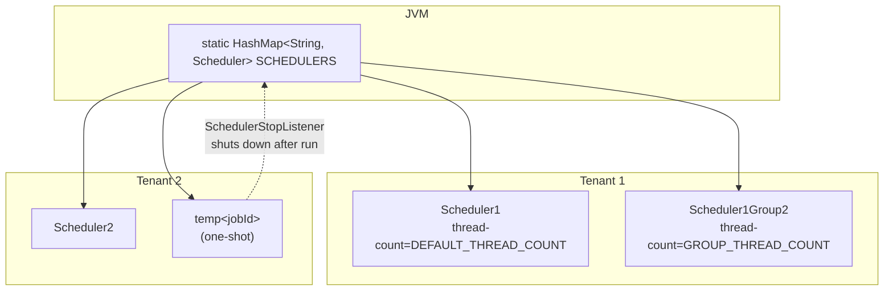
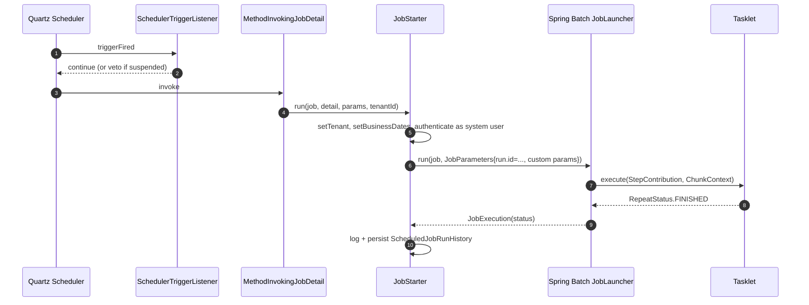

# Job Registry & Stuck Job Recovery

Two services govern the lifecycle of every scheduled job in **Apache Fineract**:

- `JobRegisterServiceImpl` — bootstrap of Quartz schedulers per tenant, plus the runtime APIs that schedule, reschedule, pause, and trigger jobs.
- `StuckJobExecutorServiceImpl` together with the `StuckJobListener` — a startup‑time recovery loop that finds Spring Batch executions left in `STARTED` after a crash and re‑queues them through Spring Batch's `JobOperator`.

This page walks through the boot sequence, the per‑tenant scheduler topology held in the `JobRegisterServiceImpl.SCHEDULERS` map, the temporary scheduler trick used for one‑shot triggers, and the recovery path that distinguishes tasklet jobs from the partitioned `LOAN_COB` family. All code lives in `org.apache.fineract.infrastructure.jobs.service` in `fineract-provider`. The companion pages [`/jobs/overview`](/jobs/overview), [`/jobs/scheduler-and-quartz`](/jobs/scheduler-and-quartz), and [`/jobs/spring-batch-manager-worker`](/jobs/spring-batch-manager-worker) cover the surrounding layers.

## Class map

| Class | Role |
| --- | --- |
| `JobRegisterServiceImpl` | Owns the static `HashMap<String, Scheduler> SCHEDULERS`; creates per‑tenant `SchedulerFactoryBean`s; cron‑schedules `ScheduledJobDetail` rows; pauses/resumes the scheduler |
| `SchedulerStopListener` | Quartz `JobListener` that shuts down a *temporary* one‑shot scheduler after its job finishes |
| `SchedulerJobListener` | Global listener applied to every scheduler — records run history, error logs |
| `SchedulerTriggerListener` | Global trigger listener — handles misfire and vetoing handoff |
| `JobSchedulerServiceImpl` | Listens for `ContextRefreshedEvent` and loops over the tenant's `ScheduledJobDetail` rows to call `JobRegisterServiceImpl.scheduleJob(...)` |
| `StuckJobListener` | `@ConditionalOnProperty("fineract.mode.batch-manager-enabled")` listener that runs on `ContextRefreshedEvent` and triggers recovery per tenant |
| `StuckJobExecutorServiceImpl` | Distinguishes tasklet vs partitioned stuck jobs and restarts them via `JobOperator` |
| `JobExecutionRepository` | JDBC queries against `BATCH_JOB_INSTANCE` / `BATCH_JOB_EXECUTION` to find stuck rows |
| `PartitionedJob` enum (in `…jobs.data.partitionedjobs`) | Knows which `JobName` values are partitioned and the name of their partitioner step |

## The per‑tenant scheduler topology

`JobRegisterServiceImpl` holds **one** static `HashMap<String, Scheduler>` for the whole JVM, keyed by scheduler name:

```java
private static final HashMap<String, Scheduler> SCHEDULERS = new HashMap<>(4);
```

Scheduler names are computed from the tenant and an optional scheduler group:

```java
private String getSchedulerName(final ScheduledJobDetail scheduledJobDetail) {
    final StringBuilder sb = new StringBuilder(20);
    final FineractPlatformTenant tenant = ThreadLocalContextUtil.getTenant();
    sb.append(SchedulerServiceConstants.SCHEDULER).append(tenant.getId());
    if (scheduledJobDetail.getSchedulerGroup() > 0) {
        sb.append(SchedulerServiceConstants.SCHEDULER_GROUP).append(scheduledJobDetail.getSchedulerGroup());
    }
    return sb.toString();
}
```

So for tenant `1` the default scheduler is `Scheduler1`, and a job assigned to scheduler group `2` would live in `Scheduler1Group2`. Schedulers are created lazily by `getScheduler(...)`:

```java
private Scheduler getScheduler(final ScheduledJobDetail scheduledJobDetail) throws Exception {
    final String schedulername = getSchedulerName(scheduledJobDetail);
    Scheduler scheduler = SCHEDULERS.get(schedulername);
    if (scheduler == null) {
        int noOfThreads = SchedulerServiceConstants.DEFAULT_THREAD_COUNT;
        if (scheduledJobDetail.getSchedulerGroup() > 0) {
            noOfThreads = SchedulerServiceConstants.GROUP_THREAD_COUNT;
        }
        scheduler = createScheduler(schedulername, noOfThreads, schedulerJobListener);
        SCHEDULERS.put(schedulername, scheduler);
    }
    return scheduler;
}
```

`createScheduler` is the only place `SchedulerFactoryBean` is instantiated:

```java
private Scheduler createScheduler(final String name, final int noOfThreads, JobListener... jobListeners) throws Exception {
    final SchedulerFactoryBean schedulerFactoryBean = new SchedulerFactoryBean();
    schedulerFactoryBean.setSchedulerName(name);
    schedulerFactoryBean.setGlobalJobListeners(jobListeners);
    final TriggerListener[] globalTriggerListeners = { globalSchedulerTriggerListener };
    schedulerFactoryBean.setGlobalTriggerListeners(globalTriggerListeners);
    final Properties quartzProperties = new Properties();
    quartzProperties.put(SchedulerFactoryBean.PROP_THREAD_COUNT, Integer.toString(noOfThreads));
    schedulerFactoryBean.setQuartzProperties(quartzProperties);
    schedulerFactoryBean.afterPropertiesSet();
    schedulerFactoryBean.start();
    return schedulerFactoryBean.getScheduler();
}
```

Notice that:

- Each scheduler is **named** and lives in its own thread pool (default vs. `GROUP_THREAD_COUNT` for grouped jobs).
- `globalSchedulerTriggerListener` is registered on **every** scheduler, so misfire and veto callbacks are uniformly wired.
- `SCHEDULERS` is JVM‑static, which is what lets `ContextClosedEvent` shut them all down (see below).



## Boot sequence: registering every tenant's jobs

The boot path is split between `JobSchedulerServiceImpl` (which iterates tenants) and `JobRegisterServiceImpl` (which talks to Quartz). The walk‑through:

1. Spring fires `ContextRefreshedEvent`.
2. `JobSchedulerServiceImpl` resolves every `FineractPlatformTenant` from `TenantDetailsService`.
3. For each tenant, it loads the `ScheduledJobDetail` rows belonging to the current `fineract.node-id` from `SchedularWritePlatformService.retrieveAllJobs(nodeId)`.
4. For every active row, `JobRegisterServiceImpl.scheduleJob(detail)` is called.

`scheduleJob` is short but does several things:

```java
@Override
public void scheduleJob(final ScheduledJobDetail scheduledJobDetails) {
    try {
        final JobDetail jobDetail = createJobDetail(scheduledJobDetails, Collections.emptySet());
        scheduledJobDetails.setJobKey(getJobKeyAsString(jobDetail.getKey()));
        if (!scheduledJobDetails.isActiveSchedular()) {
            scheduledJobDetails.setNextRunTime(null);
            scheduledJobDetails.setCurrentlyRunning(false);
            return;
        }

        final Trigger trigger = createTrigger(scheduledJobDetails, jobDetail);
        final Scheduler scheduler = getScheduler(scheduledJobDetails);
        scheduler.scheduleJob(jobDetail, trigger);
        scheduledJobDetails.setNextRunTime(trigger.getNextFireTime());
        scheduledJobDetails.setErrorLog(null);
    } catch (final Exception throwable) {
        scheduledJobDetails.setNextRunTime(null);
        final String stackTrace = getStackTraceAsString(throwable);
        scheduledJobDetails.setErrorLog(stackTrace);
        log.warn("Could not schedule job: {}", scheduledJobDetails.getJobName(), throwable);
    }
    scheduledJobDetails.setCurrentlyRunning(false);
}
```

If the row is **inactive** (`is_active = false`), the trigger is *not* created and `next_run_time` is nulled — the row still has a `job_key` so it can be activated later via the [scheduler-job API](/jobs/scheduler-job-api). Errors are captured as a stack trace into `initializing_errorlog`, so a malformed cron does not crash the boot — it surfaces in `GET /jobs` instead.

### `createJobDetail`: the Quartz job is a method invoker

The `JobDetail` Quartz fires is not a Spring Batch job directly — it is a `MethodInvokingJobDetailFactoryBean` that calls `JobStarter.run(...)`:

```java
private JobDetail createJobDetail(final ScheduledJobDetail scheduledJobDetail, Set<JobParameterDTO> jobParameterDTOSet)
        throws Exception {
    final FineractPlatformTenant tenant = ThreadLocalContextUtil.getTenant();

    JobNameData jobName = jobNameService.getJobByHumanReadableName(scheduledJobDetail.getJobName());
    Job job;
    try {
        job = jobLocator.getJob(jobName.getEnumStyleName());
    } catch (NoSuchJobException e) {
        throw new JobIsNotFoundOrNotEnabledException(e, jobName.getEnumStyleName());
    }

    final MethodInvokingJobDetailFactoryBean jobDetailFactoryBean = new MethodInvokingJobDetailFactoryBean();
    jobDetailFactoryBean.setName(scheduledJobDetail.getJobName() + "JobDetail" + tenant.getId());
    jobDetailFactoryBean.setTargetObject(jobStarter);
    jobDetailFactoryBean.setTargetMethod(JOB_STARTER_METHOD_NAME);
    jobDetailFactoryBean.setGroup(scheduledJobDetail.getGroupName());
    jobDetailFactoryBean.setConcurrent(false);

    jobDetailFactoryBean.setArguments(job, scheduledJobDetail, jobParameterDTOSet, tenant.getTenantIdentifier());
    jobDetailFactoryBean.afterPropertiesSet();
    return jobDetailFactoryBean.getObject();
}
```

Two things to note:

- `jobLocator.getJob(jobName.getEnumStyleName())` resolves the Spring Batch `Job` bean by its enum‑style name (`UPDATE_NPA`, `LOAN_COB`, …). If the bean is missing or disabled, `JobIsNotFoundOrNotEnabledException` is thrown and trapped in `scheduleJob`.
- `setConcurrent(false)` is critical — it means Quartz will *not* fire a second instance while the previous one is still executing. This is the platform's only built‑in single‑instance guarantee.

### `createTrigger`: per‑tenant timezone and cron

```java
private Trigger createTrigger(final ScheduledJobDetail scheduledJobDetails, final JobDetail jobDetail) throws ParseException {
    final FineractPlatformTenant tenant = ThreadLocalContextUtil.getTenant();
    final CronTriggerFactoryBean cronTriggerFactoryBean = new CronTriggerFactoryBean();
    cronTriggerFactoryBean.setName(scheduledJobDetails.getJobName() + "Trigger" + tenant.getId());
    cronTriggerFactoryBean.setJobDetail(jobDetail);
    final JobDataMap jobDataMap = new JobDataMap();
    jobDataMap.put(SchedulerServiceConstants.TENANT_IDENTIFIER, tenant.getTenantIdentifier());
    cronTriggerFactoryBean.setJobDataMap(jobDataMap);
    final TimeZone timeZone = TimeZone.getTimeZone(tenant.getTimezoneId());
    cronTriggerFactoryBean.setTimeZone(timeZone);
    cronTriggerFactoryBean.setGroup(scheduledJobDetails.getGroupName());
    cronTriggerFactoryBean.setCronExpression(scheduledJobDetails.getCronExpression());
    cronTriggerFactoryBean.setPriority(scheduledJobDetails.getTaskPriority());
    cronTriggerFactoryBean.afterPropertiesSet();
    return cronTriggerFactoryBean.getObject();
}
```

The trigger always carries the tenant identifier in its `JobDataMap`. `JobStarter.run(...)` reads it back when Quartz dispatches the job — that is how the per‑tenant `ThreadLocalContextUtil` is restored before the Spring Batch `JobLauncher` is called.

## Manual execution (`executeJob`) and the temporary scheduler trick

When the [scheduler API](/jobs/scheduler-job-api) issues `POST /jobs/{jobId}` to run a job right now, `JobRegisterServiceImpl.executeJob(...)` is invoked. If the job is *not* already known to its tenant scheduler (e.g. the job is inactive), a one‑shot scheduler is created on the fly and torn down once the run completes:

```java
if (scheduler == null || !scheduler.checkExists(jobKey)) {
    SchedulerStopListener schedulerStopListener = new SchedulerStopListener(this);
    final String tempSchedulerName = "temp" + scheduledJobDetail.getId();
    final Scheduler tempScheduler = createScheduler(tempSchedulerName, 1, schedulerJobListener, schedulerStopListener);
    jobDataMap.put(SchedulerServiceConstants.SCHEDULER_NAME, tempSchedulerName);
    SCHEDULERS.put(tempSchedulerName, tempScheduler);
    tempScheduler.addJob(jobDetail, true);
    tempScheduler.triggerJob(jobKey, jobDataMap);
} else {
    scheduler.addJob(jobDetail, true);
    scheduler.triggerJob(jobKey, jobDataMap);
}
```

The `SchedulerStopListener` is what shuts the temp scheduler down:

```java
public void jobWasExecuted(final JobExecutionContext context, final JobExecutionException jobException) {
    final String schedulerName = context.getTrigger().getJobDataMap().getString(SchedulerServiceConstants.SCHEDULER_NAME);
    if (schedulerName != null) {
        final Thread newThread = new Thread(() -> SchedulerStopListener.this.jobRegisterService.stopScheduler(schedulerName));
        newThread.start();
    }
}
```

The class deliberately avoids constructor injection (MIFOSX‑1184 — the listener and `JobRegisterService` form a circular dependency), so it is constructed inline and its dependency is set explicitly.

```mermaid
sequenceDiagram
    autonumber
    participant API as Scheduler Job API
    participant JRS as JobRegisterServiceImpl
    participant TQ as temp&lt;jobId&gt; Scheduler
    participant SSL as SchedulerStopListener
    participant JS as JobStarter

    API->>JRS: executeJob(detail, jobParameters)
    JRS->>JRS: createJobDetail(...) → MethodInvokingJobDetail<br/>concurrent=false
    JRS->>TQ: createScheduler("temp" + id, 1, ..., SSL)
    JRS->>TQ: addJob + triggerJob
    TQ->>JS: invoke run(job, detail, params, tenantId)
    JS-->>TQ: JobExecution
    TQ->>SSL: jobWasExecuted
    SSL->>JRS: stopScheduler("temp" + id)
    JRS->>JRS: SCHEDULERS.remove(name).shutdown()
```

## Reschedule, pause, resume

The other public mutators on `JobRegisterServiceImpl`:

| Method | Behaviour |
| --- | --- |
| `rescheduleJob(detail)` | Deletes the existing `JobKey` from its scheduler and calls `scheduleJob(detail)` again; persists the new `next_run_time` |
| `rescheduleJob(Long jobId)` | Loads the detail, validates `node_id` matches `fineract.node-id`; if mismatch, marks `is_mismatched_job=true` and throws `JobNodeIdMismatchingException` |
| `executeJobWithParameters(Long jobId, String jobParametersJson)` | Same node‑id guard, parses parameters with `JobParameterDataParser`, then `executeJob(...)` |
| `pauseScheduler()` / `startScheduler()` | Toggle `SchedulerDetail.suspended`. Resume also triggers *misfired* jobs whose `is_misfired=true`, if the scheduler is configured to do so |
| `isSchedulerRunning()` | `!schedulerDetail.isSuspended()` |
| `stopAllSchedulers()` | Iterates `SCHEDULERS.values()` and calls `shutdown()` on each |

### Resume‑after‑pause and misfire catch‑up

`startScheduler()` does more than flip a flag — when the scheduler had `executeInstructionForMisfiredJobs` set, it iterates **all** jobs for the current node and re‑fires the ones marked `is_misfired`:

```java
if (schedulerDetail.isExecuteInstructionForMisfiredJobs()) {
    final List<ScheduledJobDetail> scheduledJobDetails =
            this.schedularWritePlatformService.retrieveAllJobs(fineractProperties.getNodeId());
    for (final ScheduledJobDetail jobDetail : scheduledJobDetails) {
        if (jobDetail.isTriggerMisfired()) {
            if (jobDetail.isActiveSchedular()) {
                executeJob(jobDetail, SchedulerServiceConstants.TRIGGER_TYPE_CRON, Collections.emptySet());
                jobDetail.setMismatchedJob(false);
            }
            // refresh next_run_time from each Quartz trigger
            ...
            jobDetail.setTriggerMisfired(false);
            this.schedularWritePlatformService.saveOrUpdate(jobDetail);
        }
    }
}
```

`is_misfired` is the flag the `SchedulerTriggerListener` sets when Quartz emits a `triggerMisfired` callback while the scheduler is suspended. The resume path is therefore the platform's primary catch‑up mechanism for downtime.

### Shutdown via `ContextClosedEvent`

```java
@Override
public void onApplicationEvent(ContextClosedEvent event) {
    this.stopAllSchedulers();
}
```

The class implements `ApplicationListener<ContextClosedEvent>` (not `ContextStoppedEvent`) for a very specific reason called out in the source comments: when Spring Boot fails to start, `SpringApplication.run` does `context.close()`, not `context.stop()`. Listening on `ContextClosedEvent` ensures every Quartz scheduler stops cleanly even after a *failed* boot.

## Tasklet lifecycle: from cron to `RepeatStatus.FINISHED`

The full path from a cron tick to a `Tasklet.execute(...)` call:



Notes:

- The `JobStarter` is the single place that restores the per‑tenant `SecurityContext` and `BusinessDate` context, so a tasklet can call `ThreadLocalContextUtil.getTenant()` or `DateUtils.getLocalDateOfTenant()` and get the right value.
- The `RunIdIncrementer` on every `JobBuilder` adds a `run.id=N` parameter, which makes each launch a fresh Spring Batch `JobInstance` and therefore restartable.
- A tasklet that returns `RepeatStatus.FINISHED` ends its step; one that returns `RepeatStatus.CONTINUABLE` is re‑entered until it returns `FINISHED` or throws.

## Stuck jobs: detection and recovery

A Spring Batch `JobExecution` can be left in `STARTED` if the JVM crashes mid‑step, the database goes away, or a `kill -9` interrupts a tasklet. The platform's recovery story is rooted in three classes plus one config knob:

- `fineract.job.stuck-retry-threshold` (default `5`) — the per‑instance retry cap.
- `JobExecutionRepository` — JDBC over the Spring Batch metadata tables.
- `StuckJobExecutorServiceImpl` — restarts the executions.
- `StuckJobListener` — orchestrator triggered on `ContextRefreshedEvent`.

### `StuckJobListener` — the boot‑time entry point

`StuckJobListener` only registers if the JVM runs in batch‑manager mode:

```java
@Service
@RequiredArgsConstructor
@ConditionalOnProperty(value = "fineract.mode.batch-manager-enabled", havingValue = "true")
public class StuckJobListener implements ApplicationListener<ContextRefreshedEvent> {

    private final JobExecutionRepository jobExecutionRepository;
    private final JdbcTemplateFactory jdbcTemplateFactory;
    private final TenantDetailsService tenantDetailsService;
    private final JobRegistry jobRegistry;
    private final BusinessDateReadPlatformService businessDateReadPlatformService;
    private final StuckJobExecutorService stuckJobExecutorService;
    private final AppUserRepositoryWrapper userRepository;

    @Override
    public void onApplicationEvent(@NonNull final ContextRefreshedEvent event) {
        if (jobRegistry.getJobNames().isEmpty()) {
            return;
        }
        tenantDetailsService.findAllTenants().forEach(tenant -> {
            try {
                ThreadLocalContextUtil.setTenant(tenant);
                final NamedParameterJdbcTemplate namedParameterJdbcTemplate =
                        jdbcTemplateFactory.createNamedParameterJdbcTemplate(tenant);
                final List<String> stuckJobNames = jobExecutionRepository.getStuckJobNames(namedParameterJdbcTemplate);
                if (!stuckJobNames.isEmpty()) {
                    try {
                        final HashMap<BusinessDateType, LocalDate> businessDates =
                                businessDateReadPlatformService.getBusinessDates();
                        ThreadLocalContextUtil.setActionContext(ActionContext.DEFAULT);
                        ThreadLocalContextUtil.setBusinessDates(businessDates);
                        final AppUser user = userRepository.fetchSystemUser();
                        final UsernamePasswordAuthenticationToken auth = new UsernamePasswordAuthenticationToken(
                                user, user.getPassword(), user.getAuthorities());
                        SecurityContextHolder.getContext().setAuthentication(auth);
                        stuckJobNames.forEach(stuckJobExecutorService::resumeStuckJob);
                    } finally {
                        SecurityContextHolder.getContext().setAuthentication(null);
                    }
                }
            } finally {
                ThreadLocalContextUtil.reset();
            }
        });
    }
}
```

Per tenant:

1. Resolve a `NamedParameterJdbcTemplate` bound to the tenant database.
2. Query stuck job names.
3. If non‑empty, set up the same context a normal cron run would have: business dates, system user auth, action context.
4. Delegate each stuck name to `stuckJobExecutorService.resumeStuckJob(name)`.
5. Reset `ThreadLocalContextUtil` even on exception.

### Detecting stuck jobs in SQL

`JobExecutionRepository.getStuckJobNames(...)`:

```java
public List<String> getStuckJobNames(NamedParameterJdbcTemplate jdbcTemplate) {
    int threshold = fineractProperties.getJob().getStuckRetryThreshold();
    return jdbcTemplate.queryForList("""
            SELECT DISTINCT(BJI.JOB_NAME) as STUCK_JOB_NAME
            FROM BATCH_JOB_INSTANCE BJI
            INNER JOIN BATCH_JOB_EXECUTION BJE
            ON BJI.JOB_INSTANCE_ID = BJE.JOB_INSTANCE_ID
            WHERE
                BJE.STATUS IN (:statuses)
                AND
                BJE.JOB_INSTANCE_ID NOT IN (
                    SELECT IBJE.JOB_INSTANCE_ID
                    FROM BATCH_JOB_INSTANCE IBJI
                    INNER JOIN BATCH_JOB_EXECUTION IBJE
                    ON IBJI.JOB_INSTANCE_ID = IBJE.JOB_INSTANCE_ID
                    WHERE IBJE.STATUS IN (:completedStatuses)
                )
            GROUP BY BJI.JOB_INSTANCE_ID
            HAVING COUNT(BJI.JOB_INSTANCE_ID) <= :threshold
            """, Map.of(
                "statuses", List.of(STARTED.name()),
                "completedStatuses", List.of(COMPLETED.name(), FAILED.name(), UNKNOWN.name()),
                "threshold", threshold), String.class);
}
```

A `JobInstance` is "stuck" if and only if:

| Condition | Meaning |
| --- | --- |
| `BJE.STATUS = 'STARTED'` | At least one execution for this instance was left running |
| No execution for the same instance has `COMPLETED`, `FAILED`, or `UNKNOWN` | The instance never reached a terminal state |
| `COUNT(JOB_INSTANCE_ID) <= stuck-retry-threshold` | The recovery loop has not already exceeded its retry budget for this instance |

The threshold cap prevents an infinite recovery loop on a deterministically failing job. After five failed restarts (default), the instance falls off the recovery list and a human must intervene.

### Restarting tasklet vs partitioned jobs

`StuckJobExecutorServiceImpl.resumeStuckJob(String)` branches based on whether the job is partitioned:

```java
@Override
public void resumeStuckJob(String jobName) {
    List<Long> stuckJobIds = getStuckJobIds(jobName);
    if (isPartitionedJob(jobName) && areThereStuckJobs(jobName)) {
        restartPartitionedJobs(jobName, stuckJobIds);
    } else {
        restartTaskletJobs(stuckJobIds);
    }
}
```

The simple branch — tasklet jobs — just calls `JobOperator.restart(executionId)`:

```java
private void handleStuckTaskletJob(Long stuckJobId) {
    try {
        jobOperator.restart(stuckJobId);
    } catch (Exception e) {
        throw new RuntimeException("Exception while handling a stuck job", e);
    }
}
```

Spring Batch handles the rest: it re‑reads the `JobInstance`, resumes from the failed step, and re‑runs to completion.

The partitioned branch is more careful — for `LOAN_COB` (and any future `PartitionedJob` enum entry), the manager step is what is "stuck", but the partitioned worker steps may still be draining:

```java
private void handleStuckPartitionedJob(Long stuckJobId, String partitionerStepName) {
    try {
        waitUntilAllPartitionsFinished(stuckJobId, partitionerStepName);
        transactionTemplate.setPropagationBehavior(PROPAGATION_REQUIRES_NEW);
        transactionTemplate.execute(new TransactionCallbackWithoutResult() {
            @Override
            protected void doInTransactionWithoutResult(TransactionStatus status) {
                jobExecutionRepository.updateJobStatusToFailed(stuckJobId, partitionerStepName);
            }
        });
        jobOperator.restart(stuckJobId);
    } catch (Exception e) {
        throw new RuntimeException("Exception while handling a stuck job", e);
    }
}

private void waitUntilAllPartitionsFinished(Long stuckJobId, String partitionerStepName) throws InterruptedException {
    while (!areAllPartitionsCompleted(stuckJobId, partitionerStepName)) {
        log.info("Sleeping for a second to wait for the partitions to complete for job {}", stuckJobId);
        Thread.sleep(1000);
    }
}
```

The sequence:

1. Spin‑wait until **every** child partition step is in a terminal state.
2. In a fresh transaction, mark the manager step as `FAILED` (Spring Batch won't restart a `STARTED` step).
3. Call `JobOperator.restart(stuckJobId)`.

The list of partitioned jobs is small and explicit:

```java
@RequiredArgsConstructor
public enum PartitionedJob {
    LOAN_COB(LoanCOBConstant.LOAN_COB_PARTITIONER_STEP);

    @Getter
    private final String partitionerStepName;

    public static boolean existsByJobName(String jobName) {
        for (PartitionedJob job : values()) {
            if (jobName.equalsIgnoreCase(job.name())) {
                return true;
            }
        }
        return false;
    }
}
```

Today only `LOAN_COB` is registered. `WORKING_CAPITAL_LOAN_COB_JOB` follows the same manager/worker shape but is not (yet) in this enum, so it currently uses the tasklet recovery path; see [`/jobs/spring-batch-manager-worker`](/jobs/spring-batch-manager-worker) for the divergence.

```mermaid
flowchart TD
  Start([ContextRefreshedEvent])
  Start --> Cond{batch-manager-enabled?}
  Cond -- no --> Done([no-op])
  Cond -- yes --> Tenants[For each tenant]
  Tenants --> Names[getStuckJobNames<br/>retries ≤ threshold]
  Names --> Each{Job is partitioned?}
  Each -- no --> Tasklet[JobOperator.restart(id)]
  Each -- yes --> Wait[wait for partitions to finish]
  Wait --> MarkFail[mark partitioner step FAILED]
  MarkFail --> Restart[JobOperator.restart(id)]
  Tasklet --> NextTenant
  Restart --> NextTenant
  NextTenant{More tenants?} -- yes --> Tenants
  NextTenant -- no --> End([Reset ThreadLocalContextUtil])
```

## `STUCK_JOBS_RECOVERY`? No — the platform uses startup recovery only

Unlike some Mifos‑era code paths that scheduled a `STUCK_JOBS_RECOVERY` cron, the modern `JobName` enum exposes **no** dedicated recovery job. The recovery is exclusively driven by `StuckJobListener.onApplicationEvent(ContextRefreshedEvent)` — i.e. it runs only at JVM startup (or after a Spring context refresh in tests).

Operational implications:

- A rolling restart of a Fineract fleet *is* the way to retry stuck jobs. Pods that come up will detect stuck rows belonging to their tenant set and restart them.
- If the JVM never restarts but a job goes stuck mid‑afternoon, no cron will re‑pick it. The remedy is either an external pod restart or a manual `POST /jobs/{jobId}` via the [scheduler job API](/jobs/scheduler-job-api).
- The threshold ensures that a deterministically failing job is not retried forever — it falls off the list at attempt N + 1.

## Node‑id mismatch handling

Both `executeJobWithParameters` and `rescheduleJob` perform the same node‑id guard:

```java
final String nodeIdStored = scheduledJobDetail.getNodeId().toString();
if (nodeIdStored.equals(fineractProperties.getNodeId()) || nodeIdStored.equals("0")) {
    // proceed
} else {
    scheduledJobDetail.setMismatchedJob(true);
    this.schedularWritePlatformService.saveOrUpdate(scheduledJobDetail);
    throw new JobNodeIdMismatchingException(nodeIdStored, fineractProperties.getNodeId());
}
```

`node_id = 0` means "any node", a common configuration for single‑node deployments. Anything else pins the job to a specific node so that horizontally‑scaled deployments don't double‑execute. When a call hits the wrong node, the row is flagged `is_mismatched_job=true` and `JobNodeIdMismatchingException` is raised. The `EXECUTE_DIRTY_JOBS` job (see [`/jobs/dirty-jobs`](/jobs/dirty-jobs)) is the cron that periodically tries to drain those mismatched rows back to their owning node.

## Error logging

Every failure during scheduling is captured into `ScheduledJobDetail.initializing_errorlog` via a small helper:

```java
private String getStackTraceAsString(final Throwable throwable) {
    final StackTraceElement[] stackTraceElements = throwable.getStackTrace();
    final StringBuilder sb = new StringBuilder(throwable.toString());
    for (final StackTraceElement element : stackTraceElements) {
        sb.append("\n \t at ").append(element.getClassName()).append(".")
          .append(element.getMethodName()).append("(").append(element.getLineNumber()).append(")");
    }
    return sb.toString();
}
```

The result is surfaced through `GET /jobs` so an operator can see, per job, why scheduling fell over without scraping logs.

## Operational checklist

| Symptom | Likely cause | Where to look |
| --- | --- | --- |
| Job is enabled in DB but never fires | `node_id` mismatch, or `is_active=false` | `ScheduledJobDetail.initializing_errorlog`, [scheduler-job API](/jobs/scheduler-job-api) |
| `JobIsNotFoundOrNotEnabledException` at boot | Spring Batch `Job` bean missing (e.g. `JOURNAL_ENTRY_AGGREGATION` disabled via `fineract.job.journal-entry-aggregation.enabled=false`) | `jobLocator.getJob(...)` in `createJobDetail` |
| Stuck `LOAN_COB` after crash | Manager step `STARTED`, partitions terminated | `StuckJobExecutorServiceImpl.handleStuckPartitionedJob` |
| Recovery does nothing after restart | `fineract.mode.batch-manager-enabled=false`, or all stuck instances have already exceeded `fineract.job.stuck-retry-threshold` | `StuckJobListener` bean presence + `getStuckJobNames` SQL |
| Concurrent executions firing twice | `setConcurrent(false)` is bypassed (manual `executeJob` while Quartz already running) | `JobInProcessExecution` exception thrown by `JobStarter` |

## Configuration knobs

```properties
# How many times a single JobInstance may sit in STARTED before recovery gives up
fineract.job.stuck-retry-threshold=${FINERACT_JOB_STUCK_RETRY_THRESHOLD:5}

# Toggles whether StuckJobListener (and the manager-side Spring Batch infra) is loaded
fineract.mode.batch-manager-enabled=${FINERACT_MODE_BATCH_MANAGER_ENABLED:true}

# Used by SchedulerStopListener via JobDataMap
# (no property — set via JobRegisterServiceImpl in code)
```

## Cross‑references

- [`/jobs/overview`](/jobs/overview) — the bigger picture of Quartz + Spring Batch.
- [`/jobs/scheduler-and-quartz`](/jobs/scheduler-and-quartz) — listeners, vetoer, misfire handling.
- [`/jobs/scheduler-job-api`](/jobs/scheduler-job-api) — REST surface that drives `executeJob` and `rescheduleJob`.
- [`/jobs/spring-batch-manager-worker`](/jobs/spring-batch-manager-worker) — what makes `LOAN_COB` "partitioned" and why recovery is special.
- [`/jobs/job-names-enumeration`](/jobs/job-names-enumeration) — the exhaustive enum used by `jobLocator.getJob(...)`.
- [`/jobs/dirty-jobs`](/jobs/dirty-jobs) — the related drain cron for mismatched‑node jobs.
- [`/core/jobs-domain`](/core/jobs-domain) — `ScheduledJobDetail`, `SchedulerDetail`, run history.
- [`/core/spring-batch-infra`](/core/spring-batch-infra) — `PropertyService`, partitioned job properties.
