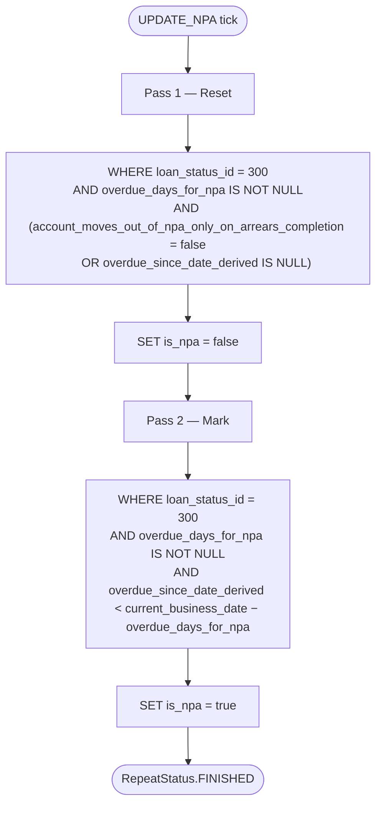

# Update NPA Job

`UPDATE_NPA` is the **Apache Fineract** daily cron that reconciles every active loan's `is_npa` (Non‑Performing Asset) flag against its arrears state and the originating product's NPA configuration. It is a small, focused tasklet that does its work in two raw SQL passes against the tenant database — no Spring Data, no JPA — for performance. The implementation lives in `org.apache.fineract.infrastructure.jobs.service.updatenpa` (`fineract-provider`).

This page documents the job's algorithm, the two SQL statements it runs, the MySQL vs. PostgreSQL portability tricks, and the surrounding business semantics. For the cron registration and Quartz wiring see [`/jobs/job-registry-and-stuck-jobs`](/jobs/job-registry-and-stuck-jobs); for the entire enum and default cron see [`/jobs/job-names-enumeration`](/jobs/job-names-enumeration).

## Business problem

A loan's NPA flag is *derived state*: a loan should be NPA if and only if it has been overdue for more than the product‑specific threshold. Two columns drive the decision:

- `m_loan.is_npa` — the cached flag we want to keep correct.
- `m_loan_arrears_aging.overdue_since_date_derived` — when the loan first went overdue (recomputed daily by `UPDATE_LOAN_ARREARS_AGEING`).
- `m_product_loan.overdue_days_for_npa` — the NPA threshold for the product. `NULL` means "this product doesn't classify NPA".
- `m_product_loan.account_moves_out_of_npa_only_on_arrears_completion` — a per‑product policy: should NPA clear only when arrears go to zero?

The cron's job is to apply those rules to every active loan in one or two SQL statements.

## Job configuration

```java
@Configuration
public class UpdateNpaConfig {

    @Autowired private JobRepository jobRepository;
    @Autowired private PlatformTransactionManager transactionManager;
    @Autowired private RoutingDataSourceServiceFactory dataSourceServiceFactory;
    @Autowired private DatabaseTypeResolver databaseTypeResolver;
    @Autowired private DatabaseSpecificSQLGenerator sqlGenerator;
    @Autowired private PlatformSecurityContext platformSecurityContext;

    @Bean
    protected Step updateNpaStep() {
        return new StepBuilder(JobName.UPDATE_NPA.name(), jobRepository)
                .tasklet(updateNpaTasklet(), transactionManager).build();
    }

    @Bean
    public Job updateNpaJob() {
        return new JobBuilder(JobName.UPDATE_NPA.name(), jobRepository)
                .start(updateNpaStep())
                .incrementer(new RunIdIncrementer()).build();
    }

    @Bean
    public UpdateNpaTasklet updateNpaTasklet() {
        return new UpdateNpaTasklet(dataSourceServiceFactory, databaseTypeResolver, sqlGenerator, platformSecurityContext);
    }
}
```

Notable injections:

- `RoutingDataSourceServiceFactory` — provides a tenant‑aware data source so the tasklet runs against the correct DB.
- `DatabaseTypeResolver` — `isMySQL()` / `isPostgreSQL()` predicates that drive SQL dialect branches.
- `DatabaseSpecificSQLGenerator` — builds dialect‑safe fragments (`subDate`, `currentBusinessDate`).
- `PlatformSecurityContext` — the audit user written into `last_modified_by`.

The tasklet is **not** Spring Data — it builds raw `JdbcTemplate` instances and runs SQL strings. This is intentional: the operation touches every active loan and an ORM would generate millions of round trips.

## The tasklet

```java
@Slf4j
@RequiredArgsConstructor
public class UpdateNpaTasklet implements Tasklet {

    private final RoutingDataSourceServiceFactory dataSourceServiceFactory;
    private final DatabaseTypeResolver databaseTypeResolver;
    private final DatabaseSpecificSQLGenerator sqlGenerator;
    private final PlatformSecurityContext context;

    @Override
    public RepeatStatus execute(StepContribution contribution, ChunkContext chunkContext) throws Exception {
        AppUser user = context.getAuthenticatedUserIfPresent();
        final JdbcTemplate jdbcTemplate = new JdbcTemplate(
                dataSourceServiceFactory.determineDataSourceService().retrieveDataSource());

        // PASS 1: reset is_npa=false for loans that should NOT be NPA anymore
        final StringBuilder resetNPASqlBuilder = new StringBuilder();
        resetNPASqlBuilder.append("update m_loan loan ");
        String fromPart = " (SELECT loan2.* FROM m_loan loan2 "
                + "left join m_loan_arrears_aging laa on laa.loan_id = loan2.id "
                + "inner join m_product_loan mpl on mpl.id = loan2.product_id and mpl.overdue_days_for_npa is not null "
                + "WHERE loan2.loan_status_id = 300 "
                + "and mpl.account_moves_out_of_npa_only_on_arrears_completion = false"
                + " or (mpl.account_moves_out_of_npa_only_on_arrears_completion = true"
                + " and laa.overdue_since_date_derived is null)) sl";
        String wherePart = " where loan.id = sl.id ";

        if (databaseTypeResolver.isMySQL()) {
            resetNPASqlBuilder.append(", ").append(fromPart).append(" set loan.is_npa = false")
                    .append(", loan.last_modified_by = ?, loan.last_modified_on_utc = ? ").append(wherePart);
        } else {
            resetNPASqlBuilder.append("set is_npa = false")
                    .append(", last_modified_by = ?, last_modified_on_utc = ? ")
                    .append(" FROM ").append(fromPart).append(wherePart);
        }
        jdbcTemplate.update(resetNPASqlBuilder.toString(), user.getId(), DateUtils.getAuditOffsetDateTime());

        // PASS 2: set is_npa=true for loans that are now NPA
        final StringBuilder updateSqlBuilder = new StringBuilder(900);
        fromPart = " (select loan.id "
                + " FROM m_loan_arrears_aging laa"
                + " INNER JOIN  m_loan loan on laa.loan_id = loan.id "
                + " INNER JOIN m_product_loan mpl on mpl.id = loan.product_id "
                + "                              AND mpl.overdue_days_for_npa is not null "
                + "WHERE loan.loan_status_id = 300 and "
                + "laa.overdue_since_date_derived < "
                + sqlGenerator.subDate(
                        sqlGenerator.currentBusinessDate(),
                        "COALESCE(mpl.overdue_days_for_npa, 0)", "day")
                + " group by loan.id) as sl ";
        wherePart = " where ml.id=sl.id ";
        updateSqlBuilder.append("UPDATE m_loan as ml ");
        if (databaseTypeResolver.isMySQL()) {
            updateSqlBuilder.append(", ").append(fromPart).append(" SET ml.is_npa = true")
                    .append(", ml.last_modified_by = ?, ml.last_modified_on_utc = ? ").append(wherePart);
        } else {
            updateSqlBuilder.append(" SET is_npa = true")
                    .append(", last_modified_by = ?, last_modified_on_utc = ? ")
                    .append(" FROM ").append(fromPart).append(wherePart);
        }

        final int result = jdbcTemplate.update(updateSqlBuilder.toString(),
                user.getId(), DateUtils.getAuditOffsetDateTime());

        log.debug("{}: Records affected by updateNPA: {}",
                ThreadLocalContextUtil.getTenant().getName(), result);
        return RepeatStatus.FINISHED;
    }
}
```

## Algorithm in two passes



### Pass 1 — reset

Resets `is_npa = false` for active loans (`loan_status_id = 300` = `ACTIVE`) that meet *either* of:

- The loan's product allows clearing NPA at any time (`account_moves_out_of_npa_only_on_arrears_completion = false`) — the next pass will re‑flag it if it is still actually overdue.
- The loan's product requires full arrears completion to clear NPA (`= true`), **and** the arrears row says the loan has no current overdue date (`overdue_since_date_derived IS NULL`) — it is paid up and may be cleared.

The reset is **product‑gated** by `overdue_days_for_npa IS NOT NULL`: products that don't classify NPA at all are skipped entirely. Their loans' `is_npa` flag is treated as managed externally.

### Pass 2 — mark

Sets `is_npa = true` for active loans whose `overdue_since_date_derived` is older than `current_business_date − overdue_days_for_npa` days. The crucial expression is:

```sql
laa.overdue_since_date_derived < <currentBusinessDate> - COALESCE(mpl.overdue_days_for_npa, 0) days
```

`DatabaseSpecificSQLGenerator.currentBusinessDate()` returns the dialect‑safe expression for the current Fineract business date (not the database `CURRENT_DATE`!), and `subDate(...)` wraps it in `DATE_SUB(...)` on MySQL or `... - INTERVAL` on PostgreSQL.

The `COALESCE(..., 0)` is defensive — a `NULL` threshold here would have made the entire predicate `NULL` and silently excluded all loans, but `IS NOT NULL` was already enforced in the `JOIN` condition, so the `COALESCE` only matters for malformed test data.

## MySQL vs. PostgreSQL

The dialect branch is necessary because MySQL and PostgreSQL parse multi‑table `UPDATE`s differently:

| Dialect | Syntax |
| --- | --- |
| MySQL | `UPDATE m_loan loan, (SELECT … ) sl SET loan.is_npa = … WHERE loan.id = sl.id` |
| PostgreSQL | `UPDATE m_loan SET is_npa = … FROM (SELECT … ) sl WHERE m_loan.id = sl.id` |

Both forms compile to the same logical operation: "join `m_loan` with the subquery and update matching rows". The tasklet builds the right one based on `DatabaseTypeResolver.isMySQL()`.

## Why two passes and not one merge?

A naive single `UPDATE … SET is_npa = (some boolean)` would compute the boolean *per row* — joining on `m_loan_arrears_aging` and `m_product_loan` for every loan, including those that should not have NPA classified at all. The two‑pass split:

1. Restricts the reset to a small filtered set of loans that *can* clear NPA under their product's rules.
2. Restricts the mark to loans that are *demonstrably* overdue past the threshold.

This means rows whose policy is "stay NPA until arrears clear" don't have their flag flipped by Pass 1 only to be flipped back by Pass 2 in the same transaction. The audit trail (`last_modified_by`, `last_modified_on_utc`) reflects only *real* changes.

## Loan status enum

`loan_status_id = 300` corresponds to `LoanStatus.ACTIVE`. The enum is well‑known and stable:

| Id | Status |
| --- | --- |
| 100 | Submitted and pending approval |
| 200 | Approved |
| 300 | **Active** |
| 400 | Withdrawn by client |
| 500 | Rejected |
| 600 | Closed (obligations met) |
| 601 | Written off |
| 602 | Rescheduled |
| 700 | Overpaid |

Only `300` rows are touched. Closed and written‑off loans never re‑acquire NPA status, even if their arrears row would qualify them.

## Cron and seed

| Field | Value |
| --- | --- |
| Enum name | `UPDATE_NPA` |
| Display label | `Update Non Performing Assets` |
| Seeded cron | `0 0 0 1/1 * ? *` (midnight daily) |
| Module | `fineract-provider` / `org.apache.fineract.infrastructure.jobs.service.updatenpa` |
| Step name | `UPDATE_NPA` |

The midnight cron means the job runs *after* the business date has advanced (typical 00:00:00 also for `INCREASE_BUSINESS_DATE_BY_1_DAY`). The race between the two midnight crons is benign in practice — `UPDATE_NPA` reads `currentBusinessDate()` at SQL time, so whichever date is current at query time is the one used. Operators who want strict ordering should re‑seed the cron to a later second (e.g. `0 5 0 1/1 * ? *`).

## Dependencies on other jobs

`UPDATE_NPA` depends on `m_loan_arrears_aging` being current. That table is maintained by `UPDATE_LOAN_ARREARS_AGEING` (cron `0 1 0 1/1 * ? *` — one minute past midnight). So the realistic daily ordering is:

1. `INCREASE_BUSINESS_DATE_BY_1_DAY` — sets today's date.
2. `INCREASE_COB_DATE_BY_1_DAY` — sets today − 1 as COB.
3. `UPDATE_LOAN_ARREARS_AGEING` — recomputes `overdue_since_date_derived` per loan.
4. `UPDATE_NPA` — reads the freshly recomputed arrears and flips `is_npa`.

If `UPDATE_NPA` happens to run before `UPDATE_LOAN_ARREARS_AGEING` because of trigger‑firing order, the result is staleness for one day — the next run will catch up.

## Audit and security

```java
AppUser user = context.getAuthenticatedUserIfPresent();
```

`JobStarter.run` (see [`/jobs/job-registry-and-stuck-jobs`](/jobs/job-registry-and-stuck-jobs)) authenticates the system user before invoking the tasklet, so `getAuthenticatedUserIfPresent()` returns a non‑null `AppUser`. The `user.getId()` and `DateUtils.getAuditOffsetDateTime()` are stamped into both passes' `last_modified_by` / `last_modified_on_utc`. This is how operators can spot bulk NPA flips in the audit log.

## Idempotency

The tasklet is **idempotent**: running it twice in a row produces the same DB state. The second run's first pass will reset only loans that aren't actually NPA; the second pass will mark only loans that actually qualify. No flag flickers if no underlying data changed.

This is exactly what makes it safe to be reattempted by `StuckJobListener` on a JVM restart, or by `EXECUTE_DIRTY_JOBS` after a mismatched‑node mishap.

## Failure modes

| Failure | Cause | Detection | Recovery |
| --- | --- | --- | --- |
| `JdbcSQLException` mid‑pass | DB outage, lock conflict on a hot row | `BATCH_STEP_EXECUTION.status='FAILED'` | Recovered on next JVM boot via `StuckJobListener` |
| No rows updated for weeks | All product `overdue_days_for_npa` are `NULL` | Set a product threshold via `PUT /v1/loanproducts/{id}` |
| Loans stay NPA after arrears clear | `account_moves_out_of_npa_only_on_arrears_completion=true` and arrears never reach zero (e.g. partial payment) | Functional config, not a bug |
| Cron pinned to dead node | `node_id` mismatch | `is_mismatched_job=true`, drained by `EXECUTE_DIRTY_JOBS` |
| Mass NPA flap | Operator changed `overdue_days_for_npa` on a hot product | Expected — audit log will show one operator change followed by the next NPA tick's mass updates |

## Test integration

Integration tests against `UPDATE_NPA` usually:

1. Create a loan product with `overdue_days_for_npa` set.
2. Disburse a loan, wait past the due date, leave it unpaid.
3. Advance the business date past `due_date + threshold`.
4. Invoke `UPDATE_NPA` via the inline job API.
5. Assert `loan.is_npa = true`.

The inline path lets the test run the tasklet synchronously without going through Quartz, which is essential for stable tests.

## Performance characteristics

Two `UPDATE` statements, both indexed on `m_loan.id` and `m_loan_arrears_aging.loan_id`. The dominant cost is the join across `m_loan × m_loan_arrears_aging × m_product_loan`, which for a 100k‑loan tenant typically completes in under a second. The job sets no chunk size and runs in a single transaction; if you have a tenant with millions of loans, watch the `BATCH_JOB_EXECUTION.duration` and consider partitioning. Today the tasklet is *not* in the `PartitionedJob` enum.

## Worked example

Consider three loans on the same product:

| Loan | Status | `overdue_since_date_derived` | Product `overdue_days_for_npa` | Product `account_moves_out_of_npa_only_on_arrears_completion` | Initial `is_npa` | After `UPDATE_NPA` |
| --- | --- | --- | --- | --- | --- | --- |
| A | ACTIVE | `2024‑09‑01` (61 days ago today) | 60 | false | false | `true` (Pass 2 marks it) |
| B | ACTIVE | `2024‑12‑20` (12 days ago today) | 60 | false | true | `false` (Pass 1 resets, Pass 2 does not re‑mark) |
| C | ACTIVE | `NULL` | 60 | true | true | `false` (Pass 1 resets because arrears cleared and `account_moves_out_of_npa_only_on_arrears_completion=true`) |

The exact SQL `UPDATE` counts after a run depend on how many rows match the join predicates; `log.debug` reports only the count from the second pass (`is_npa = true` updates).

## DatabaseSpecificSQLGenerator helpers

Two helpers from `DatabaseSpecificSQLGenerator` are central:

```java
sqlGenerator.subDate(currentBusinessDate, "COALESCE(mpl.overdue_days_for_npa, 0)", "day");
sqlGenerator.currentBusinessDate();
```

| Helper | MySQL output | PostgreSQL output |
| --- | --- | --- |
| `currentBusinessDate()` | `(SELECT ... FROM m_business_date WHERE type = 1)` (the BUSINESS_DATE row) | Same logical select, dialect‑neutral |
| `subDate(base, expr, unit)` | `DATE_SUB(<base>, INTERVAL <expr> <unit>)` | `<base> - <expr> * INTERVAL '1 <unit>'` (or equivalent) |

This is what makes the tasklet portable across both supported databases without duplicating the SQL three or four times.

## Why business date and not `CURRENT_DATE`

A subtle but important detail: the SQL uses Fineract's business date, not the database's `CURRENT_DATE`. This means:

- In a tenant with `business_date_enabled=true`, NPA classification follows the *logical* clock managed by `INCREASE_BUSINESS_DATE_BY_1_DAY`. The operator can set the date to any value and the next NPA run will classify accordingly.
- In a tenant with `business_date_enabled=false`, the helper falls back to a deterministic "today" derived from the tenant timezone. Behaviour is the same in steady state, but the operator can no longer time‑travel.

The choice was made because some deployments need to replay historical days (e.g. backfilling NPA flags after a long downtime) — using `CURRENT_DATE` would make that impossible.

## Concurrency

The tasklet uses a single `JdbcTemplate` and runs both SQL statements outside of an explicit transaction managed by Spring (the Spring Batch `transactionManager` declared on the step does manage an enclosing transaction, but the two `UPDATE`s do not need to be atomic with respect to each other — Pass 2 cannot undo what Pass 1 did because their `WHERE` clauses don't overlap on any row).

Two `UPDATE_NPA` runs would, however, conflict at the row lock level — `setConcurrent(false)` on the `MethodInvokingJobDetailFactoryBean` (set by `JobRegisterServiceImpl`) prevents that for cron‑driven invocations. Manual triggers via `executeJobWithParameters` are also serialized by the temporary‑scheduler trick (see [`/jobs/job-registry-and-stuck-jobs`](/jobs/job-registry-and-stuck-jobs)).

## See also

- [`/jobs/overview`](/jobs/overview).
- [`/jobs/job-names-enumeration`](/jobs/job-names-enumeration) — row for `UPDATE_NPA`.
- [`/jobs/job-registry-and-stuck-jobs`](/jobs/job-registry-and-stuck-jobs) — how Quartz fires this tasklet and how it is recovered.
- [`/jobs/business-date-job`](/jobs/business-date-job) — the date this job's SQL reads.
- [`/jobs/cob-date-job`](/jobs/cob-date-job) — sibling that drives `COB_DATE`.
- [`/cob/overview`](/cob/overview) — `UPDATE_NPA` is *not* part of the `LOAN_COB` business‑step chain but operates on adjacent state.
- [`/loan/loan-jobs`](/loan/loan-jobs) — `UPDATE_LOAN_ARREARS_AGEING` and the other arrears recomputation crons.
- [`/jobs/dirty-jobs`](/jobs/dirty-jobs) — drain path for mismatched runs.
