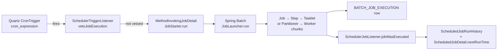
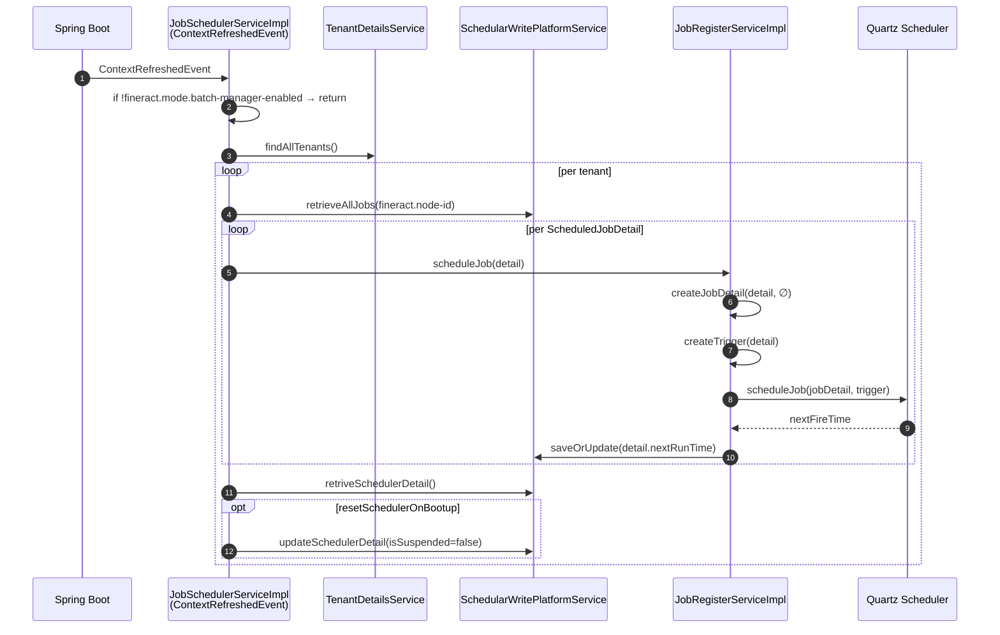

# Jobs Subsystem Overview

The jobs subsystem is how **Apache Fineract** executes recurring back-office work: closing the books on a loan day, posting interest on savings, sweeping external events to Kafka, ageing arrears, classifying NPAs, advancing the business date, aggregating journal entries, and dozens of other tasks. It is a hybrid of two frameworks glued together by a small registration layer:

- **Quartz** owns the cron expression and decides _when_ a job fires.
- **Spring Batch** owns the actual execution — chunks, partitions, retries, restart, and the `BATCH_JOB_EXECUTION` history.
- A Fineract-specific `ScheduledJobDetail` row in the tenant `job` table is the bridge between the two: it stores the cron, the `job_key` Quartz uses, the last run status, and pointers to the human-readable Spring Batch `Job` bean.

Every Fineract job — whether it is a single SQL `UPDATE` (`UPDATE_NPA`), a Quartz-only periodic tick (`INCREASE_COB_DATE_BY_1_DAY`), or a remotely partitioned manager/worker fan-out (`LOAN_COB`) — flows through the same Quartz → `JobStarter` → Spring Batch `JobLauncher` → `Tasklet/Step` pipeline described on this page.

The companion pages drill into individual layers, APIs, and notable job implementations.

## Where the code lives

| Layer | Module | Package |
| --- | --- | --- |
| `JobName` enum, `JobDetailData`, exception types | `fineract-core` | `org.apache.fineract.infrastructure.jobs` |
| Spring Batch infra (`PropertyService`, constants) | `fineract-core` | `org.apache.fineract.infrastructure.springbatch` |
| Quartz registration, listeners, `JobStarter`, REST resources | `fineract-provider` | `org.apache.fineract.infrastructure.jobs` |
| Per-job `*Config` + `*Tasklet` | `fineract-provider` / `fineract-loan` / `fineract-core` / `fineract-accounting` | `…jobs.<jobname>` |
| Manager / Worker / partitioned glue | `fineract-provider` | `org.apache.fineract.infrastructure.springbatch` |
| Remote message handlers (JMS, Kafka, Spring events) | `fineract-provider` | `…springbatch.messagehandler.*` |

## The two-clock model



- Quartz never executes business logic directly. It schedules a `JobDetail` whose only task is to invoke `JobStarter.run(Job, ScheduledJobDetail, params, tenantId)`.
- `JobStarter` looks up the Spring Batch `Job` bean by **enum-style name** (e.g. `UPDATE_NPA`) via `JobLocator`, builds `JobParameters`, and calls `JobLauncher.run(...)`.
- Spring Batch then drives the step graph. For simple jobs that means a single `Tasklet`. For partitioned jobs it means a `Partitioner` step that fans out work to worker JVMs over a message bus.
- Two listeners persist outcomes:
  - **`SchedulerJobListener`** writes `ScheduledJobRunHistory` for the Quartz-visible side (cron status, errorlog, next run time).
  - Spring Batch's own `BatchStatus` lives in `BATCH_JOB_EXECUTION` and is what `StuckJobsService` consults on recovery.

## The `ScheduledJobDetail` row

`org.apache.fineract.infrastructure.jobs.domain.ScheduledJobDetail` is the persistent identity of a job inside a tenant. It maps to the `job` table:

```java
@Entity
@Table(name = "job", uniqueConstraints = { @UniqueConstraint(columnNames = { "short_name" }, name = "job_short_name_key") })
public class ScheduledJobDetail extends AbstractPersistableCustom<Long> {

    @Column(name = "name")              private String jobName;            // e.g. "Loan COB"
    @Column(name = "display_name")      private String jobDisplayName;
    @Column(name = "node_id")           private Integer nodeId;            // 0 = any, else fineract.node-id
    @Column(name = "is_mismatched_job") private boolean isMismatchedJob;   // flagged "dirty"
    @Column(name = "cron_expression")   private String cronExpression;     // Quartz cron
    @Column(name = "task_priority")     private Short taskPriority;
    @Column(name = "group_name")        private String groupName;          // Quartz group
    @Column(name = "previous_run_start_time") private Date previousRunStartTime;
    @Column(name = "next_run_time")           private Date nextRunTime;
    @Column(name = "job_key")           private String jobKey;             // name + " _ " + group
    @Column(name = "initializing_errorlog") private String errorLog;       // last init failure
    @Column(name = "is_active")         private boolean activeSchedular;   // disabled jobs are not registered
    @Column(name = "currently_running") private boolean currentlyRunning;
    @Column(name = "updates_allowed")   private boolean updatesAllowed;    // gate for PUT
    @Column(name = "scheduler_group")   private Short schedulerGroup;      // separate Quartz scheduler if > 0
    @Column(name = "is_misfired")       private boolean triggerMisfired;
    @Column(name = "short_name")        private String shortName;
}
```

| Column | Purpose |
| --- | --- |
| `name` | The **human-readable** label exactly matching `JobName.toString()` ("Loan COB", "Update Non Performing Assets", …). `JobNameService.getJobByHumanReadableName(...)` resolves it back to the enum value used by Spring Batch (`LOAN_COB`, `UPDATE_NPA`). |
| `cron_expression` | Quartz cron. Modifiable through `PUT /v1/jobs/{id}`. |
| `node_id` | The cluster node allowed to run this job. `0` means "any node". `JobRegisterServiceImpl.executeJobWithParameters` throws `JobNodeIdMismatchingException` if `node_id` does not match `fineract.node-id` (env-overridable). |
| `is_active` | If `false`, `JobRegisterServiceImpl.scheduleJob` returns without registering a trigger. |
| `is_misfired` | Set by Quartz when the JVM was down at the scheduled time; on `start` the scheduler re-fires. |
| `is_mismatched_job` | Flag the *Execute All Dirty Jobs* job watches — see `/jobs/dirty-jobs`. |
| `scheduler_group` | When `> 0`, a separate Quartz `Scheduler` instance is created with a 1-thread pool so the job runs serialised with siblings in the same group. |

A second tenant table, `scheduler_detail` → `SchedulerDetail` entity, stores tenant-wide flags:

- `isSuspended` — when `true`, the scheduler is paused (vetoer rejects executions).
- `isExecuteInstructionForMisfiredJobs` — re-fire misfires on `start`.
- `isResetSchedulerOnBootup` — `JobSchedulerServiceImpl` clears `isSuspended` on `ContextRefreshedEvent`.

## Bootstrap sequence



A node where `fineract.mode.batch-manager-enabled=false` (a "read-only" or "worker-only" replica) will skip the loop entirely and log:

```
Batch job scheduling is disabled since this instance is not a batch manager
```

## Quartz scheduler topology

`JobRegisterServiceImpl` keeps a `static HashMap<String, Scheduler> SCHEDULERS` keyed by `Scheduler<tenantId>[group<n>]`. That means:

- Each tenant has its **own** Quartz scheduler instance, default thread count `7` (`SchedulerServiceConstants.DEFAULT_THREAD_COUNT`).
- A job with `scheduler_group > 0` is registered to a dedicated, 1-thread scheduler so it cannot run concurrently with sibling jobs in the same group.
- Manual ("application-triggered") executions for a job that has no permanent scheduler get a one-shot `tempSchedulerN` and a `SchedulerStopListener` that disposes the scheduler once the trigger completes.

## Where the actual work lives

| Layer | Example bean |
| --- | --- |
| Spring Batch `@Configuration` declaring `@Bean Job` | `UpdateNpaConfig`, `IncreaseCobDateBy1DayConfig`, `JournalEntryAggregationJobConfiguration`, `LoanCOBManagerConfiguration` |
| `Tasklet` doing the work | `UpdateNpaTasklet`, `IncreaseCobDateBy1DayTasklet`, `ExecuteAllDirtyJobsTasklet` |
| Item-oriented step (`reader` → `processor` → `writer`) | `JournalEntryAggregationJobReader/Writer`, loan COB business steps |
| Manager partitioner / worker step | `LoanCOBPartitioner` + `LoanCOBWorkerConfiguration` |

The Spring Batch `Job` bean name **must equal the `JobName` enum constant** (`UPDATE_NPA`, `LOAN_COB`, ...) because `JobStarter` looks it up via `JobLocator.getJob(jobName.getEnumStyleName())`. The `JobName.toString()` value is the human label stored in `job.name` and shown in the REST API.

## Triggering paths

```mermaid
flowchart TD
    Cron[Quartz Cron Trigger]
    Api[POST /v1/jobs/{id}?command=executeJob]
    Dirty[ExecuteAllDirtyJobsTasklet]
    Inline[POST /v1/jobs/{name}/inline]
    Stuck[StuckJobListener<br/>ContextRefreshedEvent]

    Cron --> JR[JobRegisterServiceImpl<br/>.executeJob via Quartz]
    Api --> CW[CommandWrapper<br/>.executeSchedulerJob]
    CW --> EH[ExecuteJobCommandHandler]
    EH --> JR
    Dirty --> JR

    JR --> Starter[JobStarter.run]
    Starter --> Launcher[Spring Batch JobLauncher]

    Inline --> IH[InlineJobExecuteHandler]
    IH --> Exec[InlineExecutorService]
    Exec -.-> Launcher

    Stuck --> Resume[StuckJobExecutorService.resumeStuckJob]
    Resume --> Operator[JobOperator.restart]
    Operator --> Launcher
```

Five distinct entry points share the Spring Batch `JobLauncher`:

1. **Quartz cron** — the default path. `SchedulerTriggerListener.vetoJobExecution` decides at fire time whether to suppress (when scheduler is suspended, or the job has been disabled since registration).
2. **REST: execute** — `POST /v1/jobs/{id}?command=executeJob` produces a `CommandWrapper`. The `ExecuteJobCommandHandler` invokes `JobRegisterService.executeJobWithParameters`, which goes through Quartz with a `TRIGGER_TYPE_APPLICATION` marker.
3. **Dirty catch-up** — `EXECUTE_DIRTY_JOBS` reads `job.is_mismatched_job = true` rows owned by this node and re-runs them. See `/jobs/dirty-jobs`.
4. **Inline jobs** — `POST /v1/jobs/{name}/inline` is the only path that **bypasses** Quartz and the Spring Batch async launcher. It runs synchronously in the request thread. Currently limited to `LOAN_COB` and `WC_LOAN_COB`. See `/jobs/inline-job-api`.
5. **Stuck job recovery** — on every `ContextRefreshedEvent`, `StuckJobListener` queries `BATCH_JOB_EXECUTION` for `STARTED` rows below the retry threshold and calls `JobOperator.restart(executionId)`.

## The `JobName` enum

`org.apache.fineract.infrastructure.jobs.service.JobName` enumerates every job the platform ships. The display label is the value stored in `job.name` and the enum constant is the Spring Batch `Job` bean name.

```java
public enum JobName {
    UPDATE_LOAN_ARREARS_AGEING("Update Loan Arrears Ageing"),
    APPLY_ANNUAL_FEE_FOR_SAVINGS("Apply Annual Fee For Savings"),
    // …
    INCREASE_BUSINESS_DATE_BY_1_DAY("Increase Business Date by 1 day"),
    INCREASE_COB_DATE_BY_1_DAY("Increase COB Date by 1 day"),
    LOAN_COB("Loan COB"),
    EXECUTE_DIRTY_JOBS("Execute All Dirty Jobs"),
    JOURNAL_ENTRY_AGGREGATION("Journal Entry Aggregation"),
    WORKING_CAPITAL_LOAN_COB_JOB("Working Capital Loan COB");

    @Override public String toString() { return this.name; }
}
```

`/jobs/job-names-enumeration` lists every value with its default cron, implementing class, and target module.

## Sub-page navigation

| Page | Topic |
| --- | --- |
| `/jobs/scheduler-and-quartz` | How Quartz wiring works: `JobRegisterServiceImpl`, listeners, vetoer, per-tenant scheduler topology, misfire handling. |
| `/jobs/scheduler-api` | `SchedulerApiResource` — `GET/POST /v1/scheduler`, start/stop/reset. |
| `/jobs/scheduler-job-api` | `SchedulerJobApiResource` — list / get / update / execute / run history under `/v1/jobs`. |
| `/jobs/inline-job-api` | `InlineJobApiResource` — `POST /v1/jobs/{name}/inline`, only LOAN_COB / WC_LOAN_COB. |
| `/jobs/job-registry-and-stuck-jobs` | `JobRegisterServiceImpl` deep dive + `StuckJobListener` recovery loop. |
| `/jobs/job-names-enumeration` | Full table of every `JobName` value with cron, class, module. |
| `/jobs/spring-batch-manager-worker` | Manager/Worker split, `fineract.partitioned-job.*`, JMS / Kafka / Spring transports. |
| `/jobs/aggregation-job` | `JOURNAL_ENTRY_AGGREGATION` job. |
| `/jobs/dirty-jobs` | `EXECUTE_DIRTY_JOBS` catch-up tasklet. |
| `/jobs/business-date-job` | `INCREASE_BUSINESS_DATE_BY_1_DAY`. |
| `/jobs/cob-date-job` | `INCREASE_COB_DATE_BY_1_DAY` and its relationship to `LOAN_COB`. |
| `/jobs/npa-job` | `UPDATE_NPA` — Non-Performing Asset classifier. |

## Related cross-references

- [`/core/jobs-domain`](/core/jobs-domain) — `ScheduledJobDetail`, `ScheduledJobRunHistory`, `SchedulerDetail` JPA mapping and lifecycle.
- [`/core/spring-batch-infra`](/core/spring-batch-infra) — `ScheduledJobRunnerConfig`, `JobRepository`, `JobLauncher`, `JobExplorer`, `DataFieldMaxValueIncrementerFactory`.
- [`/core/business-date`](/core/business-date) — `BusinessDateWritePlatformService` (used by the business-date and COB-date jobs).
- [`/cob/overview`](/cob/overview) — Close-of-Business pipeline driven by `LOAN_COB`.
- [`/accounting/journal-entry-aggregation`](/accounting/journal-entry-aggregation) — destination of the `JOURNAL_ENTRY_AGGREGATION` job's output rows.
- [`/api/jobs-and-cob-apis`](/api/scheduler) — high-level REST catalogue.

## Operational checklist

When something goes wrong with a job, walk this checklist in order:

1. `GET /v1/scheduler` — is the scheduler paused? If `active: false`, no cron will fire. `POST /v1/scheduler?command=start` resumes.
2. `GET /v1/jobs/{id}` — is `active: true`? If `false`, the row exists but has not been registered with Quartz.
3. `GET /v1/jobs/{id}` — does `nextRunTime` make sense? If `null` and `cronExpression` is set, the cron may be invalid; check `initializingError`.
4. `GET /v1/jobs/{id}/runhistory` — most recent `status` and `jobRunErrorMessage` are the source of truth for the last Quartz-side run.
5. `BATCH_JOB_EXECUTION` table — for partitioned / Spring Batch jobs, this row carries the canonical Spring Batch `STATUS`. `STARTED` rows older than the most recent terminal execution are picked up by `StuckJobListener` next bootup.
6. `job.node_id` vs `fineract.node-id` — a `JobNodeIdMismatchingException` from a manual execute means the request hit the wrong cluster node. Either change `node_id` to `0` (any node) or route the request to the owning node.

This page is the map. Each sub-page is the territory.
