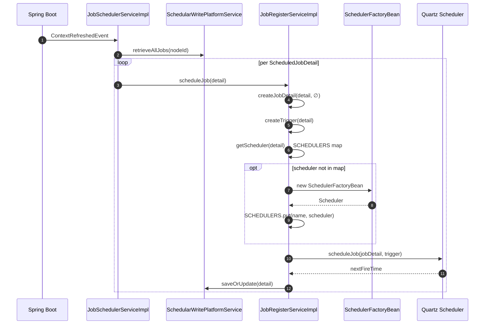

# Quartz Scheduler Integration

This page explains how **Apache Fineract** glues Quartz to its own job catalogue. Quartz is responsible for cron scheduling, trigger firing, misfire detection, and thread-pool management — but it is **never** the place where business logic runs. Every Quartz job that Fineract registers is a `MethodInvokingJobDetailFactoryBean` whose target is `JobStarter.run(...)`, which in turn invokes a Spring Batch `Job`. The classes covered here live in `org.apache.fineract.infrastructure.jobs.service` in `fineract-provider`.

If you want the high-level map first, read [`/jobs/overview`](/jobs/overview).

## The registration entry points



Two beans share responsibility:

- **`JobSchedulerServiceImpl`** — `ApplicationListener<ContextRefreshedEvent>`. On startup it iterates every tenant, sets `ThreadLocalContextUtil.tenant`, fetches business dates, then asks `JobRegisterService` to register each `ScheduledJobDetail`.
- **`JobRegisterServiceImpl`** — the API that owns the Quartz layer. It exposes `scheduleJob`, `rescheduleJob`, `executeJob`, `executeJobWithParameters`, `stopScheduler`, `pauseScheduler`, `startScheduler`, `stopAllSchedulers`, and is itself an `ApplicationListener<ContextClosedEvent>` so it can shut down every cached `Scheduler` cleanly on JVM exit.

The first thing `JobSchedulerServiceImpl.onApplicationEvent` does is gate on operating mode:

```java
if (!fineractProperties.getMode().isBatchManagerEnabled()) {
    log.warn("Batch job scheduling is disabled since this instance is not a batch manager");
    return;
}
```

If `fineract.mode.batch-manager-enabled=false`, no Quartz scheduler is ever built on this node. That is the standard pattern for separating long-running batch nodes from API-only replicas in a cluster.

## The static `SCHEDULERS` cache

`JobRegisterServiceImpl` keeps a process-wide map:

```java
private static final HashMap<String, Scheduler> SCHEDULERS = new HashMap<>(4);
```

The key is built by `getSchedulerName`:

```java
private String getSchedulerName(final ScheduledJobDetail scheduledJobDetail) {
    final StringBuilder sb = new StringBuilder(20);
    final FineractPlatformTenant tenant = ThreadLocalContextUtil.getTenant();
    sb.append(SchedulerServiceConstants.SCHEDULER).append(tenant.getId());
    if (scheduledJobDetail.getSchedulerGroup() > 0) {
        sb.append(SchedulerServiceConstants.SCHEDULER_GROUP).append(scheduledJobDetail.getSchedulerGroup());
    }
    return sb.toString();
}
```

So:

| Job characteristic | Scheduler name | Threads |
| --- | --- | --- |
| Default (group = 0) | `Scheduler<tenantId>` | `SchedulerServiceConstants.DEFAULT_THREAD_COUNT = 7` |
| `scheduler_group > 0` | `Scheduler<tenantId>group<n>` | `SchedulerServiceConstants.GROUP_THREAD_COUNT = 1` |
| Ad-hoc execute when no scheduler exists yet | `temp<jobId>` | `1` |

The grouping lets you serialise mutually-exclusive jobs (e.g. all accrual jobs together) without using Quartz's `@DisallowConcurrentExecution`, while still keeping unrelated jobs free to fan out across the 7-thread pool.

## Building a `JobDetail` and `Trigger`

`createJobDetail` resolves the Spring Batch `Job` bean and wires it into the Quartz side as a method invocation:

```java
private JobDetail createJobDetail(final ScheduledJobDetail scheduledJobDetail, Set<JobParameterDTO> jobParameterDTOSet)
        throws Exception {
    final FineractPlatformTenant tenant = ThreadLocalContextUtil.getTenant();

    JobNameData jobName = jobNameService.getJobByHumanReadableName(scheduledJobDetail.getJobName());
    Job job;
    try {
        job = jobLocator.getJob(jobName.getEnumStyleName());
    } catch (NoSuchJobException e) {
        throw new JobIsNotFoundOrNotEnabledException(e, jobName.getEnumStyleName());
    }

    final MethodInvokingJobDetailFactoryBean jobDetailFactoryBean = new MethodInvokingJobDetailFactoryBean();
    jobDetailFactoryBean.setName(scheduledJobDetail.getJobName() + "JobDetail" + tenant.getId());
    jobDetailFactoryBean.setTargetObject(jobStarter);
    jobDetailFactoryBean.setTargetMethod(JOB_STARTER_METHOD_NAME); // "run"
    jobDetailFactoryBean.setGroup(scheduledJobDetail.getGroupName());
    jobDetailFactoryBean.setConcurrent(false);
    jobDetailFactoryBean.setArguments(job, scheduledJobDetail, jobParameterDTOSet, tenant.getTenantIdentifier());
    jobDetailFactoryBean.afterPropertiesSet();
    return jobDetailFactoryBean.getObject();
}
```

Key details:

- `JobNameService.getJobByHumanReadableName` translates the row's `name` ("Loan COB") to its enum constant (`LOAN_COB`). If the row references a job that no `JobNameProvider` has registered, a clear `IllegalArgumentException` is raised before Quartz is touched.
- The Spring Batch `Job` bean lookup happens **once at registration** but the bean itself is re-resolved fresh per invocation through the `JobLocator`. If the corresponding `*Config` is `@ConditionalOnProperty` (e.g. journal aggregation), a `JobIsNotFoundOrNotEnabledException` is rethrown and `JobSchedulerServiceImpl` logs a warning and continues — the row stays in the DB but does not fire.
- `setConcurrent(false)` forbids overlapping fires of the same Quartz job. Combined with the worker step's own lock acquisition for partitioned jobs, this is the only concurrency safety on the cron side.
- The single target method is `JobStarter.run`. All arguments — `Job`, `ScheduledJobDetail`, `Set<JobParameterDTO>`, `tenantIdentifier` — are baked into the Quartz `JobDetail` at registration time. That is why a **cron-style invocation always carries an empty `jobParameterDTOSet`**; only the manual path through `executeJob(...)` supplies custom parameters.

`createTrigger` wraps the cron in a Quartz `CronTriggerFactoryBean`, picks the tenant timezone, and inherits the task priority from `ScheduledJobDetail.taskPriority`:

```java
private Trigger createTrigger(final ScheduledJobDetail scheduledJobDetails, final JobDetail jobDetail) throws ParseException {
    final FineractPlatformTenant tenant = ThreadLocalContextUtil.getTenant();
    final CronTriggerFactoryBean cronTriggerFactoryBean = new CronTriggerFactoryBean();
    cronTriggerFactoryBean.setName(scheduledJobDetails.getJobName() + "Trigger" + tenant.getId());
    cronTriggerFactoryBean.setJobDetail(jobDetail);
    final JobDataMap jobDataMap = new JobDataMap();
    jobDataMap.put(SchedulerServiceConstants.TENANT_IDENTIFIER, tenant.getTenantIdentifier());
    cronTriggerFactoryBean.setJobDataMap(jobDataMap);
    final TimeZone timeZone = TimeZone.getTimeZone(tenant.getTimezoneId());
    cronTriggerFactoryBean.setTimeZone(timeZone);
    cronTriggerFactoryBean.setGroup(scheduledJobDetails.getGroupName());
    cronTriggerFactoryBean.setCronExpression(scheduledJobDetails.getCronExpression());
    cronTriggerFactoryBean.setPriority(scheduledJobDetails.getTaskPriority());
    cronTriggerFactoryBean.afterPropertiesSet();
    return cronTriggerFactoryBean.getObject();
}
```

The trigger's `JobDataMap` carries only `tenantIdentifier`. The listener side reads it during `vetoJobExecution` and `jobWasExecuted` to set the right tenant on `ThreadLocalContextUtil` before delegating.

## The persistent identity: `job_key`

Quartz identifies a `JobDetail` by `JobKey = (name, group)`. Fineract serialises that to one string:

```java
private String getJobKeyAsString(final JobKey jobKey) {
    return jobKey.getName() + SchedulerServiceConstants.JOB_KEY_SEPERATOR + jobKey.getGroup();
}
// SchedulerServiceConstants.JOB_KEY_SEPERATOR = " _ "
```

That string is written to `job.job_key`. Listeners — most importantly `SchedulerJobListener.jobWasExecuted` — split on the separator to find the matching `ScheduledJobDetail` row when persisting run history:

```java
final JobKey key = context.getJobDetail().getKey();
final String jobKey = key.getName() + SchedulerServiceConstants.JOB_KEY_SEPERATOR + key.getGroup();
final ScheduledJobDetail scheduledJobDetails = this.schedularService.findByJobKey(jobKey);
```

Because `job_key` includes the tenant id (it is part of `setName(... + tenant.getId())`), tenants never collide in the same scheduler, but a `temp<jobId>` scheduler is created on-the-fly for ad-hoc executes anyway.

## The three Quartz listeners

`createScheduler` always wires both a job listener and a trigger listener globally on every `Scheduler` it builds:

```java
private Scheduler createScheduler(final String name, final int noOfThreads, JobListener... jobListeners) throws Exception {
    final SchedulerFactoryBean schedulerFactoryBean = new SchedulerFactoryBean();
    schedulerFactoryBean.setSchedulerName(name);
    schedulerFactoryBean.setGlobalJobListeners(jobListeners);
    final TriggerListener[] globalTriggerListeners = { globalSchedulerTriggerListener };
    schedulerFactoryBean.setGlobalTriggerListeners(globalTriggerListeners);
    final Properties quartzProperties = new Properties();
    quartzProperties.put(SchedulerFactoryBean.PROP_THREAD_COUNT, Integer.toString(noOfThreads));
    schedulerFactoryBean.setQuartzProperties(quartzProperties);
    schedulerFactoryBean.afterPropertiesSet();
    schedulerFactoryBean.start();
    return schedulerFactoryBean.getScheduler();
}
```

### `SchedulerJobListener` (`Global Listener`)

Implements `JobListener.jobWasExecuted` to:

1. Restore `ThreadLocalContextUtil.tenant` from `JobDataMap.tenantIdentifier`.
2. Look up the `ScheduledJobDetail` by `jobKey`.
3. Compute a status — `success` or `failed` — from the `JobExecutionException`.
4. Walk up to `SchedulerServiceConstants.STACK_TRACE_LEVEL = 7` exception causes, gathering the deepest meaningful error message and stack trace.
5. Update `nextRunTime` from the trigger.
6. Persist a `ScheduledJobRunHistory` row (version bumped by `schedularService.fetchMaxVersionBy(jobKey) + 1`).
7. Persist `ScheduledJobDetail.previousRunStartTime` and reset `currentlyRunning = false`.

```java
if (SchedulerServiceConstants.TRIGGER_TYPE_CRON.equals(triggerType)
        && trigger.getNextFireTime() != null
        && trigger.getNextFireTime().after(scheduledJobDetails.getNextRunTime())) {
    scheduledJobDetails.setNextRunTime(trigger.getNextFireTime());
}
```

The cause-walking logic stops as soon as the chain leaves Quartz / Spring Batch wrappers, so the error you see in `runhistory` is the underlying business exception, not `JobMethodInvocationFailedException`.

### `SchedulerTriggerListener` (`Fineract Global Scheduler Trigger Listener`)

Quartz calls `vetoJobExecution` *after* a trigger fires but *before* the job is executed. Fineract delegates the decision to `SchedulerVetoer`:

```java
@Override
public boolean vetoJobExecution(final Trigger trigger, final JobExecutionContext context) {
    // … restore tenant context from jobDataMap.tenantIdentifier …
    return schedulerVetoer.veto(trigger, context);
}
```

`SchedulerVetoer.veto` re-reads the job row (`schedularService.processJobDetailForExecution(jobKey, triggerType)`) and decides whether to skip:

```java
@Transactional(isolation = Isolation.READ_COMMITTED)
public boolean veto(Trigger trigger, JobExecutionContext context) {
    String tenantIdentifier = trigger.getJobDataMap().getString(SchedulerServiceConstants.TENANT_IDENTIFIER);
    HashMap<BusinessDateType, LocalDate> businessDates = businessDateReadPlatformService.getBusinessDates();
    ThreadLocalContextUtil.setBusinessDates(businessDates);
    JobKey key = trigger.getJobKey();
    String jobKey = key.getName() + SchedulerServiceConstants.JOB_KEY_SEPERATOR + key.getGroup();
    String triggerType = SchedulerServiceConstants.TRIGGER_TYPE_CRON;
    if (context.getMergedJobDataMap().containsKey(SchedulerServiceConstants.TRIGGER_TYPE_REFERENCE)) {
        triggerType = context.getMergedJobDataMap().getString(SchedulerServiceConstants.TRIGGER_TYPE_REFERENCE);
    }
    boolean vetoJob = schedularService.processJobDetailForExecution(jobKey, triggerType);
    if (vetoJob) {
        log.warn("vetoJobExecution() WILL veto …");
    }
    return vetoJob;
}
```

`processJobDetailForExecution` checks `SchedulerDetail.isSuspended`, `ScheduledJobDetail.activeSchedular`, and `currentlyRunning`. Vetoing returns control to Quartz without invoking the target — and **without** producing a `ScheduledJobRunHistory` row. The next Quartz firing will simply consult the row again.

### `SchedulerStopListener` (`Single Trigger Global Listener`)

Used only for the ad-hoc execute path. When the request hits a `ScheduledJobDetail` that has no live scheduler (e.g. the job was disabled when bootstrap ran), `executeJob` builds a temporary scheduler:

```java
SchedulerStopListener schedulerStopListener = new SchedulerStopListener(this);
final String tempSchedulerName = "temp" + scheduledJobDetail.getId();
final Scheduler tempScheduler = createScheduler(tempSchedulerName, 1, schedulerJobListener, schedulerStopListener);
jobDataMap.put(SchedulerServiceConstants.SCHEDULER_NAME, tempSchedulerName);
SCHEDULERS.put(tempSchedulerName, tempScheduler);
tempScheduler.addJob(jobDetail, true);
tempScheduler.triggerJob(jobKey, jobDataMap);
```

`SchedulerStopListener.jobWasExecuted` then calls `jobRegisterService.stopScheduler(name)` which removes the scheduler from `SCHEDULERS` and calls `.shutdown()`. The class is the one place where Fineract uses setter injection: it has a circular dependency with `JobRegisterService` and is therefore constructed by `new SchedulerStopListener(this)` from inside the registrar.

## Trigger types

Every execution carries a `triggerType` string copied from the merged `JobDataMap`:

```java
public interface SchedulerServiceConstants {
    String TRIGGER_TYPE_CRON = "cron";
    String TRIGGER_TYPE_APPLICATION = "application";
    String TRIGGER_TYPE_REFERENCE = "TRIGGER_TYPE_REFERENCE";
    // …
}
```

| Type | Source | Recorded as |
| --- | --- | --- |
| `cron` | Quartz cron trigger | `ScheduledJobRunHistory.triggerType = "cron"` |
| `application` | Manual `POST /v1/jobs/{id}?command=executeJob` (and other in-process callers like `ExecuteAllDirtyJobsTasklet`) | `"application"` |

`SchedulerVetoer.veto` differentiates the two only when reading the row's `is_active` flag — manual executes are allowed while a job is `is_active = false` so operators can run a disabled job once without re-registering it.

## Pause and resume

`SchedulerDetail.isSuspended` is the single global flag controlling whether anything fires. The REST methods are thin wrappers:

```java
@Override
public void pauseScheduler() {
    final SchedulerDetail schedulerDetail = schedularWritePlatformService.retriveSchedulerDetail();
    if (!schedulerDetail.isSuspended()) {
        schedulerDetail.setSuspended(true);
        schedularWritePlatformService.updateSchedulerDetail(schedulerDetail);
    }
}

@Override
public void startScheduler() {
    final SchedulerDetail schedulerDetail = schedularWritePlatformService.retriveSchedulerDetail();
    if (schedulerDetail.isSuspended()) {
        schedulerDetail.setSuspended(false);
        schedularWritePlatformService.updateSchedulerDetail(schedulerDetail);
        if (schedulerDetail.isExecuteInstructionForMisfiredJobs()) {
            // … re-fire any ScheduledJobDetail with isTriggerMisfired() == true …
        }
    }
}
```

`pauseScheduler` does **not** call `Scheduler.standby()`. Quartz keeps firing; the vetoer simply rejects every job. That choice keeps `ScheduledJobDetail.nextRunTime` accurate while paused — the next-fire-time is still updated by `SchedulerJobListener` after each vetoed cycle.

`startScheduler` is also responsible for picking up `is_misfired = true` rows when `SchedulerDetail.isExecuteInstructionForMisfiredJobs` is on. For every misfired row it calls `executeJob(...)` with the cron trigger type and clears the misfired flag:

```java
final List<ScheduledJobDetail> scheduledJobDetails =
        this.schedularWritePlatformService.retrieveAllJobs(fineractProperties.getNodeId());
for (final ScheduledJobDetail jobDetail : scheduledJobDetails) {
    if (jobDetail.isTriggerMisfired()) {
        if (jobDetail.isActiveSchedular()) {
            executeJob(jobDetail, SchedulerServiceConstants.TRIGGER_TYPE_CRON, Collections.emptySet());
            jobDetail.setMismatchedJob(false);
        }
        // … refresh nextRunTime from the trigger …
        jobDetail.setTriggerMisfired(false);
        this.schedularWritePlatformService.saveOrUpdate(jobDetail);
    }
}
```

Note `setMismatchedJob(false)` — a misfire being recovered automatically clears the "dirty" flag because the job is being re-run right now.

## Rescheduling after a `PUT`

`SchedulerJobApiResource.updateJobDetail` calls `JobRegisterService.rescheduleJob(jobId)` whenever the change set includes `active` or `cronExpression`:

```java
@Override
public void rescheduleJob(final Long jobId) {
    final ScheduledJobDetail scheduledJobDetail = schedularWritePlatformService.findByJobId(jobId);
    final String nodeIdStored = scheduledJobDetail.getNodeId().toString();
    if (nodeIdStored.equals(fineractProperties.getNodeId()) || nodeIdStored.equals("0")) {
        rescheduleJob(scheduledJobDetail);
    } else {
        scheduledJobDetail.setMismatchedJob(true);
        schedularWritePlatformService.saveOrUpdate(scheduledJobDetail);
        throw new JobNodeIdMismatchingException(nodeIdStored, fineractProperties.getNodeId());
    }
}
```

Two important behaviours:

1. **Node-id enforcement.** If the request reached the wrong node, the row is flagged `is_mismatched_job = true` and the caller gets a 4xx response. The owning node will catch up via the dirty-jobs sweep — see [`/jobs/dirty-jobs`](/jobs/dirty-jobs).
2. **In-place delete then schedule.** The internal `rescheduleJob(ScheduledJobDetail)` first calls `scheduler.deleteJob(jobKey)` to remove the previous trigger, then calls `scheduleJob(detail)` to add a fresh one. If the cron is invalid, the catch block stores the stack trace in `initializing_errorlog` and the job stays unscheduled.

## Shutdown

`JobRegisterServiceImpl` is wired as `ApplicationListener<ContextClosedEvent>`. On shutdown:

```java
@Override
public void onApplicationEvent(@SuppressWarnings("unused") ContextClosedEvent event) {
    this.stopAllSchedulers();
}

@Override
public void stopAllSchedulers() {
    for (Scheduler scheduler : SCHEDULERS.values()) {
        try { scheduler.shutdown(); } catch (final SchedulerException e) { log.error("Error occured.", e); }
    }
}
```

The comment in the source notes that `ContextClosedEvent` — **not** `ContextStoppedEvent` — is used because Spring Boot's `SpringApplication.run(...)` calls `context.close()` on early startup failure, e.g. when the Tomcat port is already in use. Without that nuance, schedulers leak threads on every failed boot.

## Operational properties

Quartz behaviour is influenced by a small number of `fineract.*` keys and the `FINERACT_NODE_ID` environment variable:

| Property | Default | Effect |
| --- | --- | --- |
| `fineract.node-id` | `1` | The cluster node id. Used by `executeJob`, `rescheduleJob`, and the startup loop to filter `ScheduledJobDetail` rows. `node_id = 0` on a row means "any node". |
| `fineract.mode.batch-manager-enabled` | `true` | When `false`, `JobSchedulerServiceImpl` skips the scheduling loop entirely. |
| `fineract.mode.batch-worker-enabled` | `true` | Independent of manager. Required to instantiate `WorkerConfig`, `MessageHandlerConfig`, and the JMS/Kafka/Spring-event worker beans. |
| `fineract.job.stuck-retry-threshold` | `5` | How many failed restarts the stuck-job recovery loop tolerates before giving up on a `BATCH_JOB_EXECUTION` row. See [`/jobs/job-registry-and-stuck-jobs`](/jobs/job-registry-and-stuck-jobs). |

The scheduler thread counts (`DEFAULT_THREAD_COUNT = 7`, `GROUP_THREAD_COUNT = 1`) are not externally tunable — they are baked into `SchedulerServiceConstants`.

## Troubleshooting matrix

| Symptom | Likely cause | Where to look |
| --- | --- | --- |
| Job exists in `job` table but never fires | Scheduler suspended (`scheduler_detail.is_suspended = 1`) **or** `job.is_active = 0` **or** `job.node_id` ≠ `fineract.node-id` | `SchedulerVetoer.veto`, `JobSchedulerServiceImpl.onApplicationEvent` |
| All cron jobs paused | `SchedulerDetail.isSuspended = true` | `GET /v1/scheduler` |
| `initializing_errorlog` populated with `ParseException: Illegal characters for this position` | Invalid cron after a `PUT` | `JobRegisterServiceImpl.scheduleJob` catch block |
| `JobIsNotFoundOrNotEnabledException` in logs on startup | `JobName` enum has the constant but the corresponding `@Bean Job` is gated by a `@ConditionalOnProperty` that is currently `false` | `createJobDetail` → `JobLocator.getJob` |
| `nextRunTime` does not update after a run | Job is vetoed every cycle (e.g. scheduler suspended) | `SchedulerJobListener.jobWasExecuted` runs even on success/failure but **not** on veto |
| `JobNodeIdMismatchingException` on `executeJob` | Manual request hit the wrong cluster node | Reissue on the owning node, or set `job.node_id = 0` |

## Related pages

- [`/jobs/overview`](/jobs/overview) — full topology in one page.
- [`/jobs/scheduler-api`](/jobs/scheduler-api) — the REST start/stop endpoints.
- [`/jobs/scheduler-job-api`](/jobs/scheduler-job-api) — list, update, execute.
- [`/jobs/job-registry-and-stuck-jobs`](/jobs/job-registry-and-stuck-jobs) — Spring Batch `JobOperator.restart` recovery.
- [`/jobs/dirty-jobs`](/jobs/dirty-jobs) — automatic catch-up of `is_mismatched_job` rows.
- [`/core/jobs-domain`](/core/jobs-domain) — JPA mapping of the underlying tables.
