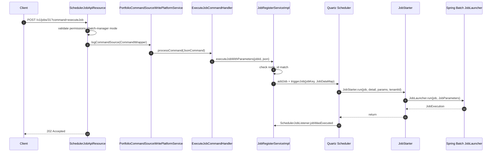

# Scheduler Job API (`/v1/jobs`)

This page documents the **per-job** REST surface in **Apache Fineract**. While [`/jobs/scheduler-api`](/jobs/scheduler-api) toggles the whole scheduler on or off, `SchedulerJobApiResource` lets you list every `ScheduledJobDetail`, look one up by id or `short_name`, change its cron or active flag, fire it manually, and walk its `ScheduledJobRunHistory`.

Source: `org.apache.fineract.infrastructure.jobs.api.SchedulerJobApiResource` (`fineract-provider`).

## Endpoint map

| Method | Path | Description |
| --- | --- | --- |
| `GET`  | `/v1/jobs` | List every job (current node + node `0`). |
| `GET`  | `/v1/jobs/{jobId}` | Job detail by numeric id. |
| `GET`  | `/v1/jobs/short-name/{shortName}` | Job detail by `short_name` (e.g. `SA_PINT`). |
| `GET`  | `/v1/jobs/{jobId}/runhistory` | Paged run history. |
| `GET`  | `/v1/jobs/short-name/{shortName}/runhistory` | Paged run history by short name. |
| `PUT`  | `/v1/jobs/{jobId}` | Update `displayName`, `cronExpression`, or `active`. |
| `PUT`  | `/v1/jobs/short-name/{shortName}` | Same, by short name. |
| `POST` | `/v1/jobs/{jobId}?command=executeJob` | Manually run the job. |
| `POST` | `/v1/jobs/short-name/{shortName}?command=executeJob` | Same, by short name. |

The class is annotated:

```java
@Path("/v1/jobs")
@Consumes({ MediaType.APPLICATION_JSON })
@Produces({ MediaType.APPLICATION_JSON })
@Component
@RequiredArgsConstructor
@Tag(name = "SCHEDULER JOB", description = "Batch jobs ... ")
public class SchedulerJobApiResource { ... }
```

## Permissions

```java
this.context.authenticatedUser().validateHasReadPermission(SCHEDULER_RESOURCE_NAME);
// SCHEDULER_RESOURCE_NAME = "SCHEDULER"
```

| Verb | Required permission |
| --- | --- |
| `GET` (any path) | `READ_SCHEDULER` |
| `POST executeJob` | `ALL_FUNCTIONS` or `EXECUTEJOB_SCHEDULER` |
| `PUT` | Goes through maker-checker (`UpdateJobDetailCommandhandler`, entity `"SCHEDULER"`, action `"UPDATE"`). Permission name therefore depends on your role configuration but typically `UPDATE_SCHEDULER`. |

Additionally, `executeJob` short-circuits with `405 Method Not Allowed` when `fineract.mode.batch-manager-enabled` is `false`:

```java
if (fineractProperties.getMode().isBatchManagerEnabled()) {
    // … permission check, then dispatch …
} else {
    ApiGlobalErrorResponse errorResponse = ApiGlobalErrorResponse.invalidInstanceTypeMethod("Batch");
    response = Response.status(Status.METHOD_NOT_ALLOWED).entity(errorResponse).build();
}
```

That makes API-only replicas safe from accidental manual triggers — only batch-manager nodes will accept them.

## `GET /v1/jobs`

```java
@GET
public String retrieveAll(@Context final UriInfo uriInfo) {
    this.context.authenticatedUser().validateHasReadPermission(SCHEDULER_RESOURCE_NAME);
    final List<JobDetailData> jobDetailDatas = this.schedulerJobRunnerReadService.findAllJobDetails();
    final ApiRequestJsonSerializationSettings settings =
            this.apiRequestParameterHelper.process(uriInfo.getQueryParameters());
    return this.toApiJsonSerializer.serialize(settings, jobDetailDatas, JOB_DETAIL_RESPONSE_DATA_PARAMETERS);
}
```

`SchedulerJobRunnerReadServiceImpl.findAllJobDetails` joins `job` and `job_run_history` (latest version per job) and projects them into `JobDetailData`. Only rows owned by the current node id — or by node `0` — are returned. The response is **not paged** at this level.

### Response body

Each `JobDetailData` follows this shape (defined in `fineract-core`):

```json
[
  {
    "jobId": 31,
    "displayName": "Loan COB",
    "shortName": "LCOB",
    "nextRunTime": "2025-04-21T00:00:00.000+00:00",
    "initializingError": null,
    "cronExpression": "0 0 0 * * ?",
    "active": true,
    "currentlyRunning": false,
    "lastRunHistory": {
      "version": 137,
      "jobRunStartTime": "2025-04-20T00:00:00.000+00:00",
      "jobRunEndTime":   "2025-04-20T00:01:42.000+00:00",
      "status":          "success",
      "jobRunErrorMessage": null,
      "triggerType":   "cron",
      "jobRunErrorLog": null
    }
  }
]
```

The field allowlist `JOB_DETAIL_RESPONSE_DATA_PARAMETERS` is:

```java
static final Set<String> JOB_DETAIL_RESPONSE_DATA_PARAMETERS = new HashSet<>(Arrays.asList(
    "jobId", "displayName", "nextRunTime", "initializingError",
    "cronExpression", "active", "currentlyRunning", "lastRunHistory"
));
```

`shortName` and `jobRunErrorLog` are deliberately not in the allowlist — you have to omit `fields=` to see them, in which case the full payload is returned. The `lastRunHistory` sub-object is hydrated only when the job has executed at least once.

## `GET /v1/jobs/{jobId}` and short-name lookup

```java
@GET
@Path("{" + SchedulerJobApiConstants.JOB_ID + "}")
public String retrieveOne(@PathParam(SchedulerJobApiConstants.JOB_ID) final Long jobId,
                          @Context final UriInfo uriInfo) {
    return retrieveOne(IdTypeResolver.resolveDefault(), Objects.toString(jobId, null), uriInfo);
}

@GET
@Path(SHORT_NAME_PARAM + "/{shortName}")
public String retrieveByShortName(@PathParam("shortName") final String shortName,
                                  @Context final UriInfo uriInfo) {
    return retrieveOne(IdTypeResolver.resolve(SHORT_NAME_PARAM), shortName, uriInfo);
}
```

The `IdTypeResolver` abstraction means the underlying read service handles both lookup modes uniformly:

```java
private String retrieveOne(@NotNull IdTypeResolver.IdType idType, String identifier, UriInfo uriInfo) {
    context.authenticatedUser().validateHasReadPermission(SCHEDULER_RESOURCE_NAME);
    final JobDetailData jobDetailData = schedulerJobRunnerReadService.retrieveOne(idType, identifier);
    final ApiRequestJsonSerializationSettings settings =
            apiRequestParameterHelper.process(uriInfo.getQueryParameters());
    return toApiJsonSerializer.serialize(settings, jobDetailData, JOB_DETAIL_RESPONSE_DATA_PARAMETERS);
}
```

Short-name lookup is convenient when scripts want a stable identifier across environments; the numeric id can differ between tenants. The `short_name` column has a unique constraint:

```java
@Table(name = "job", uniqueConstraints = {
        @UniqueConstraint(columnNames = { "short_name" }, name = "job_short_name_key") })
```

so it doubles as a primary lookup key for tooling.

## `GET /v1/jobs/{jobId}/runhistory`

```java
@GET
@Path("{" + JOB_ID + "}/" + JOB_RUN_HISTORY)
public String retrieveHistory(@Context final UriInfo uriInfo,
                              @PathParam(JOB_ID) final Long jobId,
                              @QueryParam("offset") final Integer offset,
                              @QueryParam("limit") final Integer limit,
                              @QueryParam("orderBy") final String orderBy,
                              @QueryParam("sortOrder") final String sortOrder) {
    return retrieveHistory(IdTypeResolver.resolveDefault(),
            Objects.toString(jobId, null), offset, limit, orderBy, sortOrder, uriInfo);
}
```

The shared implementation pages, validates the SQL-sortable columns, and serialises a `Page<JobDetailHistoryData>`:

```java
private String retrieveHistory(@NotNull IdTypeResolver.IdType idType, String identifier,
        Integer offset, Integer limit, String orderBy, String sortOrder, UriInfo uriInfo) {
    context.authenticatedUser().validateHasReadPermission(SCHEDULER_RESOURCE_NAME);
    sqlValidator.validate(orderBy);
    sqlValidator.validate(sortOrder);
    final SearchParameters searchParameters = SearchParameters.builder()
            .limit(limit).offset(offset).orderBy(orderBy).sortOrder(sortOrder).build();
    final Page<JobDetailHistoryData> jobHistoryData =
            schedulerJobRunnerReadService.retrieveJobHistory(idType, identifier, searchParameters);
    final ApiRequestJsonSerializationSettings settings =
            apiRequestParameterHelper.process(uriInfo.getQueryParameters());
    return jobHistoryToApiJsonSerializer.serialize(settings, jobHistoryData, JOB_HISTORY_RESPONSE_DATA_PARAMETERS);
}
```

Whitelisted fields:

```java
static final Set<String> JOB_HISTORY_RESPONSE_DATA_PARAMETERS = new HashSet<>(Arrays.asList(
    "version", "jobRunStartTime", "jobRunEndTime", "status",
    "jobRunErrorMessage", "triggerType", "jobRunErrorLog"
));
```

`status` is the string `"success"` or `"failed"` set by `SchedulerJobListener` (see [`/jobs/scheduler-and-quartz`](/jobs/scheduler-and-quartz)). `triggerType` is `"cron"` or `"application"`.

### Example

```bash
curl -u admin:password \
     -H 'Fineract-Platform-TenantId: default' \
     'http://localhost:8080/fineract-provider/api/v1/jobs/31/runhistory?offset=0&limit=5&orderBy=version&sortOrder=desc'
```

```json
{
  "totalFilteredRecords": 137,
  "pageItems": [
    {
      "version": 137,
      "jobRunStartTime": "2025-04-20T00:00:00.000+00:00",
      "jobRunEndTime":   "2025-04-20T00:01:42.000+00:00",
      "status":          "success",
      "triggerType":     "cron"
    },
    {
      "version": 136,
      "jobRunStartTime": "2025-04-19T00:00:00.000+00:00",
      "jobRunEndTime":   "2025-04-19T00:01:38.000+00:00",
      "status":          "failed",
      "jobRunErrorMessage": "java.sql.SQLTransientConnectionException: ...",
      "triggerType":   "cron"
    }
  ]
}
```

## `PUT /v1/jobs/{jobId}` — update

```java
@PUT
@Path("{" + JOB_ID + "}")
public String updateJobDetail(@PathParam(JOB_ID) final Long jobId, final String jsonRequestBody) {
    return updateJobDetail(IdTypeResolver.resolveDefault(), Objects.toString(jobId, null), jsonRequestBody);
}

private String updateJobDetail(@NotNull IdTypeResolver.IdType idType, String identifier, String jsonRequestBody) {
    Long jobId = schedulerJobRunnerReadService.retrieveId(idType, identifier);
    final CommandWrapper commandRequest = new CommandWrapperBuilder()
            .updateJobDetail(jobId)
            .withJson(jsonRequestBody)
            .build();
    final CommandProcessingResult result = this.commandsSourceWritePlatformService.logCommandSource(commandRequest);
    if (result.getChanges() != null && (result.getChanges().containsKey(SchedulerJobApiConstants.jobActiveStatusParamName)
            || result.getChanges().containsKey(SchedulerJobApiConstants.cronExpressionParamName))) {
        this.jobRegisterService.rescheduleJob(jobId);
    }
    return this.toApiJsonSerializer.serialize(result);
}
```

### Request body

```json
{
  "displayName":    "Loan COB",
  "cronExpression": "0 0 1 * * ?",
  "active":         true
}
```

All three keys are optional; only fields present in the JSON are diffed against the current row. The diff logic lives on the entity:

```java
public Map<String, Object> update(final JsonCommand command) {
    final Map<String, Object> actualChanges = new LinkedHashMap<>(9);
    if (command.isChangeInStringParameterNamed(displayNameParamName, this.jobDisplayName)) { ... }
    if (command.isChangeInStringParameterNamed(cronExpressionParamName, this.cronExpression)) { ... }
    if (command.isChangeInBooleanParameterNamed(jobActiveStatusParamName, this.activeSchedular)) { ... }
    return actualChanges;
}
```

### Maker-checker

The route does **not** call the service directly — it builds a `CommandWrapper` and submits it to `PortfolioCommandSourceWritePlatformService.logCommandSource`. The handler is:

```java
@Service
@CommandType(entity = "SCHEDULER", action = "UPDATE")
public class UpdateJobDetailCommandhandler implements NewCommandSourceHandler {
    @Override
    public CommandProcessingResult processCommand(final JsonCommand command) {
        return this.schedularWritePlatformService.updateJobDetail(command.entityId(), command);
    }
}
```

This is what makes the update flow through the standard maker-checker pipeline — your tenant can require a second user to approve a cron change before it goes live.

### Quartz reschedule

After the command is applied, the resource inspects `CommandProcessingResult.changes`. If either `active` or `cronExpression` changed, it calls `JobRegisterService.rescheduleJob(jobId)`. That method:

1. Deletes the old `JobDetail` from the per-tenant Quartz scheduler.
2. Calls `scheduleJob(detail)` to install the new trigger.
3. Persists `nextRunTime`.

If the cron expression is invalid, the catch block writes the stack trace into `initializing_errorlog`:

```java
} catch (final Exception throwable) {
    final String stackTrace = getStackTraceAsString(throwable);
    scheduledJobDetail.setErrorLog(stackTrace);
    this.schedularWritePlatformService.saveOrUpdate(scheduledJobDetail);
}
```

So the API responds with success (the DB row was updated) but the next `GET` will surface `initializingError` to the operator.

### Node-id mismatch

```java
public void rescheduleJob(final Long jobId) {
    final ScheduledJobDetail scheduledJobDetail = this.schedularWritePlatformService.findByJobId(jobId);
    final String nodeIdStored = scheduledJobDetail.getNodeId().toString();
    if (nodeIdStored.equals(fineractProperties.getNodeId()) || nodeIdStored.equals("0")) {
        rescheduleJob(scheduledJobDetail);
    } else {
        scheduledJobDetail.setMismatchedJob(true);
        this.schedularWritePlatformService.saveOrUpdate(scheduledJobDetail);
        throw new JobNodeIdMismatchingException(nodeIdStored, fineractProperties.getNodeId());
    }
}
```

A PUT that hits the wrong cluster node will:

- Apply the DB change anyway (the command pipeline ran first).
- Flag the row `is_mismatched_job = true`.
- Throw `JobNodeIdMismatchingException` — surfaced as a 4xx by `JobNodeIdMismatchingExceptionMapper`.

The owning node will reschedule it on the next `EXECUTE_DIRTY_JOBS` run. See [`/jobs/dirty-jobs`](/jobs/dirty-jobs).

## `POST /v1/jobs/{jobId}?command=executeJob` — manual fire

```java
@POST
@Path("{" + JOB_ID + "}")
public Response executeJob(@PathParam(JOB_ID) final Long jobId,
                           @QueryParam(SchedulerJobApiConstants.COMMAND) final String commandParam,
                           final String jsonRequestBody) {
    return executeJob(IdTypeResolver.resolveDefault(), Objects.toString(jobId, null), commandParam, jsonRequestBody);
}
```

The shared body:

```java
private Response executeJob(@NotNull IdTypeResolver.IdType idType, String identifier,
        String commandParam, String jsonRequestBody) {
    Response response;
    if (fineractProperties.getMode().isBatchManagerEnabled()) {
        final boolean hasNotPermission = context.authenticatedUser()
                .hasNotPermissionForAnyOf("ALL_FUNCTIONS", "EXECUTEJOB_SCHEDULER");
        if (hasNotPermission) {
            throw new NoAuthorizationException("User has no authority to execute scheduler jobs");
        }
        response = Response.status(400).build();
        if (is(commandParam, SchedulerJobApiConstants.COMMAND_EXECUTE_JOB)) {
            Long jobId = schedulerJobRunnerReadService.retrieveId(idType, identifier);
            final CommandWrapper commandRequest = new CommandWrapperBuilder()
                    .executeSchedulerJob(jobId)
                    .withJson(jsonRequestBody)
                    .build();
            commandsSourceWritePlatformService.logCommandSource(commandRequest);
            response = Response.status(202).build();
        } else {
            throw new UnrecognizedQueryParamException(SchedulerJobApiConstants.COMMAND, commandParam);
        }
    } else {
        ApiGlobalErrorResponse errorResponse = ApiGlobalErrorResponse.invalidInstanceTypeMethod("Batch");
        response = Response.status(Status.METHOD_NOT_ALLOWED).entity(errorResponse).build();
    }
    return response;
}
```

The handler:

```java
@Service
@CommandType(entity = "SCHEDULER", action = "EXECUTEJOB")
public class ExecuteJobCommandHandler implements NewCommandSourceHandler {
    private final JobRegisterService jobRegisterService;

    @Override
    public CommandProcessingResult processCommand(final JsonCommand command) {
        final Long jobId = command.entityId();
        jobRegisterService.executeJobWithParameters(jobId, command.json());
        return new CommandProcessingResultBuilder()
                .withCommandId(command.commandId())
                .withEntityId(jobId)
                .build();
    }
}
```

`JobRegisterService.executeJobWithParameters`:

```java
@Override
public void executeJobWithParameters(final Long jobId, String jobParametersJson) {
    Set<JobParameterDTO> jobParameterDTOSet = dataParser.parseExecution(jobParametersJson);
    final ScheduledJobDetail scheduledJobDetail = this.schedularWritePlatformService.findByJobId(jobId);
    if (scheduledJobDetail == null) { throw new JobNotFoundException(String.valueOf(jobId)); }
    final String nodeIdStored = scheduledJobDetail.getNodeId().toString();
    if (nodeIdStored.equals(fineractProperties.getNodeId()) || nodeIdStored.equals("0")) {
        executeJob(scheduledJobDetail, null, jobParameterDTOSet);
    } else {
        scheduledJobDetail.setMismatchedJob(true);
        this.schedularWritePlatformService.saveOrUpdate(scheduledJobDetail);
        throw new JobNodeIdMismatchingException(nodeIdStored, fineractProperties.getNodeId());
    }
}
```

`triggerType` is set to `TRIGGER_TYPE_APPLICATION` inside `executeJob` so the run-history row records `triggerType: "application"`.

### Optional `JobParameterDTO` payload

`JobParameterDataParser` reads the request body as a set of name/value pairs. Most jobs ignore these. Currently only the LOAN_COB family has a `JobParameterProvider`:

```java
// LoanCOBJobParameterProvider in service.jobparameterprovider
public boolean canProvideParametersForJob(String jobName) {
    return JobName.LOAN_COB.name().equals(jobName);
}
```

So `POST /v1/jobs/31?command=executeJob` with body `{"date":"2025-04-20"}` is valid for `LOAN_COB`; for other jobs the body is parsed but ignored.

### Examples

Fire by id:

```bash
curl -u admin:password -X POST \
     -H 'Fineract-Platform-TenantId: default' \
     'http://localhost:8080/fineract-provider/api/v1/jobs/31?command=executeJob'
# HTTP/1.1 202 Accepted
```

Fire by short name:

```bash
curl -u admin:password -X POST \
     -H 'Fineract-Platform-TenantId: default' \
     'http://localhost:8080/fineract-provider/api/v1/jobs/short-name/SA_PINT?command=executeJob'
```

## End-to-end execute flow



## Behaviour summary

| Aspect | Behaviour |
| --- | --- |
| `executeJob` and `update` are async wrt response | The HTTP response (`202`) returns once the command is logged. The Spring Batch run continues on a background thread. |
| Run history visible | A new `ScheduledJobRunHistory` row is created after the run completes — poll `GET /v1/jobs/{id}/runhistory`. |
| Suspended scheduler | A `POST executeJob` is **still** vetoed by `SchedulerVetoer` if `SchedulerDetail.isSuspended = true`. Manual runs are not a backdoor around pause. |
| Cron edits and active flag | Trigger reschedule via `JobRegisterService.rescheduleJob`. Other fields (e.g. `displayName`) do not reschedule. |
| Idempotency | None — every POST queues a fresh execution. |
| Mutex per-job | `setConcurrent(false)` on the `JobDetail` prevents overlap of the same Quartz job; multi-node concurrency is not blocked at the Quartz layer — rely on row-level locks inside the tasklet. |

## Related pages

- [`/jobs/scheduler-and-quartz`](/jobs/scheduler-and-quartz) — what `rescheduleJob` and the listeners actually do.
- [`/jobs/scheduler-api`](/jobs/scheduler-api) — global pause/resume.
- [`/jobs/inline-job-api`](/jobs/inline-job-api) — synchronous inline COB execution for LOAN_COB / WC_LOAN_COB.
- [`/jobs/job-registry-and-stuck-jobs`](/jobs/job-registry-and-stuck-jobs) — recovery after a process crash.
- [`/jobs/job-names-enumeration`](/jobs/job-names-enumeration) — find the right `jobId` / `shortName` for the job you want to fire.
- [`/api/jobs-and-cob-apis`](/api/jobs-and-cob-apis) — REST catalogue.
