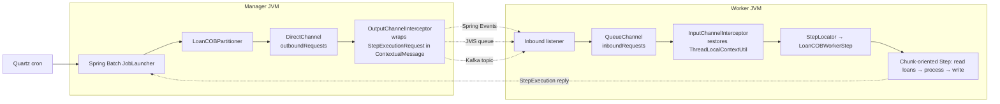
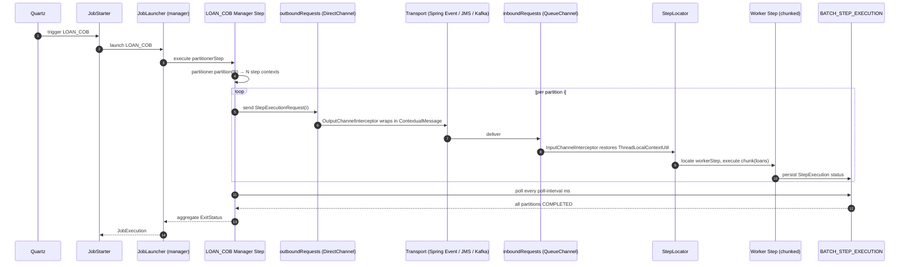

# Spring Batch Manager / Worker Model

**Apache Fineract** scales its heaviest jobs — Loan COB, Working Capital Loan COB, the external events publisher — by partitioning Spring Batch steps across multiple workers. A single *manager* JVM partitions the input (e.g. loan IDs), publishes `StepExecutionRequest`s to a transport (Spring application events, JMS, or Kafka), and waits for the *workers* to drain their slice. The wiring lives in two main places:

- `org.apache.fineract.infrastructure.springbatch` (`fineract-provider`) — the generic `ManagerConfig`, `WorkerConfig`, channel interceptors, and the `PropertyService` that reads `fineract.partitioned-job.*`.
- `org.apache.fineract.infrastructure.springbatch.messagehandler.{jms,kafka,spring}` — three pluggable transports between the outbound `DirectChannel` and the inbound `QueueChannel`.

`PropertyService` is consumed by every job that needs to know its chunk size, partition size, retry limit, thread pool dimensions, or partition poll interval. Today only `LOAN_COB` is registered in the `PartitionedJob` enum used by the stuck‑jobs recovery path — see [`/jobs/job-registry-and-stuck-jobs`](/jobs/job-registry-and-stuck-jobs).

If you have not yet skimmed the top‑level map, read [`/jobs/overview`](/jobs/overview) and [`/core/spring-batch-infra`](/core/spring-batch-infra) first.

## The split

Fineract launches every JVM in one of three modes, controlled by two boolean properties:

| Property | Default | Effect |
| --- | --- | --- |
| `fineract.mode.batch-manager-enabled` | `true` | Loads `ManagerConfig` (`outboundRequests` DirectChannel) plus `StuckJobListener` |
| `fineract.mode.batch-worker-enabled` | `false` | Loads `WorkerConfig` (`inboundRequests` QueueChannel) plus `MessageHandlerConfig` (StepLocator) |

Both can be on at once (the default single‑JVM dev setup), or split across pods in a Kubernetes deployment. `FineractModeValidationCondition` (in `fineract-core`) enforces that at least one mode is on.



## `ManagerConfig` and `WorkerConfig`

The two generic configs are extremely small — they exist to declare the channels:

```java
@Configuration
@EnableBatchIntegration
@ConditionalOnProperty(value = "fineract.mode.batch-manager-enabled", havingValue = "true")
public class ManagerConfig {

    @Bean
    public DirectChannel outboundRequests() {
        return new DirectChannel();
    }

    @Bean
    public OutputChannelInterceptor outputInterceptor() {
        return new OutputChannelInterceptor();
    }
}

@Configuration
@ConditionalOnProperty(value = "fineract.mode.batch-worker-enabled", havingValue = "true")
public class WorkerConfig {

    @Bean
    public QueueChannel inboundRequests() {
        return new QueueChannel();
    }

    @Bean
    public InputChannelInterceptor inputInterceptor() {
        return new InputChannelInterceptor();
    }
}
```

- `outboundRequests` is what `LoanCOBManagerConfiguration` injects to build its `RemotePartitioningManagerStep`.
- `inboundRequests` is what the worker‑side step uses to receive partitions.
- `OutputChannelInterceptor` and `InputChannelInterceptor` are the *only* place tenant context is preserved across the transport boundary.

## Context propagation — `ContextualMessage`

A `StepExecutionRequest` carries Spring Batch identifiers but no tenant. To keep the worker running under the correct `FineractPlatformTenant` and `BusinessDate`, the outbound interceptor wraps the request in a `ContextualMessage`:

```java
public class OutputChannelInterceptor extends StepExecutionInterceptor {
    @Override
    public Message<?> preSend(Message<?> message, MessageChannel channel) {
        StepExecutionRequest stepExecutionRequest = (StepExecutionRequest) message.getPayload();
        ContextualMessage contextualMessage = new ContextualMessage();
        contextualMessage.setStepExecutionRequest(stepExecutionRequest);
        contextualMessage.setContext(ThreadLocalContextUtil.getContext());
        return new GenericMessage<>(contextualMessage);
    }
}
```

And the inbound interceptor restores it on the worker thread:

```java
public class InputChannelInterceptor implements ExecutorChannelInterceptor {

    @Override
    public Message<StepExecutionRequest> beforeHandle(Message<?> message, MessageChannel channel, MessageHandler handler) {
        return beforeHandleMessage(message);
    }

    public StepExecutionRequest beforeHandleMessage(ContextualMessage contextualMessage) {
        log.debug("Initializing ThreadLocal context for message handling: {}", contextualMessage);
        ThreadLocalContextUtil.init(contextualMessage.getContext());
        ThreadLocalContextUtil.setActionContext(ActionContext.COB);
        return contextualMessage.getStepExecutionRequest();
    }

    @Override
    public void afterMessageHandled(Message<?> message, MessageChannel channel, MessageHandler handler, Exception ex) {
        ThreadLocalContextUtil.reset();
    }
}
```

This is what lets a worker pod execute a chunk that says "process loans 401–500 for tenant `acme` at business date `2025‑01‑02`" — the request carries the IDs and the context wrapper carries `tenant + businessDate + actionContext`. Note the worker explicitly sets `ActionContext.COB`, which is how Fineract's audit and event publishing layers know they are running under the close‑of‑business job rather than an interactive API call.

## Three transports, one channel pair

The choice of transport between `outboundRequests` and `inboundRequests` is controlled by a property block under `fineract.remote-job-message-handler.*` and selected by `@Conditional` classes:

| Transport | Manager class | Worker class | Condition |
| --- | --- | --- | --- |
| Spring `ApplicationEvent` (in‑JVM) | `SpringEventManagerConfig` | `SpringEventWorkerConfig` | `SpringEventManagerCondition` / `SpringEventWorkerCondition` |
| JMS (ActiveMQ by default) | `JmsManagerConfig` | `JmsWorkerConfig` | `JmsManagerCondition` / `JmsWorkerCondition` |
| Kafka | `KafkaManagerConfig` | `KafkaWorkerConfig` | `KafkaManagerCondition` / `KafkaWorkerCondition` |

Only one transport should be enabled at a time. The conditions also gate on `fineract.mode.batch-manager-enabled` / `batch-worker-enabled` so a JMS worker config only loads when both `kafka.enabled=false`, `spring-events.enabled=false`, `jms.enabled=true`, and `batch-worker-enabled=true`.

### Spring events (default)

```java
@Configuration
@EnableBatchIntegration
@Conditional(SpringEventManagerCondition.class)
public class SpringEventManagerConfig {

    @Bean
    public IntegrationFlow outboundFlow() {
        ApplicationEventPublishingMessageHandler handler = new ApplicationEventPublishingMessageHandler();
        return IntegrationFlow.from(outboundRequests)
                .intercept(outputInterceptor)
                .log(LoggingHandler.Level.DEBUG)
                .handle(handler)
                .get();
    }
}
```

The worker side listens for `MessagingEvent`:

```java
@Bean
public ApplicationEventListeningMessageProducer eventListener() {
    ApplicationEventListeningMessageProducer producer = new ApplicationEventListeningMessageProducer();
    producer.setEventTypes(MessagingEvent.class);
    return producer;
}
```

This transport is in‑JVM only — useful for a single‑pod dev environment where you still want the partitioner/worker semantics but don't want to stand up a broker.

### JMS

The JMS manager publishes to a queue:

```java
@Bean
public IntegrationFlow outboundFlow(ConnectionFactory connectionFactory) {
    return IntegrationFlow.from(outboundRequests)
            .intercept(outputInterceptor)
            .log(LoggingHandler.Level.DEBUG)
            .handle(Jms.outboundAdapter(connectionFactory)
                    .destination(fineractProperties.getRemoteJobMessageHandler().getJms().getRequestQueueName()))
            .get();
}
```

The JMS worker is a `DefaultJmsListenerContainerFactory` with `concurrency=1-1` and `CLIENT_ACKNOWLEDGE`:

```java
factory.setConcurrency("1-1"); // at least one consumer and at most one consumer
factory.setConnectionFactory(connectionFactory);
factory.setPubSubDomain(false);
factory.setSessionTransacted(false);
factory.setSessionAcknowledgeMode(Session.CLIENT_ACKNOWLEDGE);
```

Single‑consumer concurrency is deliberate — Spring Batch's `StepExecutionRequestHandler` already serializes work within a worker, so multiple consumers would just produce contention.

### Kafka

The Kafka transport is similar in shape but uses a topic. Properties are extensive (broker list, replicas, partitions, consumer group, plus opaque "extra" properties via a custom key/value/separator format):

```
fineract.remote-job-message-handler.kafka.enabled=...
fineract.remote-job-message-handler.kafka.topic.name=job-topic
fineract.remote-job-message-handler.kafka.topic.partitions=10
fineract.remote-job-message-handler.kafka.bootstrap-servers=localhost:9092
fineract.remote-job-message-handler.kafka.consumer.group-id=fineract-consumer-group-id
fineract.remote-job-message-handler.kafka.consumer.extra-properties=key1=value1|key2=value2
```

The "extra properties" syntax — `key=value` pairs separated by `|`, with both separators tunable — is how operators inject SASL/SSL settings without ballooning the schema. The Kafka manager/worker configs delegate to the same `outboundRequests`/`inboundRequests` channels and the same interceptors.

## `PartitionedJobProperty` and the `fineract.partitioned-job` block

The shape registered into `FineractProperties`:

```properties
fineract.partitioned-job.partitioned-job-properties[0].job-name=LOAN_COB
fineract.partitioned-job.partitioned-job-properties[0].chunk-size=${LOAN_COB_CHUNK_SIZE:100}
fineract.partitioned-job.partitioned-job-properties[0].partition-size=${LOAN_COB_PARTITION_SIZE:100}
fineract.partitioned-job.partitioned-job-properties[0].thread-pool-core-pool-size=${LOAN_COB_THREAD_POOL_CORE_POOL_SIZE:5}
fineract.partitioned-job.partitioned-job-properties[0].thread-pool-max-pool-size=${LOAN_COB_THREAD_POOL_MAX_POOL_SIZE:5}
fineract.partitioned-job.partitioned-job-properties[0].thread-pool-queue-capacity=${LOAN_COB_THREAD_POOL_QUEUE_CAPACITY:20}
fineract.partitioned-job.partitioned-job-properties[0].retry-limit=${LOAN_COB_RETRY_LIMIT:5}
fineract.partitioned-job.partitioned-job-properties[0].poll-interval=${LOAN_COB_POLL_INTERVAL:500}
```

The shape is a Spring `List<PartitionedJobProperty>`, so you can register a second job by adding `partitioned-job-properties[1].*` rows.

| Property | Meaning | Read by |
| --- | --- | --- |
| `job-name` | Lookup key — must match `JobName.<X>.name()` | `PropertyServiceImpl.getProperty` |
| `chunk-size` | Spring Batch chunk size for the worker step | `StepBuilder.<I, O>chunk(chunkSize, txManager)` |
| `partition-size` | Number of partitions the partitioner produces | `LoanCOBPartitioner.partition(gridSize=partition-size)` |
| `thread-pool-core-pool-size` / `max-pool-size` / `queue-capacity` | Sized for the worker thread pool | `ThreadPoolTaskExecutor` per worker step |
| `retry-limit` | Maximum retries before the step gives up | `StepBuilder.faultTolerant().retryLimit(...)` |
| `poll-interval` | How often the manager step polls partition status | `RemotePartitioningManagerStepBuilder.pollInterval(...)` |

`PropertyServiceImpl` is a single small lookup:

```java
private Integer getProperty(String jobName, Function<? super FineractProperties.PartitionedJobProperty, Integer> function) {
    List<FineractProperties.PartitionedJobProperty> jobProperties = fineractProperties.getPartitionedJob()
            .getPartitionedJobProperties();
    return jobProperties.stream()
            .filter(jobProperty -> jobName.equals(jobProperty.getJobName()))
            .findFirst()
            .map(function)
            .orElse(1);
}
```

`orElse(1)` means an unconfigured job gets a degenerate single‑partition single‑chunk run — sensible but slow. Always seed the `[i]` block when you add a new partitioned job.

## `LOAN_COB` manager

`LoanCOBManagerConfiguration` is the canonical example. The interesting fragment:

```java
@Bean
@StepScope
public LoanCOBPartitioner partitioner(@Value("#{stepExecution}") StepExecution stepExecution) {
    return new LoanCOBPartitioner(propertyService, cobBusinessStepService, retrieveIdService, jobOperator, stepExecution,
            LoanCOBConstant.NUMBER_OF_DAYS_BEHIND);
}

@Bean("loanCOBStep")
public Step loanCOBStep(LoanCOBPartitioner partitioner) {
    return stepBuilderFactory.get(LoanCOBConstant.LOAN_COB_PARTITIONER_STEP)
            .partitioner(LoanCOBConstant.LOAN_COB_WORKER_STEP, partitioner)
            .pollInterval(propertyService.getPollInterval(JOB_NAME))
            .outputChannel(outboundRequests)
            .build();
}
```

Three threads are at work conceptually:

1. The **partitioner** asks `RetrieveLoanIdService` for the set of loan IDs that need a COB run today, then slices them into `partition-size` chunks of grid step contexts.
2. The **manager step** writes those step contexts to `outboundRequests` and polls the Spring Batch `JobRepository` every `poll-interval` ms to count partitions that have finished.
3. When all partitions are terminal, the manager step concludes; its status reflects the worst child status (a `FAILED` partition becomes a `FAILED` manager).

The `WORKING_CAPITAL_LOAN_COB_JOB` follows an identical pattern in `WorkingCapitalLoanCOBManagerConfiguration` — same channels, same property service — but with a different partitioner and partitioner step name (`Working Capital Loan COB partition - Step`).

## `LOAN_COB` worker

`LoanCOBWorkerConfiguration` is conditional on `BatchWorkerCondition`. It binds the worker step to `inboundRequests`:

```java
return stepBuilderFactory.get(LoanCOBConstant.LOAN_COB_WORKER_STEP, partitionHandler)
        .inputChannel(inboundRequests)
        .<Loan, Loan>chunk(propertyService.getChunkSize(JobName.LOAN_COB.name()), transactionManager)
        .reader(loanItemReader())
        .processor(loanItemProcessor())
        .writer(noOpWriter)
        .faultTolerant()
        .retryLimit(propertyService.getRetryLimit(JobName.LOAN_COB.name()))
        .build();
```

Important details:

- `chunk-size` is read at *bean creation time*, so changing it requires a JVM restart.
- The writer is a no‑op — the processor mutates loans in place inside the transaction, and Spring Batch's `JobRepository` records progress.
- `faultTolerant()` + `retryLimit(...)` means a transient DB hiccup re‑runs the chunk before failing the partition.
- `MessageHandlerConfig` provides a `BeanFactoryStepLocator` so the worker can find the step bean by name when a `StepExecutionRequest` arrives.

## `SEND_ASYNCHRONOUS_EVENTS` — a different shape

`SEND_ASYNCHRONOUS_EVENTS` and `PURGE_EXTERNAL_EVENTS` use the **same** `fineract.events.external.*` property block as the external events publisher, but they are **single‑step tasklet** jobs rather than partitioned ones. They appear in the partitioning conversation only because they share the JMS / Kafka transport classes and read their broker config from the same `remote-job-message-handler` block when configured.

| Property family | Purpose | Used by |
| --- | --- | --- |
| `fineract.partitioned-job.partitioned-job-properties[i]` | Per‑partitioned‑job tuning | `LOAN_COB`, `WORKING_CAPITAL_LOAN_COB_JOB` |
| `fineract.remote-job-message-handler.{spring-events,jms,kafka}` | Transport for `StepExecutionRequest` between manager and worker | All partitioned jobs |
| `fineract.events.external.producer.{jms,kafka}` | Transport for *external events* (not partitions) | `SEND_ASYNCHRONOUS_EVENTS` |
| `fineract.events.external.partition-size` | Batch size when the events publisher reads pending events | `SendAsynchronousEventsTasklet` |
| `fineract.events.external.thread-pool-*` | Thread pool for the events publisher | `SEND_ASYNCHRONOUS_EVENTS` |

So `SEND_ASYNCHRONOUS_EVENTS` *can* run in either single‑pod mode (Spring events) or with a dedicated JMS/Kafka producer; that's independent of whether you also run `LOAN_COB` in manager/worker split mode.

## Stuck recovery interlock

`StuckJobExecutorServiceImpl` (see [`/jobs/job-registry-and-stuck-jobs`](/jobs/job-registry-and-stuck-jobs)) treats partitioned jobs specially because the manager step can be `STARTED` while its workers are still draining:

```java
@Override
public void resumeStuckJob(String jobName) {
    List<Long> stuckJobIds = getStuckJobIds(jobName);
    if (isPartitionedJob(jobName) && areThereStuckJobs(jobName)) {
        restartPartitionedJobs(jobName, stuckJobIds);
    } else {
        restartTaskletJobs(stuckJobIds);
    }
}
```

The "is partitioned" question is answered by the small `PartitionedJob` enum, which today is single‑entry:

```java
public enum PartitionedJob {
    LOAN_COB(LoanCOBConstant.LOAN_COB_PARTITIONER_STEP);
    ...
}
```

`WORKING_CAPITAL_LOAN_COB_JOB` is *not* registered there — at the time of writing it would be treated as a tasklet job by the recovery path, with `JobOperator.restart(id)` called directly. If you operate that job and want manager‑step special handling, extend the enum.

## How a partition flows end‑to‑end



## Operator‑facing knobs at a glance

```properties
# Mode toggles
fineract.mode.batch-manager-enabled=true
fineract.mode.batch-worker-enabled=false   # set true on dedicated worker pods

# Per-job tuning (LOAN_COB shown; copy for WORKING_CAPITAL_LOAN_COB_JOB / SEND_ASYNCHRONOUS_EVENTS as needed)
fineract.partitioned-job.partitioned-job-properties[0].job-name=LOAN_COB
fineract.partitioned-job.partitioned-job-properties[0].chunk-size=100
fineract.partitioned-job.partitioned-job-properties[0].partition-size=100
fineract.partitioned-job.partitioned-job-properties[0].thread-pool-core-pool-size=5
fineract.partitioned-job.partitioned-job-properties[0].thread-pool-max-pool-size=5
fineract.partitioned-job.partitioned-job-properties[0].thread-pool-queue-capacity=20
fineract.partitioned-job.partitioned-job-properties[0].retry-limit=5
fineract.partitioned-job.partitioned-job-properties[0].poll-interval=500

# Transport selection (one true)
fineract.remote-job-message-handler.spring-events.enabled=true
fineract.remote-job-message-handler.jms.enabled=false
fineract.remote-job-message-handler.kafka.enabled=false

# JMS specifics
fineract.remote-job-message-handler.jms.request-queue-name=JMS-request-queue
fineract.remote-job-message-handler.jms.broker-url=tcp://127.0.0.1:61616
fineract.remote-job-message-handler.jms.broker-username=
fineract.remote-job-message-handler.jms.broker-password=

# Kafka specifics
fineract.remote-job-message-handler.kafka.topic.name=job-topic
fineract.remote-job-message-handler.kafka.topic.partitions=10
fineract.remote-job-message-handler.kafka.bootstrap-servers=localhost:9092
fineract.remote-job-message-handler.kafka.consumer.group-id=fineract-consumer-group-id
```

## Common deployment shapes

| Shape | Configuration |
| --- | --- |
| Single JVM, dev | `batch-manager-enabled=true`, `batch-worker-enabled=true`, transport=`spring-events` |
| One manager + N workers, on‑prem | `batch-manager-enabled=true` on manager, `batch-worker-enabled=true` on workers, transport=`jms` (ActiveMQ Artemis); same `request-queue-name` on both sides |
| Cloud‑native, multi‑AZ | Same as above but transport=`kafka` with replicas≥3 and a stable consumer group id |
| HA without partition fan‑out | `batch-manager-enabled=true` on every pod, but only one tenant assigned per pod via `node_id` |

## Troubleshooting

| Symptom | Likely cause | Where to look |
| --- | --- | --- |
| Manager step polls forever, workers idle | Transport disabled on worker side, or queue name mismatch | `fineract.remote-job-message-handler.*` symmetry |
| Worker NPEs in tasklet because `ThreadLocalContextUtil.getTenant()` is null | `InputChannelInterceptor` not registered → `WorkerConfig` did not load | `fineract.mode.batch-worker-enabled` |
| Kafka consumer rebalancing storms | Multiple workers with the same `group-id` and a manager step that re‑fires before previous partitions are committed | Increase `poll-interval` and decrease partition count |
| `STARTED` LOAN_COB manager after crash but workers finished | Expected — recovery waits for partitions to terminate and then restarts the manager (see `StuckJobExecutorServiceImpl.handleStuckPartitionedJob`) | [`/jobs/job-registry-and-stuck-jobs`](/jobs/job-registry-and-stuck-jobs) |
| `PropertyService` returns `1` everywhere | `job-name` mismatch (case sensitive — must equal `JobName.<X>.name()`) | `fineract.partitioned-job.partitioned-job-properties[i].job-name` |

## See also

- [`/jobs/overview`](/jobs/overview)
- [`/jobs/scheduler-and-quartz`](/jobs/scheduler-and-quartz)
- [`/jobs/job-registry-and-stuck-jobs`](/jobs/job-registry-and-stuck-jobs) — recovery for the manager step
- [`/jobs/job-names-enumeration`](/jobs/job-names-enumeration) — `LOAN_COB`, `WORKING_CAPITAL_LOAN_COB_JOB`, `SEND_ASYNCHRONOUS_EVENTS` rows
- [`/jobs/aggregation-job`](/jobs/aggregation-job) — chunked but non‑partitioned, for contrast
- [`/cob/overview`](/cob/overview) — what the loan COB business steps actually do
- [`/core/spring-batch-infra`](/core/spring-batch-infra) — `PropertyService` and the `FineractProperties.PartitionedJobProperty` shape
