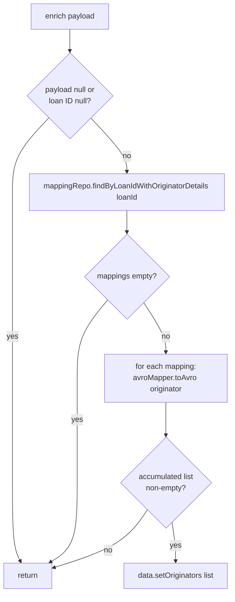
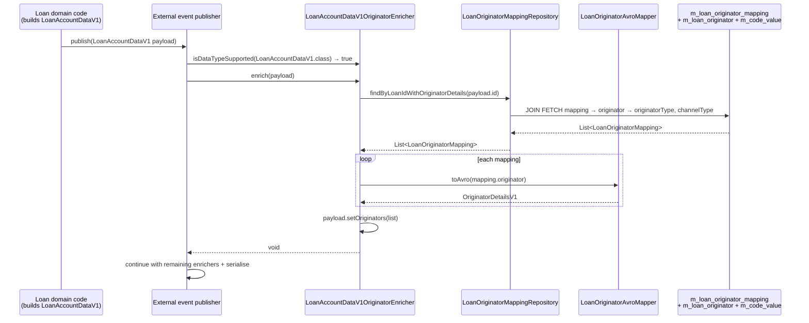

When Apache Fineract publishes external events, the payload — `LoanAccountDataV1`, `LoanChargeDataV1`, or `LoanTransactionDataV1` — is built from the core loan aggregate first, then walked through every Spring-managed `DataEnricher<T>` bean that supports the payload's class. The `fineract-loan-origination` module ships three such enrichers and a shared Avro mapper. Each enricher queries the originator mapping table for the loan ID inside the payload, converts every linked `LoanOriginator` into an `OriginatorDetailsV1` Avro record, and stamps the result on the payload's `originators` field. Without this module on the classpath, that field stays `null` on every event.

This page enumerates every enricher class, the Avro target it touches, the exact field it sets, the repository call it makes, and the shared mapper that produces the per-originator Avro structure.

## `DataEnricher<T>` contract

The framework interface lives in `fineract-core` at `org.apache.fineract.infrastructure.core.service.DataEnricher`:

```java
public interface DataEnricher<T> {
    boolean isDataTypeSupported(Class<T> dataType);
    void enrich(T data);
}
```

The event-publishing layer collects every Spring bean implementing this interface, filters them by `isDataTypeSupported(payload.getClass())`, and invokes `enrich(payload)` in turn. Implementations may decline to set a field (returning early on null IDs or empty lookup results) — silence is fine, exceptions are not.

All three originator enrichers carry:

```java
@Component
@RequiredArgsConstructor
@ConditionalOnProperty(value = "fineract.module.loan-origination.enabled", havingValue = "true")
```

so they auto-register only when the optional module is enabled.

## Enricher catalogue

| Enricher | File | Avro target | Field added | Loan-ID source |
| --- | --- | --- | --- | --- |
| `LoanAccountDataV1OriginatorEnricher` | `enricher/LoanAccountDataV1OriginatorEnricher.java` | `org.apache.fineract.avro.loan.v1.LoanAccountDataV1` | `originators: List<OriginatorDetailsV1>` | `data.getId()` |
| `LoanChargeDataV1OriginatorEnricher` | `enricher/LoanChargeDataV1OriginatorEnricher.java` | `org.apache.fineract.avro.loan.v1.LoanChargeDataV1` | `originators: List<OriginatorDetailsV1>` | `data.getLoanId()` |
| `LoanTransactionDataV1OriginatorEnricher` | `enricher/LoanTransactionDataV1OriginatorEnricher.java` | `org.apache.fineract.avro.loan.v1.LoanTransactionDataV1` | `originators: List<OriginatorDetailsV1>` | `data.getLoanId()` |
| `LoanOriginatorAvroMapper` | `enricher/LoanOriginatorAvroMapper.java` | — | helper that builds `OriginatorDetailsV1` from `LoanOriginator` | — |

## Shared algorithm

All three enrichers follow the same five-step routine — the only deltas are the Avro class they support and how they pull the loan ID:



The repository call is `LoanOriginatorMappingRepository.findByLoanIdWithOriginatorDetails(loanId)` — a single JOIN-FETCH query that loads the mappings, their `LoanOriginator`, and both code-value relations in one trip. This is critical: each event publication runs inside the producer's transaction, so a lazy initialization there could leak proxy-instance lifecycle issues into the messaging layer.

## `LoanAccountDataV1OriginatorEnricher`

```java
@Component
@RequiredArgsConstructor
@ConditionalOnProperty(value = "fineract.module.loan-origination.enabled", havingValue = "true")
public class LoanAccountDataV1OriginatorEnricher implements DataEnricher<LoanAccountDataV1> {

    private final LoanOriginatorMappingRepository loanOriginatorMappingRepository;
    private final LoanOriginatorAvroMapper loanOriginatorAvroMapper;

    @Override
    public boolean isDataTypeSupported(final Class<LoanAccountDataV1> dataType) {
        return dataType.isAssignableFrom(LoanAccountDataV1.class);
    }

    @Override
    public void enrich(final LoanAccountDataV1 data) {
        if (data == null || data.getId() == null) { return; }

        final List<LoanOriginatorMapping> mappings =
                loanOriginatorMappingRepository.findByLoanIdWithOriginatorDetails(data.getId());
        if (mappings == null || mappings.isEmpty()) { return; }

        final List<OriginatorDetailsV1> originators = new ArrayList<>();
        for (LoanOriginatorMapping mapping : mappings) {
            final LoanOriginator originator = mapping.getOriginator();
            if (originator != null) {
                final OriginatorDetailsV1 originatorDetails = loanOriginatorAvroMapper.toAvro(originator);
                if (originatorDetails != null) {
                    originators.add(originatorDetails);
                }
            }
        }

        if (!originators.isEmpty()) {
            data.setOriginators(originators);
        }
    }
}
```

| Detail | Value |
| --- | --- |
| **Avro payload class** | `LoanAccountDataV1` (account snapshot for loan lifecycle events: created, approved, disbursed, closed, …) |
| **Field set** | `originators` |
| **Loan-ID source** | `data.getId()` — the loan's internal ID is the primary identifier on this payload |
| **Repository call** | `findByLoanIdWithOriginatorDetails(data.getId())` |

The `isDataTypeSupported` check uses `Class.isAssignableFrom(LoanAccountDataV1.class)` — phrased that way so a subclass of `LoanAccountDataV1` (should one ever exist) would also be enriched.

## `LoanChargeDataV1OriginatorEnricher`

```java
@Component
@RequiredArgsConstructor
@ConditionalOnProperty(value = "fineract.module.loan-origination.enabled", havingValue = "true")
public class LoanChargeDataV1OriginatorEnricher implements DataEnricher<LoanChargeDataV1> {

    private final LoanOriginatorMappingRepository loanOriginatorMappingRepository;
    private final LoanOriginatorAvroMapper loanOriginatorAvroMapper;

    @Override
    public boolean isDataTypeSupported(final Class<LoanChargeDataV1> dataType) {
        return dataType.isAssignableFrom(LoanChargeDataV1.class);
    }

    @Override
    public void enrich(final LoanChargeDataV1 data) {
        if (data == null || data.getLoanId() == null) { return; }

        final List<LoanOriginatorMapping> mappings =
                loanOriginatorMappingRepository.findByLoanIdWithOriginatorDetails(data.getLoanId());
        // ... identical accumulation loop ...
        if (!originators.isEmpty()) { data.setOriginators(originators); }
    }
}
```

| Detail | Value |
| --- | --- |
| **Avro payload class** | `LoanChargeDataV1` (loan charge events: applied, waived, paid, adjusted) |
| **Field set** | `originators` |
| **Loan-ID source** | `data.getLoanId()` — the charge payload carries the parent loan ID separately from its own charge ID |
| **Repository call** | `findByLoanIdWithOriginatorDetails(data.getLoanId())` |

The semantic difference between this enricher and the previous one is purely the *getter* used. The mapping query, the loop body, and the `data.setOriginators(...)` step are byte-identical.

## `LoanTransactionDataV1OriginatorEnricher`

```java
@Component
@RequiredArgsConstructor
@ConditionalOnProperty(value = "fineract.module.loan-origination.enabled", havingValue = "true")
public class LoanTransactionDataV1OriginatorEnricher implements DataEnricher<LoanTransactionDataV1> {

    private final LoanOriginatorMappingRepository loanOriginatorMappingRepository;
    private final LoanOriginatorAvroMapper loanOriginatorAvroMapper;

    @Override
    public boolean isDataTypeSupported(final Class<LoanTransactionDataV1> dataType) {
        return dataType.isAssignableFrom(LoanTransactionDataV1.class);
    }

    @Override
    public void enrich(final LoanTransactionDataV1 data) {
        if (data == null || data.getLoanId() == null) { return; }
        // ... identical body ...
        if (!originators.isEmpty()) { data.setOriginators(originators); }
    }
}
```

| Detail | Value |
| --- | --- |
| **Avro payload class** | `LoanTransactionDataV1` (loan transaction events: repayment, disbursement, refund, write-off, …) |
| **Field set** | `originators` |
| **Loan-ID source** | `data.getLoanId()` |
| **Repository call** | `findByLoanIdWithOriginatorDetails(data.getLoanId())` |

## `LoanOriginatorAvroMapper`

This is not a `DataEnricher`; it is the shared converter the three enrichers delegate to.

```java
@Component
@ConditionalOnProperty(value = "fineract.module.loan-origination.enabled", havingValue = "true")
public class LoanOriginatorAvroMapper {

    public OriginatorDetailsV1 toAvro(final LoanOriginator originator) {
        if (originator == null) { return null; }

        final OriginatorDetailsV1.Builder builder = OriginatorDetailsV1.newBuilder();
        builder.setId(originator.getId());
        builder.setExternalId(originator.getExternalId() != null ? originator.getExternalId().getValue() : null);
        builder.setName(originator.getName());
        builder.setStatus(originator.getStatus() != null ? originator.getStatus().getValue() : null);
        builder.setOriginatorType(mapCodeValue(originator.getOriginatorType()));
        builder.setChannelType(mapCodeValue(originator.getChannelType()));
        return builder.build();
    }

    private CodeValueDataV1 mapCodeValue(CodeValue codeValue) {
        if (codeValue == null) { return null; }

        CodeValueDataV1.Builder builder = CodeValueDataV1.newBuilder();
        builder.setId(codeValue.getId());
        builder.setName(codeValue.getLabel());
        builder.setPosition(codeValue.getPosition());
        builder.setDescription(codeValue.getDescription());
        builder.setActive(codeValue.isActive());
        builder.setMandatory(codeValue.isMandatory());
        return builder.build();
    }
}
```

### `OriginatorDetailsV1` fields

| Avro field | Source on `LoanOriginator` | Notes |
| --- | --- | --- |
| `id` | `originator.getId()` | Internal numeric ID |
| `externalId` | `originator.getExternalId().getValue()` | Unwrap `ExternalId` value object |
| `name` | `originator.getName()` | Nullable |
| `status` | `originator.getStatus().getValue()` | Enum's stable string value (`ACTIVE`, `PENDING`, `INACTIVE`) |
| `originatorType` | mapped from `CodeValue` | Full `CodeValueDataV1` sub-record |
| `channelType` | mapped from `CodeValue` | Full `CodeValueDataV1` sub-record |

### `CodeValueDataV1` fields

| Avro field | Source on `CodeValue` |
| --- | --- |
| `id` | `getId()` |
| `name` | `getLabel()` — important: the Avro field is `name`, but Fineract stores the human-readable label in `label`. |
| `position` | `getPosition()` |
| `description` | `getDescription()` |
| `active` | `isActive()` |
| `mandatory` | `isMandatory()` |

## Test coverage

Tests under `fineract-loan-origination/src/test/java/.../enricher/` exercise each enricher in isolation:

| Test class | Purpose |
| --- | --- |
| `LoanAccountDataV1OriginatorEnricherTest` | Verifies field setting on `LoanAccountDataV1` + null/empty short-circuits |
| `LoanTransactionDataV1OriginatorEnricherTest` | Same for `LoanTransactionDataV1` |
| `LoanOriginatorAvroMapperTest` | Verifies the `LoanOriginator → OriginatorDetailsV1` mapping including code-value mapping and null handling |

## Why three almost-identical classes instead of one?

Because the framework dispatches by **exact Avro type parameter** (`DataEnricher<LoanAccountDataV1>` vs `<LoanChargeDataV1>` vs `<LoanTransactionDataV1>`). Java's type erasure means a generic `DataEnricher<? extends SpecificRecord>` would not register correctly with the Spring `ObjectProvider<DataEnricher<T>>` lookup the publishing layer uses. Keeping the three concrete subclasses is therefore deliberate; the shared logic is factored into `LoanOriginatorAvroMapper` plus the mapping-repository method.

If the Avro schema ever grows a `LoanCommandDataV1` carrying originator detail, the pattern is now mechanical:

1. Add an `originators` field on the Avro record.
2. Copy `LoanTransactionDataV1OriginatorEnricher.java`, change the generic and the getter.
3. No other Spring wiring is required — the new bean is auto-discovered.

## Sequence: enrichment during external event publish



## Cross-references

<CardGroup cols={2}>
  <Card title="Originator Domain" icon="database" href="/loan-origination/originator-domain">
    Source of the `LoanOriginator` entity and the JOIN-FETCH repository methods the enrichers depend on.
  </Card>
  <Card title="Loan Module Overview" icon="building-columns" href="/loan/overview">
    Where `LoanAccountDataV1`, `LoanChargeDataV1`, and `LoanTransactionDataV1` come from and which Loan operations emit them.
  </Card>
  <Card title="Origination API" icon="server" href="/loan-origination/origination-api">
    The REST endpoints that create the originator records the enrichers later read.
  </Card>
  <Card title="Command Framework" icon="layer-group" href="/command/overview">
    Background on the command pipeline that owns the writes feeding the enricher reads.
  </Card>
</CardGroup>
