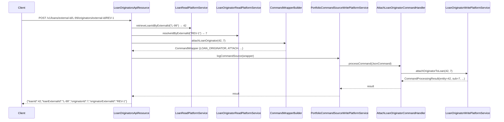

Apache Fineract's `fineract-loan-origination` module exposes its REST surface through two JAX-RS classes registered with the Jersey provider under `/v1/loan-originators` and `/v1/loans/...`. Both are `@Component`-annotated and gated by `@ConditionalOnProperty(value = "fineract.module.loan-origination.enabled", havingValue = "true")`, so they only appear in the deployed API when the module flag is set. Every write endpoint funnels through the standard `CommandWrapperBuilder` → `PortfolioCommandSourceWritePlatformService.logCommandSource` pipeline so they automatically inherit auditing, idempotency, and maker-checker.

This page lists every method on every resource: path, HTTP verb, permission check, command-wrapper builder method, dispatched handler, and return type. Pair it with [Origination Handlers](/loan-origination/origination-handlers) to see which write service entry point each command resolves to.

## Resource files

| File | Base path | Tag | Conditional |
| --- | --- | --- | --- |
| `api/LoanOriginatorApiResource.java` | `/v1/loan-originators` | "Loan Originators" — manage originator records | `fineract.module.loan-origination.enabled=true` |
| `api/LoanOriginatorsApiResource.java` | `/v1/loans` | "Loan Originators" — fetch/attach/detach per loan | `fineract.module.loan-origination.enabled=true` |

Constants and code-value code names are centralized in `api/LoanOriginatorApiConstants.java`:

```java
public static final String RESOURCE_NAME = "LOAN_ORIGINATOR";
public static final String RESOURCE_PATH = "/loan-originators";

public static final String ORIGINATOR_TYPE_CODE_NAME = "LoanOriginatorType";
public static final String CHANNEL_TYPE_CODE_NAME    = "LoanOriginationChannelType";

public static final String EXTERNAL_ID_PARAM        = "externalId";
public static final String NAME_PARAM               = "name";
public static final String STATUS_PARAM             = "status";
public static final String ORIGINATOR_TYPE_ID_PARAM = "originatorTypeId";
public static final String CHANNEL_TYPE_ID_PARAM    = "channelTypeId";
```

## `LoanOriginatorApiResource` — `/v1/loan-originators`

Constructor injects three collaborators:

```java
private final PlatformSecurityContext context;
private final LoanOriginatorReadPlatformService loanOriginatorReadPlatformService;
private final PortfolioCommandSourceWritePlatformService commandsSourceWritePlatformService;
```

`context` enforces permission checks on read endpoints; the write endpoints rely on the command pipeline's built-in permission enforcement when the wrapper hits `logCommandSource`.

### Endpoint table

| # | Method | Path | Permission check | Read service / Wrapper builder | Handler dispatched | Returns |
| --- | --- | --- | --- | --- | --- | --- |
| 1 | `POST` | `/v1/loan-originators` | via command pipeline (`CREATE_LOAN_ORIGINATOR`) | `CommandWrapperBuilder.createLoanOriginator()` | `CreateLoanOriginatorCommandHandler` | `CommandProcessingResult` |
| 2 | `GET` | `/v1/loan-originators` | `validateHasReadPermission("LOAN_ORIGINATOR")` | `LoanOriginatorReadPlatformService.retrieveAll()` | — | `List<LoanOriginatorData>` |
| 3 | `GET` | `/v1/loan-originators/template` | `validateHasReadPermission("LOAN_ORIGINATOR")` | `LoanOriginatorReadPlatformService.retrieveTemplate()` | — | `LoanOriginatorTemplateData` |
| 4 | `GET` | `/v1/loan-originators/{originatorId}` | `validateHasReadPermission("LOAN_ORIGINATOR")` | `LoanOriginatorReadPlatformService.retrieveById(id)` | — | `LoanOriginatorData` |
| 5 | `GET` | `/v1/loan-originators/external-id/{externalId}` | `validateHasReadPermission("LOAN_ORIGINATOR")` | `LoanOriginatorReadPlatformService.retrieveByExternalId(ext)` | — | `LoanOriginatorData` |
| 6 | `PUT` | `/v1/loan-originators/{originatorId}` | via command pipeline (`UPDATE_LOAN_ORIGINATOR`) | `updateLoanOriginator(originatorId)` | `UpdateLoanOriginatorCommandHandler` | `CommandProcessingResult` |
| 7 | `PUT` | `/v1/loan-originators/external-id/{externalId}` | via command pipeline (`UPDATE_LOAN_ORIGINATOR`) | `resolveIdByExternalId` → `updateLoanOriginator(id)` | `UpdateLoanOriginatorCommandHandler` | `CommandProcessingResult` |
| 8 | `DELETE` | `/v1/loan-originators/{originatorId}` | via command pipeline (`DELETE_LOAN_ORIGINATOR`) | `deleteLoanOriginator(originatorId)` | `DeleteLoanOriginatorCommandHandler` | `CommandProcessingResult` |
| 9 | `DELETE` | `/v1/loan-originators/external-id/{externalId}` | via command pipeline (`DELETE_LOAN_ORIGINATOR`) | `resolveIdByExternalId` → `deleteLoanOriginator(id)` | `DeleteLoanOriginatorCommandHandler` | `CommandProcessingResult` |

### Source snippets

**Create**

```java
@POST
public CommandProcessingResult create(@Parameter(hidden = true) final String apiRequestBodyAsJson) {
    final CommandWrapper commandRequest = new CommandWrapperBuilder()
            .createLoanOriginator()
            .withJson(apiRequestBodyAsJson)
            .build();
    return this.commandsSourceWritePlatformService.logCommandSource(commandRequest);
}
```

`CommandWrapperBuilder.createLoanOriginator()` (defined in `fineract-core`) sets `actionName="CREATE"`, `entityName="LOAN_ORIGINATOR"`, `href="/loan-originators"`. The pipeline persists the `CommandSource`, looks up `CreateLoanOriginatorCommandHandler` via `@CommandType("LOAN_ORIGINATOR","CREATE")`, and calls `processCommand(JsonCommand)`.

**List**

```java
@GET
public List<LoanOriginatorData> retrieveAll() {
    this.context.authenticatedUser().validateHasReadPermission(LoanOriginatorApiConstants.RESOURCE_NAME);
    return this.loanOriginatorReadPlatformService.retrieveAll();
}
```

The explicit permission check uses the standard Fineract pattern: `READ_LOAN_ORIGINATOR` permission rows in `m_permission` are evaluated against the authenticated user. The read service returns a JOIN-FETCH'd list (`findAllWithCodeValues`) to avoid N+1 queries on the code-value relations.

**Template**

```java
@GET @Path("template")
public LoanOriginatorTemplateData retrieveLoanOriginatorTemplate() {
    this.context.authenticatedUser().validateHasReadPermission(LoanOriginatorApiConstants.RESOURCE_NAME);
    return this.loanOriginatorReadPlatformService.retrieveTemplate();
}
```

`retrieveTemplate()` returns:

- `externalId`: a freshly-generated UUID (suggestion only).
- `statusOptions`: `Set.of("ACTIVE", "PENDING", "INACTIVE")`.
- `originatorTypeOptions`: `m_code_value` rows for `code_name = 'LoanOriginatorType'`.
- `channelTypeOptions`: `m_code_value` rows for `code_name = 'LoanOriginationChannelType'`.

**Retrieve by ID / external ID**

```java
@GET @Path("{originatorId}")
public LoanOriginatorData retrieveOne(@PathParam("originatorId") Long originatorId) { ... }

@GET @Path("external-id/{externalId}")
public LoanOriginatorData retrieveByExternalId(@PathParam("externalId") String externalId) { ... }
```

Both delegate to the read service. Misses raise `LoanOriginatorNotFoundException` (HTTP 404).

**Update by external ID**

```java
@PUT @Path("external-id/{externalId}")
public CommandProcessingResult updateByExternalId(@PathParam("externalId") String externalId,
        @Parameter(hidden = true) String apiRequestBodyAsJson) {
    final Long originatorId = this.loanOriginatorReadPlatformService.resolveIdByExternalId(externalId);
    final CommandWrapper commandRequest = new CommandWrapperBuilder()
            .updateLoanOriginator(originatorId)
            .withJson(apiRequestBodyAsJson)
            .build();
    return this.commandsSourceWritePlatformService.logCommandSource(commandRequest);
}
```

Notice that the external-ID variant resolves the numeric ID *before* the command wrapper is built. The command source row therefore still references the numeric `entityId`, keeping the audit log consistent regardless of which path the client chose.

**Delete behaviour**

Delete fails fast when the originator is referenced by any mapping — `LoanOriginatorWritePlatformServiceImpl.delete` checks `loanOriginatorMappingRepository.existsByOriginatorId(id)` and raises `LoanOriginatorCannotBeDeletedException`. The Swagger response documents this with `403`.

### Request/Response shapes

The Swagger schemas live in `LoanOriginatorApiResourceSwagger.java`:

| Schema class | Used for |
| --- | --- |
| `PostLoanOriginatorsRequest` | Request body of #1 |
| `PostLoanOriginatorsResponse` | Response body of #1 |
| `GetLoanOriginatorsResponse` | Response body of #2, #4, #5 |
| `GetLoanOriginatorTemplateResponse` | Response body of #3 |
| `PutLoanOriginatorsRequest` | Request body of #6, #7 |
| `PutLoanOriginatorsResponse` | Response body of #6, #7 |
| `DeleteLoanOriginatorsResponse` | Response body of #8, #9 |

Allowed JSON parameters are constrained by `LoanOriginatorApiConstants`:

```java
public static final Set<String> CREATE_REQUEST_PARAMS = Set.of(
        EXTERNAL_ID_PARAM, NAME_PARAM, STATUS_PARAM,
        ORIGINATOR_TYPE_ID_PARAM, CHANNEL_TYPE_ID_PARAM);

public static final Set<String> UPDATE_REQUEST_PARAMS = Set.of(
        NAME_PARAM, STATUS_PARAM,
        ORIGINATOR_TYPE_ID_PARAM, CHANNEL_TYPE_ID_PARAM);
```

`LoanOriginatorDataValidator.checkForUnsupportedParameters(...)` rejects anything else with HTTP 400.

## `LoanOriginatorsApiResource` — `/v1/loans/{loanId}/originators`

This second resource is the loan-scoped surface for attach/detach plus listing. It cooperates with the loan domain:

```java
private final PlatformSecurityContext context;
private final LoanReadPlatformService loanReadPlatformService;
private final LoanOriginatorReadPlatformService loanOriginatorReadPlatformService;
private final PortfolioCommandSourceWritePlatformService commandsSourceWritePlatformService;
```

Permission name is **`LOAN`** (not `LOAN_ORIGINATOR`) because the per-loan view is conceptually read access on the loan, plus dedicated maker-checker actions `ATTACH_LOAN_ORIGINATOR` / `DETACH_LOAN_ORIGINATOR` for the mutations.

### Endpoint table

| # | Method | Path | Permission / guard | Wrapper builder | Handler dispatched | Returns |
| --- | --- | --- | --- | --- | --- | --- |
| 1 | `GET` | `/v1/loans/{loanId}/originators` | `validateHasReadPermission("LOAN")` + `existsByLoanId(loanId)` | `LoanOriginatorReadPlatformService.retrieveByLoanId(loanId)` | — | `LoanOriginatorsResponse` |
| 2 | `GET` | `/v1/loans/external-id/{loanExternalId}/originators` | `validateHasReadPermission("LOAN")` + `retrieveLoanIdByExternalId` | `retrieveByLoanId(loanId)` | — | `LoanOriginatorsResponse` |
| 3 | `POST` | `/v1/loans/{loanId}/originators/{originatorId}` | via command pipeline (`ATTACH_LOAN_ORIGINATOR`) | `attachLoanOriginator(loanId, originatorId)` | `AttachLoanOriginatorCommandHandler` | `LoanOriginatorMappingResponse` |
| 4 | `POST` | `/v1/loans/{loanId}/originators/external-id/{originatorExternalId}` | via command pipeline | `resolveIdByExternalId` → `attachLoanOriginator(loanId, id)` | `AttachLoanOriginatorCommandHandler` | `LoanOriginatorMappingResponse` |
| 5 | `POST` | `/v1/loans/external-id/{loanExternalId}/originators/{originatorId}` | via command pipeline | `retrieveLoanIdByExternalId` → `attachLoanOriginator(loanId, originatorId)` | `AttachLoanOriginatorCommandHandler` | `LoanOriginatorMappingResponse` |
| 6 | `POST` | `/v1/loans/external-id/{loanExternalId}/originators/external-id/{originatorExternalId}` | via command pipeline | resolve both → `attachLoanOriginator` | `AttachLoanOriginatorCommandHandler` | `LoanOriginatorMappingResponse` |
| 7 | `DELETE` | `/v1/loans/{loanId}/originators/{originatorId}` | via command pipeline (`DETACH_LOAN_ORIGINATOR`) | `detachLoanOriginator(loanId, originatorId)` | `DetachLoanOriginatorCommandHandler` | `LoanOriginatorMappingResponse` |
| 8 | `DELETE` | `/v1/loans/{loanId}/originators/external-id/{originatorExternalId}` | via command pipeline | `resolveIdByExternalId` → `detachLoanOriginator(loanId, id)` | `DetachLoanOriginatorCommandHandler` | `LoanOriginatorMappingResponse` |
| 9 | `DELETE` | `/v1/loans/external-id/{loanExternalId}/originators/{originatorId}` | via command pipeline | `retrieveLoanIdByExternalId` → `detachLoanOriginator` | `DetachLoanOriginatorCommandHandler` | `LoanOriginatorMappingResponse` |
| 10 | `DELETE` | `/v1/loans/external-id/{loanExternalId}/originators/external-id/{originatorExternalId}` | via command pipeline | resolve both → `detachLoanOriginator` | `DetachLoanOriginatorCommandHandler` | `LoanOriginatorMappingResponse` |

### Source snippets

**Retrieve originators for a loan**

```java
@GET @Path("{loanId}/originators")
public LoanOriginatorsResponse retrieveOriginatorsByLoanId(@PathParam("loanId") Long loanId) {
    this.context.authenticatedUser().validateHasReadPermission(LOAN_RESOURCE_NAME);

    if (!this.loanReadPlatformService.existsByLoanId(loanId)) {
        throw new LoanNotFoundException(loanId);
    }
    return LoanOriginatorsResponse.of(this.loanOriginatorReadPlatformService.retrieveByLoanId(loanId));
}
```

Two important details:

1. The existence guard uses `LoanReadPlatformService.existsByLoanId` rather than fetching the full `Loan` aggregate, keeping the endpoint cheap when the loan has no originators.
2. The response is wrapped in `LoanOriginatorsResponse.of(...)` so the JSON shape is `{ "originators": [...] }` instead of a bare top-level array — easier to extend with paging metadata later.

**Attach by both numeric IDs**

```java
@POST @Path("{loanId}/originators/{originatorId}")
public LoanOriginatorMappingResponse attachOriginatorToLoan(@PathParam("loanId") Long loanId,
        @PathParam("originatorId") Long originatorId) {
    final CommandWrapper commandRequest = new CommandWrapperBuilder()
            .attachLoanOriginator(loanId, originatorId).build();
    final CommandProcessingResult result = this.commandsSourceWritePlatformService.logCommandSource(commandRequest);
    return buildMappingResponse(result);
}
```

`attachLoanOriginator(loanId, originatorId)` on `CommandWrapperBuilder` sets:

| Field | Value |
| --- | --- |
| `actionName` | `"ATTACH"` |
| `entityName` | `"LOAN_ORIGINATOR"` |
| `entityId` | `loanId` |
| `loanId` | `loanId` |
| `subentityId` | `originatorId` |
| `href` | `/loans/{loanId}/originators/{originatorId}` |

`AttachLoanOriginatorCommandHandler` picks `command.getLoanId()` and `command.subentityId()` to call `LoanOriginatorWritePlatformService.attachOriginatorToLoan(loanId, originatorId)`. The write service runs the four guards (loan in submitted status, originator exists, originator ACTIVE, mapping doesn't already exist) and persists the mapping.

**Attach by external IDs**

```java
@POST @Path("external-id/{loanExternalId}/originators/external-id/{originatorExternalId}")
public LoanOriginatorMappingResponse attachOriginatorToLoanByExternalIds(
        @PathParam("loanExternalId") String loanExternalId,
        @PathParam("originatorExternalId") String originatorExternalId) {

    final ExternalId loanExtId = ExternalIdFactory.produce(loanExternalId);
    final Long loanId = this.loanReadPlatformService.retrieveLoanIdByExternalId(loanExtId);
    if (loanId == null) { throw new LoanNotFoundException(loanExtId); }

    final Long originatorId = this.loanOriginatorReadPlatformService.resolveIdByExternalId(originatorExternalId);

    final CommandWrapper commandRequest = new CommandWrapperBuilder()
            .attachLoanOriginator(loanId, originatorId).build();
    final CommandProcessingResult result = this.commandsSourceWritePlatformService.logCommandSource(commandRequest);
    return buildMappingResponse(result);
}
```

`ExternalIdFactory.produce(...)` normalises the string into an `ExternalId` value object. Resolution happens up front so the `CommandSource` row carries the numeric IDs.

**Mapping response builder**

```java
private LoanOriginatorMappingResponse buildMappingResponse(final CommandProcessingResult result) {
    return LoanOriginatorMappingResponse.of(
            result.getResourceId(),
            result.getResourceExternalId() != null ? result.getResourceExternalId().getValue() : null,
            result.getSubResourceId(),
            result.getSubResourceExternalId() != null ? result.getSubResourceExternalId().getValue() : null);
}
```

The handler populated both `entity*` (loan) and `subEntity*` (originator) fields on the result; this helper unpacks them into `{ loanId, loanExternalId, originatorId, originatorExternalId }`.

## Error responses

Aggregated across both resources:

| HTTP | Trigger | Exception (or source) |
| --- | --- | --- |
| 400 | Invalid JSON body, missing required parameter, unknown parameter | `PlatformApiDataValidationException` raised in `LoanOriginatorDataValidator` |
| 403 | Loan not in `SubmittedAndPendingApproval` | `LoanNotInSubmittedStatusException` |
| 403 | Duplicate external ID on create | `LoanOriginatorDuplicateExternalIdException` |
| 403 | Originator not `ACTIVE` on attach | `LoanOriginatorNotActiveException` |
| 403 | Originator already attached | `LoanOriginatorMappingAlreadyExistsException` |
| 403 | Originator referenced by mapping on delete | `LoanOriginatorCannotBeDeletedException` |
| 403 | Invalid status value | `LoanOriginatorInvalidStatusException` |
| 403 | Originator creation during loan application disabled | `LoanOriginatorCreationNotAllowedException` |
| 404 | Originator missing | `LoanOriginatorNotFoundException` |
| 404 | Mapping missing on detach | `LoanOriginatorMappingNotFoundException` |
| 404 | Loan missing | `LoanNotFoundException` (from fineract-loan) |

## Sequence: external-ID attach end-to-end



## Where to look next

<CardGroup cols={2}>
  <Card title="Origination Handlers" icon="bolt" href="/loan-origination/origination-handlers">
    The five `@CommandType` handlers each wrapper resolves to.
  </Card>
  <Card title="Originator Domain" icon="database" href="/loan-origination/originator-domain">
    The entity, repositories, and write/read service signatures.
  </Card>
  <Card title="Command Framework" icon="layer-group" href="/command/overview">
    How `CommandWrapper`, `JsonCommand`, and `logCommandSource` interlock.
  </Card>
  <Card title="REST API Reference" icon="book" href="/api/loan-origination-apis">
    OpenAPI-style request/response detail for these endpoints.
  </Card>
</CardGroup>
