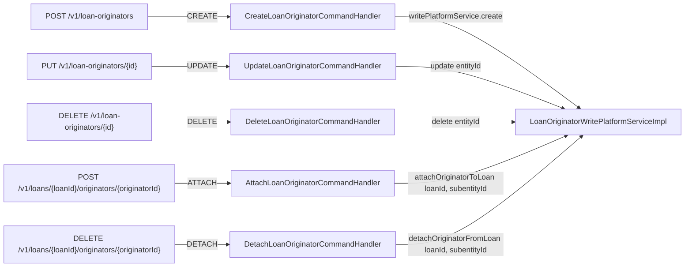
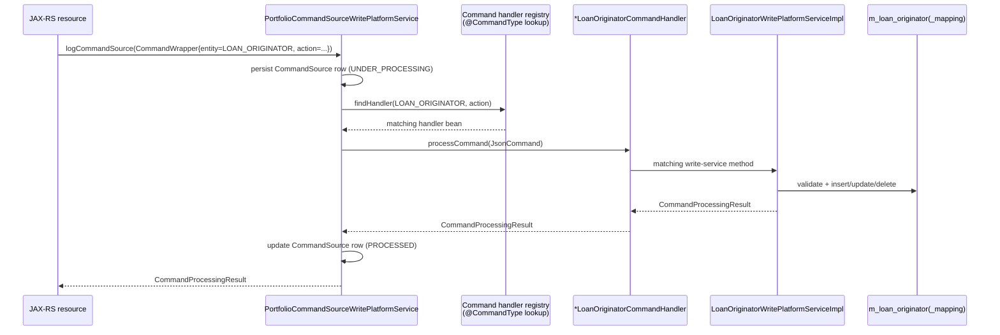

The `fineract-loan-origination` module of Apache Fineract registers exactly five `NewCommandSourceHandler` implementations, one for each write action the module supports. Each handler is a tiny Spring `@Service` annotated with `@CommandType(entity, action)`; the Fineract command-handler registry uses that pair to dispatch a deserialized `JsonCommand` to the right handler. The handlers carry no business logic — every line of their `processCommand(...)` body forwards to a method on `LoanOriginatorWritePlatformService`. This page lists each handler file, its annotation, the exact method it invokes, and the validation, guards, and side effects that method performs.

For background on the wider pipeline (how `CommandSource` rows are produced, how `JsonCommand` is built, how idempotency works), see the [Command Framework Overview](/command/overview).

## Handler-to-action map



| Handler file | `@CommandType` | Write-service method invoked |
| --- | --- | --- |
| `handler/CreateLoanOriginatorCommandHandler.java` | `entity="LOAN_ORIGINATOR"`, `action="CREATE"` | `create(JsonCommand command)` |
| `handler/UpdateLoanOriginatorCommandHandler.java` | `entity="LOAN_ORIGINATOR"`, `action="UPDATE"` | `update(Long id, JsonCommand command)` |
| `handler/DeleteLoanOriginatorCommandHandler.java` | `entity="LOAN_ORIGINATOR"`, `action="DELETE"` | `delete(Long id)` |
| `handler/AttachLoanOriginatorCommandHandler.java` | `entity="LOAN_ORIGINATOR"`, `action="ATTACH"` | `attachOriginatorToLoan(Long loanId, Long originatorId)` |
| `handler/DetachLoanOriginatorCommandHandler.java` | `entity="LOAN_ORIGINATOR"`, `action="DETACH"` | `detachOriginatorFromLoan(Long loanId, Long originatorId)` |

All five handlers carry:

```java
@Service
@CommandType(entity = "LOAN_ORIGINATOR", action = "...")
@RequiredArgsConstructor
@ConditionalOnProperty(value = "fineract.module.loan-origination.enabled", havingValue = "true")
```

so the registry only sees them when the module flag is on.

## `CreateLoanOriginatorCommandHandler`

```java
@Service
@CommandType(entity = "LOAN_ORIGINATOR", action = "CREATE")
@RequiredArgsConstructor
@ConditionalOnProperty(value = "fineract.module.loan-origination.enabled", havingValue = "true")
public class CreateLoanOriginatorCommandHandler implements NewCommandSourceHandler {

    private final LoanOriginatorWritePlatformService writePlatformService;

    @Override
    public CommandProcessingResult processCommand(final JsonCommand command) {
        return this.writePlatformService.create(command);
    }
}
```

| Attribute | Value |
| --- | --- |
| **CommandType** | `(entity="LOAN_ORIGINATOR", action="CREATE")` |
| **Triggered by** | `CommandWrapperBuilder.createLoanOriginator()` via `POST /v1/loan-originators` |
| **Write-service method** | `LoanOriginatorWritePlatformService.create(JsonCommand)` |
| **Permission name (action_entity)** | `CREATE_LOAN_ORIGINATOR` |

The forwarded method (`LoanOriginatorWritePlatformServiceImpl.create`) performs, in order:

1. `loanOriginatorDataValidator.validateForCreate(command.json())` — checks JSON shape, rejects unknown parameters, validates string lengths and `status` enum value.
2. Reads `externalId` from the command and runs `loanOriginatorRepository.existsByExternalId(externalId)`; raises `LoanOriginatorDuplicateExternalIdException` if found.
3. Resolves `originatorTypeId` and `channelTypeId` against `CodeValueRepositoryWrapper` (404 if either is unknown for its expected `code_name`).
4. Defaults `status` to `LoanOriginatorStatus.ACTIVE` if the request omits it.
5. Calls `LoanOriginator.create(...)` and `loanOriginatorRepository.saveAndFlush(originator)`.
6. Returns a `CommandProcessingResult` with `entityId = originator.getId()` and `entityExternalId = externalId`, so the audit row and HTTP response both carry both identifiers.

## `UpdateLoanOriginatorCommandHandler`

```java
@Service
@CommandType(entity = "LOAN_ORIGINATOR", action = "UPDATE")
@RequiredArgsConstructor
@ConditionalOnProperty(value = "fineract.module.loan-origination.enabled", havingValue = "true")
public class UpdateLoanOriginatorCommandHandler implements NewCommandSourceHandler {

    private final LoanOriginatorWritePlatformService writePlatformService;

    @Override
    public CommandProcessingResult processCommand(final JsonCommand command) {
        return this.writePlatformService.update(command.entityId(), command);
    }
}
```

| Attribute | Value |
| --- | --- |
| **CommandType** | `(entity="LOAN_ORIGINATOR", action="UPDATE")` |
| **Triggered by** | `CommandWrapperBuilder.updateLoanOriginator(originatorId)` via `PUT /v1/loan-originators/{originatorId}` (also the external-ID variant after lookup) |
| **Write-service method** | `LoanOriginatorWritePlatformService.update(Long id, JsonCommand command)` |
| **Permission name** | `UPDATE_LOAN_ORIGINATOR` |

`command.entityId()` returns the numeric originator ID that the wrapper builder set via `entityId = originatorId`. The forwarded `update` method:

1. Calls `loanOriginatorDataValidator.validateForUpdate(json)` — only the four updatable parameters (`name`, `status`, `originatorTypeId`, `channelTypeId`) are accepted; `externalId` is **not** mutable.
2. Loads the entity via `findById(id)`, throwing `LoanOriginatorNotFoundException(id)` on miss.
3. Walks each parameter with `command.isChangeInStringParameterNamed(...)` / `isChangeInLongParameterNamed(...)` and applies only deltas, recording each into a `LinkedHashMap<String, Object> changes`.
4. Calls `saveAndFlush` only when at least one change is present.
5. Returns `CommandProcessingResult` with `entityId`, `entityExternalId`, and the `changes` map. The map is what `m_portfolio_command_source.changes_json` will store, and what the response JSON returns under `changes`.

## `DeleteLoanOriginatorCommandHandler`

```java
@Service
@CommandType(entity = "LOAN_ORIGINATOR", action = "DELETE")
@RequiredArgsConstructor
@ConditionalOnProperty(value = "fineract.module.loan-origination.enabled", havingValue = "true")
public class DeleteLoanOriginatorCommandHandler implements NewCommandSourceHandler {

    private final LoanOriginatorWritePlatformService writePlatformService;

    @Override
    public CommandProcessingResult processCommand(final JsonCommand command) {
        return this.writePlatformService.delete(command.entityId());
    }
}
```

| Attribute | Value |
| --- | --- |
| **CommandType** | `(entity="LOAN_ORIGINATOR", action="DELETE")` |
| **Triggered by** | `CommandWrapperBuilder.deleteLoanOriginator(originatorId)` via `DELETE /v1/loan-originators/{originatorId}` |
| **Write-service method** | `LoanOriginatorWritePlatformService.delete(Long id)` |
| **Permission name** | `DELETE_LOAN_ORIGINATOR` |

The write method:

1. Loads via `findById(id)` → `LoanOriginatorNotFoundException` if missing.
2. **Guards against deletion** with `loanOriginatorMappingRepository.existsByOriginatorId(id)`; if any mapping references the originator, raises `LoanOriginatorCannotBeDeletedException` (HTTP 403). To retire an originator linked to historical loans, callers should `UPDATE` it to `status=INACTIVE` instead.
3. Captures `externalId` *before* deletion so the response can still carry it.
4. Calls `loanOriginatorRepository.delete(originator)`.
5. Returns `CommandProcessingResult` with `entityId = id`, `entityExternalId = externalId`.

## `AttachLoanOriginatorCommandHandler`

```java
@Service
@CommandType(entity = "LOAN_ORIGINATOR", action = "ATTACH")
@RequiredArgsConstructor
@ConditionalOnProperty(value = "fineract.module.loan-origination.enabled", havingValue = "true")
public class AttachLoanOriginatorCommandHandler implements NewCommandSourceHandler {

    private final LoanOriginatorWritePlatformService writePlatformService;

    @Override
    public CommandProcessingResult processCommand(final JsonCommand command) {
        return this.writePlatformService.attachOriginatorToLoan(command.getLoanId(), command.subentityId());
    }
}
```

| Attribute | Value |
| --- | --- |
| **CommandType** | `(entity="LOAN_ORIGINATOR", action="ATTACH")` |
| **Triggered by** | `CommandWrapperBuilder.attachLoanOriginator(loanId, originatorId)` via any of the four `POST /v1/loans/.../originators/...` variants on `LoanOriginatorsApiResource` |
| **Write-service method** | `LoanOriginatorWritePlatformService.attachOriginatorToLoan(Long loanId, Long originatorId)` |
| **Permission name** | `ATTACH_LOAN_ORIGINATOR` |

This handler uses both `command.getLoanId()` *and* `command.subentityId()` — the wrapper builder set:

```java
this.actionName    = "ATTACH";
this.entityName    = "LOAN_ORIGINATOR";
this.entityId      = loanId;
this.loanId        = loanId;
this.subentityId   = originatorId;
this.href          = "/loans/" + loanId + "/originators/" + originatorId;
```

The forwarded `attachOriginatorToLoan` performs four guards in sequence:

1. **Loan exists & is in `SubmittedAndPendingApproval`.** Loaded via `LoanRepositoryWrapper.findOneWithNotFoundDetection(loanId)`; if not in that status, raises `LoanNotInSubmittedStatusException`. This is the contractual rule: originators may only be wired up while the application is being reviewed.
2. **Originator exists.** `loanOriginatorRepository.findById(originatorId)` → `LoanOriginatorNotFoundException` on miss.
3. **Originator is `ACTIVE`.** Otherwise raises `LoanOriginatorNotActiveException` carrying the current status string.
4. **Mapping does not already exist.** `existsByLoanIdAndOriginatorId(loanId, originatorId)` → `LoanOriginatorMappingAlreadyExistsException` if it does.

On success it persists `LoanOriginatorMapping.create(loanId, originator)` and returns a `CommandProcessingResult` with `entityId = loanId`, `entityExternalId = loan.getExternalId()`, `subEntityId = originatorId`, `subEntityExternalId = originator.getExternalId()`. The JAX-RS resource's `buildMappingResponse` unpacks all four for the HTTP body.

## `DetachLoanOriginatorCommandHandler`

```java
@Service
@CommandType(entity = "LOAN_ORIGINATOR", action = "DETACH")
@RequiredArgsConstructor
@ConditionalOnProperty(value = "fineract.module.loan-origination.enabled", havingValue = "true")
public class DetachLoanOriginatorCommandHandler implements NewCommandSourceHandler {

    private final LoanOriginatorWritePlatformService writePlatformService;

    @Override
    public CommandProcessingResult processCommand(final JsonCommand command) {
        return this.writePlatformService.detachOriginatorFromLoan(command.getLoanId(), command.subentityId());
    }
}
```

| Attribute | Value |
| --- | --- |
| **CommandType** | `(entity="LOAN_ORIGINATOR", action="DETACH")` |
| **Triggered by** | `CommandWrapperBuilder.detachLoanOriginator(loanId, originatorId)` via the four `DELETE /v1/loans/.../originators/...` variants |
| **Write-service method** | `LoanOriginatorWritePlatformService.detachOriginatorFromLoan(Long loanId, Long originatorId)` |
| **Permission name** | `DETACH_LOAN_ORIGINATOR` |

The write method:

1. Loads the loan and re-applies the `isSubmittedAndPendingApproval` guard (same rule: edits to the originator graph are only permitted before the loan is approved).
2. Loads the originator via `findById(originatorId)` (`LoanOriginatorNotFoundException` on miss).
3. Locates the mapping with `loanOriginatorMappingRepository.findByLoanIdAndOriginatorId(loanId, originatorId)`; missing → `LoanOriginatorMappingNotFoundException`.
4. Deletes the mapping.
5. Returns the same four-field `CommandProcessingResult` as attach.

## Dispatch sequence (end-to-end)



The Source layer also handles idempotency keys, maker-checker, and audit transitions; see [Command Framework Overview](/command/overview) for the full pipeline.

## Permission catalogue

The five action-entity combinations populate the following permission rows in `m_permission`:

| Action | Entity | Permission name |
| --- | --- | --- |
| `CREATE` | `LOAN_ORIGINATOR` | `CREATE_LOAN_ORIGINATOR` |
| `UPDATE` | `LOAN_ORIGINATOR` | `UPDATE_LOAN_ORIGINATOR` |
| `DELETE` | `LOAN_ORIGINATOR` | `DELETE_LOAN_ORIGINATOR` |
| `ATTACH` | `LOAN_ORIGINATOR` | `ATTACH_LOAN_ORIGINATOR` |
| `DETACH` | `LOAN_ORIGINATOR` | `DETACH_LOAN_ORIGINATOR` |

These are evaluated by `PortfolioCommandSourceWritePlatformService.logCommandSource` *before* the handler runs. A user without the permission gets HTTP 403 from the command framework, not from the originator module.

Each permission can be marked **maker-checker** via the standard configuration; when enabled, the handler still runs but inside a rollback-marked transaction, leaving the `CommandSource` row in `AWAITING_APPROVAL` for a second user to confirm via `/v1/makercheckers/{id}`.

## Error taxonomy (handler-visible)

Errors raised from inside the write-service methods that bubble up through the handlers:

| Error code | HTTP | Raised in |
| --- | --- | --- |
| `error.msg.loan.originator.duplicate.external.id` | 403 | `create` |
| `error.msg.loan.originator.invalid.status` | 403 | `create`, `update` (via validator) |
| `error.msg.loan.originator.id.not.found` | 404 | `update`, `delete`, `attachOriginatorToLoan`, `detachOriginatorFromLoan` |
| `error.msg.loan.originator.cannot.be.deleted.mapped.to.loan` | 403 | `delete` |
| `error.msg.loan.not.in.submitted.status` | 403 | `attachOriginatorToLoan`, `detachOriginatorFromLoan` |
| `error.msg.loan.originator.not.active` | 403 | `attachOriginatorToLoan` |
| `error.msg.loan.originator.mapping.already.exists` | 403 | `attachOriginatorToLoan` |
| `error.msg.loan.originator.mapping.not.found` | 404 | `detachOriginatorFromLoan` |
| Any `PlatformApiDataValidationException` | 400 | validator (called by `create`, `update`) |

## Common debugging tips

<AccordionGroup>
  <Accordion title="A new permission row is missing" icon="key">
    The handler dispatcher resolves permission names from the `entity` and `action` of `@CommandType`. If you add a new action you must also insert a `m_permission` row with `entity_name = 'LOAN_ORIGINATOR'`, `action_name = '<your action>'`, and `code = '<ACTION>_LOAN_ORIGINATOR'` — otherwise the framework will reject the request with `error.msg.permissions.not.found`.
  </Accordion>
  <Accordion title="`MapStruct` cannot find the handler" icon="bug">
    `@CommandType` is processed by Fineract's `CommandHandlerProvider`, not MapStruct. If you see "handler not found" in the logs, check (1) the `@ConditionalOnProperty` flag is on, (2) the bean is `@Service`-annotated, and (3) the entity/action strings match `CommandWrapperBuilder` exactly (case sensitive).
  </Accordion>
  <Accordion title="`ATTACH` fails despite an active originator" icon="triangle-exclamation">
    The most common cause is the loan no longer being in `SubmittedAndPendingApproval`. Once the loan is approved (or rejected/withdrawn), attach/detach refuses with `LoanNotInSubmittedStatusException`. There is no override; the application-time hook (`LoanOriginatorLinkingServiceImpl`) is the alternative path.
  </Accordion>
  <Accordion title="Idempotent retry returns the same result" icon="rotate">
    All five actions go through the standard idempotency layer. A retry with the same `Idempotency-Key` header — or default-generated key — that landed on a previously `PROCESSED` row returns the cached `CommandProcessingResult` instead of re-executing. This is desirable behaviour and matches the rest of Fineract.
  </Accordion>
</AccordionGroup>

## Cross-references

<CardGroup cols={2}>
  <Card title="Origination API" icon="server" href="/loan-origination/origination-api">
    Resources and JAX-RS methods that build the `CommandWrapper` each handler later receives.
  </Card>
  <Card title="Originator Domain" icon="database" href="/loan-origination/originator-domain">
    Full body of `LoanOriginatorWritePlatformServiceImpl` — the methods these handlers delegate to.
  </Card>
  <Card title="Command Framework" icon="layer-group" href="/command/overview">
    `CommandSource`, `JsonCommand`, idempotency, maker-checker, handler registry.
  </Card>
  <Card title="Loan Module" icon="building-columns" href="/loan/overview">
    `Loan`, `LoanRepositoryWrapper`, and the `isSubmittedAndPendingApproval` guard reused by attach/detach.
  </Card>
</CardGroup>
