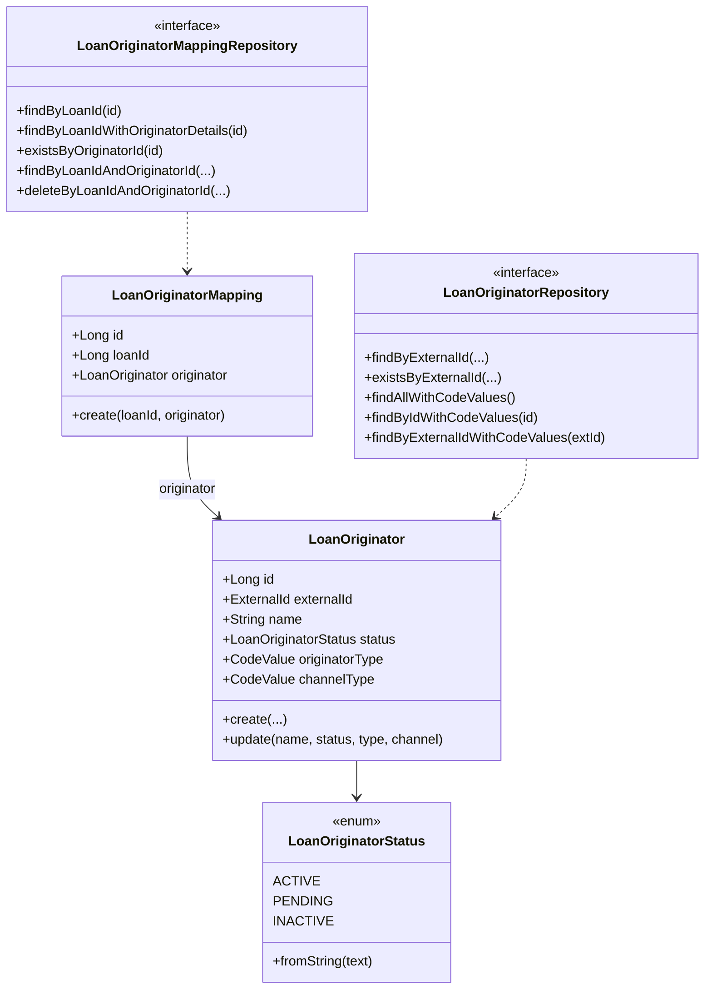

The originator domain inside Apache Fineract's `fineract-loan-origination` module is intentionally compact: two JPA entities (`LoanOriginator`, `LoanOriginatorMapping`), one enum (`LoanOriginatorStatus`), two Spring-Data repositories with hand-tuned JOIN-FETCH queries, and a pair of write/read platform services that bracket every domain mutation with validation, status guards, and structured exception throwing. This page walks every class file so engineers and coding agents know exactly which field, column, query, and exception they can reach for when extending the module.

## Class map



## `LoanOriginator` — the originator entity

File: `fineract-loan-origination/src/main/java/org/apache/fineract/portfolio/loanorigination/domain/LoanOriginator.java`. Table: **`m_loan_originator`**.

```java
@Getter
@Setter
@Entity
@NoArgsConstructor
@Table(name = "m_loan_originator")
public class LoanOriginator extends AbstractAuditableWithUTCDateTimeCustom<Long> {

    @Column(name = "external_id", nullable = false, length = 100, unique = true)
    private ExternalId externalId;

    @Column(name = "name", length = 255)
    private String name;

    @Enumerated(EnumType.STRING)
    @Column(name = "status", nullable = false, length = 20)
    private LoanOriginatorStatus status;

    @ManyToOne(fetch = FetchType.LAZY)
    @JoinColumn(name = "originator_type_cv_id")
    private CodeValue originatorType;

    @ManyToOne(fetch = FetchType.LAZY)
    @JoinColumn(name = "channel_type_cv_id")
    private CodeValue channelType;

    public static LoanOriginator create(ExternalId externalId, String name, LoanOriginatorStatus status,
            CodeValue originatorType, CodeValue channelType) {
        LoanOriginator originator = new LoanOriginator();
        originator.setExternalId(externalId);
        originator.setName(name);
        originator.setStatus(status);
        originator.setOriginatorType(originatorType);
        originator.setChannelType(channelType);
        return originator;
    }

    public void update(String name, LoanOriginatorStatus status, CodeValue originatorType, CodeValue channelType) {
        this.name = name;
        this.status = status;
        this.originatorType = originatorType;
        this.channelType = channelType;
    }
}
```

### Column-by-column

| Column | Java type | Constraints |
| --- | --- | --- |
| `id` | `Long` | PK; inherited from `AbstractAuditableWithUTCDateTimeCustom<Long>` |
| `external_id` | `ExternalId` | `length=100`, `unique=true`, `nullable=false` |
| `name` | `String` | `length=255`, nullable |
| `status` | `LoanOriginatorStatus` | stored as `VARCHAR(20)` via `@Enumerated(EnumType.STRING)`, `nullable=false` |
| `originator_type_cv_id` | `CodeValue` (FK) | nullable, lazy ManyToOne |
| `channel_type_cv_id` | `CodeValue` (FK) | nullable, lazy ManyToOne |
| audit columns | `created_at`, `created_by`, `last_modified_at`, `last_modified_by` | UTC, inherited |

### Why `ExternalId`?

`ExternalId` is Fineract's tenant-friendly identifier wrapper from `fineract-core` (`org.apache.fineract.infrastructure.core.domain.ExternalId`). Storing the external ID lets upstream systems — the partner CRM, the broker portal, a marketplace — drive originator records by their *own* identifier, decoupling from Fineract's internal sequence. The `unique=true` constraint is the safety net the write service relies on (see `LoanOriginatorDuplicateExternalIdException`).

### `create` vs `update`

Both helpers are deliberately allocation-free for unmanaged fields — they only touch the columns of the entity, leaving audit, ID, and inherited fields untouched. The write service flushes via `loanOriginatorRepository.saveAndFlush(originator)` so the database-generated ID is populated for the `CommandProcessingResult.entityId`.

## `LoanOriginatorMapping` — the join entity

File: `LoanOriginatorMapping.java`. Table: **`m_loan_originator_mapping`**.

```java
@Getter
@Setter
@Entity
@NoArgsConstructor
@Table(name = "m_loan_originator_mapping")
public class LoanOriginatorMapping extends AbstractAuditableWithUTCDateTimeCustom<Long> {

    @Column(name = "loan_id", nullable = false)
    private Long loanId;

    @ManyToOne(fetch = FetchType.LAZY)
    @JoinColumn(name = "originator_id", nullable = false)
    private LoanOriginator originator;

    public static LoanOriginatorMapping create(Long loanId, LoanOriginator originator) {
        LoanOriginatorMapping mapping = new LoanOriginatorMapping();
        mapping.setLoanId(loanId);
        mapping.setOriginator(originator);
        return mapping;
    }
}
```

A few intentional choices:

- **`loan_id` is a plain `Long`, not a `@ManyToOne` to `Loan`.** Avoiding a JPA association keeps the optional module decoupled from the loan aggregate's lifecycle and prevents lazy-init surprises. The link is purely referential; the write service still looks up the `Loan` via `LoanRepositoryWrapper` when it needs status checks.
- **`originator` *is* a `@ManyToOne` to `LoanOriginator`** because reads typically want originator details together with the mapping. `LoanOriginatorMappingRepository.findByLoanIdWithOriginatorDetails(loanId)` JOIN-FETCHes the originator plus both code values in a single query.
- **No composite uniqueness annotation.** Uniqueness of `(loan_id, originator_id)` is enforced at the application level by `existsByLoanIdAndOriginatorId(...)` checks in `attachOriginatorToLoan` (which then throws `LoanOriginatorMappingAlreadyExistsException`).

## `LoanOriginatorStatus` enum

File: `LoanOriginatorStatus.java`.

```java
public enum LoanOriginatorStatus {

    ACTIVE("ACTIVE"), PENDING("PENDING"), INACTIVE("INACTIVE");

    private final String value;

    LoanOriginatorStatus(String value) { this.value = value; }

    private static final Set<String> values = new HashSet<>();
    static {
        for (final LoanOriginatorStatus type : LoanOriginatorStatus.values()) {
            values.add(type.value);
        }
    }

    public String getValue() { return value; }
    public static Set<String> getAllValues() { return values; }

    public static LoanOriginatorStatus fromString(String text) {
        for (LoanOriginatorStatus status : LoanOriginatorStatus.values()) {
            if (status.value.equalsIgnoreCase(text)) {
                return status;
            }
        }
        throw new IllegalArgumentException("Unknown LoanOriginatorStatus: " + text);
    }
}
```

### Semantics

| Value | Meaning | Effect |
| --- | --- | --- |
| `ACTIVE` | Originator is operational | Required by `attachOriginatorToLoan` — only `ACTIVE` originators may be linked to new loans. |
| `PENDING` | Originator awaiting approval/onboarding | Not attachable; can be promoted to `ACTIVE` via `UPDATE`. |
| `INACTIVE` | Originator decommissioned | Not attachable; existing mappings are preserved for historical loans. |

The static `values` set powers `LoanOriginatorTemplateData.statusOptions` so the UI can render an enum drop-down without reflection.

`fromString(text)` is case-insensitive and is invoked by both `LoanOriginatorDataValidator` (which rewraps the `IllegalArgumentException` as `LoanOriginatorInvalidStatusException`) and `LoanOriginatorWritePlatformServiceImpl.create/update`.

## `LoanOriginatorRepository`

File: `LoanOriginatorRepository.java`.

```java
public interface LoanOriginatorRepository extends JpaRepository<LoanOriginator, Long>,
        JpaSpecificationExecutor<LoanOriginator> {

    Optional<LoanOriginator> findByExternalId(ExternalId externalId);

    boolean existsByExternalId(ExternalId externalId);

    List<LoanOriginator> findByStatus(LoanOriginatorStatus status);

    @Query("SELECT lo FROM LoanOriginator lo LEFT JOIN FETCH lo.originatorType LEFT JOIN FETCH lo.channelType")
    List<LoanOriginator> findAllWithCodeValues();

    @Query("SELECT lo FROM LoanOriginator lo LEFT JOIN FETCH lo.originatorType "
            + "LEFT JOIN FETCH lo.channelType WHERE lo.id = :id")
    Optional<LoanOriginator> findByIdWithCodeValues(@Param("id") Long id);

    @Query("SELECT lo FROM LoanOriginator lo LEFT JOIN FETCH lo.originatorType "
            + "LEFT JOIN FETCH lo.channelType WHERE lo.externalId = :externalId")
    Optional<LoanOriginator> findByExternalIdWithCodeValues(@Param("externalId") ExternalId externalId);
}
```

### Query catalog

| Method | Used by | Notes |
| --- | --- | --- |
| `findByExternalId(ExternalId)` | `LoanOriginatorHelper.findOrCreateOriginatorId`, `LoanOriginatorReadPlatformServiceImpl.resolveIdByExternalId` | Cheap lookup — no code-value fetch. |
| `existsByExternalId(ExternalId)` | `LoanOriginatorWritePlatformServiceImpl.create` | Guard against `LoanOriginatorDuplicateExternalIdException`. |
| `findByStatus(LoanOriginatorStatus)` | Reserved for ad-hoc use; not invoked in the production path. | |
| `findAllWithCodeValues()` | `retrieveAll()` read endpoint | JOIN FETCH for the list page so we never N+1. |
| `findByIdWithCodeValues(Long)` | `retrieveById(Long)` read endpoint | Same JOIN FETCH for the detail page. |
| `findByExternalIdWithCodeValues(ExternalId)` | `retrieveByExternalId(String)` | Same JOIN FETCH on the external-ID detail page. |

The repository extends `JpaSpecificationExecutor` so a future search endpoint can compose filters without new finder methods.

## `LoanOriginatorMappingRepository`

File: `LoanOriginatorMappingRepository.java`.

```java
public interface LoanOriginatorMappingRepository extends JpaRepository<LoanOriginatorMapping, Long>,
        JpaSpecificationExecutor<LoanOriginatorMapping> {

    List<LoanOriginatorMapping> findByLoanId(Long loanId);

    @Query("""
            SELECT m FROM LoanOriginatorMapping m
            JOIN FETCH m.originator o
            LEFT JOIN FETCH o.originatorType
            LEFT JOIN FETCH o.channelType
            WHERE m.loanId = :loanId
            """)
    List<LoanOriginatorMapping> findByLoanIdWithOriginatorDetails(@Param("loanId") Long loanId);

    boolean existsByLoanId(Long loanId);
    boolean existsByOriginatorId(Long originatorId);
    List<LoanOriginatorMapping> findByOriginatorId(Long originatorId);
    Optional<LoanOriginatorMapping> findByLoanIdAndOriginatorId(Long loanId, Long originatorId);
    boolean existsByLoanIdAndOriginatorId(Long loanId, Long originatorId);
    void deleteByLoanIdAndOriginatorId(Long loanId, Long originatorId);

    @Query("""
            SELECT m FROM LoanOriginatorMapping m
            JOIN FETCH m.originator o
            LEFT JOIN FETCH o.originatorType
            LEFT JOIN FETCH o.channelType
            WHERE m.loanId = :loanId
            """)
    List<LoanOriginatorMapping> findByLoanIdWithOriginator(@Param("loanId") Long loanId);
}
```

### Why two JOIN-FETCH methods with identical bodies?

The two annotated methods (`findByLoanIdWithOriginatorDetails` and `findByLoanIdWithOriginator`) exist for **call-site readability** — the *enrichers* read "Details" because they hand the result to an Avro mapper that needs every code value, while the *read service* uses the more neutral name when it just wants to build `LoanOriginatorData` for an HTTP response. The queries themselves are identical and benefit from the JPA query-plan cache.

| Method | Caller | Purpose |
| --- | --- | --- |
| `findByLoanId(Long)` | Reserved | Plain non-fetching lookup. |
| `findByLoanIdWithOriginatorDetails(Long)` | The three Avro enrichers | Build `OriginatorDetailsV1`. |
| `findByLoanIdWithOriginator(Long)` | `LoanOriginatorReadPlatformServiceImpl.retrieveByLoanId` | Drives `GET /v1/loans/{loanId}/originators`. |
| `existsByLoanId(Long)` | Available for callers; e.g. tests. | |
| `existsByOriginatorId(Long)` | `LoanOriginatorWritePlatformServiceImpl.delete` | Blocks delete when at least one mapping exists. |
| `findByOriginatorId(Long)` | Reserved | "loans serviced by originator X" report hook. |
| `findByLoanIdAndOriginatorId(Long, Long)` | `detachOriginatorFromLoan` | Locate the row to delete; throws `LoanOriginatorMappingNotFoundException` when missing. |
| `existsByLoanIdAndOriginatorId(Long, Long)` | `attachOriginatorToLoan`, `LoanOriginatorLinkingServiceImpl` | Idempotency / duplicate-attach guard. |
| `deleteByLoanIdAndOriginatorId(Long, Long)` | Reserved derived delete. | The current production path deletes via the managed entity. |

## `LoanOriginatorWritePlatformService`

File: `service/LoanOriginatorWritePlatformService.java`.

```java
public interface LoanOriginatorWritePlatformService {

    CommandProcessingResult create(JsonCommand command);
    CommandProcessingResult update(Long id, JsonCommand command);
    CommandProcessingResult delete(Long id);
    CommandProcessingResult attachOriginatorToLoan(Long loanId, Long originatorId);
    CommandProcessingResult detachOriginatorFromLoan(Long loanId, Long originatorId);
}
```

Implemented by `LoanOriginatorWritePlatformServiceImpl`, annotated `@Service @Transactional @ConditionalOnProperty(...loan-origination.enabled)`. Dependencies wired through Lombok constructor injection:

| Dependency | Type |
| --- | --- |
| `loanOriginatorRepository` | `LoanOriginatorRepository` |
| `loanOriginatorMappingRepository` | `LoanOriginatorMappingRepository` |
| `loanOriginatorDataValidator` | `LoanOriginatorDataValidator` |
| `codeValueRepositoryWrapper` | `CodeValueRepositoryWrapper` (core) |
| `loanRepositoryWrapper` | `LoanRepositoryWrapper` (fineract-loan) |

### `create(JsonCommand)`

```java
this.loanOriginatorDataValidator.validateForCreate(command.json());

final String externalIdValue = command.stringValueOfParameterNamed(EXTERNAL_ID_PARAM);
final ExternalId externalId = new ExternalId(externalIdValue);

if (this.loanOriginatorRepository.existsByExternalId(externalId)) {
    throw new LoanOriginatorDuplicateExternalIdException(externalIdValue);
}

final String name = command.stringValueOfParameterNamed(NAME_PARAM);
final String statusValue = command.stringValueOfParameterNamed(STATUS_PARAM);
final LoanOriginatorStatus status = (statusValue != null && !statusValue.isEmpty())
        ? LoanOriginatorStatus.fromString(statusValue) : LoanOriginatorStatus.ACTIVE;

final CodeValue originatorType = resolveCodeValue(command, ORIGINATOR_TYPE_ID_PARAM, ORIGINATOR_TYPE_CODE_NAME);
final CodeValue channelType   = resolveCodeValue(command, CHANNEL_TYPE_ID_PARAM, CHANNEL_TYPE_CODE_NAME);

final LoanOriginator originator = LoanOriginator.create(externalId, name, status, originatorType, channelType);
this.loanOriginatorRepository.saveAndFlush(originator);

return new CommandProcessingResultBuilder()
        .withCommandId(command.commandId())
        .withEntityId(originator.getId())
        .withEntityExternalId(externalId)
        .build();
```

Defaulting `status` to `ACTIVE` when the request omits it matches the OpenAPI hint on `LoanOriginatorRequestData` (`example = "ACTIVE"`). Code values are resolved through `CodeValueRepositoryWrapper.findOneByCodeNameAndIdWithNotFoundDetection(codeName, codeValueId)` so missing IDs produce a 404 with the proper `error.msg.codevalue.not.found` key.

### `update(Long, JsonCommand)`

The method:

1. Loads via `findById` → `LoanOriginatorNotFoundException(id)` on miss.
2. Uses `command.isChangeInStringParameterNamed(...)` / `isChangeInLongParameterNamed(...)` to detect modifications field by field.
3. Builds a `LinkedHashMap<String, Object> changes` that the standard `CommandProcessingResult.changes` carries back to the caller and into the `m_portfolio_command_source` audit row.
4. Calls `saveAndFlush` only when `!changes.isEmpty()` — avoids no-op DB writes.

`STATUS_PARAM` changes are routed through `LoanOriginatorStatus.fromString`, so an invalid string would surface as `IllegalArgumentException` (the validator catches this earlier and throws `LoanOriginatorInvalidStatusException`, but defence in depth applies).

### `delete(Long)`

```java
final LoanOriginator originator = this.loanOriginatorRepository.findById(id)
        .orElseThrow(() -> new LoanOriginatorNotFoundException(id));

if (this.loanOriginatorMappingRepository.existsByOriginatorId(id)) {
    throw new LoanOriginatorCannotBeDeletedException(id);
}

final ExternalId externalId = originator.getExternalId();
this.loanOriginatorRepository.delete(originator);

return new CommandProcessingResultBuilder().withEntityId(id).withEntityExternalId(externalId).build();
```

Note the **mapping check before delete**: an originator referenced by any loan cannot be removed (HTTP 403 with `error.msg.loan.originator.cannot.be.deleted.mapped.to.loan`). To deactivate a soft-retired originator, callers should `UPDATE` the status to `INACTIVE` instead.

### `attachOriginatorToLoan(Long loanId, Long originatorId)`

```java
final Loan loan = this.loanRepositoryWrapper.findOneWithNotFoundDetection(loanId);

if (!loan.isSubmittedAndPendingApproval()) {
    throw new LoanNotInSubmittedStatusException(loanId, loan.getStatus().getCode());
}

final LoanOriginator originator = this.loanOriginatorRepository.findById(originatorId)
        .orElseThrow(() -> new LoanOriginatorNotFoundException(originatorId));

if (originator.getStatus() != LoanOriginatorStatus.ACTIVE) {
    throw new LoanOriginatorNotActiveException(originatorId, originator.getStatus().getValue());
}

if (this.loanOriginatorMappingRepository.existsByLoanIdAndOriginatorId(loanId, originatorId)) {
    throw new LoanOriginatorMappingAlreadyExistsException(loanId, originatorId);
}

final LoanOriginatorMapping mapping = LoanOriginatorMapping.create(loanId, originator);
this.loanOriginatorMappingRepository.saveAndFlush(mapping);

return new CommandProcessingResultBuilder()
        .withEntityId(loanId).withEntityExternalId(loan.getExternalId())
        .withSubEntityId(originatorId).withSubEntityExternalId(originator.getExternalId())
        .build();
```

Three guards in sequence — **loan in submitted state**, **originator exists**, **originator active**, **mapping not already present** — each raising its own typed exception. The result populates both entity and sub-entity IDs so REST clients can correlate the response with both the loan and the originator without an extra round-trip.

### `detachOriginatorFromLoan(Long loanId, Long originatorId)`

Same guard for `isSubmittedAndPendingApproval`, then `findByLoanIdAndOriginatorId(...)` to locate the mapping (404 via `LoanOriginatorMappingNotFoundException`) and a `delete(mapping)` call. The `CommandProcessingResult` again carries both IDs.

## `LoanOriginatorReadPlatformService`

File: `service/LoanOriginatorReadPlatformService.java`.

```java
public interface LoanOriginatorReadPlatformService {

    List<LoanOriginatorData> retrieveAll();
    LoanOriginatorData retrieveById(Long id);
    LoanOriginatorData retrieveByExternalId(String externalId);
    Long resolveIdByExternalId(String externalId);
    List<LoanOriginatorData> retrieveByLoanId(Long loanId);
    LoanOriginatorTemplateData retrieveTemplate();
}
```

Implemented by `LoanOriginatorReadPlatformServiceImpl`. Dependencies:

| Dependency | Purpose |
| --- | --- |
| `loanOriginatorRepository` | Lookup methods. |
| `loanOriginatorMappingRepository` | `retrieveByLoanId`. |
| `loanOriginatorMapper` | MapStruct entity → DTO. |
| `codeValueRepository` | `retrieveTemplate` option lists. |
| `codeValueMapper` | Convert `CodeValue` rows to `CodeValueData`. |

### `retrieveTemplate()`

```java
final List<CodeValueData> originationTypeOptions = codeValueMapper
        .map(codeValueRepository.findByCodeName(LoanOriginatorApiConstants.ORIGINATOR_TYPE_CODE_NAME));
final List<CodeValueData> channelTypeOptions = codeValueMapper
        .map(codeValueRepository.findByCodeName(LoanOriginatorApiConstants.CHANNEL_TYPE_CODE_NAME));
return new LoanOriginatorTemplateData(
        ExternalId.generate().getValue(),
        LoanOriginatorStatus.getAllValues(),
        originationTypeOptions,
        channelTypeOptions);
```

`ExternalId.generate()` produces a fresh, suggested external ID for the UI form. The two `findByCodeName` calls populate the drop-downs from `m_code` rows `LoanOriginatorType` and `LoanOriginationChannelType`.

### `resolveIdByExternalId(String)`

Used by the JAX-RS resource(s) when the path carries `external-id/{externalId}`. Throws `LoanOriginatorNotFoundException(externalId)` when no row matches. This is the cheapest available lookup — no JOIN FETCH — because the caller only wants the numeric ID for the downstream command.

## `LoanOriginatorHelper` — find-or-create with `REQUIRES_NEW`

File: `service/LoanOriginatorHelper.java`.

```java
@Transactional(propagation = Propagation.REQUIRES_NEW)
public Long findOrCreateOriginatorId(final LoanApplicationOriginatorData data) {
    final ExternalId externalId = new ExternalId(data.getExternalId());
    return loanOriginatorRepository.findByExternalId(externalId).map(existing -> {
        validateActive(existing);
        return existing.getId();
    }).orElseGet(() -> {
        if (!isOriginatorCreationDuringLoanApplicationEnabled()) {
            throw new LoanOriginatorCreationNotAllowedException(data.getExternalId());
        }
        return createNewOriginator(data, externalId).getId();
    });
}
```

`REQUIRES_NEW` is the key annotation here. If two concurrent loan applications race to create the same `external_id`, the second commit fails with `DataIntegrityViolationException`. Because the insert ran in its own transaction, only that nested transaction is rolled back. The caller (`LoanOriginatorLinkingServiceImpl`) catches the exception, verifies it is a SQL `23xxx` constraint violation, and retries — at which point the originator now exists and the `findByExternalId` branch returns its ID.

`isOriginatorCreationDuringLoanApplicationEnabled()` consults the `ENABLE_ORIGINATOR_CREATION_DURING_LOAN_APPLICATION` global configuration property; missing the property defaults to **disabled** with a warn-level log.

## Exception family

All originator exceptions extend either `AbstractPlatformDomainRuleException` (HTTP 403) or `AbstractPlatformResourceNotFoundException` (HTTP 404), keeping the REST behaviour consistent with the rest of Fineract.

| Exception | HTTP | Error code |
| --- | --- | --- |
| `LoanOriginatorNotFoundException` | 404 | `error.msg.loan.originator.id.not.found` / `error.msg.loan.originator.external.id.not.found` |
| `LoanOriginatorMappingNotFoundException` | 404 | `error.msg.loan.originator.mapping.not.found` |
| `LoanOriginatorDuplicateExternalIdException` | 403 | `error.msg.loan.originator.duplicate.external.id` |
| `LoanOriginatorCannotBeDeletedException` | 403 | `error.msg.loan.originator.cannot.be.deleted.mapped.to.loan` |
| `LoanOriginatorInvalidStatusException` | 403 | `error.msg.loan.originator.invalid.status` |
| `LoanOriginatorMappingAlreadyExistsException` | 403 | `error.msg.loan.originator.mapping.already.exists` |
| `LoanOriginatorNotActiveException` | 403 | `error.msg.loan.originator.not.active` |
| `LoanOriginatorCreationNotAllowedException` | 403 | `error.msg.loan.originator.creation.not.allowed` |
| `LoanNotInSubmittedStatusException` | 403 | `error.msg.loan.not.in.submitted.status` |

## Cross-references

<CardGroup cols={2}>
  <Card title="Origination API" icon="server" href="/loan-origination/origination-api">
    Per-endpoint table — including which read service / write service method backs each path.
  </Card>
  <Card title="Command Handlers" icon="bolt" href="/loan-origination/origination-handlers">
    The five `@CommandType` handlers that call `LoanOriginatorWritePlatformService`.
  </Card>
  <Card title="Loan Module Overview" icon="building-columns" href="/loan/overview">
    Where `Loan`, `LoanRepositoryWrapper`, and `isSubmittedAndPendingApproval` come from.
  </Card>
  <Card title="Command Framework" icon="layer-group" href="/command/overview">
    How `JsonCommand`, `CommandProcessingResultBuilder`, and the handler registry tie everything together.
  </Card>
</CardGroup>
