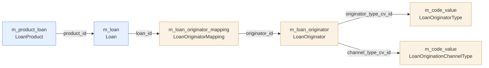
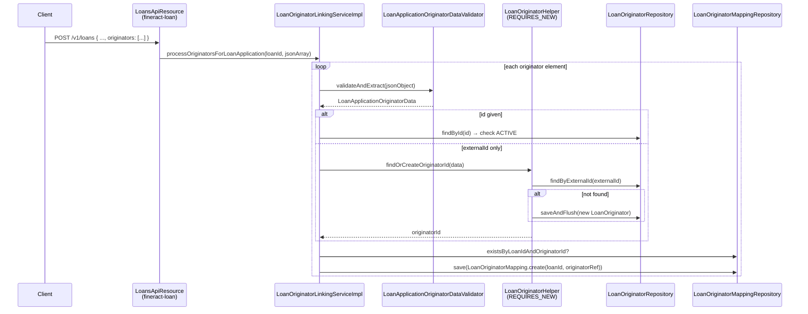

Apache Fineract's `fineract-loan-origination` Gradle module is an **optional**, feature-flagged extension that records *who originated a loan* — broker, merchant, marketing partner, branch agent — so the core loan can be filtered, reported, and revenue-shared by that party. The module ships its own JPA entities (`m_loan_originator`, `m_loan_originator_mapping`), two JAX-RS resources, a `LoanOriginatorWritePlatformService` orchestrating five command handlers, and three `DataEnricher`s that decorate `LoanAccountDataV1`, `LoanChargeDataV1`, and `LoanTransactionDataV1` Avro events with an `originators` array before they reach the external-events stream.

Everything in the module is gated by `fineract.module.loan-origination.enabled=true` (see `LoanOriginationModuleIsEnabledCondition` and the `@ConditionalOnProperty` annotation on every Spring bean). When the flag is off, the originator tables remain empty, the `LoanOriginatorApiResource` and `LoanOriginatorsApiResource` JAX-RS components are not registered, no handlers are loaded, and the Avro enrichers are not wired — meaning the published `LoanAccountDataV1` events keep their `originators` field as `null`. This page is the entry point: it inventories every file under `fineract-loan-origination/src/main/java/.../portfolio/loanorigination/`, sketches the relationships, and links to the deeper pages.

## Module purpose

<CardGroup cols={2}>
  <Card title="Track origination source" icon="seedling">
    Persist `LoanOriginator` records (broker, merchant, partner) and link them to one or more loans through `LoanOriginatorMapping`. Each originator carries an external ID, a status, an originator type code, and a channel type code.
  </Card>
  <Card title="Wire into loan applications" icon="link">
    During loan application submission, `LoanOriginatorLinkingServiceImpl` reads an `originators` JSON array, resolves or creates each originator via `LoanOriginatorHelper`, and writes the mapping rows.
  </Card>
  <Card title="Manage out-of-band" icon="server">
    A dedicated `/v1/loan-originators` JAX-RS resource exposes CRUD plus attach/detach endpoints on `/v1/loans/{loanId}/originators/...`, dispatched through the standard `PortfolioCommandSourceWritePlatformService` command pipeline.
  </Card>
  <Card title="Decorate event payloads" icon="paintbrush">
    Three `DataEnricher` implementations (`LoanAccountDataV1OriginatorEnricher`, `LoanChargeDataV1OriginatorEnricher`, `LoanTransactionDataV1OriginatorEnricher`) populate `OriginatorDetailsV1` on Avro events so downstream consumers see who originated the loan.
  </Card>
</CardGroup>

## Entity relationship at a glance



The relationship is **many-to-many through a join table**: one loan can carry several originators (a broker plus a sub-broker, for example), and one originator usually appears on hundreds of loans. The join entity is intentionally thin — `loan_id`, `originator_id`, and audit columns — because every originator-level attribute (name, status, type, channel) lives on `LoanOriginator` itself.

## File inventory — production code

### `api/` — JAX-RS resources and constants

| File | Lines | Role |
| --- | --- | --- |
| `LoanOriginatorApiResource.java` | ~190 | CRUD endpoints under `/v1/loan-originators` |
| `LoanOriginatorsApiResource.java` | ~270 | Attach/detach and list endpoints under `/v1/loans/{loanId}/originators/...` |
| `LoanOriginatorApiResourceSwagger.java` | ~90 | OpenAPI request/response schema classes |
| `LoanOriginatorApiConstants.java` | 47 | `RESOURCE_NAME`, parameter names, code-value code names, allowed param sets |

### `config/` — feature flag

| File | Lines | Role |
| --- | --- | --- |
| `LoanOriginationModuleIsEnabledCondition.java` | 23 | `PropertiesCondition` reading `fineract.module.loan-origination.enabled` |

### `data/` — module-local DTOs

| File | Purpose |
| --- | --- |
| `LoanApplicationOriginatorData.java` | Carrier extracted from the `originators` JSON array on the loan-application request: `id`, `externalId`, `name`, `typeId`, `channelTypeId` |
| `LoanOriginatorRequestData.java` | Swagger-annotated request body for `POST /v1/loan-originators` |
| `LoanOriginatorMappingResponse.java` | Response of attach/detach endpoints: `loanId`, `loanExternalId`, `originatorId`, `originatorExternalId` |
| `LoanOriginatorTemplateData.java` | `GET /v1/loan-originators/template` payload: external-id suggestion, status options, code-value option lists |
| `LoanOriginatorsResponse.java` | Wrapper around `List<LoanOriginatorData>` for the loan-scoped list endpoint |

The shared, cross-module DTO `LoanOriginatorData` lives in **fineract-core** at `fineract-core/src/main/java/org/apache/fineract/portfolio/loanorigination/data/LoanOriginatorData.java`. Keeping it in core lets other modules (e.g. event consumers, reports) reference originator data without depending on the optional `fineract-loan-origination` jar.

### `domain/` — JPA entities, enums, repositories

| File | Purpose |
| --- | --- |
| `LoanOriginator.java` | `@Entity` on `m_loan_originator`. Fields: `externalId`, `name`, `status`, `originatorType` (FK to code value), `channelType` (FK to code value). |
| `LoanOriginatorMapping.java` | `@Entity` on `m_loan_originator_mapping`. Fields: `loanId`, `originator`. |
| `LoanOriginatorStatus.java` | Enum: `ACTIVE`, `PENDING`, `INACTIVE`. |
| `LoanOriginatorRepository.java` | Spring-Data JPA repo, including `findAllWithCodeValues()` and `findByExternalIdWithCodeValues(...)` JOIN-FETCH queries. |
| `LoanOriginatorMappingRepository.java` | Spring-Data JPA repo with `findByLoanIdWithOriginatorDetails(...)`, `existsByOriginatorId(...)`, `deleteByLoanIdAndOriginatorId(...)`. |

### `enricher/` — Avro event enrichers

| File | Avro target | Field added |
| --- | --- | --- |
| `LoanAccountDataV1OriginatorEnricher.java` | `LoanAccountDataV1` | `originators: List<OriginatorDetailsV1>` |
| `LoanChargeDataV1OriginatorEnricher.java` | `LoanChargeDataV1` | `originators: List<OriginatorDetailsV1>` |
| `LoanTransactionDataV1OriginatorEnricher.java` | `LoanTransactionDataV1` | `originators: List<OriginatorDetailsV1>` |
| `LoanOriginatorAvroMapper.java` | helper | Builds `OriginatorDetailsV1` from `LoanOriginator` entity |

### `exception/` — typed errors

| File | Error key |
| --- | --- |
| `LoanNotInSubmittedStatusException.java` | `error.msg.loan.not.in.submitted.status` |
| `LoanOriginatorCannotBeDeletedException.java` | `error.msg.loan.originator.cannot.be.deleted.mapped.to.loan` |
| `LoanOriginatorCreationNotAllowedException.java` | `error.msg.loan.originator.creation.not.allowed` |
| `LoanOriginatorDuplicateExternalIdException.java` | `error.msg.loan.originator.duplicate.external.id` |
| `LoanOriginatorInvalidStatusException.java` | `error.msg.loan.originator.invalid.status` |
| `LoanOriginatorMappingAlreadyExistsException.java` | `error.msg.loan.originator.mapping.already.exists` |
| `LoanOriginatorMappingNotFoundException.java` | `error.msg.loan.originator.mapping.not.found` |
| `LoanOriginatorNotActiveException.java` | `error.msg.loan.originator.not.active` |
| `LoanOriginatorNotFoundException.java` | `error.msg.loan.originator.id.not.found`, `.external.id.not.found` |

### `handler/` — @CommandType dispatchers

| File | `@CommandType(entity, action)` | Calls |
| --- | --- | --- |
| `CreateLoanOriginatorCommandHandler.java` | `LOAN_ORIGINATOR`, `CREATE` | `writePlatformService.create(command)` |
| `UpdateLoanOriginatorCommandHandler.java` | `LOAN_ORIGINATOR`, `UPDATE` | `writePlatformService.update(command.entityId(), command)` |
| `DeleteLoanOriginatorCommandHandler.java` | `LOAN_ORIGINATOR`, `DELETE` | `writePlatformService.delete(command.entityId())` |
| `AttachLoanOriginatorCommandHandler.java` | `LOAN_ORIGINATOR`, `ATTACH` | `writePlatformService.attachOriginatorToLoan(command.getLoanId(), command.subentityId())` |
| `DetachLoanOriginatorCommandHandler.java` | `LOAN_ORIGINATOR`, `DETACH` | `writePlatformService.detachOriginatorFromLoan(command.getLoanId(), command.subentityId())` |

### `mapper/` — MapStruct

| File | Purpose |
| --- | --- |
| `LoanOriginatorMapper.java` | MapStruct interface mapping `LoanOriginator → LoanOriginatorData`. Uses `CodeValueMapper` for nested code-value fields. |

### `serialization/` — JSON validators

| File | Purpose |
| --- | --- |
| `LoanOriginatorDataValidator.java` | `validateForCreate(json)` and `validateForUpdate(json)` used by the write service |
| `LoanApplicationOriginatorDataValidator.java` | Validates one element of the `originators` array on the loan-application JSON |

### `service/` — orchestration

| File | Purpose |
| --- | --- |
| `LoanOriginatorWritePlatformService.java` | Interface: `create`, `update`, `delete`, `attachOriginatorToLoan`, `detachOriginatorFromLoan` |
| `LoanOriginatorWritePlatformServiceImpl.java` | All write logic, validation, exception throwing, status/mapping guards |
| `LoanOriginatorReadPlatformService.java` | Interface for reads + template + `retrieveByLoanId` |
| `LoanOriginatorReadPlatformServiceImpl.java` | MapStruct-driven read implementation |
| `LoanOriginatorHelper.java` | `@Transactional(REQUIRES_NEW)` find-or-create used during loan application |
| `LoanOriginatorLinkingServiceImpl.java` | Implements `LoanOriginatorLinkingService` (declared in fineract-core); consumed by the loan-application path |

## End-to-end attach flow

The most representative flow is **attach originator during loan application** because it crosses the loan and originator subsystems and shows how the optional module hooks into the core loan-creation path.



Key choices visible in the source:

- **`@Transactional(propagation = Propagation.REQUIRES_NEW)`** on `LoanOriginatorHelper.findOrCreateOriginatorId`. A unique-constraint violation on `external_id` is caught in `LoanOriginatorLinkingServiceImpl.findOrCreateOriginatorIdByExternalId`; because the insert ran in its own transaction, the caller's session is not poisoned and the call is safely retried.
- **`ENABLE_ORIGINATOR_CREATION_DURING_LOAN_APPLICATION`** global configuration property. If absent or disabled, `LoanOriginatorCreationNotAllowedException` is thrown when an unknown external ID arrives.
- **In-memory de-duplication** via a `Set<Long> attachedOriginatorIds` so the same originator listed twice in the same request body is mapped only once.

## Standalone command path

When the originator is created or maintained outside the loan-application flow, the journey goes through the standard CQRS pipeline documented under [Command Framework Overview](/command/overview):

```mermaid
flowchart LR
    Api[LoanOriginatorApiResource<br/>or LoanOriginatorsApiResource]
    Wrapper[CommandWrapperBuilder<br/>.createLoanOriginator etc.]
    Source[PortfolioCommandSourceWritePlatformService<br/>.logCommandSource]
    Handler[*LoanOriginatorCommandHandler<br/>@CommandType LOAN_ORIGINATOR + action]
    Service[LoanOriginatorWritePlatformServiceImpl]
    Db[(m_loan_originator<br/>m_loan_originator_mapping)]

    Api --> Wrapper --> Source --> Handler --> Service --> Db
```

`CommandWrapperBuilder` exposes `createLoanOriginator()`, `updateLoanOriginator(id)`, `deleteLoanOriginator(id)`, `attachLoanOriginator(loanId, originatorId)`, and `detachLoanOriginator(loanId, originatorId)` — each sets `entityName = "LOAN_ORIGINATOR"` and a distinct `actionName`. The handler registry resolves the right handler by entity + action combination.

## Configuration knobs

<AccordionGroup>
  <Accordion title="fineract.module.loan-origination.enabled" icon="toggle-on">
    Boolean. Every bean in the module — JAX-RS resources, handlers, write/read services, validators, enrichers, the Avro mapper — carries `@ConditionalOnProperty(value = "fineract.module.loan-origination.enabled", havingValue = "true")`. When `false` (the default in some deployments) nothing in the module is loaded.
  </Accordion>
  <Accordion title="ENABLE_ORIGINATOR_CREATION_DURING_LOAN_APPLICATION" icon="user-plus">
    Global configuration property in `c_configuration`. When enabled, `LoanOriginatorHelper` will create a new `LoanOriginator` on the fly during loan application if the supplied `externalId` is unknown. When disabled, `LoanOriginatorCreationNotAllowedException` is raised. Managed via the standard global-config admin API.
  </Accordion>
  <Accordion title="LoanOriginatorType code" icon="tag">
    `m_code` with `code_name = 'LoanOriginatorType'`. Each `m_code_value` row enumerates an allowable originator type (broker, merchant, partner...). Referenced via `LoanOriginator.originatorType` FK.
  </Accordion>
  <Accordion title="LoanOriginationChannelType code" icon="tag">
    `m_code` with `code_name = 'LoanOriginationChannelType'`. Each `m_code_value` row enumerates an allowable channel (web, mobile, branch...). Referenced via `LoanOriginator.channelType` FK.
  </Accordion>
</AccordionGroup>

## How the enrichers plug in

External-event consumers receive `LoanAccountDataV1` / `LoanChargeDataV1` / `LoanTransactionDataV1` payloads. The Fineract event-publishing layer applies all matching `DataEnricher` beans before serialization. Each originator enricher:

1. Checks `isDataTypeSupported(Class)` so it only fires for its Avro class.
2. Reads the loan ID from the payload (`getId()` for accounts, `getLoanId()` for charges/transactions).
3. Calls `LoanOriginatorMappingRepository.findByLoanIdWithOriginatorDetails(loanId)` — a single JOIN-FETCH query that loads originators plus both code-value rows.
4. Delegates to `LoanOriginatorAvroMapper.toAvro(LoanOriginator)` to build `OriginatorDetailsV1`.
5. Sets the resulting `List<OriginatorDetailsV1>` on the payload via `data.setOriginators(...)` when non-empty.

See [Enrichers](/loan-origination/enrichers) for the per-class breakdown.

## Database schema reference

The module ships two tables under the standard `m_` (master) prefix. Both inherit Fineract's audit columns (`created_at`, `created_by`, `last_modified_at`, `last_modified_by`) through `AbstractAuditableWithUTCDateTimeCustom`.

### `m_loan_originator`

| Column | Type | Constraints | Mapped on `LoanOriginator` |
| --- | --- | --- | --- |
| `id` | `BIGINT` | PK, auto-increment | `id` (inherited) |
| `external_id` | `VARCHAR(100)` | `NOT NULL`, `UNIQUE` | `externalId` (wrapped in `ExternalId`) |
| `name` | `VARCHAR(255)` | nullable | `name` |
| `status` | `VARCHAR(20)` | `NOT NULL` | `status` (`@Enumerated(EnumType.STRING)`) |
| `originator_type_cv_id` | `BIGINT` | FK → `m_code_value(id)`, nullable | `originatorType` (lazy ManyToOne) |
| `channel_type_cv_id` | `BIGINT` | FK → `m_code_value(id)`, nullable | `channelType` (lazy ManyToOne) |

The two code-value FKs reference `m_code_value` rows whose parent `m_code.code_name` is `LoanOriginatorType` or `LoanOriginationChannelType` respectively. The validators do not check the parent `code_name` at the database level — instead `CodeValueRepositoryWrapper.findOneByCodeNameAndIdWithNotFoundDetection(codeName, codeValueId)` enforces it on the way in.

### `m_loan_originator_mapping`

| Column | Type | Constraints | Mapped on `LoanOriginatorMapping` |
| --- | --- | --- | --- |
| `id` | `BIGINT` | PK, auto-increment | `id` (inherited) |
| `loan_id` | `BIGINT` | `NOT NULL`, logical FK → `m_loan(id)` | `loanId` (plain `Long`, no JPA association) |
| `originator_id` | `BIGINT` | `NOT NULL`, FK → `m_loan_originator(id)` | `originator` (lazy ManyToOne) |

Composite uniqueness of `(loan_id, originator_id)` is enforced at the **application** layer through `existsByLoanIdAndOriginatorId(...)`. A future migration could add a unique index for belt-and-braces protection.

## Permission catalogue

| Permission | Action | Where enforced |
| --- | --- | --- |
| `READ_LOAN_ORIGINATOR` | List, retrieve, template | `LoanOriginatorApiResource` via `validateHasReadPermission("LOAN_ORIGINATOR")` |
| `CREATE_LOAN_ORIGINATOR` | Create originator | Command pipeline (entity `LOAN_ORIGINATOR`, action `CREATE`) |
| `UPDATE_LOAN_ORIGINATOR` | Update originator | Command pipeline (action `UPDATE`) |
| `DELETE_LOAN_ORIGINATOR` | Delete originator | Command pipeline (action `DELETE`) |
| `ATTACH_LOAN_ORIGINATOR` | Attach originator to loan | Command pipeline (action `ATTACH`) |
| `DETACH_LOAN_ORIGINATOR` | Detach originator from loan | Command pipeline (action `DETACH`) |
| `READ_LOAN` | List originators of a loan | `LoanOriginatorsApiResource` reuses the loan read permission |

Permissions can be flagged for maker-checker through the standard Fineract permission admin; when the flag is on, the handler still runs but its transaction is rolled back, and the `CommandSource` row is parked in `AWAITING_APPROVAL`.

## Where to go next

<CardGroup cols={2}>
  <Card title="Originator Domain" icon="database" href="/loan-origination/originator-domain">
    The `LoanOriginator` and `LoanOriginatorMapping` entities, their repositories, and the read/write services.
  </Card>
  <Card title="Origination API" icon="server" href="/loan-origination/origination-api">
    Per-endpoint table of every JAX-RS method, path, handler, and command wrapper.
  </Card>
  <Card title="Enrichers" icon="paintbrush" href="/loan-origination/enrichers">
    The three Avro `DataEnricher` beans and the `LoanOriginatorAvroMapper`.
  </Card>
  <Card title="Command Handlers" icon="bolt" href="/loan-origination/origination-handlers">
    The five `@CommandType` handlers and what write-service method each invokes.
  </Card>
</CardGroup>

## Quick orientation table

| If you are looking for... | Start here |
| --- | --- |
| The JPA entity, repositories, status enum | [Originator Domain](/loan-origination/originator-domain) |
| A specific HTTP path / verb on `/v1/loan-originators` or `/v1/loans/.../originators` | [Origination API](/loan-origination/origination-api) |
| Which write-service method a command resolves to | [Origination Handlers](/loan-origination/origination-handlers) |
| How the Avro `originators` array gets populated on events | [Enrichers](/loan-origination/enrichers) |
| The wider command pipeline (audit, idempotency, maker-checker) | [Command Framework Overview](/command/overview) |
| Loan aggregate concepts (status, repository wrappers) | [Loan Module Overview](/loan/overview) |

## Related pages

- [Loan Module Overview](/loan/overview) — how the broader loan account, schedule, and product code relates to this module.
- [Command Framework Overview](/command/overview) — the pipeline that drives every write through this module.
- [Loan Origination APIs](/api/loan-origination-apis) — REST reference (request bodies, response shapes, permissions).
