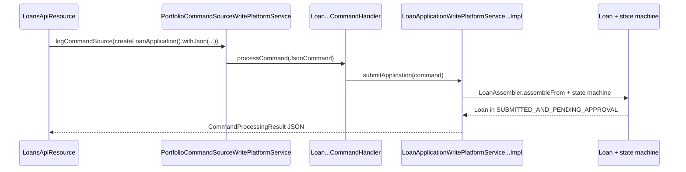

`LoanApplicationWritePlatformService` owns the **pre-active** half of the loan lifecycle in Apache Fineract: submission, modification, approval, undo-approval, rejection, withdrawal, deletion. Once a loan is disbursed (status `ACTIVE`), subsequent state changes go through `LoanWritePlatformService` instead — see [Loan write service](/loan/loan-write-service).

The interface lives in `fineract-loan/src/main/java/org/apache/fineract/portfolio/loanaccount/service/LoanApplicationWritePlatformService.java`; the JPA implementation is in `fineract-provider/src/main/java/org/apache/fineract/portfolio/loanaccount/service/LoanApplicationWritePlatformServiceJpaRepositoryImpl.java` (894 lines).

## Interface

```java
public interface LoanApplicationWritePlatformService {

    CommandProcessingResult submitApplication(JsonCommand command);

    CommandProcessingResult modifyApplication(Long loanId, JsonCommand command);

    CommandProcessingResult deleteApplication(Long loanId);

    CommandProcessingResult approveApplication(Long loanId, JsonCommand command);

    CommandProcessingResult undoApplicationApproval(Long loanId, JsonCommand command);

    CommandProcessingResult rejectApplication(Long loanId, JsonCommand command);

    CommandProcessingResult applicantWithdrawsFromApplication(Long loanId, JsonCommand command);

    CommandProcessingResult approveGLIMLoanAppication(Long loanId, JsonCommand command);
    CommandProcessingResult undoGLIMLoanApplicationApproval(Long loanId, JsonCommand command);
    CommandProcessingResult rejectGLIMApplicationApproval(Long glimId, JsonCommand command);
}
```

`disburse` and `undoDisbursal` live on `LoanWritePlatformService` even though they are still typically "application" operations — the split is historical.

## Implementation collaborators

```java
@Service
public class LoanApplicationWritePlatformServiceJpaRepositoryImpl
        implements LoanApplicationWritePlatformService {

    private final PlatformSecurityContext context;
    private final LoanApplicationTransitionValidator loanApplicationTransitionValidator;
    private final LoanApplicationValidator           loanApplicationValidator;
    private final LoanRepositoryWrapper              loanRepositoryWrapper;
    private final NoteRepository                     noteRepository;
    private final LoanAssembler                      loanAssembler;
    private final CalendarRepository                 calendarRepository;
    private final CalendarInstanceRepository         calendarInstanceRepository;
    private final SavingsAccountRepositoryWrapper    savingsAccountRepository;
    private final AccountAssociationsRepository      accountAssociationsRepository;
    private final BusinessEventNotifierService       businessEventNotifierService;
    private final LoanScheduleAssembler              loanScheduleAssembler;
    private final LoanUtilService                    loanUtilService;
    private final CalendarReadPlatformService        calendarReadPlatformService;
    private final EntityDatatableChecksWritePlatformService entityDatatableChecksWritePlatformService;
    private final GLIMAccountInfoRepository          glimRepository;
    private final LoanRepository                     loanRepository;
    private final GSIMReadPlatformService            gsimReadPlatformService;
    private final LoanLifecycleStateMachine          loanLifecycleStateMachine;
    private final LoanAccrualsProcessingService      loanAccrualsProcessingService;
    private final LoanDownPaymentTransactionValidator loanDownPaymentTransactionValidator;
    private final LoanScheduleService                loanScheduleService;
    private final LoanOriginatorLinkingService       loanOriginatorLinkingService;
}
```

The two validator beans — `LoanApplicationValidator` and `LoanApplicationTransitionValidator` — separate "JSON shape correct" / "business state correct" checks. `LoanAssembler` and `LoanScheduleAssembler` are the heavy lifters that turn JSON into a `Loan` aggregate plus its schedule.

## Method-by-method walkthrough

### `submitApplication(JsonCommand)`

```java
@Transactional
@Override
public CommandProcessingResult submitApplication(final JsonCommand command) {
    this.loanApplicationValidator.validateForCreate(command);              // (1)
    final Loan loan = this.loanAssembler.assembleFrom(command);            // (2)
    this.loanApplicationValidator.validateForCreate(loan);                 // (3)
    this.loanRepositoryWrapper.saveAndFlush(loan);                         // (4)
    this.loanAssembler.accountNumberGeneration(command, loan);             // (5)
    if (loan.getLoanProduct().isInterestRecalculationEnabled()) {
        createAndPersistCalendarInstanceForInterestRecalculation(loan);    // (6)
    }
    final String submittedOnNote = command.stringValueOfParameterNamed("submittedOnNote");
    createNote(submittedOnNote, loan);                                     // (7)
    createCalendar(command, loan);                                         // (8)
    final Long savingsAccountId = command.longValueOfParameterNamed("linkAccountId");
    createSavingsAccountAssociation(savingsAccountId, loan);               // (9)
    if (command.parameterExists(LoanApiConstants.datatables)) {
        this.entityDatatableChecksWritePlatformService.saveDatatables(    // (10)
            StatusEnum.CREATE.getValue(), EntityTables.LOAN.getName(),
            loan.getId(), loan.productId(),
            command.arrayOfParameterNamed(LoanApiConstants.datatables));
    }
    loanRepositoryWrapper.flush();
    this.entityDatatableChecksWritePlatformService.runTheCheckForProduct( // (11)
        loan.getId(), EntityTables.LOAN.getName(), StatusEnum.CREATE.getValue(),
        EntityTables.LOAN.getForeignKeyColumnNameOnDatatable(), loan.productId());
    // … originator linking, business event …
    businessEventNotifierService.notifyPostBusinessEvent(new LoanCreatedBusinessEvent(loan));
    return CommandProcessingResultBuilder.…  withLoanId(loan.getId()).build();
}
```

1. **JSON validation** — checks shape (required fields, type, dates parseable).
2. **Assembly** — `LoanAssembler.assembleFrom(command)` resolves `clientId` / `groupId` / `productId`, picks the transaction processor (`LoanRepaymentScheduleTransactionProcessorFactory`), builds `LoanApplicationTerms`, calls the `LoanScheduleAssembler` to generate the initial schedule, materialises `LoanCharge` rows, returns a `Loan` entity in status `SUBMITTED_AND_PENDING_APPROVAL`.
3. **Domain validation** — runs validators that need the assembled `Loan` (e.g. principal ≥ product min, repayments count ≤ product max).
4. **Save + flush** — needed so the `Loan.id` exists for downstream associations.
5. **Account number generation** — sometimes the account number is generated server-side from the loan id.
6. **Interest-recalc calendar** — if the product has interest recalculation, a `CalendarInstance` (driving the recalc compounding window) is created.
7. **Note** — optional `submittedOnNote` is persisted.
8. **Calendar** — group meeting calendar association if `syncDisbursementWithMeeting`.
9. **Linked savings account** — `m_account_associations` row.
10. **Datatables** — caller-supplied datatable rows.
11. **Datatable checks** — verifies every mandatory datatable row exists for the product (see `EntityDatatableChecksWritePlatformService`).
12. **Business event** — `LoanCreatedBusinessEvent`.

### `modifyApplication(Long, JsonCommand)`

Only allowed while the loan is in status `SUBMITTED_AND_PENDING_APPROVAL`. Walks the same assembler/validator path as `submit`, then writes a `LoanProductRelatedDetail` diff, regenerates the schedule, and emits `LoanUpdatedBusinessEvent`. Many fields can change (principal, term, EMI, charges, expected disbursement date, collateral) but the validator rejects changes that would require approval/disbursal (e.g. interest method).

### `deleteApplication(Long)`

```java
@Override
public CommandProcessingResult deleteApplication(final Long loanId) {
    final Loan loan = retrieveLoanBy(loanId);
    loanApplicationTransitionValidator.checkClientOrGroupActive(loan);

    if (loan.isNotSubmittedAndPendingApproval()) {
        throw new LoanApplicationNotInSubmittedAndPendingApprovalStateCannotBeDeleted(loanId);
    }

    final List<Note> relatedNotes = this.noteRepository.findByLoanId(loan.getId());
    this.noteRepository.deleteAllInBatch(relatedNotes);

    final AccountAssociations accountAssociations = this.accountAssociationsRepository.findByLoanIdAndType(
        loanId, AccountAssociationType.LINKED_ACCOUNT_ASSOCIATION.getValue());
    if (accountAssociations != null) {
        this.accountAssociationsRepository.delete(accountAssociations);
    }

    Set<LoanCollateralManagement> loanCollateralManagements = loan.getLoanCollateralManagements();
    for (LoanCollateralManagement loanCollateralManagement : loanCollateralManagements) {
        BigDecimal quantity = loanCollateralManagement.getQuantity();
        ClientCollateralManagement clientCollateralManagement = loanCollateralManagement.getClientCollateralManagement();
        clientCollateralManagement.updateQuantityAfterLoanClosed(quantity);
        loanCollateralManagement.setIsReleased(true);
        loanCollateralManagement.setClientCollateralManagement(clientCollateralManagement);
    }

    this.loanRepositoryWrapper.delete(loanId);
    return new CommandProcessingResultBuilder() //
            .withEntityId(loanId) // … .build();
}
```

Notes:

- **Status guard**: only deletable while pending approval.
- **Collateral released**: client-level collateral is restored before the loan row is deleted.
- **Cascade**: `Loan.charges`, `Loan.repaymentScheduleInstallments`, `Loan.loanTransactions`, `Loan.disbursementDetails` all cascade-delete via JPA. No explicit deletes needed on those.
- **No business event** for delete in this code path (the loan never existed externally — it was still pending).

### `approveApplication(Long, JsonCommand)`

```java
@Transactional
@Override
public CommandProcessingResult approveApplication(final Long loanId, final JsonCommand command) {
    final AppUser currentUser = getAppUserIfPresent();
    loanApplicationValidator.validateApproval(command, loanId);

    Pair<Loan, Map<String, Object>> loanAndChanges =
        loanScheduleAssembler.assembleLoanApproval(currentUser, command, loanId);
    final Loan loan = loanAndChanges.getLeft();
    final Map<String, Object> changes = loanAndChanges.getRight();

    if (!changes.isEmpty()) {
        final String noteText = command.stringValueOfParameterNamed("note");
        createNote(noteText, loan).ifPresent(note -> changes.put("note", noteText));
        businessEventNotifierService.notifyPostBusinessEvent(new LoanApprovedBusinessEvent(loan));
    }

    return new CommandProcessingResultBuilder()
            .withCommandId(command.commandId())
            .withEntityId(loan.getId())
            .withEntityExternalId(loan.getExternalId())
            .withOfficeId(loan.getOfficeId())
            .withClientId(loan.getClientId())
            .withGroupId(loan.getGroupId())
            .withLoanId(loanId)
            .with(changes)
            .build();
}
```

`LoanScheduleAssembler.assembleLoanApproval` performs the heavy work:

- Reads `approvedOnDate`, `approvedLoanAmount`, `expectedDisbursementDate` from the JSON.
- Reapplies any approved-vs-proposed differences (the principal may shrink).
- Calls `Loan.loanApplicationApproval(...)` which:
  - Calls the lifecycle state machine: `SUBMITTED_AND_PENDING_APPROVAL` → `APPROVED`.
  - Sets `approvedOnDate`, `approvedPrincipal`, `approvedBy`.
  - Regenerates the schedule for the approved principal.
- Returns a diff map that captures every field that changed for the API response.

The `LoanApprovedBusinessEvent` triggers downstream listeners (notification, audit, etc.).

### `undoApplicationApproval(Long, JsonCommand)`

Reverses an approval. `Loan.undoApproval()` clears `approvedOnDate`, `approvedBy`, sets status back to `SUBMITTED_AND_PENDING_APPROVAL`, and re-generates the schedule for `proposedPrincipal`. Emits `LoanUndoApprovalBusinessEvent`.

### `rejectApplication(Long, JsonCommand)`

Only allowed when status is `SUBMITTED_AND_PENDING_APPROVAL`. Sets `loanStatus = REJECTED`, `rejectedOnDate`, `rejectedBy`. Persists a rejection note. Emits `LoanRejectedBusinessEvent`.

### `applicantWithdrawsFromApplication(Long, JsonCommand)`

Same shape as reject but with status `WITHDRAWN_BY_CLIENT` and `withdrawnOnDate`, `withdrawnBy`. Emits `LoanWithdrawnByApplicantBusinessEvent`.

### GLIM variants

`approveGLIMLoanAppication`, `undoGLIMLoanApplicationApproval`, `rejectGLIMApplicationApproval` accept the parent GLIM id, iterate every child loan, and dispatch the per-child write. The parent `GroupLoanIndividualMonitoringAccount.loanStatus` is bumped only after all children transition successfully.

```java
@Override
public CommandProcessingResult approveGLIMLoanAppication(final Long loanId, final JsonCommand command) {
    GroupLoanIndividualMonitoringAccount parentLoan = glimRepository.findById(loanId).orElseThrow();
    JsonArray approvalFormData = command.arrayOfParameterNamed("approvalFormData");

    Long[] childLoanId = new Long[approvalFormData.size()];
    for (int i = 0; i < approvalFormData.size(); i++) {
        JsonObject jsonObject = approvalFormData.get(i).getAsJsonObject();
        childLoanId[i] = jsonObject.get("loanId").getAsLong();
    }

    int count = 0, j = 0;
    CommandProcessingResult result = null;
    for (JsonElement approvals : approvalFormData) {
        // dispatch approveApplication(childLoanId[j], childCommand)
        // increment count; when count == parentLoan.getChildAccountsCount(), promote parent to APPROVED
        j++;
    }
    return result;
}
```

The actual loop dispatches the JSON to `this.approveApplication(...)` per child.

## Command dispatch path

These methods are not called directly by the REST resource. The flow is:



Per command, the `CommandWrapperBuilder` verb and the handler bean:

| Builder verb | Resource path | Handler bean | Service method |
| --- | --- | --- | --- |
| `createLoanApplication()` | `POST /v1/loans` | `CreateLoanApplicationCommandHandler` | `submitApplication` |
| `updateLoanApplication(loanId)` | `PUT /v1/loans/{loanId}` | `UpdateLoanApplicationCommandHandler` | `modifyApplication` |
| `deleteLoanApplication(loanId)` | `DELETE /v1/loans/{loanId}` | `DeleteLoanApplicationCommandHandler` | `deleteApplication` |
| `approveLoanApplication(loanId)` | `POST /v1/loans/{loanId}?command=approve` | `ApproveLoanApplicationCommandHandler` | `approveApplication` |
| `undoLoanApplicationApproval(loanId)` | `?command=undoapproval` | `UndoLoanApplicationApprovalCommandHandler` | `undoApplicationApproval` |
| `rejectLoanApplication(loanId)` | `?command=reject` | `LoanApplicationRejectedCommandHandler` | `rejectApplication` |
| `withdrawLoanApplication(loanId)` | `?command=withdrawnByApplicant` | `LoanApplicationWithdrawnByApplicantCommandHandler` | `applicantWithdrawsFromApplication` |
| `approveGLIMLoan(loanId)` | `POST /v1/loans/glimAccount/{glimId}?command=approve` | `ApproveGLIMLoanCommandHandler` | `approveGLIMLoanAppication` |

The handler beans live in `fineract-provider/.../portfolio/loanaccount/handler/`. Each one is annotated `@CommandType(entity = "LOAN", action = "...")` and is found by the `CommandHandlerProvider` at command execution time. See [Command source pipeline](/command/portfolio-command-source).

## Validators

`LoanApplicationValidator` covers JSON-shape and domain-state. It has these public methods:

```java
void validateForCreate(JsonCommand command);
void validateForCreate(Loan loan);
void validateApproval(JsonCommand command, Long loanId);
void validateForModify(JsonCommand command, Loan loan);
void validateGuarantorJsonInput(JsonCommand command);
…
```

`LoanApplicationTransitionValidator` covers the transition between states:

```java
void checkClientOrGroupActive(Loan loan);
void validateForUndoApproval(Loan loan);
void validateRejected(Loan loan);
void validateWithdrawn(Loan loan);
```

Both throw `PlatformApiDataValidationException` (mapped to HTTP 400) on failure — see [Error handling](/runtime/error-handling).

## LoanAssembler

`LoanAssembler` (in `fineract-loan/.../service/LoanAssembler.java`) is invoked from `submitApplication` and `modifyApplication`. Its main entry point:

```java
public Loan assembleFrom(JsonCommand command) {
    // (1) resolve client/group/product/fund/officer/purpose
    // (2) parse loanCharges, collateral, disbursementDetails, rates from JSON
    // (3) pick the transaction processor via LoanRepaymentScheduleTransactionProcessorFactory
    // (4) call LoanScheduleAssembler.assembleLoanApplicationTerms(command, …)
    // (5) call LoanScheduleAssembler.assembleLoanScheduleFrom(loanApplicationTerms, charges, …)
    //     to generate the initial schedule (returns LoanScheduleModel)
    // (6) call Loan.newIndividualLoanApplication / newGroupLoanApplication / newIndividualLoanApplicationFromGroup
    // (7) materialise LoanRepaymentScheduleInstallment rows from the LoanScheduleModel
    // (8) attach charges, disbursement details
    // (9) return the Loan in SUBMITTED_AND_PENDING_APPROVAL
}
```

`accountNumberGeneration(command, loan)` is called after the first flush — it either uses the caller-supplied account number or generates one from the platform's `AccountNumberGenerator`.

## Transaction boundary and locking

Every public method is `@Transactional`. The optimistic-lock `@Version` on `Loan` will throw `ObjectOptimisticLockingFailureException` if two operations race on the same loan; the runtime maps this to HTTP 409. See [Error handling](/runtime/error-handling) for the conversion details.

For GLIM operations, the inner loop is **not** sub-transactional — if a child loan approval fails, the surrounding transaction rolls back everything. This is by design.

## Cross-references

<CardGroup cols={2}>
  <Card title="Loan domain model" icon="database" href="/loan/loan-domain-model">
    The `Loan` entity and `LoanStatus` enum that this service mutates.
  </Card>
  <Card title="Loan write service" icon="pen-to-square" href="/loan/loan-write-service">
    Where the active-loan lifecycle continues (disburse, repay, write-off).
  </Card>
  <Card title="Schedule generator" icon="table" href="/loan/loan-schedule-generator">
    The `LoanScheduleAssembler` and the generators used during `submitApplication` and `approveApplication`.
  </Card>
  <Card title="Loans API" icon="globe" href="/loan/loans-api">
    The REST endpoints (`POST /v1/loans`, `?command=approve`, etc.) that dispatch into this service.
  </Card>
  <Card title="Command pipeline" icon="diagram-project" href="/command/portfolio-command-source">
    How `CommandWrapperBuilder` verbs reach the handlers and ultimately this service.
  </Card>
</CardGroup>
